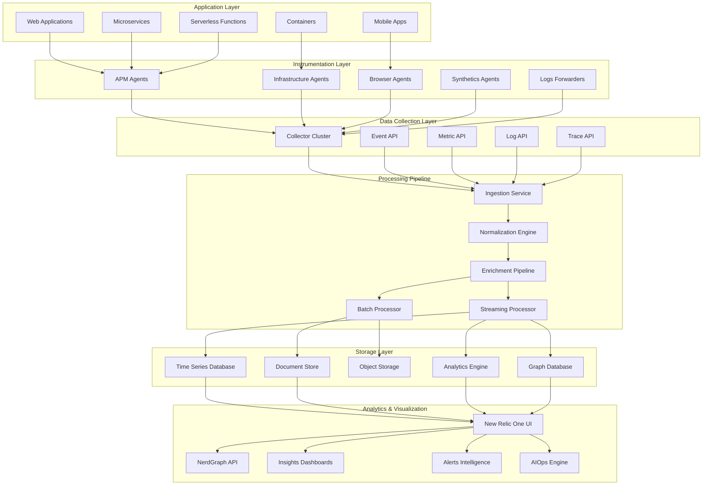

# New Relic Enterprise APM Platform 深度实践

> **Author**: Application Performance Monitoring Specialist | **Version**: v1.0 | **Update Time**: 2026-02-07
> **Scenario**: Enterprise-grade application performance monitoring | **Complexity**: ⭐⭐⭐⭐⭐

## 🎯 Abstract

This document provides comprehensive exploration of New Relic enterprise APM platform architecture design, deployment practices, and operational management. Based on large-scale production environment experience, it offers complete technical guidance from application instrumentation to business transaction monitoring, helping enterprises build intelligent, proactive application performance management systems.

## 1. New Relic Enterprise Architecture

### 1.1 Core Platform Components



### 1.2 Enterprise Deployment Architecture

```yaml
new_relic_enterprise_deployment:
  regions:
    - name: us-production
      collector_endpoints:
        - collector.newrelic.com
        - collector-001.newrelic.com
        - collector-002.newrelic.com
      data_center: aws-us-east-1
      
    - name: eu-production
      collector_endpoints:
        - collector.eu.newrelic.com
        - collector-001.eu.newrelic.com
      data_center: aws-eu-west-1
      
    - name: apac-production
      collector_endpoints:
        - collector.apm.newrelic.com
      data_center: aws-ap-southeast-1
  
  high_availability:
    load_balancing:
      global_dns: dns.newrelic-enterprise.com
      health_checks: tcp_port_443
      failover_time: 30s
    
    data_replication:
      primary_region: us-production
      secondary_regions: [eu-production, apac-production]
      sync_frequency: real_time
      rto: 15m
      rpo: 5m
```

## 2. Advanced APM Implementation

### 2.1 Custom Instrumentation Strategies

```java
// Java应用自定义instrumentation示例
import com.newrelic.api.agent.NewRelic;
import com.newrelic.api.agent.Trace;

@RestController
public class OrderController {
    
    @Autowired
    private OrderService orderService;
    
    @Trace(dispatcher = true)
    @PostMapping("/orders")
    public ResponseEntity<OrderResponse> createOrder(@RequestBody OrderRequest request) {
        // 添加自定义属性
        NewRelic.addCustomParameter("customer_id", request.getCustomerId());
        NewRelic.addCustomParameter("order_amount", String.valueOf(request.getAmount()));
        
        try {
            // 创建自定义segment用于详细追踪
            Segment databaseSegment = NewRelic.getAgent().getTransaction()
                .startSegment("database-operation");
            
            Order order = orderService.processOrder(request);
            
            databaseSegment.end();
            
            // 记录业务指标
            NewRelic.recordMetric("Custom/OrderProcessing/Success", 1);
            NewRelic.recordResponseTimeMetric("Custom/OrderProcessing/Duration", 
                calculateProcessingTime());
            
            return ResponseEntity.ok(new OrderResponse(order));
            
        } catch (Exception e) {
            // 错误追踪
            NewRelic.noticeError(e);
            NewRelic.recordMetric("Custom/OrderProcessing/Failure", 1);
            throw e;
        }
    }
    
    @Trace
    @GetMapping("/orders/{id}")
    public ResponseEntity<OrderDetails> getOrderDetails(@PathVariable String id) {
        // 分布式追踪上下文传递
        Map<String, String> headers = new HashMap<>();
        NewRelic.getAgent().getTransaction().insertDistributedTraceHeaders(headers);
        
        // 外部服务调用追踪
        Segment externalCall = NewRelic.getAgent().getTransaction()
            .startSegment("external-payment-service");
        
        PaymentInfo paymentInfo = paymentService.getPaymentInfo(id, headers);
        externalCall.end();
        
        return ResponseEntity.ok(new OrderDetails(paymentInfo));
    }
}
```

### 2.2 Infrastructure Monitoring Configuration

```yaml
# newrelic-infra.yml - 基础设施监控配置
integration_name: com.newrelic.infra.integrations

instances:
  - name: linux-host-monitoring
    command: metrics
    arguments:
      # 系统指标收集
      system_sample_rate: 15s
      process_sample_rate: 60s
      network_sample_rate: 30s
      
      # 自定义指标
      custom_metrics:
        - name: disk_io_utilization
          command: iostat -x 1 1 | awk '/^sd/ {print $1,$10}'
          
        - name: memory_pressure
          command: vmstat 1 1 | awk 'NR==3 {print $7}'
          
        - name: cpu_steal_time
          command: sar -u 1 1 | awk 'NR==4 {print $9}'
    
    labels:
      environment: production
      datacenter: us-east-1
      team: sre

  - name: container-monitoring
    command: docker
    arguments:
      # Docker指标
      docker_sample_rate: 30s
      collect_container_logs: true
      collect_container_metrics: true
      
      # Kubernetes集成
      kubernetes_enabled: true
      kube_state_metrics_url: http://kube-state-metrics:8080/metrics
      
    labels:
      cluster: production-cluster
      namespace: monitoring
```

### 2.3 Synthetic Monitoring Setup

```javascript
// New Relic Synthetics 脚本示例
const synthetics = require('Synthetics');
const log = require('SyntheticsLogger');

const checkoutFlowBlueprint = async function () {
    const page = await synthetics.getPage();
    
    // 设置页面超时
    await page.setDefaultTimeout(30000);
    
    try {
        // 步骤1: 访问主页
        await synthetics.step('Visit Homepage', async function () {
            await page.goto('https://shop.example.com', { waitUntil: 'networkidle0' });
            await page.waitForSelector('.product-grid');
        });
        
        // 步骤2: 搜索产品
        await synthetics.step('Search Product', async function () {
            await page.type('#search-input', 'wireless headphones');
            await page.click('#search-button');
            await page.waitForSelector('.search-results');
        });
        
        // 步骤3: 添加到购物车
        await synthetics.step('Add to Cart', async function () {
            await page.click('.add-to-cart-btn');
            await page.waitForSelector('.cart-notification');
        });
        
        // 步骤4: 结算流程
        await synthetics.step('Checkout Process', async function () {
            await page.click('.checkout-button');
            
            // 填写配送信息
            await page.type('#shipping-name', 'John Doe');
            await page.type('#shipping-address', '123 Main St');
            await page.type('#shipping-city', 'New York');
            
            // 选择配送方式
            await page.select('#shipping-method', 'standard');
            
            // 支付信息
            await page.type('#card-number', '4111111111111111');
            await page.type('#card-expiry', '12/25');
            await page.type('#card-cvv', '123');
            
            await page.click('#place-order');
        });
        
        // 验证订单确认
        await synthetics.step('Verify Order Confirmation', async function () {
            await page.waitForSelector('.order-confirmation');
            const orderNumber = await page.$eval('.order-number', el => el.textContent);
            log.info(`Order placed successfully: ${orderNumber}`);
        });
        
        // 性能指标收集
        const metrics = await page.metrics();
        log.info(`Page load time: ${metrics.Timestamp.value - metrics.NavigationStart.value}ms`);
        
    } catch (error) {
        log.error('Checkout flow failed:', error);
        throw error;
    }
};

exports.handler = async () => {
    return await checkoutFlowBlueprint();
};
```

## 3. Alerting and Intelligent Notifications

### 3.1 NRQL-Based Alerting Rules

```sql
-- 新智能告警规则示例

-- 1. 应用性能异常检测
SELECT 
    percentile(duration, 95) as p95_response_time,
    rate(apdex_score, 1 minute) as error_rate
FROM Transaction 
WHERE appName = 'ECommerce-API' 
AND transactionType = 'Web'
FACET host
SINCE 15 minutes ago
COMPARE WITH 1 hour ago

-- 2. 数据库性能下降预警
SELECT 
    average(databaseCallCount) as avg_db_calls,
    percentile(databaseDuration, 95) as p95_db_duration
FROM Transaction 
WHERE appName = 'Order-Service'
AND databaseDuration > 0
FACET databaseName
SINCE 30 minutes ago
TIMESERIES AUTO

-- 3. 业务交易量异常检测
SELECT 
    count(*) as transaction_count,
    uniqueCount(userId) as unique_users
FROM Transaction
WHERE transactionName = 'PurchaseFlow'
SINCE 1 day ago
COMPARE WITH 1 week ago
TIMESERIES 1 hour

-- 4. 微服务依赖关系监控
SELECT 
    average(duration) as avg_duration,
    percentage(count(*), WHERE error IS true) as error_percentage
FROM Span
WHERE serviceName = 'Payment-Service'
AND spanKind = 'SERVER'
FACET parent.serviceName
SINCE 1 hour ago
```

### 3.2 Advanced Alert Configuration

```yaml
# newrelic-alerts.yaml
alert_policies:
  - name: "Critical Application Performance"
    incident_preference: PER_POLICY
    channels:
      - email_channel
      - slack_channel
      - pagerduty_channel
    
    conditions:
      - type: "apm_app_metric"
        name: "High Response Time"
        entities: ["ECommerce-API", "Order-Service", "Payment-Service"]
        metric: "response_time_web_background"
        condition_scope: "application"
        terms:
          - priority: "critical"
            threshold: 2
            operator: "above"
            duration: 5
        
      - type: "apm_app_metric"
        name: "Error Rate Spike"
        entities: ["ECommerce-API"]
        metric: "error_percentage"
        condition_scope: "application"
        terms:
          - priority: "critical"
            threshold: 5
            operator: "above"
            duration: 2
            
      - type: "apm_jvm_metric"
        name: "JVM Heap Usage Critical"
        entities: ["ECommerce-API", "Order-Service"]
        metric: "heap_memory_usage"
        condition_scope: "instance"
        terms:
          - priority: "critical"
            threshold: 85
            operator: "above"
            duration: 3

  - name: "Infrastructure Health"
    incident_preference: PER_CONDITION
    channels:
      - email_channel
      - teams_channel
    
    conditions:
      - type: "infra_metric"
        name: "High CPU Usage"
        select_value: "cpuPercent"
        comparison: "above"
        critical_threshold:
          value: 85
          duration_minutes: 5
        warning_threshold:
          value: 75
          duration_minutes: 10
          
      - type: "infra_metric"
        name: "Low Disk Space"
        select_value: "diskUsedPercent"
        comparison: "above"
        critical_threshold:
          value: 90
          duration_minutes: 2
        warning_threshold:
          value: 80
          duration_minutes: 10
```

## 4. AIOps and Anomaly Detection

### 4.1 Machine Learning Configuration

```python
# newrelic-ml-anomaly-detection.py
import requests
import json
from datetime import datetime, timedelta
import numpy as np
from sklearn.ensemble import IsolationForest
from sklearn.preprocessing import StandardScaler

class NewRelicAnomalyDetector:
    def __init__(self, api_key, account_id):
        self.api_key = api_key
        self.account_id = account_id
        self.base_url = "https://api.newrelic.com/graphql"
        self.headers = {
            "API-Key": api_key,
            "Content-Type": "application/json"
        }
    
    def fetch_metrics_data(self, query, since_minutes=60):
        """获取New Relic指标数据"""
        graphql_query = {
            "query": f"""
            {{
              actor {{
                account(id: {self.account_id}) {{
                  nrql(query: "{query}") {{
                    results
                  }}
                }}
              }}
            }}
            """
        }
        
        response = requests.post(self.base_url, 
                               headers=self.headers, 
                               json=graphql_query)
        return response.json()
    
    def detect_anomalies(self, metric_data, contamination=0.1):
        """使用隔离森林检测异常"""
        # 数据预处理
        values = np.array([float(item['count']) for item in metric_data])
        timestamps = [item['timestamp'] for item in metric_data]
        
        # 标准化
        scaler = StandardScaler()
        scaled_values = scaler.fit_transform(values.reshape(-1, 1))
        
        # 异常检测
        iso_forest = IsolationForest(contamination=contamination, random_state=42)
        anomaly_labels = iso_forest.fit_predict(scaled_values)
        
        # 识别异常点
        anomalies = []
        for i, (timestamp, value, label) in enumerate(zip(timestamps, values, anomaly_labels)):
            if label == -1:  # -1表示异常
                anomalies.append({
                    'timestamp': timestamp,
                    'value': value,
                    'anomaly_score': iso_forest.decision_function(scaled_values)[i]
                })
        
        return anomalies
    
    def create_anomaly_alert(self, anomalies, metric_name):
        """为检测到的异常创建告警"""
        for anomaly in anomalies:
            alert_payload = {
                "eventType": "AnomalyDetected",
                "metricName": metric_name,
                "timestamp": anomaly['timestamp'],
                "value": anomaly['value'],
                "anomalyScore": anomaly['anomaly_score'],
                "severity": "CRITICAL" if anomaly['anomaly_score'] < -0.5 else "WARNING"
            }
            
            # 发送到New Relic事件API
            event_url = f"https://insights-collector.newrelic.com/v1/accounts/{self.account_id}/events"
            requests.post(event_url, 
                         headers={"X-Insert-Key": self.api_key},
                         json=alert_payload)

# 使用示例
detector = NewRelicAnomalyDetector("your_api_key", 1234567)

# 查询应用响应时间数据
nrql_query = """
SELECT average(duration) as avg_duration, count(*) as request_count
FROM Transaction 
WHERE appName = 'ECommerce-API' 
SINCE 24 hours ago 
TIMESERIES 5 minutes
"""

# 获取数据并检测异常
data = detector.fetch_metrics_data(nrql_query)
anomalies = detector.detect_anomalies(data['data']['actor']['account']['nrql']['results'])
detector.create_anomaly_alert(anomalies, "ECommerce-API Response Time")
```

### 4.2 Predictive Analytics Implementation

```sql
-- 预测性分析NRQL查询

-- 1. 资源使用趋势预测
SELECT 
    predict(linear, duration, 1 hour, 12) as predicted_duration,
    derivative(duration, 1 minute) as rate_of_change
FROM Transaction
WHERE appName = 'Database-Service'
SINCE 1 week ago
TIMESERIES 1 hour

-- 2. 用户行为模式分析
SELECT 
    funnel(session_start as step1, 
           product_view as step2, 
           add_to_cart as step3, 
           checkout as step4, 
           purchase_complete as step5),
    percentage(count(*), WHERE step5 IS NOT NULL) as conversion_rate
FROM PageAction
WHERE session IS NOT NULL
SINCE 1 day ago
FACET countryCode

-- 3. 容量规划预测
SELECT 
    forecast(linear, count(*), 1 day, 30) as predicted_load,
    max(count(*)) as peak_load,
    average(count(*)) as avg_load
FROM Transaction
WHERE appName = 'API-Gateway'
SINCE 30 days ago
TIMESERIES 1 day
```

## 5. Integration and Automation

### 5.1 CI/CD Pipeline Integration

```yaml
# .github/workflows/newrelic-deployment-tracking.yml
name: New Relic Deployment Tracking

on:
  push:
    branches: [ main, release/* ]

jobs:
  deploy-and-track:
    runs-on: ubuntu-latest
    
    steps:
    - name: Checkout code
      uses: actions/checkout@v3
    
    - name: Deploy application
      run: |
        # Your deployment commands here
        ./deploy.sh --environment production
        
        # Capture deployment metadata
        echo "DEPLOY_VERSION=$(git rev-parse HEAD)" >> $GITHUB_ENV
        echo "DEPLOY_TIMESTAMP=$(date -u +%Y-%m-%dT%H:%M:%SZ)" >> $GITHUB_ENV
    
    - name: Track deployment in New Relic
      run: |
        curl -X POST "https://api.newrelic.com/v2/applications/${{ secrets.NEW_RELIC_APP_ID }}/deployments.json" \
          -H "X-Api-Key: ${{ secrets.NEW_RELIC_API_KEY }}" \
          -H "Content-Type: application/json" \
          -d '{
            "deployment": {
              "revision": "${{ env.DEPLOY_VERSION }}",
              "changelog": "${{ github.event.head_commit.message }}",
              "description": "Deployed by GitHub Actions",
              "user": "${{ github.actor }}",
              "timestamp": "${{ env.DEPLOY_TIMESTAMP }}"
            }
          }'
    
    - name: Validate deployment health
      run: |
        # Wait for metrics to stabilize
        sleep 300
        
        # Check application health
        HEALTH_CHECK=$(curl -s "https://api.newrelic.com/v2/applications/${{ secrets.NEW_RELIC_APP_ID }}/metrics/data.json" \
          -H "X-Api-Key: ${{ secrets.NEW_RELIC_API_KEY }}" \
          -d "names[]=Apdex&values[]=score&from=$(date -d '5 minutes ago' +%s)&to=$(date +%s)")
        
        APDEX_SCORE=$(echo $HEALTH_CHECK | jq -r '.metric_data.metrics[0].timeslices[0].values.score')
        
        if (( $(echo "$APDEX_SCORE < 0.75" | bc -l) )); then
          echo "Deployment health check failed - Apdex score: $APDEX_SCORE"
          exit 1
        fi
        
        echo "Deployment successful - Apdex score: $APDEX_SCORE"
```

### 5.2 Terraform Integration for Infrastructure

```hcl
# terraform-newrelic-integration.tf
provider "newrelic" {
  api_key = var.newrelic_api_key
  account_id = var.newrelic_account_id
}

# 创建告警策略
resource "newrelic_alert_policy" "production_critical" {
  name = "Production Critical Alerts"
  incident_preference = "PER_POLICY"
}

# 创建基础设施条件
resource "newrelic_infra_alert_condition" "high_cpu" {
  policy_id = newrelic_alert_policy.production_critical.id
  name      = "High CPU Usage"
  type      = "infra_metric"
  
  event           = "SystemSample"
  select          = "cpuPercent"
  comparison      = "above"
  
  critical {
    duration      = 5
    value         = 85
    time_function = "any"
  }
  
  warning {
    duration      = 10
    value         = 75
    time_function = "any"
  }
}

# 创建APM应用条件
resource "newrelic_nrql_alert_condition" "slow_transactions" {
  account_id   = var.newrelic_account_id
  policy_id    = newrelic_alert_policy.production_critical.id
  name         = "Slow Transactions"
  description  = "Alert when transaction response time exceeds threshold"
  runbook_url  = "https://internal.wiki/alert-runbooks/slow-transactions"
  
  enabled    = true
  violation_time_limit_seconds = 3600
  
  nrql {
    query = "SELECT average(duration) FROM Transaction WHERE appName = '${var.app_name}'"
  }
  
  critical {
    operator              = "above"
    threshold             = 2
    threshold_duration    = 300
    threshold_occurrences = "ALL"
  }
  
  aggregation_window = 60
  expiration_duration = 120
  open_violation_on_expiration = true
  close_violations_on_expiration = true
}

# 创建通知渠道
resource "newrelic_alert_channel" "slack_notifications" {
  name = "Slack Critical Alerts"
  type = "slack"
  
  config {
    url     = var.slack_webhook_url
    channel = "#alerts-critical"
  }
}

# 关联策略和通知渠道
resource "newrelic_alert_policy_channel" "policy_channel_assoc" {
  policy_id  = newrelic_alert_policy.production_critical.id
  channel_ids = [
    newrelic_alert_channel.slack_notifications.id
  ]
}
```

## 6. Security and Compliance

### 6.1 Data Security Configuration

```yaml
# newrelic-security-config.yaml
security_settings:
  data_retention:
    apm_data: 180 days
    infrastructure_data: 90 days
    logs_data: 30 days
    traces_data: 8 days
  
  data_encryption:
    at_rest: AES-256
    in_transit: TLS 1.3
    key_management: customer_managed_keys
    
  access_control:
    authentication:
      sso_enabled: true
      saml_provider: okta
      mfa_required: true
      
    authorization:
      role_based_access:
        - role: admin
          permissions: [full_access]
          users: ["platform-admin@company.com"]
          
        - role: developer
          permissions: [read_apm, write_custom_dashboards]
          users: ["dev-team@company.com"]
          
        - role: viewer
          permissions: [read_only]
          users: ["business-stakeholders@company.com"]
  
  audit_logging:
    enabled: true
    retention_period: 365 days
    log_level: INFO
    monitored_actions:
      - user_login
      - api_key_creation
      - policy_changes
      - data_export
```

### 6.2 Compliance Reporting

```sql
-- 合规性报告NRQL查询

-- 1. 数据访问审计
SELECT 
    userId,
    actionType,
    resourceName,
    ipAddress,
    timestamp
FROM AuditLog
WHERE actionType IN ('login', 'api_access', 'data_export')
SINCE 30 days ago
LIMIT 1000

-- 2. 安全事件统计
SELECT 
    count(*) as security_events,
    uniqueCount(userId) as affected_users
FROM SecurityEvent
WHERE severity IN ('HIGH', 'CRITICAL')
SINCE 7 days ago
FACET eventType
TIMESERIES 1 day

-- 3. 合规性指标跟踪
SELECT 
    percentage(count(*), WHERE compliant = true) as compliance_rate,
    average(response_time) as avg_response_time
FROM Transaction
WHERE business_critical = true
SINCE 1 month ago
FACET data_center
TIMESERIES 1 week
```

## 7. Performance Optimization

### 7.1 Agent Configuration Optimization

```yaml
# newrelic-java-agent-config.yml
common: &default_settings
  license_key: ${NEW_RELIC_LICENSE_KEY}
  app_name: MyApp-${ENVIRONMENT}
  log_level: info
  
  # 性能优化设置
  transaction_tracer:
    enabled: true
    transaction_threshold: apdex_f
    record_sql: obfuscated
    stack_trace_threshold: 500
    
  error_collector:
    enabled: true
    ignore_errors: "com.company.IgnoreThisException"
    
  thread_profiler:
    enabled: true
    
  # 内存优化
  class_transformer:
    com.company.sensitive.Class:
      enabled: false  # 禁用敏感类的instrumentation
      
  # 网络优化
  distributed_tracing:
    enabled: true
    exclude_newrelic_header: false
    
  # 数据采样
  data_sampling:
    audit_log_sampling: 0.1  # 10%采样率
    span_events:
      max_samples_stored: 1000
      enabled: true

production:
  <<: *default_settings
  log_level: warning  # 生产环境降低日志级别
  transaction_tracer:
    transaction_threshold: 2.0  # 提高阈值减少数据量
    
development:
  <<: *default_settings
  log_level: fine
  transaction_tracer:
    transaction_threshold: apdex_f
    enabled: true
```

### 7.2 Dashboard Performance Optimization

```javascript
// 高性能仪表板配置示例
const optimizedDashboard = {
  name: "Production Performance Overview",
  pages: [{
    name: "Application Health",
    widgets: [
      {
        visualization: "billboard",
        title: "Overall System Health",
        nrql: `
          SELECT 
            percentage(count(*), WHERE error IS false) as success_rate,
            average(duration) as avg_response_time
          FROM Transaction 
          WHERE appName = 'ECommerce-API' 
          SINCE 15 minutes ago
        `,
        refresh_rate: 60,  // 减少刷新频率
        thresholds: [
          { value: 99, alertSeverity: "WARNING" },
          { value: 95, alertSeverity: "CRITICAL" }
        ]
      },
      {
        visualization: "line_chart",
        title: "Response Time Trends",
        nrql: `
          SELECT 
            average(duration) as avg_duration,
            percentile(duration, 50) as p50,
            percentile(duration, 95) as p95,
            percentile(duration, 99) as p99
          FROM Transaction 
          WHERE appName = 'ECommerce-API'
          SINCE 24 hours ago 
          TIMESERIES 5 minutes  -- 合理的时间粒度
        `,
        legend_enabled: true,
        y_axis_zero: true
      }
    ]
  }]
};
```

---
*This document is based on enterprise-level New Relic APM platform practice experience and continuously updated with the latest technologies and best practices.*