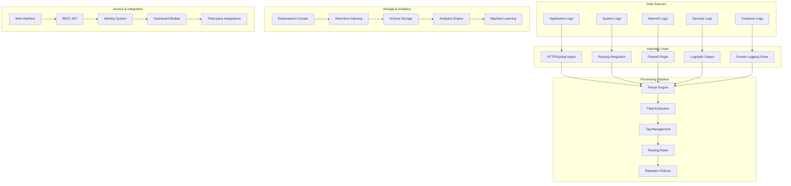

# Loggly Cloud Log Management Platform 深度实践

> **Author**: Cloud Logging Platform Specialist | **Version**: v1.0 | **Update Time**: 2026-02-07
> **Scenario**: Enterprise-grade cloud-native log management | **Complexity**: ⭐⭐⭐⭐

## 🎯 Abstract

This document provides comprehensive exploration of Loggly cloud log management platform architecture design, deployment practices, and operational management. Based on large-scale production environment experience, it offers complete technical guidance from log ingestion to advanced analytics, helping enterprises build scalable, cloud-native log management solutions with minimal infrastructure overhead.

## 1. Loggly Enterprise Architecture

### 1.1 Core Platform Components



### 1.2 Enterprise Deployment Patterns

```yaml
loggly_enterprise_patterns:
  multi_region_ingestion:
    primary_region: us-west-1
    secondary_regions: 
      - us-east-1
      - eu-west-1
    load_balancing: round_robin
    failover_time: 30s
  
  tiered_retention:
    hot_tier:
      duration: 7_days
      storage: ssd_backed
      search_performance: real_time
      
    warm_tier:
      duration: 30_days
      storage: standard_ssd
      search_performance: near_real_time
      
    cold_tier:
      duration: 365_days
      storage: archive_storage
      search_performance: batch_processing
  
  data_classification:
    pii_data:
      encryption: aes_256
      retention: 30_days
      access_control: strict
      
    security_logs:
      encryption: aes_256
      retention: 365_days
      compliance: soc2_type2
      
    application_logs:
      encryption: aes_128
      retention: 90_days
      access_control: team_based
```

## 2. Advanced Log Ingestion Configuration

### 2.1 Rsyslog Integration Setup

```bash
#!/bin/bash
# Loggly Rsyslog 配置脚本

# 1. 安装rsyslog
sudo yum install -y rsyslog rsyslog-gnutls

# 2. 配置Loggly证书
sudo mkdir -p /etc/rsyslog.d/keys/ca.d
wget -O /etc/rsyslog.d/keys/ca.d/logs-01.loggly.com.crt \
  https://logdog.loggly.com/media/configurations/certificates/logs-01.loggly.com.crt

# 3. 配置rsyslog转发
cat > /etc/rsyslog.d/22-loggly.conf << 'EOF'
# Setup disk assisted queues
$WorkDirectory /var/spool/rsyslog # where to place spool files
$ActionQueueFileName fwdRule1 # unique name prefix for spool files
$ActionQueueMaxDiskSpace 1g   # 1gb space limit (use as much as possible)
$ActionQueueSaveOnShutdown on # save messages to disk on shutdown
$ActionQueueType LinkedList   # run asynchronously
$ActionResumeRetryCount -1    # infinite retries if host is down

# RsyslogGnuTLSType certvalid
$DefaultNetstreamDriverCAFile /etc/rsyslog.d/keys/ca.d/logs-01.loggly.com.crt

$template LogglyFormat,"<%pri%>%protocol-version% %timestamp:::date-rfc3339% %HOSTNAME% %app-name% %procid% %msgid% [YOUR_LOGGLY_TOKEN@41058 tag=Syslog] %msg%\n"

*.* @@logs-01.loggly.com:6514;LogglyFormat
EOF

# 4. 重启rsyslog服务
sudo systemctl restart rsyslog
sudo systemctl enable rsyslog

# 5. 验证配置
logger "Test message sent to Loggly at $(date)"
```

### 2.2 Docker Logging Driver Configuration

```json
{
  "log-driver": "syslog",
  "log-opts": {
    "syslog-address": "tcp://logs-01.loggly.com:6514",
    "syslog-format": "rfc5424",
    "syslog-tls-cert": "/etc/docker/certs/loggly.crt",
    "syslog-tls-key": "/etc/docker/certs/loggly.key",
    "tag": "{{.Name}}/{{.ID}}",
    "syslog-facility": "local7",
    "labels": "production,environment,service",
    "env": "LOG_LEVEL,APP_VERSION"
  }
}
```

### 2.3 Fluentd Plugin Configuration

```ruby
# fluentd_loggly.conf
<source>
  @type tail
  path /var/log/application/*.log
  pos_file /var/log/td-agent/app.log.pos
  tag application.*
  format json
  time_key timestamp
  time_format %Y-%m-%dT%H:%M:%S.%NZ
</source>

<source>
  @type tail
  path /var/log/nginx/access.log
  pos_file /var/log/td-agent/nginx-access.log.pos
  tag nginx.access
  format /^(?<remote>[^ ]*) (?<host>[^ ]*) (?<user>[^ ]*) \[(?<time>[^\]]*)\] "(?<method>\S+)(?: +(?<path>[^\"]*?)(?: +\S*)?)?" (?<code>[^ ]*) (?<size>[^ ]*)(?: "(?<referer>[^\"]*)" "(?<agent>[^\"]*)"(?:\s+(?<http_x_forwarded_for>[^ ]+))?)?$/
  time_format %d/%b/%Y:%H:%M:%S %z
</source>

<filter **>
  @type record_transformer
  <record>
    customer_id "#{ENV['CUSTOMER_ID']}"
    environment "#{ENV['ENVIRONMENT']}"
    hostname "#{Socket.gethostname}"
    loggly_token "#{ENV['LOGGLY_TOKEN']}"
  </record>
</filter>

<match **>
  @type loggly
  loggly_token "#{ENV['LOGGLY_TOKEN']}"
  flush_interval 10s
  buffer_chunk_limit 8m
  buffer_queue_limit 32
  num_threads 8
  <buffer>
    @type file
    path /var/log/td-agent/buffer/loggly
    flush_mode interval
    flush_interval 10s
    retry_type exponential_backoff
    retry_forever true
    retry_max_interval 30
  </buffer>
</match>
```

## 3. Advanced Search and Analytics

### 3.1 Loggly Query Language Examples

```sql
-- 高级搜索查询示例

-- 1. 复杂错误模式分析
tag:application* AND (level:ERROR OR level:CRITICAL)
| json service, error_code, user_id
| where error_code in ["DB_CONNECTION_FAILED", "AUTHENTICATION_ERROR", "TIMEOUT"]
| stats count as error_count, 
        unique(user_id) as affected_users,
        values(error_code) as error_types
       by service, _timeslice
| where error_count > 10
| sort error_count desc

-- 2. 性能瓶颈识别
tag:nginx* AND status >= 500
| json request_time, upstream_response_time, uri
| where request_time > 2.0 or upstream_response_time > 1.5
| stats avg(request_time) as avg_request_time,
        avg(upstream_response_time) as avg_upstream_time,
        count(*) as slow_requests
       by uri, _timeslice
| sort slow_requests desc
| limit 50

-- 3. 安全事件关联分析
tag:security* AND (event_type:"LOGIN_FAILURE" OR event_type:"UNAUTHORIZED_ACCESS")
| json user_ip, username, action, resource
| where action in ["login", "access_resource"]
| stats count(*) as event_count,
        unique(username) as unique_users,
        unique(user_ip) as unique_ips
       by username, user_ip, _timeslice
| where event_count > 5
| join username [
  search tag:security* event_type:"ACCOUNT_LOCKED"
  | json username
  | stats count(*) as lockouts by username
]
| where lockouts > 0
| sort event_count desc

-- 4. 业务指标监控
tag:business* AND event_type:"TRANSACTION"
| json amount, currency, payment_method, status
| where status = "SUCCESS"
| stats sum(amount) as total_revenue,
        count(*) as transaction_count,
        avg(amount) as avg_transaction
       by currency, payment_method, _timeslice
| eval revenue_per_minute = total_revenue / 1440
| sort total_revenue desc
```

### 3.2 Custom Dashboard Configuration

```json
{
  "dashboard": {
    "name": "Enterprise Operations Overview",
    "description": "Comprehensive operational metrics dashboard",
    "layout": {
      "columns": 3,
      "rows": 4
    },
    "widgets": [
      {
        "type": "metric",
        "title": "Critical Error Rate",
        "position": {
          "column": 1,
          "row": 1,
          "width": 1,
          "height": 1
        },
        "query": "tag:application* level:CRITICAL | stats count(*) as critical_errors by _timeslice | delta(critical_errors) as error_delta",
        "visualization": {
          "type": "single_value",
          "thresholds": [
            {"value": 0, "color": "green"},
            {"value": 5, "color": "yellow"},
            {"value": 20, "color": "red"}
          ]
        }
      },
      {
        "type": "chart",
        "title": "API Response Times",
        "position": {
          "column": 2,
          "row": 1,
          "width": 2,
          "height": 2
        },
        "query": "tag:api* | json response_time | stats avg(response_time) as avg_response, perc95(response_time) as p95_response by _timeslice",
        "visualization": {
          "type": "line_chart",
          "y_axis": {
            "min": 0,
            "max": 5000,
            "unit": "milliseconds"
          }
        }
      },
      {
        "type": "table",
        "title": "Top Resource Consumers",
        "position": {
          "column": 1,
          "row": 2,
          "width": 1,
          "height": 2
        },
        "query": "tag:system* | json cpu_percent, memory_mb, disk_io | stats avg(cpu_percent) as avg_cpu, sum(memory_mb) as total_memory by host | sort avg_cpu desc | limit 20",
        "visualization": {
          "type": "data_table",
          "columns": [
            {"field": "host", "title": "Host"},
            {"field": "avg_cpu", "title": "Avg CPU %"},
            {"field": "total_memory", "title": "Memory (MB)"}
          ]
        }
      }
    ]
  }
}
```

## 4. Alerting and Notification System

### 4.1 Advanced Alert Configuration

```json
{
  "alerts": [
    {
      "name": "Database Connection Pool Exhaustion",
      "description": "Alert when database connection pool utilization exceeds 90%",
      "query": "tag:database* metric_name:\"connection_pool_utilization\" | stats avg(value) as pool_utilization by _timeslice | where pool_utilization > 90",
      "schedule": "*/5 * * * *",
      "conditions": {
        "type": "threshold",
        "operator": ">",
        "value": 90,
        "consecutive_periods": 2
      },
      "notifications": [
        {
          "type": "email",
          "recipients": ["dba-team@company.com", "ops-alerts@company.com"],
          "subject": "CRITICAL: Database Connection Pool Exhaustion",
          "body_template": "Database connection pool utilization is at {{pool_utilization}}% on {{host}}"
        },
        {
          "type": "slack",
          "webhook_url": "https://hooks.slack.com/services/YOUR/SLACK/WEBHOOK",
          "channel": "#database-alerts",
          "message_template": ":rotating_light: Database connection pool critical! Utilization: {{pool_utilization}}%"
        },
        {
          "type": "pagerduty",
          "service_key": "YOUR_PAGERDUTY_SERVICE_KEY",
          "incident_key": "db_connection_pool_{{host}}"
        }
      ]
    },
    {
      "name": "Security Breach Detection",
      "description": "Detect potential security breaches through unusual login patterns",
      "query": "tag:auth* event_type:\"login_failure\" | stats count(*) as failure_count by username, ip_address, _timeslice | where failure_count > 10",
      "schedule": "*/10 * * * *",
      "conditions": {
        "type": "anomaly",
        "algorithm": "isolation_forest",
        "contamination": 0.1
      },
      "actions": [
        {
          "type": "block_ip",
          "target": "firewall",
          "duration": "1h",
          "parameters": {
            "ip_address": "{{ip_address}}"
          }
        },
        {
          "type": "disable_account",
          "target": "identity_provider",
          "parameters": {
            "username": "{{username}}"
          }
        }
      ]
    }
  ]
}
```

### 4.2 Webhook Integration Examples

```python
#!/usr/bin/env python3
# loggly_webhook_handlers.py
import json
import requests
from flask import Flask, request, jsonify
import boto3
from datetime import datetime

app = Flask(__name__)

class LogglyWebhookHandler:
    def __init__(self):
        self.sns_client = boto3.client('sns', region_name='us-west-2')
        self.ec2_client = boto3.client('ec2', region_name='us-west-2')
        
    def handle_database_alert(self, alert_data):
        """处理数据库告警"""
        # 解析告警数据
        host = alert_data.get('host', 'unknown')
        utilization = alert_data.get('pool_utilization', 0)
        
        # 发送SNS通知
        self.sns_client.publish(
            TopicArn='arn:aws:sns:us-west-2:123456789012:database-alerts',
            Message=json.dumps({
                'host': host,
                'utilization': utilization,
                'timestamp': datetime.utcnow().isoformat(),
                'action': 'scale_up_database_instances'
            }),
            Subject=f'Database Alert: {host}'
        )
        
        # 自动扩容RDS实例
        try:
            self.ec2_client.modify_db_instance(
                DBInstanceIdentifier=f'db-{host}',
                AllocatedStorage=200,  # 增加存储
                ApplyImmediately=True
            )
            return {'status': 'success', 'action': 'database_scaled'}
        except Exception as e:
            return {'status': 'error', 'message': str(e)}
    
    def handle_security_alert(self, alert_data):
        """处理安全告警"""
        ip_address = alert_data.get('ip_address')
        username = alert_data.get('username')
        
        # 将IP加入黑名单
        firewall_rules = {
            'IpPermissions': [{
                'IpProtocol': 'tcp',
                'FromPort': 0,
                'ToPort': 65535,
                'IpRanges': [{
                    'CidrIp': f'{ip_address}/32',
                    'Description': f'Blocked due to security alert at {datetime.utcnow()}'
                }]
            }]
        }
        
        try:
            self.ec2_client.authorize_security_group_ingress(
                GroupId='sg-12345678',
                IpPermissions=firewall_rules['IpPermissions']
            )
            
            # 通知安全团队
            self.sns_client.publish(
                TopicArn='arn:aws:sns:us-west-2:123456789012:security-alerts',
                Message=json.dumps({
                    'blocked_ip': ip_address,
                    'username': username,
                    'timestamp': datetime.utcnow().isoformat(),
                    'action': 'ip_blocked'
                })
            )
            
            return {'status': 'success', 'action': 'ip_blocked'}
        except Exception as e:
            return {'status': 'error', 'message': str(e)}

# Flask路由
@app.route('/webhook/loggly', methods=['POST'])
def loggly_webhook():
    try:
        data = request.get_json()
        
        handler = LogglyWebhookHandler()
        
        # 根据告警类型处理
        if 'database' in data.get('alert_name', '').lower():
            result = handler.handle_database_alert(data)
        elif 'security' in data.get('alert_name', '').lower():
            result = handler.handle_security_alert(data)
        else:
            result = {'status': 'ignored', 'reason': 'unknown_alert_type'}
            
        return jsonify(result)
        
    except Exception as e:
        return jsonify({'status': 'error', 'message': str(e)}), 500

if __name__ == '__main__':
    app.run(host='0.0.0.0', port=5000, debug=False)
```

## 5. Performance Optimization

### 5.1 Tag Management Best Practices

```bash
#!/bin/bash
# loggly_tag_optimization.sh

# 1. 标签规范化脚本
normalize_tags() {
    local log_entry="$1"
    
    # 提取和标准化标签
    echo "$log_entry" | jq -r '
        .tags |= map(
            if test("^[a-zA-Z0-9_-]+$") then 
                . | ascii_downcase | gsub("[^a-zA-Z0-9_-]"; "_")
            else 
                "invalid_tag_" + (. | ascii_downcase | gsub("[^a-zA-Z0-9]"; ""))
            end
        ) |
        .tags |= unique |
        .tags |= sort
    '
}

# 2. 批量标签清理
clean_old_tags() {
    local cutoff_date=$(date -d '30 days ago' +%s)
    
    curl -X GET \
      "https://your-company.loggly.com/apiv2/tags" \
      -H "Authorization: Bearer YOUR_API_TOKEN" \
      | jq -r --arg cutoff "$cutoff_date" '
        .[] | 
        select(.lastUsed < ($cutoff | tonumber)) |
        .name
      ' > /tmp/unused_tags.txt
    
    # 删除未使用的标签
    while read tag; do
        curl -X DELETE \
          "https://your-company.loggly.com/apiv2/tags/$tag" \
          -H "Authorization: Bearer YOUR_API_TOKEN"
        echo "Deleted unused tag: $tag"
    done < /tmp/unused_tags.txt
}

# 3. 标签使用统计
analyze_tag_usage() {
    curl -X GET \
      "https://your-company.loggly.com/apiv2/tags/stats" \
      -H "Authorization: Bearer YOUR_API_TOKEN" \
      | jq '
        .[] |
        select(.usageCount > 1000) |
        {
            tag: .name,
            usage: .usageCount,
            last_used: .lastUsed,
            efficiency: (.usageCount / (.lastUsed - .firstUsed))
        } |
        select(.efficiency < 0.1)  # 低效率标签
      '
}
```

### 5.2 Search Performance Optimization

```sql
-- 搜索性能优化查询

-- 1. 索引优化分析
tag:* 
| stats count(*) as log_count,
        count_distinct(_tag) as unique_tags,
        avg(length(_raw)) as avg_message_size
       by _tag
| where log_count > 100000
| sort log_count desc
| limit 50

-- 2. 字段提取优化
tag:application* 
| json service, level, timestamp, trace_id
| where isnotnull(service) and isnotnull(level)
| stats count(*) as valid_logs,
        count_distinct(service) as services,
        count_distinct(trace_id) as traces
       by level, _timeslice
| sort valid_logs desc

-- 3. 时间范围优化
tag:nginx* status:500*
| parse "* * * [*] *" as ip, ident, auth, timestamp, request
| where timestamp >= "2024-01-01" and timestamp < "2024-02-01"
| stats count(*) as error_count,
        unique(ip) as unique_ips
       by substr(timestamp, 1, 10) as date
| sort date

-- 4. 聚合查询优化
tag:system* metric:"cpu_usage"
| num(cpu_percent)
| where cpu_percent > 80
| bucket span=1h
| stats avg(cpu_percent) as avg_cpu,
        max(cpu_percent) as max_cpu,
        count(*) as samples
       by host, _bucket
| where avg_cpu > 85
| sort max_cpu desc
```

## 6. Integration and Automation

### 6.1 Terraform Integration

```hcl
# loggly_terraform.tf
variable "loggly_customer_token" {
  description = "Loggly customer token"
  type        = string
}

variable "loggly_subdomain" {
  description = "Loggly subdomain"
  type        = string
}

provider "loggly" {
  customer_token = var.loggly_customer_token
  subdomain      = var.loggly_subdomain
}

# 创建日志源
resource "loggly_input" "application_logs" {
  name        = "application-json"
  description = "JSON formatted application logs"
  format      = "json"
  tags        = ["application", "json", "production"]
  
  syslog_config {
    protocol = "tcp"
    port     = 514
  }
}

resource "loggly_input" "nginx_logs" {
  name        = "nginx-access"
  description = "Nginx access logs"
  format      = "nginx"
  tags        = ["nginx", "access", "web"]
  
  syslog_config {
    protocol = "udp"
    port     = 514
  }
}

# 配置告警
resource "loggly_alert" "high_error_rate" {
  name        = "High Error Rate Alert"
  description = "Alert when error rate exceeds threshold"
  query       = "tag:application* level:ERROR | stats count(*) as error_count by _timeslice | where error_count > 100"
  schedule    = "*/5 * * * *"
  
  condition {
    type     = "threshold"
    operator = ">"
    value    = 100
  }
  
  notification {
    type        = "email"
    recipients  = ["alerts@company.com"]
    subject     = "High Error Rate Detected"
  }
  
  notification {
    type        = "webhook"
    url         = "https://webhook.company.com/loggly"
    method      = "POST"
    content_type = "application/json"
  }
}

# 创建仪表板
resource "loggly_dashboard" "operations_overview" {
  name        = "Operations Overview"
  description = "Key operational metrics dashboard"
  
  widget {
    type  = "metric"
    title = "Error Rate"
    query = "tag:application* level:ERROR | stats count(*) as errors by _timeslice"
    position {
      column = 1
      row    = 1
      width  = 1
      height = 1
    }
  }
  
  widget {
    type  = "chart"
    title = "Response Times"
    query = "tag:api* | json response_time | stats avg(response_time) by _timeslice"
    position {
      column = 2
      row    = 1
      width  = 2
      height = 2
    }
  }
}
```

### 6.2 CI/CD Pipeline Integration

```yaml
# .github/workflows/loggly-deployment-tracking.yml
name: Loggly Deployment Tracking

on:
  push:
    branches: [ main, release/* ]

jobs:
  deploy-and-track:
    runs-on: ubuntu-latest
    
    steps:
    - name: Checkout code
      uses: actions/checkout@v3
    
    - name: Deploy application
      run: |
        # Your deployment logic here
        ./scripts/deploy.sh --environment production
        echo "DEPLOY_VERSION=$(git rev-parse HEAD)" >> $GITHUB_ENV
        echo "DEPLOY_TIMESTAMP=$(date -u +%Y-%m-%dT%H:%M:%SZ)" >> $GITHUB_ENV
    
    - name: Send deployment event to Loggly
      run: |
        curl -X POST \
          -H "Content-Type: application/json" \
          -d '{
            "event": "deployment",
            "version": "${{ env.DEPLOY_VERSION }}",
            "environment": "production",
            "service": "${{ github.event.repository.name }}",
            "deployed_by": "${{ github.actor }}",
            "timestamp": "${{ env.DEPLOY_TIMESTAMP }}",
            "commit_message": "${{ github.event.head_commit.message }}",
            "tags": ["deployment", "ci-cd", "github-actions"]
          }' \
          "https://logs-01.loggly.com/inputs/${{ secrets.LOGGLY_TOKEN }}/tag/deployment/"
    
    - name: Monitor deployment health
      run: |
        sleep 300  # Wait for logs to propagate
        
        # Check for deployment-related errors
        HEALTH_CHECK=$(curl -s -G \
          "https://your-company.loggly.com/apiv2/search" \
          -H "Authorization: Bearer ${{ secrets.LOGGLY_API_TOKEN }}" \
          --data-urlencode 'q=tag:application* level:ERROR service:${{ github.event.repository.name }} AND timestamp:["now-10m" TO "now"]' \
          --data-urlencode 'rows=1')
        
        ERROR_COUNT=$(echo $HEALTH_CHECK | jq -r '.total_results')
        
        if [ "$ERROR_COUNT" -gt "10" ]; then
          echo "Deployment health check failed - Found $ERROR_COUNT errors"
          exit 1
        fi
        
        echo "Deployment successful - Error count: $ERROR_COUNT"
```

## 7. Security and Compliance

### 7.1 Data Protection Configuration

```json
{
  "security_config": {
    "encryption": {
      "at_rest": {
        "algorithm": "AES-256",
        "key_rotation": "90_days",
        "key_management": "customer_managed"
      },
      "in_transit": {
        "tls_version": "TLS_1_3",
        "certificate_validation": "strict",
        "cipher_suites": [
          "TLS_AES_256_GCM_SHA384",
          "TLS_CHACHA20_POLY1305_SHA256"
        ]
      }
    },
    "access_control": {
      "authentication": {
        "sso_enabled": true,
        "providers": ["okta", "azure_ad"],
        "mfa_required": true
      },
      "authorization": {
        "role_mapping": {
          "admin": {
            "permissions": ["full_access", "manage_users", "configure_alerts"],
            "users": ["platform-admin@company.com"]
          },
          "developer": {
            "permissions": ["read_logs", "create_dashboards", "manage_saved_searches"],
            "users": ["dev-team@company.com"]
          },
          "viewer": {
            "permissions": ["read_only"],
            "users": ["business-stakeholders@company.com"]
          }
        }
      }
    },
    "data_retention": {
      "pii_data": {
        "retention_days": 30,
        "automatic_deletion": true
      },
      "security_logs": {
        "retention_days": 365,
        "compliance": "SOC2_Type2"
      },
      "application_logs": {
        "retention_days": 90,
        "archival": true
      }
    }
  }
}
```

### 7.2 Compliance Reporting

```sql
-- 合规性报告查询

-- 1. 数据访问审计
tag:audit* event_type:"data_access"
| json user_id, resource_type, action, timestamp
| where action in ["read", "write", "delete"]
| stats count(*) as access_count,
        unique(user_id) as unique_users
       by resource_type, action, substr(timestamp, 1, 10) as date
| sort date desc
| limit 1000

-- 2. 安全事件统计
tag:security* severity:"HIGH" OR severity:"CRITICAL"
| json event_type, source_ip, user_agent, timestamp
| stats count(*) as security_events,
        unique(source_ip) as unique_sources
       by event_type, substr(timestamp, 1, 7) as month
| sort month desc

-- 3. GDPR合规性检查
tag:application* contains:"personal_data"
| json user_consent, data_processing_purpose, retention_period
| where user_consent != "granted" or retention_period > 30
| stats count(*) as non_compliant_records,
        unique(user_id) as affected_users
       by data_processing_purpose
| sort non_compliant_records desc
```

---
*This document is based on enterprise-level Loggly platform practice experience and continuously updated with the latest technologies and best practices.*