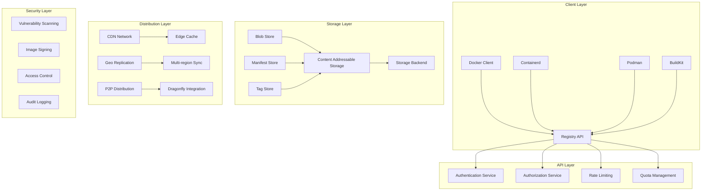

# Docker Registry企业级镜像分发深度实践

> **Author**: Container Registry Architect | **Version**: v1.0 | **Update Time**: 2026-02-07
> **Scenario**: Enterprise-grade container image distribution architecture | **Complexity**: ⭐⭐⭐⭐⭐

## 🎯 Abstract

This document provides in-depth exploration of Docker Registry enterprise image distribution architecture design, deployment practices, and operational management. Based on large-scale production environment experience, it offers comprehensive technical guidance from image storage to global distribution, helping enterprises build reliable, scalable container registry systems.

## 1. Docker Registry Architecture Deep Dive

### 1.1 Core Component Architecture



### 1.2 Storage Backend Options

```yaml
storage_backends:
  filesystem:
    type: filesystem
    rootdirectory: /var/lib/registry
    maxthreads: 100
    
  s3:
    type: s3
    region: us-west-2
    bucket: docker-registry-bucket
    encrypt: true
    secure: true
    v4auth: true
    chunksize: 5242880
    rootdirectory: /registry
    storageclass: STANDARD_IA
    
  azure:
    type: azure
    accountname: registrystorage
    accountkey: your-account-key
    container: registry
    realm: core.windows.net
    
  gcs:
    type: gcs
    bucket: docker-registry-bucket
    keyfile: /path/to/keyfile
    rootdirectory: /registry
    
  swift:
    type: swift
    username: your-openstack-username
    password: your-password
    authurl: https://your-openstack-auth-url
    container: registry
```

## 2. Enterprise Deployment Configuration

### 2.1 High Availability Setup

```yaml
# docker-registry-deployment.yaml
apiVersion: apps/v1
kind: Deployment
metadata:
  name: docker-registry
  namespace: registry
spec:
  replicas: 3
  selector:
    matchLabels:
      app: docker-registry
  template:
    metadata:
      labels:
        app: docker-registry
    spec:
      containers:
      - name: registry
        image: registry:2.8
        ports:
        - containerPort: 5000
        env:
        - name: REGISTRY_HTTP_ADDR
          value: :5000
        - name: REGISTRY_HTTP_SECRET
          valueFrom:
            secretKeyRef:
              name: registry-secret
              key: http.secret
        - name: REGISTRY_STORAGE_S3_ACCESSKEY
          valueFrom:
            secretKeyRef:
              name: registry-s3-secret
              key: accesskey
        - name: REGISTRY_STORAGE_S3_SECRETKEY
          valueFrom:
            secretKeyRef:
              name: registry-s3-secret
              key: secretkey
        - name: REGISTRY_AUTH_TOKEN_REALM
          value: "https://auth.registry.example.com/token/"
        - name: REGISTRY_AUTH_TOKEN_SERVICE
          value: "registry.example.com"
        - name: REGISTRY_AUTH_TOKEN_ISSUER
          value: "Registry Auth Service"
        - name: REGISTRY_AUTH_TOKEN_ROOTCERTBUNDLE
          value: "/etc/registry/auth.crt"
        volumeMounts:
        - name: config
          mountPath: /etc/docker/registry
        - name: auth-certs
          mountPath: /etc/registry
        - name: registry-storage
          mountPath: /var/lib/registry
        livenessProbe:
          httpGet:
            path: /
            port: 5000
          initialDelaySeconds: 30
          periodSeconds: 10
        readinessProbe:
          httpGet:
            path: /
            port: 5000
          initialDelaySeconds: 5
          periodSeconds: 5
        resources:
          requests:
            memory: "512Mi"
            cpu: "250m"
          limits:
            memory: "2Gi"
            cpu: "1000m"
      volumes:
      - name: config
        configMap:
          name: registry-config
      - name: auth-certs
        secret:
          secretName: registry-auth-certs
      - name: registry-storage
        persistentVolumeClaim:
          claimName: registry-pvc
---
# registry-config.yaml
apiVersion: v1
kind: ConfigMap
metadata:
  name: registry-config
  namespace: registry
data:
  config.yml: |
    version: 0.1
    log:
      fields:
        service: registry
    storage:
      s3:
        accesskey: ${REGISTRY_STORAGE_S3_ACCESSKEY}
        secretkey: ${REGISTRY_STORAGE_S3_SECRETKEY}
        region: us-west-2
        bucket: docker-registry-production
        encrypt: true
        secure: true
        v4auth: true
        chunksize: 5242880
        rootdirectory: /registry
        storageclass: STANDARD_IA
      cache:
        blobdescriptor: redis
      maintenance:
        uploadpurging:
          enabled: true
          age: 168h
          interval: 24h
          dryrun: false
        readonly:
          enabled: false
    http:
      addr: :5000
      secret: ${REGISTRY_HTTP_SECRET}
      debug:
        addr: :5001
        prometheus:
          enabled: true
          path: /metrics
      headers:
        X-Content-Type-Options: [nosniff]
    redis:
      addr: redis.registry.svc.cluster.local:6379
      db: 0
      dialtimeout: 10ms
      readtimeout: 10ms
      writetimeout: 10ms
      pool:
        maxidle: 16
        maxactive: 64
        idletimeout: 300s
    health:
      storagedriver:
        enabled: true
        interval: 10s
        threshold: 3
    notifications:
      events:
        includereferences: true
      endpoints:
        - name: audit-webhook
          disabled: false
          url: https://audit.registry.example.com/webhook
          headers:
            Authorization: ["Bearer {{.Token}}"]
          timeout: 1s
          threshold: 10
          backoff: 1s
          ignoredmediatypes:
            - application/octet-stream
```

## 3. Advanced Features Implementation

### 3.1 Image Signing and Verification

```bash
#!/bin/bash
# image-signing-setup.sh

# 1. Generate signing keys
echo "Generating cosign keys..."
cosign generate-key-pair

# 2. Sign an image
echo "Signing image..."
cosign sign --key cosign.key registry.example.com/myapp:v1.0.0

# 3. Verify image signature
echo "Verifying image signature..."
cosign verify --key cosign.pub registry.example.com/myapp:v1.0.0

# 4. Configure registry for signature verification
cat > /etc/docker/registry/signature-config.yaml << EOF
signature:
  enabled: true
  verifier:
    type: cosign
    key: /etc/registry/cosign.pub
    required: true
EOF
```

### 3.2 Vulnerability Scanning Integration

```yaml
# clair-scanner-integration.yaml
apiVersion: apps/v1
kind: Deployment
metadata:
  name: clair-scanner
  namespace: registry
spec:
  replicas: 2
  selector:
    matchLabels:
      app: clair-scanner
  template:
    metadata:
      labels:
        app: clair-scanner
    spec:
      containers:
      - name: clair
        image: quay.io/coreos/clair:v4.6.0
        ports:
        - containerPort: 6060
          name: clair-api
        - containerPort: 6061
          name: clair-health
        env:
        - name: CLAIR_CONF
          value: /etc/clair/config.yaml
        volumeMounts:
        - name: config
          mountPath: /etc/clair
        - name: clair-db
          mountPath: /clair-db
        readinessProbe:
          httpGet:
            path: /health
            port: 6061
          initialDelaySeconds: 10
          periodSeconds: 5
        resources:
          requests:
            memory: "1Gi"
            cpu: "500m"
          limits:
            memory: "4Gi"
            cpu: "2000m"
      volumes:
      - name: config
        configMap:
          name: clair-config
      - name: clair-db
        persistentVolumeClaim:
          claimName: clair-db-pvc
---
# clair-config.yaml
apiVersion: v1
kind: ConfigMap
metadata:
  name: clair-config
  namespace: registry
data:
  config.yaml: |
    http_listen_addr: :6060
    introspection_addr: :6061
    log_level: info
    indexer:
      connstring: host=clair-postgres port=5432 dbname=clair user=clair password=clairpassword sslmode=disable
      scanlock_retry: 10
      layer_scan_concurrency: 5
      migrations: true
    matcher:
      connstring: host=clair-postgres port=5432 dbname=clair user=clair password=clairpassword sslmode=disable
      max_conn_pool: 100
      migrations: true
      indexer_addr: clair-indexer:8080
    notifier:
      connstring: host=clair-postgres port=5432 dbname=clair user=clair password=clairpassword sslmode=disable
      migrations: true
      delivery_interval: 1m
      poll_interval: 5m
    auth:
      psk:
        key: >-
          MTdCNDAyMzM5NDQxNkUwMkUyNTAzRUZGMzc4QzQ0RUMK
        iss: ["issuer1"]
```

## 4. Performance Optimization

### 4.1 CDN Integration

```yaml
# cdn-configuration.yaml
cdn:
  enabled: true
  provider: cloudflare
  zone_id: your-zone-id
  api_token: your-api-token
  cache_rules:
    - pattern: "*.manifest.json"
      ttl: 300
      cache_level: cache_everything
    - pattern: "*.config"
      ttl: 3600
      cache_level: cache_everything
    - pattern: "*"
      ttl: 86400
      cache_level: cache_everything
  
  edge_cache:
    enabled: true
    locations:
      - region: us-east
        endpoint: registry-us-east.example.com
      - region: eu-west
        endpoint: registry-eu-west.example.com
      - region: ap-southeast
        endpoint: registry-ap-southeast.example.com
  
  compression:
    enabled: true
    algorithms: [gzip, brotli]
    min_content_length: 1024
```

### 4.2 P2P Distribution Setup

```yaml
# dragonfly-setup.yaml
apiVersion: apps/v1
kind: Deployment
metadata:
  name: dragonfly-manager
  namespace: registry
spec:
  replicas: 1
  selector:
    matchLabels:
      app: dragonfly-manager
  template:
    metadata:
      labels:
        app: dragonfly-manager
    spec:
      containers:
      - name: manager
        image: dragonflyoss/manager:v2.1.0
        ports:
        - containerPort: 8080
        env:
        - name: MANAGER_DATABASE_REDIS_ADDR
          value: "redis.dragonfly.svc.cluster.local:6379"
        - name: MANAGER_OBJECT_STORAGE_ENABLE
          value: "true"
        - name: MANAGER_OBJECT_STORAGE_REGION
          value: "us-west-2"
        - name: MANAGER_OBJECT_STORAGE_BUCKET_NAME
          value: "dragonfly-cache"
        resources:
          requests:
            memory: "256Mi"
            cpu: "100m"
          limits:
            memory: "512Mi"
            cpu: "500m"
---
# dfget-daemonset.yaml
apiVersion: apps/v1
kind: DaemonSet
metadata:
  name: dfget
  namespace: registry
spec:
  selector:
    matchLabels:
      app: dfget
  template:
    metadata:
      labels:
        app: dfget
    spec:
      containers:
      - name: dfget
        image: dragonflyoss/dfget:v2.1.0
        volumeMounts:
        - name: dockersock
          mountPath: /var/run/docker.sock
        - name: containerdsock
          mountPath: /run/containerd/containerd.sock
        - name: storage
          mountPath: /var/lib/dragonfly
        env:
        - name: DFGET_MANAGER_ADDR
          value: "dragonfly-manager.registry.svc.cluster.local:8080"
        securityContext:
          privileged: true
        resources:
          requests:
            memory: "128Mi"
            cpu: "50m"
          limits:
            memory: "256Mi"
            cpu: "200m"
      volumes:
      - name: dockersock
        hostPath:
          path: /var/run/docker.sock
      - name: containerdsock
        hostPath:
          path: /run/containerd/containerd.sock
      - name: storage
        hostPath:
          path: /var/lib/dragonfly
```

## 5. Security and Compliance

### 5.1 Authentication and Authorization

```yaml
# auth-service.yaml
apiVersion: apps/v1
kind: Deployment
metadata:
  name: registry-auth-service
  namespace: registry
spec:
  replicas: 2
  selector:
    matchLabels:
      app: registry-auth-service
  template:
    metadata:
      labels:
        app: registry-auth-service
    spec:
      containers:
      - name: auth-service
        image: cesanta/docker_auth:1
        ports:
        - containerPort: 5001
        volumeMounts:
        - name: config
          mountPath: /config
        - name: certs
          mountPath: /certs
        env:
        - name: CONFIG_FILE
          value: /config/auth_config.yml
        resources:
          requests:
            memory: "64Mi"
            cpu: "50m"
          limits:
            memory: "128Mi"
            cpu: "200m"
      volumes:
      - name: config
        configMap:
          name: auth-config
      - name: certs
        secret:
          secretName: auth-certs
---
# auth-config.yaml
apiVersion: v1
kind: ConfigMap
metadata:
  name: auth-config
  namespace: registry
data:
  auth_config.yml: |
    server:
      addr: ":5001"
      certificate: "/certs/server.crt"
      key: "/certs/server.key"
    
    token:
      issuer: "Registry Auth Service"
      expiration: 900
    
    users:
      admin:
        password: "$2y$05$/OK.fbVrR/bpIqNJ5ianF.CE5elHaaO4EbggVDjb8P19RukzXSM3e"  # bcrypt hash
      developer:
        password: "$2y$05$fghijklmnopqrstuvwxuzABCDEFGHIJKLMNOPQRSTUVWXYZ"
    
    acl:
      - match: {account: "admin"}
        actions: ["*"]
        comment: "Admin has full access to everything"
      
      - match: {account: "developer", name: "myapp/*"}
        actions: ["pull"]
        comment: "Developers can pull myapp images"
      
      - match: {account: "developer", name: "myapp/deploy-*"}
        actions: ["pull", "push"]
        comment: "Developers can push deploy images"
      
      - match: {account: "anonymous"}
        actions: ["pull"]
        comment: "Anonymous users can pull public images"
```

### 5.2 Audit and Compliance

```yaml
# audit-logging.yaml
audit:
  enabled: true
  log_format: json
  retention_days: 365
  storage_backend: s3
  s3_config:
    bucket: registry-audit-logs
    region: us-west-2
    prefix: audit/
  
  events_to_log:
    - pull
    - push
    - delete
    - mount
    - authenticate
  
  compliance_standards:
    - name: SOC2
      enabled: true
      requirements:
        - access_logging
        - change_management
        - incident_response
    
    - name: HIPAA
      enabled: false
      requirements:
        - data_encryption
        - access_controls
        - audit_trails
    
    - name: PCI-DSS
      enabled: true
      requirements:
        - secure_transmission
        - access_control
        - monitoring
```

## 6. Monitoring and Maintenance

### 6.1 Health Monitoring

```yaml
# monitoring-setup.yaml
apiVersion: monitoring.coreos.com/v1
kind: ServiceMonitor
metadata:
  name: docker-registry-monitor
  namespace: registry
spec:
  selector:
    matchLabels:
      app: docker-registry
  endpoints:
  - port: metrics
    path: /metrics
    interval: 30s
    metricRelabelings:
    - sourceLabels: [__name__]
      regex: 'registry_(.*)'
      targetLabel: __name__
---
# alerting-rules.yaml
apiVersion: monitoring.coreos.com/v1
kind: PrometheusRule
metadata:
  name: registry-alerts
  namespace: registry
spec:
  groups:
  - name: registry.rules
    rules:
    - alert: RegistryDown
      expr: up{job="docker-registry"} == 0
      for: 2m
      labels:
        severity: critical
      annotations:
        summary: "Docker Registry is down"
        description: "Registry service on {{ $labels.instance }} is not responding"
    
    - alert: RegistryHighErrorRate
      expr: rate(registry_http_requests_total{code=~"5.."}[5m]) / rate(registry_http_requests_total[5m]) > 0.05
      for: 5m
      labels:
        severity: warning
      annotations:
        summary: "High error rate in Registry"
        description: "Error rate is {{ $value | humanizePercentage }} for registry"
    
    - alert: RegistryStorageFull
      expr: registry_storage_fill_ratio > 0.9
      for: 10m
      labels:
        severity: critical
      annotations:
        summary: "Registry storage almost full"
        description: "Storage utilization is {{ $value | humanizePercentage }}"
```

### 6.2 Backup and Disaster Recovery

```bash
#!/bin/bash
# registry-backup.sh

BACKUP_DIR="/backup/registry"
DATE=$(date +%Y%m%d_%H%M%S)
BACKUP_NAME="registry_backup_${DATE}"

# Create backup directory
mkdir -p ${BACKUP_DIR}/${BACKUP_NAME}

# 1. Backup configuration
echo "Backing up registry configuration..."
kubectl get configmap -n registry -o yaml > ${BACKUP_DIR}/${BACKUP_NAME}/configmaps.yaml
kubectl get secret -n registry -o yaml > ${BACKUP_DIR}/${BACKUP_NAME}/secrets.yaml

# 2. Backup database (if using external database)
echo "Backing up registry database..."
pg_dump -h registry-db.example.com -U registry registry > ${BACKUP_DIR}/${BACKUP_NAME}/registry.sql

# 3. Backup S3 storage metadata
echo "Backing up S3 metadata..."
aws s3 ls s3://docker-registry-production --recursive > ${BACKUP_DIR}/${BACKUP_NAME}/s3_objects.txt

# 4. Create backup manifest
cat > ${BACKUP_DIR}/${BACKUP_NAME}/manifest.json << EOF
{
  "backup_name": "${BACKUP_NAME}",
  "created_at": "$(date -Iseconds)",
  "registry_version": "$(kubectl exec -n registry deploy/docker-registry -- registry --version)",
  "components": ["configuration", "database", "storage_metadata"],
  "checksum": "$(sha256sum ${BACKUP_DIR}/${BACKUP_NAME}/* | sha256sum | cut -d' ' -f1)"
}
EOF

# 5. Compress backup
tar -czf ${BACKUP_DIR}/${BACKUP_NAME}.tar.gz -C ${BACKUP_DIR} ${BACKUP_NAME}

# 6. Cleanup temporary directory
rm -rf ${BACKUP_DIR}/${BACKUP_NAME}

# 7. Upload to remote storage
if [ -n "$REMOTE_STORAGE" ]; then
    echo "Uploading to remote storage..."
    aws s3 cp ${BACKUP_DIR}/${BACKUP_NAME}.tar.gz s3://$REMOTE_STORAGE/backups/
fi

echo "Backup completed: ${BACKUP_DIR}/${BACKUP_NAME}.tar.gz"
```

## 7. Best Practices and Guidelines

### 7.1 Image Management Policies

```yaml
# image-retention-policy.yaml
retention_policy:
  enabled: true
  rules:
    - name: "development_images"
      match:
        tags: ["dev-*", "feature-*"]
        age: "30d"
      action: "delete"
    
    - name: "staging_images"
      match:
        tags: ["staging-*"]
        age: "90d"
      action: "move_to_archive"
    
    - name: "production_images"
      match:
        tags: ["v*", "latest"]
        age: "365d"
      action: "archive_with_compression"
    
    - name: "untagged_images"
      match:
        untagged: true
        age: "7d"
      action: "delete"
  
  notification:
    enabled: true
    channels:
      - type: "email"
        recipients: ["devops@example.com"]
      - type: "slack"
        webhook: "https://hooks.slack.com/services/YOUR/SLACK/WEBHOOK"
```

### 7.2 Performance Guidelines

```markdown
## 🚀 Docker Registry Performance Best Practices

### 1. Storage Optimization
- Use SSD storage for better I/O performance
- Enable compression for blob storage
- Implement proper caching strategies
- Regularly clean up unused blobs

### 2. Network Optimization
- Deploy registry close to users geographically
- Use CDN for global distribution
- Enable HTTP/2 for better performance
- Implement connection pooling

### 3. Resource Management
- Set appropriate memory and CPU limits
- Monitor and tune garbage collection
- Scale horizontally based on demand
- Use load balancing for high availability

### 4. Security Hardening
- Enable TLS encryption for all communications
- Implement strong authentication mechanisms
- Regular security scanning of images
- Maintain audit logs for compliance
```

## 8. Future Trends and Evolution

### 8.1 Emerging Technologies

```yaml
future_trends:
  registry_evolution:
    - oci_distribution_specification_adoption
    - wasm_artifact_support
    - sbom_integration
    - sigstore_keyless_signing
  
  distribution_advancements:
    - content_delivery_networks_optimization
    - peer_to_peer_distribution
    - edge_computing_integration
    - multi_cloud_registry_federation
  
  security_enhancements:
    - zero_trust_architecture
    - hardware_security_modules
    - supply_chain_security
    - automated_vulnerability_remediation
```

---
*This document is based on enterprise-level container registry practice experience and continuously updated with the latest technologies and best practices.*