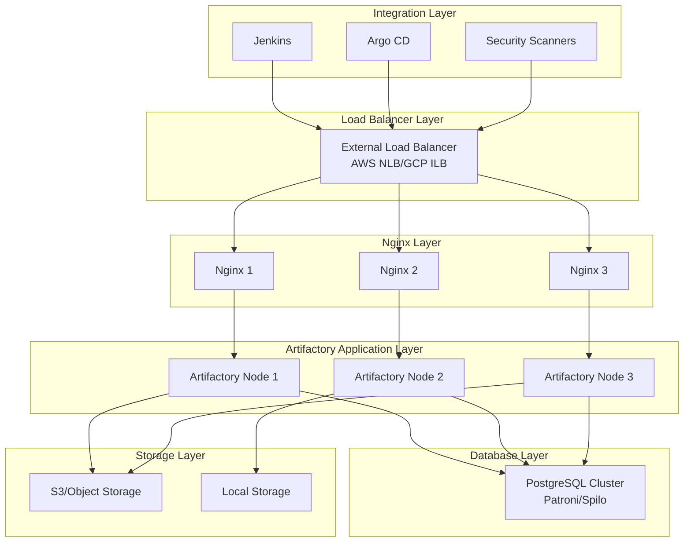

# JFrog Artifactory Enterprise Container Registry Platform

## 概述 (Overview)

JFrog Artifactory 是企业级通用制品仓库管理平台，支持 Docker、Helm、Maven、NPM 等多种包格式。本文档详细介绍 Artifactory 企业级部署架构、容器镜像管理和 DevOps 集成实践。

JFrog Artifactory is an enterprise-grade universal artifact repository management platform that supports multiple package formats including Docker, Helm, Maven, NPM. This document details Artifactory enterprise deployment architecture, container image management, and DevOps integration practices.

## 架构设计 (Architecture Design)

### 企业级架构 (Enterprise Architecture)

```yaml
# Artifactory 企业级部署架构
apiVersion: v1
kind: Namespace
metadata:
  name: artifactory-system
---
apiVersion: v1
kind: ConfigMap
metadata:
  name: artifactory-config
  namespace: artifactory-system
data:
  system.yaml: |
    configVersion: 1
    shared:
      database:
        type: postgresql
        driver: org.postgresql.Driver
        url: jdbc:postgresql://postgres-artifactory:5432/artifactory
        username: artifactory
        password: ${ARTIFACTORY_DB_PASSWORD}
      
      security:
        joinKey: ${JOIN_KEY}
        masterKey: ${MASTER_KEY}
        
      logging:
        consoleLogThreshold: INFO
        loggers:
          ROOT: INFO
          org.jfrog: DEBUG
          
    artifactory:
      primary:
        resources:
          requests:
            memory: "4Gi"
            cpu: "2"
          limits:
            memory: "8Gi"
            cpu: "4"
            
      node:
        replicaCount: 3
        persistence:
          size: 200Gi
          storageClass: fast-ssd
          
    nginx:
      enabled: true
      service:
        type: LoadBalancer
        loadBalancerIP: ${LOAD_BALANCER_IP}
      resources:
        requests:
          memory: "512Mi"
          cpu: "100m"
        limits:
          memory: "1Gi"
          cpu: "500m"
```

### 高可用架构 (High Availability Architecture)



## 部署配置 (Deployment Configuration)

### Kubernetes 部署 (Kubernetes Deployment)

```yaml
# Artifactory 主部署配置
apiVersion: apps/v1
kind: StatefulSet
metadata:
  name: artifactory
  namespace: artifactory-system
spec:
  serviceName: artifactory
  replicas: 3
  selector:
    matchLabels:
      app: artifactory
  template:
    metadata:
      labels:
        app: artifactory
    spec:
      initContainers:
      - name: init-permissions
        image: alpine:3.18
        command: ['sh', '-c', 'chown -R 1030:1030 /var/opt/jfrog/artifactory']
        volumeMounts:
        - name: artifactory-data
          mountPath: /var/opt/jfrog/artifactory
          
      containers:
      - name: artifactory
        image: releases-docker.jfrog.io/jfrog/artifactory-pro:7.55.3
        env:
        - name: EXTRA_JAVA_OPTIONS
          value: "-Xms2g -Xmx6g -XX:+UseG1GC"
        - name: ARTIFACTORY_MASTER_KEY
          valueFrom:
            secretKeyRef:
              name: artifactory-secrets
              key: master-key
        - name: JOIN_KEY
          valueFrom:
            secretKeyRef:
              name: artifactory-secrets
              key: join-key
        ports:
        - containerPort: 8081
          name: http
        - containerPort: 8082
          name: https
        readinessProbe:
          httpGet:
            path: /artifactory/api/v1/system/readiness
            port: 8081
          initialDelaySeconds: 60
          periodSeconds: 10
        livenessProbe:
          httpGet:
            path: /artifactory/api/v1/system/liveness
            port: 8081
          initialDelaySeconds: 120
          periodSeconds: 30
        volumeMounts:
        - name: artifactory-data
          mountPath: /var/opt/jfrog/artifactory
        - name: artifactory-config
          mountPath: /artifactory_bootstrap/system.yaml
          subPath: system.yaml
        resources:
          requests:
            cpu: "2"
            memory: "4Gi"
          limits:
            cpu: "4"
            memory: "8Gi"
          
      volumes:
      - name: artifactory-config
        configMap:
          name: artifactory-config
          
  volumeClaimTemplates:
  - metadata:
      name: artifactory-data
    spec:
      accessModes: ["ReadWriteOnce"]
      storageClassName: fast-ssd
      resources:
        requests:
          storage: 200Gi
```

### 数据库配置 (Database Configuration)

```yaml
# PostgreSQL 主从配置
apiVersion: apps/v1
kind: StatefulSet
metadata:
  name: postgres-artifactory
  namespace: artifactory-system
spec:
  serviceName: postgres-artifactory
  replicas: 3
  selector:
    matchLabels:
      app: postgres-artifactory
  template:
    metadata:
      labels:
        app: postgres-artifactory
    spec:
      containers:
      - name: postgres
        image: postgres:15.3
        env:
        - name: POSTGRES_DB
          value: artifactory
        - name: POSTGRES_USER
          value: artifactory
        - name: POSTGRES_PASSWORD
          valueFrom:
            secretKeyRef:
              name: postgres-secrets
              key: password
        - name: PGDATA
          value: /var/lib/postgresql/data/pgdata
        ports:
        - containerPort: 5432
        volumeMounts:
        - name: postgres-data
          mountPath: /var/lib/postgresql/data
        resources:
          requests:
            cpu: "1"
            memory: "2Gi"
          limits:
            cpu: "2"
            memory: "4Gi"
  volumeClaimTemplates:
  - metadata:
      name: postgres-data
    spec:
      accessModes: ["ReadWriteOnce"]
      storageClassName: fast-ssd
      resources:
        requests:
          storage: 50Gi
```

## 容器镜像管理 (Container Image Management)

### Docker Registry 配置 (Docker Registry Configuration)

```yaml
# Docker Repository 配置
repositories:
  docker-local:
    type: docker
    key: docker-local
    description: "Local Docker repository"
    dockerApiVersion: V2
    includesPattern: "**/*"
    excludesPattern: ""
    repoLayoutRef: simple-default
    
  docker-remote:
    type: docker
    key: docker-remote
    description: "Remote Docker proxy repository"
    url: https://registry-1.docker.io
    dockerApiVersion: V2
    includesPattern: "**/*"
    excludesPattern: ""
    repoLayoutRef: simple-default
    
  docker-virtual:
    type: docker
    key: docker-virtual
    description: "Virtual Docker repository"
    repositories:
      - docker-local
      - docker-remote
    dockerApiVersion: V2
```

### 镜像生命周期管理 (Image Lifecycle Management)

```yaml
# 镜像保留策略
policies:
  cleanup-old-images:
    name: "Clean up images older than 90 days"
    description: "Remove images older than 90 days from local repositories"
    cron: "0 2 * * *"  # 每天凌晨2点执行
    criteria:
      packageType: docker
      repositories:
        - docker-local
      createdBefore: "90d"
    actions:
      - delete:
          dryRun: false
          
  promote-stable-images:
    name: "Promote stable images to production"
    description: "Move verified images to production repository"
    cron: "0 3 * * 1"  # 每周一凌晨3点执行
    criteria:
      packageType: docker
      repositories:
        - docker-staging
      properties:
        status: "verified"
    actions:
      - move:
          targetRepository: docker-production
          dryRun: false
          
  scan-vulnerabilities:
    name: "Scan images for vulnerabilities"
    description: "Automatically scan new images for security vulnerabilities"
    cron: "*/30 * * * *"  # 每30分钟执行
    criteria:
      packageType: docker
      repositories:
        - docker-local
      createdAfter: "1h"
    actions:
      - scan:
          scanner: xray
          failOnSeverity: HIGH
```

## 安全管理 (Security Management)

### 镜像安全扫描 (Image Security Scanning)

```yaml
# Xray 安全扫描集成
xray:
  enabled: true
  watches:
    - name: "docker-security-watch"
      description: "Watch for Docker image security issues"
      resources:
        repositories:
          - docker-local
          - docker-virtual
      assignedPolicies:
        - name: "security-policy"
          type: security
          
  policies:
    - name: "security-policy"
      description: "Security policy for Docker images"
      type: security
      rules:
        - name: "critical-vulnerabilities"
          priority: 1
          criteria:
            min_severity: CRITICAL
          actions:
            - block_download: true
            - notify_watch_recipients: true
            - fail_build: true
            
        - name: "high-vulnerabilities"
          priority: 2
          criteria:
            min_severity: HIGH
          actions:
            - block_download: false
            - notify_watch_recipients: true
            - fail_build: false
```

### 访问控制 (Access Control)

```yaml
# 权限配置
security:
  users:
    - name: developer
      email: developer@example.com
      password: ${DEVELOPER_PASSWORD}
      groups:
        - developers
        
    - name: operator
      email: operator@example.com
      password: ${OPERATOR_PASSWORD}
      groups:
        - operators
        
  groups:
    - name: developers
      description: "Application developers group"
      
    - name: operators
      description: "Platform operators group"
      
  permissions:
    - name: "docker-developer-access"
      repositories:
        - docker-local
        - docker-virtual
      principals:
        users:
          - developer
        groups:
          - developers
      actions:
        - read
        - annotate
        - deploy
        
    - name: "docker-operator-access"
      repositories:
        - docker-local
        - docker-virtual
        - docker-remote
      principals:
        users:
          - operator
        groups:
          - operators
      actions:
        - read
        - annotate
        - deploy
        - delete
```

## CI/CD 集成 (CI/CD Integration)

### Jenkins 集成 (Jenkins Integration)

```groovy
// Jenkins Pipeline 示例
pipeline {
    agent any
    
    environment {
        ARTIFACTORY_URL = 'https://artifactory.example.com'
        ARTIFACTORY_CREDENTIALS = credentials('artifactory-credentials')
    }
    
    stages {
        stage('Build') {
            steps {
                script {
                    docker.build("my-app:${env.BUILD_NUMBER}")
                }
            }
        }
        
        stage('Test') {
            steps {
                sh 'make test'
            }
        }
        
        stage('Push to Artifactory') {
            steps {
                script {
                    docker.withRegistry("${ARTIFACTORY_URL}/docker-local", ARTIFACTORY_CREDENTIALS) {
                        docker.image("my-app:${env.BUILD_NUMBER}").push()
                        docker.image("my-app:${env.BUILD_NUMBER}").push('latest')
                    }
                }
            }
        }
        
        stage('Security Scan') {
            steps {
                script {
                    // 触发 Xray 扫描
                    sh """
                    curl -u ${ARTIFACTORY_CREDENTIALS} \
                      -X POST "${ARTIFACTORY_URL}/api/xray/scan/docker-local/my-app/${env.BUILD_NUMBER}"
                    """
                }
            }
        }
        
        stage('Promote') {
            when {
                expression { currentBuild.resultIsBetterOrEqualTo('SUCCESS') }
            }
            steps {
                script {
                    // 推送到生产仓库
                    sh """
                    curl -u ${ARTIFACTORY_CREDENTIALS} \
                      -X POST "${ARTIFACTORY_URL}/api/storage/docker-local/my-app/${env.BUILD_NUMBER}/move" \
                      -H "Content-Type: application/json" \
                      -d '{"to":"docker-production/my-app/${env.BUILD_NUMBER}"}'
                    """
                }
            }
        }
    }
    
    post {
        always {
            cleanWs()
        }
    }
}
```

### GitOps 集成 (GitOps Integration)

```yaml
# Argo CD 应用配置
apiVersion: argoproj.io/v1alpha1
kind: Application
metadata:
  name: my-application
  namespace: argocd
spec:
  project: default
  source:
    repoURL: https://github.com/example/my-app.git
    targetRevision: HEAD
    path: k8s/
    helm:
      valueFiles:
        - values.yaml
      parameters:
        - name: image.repository
          value: artifactory.example.com/docker-production/my-app
        - name: image.tag
          value: "{{ARGOCD_APP_REVISION}}"
  destination:
    server: https://kubernetes.default.svc
    namespace: production
  syncPolicy:
    automated:
      prune: true
      selfHeal: true
    syncOptions:
      - CreateNamespace=true
```

## 性能优化 (Performance Optimization)

### 缓存优化 (Cache Optimization)

```yaml
# 缓存配置
shared:
  cache:
    binaryProvider:
      type: cached-fs
      baseDataDir: /var/opt/jfrog/artifactory/data/cache
      maxCacheSize: 50GB
      
    remoteRepositories:
      cacheMaxAge: 600  # 10 minutes
      missedRetrievalCachePeriodSecs: 43200  # 12 hours
      
  indexer:
    enabled: true
    cron: "0 */6 * * *"  # 每6小时执行一次
    
  gc:
    cron: "0 2 * * *"  # 每天凌晨2点执行
    sleepIntervalMillis: 30000
```

### 负载均衡优化 (Load Balancing Optimization)

```nginx
# Nginx 负载均衡配置
upstream artifactory {
    least_conn;
    keepalive 32;
    
    server artifactory-0.artifactory-headless:8081 max_fails=3 fail_timeout=30s;
    server artifactory-1.artifactory-headless:8081 max_fails=3 fail_timeout=30s;
    server artifactory-2.artifactory-headless:8081 max_fails=3 fail_timeout=30s;
}

server {
    listen 80;
    server_name artifactory.example.com;
    
    client_max_body_size 100M;
    
    location /artifactory/ {
        proxy_pass http://artifactory/artifactory/;
        proxy_set_header Host $host;
        proxy_set_header X-Real-IP $remote_addr;
        proxy_set_header X-Forwarded-For $proxy_add_x_forwarded_for;
        proxy_set_header X-Forwarded-Proto $scheme;
        
        proxy_read_timeout 900;
        proxy_connect_timeout 300;
        proxy_send_timeout 900;
        
        proxy_http_version 1.1;
        proxy_set_header Connection "";
    }
    
    location ~ ^/v2/(.*)$ {
        proxy_pass http://artifactory/artifactory/api/docker/docker-virtual/v2/$1;
        proxy_set_header Host $host;
        proxy_set_header X-Real-IP $remote_addr;
        proxy_set_header X-Forwarded-For $proxy_add_x_forwarded_for;
        proxy_set_header X-Forwarded-Proto $scheme;
        
        proxy_read_timeout 900;
        proxy_connect_timeout 300;
        proxy_send_timeout 900;
    }
}
```

## 监控告警 (Monitoring and Alerting)

### 关键指标监控 (Key Metrics Monitoring)

```yaml
# Prometheus 监控规则
groups:
- name: artifactory.rules
  rules:
  # 系统健康监控
  - alert: ArtifactoryDown
    expr: up{job="artifactory"} == 0
    for: 5m
    labels:
      severity: critical
    annotations:
      summary: "Artifactory is down"
      description: "{{ $labels.instance }} has been down for more than 5 minutes."

  # 性能监控
  - alert: ArtifactoryHighResponseTime
    expr: histogram_quantile(0.99, rate(artifactory_http_response_time_seconds_bucket[5m])) > 5
    for: 10m
    labels:
      severity: warning
    annotations:
      summary: "High response time in Artifactory"
      description: "99th percentile response time is above 5 seconds."

  # 存储监控
  - alert: ArtifactoryDiskSpaceLow
    expr: (node_filesystem_avail_bytes{mountpoint="/var/opt/jfrog/artifactory"} / node_filesystem_size_bytes{mountpoint="/var/opt/jfrog/artifactory"}) * 100 < 15
    for: 5m
    labels:
      severity: critical
    annotations:
      summary: "Low disk space in Artifactory"
      description: "Available disk space is below 15% on {{ $labels.instance }}."

  # 数据库监控
  - alert: ArtifactoryDBConnectionIssues
    expr: artifactory_database_connections_active > 80
    for: 5m
    labels:
      severity: warning
    annotations:
      summary: "High database connection usage"
      description: "Active database connections are above 80% capacity."

  # 安全监控
  - alert: ArtifactoryFailedLogins
    expr: increase(artifactory_security_failed_logins_total[5m]) > 10
    for: 5m
    labels:
      severity: warning
    annotations:
      summary: "Multiple failed login attempts"
      description: "More than 10 failed login attempts detected in the last 5 minutes."
```

### 可视化仪表板 (Visualization Dashboard)

```json
{
  "dashboard": {
    "title": "Artifactory Enterprise Monitoring",
    "panels": [
      {
        "title": "Request Rate",
        "type": "graph",
        "targets": [
          {
            "expr": "rate(artifactory_http_requests_total[5m])",
            "legendFormat": "{{method}} {{status}}"
          }
        ]
      },
      {
        "title": "Response Time Distribution",
        "type": "heatmap",
        "targets": [
          {
            "expr": "histogram_quantile(0.95, rate(artifactory_http_response_time_seconds_bucket[5m]))",
            "legendFormat": "95th percentile"
          }
        ]
      },
      {
        "title": "Storage Utilization",
        "type": "gauge",
        "targets": [
          {
            "expr": "(sum(node_filesystem_size_bytes{mountpoint=\"/var/opt/jfrog/artifactory\"}) - sum(node_filesystem_free_bytes{mountpoint=\"/var/opt/jfrog/artifactory\"})) / sum(node_filesystem_size_bytes{mountpoint=\"/var/opt/jfrog/artifactory\"}) * 100",
            "legendFormat": "Storage Used %"
          }
        ]
      }
    ]
  }
}
```

## 备份恢复 (Backup and Restore)

### 自动备份策略 (Automatic Backup Strategy)

```yaml
# 备份配置
backups:
  enabled: true
  cron: "0 1 * * *"  # 每天凌晨1点执行
  retention: "30d"   # 保留30天
  includeMetadata: true
  excludeBuilds: false
  excludeTrashcan: true
  
  destinations:
    - type: s3
      bucket: "artifactory-backups"
      region: "us-west-2"
      accessKey: ${AWS_ACCESS_KEY}
      secretKey: ${AWS_SECRET_KEY}
      
    - type: filesystem
      path: "/backup/artifactory"
```

### 恢复流程 (Recovery Process)

```bash
#!/bin/bash
# Artifactory 恢复脚本

# 恢复函数
restore_artifactory() {
    local backup_date=$1
    local backup_source=$2
    
    echo "=== Restoring Artifactory from ${backup_date} ==="
    
    # 停止 Artifactory 服务
    kubectl scale statefulset artifactory -n artifactory-system --replicas=0
    
    # 下载备份文件
    if [[ "$backup_source" == "s3" ]]; then
        aws s3 cp s3://artifactory-backups/artifactory-backup-${backup_date}.tar.gz /tmp/
    else
        cp /backup/artifactory/artifactory-backup-${backup_date}.tar.gz /tmp/
    fi
    
    # 解压备份
    tar -xzf /tmp/artifactory-backup-${backup_date}.tar.gz -C /tmp/
    
    # 恢复数据
    kubectl cp /tmp/backup/data artifactory-0:/var/opt/jfrog/artifactory/
    kubectl cp /tmp/backup/etc artifactory-0:/var/opt/jfrog/artifactory/
    
    # 重启服务
    kubectl scale statefulset artifactory -n artifactory-system --replicas=3
    
    # 验证恢复
    kubectl wait --for=condition=ready pod/artifactory-0 -n artifactory-system --timeout=300s
}

# 使用示例
# restore_artifactory "2024-01-15" "s3"
```

## 故障排除 (Troubleshooting)

### 常见问题诊断 (Common Issue Diagnosis)

```bash
#!/bin/bash
# Artifactory 故障排除工具

# 系统状态检查
check_system_status() {
    echo "=== System Status Check ==="
    
    # 检查 Pod 状态
    kubectl get pods -n artifactory-system -o wide
    echo ""
    
    # 检查服务状态
    kubectl get services -n artifactory-system
    echo ""
    
    # 检查 PVC 状态
    kubectl get pvc -n artifactory-system
}

# 性能诊断
performance_diagnostics() {
    echo "=== Performance Diagnostics ==="
    
    # 检查资源使用情况
    kubectl top pods -n artifactory-system
    echo ""
    
    # 检查 Java 堆使用情况
    kubectl exec -n artifactory-system sts/artifactory -c artifactory -- \
    jstat -gc $(pgrep java) | tail -1
    echo ""
    
    # 检查数据库连接
    kubectl exec -n artifactory-system sts/artifactory -c artifactory -- \
    curl -s "http://localhost:8081/artifactory/api/system/ping"
}

# 日志分析
log_analysis() {
    echo "=== Log Analysis ==="
    
    # 检查错误日志
    kubectl logs -n artifactory-system sts/artifactory -c artifactory --since=1h | \
    grep -i "error\|exception\|warn" | \
    tail -20
    echo ""
    
    # 检查访问日志
    kubectl logs -n artifactory-system sts/artifactory -c artifactory --since=1h | \
    grep "access.log" | \
    tail -10
}
```

## 最佳实践 (Best Practices)

### 部署最佳实践 (Deployment Best Practices)

1. **资源规划**
   ```yaml
   resources:
     requests:
       cpu: "2"
       memory: "4Gi"
     limits:
       cpu: "4"
       memory: "8Gi"
   ```

2. **高可用配置**
   - 至少3个节点集群
   - 外部 PostgreSQL 数据库
   - 负载均衡器前端

3. **存储优化**
   - 使用 SSD 存储
   - 合理配置缓存
   - 定期清理垃圾数据

### 运维最佳实践 (Operations Best Practices)

1. **监控覆盖**
   - 端到端性能监控
   - 存储容量预警
   - 安全事件监控

2. **备份策略**
   - 每日自动备份
   - 多地备份存储
   - 定期恢复演练

3. **安全管理**
   - 启用 TLS 加密
   - 配置细粒度权限
   - 定期安全扫描

---

**文档版本**: v1.0  
**最后更新**: 2024年  
**适用版本**: Artifactory 7.55+