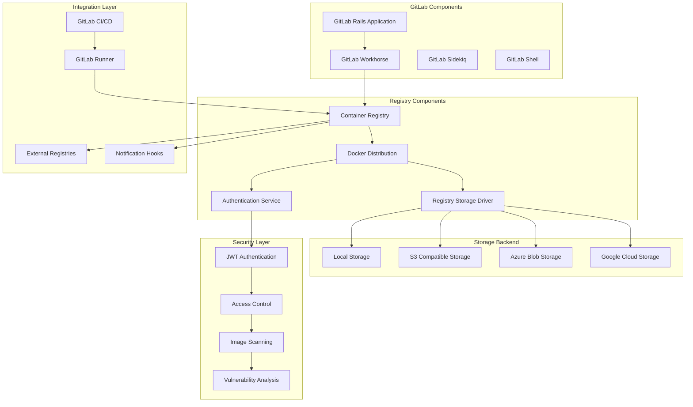

# GitLab Container Registry Enterprise 深度实践

> **Author**: Container Platform Architect | **Version**: v1.0 | **Update Time**: 2026-02-07
> **Scenario**: Enterprise-grade container registry with GitLab integration | **Complexity**: ⭐⭐⭐⭐

## 🎯 Abstract

This document provides comprehensive exploration of GitLab Container Registry enterprise deployment architecture, security practices, and operational management. Based on large-scale production environment experience, it offers complete technical guidance from registry setup to image lifecycle management, helping enterprises build secure, scalable container image management platforms integrated with GitLab CI/CD pipelines.

## 1. GitLab Container Registry Architecture

### 1.1 Core Component Architecture



### 1.2 High Availability Deployment

```yaml
gitlab_registry_ha:
  registry_cluster:
    primary_registry:
      hostname: registry-primary.company.com
      role: primary
      configuration:
        storage_driver: s3
        s3_bucket: gitlab-registry-primary
        replicas: 3
        
    secondary_registry:
      hostname: registry-secondary.company.com
      role: secondary
      configuration:
        storage_driver: azure
        azure_container: gitlab-registry-secondary
        replicas: 2
  
  load_balancing:
    global_lb:
      type: nginx/haproxy
      ssl_termination: true
      health_checks: registry_health_endpoint
      sticky_sessions: true
      
    dns_routing:
      primary_domain: registry.company.com
      geo_dns: enabled
      failover_time: 30s
  
  storage_backend:
    multi_cloud:
      aws_s3:
        bucket: gitlab-registry-aws
        region: us-west-2
        encryption: AES256
        
      azure_blob:
        container: gitlab-registry-azure
        storage_account: companyregistry
        encryption: Microsoft.Managed
        
      gcs:
        bucket: gitlab-registry-gcp
        location: US-EAST1
        encryption: Google managed
```

## 2. Enterprise Configuration and Security

### 2.1 Registry Configuration

```ruby
# /etc/gitlab/gitlab.rb - GitLab Registry配置

# 基础配置
registry_external_url 'https://registry.company.com'
registry['enable'] = true

# 存储配置
registry['storage'] = {
  's3' => {
    'accesskey' => 'YOUR_AWS_ACCESS_KEY',
    'secretkey' => 'YOUR_AWS_SECRET_KEY',
    'bucket' => 'gitlab-registry-storage',
    'region' => 'us-west-2',
    'regionendpoint' => 'https://s3.us-west-2.amazonaws.com',
    'encrypt' => true,
    'secure' => true
  }
}

# 认证和授权
registry['auth'] = {
  'token' => {
    'realm' => 'https://gitlab.company.com/jwt/auth',
    'service' => 'container_registry',
    'issuer' => 'gitlab-issuer',
    'rootcertbundle' => '/etc/gitlab/ssl/registry.crt'
  }
}

# 安全配置
registry['tls'] = {
  'certificate' => '/etc/gitlab/ssl/registry.crt',
  'key' => '/etc/gitlab/ssl/registry.key'
}

registry['http'] = {
  'addr' => ':5000',
  'secret' => 'your-registry-http-secret',
  'debug' => {
    'addr' => ':5001',
    'prometheus' => {
      'enabled' => true,
      'path' => '/metrics'
    }
  }
}

# 垃圾回收配置
registry['gc'] = {
  'disabled' => false,
  'workers' => 2,
  'maxbackoff' => '24h',
  'transactiontimeout' => '10s'
}

# 通知配置
registry['notifications'] = {
  'endpoints' => [
    {
      'name' => 'gitlab_internal',
      'url' => 'http://localhost:8080/api/v4/internal/registry_event',
      'timeout' => '500ms',
      'threshold' => 5,
      'backoff' => '1s'
    }
  ]
}

# 性能调优
registry['validation'] = {
  'disabled' => false,
  'manifests' => {
    'urls' => {
      'allow' => ['^https?://']
    }
  }
}

# 启用实验性功能
registry['experimental'] = {
  'incremental_fs_layers' => true
}
```

### 2.2 Advanced Security Configuration

```bash
#!/bin/bash
# GitLab Registry安全加固脚本

# 1. SSL证书配置
openssl req -x509 -nodes -days 365 -newkey rsa:2048 \
  -keyout /etc/gitlab/ssl/registry.key \
  -out /etc/gitlab/ssl/registry.crt \
  -subj "/CN=registry.company.com/O=Company/C=US"

# 2. 权限设置
chmod 600 /etc/gitlab/ssl/registry.key
chmod 644 /etc/gitlab/ssl/registry.crt
chown root:root /etc/gitlab/ssl/registry.*

# 3. 网络安全配置
iptables -A INPUT -p tcp --dport 5000 -j ACCEPT
iptables -A INPUT -p tcp --dport 5001 -j ACCEPT

# 4. 镜像扫描集成
cat > /opt/scripts/image_scan_hook.sh << 'EOF'
#!/bin/bash
# 镜像推送后自动扫描脚本

IMAGE_NAME=$1
IMAGE_TAG=$2
FULL_IMAGE="${IMAGE_NAME}:${IMAGE_TAG}"

# 调用安全扫描工具
trivy image --exit-code 1 --severity HIGH,CRITICAL "$FULL_IMAGE"

# 如果扫描失败，拒绝镜像
if [ $? -ne 0 ]; then
    echo "Security scan failed for $FULL_IMAGE"
    exit 1
fi

# 记录扫描结果
echo "$(date): Scanned $FULL_IMAGE - PASSED" >> /var/log/registry/security_scans.log
EOF

chmod +x /opt/scripts/image_scan_hook.sh
```

### 2.3 Access Control and Permissions

```yaml
# gitlab_registry_access_control.yml
access_control:
  project_level:
    visibility_levels:
      - private: 
          allowed_groups: ["developers", "admins"]
          pull_access: ["maintainers", "developers"]
          push_access: ["maintainers"]
          
      - internal:
          allowed_groups: ["all_authenticated_users"]
          pull_access: ["members"]
          push_access: ["maintainers", "owners"]
          
      - public:
          allowed_groups: ["everyone"]
          pull_access: ["anonymous"]
          push_access: ["owners"]
  
  group_level:
    inheritance_rules:
      - parent_group_can_pull: true
      - child_group_can_push: false
      - external_collaborators: limited_access
  
  user_permissions:
    role_mappings:
      - role: guest
        permissions: [pull_images]
        
      - role: reporter
        permissions: [pull_images, view_metadata]
        
      - role: developer
        permissions: [pull_images, push_images, delete_images]
        
      - role: maintainer
        permissions: [all_registry_permissions]
        
      - role: owner
        permissions: [admin_registry, manage_permissions]

  ip_whitelisting:
    enabled: true
    whitelisted_ranges:
      - "10.0.0.0/8"
      - "172.16.0.0/12"
      - "192.168.0.0/16"
    blocked_ranges:
      - "0.0.0.0/0"  # 默认拒绝，仅允许白名单
```

## 3. CI/CD Integration and Automation

### 3.1 GitLab CI/CD Registry Integration

```yaml
# .gitlab-ci.yml - 容器镜像构建和推送
stages:
  - build
  - test
  - security-scan
  - deploy

variables:
  DOCKER_REGISTRY: registry.company.com
  DOCKER_IMAGE: $DOCKER_REGISTRY/$CI_PROJECT_PATH:$CI_COMMIT_SHA
  DOCKER_LATEST: $DOCKER_REGISTRY/$CI_PROJECT_PATH:latest

before_script:
  - docker login -u $CI_REGISTRY_USER -p $CI_REGISTRY_PASSWORD $DOCKER_REGISTRY

build-image:
  stage: build
  image: docker:20.10
  services:
    - docker:20.10-dind
  script:
    - docker build --pull -t $DOCKER_IMAGE .
    - docker push $DOCKER_IMAGE
    
    # 如果是master分支，也推送到latest标签
    - |
      if [ "$CI_COMMIT_BRANCH" == "master" ]; then
        docker tag $DOCKER_IMAGE $DOCKER_LATEST
        docker push $DOCKER_LATEST
      fi
  only:
    - branches
  except:
    - tags

security-scan:
  stage: security-scan
  image: aquasec/trivy:latest
  script:
    - trivy image --exit-code 1 --severity HIGH,CRITICAL $DOCKER_IMAGE
  allow_failure: false
  only:
    - master
    - develop

deploy-to-staging:
  stage: deploy
  image: bitnami/kubectl:latest
  script:
    - |
      kubectl set image deployment/my-app \
        app-container=$DOCKER_IMAGE \
        --namespace staging
  environment:
    name: staging
    url: https://staging.company.com
  only:
    - develop

deploy-to-production:
  stage: deploy
  image: bitnami/kubectl:latest
  script:
    - |
      kubectl set image deployment/my-app \
        app-container=$DOCKER_LATEST \
        --namespace production
  environment:
    name: production
    url: https://company.com
  when: manual
  only:
    - master
```

### 3.2 Advanced Registry Operations

```python
#!/usr/bin/env python3
# gitlab_registry_manager.py
import requests
import json
from datetime import datetime, timedelta
import boto3

class GitLabRegistryManager:
    def __init__(self, gitlab_url, private_token, registry_url):
        self.gitlab_url = gitlab_url
        self.headers = {'PRIVATE-TOKEN': private_token}
        self.registry_url = registry_url
        self.s3_client = boto3.client('s3')
    
    def list_projects_with_registry(self):
        """列出所有使用容器注册表的项目"""
        projects = []
        page = 1
        
        while True:
            response = requests.get(
                f"{self.gitlab_url}/api/v4/projects",
                headers=self.headers,
                params={'page': page, 'per_page': 100, 'statistics': True}
            )
            
            if response.status_code != 200:
                break
                
            page_projects = response.json()
            if not page_projects:
                break
                
            for project in page_projects:
                if project['container_registry_enabled']:
                    projects.append({
                        'id': project['id'],
                        'name': project['name'],
                        'path': project['path_with_namespace'],
                        'registry_size': project['statistics'].get('container_registry_size', 0)
                    })
            
            page += 1
            
        return projects
    
    def cleanup_old_images(self, project_id, keep_tags=5):
        """清理旧的镜像标签"""
        # 获取项目的所有镜像仓库
        repositories_response = requests.get(
            f"{self.gitlab_url}/api/v4/projects/{project_id}/registry/repositories",
            headers=self.headers
        )
        
        if repositories_response.status_code != 200:
            return False
            
        repositories = repositories_response.json()
        
        for repo in repositories:
            # 获取标签列表
            tags_response = requests.get(
                f"{self.gitlab_url}/api/v4/projects/{project_id}/registry/repositories/{repo['id']}/tags",
                headers=self.headers
            )
            
            if tags_response.status_code != 200:
                continue
                
            tags = sorted(tags_response.json(), 
                         key=lambda x: datetime.fromisoformat(x['created_at'].rstrip('Z')),
                         reverse=True)
            
            # 保留最新的N个标签，删除其余的
            tags_to_delete = tags[keep_tags:]
            
            for tag in tags_to_delete:
                delete_response = requests.delete(
                    f"{self.gitlab_url}/api/v4/projects/{project_id}/registry/repositories/{repo['id']}/tags/{tag['name']}",
                    headers=self.headers
                )
                
                if delete_response.status_code == 204:
                    print(f"Deleted tag: {repo['name']}:{tag['name']}")
    
    def generate_storage_report(self):
        """生成存储使用报告"""
        projects = self.list_projects_with_registry()
        
        total_size = 0
        report_data = []
        
        for project in projects:
            size_gb = project['registry_size'] / (1024**3)
            total_size += size_gb
            
            report_data.append({
                'project': project['path'],
                'size_gb': round(size_gb, 2),
                'repository_count': self._get_repository_count(project['id'])
            })
        
        # 生成报告
        report = {
            'generated_at': datetime.now().isoformat(),
            'total_storage_gb': round(total_size, 2),
            'project_count': len(projects),
            'projects': sorted(report_data, key=lambda x: x['size_gb'], reverse=True)
        }
        
        return report
    
    def _get_repository_count(self, project_id):
        """获取项目仓库数量"""
        response = requests.get(
            f"{self.gitlab_url}/api/v4/projects/{project_id}/registry/repositories",
            headers=self.headers
        )
        return len(response.json()) if response.status_code == 200 else 0

# 使用示例
if __name__ == "__main__":
    manager = GitLabRegistryManager(
        "https://gitlab.company.com",
        "your-private-token",
        "registry.company.com"
    )
    
    # 生成存储报告
    report = manager.generate_storage_report()
    print(json.dumps(report, indent=2))
    
    # 清理超过30天的旧镜像
    for project in report['projects']:
        if project['size_gb'] > 10:  # 超过10GB的项目进行清理
            manager.cleanup_old_images(project['project_id'], keep_tags=10)
```

## 4. Monitoring and Maintenance

### 4.1 Registry Health Monitoring

```bash
#!/bin/bash
# registry_monitoring.sh

REGISTRY_URL="https://registry.company.com"
HEALTH_ENDPOINT="$REGISTRY_URL/v2/"
METRICS_ENDPOINT="$REGISTRY_URL/metrics"

check_registry_health() {
    echo "Checking registry health at $(date)"
    
    # 1. 基础连通性检查
    if ! curl -k -f -s "$HEALTH_ENDPOINT" >/dev/null; then
        echo "ERROR: Registry health endpoint unreachable"
        return 1
    fi
    
    # 2. 认证检查
    AUTH_RESPONSE=$(curl -k -s -w "%{http_code}" -o /tmp/auth_response.txt \
        "$REGISTRY_URL/v2/" -H "Authorization: Bearer test-token")
    
    if [ "$AUTH_RESPONSE" != "401" ]; then
        echo "WARNING: Unexpected authentication response: $AUTH_RESPONSE"
    fi
    
    # 3. 性能检查
    RESPONSE_TIME=$(curl -k -s -w "%{time_total}" -o /dev/null "$HEALTH_ENDPOINT")
    if (( $(echo "$RESPONSE_TIME > 2.0" | bc -l) )); then
        echo "WARNING: Slow response time: ${RESPONSE_TIME}s"
    fi
    
    echo "Registry health check passed"
    return 0
}

check_storage_usage() {
    # AWS S3存储使用情况
    if command -v aws &> /dev/null; then
        USAGE=$(aws s3 ls s3://gitlab-registry-storage --recursive --human-readable | \
                awk 'END {print $3}')
        echo "S3 Storage Usage: $USAGE"
    fi
    
    # 本地存储使用情况
    if [ -d "/var/opt/gitlab/gitlab-rails/shared/registry" ]; then
        LOCAL_USAGE=$(du -sh /var/opt/gitlab/gitlab-rails/shared/registry | cut -f1)
        echo "Local Storage Usage: $LOCAL_USAGE"
    fi
}

monitor_registry_metrics() {
    # 收集Prometheus指标
    curl -k -s "$METRICS_ENDPOINT" | \
    awk '/^registry_.*/ {print $1}' | \
    while read metric; do
        echo "Metric: $metric"
    done
}

# 主监控循环
while true; do
    check_registry_health
    check_storage_usage
    monitor_registry_metrics
    echo "---"
    sleep 300  # 每5分钟检查一次
done
```

### 4.2 Backup and Disaster Recovery

```bash
#!/bin/bash
# registry_backup_restore.sh

BACKUP_BASE="/backup/registry"
DATE=$(date +%Y%m%d_%H%M%S)
BACKUP_DIR="$BACKUP_BASE/$DATE"

# 1. 备份配置文件
backup_configurations() {
    mkdir -p "$BACKUP_DIR/config"
    
    # GitLab配置
    cp /etc/gitlab/gitlab.rb "$BACKUP_DIR/config/"
    
    # Registry配置
    cp -r /var/opt/gitlab/gitlab-rails/etc/registry* "$BACKUP_DIR/config/" 2>/dev/null || true
    
    # SSL证书
    cp -r /etc/gitlab/ssl "$BACKUP_DIR/config/" 2>/dev/null || true
}

# 2. 备份镜像数据（S3）
backup_s3_data() {
    if [ -n "$AWS_ACCESS_KEY_ID" ]; then
        mkdir -p "$BACKUP_DIR/images"
        
        aws s3 sync s3://gitlab-registry-storage "$BACKUP_DIR/images" \
            --exclude "*" \
            --include "*.tar.gz" \
            --include "docker/registry/v2/repositories/*"
        
        # 记录备份元数据
        aws s3 ls s3://gitlab-registry-storage --recursive > "$BACKUP_DIR/s3_manifest.txt"
    fi
}

# 3. 备份数据库相关数据
backup_database_data() {
    mkdir -p "$BACKUP_DIR/database"
    
    # 备份GitLab数据库中的registry相关表
    gitlab-rake gitlab:backup:create SKIP=artifacts,uploads,lfs,registry
    
    # 移动备份文件到我们的备份目录
    LATEST_BACKUP=$(ls -t /var/opt/gitlab/backups/*.tar | head -1)
    if [ -n "$LATEST_BACKUP" ]; then
        cp "$LATEST_BACKUP" "$BACKUP_DIR/database/"
    fi
}

# 4. 创建备份清单
create_backup_manifest() {
    cat > "$BACKUP_DIR/manifest.json" << EOF
{
  "backup_id": "$DATE",
  "created_at": "$(date -Iseconds)",
  "gitlab_version": "$(gitlab-rake gitlab:env:info | grep 'GitLab version' | cut -d' ' -f3)",
  "components": {
    "configurations": "config/",
    "images": "images/",
    "database": "database/"
  },
  "size_bytes": $(du -sb "$BACKUP_DIR" | cut -f1),
  "checksum": "$(find "$BACKUP_DIR" -type f -exec md5sum {} \; | md5sum | cut -d' ' -f1)"
}
EOF
}

# 5. 验证备份完整性
verify_backup() {
    if [ -f "$BACKUP_DIR/manifest.json" ]; then
        echo "Backup manifest created successfully"
    else
        echo "ERROR: Backup manifest creation failed"
        return 1
    fi
    
    # 验证关键文件存在
    REQUIRED_FILES=("config/gitlab.rb" "database/")
    for file in "${REQUIRED_FILES[@]}"; do
        if [ ! -e "$BACKUP_DIR/$file" ]; then
            echo "ERROR: Required backup file missing: $file"
            return 1
        fi
    done
    
    echo "Backup verification passed"
    return 0
}

# 6. 清理旧备份
cleanup_old_backups() {
    find "$BACKUP_BASE" -mindepth 1 -maxdepth 1 -type d -mtime +30 -exec rm -rf {} \;
}

# 恢复功能
restore_registry() {
    local restore_point="$1"
    
    if [ ! -d "$BACKUP_BASE/$restore_point" ]; then
        echo "ERROR: Restore point not found: $restore_point"
        return 1
    fi
    
    echo "Starting registry restoration from $restore_point"
    
    # 恢复配置文件
    cp "$BACKUP_BASE/$restore_point/config/gitlab.rb" /etc/gitlab/
    
    # 恢复数据库
    BACKUP_FILE=$(ls "$BACKUP_BASE/$restore_point/database/"*.tar)
    if [ -n "$BACKUP_FILE" ]; then
        cp "$BACKUP_FILE" /var/opt/gitlab/backups/
        gitlab-rake gitlab:backup:restore BACKUP=$(basename "$BACKUP_FILE" .tar)
    fi
    
    # 重新配置GitLab
    gitlab-ctl reconfigure
    
    echo "Registry restoration completed"
}

# 主函数
main() {
    case "$1" in
        backup)
            echo "Starting registry backup..."
            backup_configurations
            backup_s3_data
            backup_database_data
            create_backup_manifest
            if verify_backup; then
                cleanup_old_backups
                echo "Backup completed successfully: $BACKUP_DIR"
            else
                echo "Backup failed"
                exit 1
            fi
            ;;
        restore)
            if [ -z "$2" ]; then
                echo "Usage: $0 restore <backup_date>"
                exit 1
            fi
            restore_registry "$2"
            ;;
        list)
            echo "Available backups:"
            ls -la "$BACKUP_BASE/"
            ;;
        *)
            echo "Usage: $0 {backup|restore|list}"
            exit 1
            ;;
    esac
}

main "$@"
```

## 5. Performance Optimization

### 5.1 Registry Performance Tuning

```ruby
# /etc/gitlab/gitlab.rb - 性能优化配置

# Registry性能调优
registry['storage'] = {
  'cache' => {
    'blobdescriptor' => {
      'disabled' => false,
      'ttl' => '30m'
    }
  },
  'delete' => {
    'enabled' => true
  },
  'redirect' => {
    'disable' => false  # 启用直接重定向到存储后端
  }
}

# 并发和连接池配置
registry['http'] = {
  'addr' => ':5000',
  'net' => 'tcp',
  'debug' => {
    'addr' => ':5001',
    'prometheus' => {
      'enabled' => true
    }
  },
  'headers' => {
    'X-Content-Type-Options' => ['nosniff']
  },
  'tls' => {
    'minimumtls' => ' tls1.2',
    'cipherSuites' => [
      'TLS_ECDHE_RSA_WITH_AES_256_GCM_SHA384',
      'TLS_ECDHE_RSA_WITH_AES_128_GCM_SHA256'
    ]
  }
}

# 垃圾回收优化
registry['gc'] = {
  'disabled' => false,
  'workers' => 4,  # 增加GC工作线程
  'maxbackoff' => '12h',
  'transactiontimeout' => '30s'
}

# 缓存配置
redis['enable'] = true
gitlab_rails['redis_cache_instance'] = 'redis://localhost:6379'

# 启用HTTP/2支持
nginx['http2_enabled'] = true

# 启用压缩
nginx['gzip_enabled'] = true
nginx['gzip_types'] = [
  'text/plain',
  'text/css',
  'application/json',
  'application/javascript',
  'text/xml',
  'application/xml',
  'application/xml+rss',
  'text/javascript',
  'application/vnd.docker.distribution.manifest.v2+json'
]
```

### 5.2 CDN Integration for Image Distribution

```yaml
# cdn_integration.yml
cdn_configuration:
  cloudflare:
    enabled: true
    zone_id: your-zone-id
    api_token: your-api-token
    cache_rules:
      - pattern: "*.company.com/v2/*"
        cache_level: cache_everything
        edge_cache_ttl: 14400  # 4小时
        browser_cache_ttl: 31536000  # 1年
        
      - pattern: "*.company.com/v2/*/manifests/*"
        cache_level: bypass  # 不缓存manifests以确保最新
        
      - pattern: "*.company.com/v2/*/blobs/*"
        cache_level: cache_everything
        edge_cache_ttl: 86400  # 24小时
        
  akamai:
    enabled: false
    property_id: your-property-id
    cache_behavior:
      - path_pattern: "/v2/*"
        ttl: 3600
        stale_while_revalidate: 300
        
  custom_cdn:
    enabled: true
    provider: "your-custom-cdn"
    configuration:
      origin: "registry.company.com"
      ssl_certificate: "cdn-registry-cert.pem"
      caching_rules:
        - match: "path_extension"
          extensions: [".tar.gz", ".layer"]
          ttl: 86400
          
        - match: "content_type"
          types: ["application/octet-stream"]
          ttl: 43200
```

---
*This document is based on enterprise-level GitLab Container Registry practice experience and continuously updated with the latest technologies and best practices.*