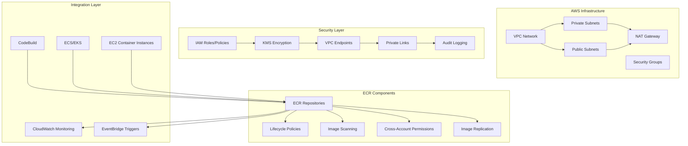

# Amazon ECR (Elastic Container Registry) Enterprise 深度实践

> **Author**: Cloud Container Platform Architect | **Version**: v1.0 | **Update Time**: 2026-02-07
> **Scenario**: Enterprise-grade container image management on AWS | **Complexity**: ⭐⭐⭐⭐

## 🎯 Abstract

This document provides comprehensive exploration of Amazon ECR enterprise deployment architecture, security practices, and operational management. Based on large-scale production environment experience, it offers complete technical guidance from registry setup to image lifecycle management, helping enterprises build secure, scalable container image management platforms on AWS with integrated security scanning and cross-account sharing capabilities.

## 1. Amazon ECR Enterprise Architecture

### 1.1 Core Component Architecture



### 1.2 Multi-Account Architecture

```yaml
ecr_multi_account:
  central_account:
    account_id: "123456789012"
    role: "ecr-central"
    repositories:
      - name: "shared/base-images"
        policy: "cross-account-pull"
      - name: "shared/tools"
        policy: "cross-account-pull"
  
  development_accounts:
    - account_id: "234567890123"
      role: "ecr-dev"
      repositories:
        - name: "app-dev/frontend"
          policy: "account-specific"
        - name: "app-dev/backend"
          policy: "account-specific"
          
    - account_id: "345678901234"
      role: "ecr-staging"
      repositories:
        - name: "app-staging/frontend"
          policy: "limited-access"
        - name: "app-staging/backend"
          policy: "limited-access"
  
  production_account:
    account_id: "456789012345"
    role: "ecr-prod"
    repositories:
      - name: "app-prod/frontend"
        policy: "restricted-access"
      - name: "app-prod/backend"
        policy: "restricted-access"
  
  cross_account_access:
    policies:
      - name: "ecr-pull-policy"
        effect: "Allow"
        actions:
          - "ecr:BatchCheckLayerAvailability"
          - "ecr:BatchGetImage"
          - "ecr:GetDownloadUrlForLayer"
        principals:
          - "arn:aws:iam::234567890123:root"
          - "arn:aws:iam::345678901234:root"
          - "arn:aws:iam::456789012345:root"
```

## 2. Advanced Security Configuration

### 2.1 IAM Policy and Role Configuration

```json
{
  "Version": "2012-10-17",
  "Statement": [
    {
      "Sid": "ECRRepositoryManagement",
      "Effect": "Allow",
      "Action": [
        "ecr:CreateRepository",
        "ecr:DeleteRepository",
        "ecr:DescribeRepositories",
        "ecr:SetRepositoryPolicy",
        "ecr:GetRepositoryPolicy"
      ],
      "Resource": "arn:aws:ecr:*:123456789012:repository/*"
    },
    {
      "Sid": "ECRLifecycleManagement",
      "Effect": "Allow",
      "Action": [
        "ecr:PutLifecyclePolicy",
        "ecr:GetLifecyclePolicy",
        "ecr:DeleteLifecyclePolicy"
      ],
      "Resource": "arn:aws:ecr:*:123456789012:repository/*"
    },
    {
      "Sid": "ECRImageScanning",
      "Effect": "Allow",
      "Action": [
        "ecr:StartImageScan",
        "ecr:DescribeImageScanFindings",
        "ecr:GetImageScanStatus"
      ],
      "Resource": "arn:aws:ecr:*:123456789012:repository/*"
    },
    {
      "Sid": "CrossAccountPull",
      "Effect": "Allow",
      "Action": [
        "ecr:BatchCheckLayerAvailability",
        "ecr:BatchGetImage",
        "ecr:GetDownloadUrlForLayer"
      ],
      "Resource": "arn:aws:ecr:*:123456789012:repository/shared/*",
      "Condition": {
        "StringEquals": {
          "aws:PrincipalOrgID": "o-exampleorgid"
        }
      }
    }
  ]
}
```

### 2.2 Repository Lifecycle Policies

```json
{
  "rules": [
    {
      "rulePriority": 1,
      "description": "清理未标记的镜像",
      "selection": {
        "tagStatus": "untagged",
        "countType": "sinceImagePushed",
        "countUnit": "days",
        "countNumber": 7
      },
      "action": {
        "type": "expire"
      }
    },
    {
      "rulePriority": 2,
      "description": "保留最新的生产镜像",
      "selection": {
        "tagStatus": "tagged",
        "tagPrefixList": ["prod-", "release-"],
        "countType": "imageCountMoreThan",
        "countNumber": 50
      },
      "action": {
        "type": "expire"
      }
    },
    {
      "rulePriority": 3,
      "description": "清理开发环境旧镜像",
      "selection": {
        "tagStatus": "tagged",
        "tagPrefixList": ["dev-", "feature-"],
        "countType": "sinceImagePushed",
        "countUnit": "days",
        "countNumber": 30
      },
      "action": {
        "type": "expire"
      }
    },
    {
      "rulePriority": 4,
      "description": "基于镜像大小的清理策略",
      "selection": {
        "tagStatus": "any",
        "countType": "imageCountMoreThan",
        "countNumber": 1000
      },
      "action": {
        "type": "expire"
      }
    }
  ]
}
```

### 2.3 Enhanced Security Scanning

```bash
#!/bin/bash
# ecr_security_scanning.sh

AWS_REGION="us-west-2"
ECR_REGISTRY="123456789012.dkr.ecr.${AWS_REGION}.amazonaws.com"

# 1. 启用增强扫描
enable_enhanced_scanning() {
    aws ecr put-registry-scanning-configuration \
        --scan-type ENHANCED \
        --rules '[{"repositoryFilter":{"filter":"*", "filterType":"WILDCARD"}, "scanFrequency":"CONTINUOUS_SCAN"}]' \
        --region $AWS_REGION
}

# 2. 批量扫描现有镜像
scan_existing_images() {
    REPOSITORIES=$(aws ecr describe-repositories --region $AWS_REGION --query 'repositories[].repositoryName' --output text)
    
    for repo in $REPOSITORIES; do
        echo "Scanning repository: $repo"
        
        IMAGES=$(aws ecr describe-images \
            --repository-name $repo \
            --region $AWS_REGION \
            --query 'imageDetails[].imageDigest' \
            --output text)
        
        for digest in $IMAGES; do
            aws ecr start-image-scan \
                --repository-name $repo \
                --image-id imageDigest=$digest \
                --region $AWS_REGION
        done
    done
}

# 3. 安全合规检查
check_security_findings() {
    aws ecr describe-image-scan-findings \
        --repository-name $1 \
        --image-id imageTag=$2 \
        --region $AWS_REGION \
        --query 'imageScanFindings.findings[?severity==`HIGH` || severity==`CRITICAL`]' \
        --output json
}

# 4. 自动生成安全报告
generate_security_report() {
    REPORT_FILE="/tmp/ecr_security_report_$(date +%Y%m%d).json"
    
    aws ecr describe-registries \
        --region $AWS_REGION \
        --query 'registries[0].{
            registryId: registryId,
            scanType: scanType,
            scanOnPush: scanOnPush,
            repositories: repositories[*].{
                repositoryName: repositoryName,
                imageScanningConfiguration: imageScanningConfiguration
            }
        }' > $REPORT_FILE
    
    echo "Security report generated: $REPORT_FILE"
}

# 5. 集成到CI/CD流水线
integrate_with_ci() {
    cat > buildspec.yml << 'EOF'
version: 0.2

phases:
  pre_build:
    commands:
      - echo Logging in to Amazon ECR...
      - aws ecr get-login-password --region $AWS_DEFAULT_REGION | docker login --username AWS --password-stdin $ECR_REGISTRY
      
  build:
    commands:
      - echo Build started on `date`
      - echo Building the Docker image...
      - docker build -t $IMAGE_REPO_NAME:$IMAGE_TAG .
      
  post_build:
    commands:
      - echo Build completed on `date`
      - echo Pushing the Docker image...
      - docker push $ECR_REGISTRY/$IMAGE_REPO_NAME:$IMAGE_TAG
      
      - echo Starting security scan...
      - aws ecr start-image-scan \
          --repository-name $IMAGE_REPO_NAME \
          --image-id imageTag=$IMAGE_TAG \
          --region $AWS_DEFAULT_REGION
      
      - echo Waiting for scan completion...
      - aws ecr wait image-scan-complete \
          --repository-name $IMAGE_REPO_NAME \
          --image-id imageTag=$IMAGE_TAG \
          --region $AWS_DEFAULT_REGION
      
      - echo Checking scan results...
      - SCAN_FINDINGS=$(aws ecr describe-image-scan-findings \
          --repository-name $IMAGE_REPO_NAME \
          --image-id imageTag=$IMAGE_TAG \
          --region $AWS_DEFAULT_REGION \
          --query 'imageScanFindings.findingSeverityCounts.CRITICAL' \
          --output text)
      
      - if [ "$SCAN_FINDINGS" != "None" ] && [ "$SCAN_FINDINGS" -gt 0 ]; then
          echo "CRITICAL vulnerabilities found: $SCAN_FINDINGS"
          exit 1
        fi
      
      - echo Scan passed, image is secure
EOF
}
```

## 3. Cross-Region and Cross-Account Management

### 3.1 Cross-Region Replication Setup

```bash
#!/bin/bash
# ecr_cross_region_replication.sh

PRIMARY_REGION="us-west-2"
REPLICA_REGIONS=("us-east-1" "eu-west-1")

# 1. 在主区域创建存储库
create_primary_repository() {
    aws ecr create-repository \
        --repository-name $1 \
        --region $PRIMARY_REGION \
        --image-scanning-configuration scanOnPush=true \
        --encryption-configuration encryptionType=KMS \
        --image-tag-mutability MUTABLE
}

# 2. 配置跨区域复制
setup_cross_region_replication() {
    REPO_NAME=$1
    
    for region in "${REPLICA_REGIONS[@]}"; do
        echo "Setting up replication to $region"
        
        # 在副本区域创建存储库
        aws ecr create-repository \
            --repository-name $REPO_NAME \
            --region $region \
            --image-scanning-configuration scanOnPush=true
        
        # 配置复制规则
        cat > replication_config.json << EOF
{
  "rules": [
    {
      "destinations": [
        {
          "region": "$region",
          "registryId": "$(aws sts get-caller-identity --query Account --output text)"
        }
      ]
    }
  ]
}
EOF
        
        aws ecr put-replication-configuration \
            --replication-configuration file://replication_config.json \
            --region $PRIMARY_REGION
    done
}

# 3. 验证复制状态
verify_replication_status() {
    REPO_NAME=$1
    
    aws ecr describe-image-replication-status \
        --repository-name $REPO_NAME \
        --region $PRIMARY_REGION
}

# 4. 故障转移脚本
failover_to_replica() {
    REPO_NAME=$1
    FAILOVER_REGION=$2
    
    # 更新DNS指向故障转移区域
    aws route53 change-resource-record-sets \
        --hosted-zone-id $HOSTED_ZONE_ID \
        --change-batch '{
            "Changes": [{
                "Action": "UPSERT",
                "ResourceRecordSet": {
                    "Name": "'$REPO_NAME'.ecr.'$FAILOVER_REGION'.amazonaws.com",
                    "Type": "CNAME",
                    "TTL": 300,
                    "ResourceRecords": [{"Value": "'$FAILOVER_REGION'"}]
                }
            }]
        }'
}
```

### 3.2 Cross-Account Sharing

```json
{
  "Version": "2012-10-17",
  "Statement": [
    {
      "Sid": "AllowCrossAccountPull",
      "Effect": "Allow",
      "Principal": {
        "AWS": [
          "arn:aws:iam::234567890123:root",
          "arn:aws:iam::345678901234:root"
        ]
      },
      "Action": [
        "ecr:BatchCheckLayerAvailability",
        "ecr:BatchGetImage",
        "ecr:GetDownloadUrlForLayer"
      ],
      "Resource": "arn:aws:ecr:us-west-2:123456789012:repository/shared/*"
    },
    {
      "Sid": "AllowCrossAccountPush",
      "Effect": "Allow",
      "Principal": {
        "AWS": "arn:aws:iam::234567890123:role/ECR-Push-Role"
      },
      "Action": [
        "ecr:InitiateLayerUpload",
        "ecr:UploadLayerPart",
        "ecr:CompleteLayerUpload",
        "ecr:PutImage"
      ],
      "Resource": "arn:aws:ecr:us-west-2:123456789012:repository/team-a/*"
    }
  ]
}
```

## 4. Monitoring and Governance

### 4.1 CloudWatch Monitoring

```json
{
  "AlarmName": "ECR-Repository-Size-Warning",
  "AlarmDescription": "Trigger when repository size exceeds 500GB",
  "MetricName": "RepositorySizeBytes",
  "Namespace": "AWS/ECR",
  "Statistic": "Maximum",
  "Period": 300,
  "EvaluationPeriods": 1,
  "Threshold": 536870912000,
  "ComparisonOperator": "GreaterThanThreshold",
  "Dimensions": [
    {
      "Name": "RepositoryName",
      "Value": "my-repository"
    }
  ],
  "AlarmActions": [
    "arn:aws:sns:us-west-2:123456789012:ECR-Alerts"
  ]
}
```

### 4.2 Cost Optimization and Governance

```python
#!/usr/bin/env python3
# ecr_cost_governance.py
import boto3
import json
from datetime import datetime, timedelta

class ECRCostGovernance:
    def __init__(self, region='us-west-2'):
        self.ecr_client = boto3.client('ecr', region_name=region)
        self.cloudwatch = boto3.client('cloudwatch', region_name=region)
        self.cost_explorer = boto3.client('ce', region_name='us-east-1')
    
    def analyze_repository_costs(self):
        """分析存储库成本"""
        repositories = self.ecr_client.describe_repositories()['repositories']
        
        cost_data = []
        for repo in repositories:
            # 获取存储库指标
            metrics = self.cloudwatch.get_metric_statistics(
                Namespace='AWS/ECR',
                MetricName='RepositorySizeBytes',
                Dimensions=[{'Name': 'RepositoryName', 'Value': repo['repositoryName']}],
                StartTime=datetime.now() - timedelta(days=30),
                EndTime=datetime.now(),
                Period=86400,
                Statistics=['Average']
            )
            
            # 计算近似成本（假设$0.10/GB-月）
            if metrics['Datapoints']:
                latest_size = metrics['Datapoints'][-1]['Average']
                monthly_cost = (latest_size / (1024**3)) * 0.10
                
                cost_data.append({
                    'repository': repo['repositoryName'],
                    'size_gb': latest_size / (1024**3),
                    'monthly_cost': monthly_cost,
                    'created_at': repo['createdAt']
                })
        
        return sorted(cost_data, key=lambda x: x['monthly_cost'], reverse=True)
    
    def identify_cost_optimization_opportunities(self):
        """识别成本优化机会"""
        repositories = self.analyze_repository_costs()
        
        recommendations = []
        for repo in repositories:
            # 识别大尺寸存储库
            if repo['size_gb'] > 100:
                recommendations.append({
                    'type': 'large_repository',
                    'repository': repo['repository'],
                    'recommendation': f'Consider implementing aggressive lifecycle policies for repository {repo["repository"]} (currently {repo["size_gb"]:.2f} GB)'
                })
            
            # 识别长期未使用的存储库
            if (datetime.now() - repo['created_at'].replace(tzinfo=None)).days > 180:
                recommendations.append({
                    'type': 'old_repository',
                    'repository': repo['repository'],
                    'recommendation': f'Repository {repo["repository"]} was created over 180 days ago - consider archiving or deleting if no longer needed'
                })
        
        return recommendations

# 使用示例
if __name__ == "__main__":
    governance = ECRCostGovernance()
    
    # 分析成本
    costs = governance.analyze_repository_costs()
    print("Repository Costs:")
    for cost in costs:
        print(f"{cost['repository']}: ${cost['monthly_cost']:.2f}/month ({cost['size_gb']:.2f} GB)")
    
    # 获取优化建议
    recommendations = governance.identify_cost_optimization_opportunities()
    print("\nCost Optimization Recommendations:")
    for rec in recommendations:
        print(f"- {rec['recommendation']}")
```

## 5. Integration with Container Orchestration

### 5.1 EKS Integration

```yaml
# eks_ecr_integration.yaml
apiVersion: v1
kind: ServiceAccount
metadata:
  name: ecr-reader
  namespace: default
  annotations:
    eks.amazonaws.com/role-arn: arn:aws:iam::123456789012:role/ECR-Reader-Role

---
apiVersion: rbac.authorization.k8s.io/v1
kind: ClusterRole
metadata:
  name: ecr-reader-role
rules:
- apiGroups: [""]
  resources: ["secrets"]
  verbs: ["get", "list"]
- apiGroups: ["batch", "extensions"]
  resources: ["jobs"]
  verbs: ["get", "list", "watch"]

---
apiVersion: v1
kind: Secret
metadata:
  name: ecr-credentials
  namespace: default
type: kubernetes.io/dockerconfigjson
data:
  .dockerconfigjson: <base64-encoded-docker-config>

---
apiVersion: apps/v1
kind: Deployment
metadata:
  name: app-with-ecr-image
spec:
  replicas: 3
  selector:
    matchLabels:
      app: my-app
  template:
    metadata:
      labels:
        app: my-app
    spec:
      serviceAccountName: ecr-reader
      imagePullSecrets:
      - name: ecr-credentials
      containers:
      - name: app
        image: 123456789012.dkr.ecr.us-west-2.amazonaws.com/my-app:latest
        ports:
        - containerPort: 8080
```

### 5.2 ECS Integration

```json
{
  "taskDefinition": {
    "family": "web-app",
    "executionRoleArn": "arn:aws:iam::123456789012:role/ecsTaskExecutionRole",
    "containerDefinitions": [
      {
        "name": "web",
        "image": "123456789012.dkr.ecr.us-west-2.amazonaws.com/web-app:latest",
        "memory": 512,
        "cpu": 256,
        "essential": true,
        "portMappings": [
          {
            "containerPort": 80,
            "hostPort": 80,
            "protocol": "tcp"
          }
        ],
        "logConfiguration": {
          "logDriver": "awslogs",
          "options": {
            "awslogs-group": "/ecs/web-app",
            "awslogs-region": "us-west-2",
            "awslogs-stream-prefix": "ecs"
          }
        },
        "repositoryCredentials": {
          "credentialsParameter": "arn:aws:secretsmanager:us-west-2:123456789012:secret:ecr-credentials"
        }
      }
    ]
  }
}
```

---
*This document is based on enterprise-level Amazon ECR practice experience and continuously updated with the latest technologies and best practices.*