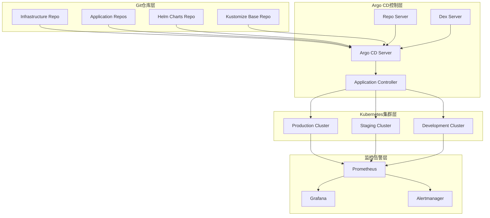

# Argo CD企业级GitOps实践指南

> **作者**: GitOps架构专家 | **版本**: v1.0 | **更新时间**: 2026-02-07
> **适用场景**: 企业级持续交付平台 | **复杂度**: ⭐⭐⭐⭐⭐

## 🎯 摘要

本文档深入探讨了Argo CD企业级GitOps实践的架构设计、部署配置和运维管理，基于大规模生产环境的应用经验，提供从基础设施即代码到应用自动化的完整技术指南，帮助企业构建安全、可靠的GitOps交付体系。

## 1. GitOps架构深度解析

### 1.1 核心概念与原理



### 1.2 GitOps工作流程

```yaml
gitops_workflow:
  phases:
    development:
      - developers_commit_code: "开发者提交代码到feature分支"
      - automated_testing: "CI流水线自动运行单元测试和集成测试"
      - pull_request_created: "创建Pull Request触发代码审查"
    
    review:
      - code_review_completed: "代码审查通过"
      - security_scanning: "安全扫描和漏洞检测"
      - compliance_check: "合规性检查"
    
    deployment:
      - merge_to_main: "合并到主分支触发部署"
      - argocd_detection: "Argo CD检测到Git变更"
      - manifest_generation: "生成Kubernetes清单"
      - drift_detection: "检测集群状态漂移"
      - automated_sync: "自动同步到目标环境"
    
    verification:
      - health_check: "应用健康状态检查"
      - smoke_testing: "冒烟测试验证"
      - monitoring_validation: "监控指标验证"
      - rollback_if_failed: "失败时自动回滚"
```

## 2. 企业级高可用部署

### 2.1 Argo CD Helm部署配置

```yaml
# argocd-values.yaml
# 全局配置
global:
  image:
    repository: quay.io/argoproj/argocd
    tag: v2.9.0
  securityContext:
    runAsNonRoot: true
    runAsUser: 999

# 服务器配置
server:
  replicas: 3
  autoscaling:
    enabled: true
    minReplicas: 3
    maxReplicas: 10
    targetCPUUtilizationPercentage: 80
  resources:
    requests:
      cpu: 100m
      memory: 256Mi
    limits:
      cpu: 500m
      memory: 512Mi
  ingress:
    enabled: true
    hosts:
      - argocd.example.com
    annotations:
      kubernetes.io/ingress.class: nginx
      nginx.ingress.kubernetes.io/backend-protocol: "HTTPS"
      cert-manager.io/cluster-issuer: "letsencrypt-prod"
    https: true
    tls:
      - secretName: argocd-tls
        hosts:
          - argocd.example.com

# 应用控制器配置
applicationController:
  replicas: 2
  resources:
    requests:
      cpu: 250m
      memory: 512Mi
    limits:
      cpu: 1000m
      memory: 1Gi
  # 并发操作配置
  parallelismLimit: 10
  appResyncPeriod: 180
  # 状态缓存配置
  statusProcessors: 20
  operationProcessors: 10

# Repo服务器配置
repoServer:
  replicas: 2
  resources:
    requests:
      cpu: 100m
      memory: 128Mi
    limits:
      cpu: 500m
      memory: 256Mi
  # Git仓库缓存配置
  volumes:
    - name: tmp
      emptyDir: {}
  volumeMounts:
    - mountPath: /tmp
      name: tmp

# Dex服务器配置（用于SSO）
dex:
  enabled: true
  replicas: 2
  resources:
    requests:
      cpu: 50m
      memory: 64Mi
    limits:
      cpu: 100m
      memory: 128Mi

# Redis配置
redis:
  enabled: true
  exporter:
    enabled: true

# 高可用配置
ha:
  enabled: true
  # 外部Redis配置
  redisProxy:
    enabled: true
  # 外部数据库配置
  externalRedis:
    host: redis.example.com
    port: 6379
```

### 2.2 外部依赖组件部署

```yaml
# 外部Redis高可用部署
apiVersion: apps/v1
kind: StatefulSet
metadata:
  name: argocd-redis
  namespace: argocd
spec:
  serviceName: argocd-redis
  replicas: 3
  selector:
    matchLabels:
      app: argocd-redis
  template:
    metadata:
      labels:
        app: argocd-redis
    spec:
      containers:
      - name: redis
        image: redis:7-alpine
        command:
        - redis-server
        - /redis.conf
        ports:
        - containerPort: 6379
        volumeMounts:
        - name: redis-conf
          mountPath: /redis.conf
          subPath: redis.conf
        - name: redis-data
          mountPath: /data
        resources:
          requests:
            memory: 128Mi
            cpu: 50m
          limits:
            memory: 256Mi
            cpu: 100m
        livenessProbe:
          exec:
            command:
            - redis-cli
            - ping
          initialDelaySeconds: 30
          periodSeconds: 10
        readinessProbe:
          exec:
            command:
            - redis-cli
            - ping
          initialDelaySeconds: 5
          periodSeconds: 5
      volumes:
      - name: redis-conf
        configMap:
          name: argocd-redis-config
  volumeClaimTemplates:
  - metadata:
      name: redis-data
    spec:
      accessModes: [ "ReadWriteOnce" ]
      storageClassName: "fast-ssd"
      resources:
        requests:
          storage: 10Gi
---
# Redis哨兵配置
apiVersion: v1
kind: ConfigMap
metadata:
  name: argocd-redis-config
  namespace: argocd
data:
  redis.conf: |
    bind 0.0.0.0
    port 6379
    supervised no
    dir /data
    save 900 1
    save 300 10
    save 60 10000
    appendonly yes
    appendfilename "appendonly.aof"
    appendfsync everysec
    auto-aof-rewrite-percentage 100
    auto-aof-rewrite-min-size 64mb
    maxmemory 128mb
    maxmemory-policy allkeys-lru
```

## 3. 应用管理与配置

### 3.1 应用定义配置

```yaml
# Argo CD应用定义
apiVersion: argoproj.io/v1alpha1
kind: Application
metadata:
  name: guestbook
  namespace: argocd
spec:
  project: default
  
  # 源码配置
  source:
    repoURL: https://github.com/argoproj/argocd-example-apps.git
    targetRevision: HEAD
    path: guestbook
    
    # Kustomize配置
    kustomize:
      namePrefix: prod-
      images:
        - gcr.io/heptio-images/ks-guestbook-demo:0.2
      commonLabels:
        environment: production
      commonAnnotations:
        contact: "ops-team@example.com"
  
  # 目标集群配置
  destination:
    server: https://kubernetes.default.svc
    namespace: guestbook
  
  # 同步策略
  syncPolicy:
    automated:
      prune: true
      selfHeal: true
      allowEmpty: false
    syncOptions:
      - CreateNamespace=true
      - PrunePropagationPolicy=background
      - PruneLast=true
      - ApplyOutOfSyncOnly=true
    retry:
      limit: 5
      backoff:
        duration: 5s
        factor: 2
        maxDuration: 3m0s
  
  # 忽略差异配置
  ignoreDifferences:
    - group: apps
      kind: Deployment
      jsonPointers:
        - /spec/replicas
    - group: ""
      kind: Service
      name: guestbook-ui
      jsonPointers:
        - /spec/clusterIP
  
  # 信息配置
  info:
    - name: url
      value: https://guestbook.example.com
    - name: slack-channel
      value: "#guestbook-notifications"
```

### 3.2 项目权限管理

```yaml
# Argo CD项目定义
apiVersion: argoproj.io/v1alpha1
kind: AppProject
metadata:
  name: production
  namespace: argocd
spec:
  description: Production applications
  sourceRepos:
    - 'https://github.com/org/production-apps.git'
    - 'https://github.com/org/helm-charts.git'
    - 'https://charts.helm.sh/stable/*'
  
  destinations:
    - server: https://kubernetes.default.svc
      namespace: 'production-*'
    - server: https://k8s-cluster-prod.example.com
      namespace: '*'
  
  clusterResourceWhitelist:
    - group: '*'
      kind: '*'
  
  namespaceResourceBlacklist:
    - group: ''
      kind: ResourceQuota
    - group: ''
      kind: LimitRange
  
  roles:
    # 开发者角色
    - name: developer
      description: Read-only access to applications
      policies:
        - p, proj:production:developer, applications, get, production/*, allow
        - p, proj:production:developer, applications, sync, production/*, deny
      groups:
        - oidc:developers@example.com
    
    # 运维角色
    - name: operator
      description: Full access to applications
      policies:
        - p, proj:production:operator, applications, *, production/*, allow
        - p, proj:production:operator, projects, get, production, allow
      groups:
        - oidc:operators@example.com
    
    # 审计员角色
    - name: auditor
      description: Audit and compliance access
      policies:
        - p, proj:production:auditor, applications, get, production/*, allow
        - p, proj:production:auditor, logs, get, production/*, allow
        - p, proj:production:auditor, events, get, production/*, allow
      groups:
        - oidc:auditors@example.com
  
  signatureKeys:
    - keyID: ABCDEF1234567890
  
  syncWindows:
    - kind: allow
      schedule: '10 1 * * *'
      duration: 1h
      applications:
        - '*'
      manualSync: true
    
    - kind: deny
      schedule: '0 0 * * *'
      duration: 24h
      namespaces:
        - production-critical
      manualSync: false
```

## 4. 多环境管理策略

### 4.1 环境分支策略

```yaml
# 多环境GitOps策略
environments:
  development:
    branch: develop
    cluster: https://k8s-dev.example.com
    namespace: dev
    sync_policy: automated
    auto_prune: true
    self_heal: true
    
  staging:
    branch: staging
    cluster: https://k8s-staging.example.com
    namespace: staging
    sync_policy: automated
    auto_prune: true
    self_heal: true
    sync_options:
      - Validate=false  # 允许预发布验证
    
  production:
    branch: main
    cluster: https://k8s-prod.example.com
    namespace: production
    sync_policy: manual
    auto_prune: false
    self_heal: true
    sync_options:
      - ApplyOutOfSyncOnly=true
      - CreateNamespace=true

# 环境promotion流程
promotion_workflow:
  trigger: git_tag
  stages:
    - from: development
      to: staging
      conditions:
        - tests_passed: true
        - security_scan: clean
        - performance_benchmark: passed
    
    - from: staging
      to: production
      conditions:
        - manual_approval: required
        - canary_deployment: successful
        - monitoring_stable: 24h
```

### 4.2 Helm Chart管理

```yaml
# Helm应用定义
apiVersion: argoproj.io/v1alpha1
kind: Application
metadata:
  name: nginx-ingress
  namespace: argocd
spec:
  project: infrastructure
  source:
    repoURL: https://kubernetes.github.io/ingress-nginx
    chart: ingress-nginx
    targetRevision: 4.8.3
    helm:
      releaseName: nginx-ingress
      valueFiles:
        - values-production.yaml
      values: |
        controller:
          replicaCount: 3
          service:
            type: LoadBalancer
          resources:
            limits:
              cpu: 1000m
              memory: 1Gi
            requests:
              cpu: 100m
              memory: 256Mi
          metrics:
            enabled: true
            serviceMonitor:
              enabled: true
      parameters:
        - name: controller.service.annotations.service\.beta\.kubernetes\.io/aws-load-balancer-type
          value: nlb
        - name: controller.config."use-forwarded-headers"
          value: "true"
  
  destination:
    server: https://kubernetes.default.svc
    namespace: ingress-nginx
  
  syncPolicy:
    automated:
      prune: true
      selfHeal: true
    syncOptions:
      - CreateNamespace=true
      - ServerSideApply=true
```

## 5. 安全与合规管理

### 5.1 RBAC权限配置

```yaml
# Argo CD RBAC配置
policy.csv: |
  # 默认拒绝所有
  p, role:none, *, *, */*, deny
  
  # 管理员权限
  p, role:admin, applications, *, */*, allow
  p, role:admin, clusters, *, *, allow
  p, role:admin, repositories, *, *, allow
  p, role:admin, projects, *, *, allow
  p, role:admin, accounts, *, *, allow
  p, role:admin, gpgkeys, *, *, allow
  p, role:admin, certificates, *, *, allow
  p, role:admin, extensions, *, *, allow
  
  # 开发者权限
  p, role:developer, applications, get, */*, allow
  p, role:developer, applications, sync, dev/*, allow
  p, role:developer, applications, override, dev/*, allow
  p, role:developer, projects, get, *, allow
  p, role:developer, logs, get, dev/*, allow
  
  # 运维权限
  p, role:operator, applications, *, */*, allow
  p, role:operator, clusters, get, *, allow
  p, role:operator, repositories, get, *, allow
  p, role:operator, projects, get, *, allow
  p, role:operator, logs, get, */*, allow
  p, role:operator, exec, create, */*, allow
  
  # 审计权限
  p, role:auditor, applications, get, */*, allow
  p, role:auditor, projects, get, *, allow
  p, role:auditor, logs, get, */*, allow
  p, role:auditor, events, get, */*, allow
  
  # 角色绑定
  g, admin@example.com, role:admin
  g, developers@example.com, role:developer
  g, operators@example.com, role:operator
  g, auditors@example.com, role:auditor

policy.default: role:none

scopes: '[groups]'
```

### 5.2 SSO集成配置

```yaml
# Dex SSO配置
dex.config: |
  connectors:
    # GitHub OAuth
    - type: github
      id: github
      name: GitHub
      config:
        clientID: $dex.github.clientId
        clientSecret: $dex.github.clientSecret
        orgs:
        - name: your-organization
    
    # LDAP集成
    - type: ldap
      id: ldap
      name: LDAP
      config:
        host: ldap.example.com:636
        insecureNoSSL: false
        insecureSkipVerify: false
        startTLS: false
        rootCAData: $ldap.ca.cert
        bindDN: cn=admin,dc=example,dc=com
        bindPW: $ldap.bind.password
        usernamePrompt: Email Address
        userSearch:
          baseDN: ou=people,dc=example,dc=com
          filter: "(objectClass=person)"
          username: mail
          idAttr: DN
          emailAttr: mail
          nameAttr: displayName
        groupSearch:
          baseDN: ou=groups,dc=example,dc=com
          filter: "(objectClass=groupOfNames)"
          userMatchers:
          - userAttr: DN
            groupAttr: member
          nameAttr: cn
    
    # SAML集成
    - type: saml
      id: okta
      name: Okta
      config:
        ssoURL: https://your-org.okta.com/app/your-app/sso/saml
        caData: $saml.ca.cert
        redirectURI: https://argocd.example.com/api/dex/callback
        usernameAttr: name
        emailAttr: email
        groupsAttr: groups

  staticClients:
    - id: argo-cd
      redirectURIs:
        - https://argocd.example.com/auth/callback
      name: Argo CD
      secretEnv: ARGOCD_SSO_CLIENT_SECRET
```

## 6. 监控与告警

### 6.1 Prometheus监控配置

```yaml
# Argo CD监控配置
apiVersion: monitoring.coreos.com/v1
kind: ServiceMonitor
metadata:
  name: argocd-metrics
  namespace: argocd
spec:
  selector:
    matchLabels:
      app.kubernetes.io/name: argocd-metrics
  endpoints:
  - port: metrics
    path: /metrics
    interval: 30s
    relabelings:
    - sourceLabels: [__meta_kubernetes_pod_name]
      targetLabel: pod
    metricRelabelings:
    - sourceLabels: [__name__]
      regex: 'argocd_(.*)'
      targetLabel: __name__

# 自定义告警规则
apiVersion: monitoring.coreos.com/v1
kind: PrometheusRule
metadata:
  name: argocd-alerts
  namespace: argocd
spec:
  groups:
  - name: argocd.rules
    rules:
    # 应用同步失败告警
    - alert: ArgoAppSyncFailed
      expr: argocd_app_info{sync_status="OutOfSync"} > 0
      for: 5m
      labels:
        severity: warning
      annotations:
        summary: "Argo CD应用同步失败"
        description: "应用 {{ $labels.name }} 在 {{ $labels.namespace }} 中同步失败"
    
    # 应用健康状态异常告警
    - alert: ArgoAppUnhealthy
      expr: argocd_app_info{health_status!="Healthy"} > 0
      for: 10m
      labels:
        severity: critical
      annotations:
        summary: "Argo CD应用不健康"
        description: "应用 {{ $labels.name }} 健康状态异常: {{ $labels.health_status }}"
    
    # 同步操作失败告警
    - alert: ArgoSyncOperationFailed
      expr: increase(argocd_app_sync_total{phase="Error"}[5m]) > 0
      for: 1m
      labels:
        severity: critical
      annotations:
        summary: "Argo CD同步操作失败"
        description: "应用同步操作出现错误"
    
    # 控制器处理延迟告警
    - alert: ArgoControllerProcessingSlow
      expr: rate(argocd_app_reconcile_duration_seconds_sum[5m]) / rate(argocd_app_reconcile_duration_seconds_count[5m]) > 30
      for: 5m
      labels:
        severity: warning
      annotations:
        summary: "Argo CD控制器处理缓慢"
        description: "应用协调处理时间超过30秒"
```

### 6.2 Grafana仪表板配置

```json
{
  "dashboard": {
    "id": null,
    "title": "Argo CD Overview",
    "timezone": "browser",
    "schemaVersion": 16,
    "version": 0,
    "refresh": "30s",
    "panels": [
      {
        "type": "stat",
        "title": "应用总数",
        "gridPos": {
          "h": 4,
          "w": 6,
          "x": 0,
          "y": 0
        },
        "targets": [
          {
            "expr": "count(argocd_app_info)",
            "instant": true
          }
        ]
      },
      {
        "type": "stat",
        "title": "不同步应用数",
        "gridPos": {
          "h": 4,
          "w": 6,
          "x": 6,
          "y": 0
        },
        "targets": [
          {
            "expr": "count(argocd_app_info{sync_status=\"OutOfSync\"})",
            "instant": true
          }
        ]
      },
      {
        "type": "graph",
        "title": "同步状态趋势",
        "gridPos": {
          "h": 8,
          "w": 12,
          "x": 0,
          "y": 4
        },
        "targets": [
          {
            "expr": "count by (sync_status) (argocd_app_info)",
            "legendFormat": "{{sync_status}}"
          }
        ]
      },
      {
        "type": "table",
        "title": "应用健康状态",
        "gridPos": {
          "h": 8,
          "w": 12,
          "x": 12,
          "y": 4
        },
        "targets": [
          {
            "expr": "argocd_app_info",
            "format": "table"
          }
        ],
        "transformations": [
          {
            "id": "organize",
            "options": {
              "excludeByName": {
                "Time": true,
                "__name__": true,
                "instance": true,
                "job": true
              }
            }
          }
        ]
      }
    ]
  }
}
```

## 7. 灾难恢复与备份

### 7.1 配置备份策略

```bash
#!/bin/bash
# argocd_backup.sh

BACKUP_DIR="/backup/argocd"
DATE=$(date +%Y%m%d_%H%M%S)
BACKUP_NAME="argocd_backup_${DATE}"

# 创建备份目录
mkdir -p ${BACKUP_DIR}/${BACKUP_NAME}

# 1. 备份应用配置
echo "Backing up Argo CD applications..."
kubectl get applications -A -o yaml > ${BACKUP_DIR}/${BACKUP_NAME}/applications.yaml

# 2. 备份项目配置
echo "Backing up Argo CD projects..."
kubectl get appprojects -A -o yaml > ${BACKUP_DIR}/${BACKUP_NAME}/projects.yaml

# 3. 备份配置映射
echo "Backing up ConfigMaps..."
kubectl get configmap -n argocd -o yaml > ${BACKUP_DIR}/${BACKUP_NAME}/configmaps.yaml

# 4. 备份密钥（加密存储）
echo "Backing up secrets..."
kubectl get secret -n argocd -o yaml | kubeseal > ${BACKUP_DIR}/${BACKUP_NAME}/secrets.yaml

# 5. 备份RBAC配置
echo "Backing up RBAC configuration..."
kubectl get roles,rolebindings -n argocd -o yaml > ${BACKUP_DIR}/${BACKUP_NAME}/rbac.yaml

# 6. 备份Helm仓库配置
echo "Backing up Helm repositories..."
kubectl get secret -n argocd -l owner=helm -o yaml > ${BACKUP_DIR}/${BACKUP_NAME}/helm-repos.yaml

# 7. 创建备份清单
cat > ${BACKUP_DIR}/${BACKUP_NAME}/manifest.json << EOF
{
  "backup_name": "${BACKUP_NAME}",
  "created_at": "$(date -Iseconds)",
  "argocd_version": "$(kubectl exec -n argocd deploy/argocd-server -- argocd version --client | grep "argocd:" | cut -d: -f2)",
  "components": ["applications", "projects", "configmaps", "secrets", "rbac", "repositories"],
  "checksum": "$(sha256sum ${BACKUP_DIR}/${BACKUP_NAME}/* | sha256sum | cut -d' ' -f1)"
}
EOF

# 8. 压缩备份
tar -czf ${BACKUP_DIR}/${BACKUP_NAME}.tar.gz -C ${BACKUP_DIR} ${BACKUP_NAME}

# 9. 清理临时目录
rm -rf ${BACKUP_DIR}/${BACKUP_NAME}

# 10. 上传到远程存储
if [ -n "$REMOTE_STORAGE" ]; then
    echo "Uploading to remote storage..."
    aws s3 cp ${BACKUP_DIR}/${BACKUP_NAME}.tar.gz s3://$REMOTE_STORAGE/backups/
fi

echo "Backup completed: ${BACKUP_DIR}/${BACKUP_NAME}.tar.gz"
```

### 7.2 灾难恢复流程

```yaml
# 灾难恢复计划
disaster_recovery:
  rto: "2h"   # 恢复时间目标
  rpo: "1h"   # 恢复点目标
  
  recovery_steps:
    1:
      name: "环境重建"
      actions:
        - 部署新的Kubernetes集群
        - 安装Argo CD基础组件
        - 配置网络和存储
    
    2:
      name: "配置恢复"
      actions:
        - 从备份恢复ConfigMaps和Secrets
        - 恢复RBAC权限配置
        - 恢复仓库连接配置
    
    3:
      name: "应用恢复"
      actions:
        - 恢复应用项目配置
        - 恢复应用定义
        - 验证Git仓库连接
    
    4:
      name: "同步验证"
      actions:
        - 执行应用同步操作
        - 验证应用健康状态
        - 检查监控告警
    
    5:
      name: "服务切换"
      actions:
        - DNS记录更新
        - 流量切换
        - 用户通知

  rollback_conditions:
    - 恢复时间超过RTO
    - 数据完整性校验失败
    - 关键应用无法正常运行
    - 监控指标异常
```

## 8. 最佳实践与经验总结

### 8.1 GitOps实施最佳实践

```markdown
## 🚀 GitOps最佳实践

### 1. 仓库结构设计
- 使用单一代码库或多代码库策略
- 清晰的分支管理策略
- 标准化的目录结构
- 版本标签规范

### 2. 应用配置管理
- 声明式配置优先
- 环境差异化配置
- 参数化和模板化
- 配置版本控制

### 3. 安全合规要求
- 强制代码审查
- 自动安全扫描
- 访问权限最小化
- 审计日志完整

### 4. 监控告警体系
- 端到端可见性
- 多层级告警
- 自动故障恢复
- 性能指标监控
```

### 8.2 常见问题解决方案

```yaml
常见问题及解决方案:
  同步失败:
    原因: 
      - RBAC权限不足
      - 网络连接问题
      - 资源冲突
    解决方案:
      - 检查目标集群权限
      - 验证网络连通性
      - 解决资源名称冲突
  
  性能问题:
    原因:
      - 应用数量过多
      - 网络延迟高
      - 资源限制不当
    解决方案:
      - 调整控制器并发数
      - 优化网络配置
      - 合理设置资源限制
  
  安全问题:
    原因:
      - 权限配置过于宽松
      - 密钥管理不当
      - 缺乏审计跟踪
    解决方案:
      - 实施最小权限原则
      - 使用外部密钥管理
      - 启用详细审计日志
```

## 9. 未来发展与趋势

### 9.1 GitOps技术演进

```yaml
GitOps技术发展趋势:
  1. 平台化集成:
     - 与CI/CD平台深度融合
     - 多云统一管理
     - Serverless工作负载支持
     - 边缘计算部署
  
  2. 智能化运维:
     - AI驱动的配置优化
     - 自动故障预测和修复
     - 智能资源调度
     - 自适应安全策略
  
  3. 标准化发展:
     - OpenGitOps标准完善
     - 跨厂商互操作性
     - 行业最佳实践固化
     - 合规性框架集成
```

---
*本文档基于企业级GitOps实践经验编写，持续更新最新技术和最佳实践。*