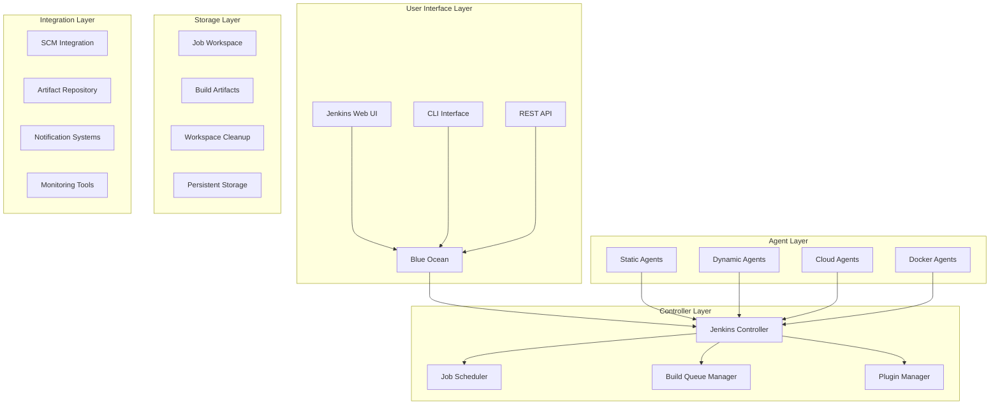

# Jenkins企业级CI/CD流水线深度实践

> **Author**: CI/CD Pipeline Architect | **Version**: v1.0 | **Update Time**: 2026-02-07
> **Scenario**: Enterprise-grade CI/CD pipeline architecture | **Complexity**: ⭐⭐⭐⭐⭐

## 🎯 Abstract

This document provides in-depth exploration of Jenkins enterprise CI/CD pipeline architecture design, deployment practices, and operational management. Based on large-scale production environment experience, it offers comprehensive technical guidance from pipeline design to automated deployment, helping enterprises build robust, scalable continuous integration and delivery systems.

## 1. Jenkins Architecture Deep Dive

### 1.1 Core Component Architecture



### 1.2 High Availability Architecture

```yaml
jenkins_ha_architecture:
  controller_cluster:
    active_controller:
      role: primary
      features: job_execution, ui_serving, api_handling
    standby_controllers:
      count: 2
      role: backup
      features: automatic_failover, load_balancing
    
  shared_resources:
    jenkins_home:
      storage: nfs_shared_storage
      replication: synchronous
      backup: automated_daily
    
    database:
      type: external_mysql
      clustering: master_slave
      failover: automatic
    
    build_queue:
      persistence: redis_cluster
      replication: multi_az
```

## 2. Enterprise Deployment Configuration

### 2.1 Kubernetes Deployment

```yaml
# jenkins-controller-deployment.yaml
apiVersion: apps/v1
kind: Deployment
metadata:
  name: jenkins-controller
  namespace: ci-cd
spec:
  replicas: 1
  strategy:
    type: Recreate
  selector:
    matchLabels:
      app: jenkins-controller
  template:
    metadata:
      labels:
        app: jenkins-controller
    spec:
      serviceAccountName: jenkins
      containers:
      - name: jenkins
        image: jenkins/jenkins:lts-jdk11
        ports:
        - containerPort: 8080
          name: http-port
        - containerPort: 50000
          name: jnlp-port
        env:
        - name: JAVA_OPTS
          value: >-
            -Djenkins.install.runSetupWizard=false
            -Dhudson.model.DirectoryBrowserSupport.CSP=
            -Djenkins.CLI.disabled=true
            -Dhudson.footerURL=https://jenkins.example.com
            -Djenkins.model.Jenkins.slaveAgentPort=50000
            -Djenkins.model.Jenkins.slaveAgentPortEnforce=true
        - name: CASC_JENKINS_CONFIG
          value: /var/jenkins_home/casc_configs/jenkins.yaml
        volumeMounts:
        - name: jenkins-home
          mountPath: /var/jenkins_home
        - name: casc-config
          mountPath: /var/jenkins_home/casc_configs
        - name: plugins-txt
          mountPath: /usr/share/jenkins/ref/plugins.txt
          subPath: plugins.txt
        resources:
          requests:
            memory: "2Gi"
            cpu: "1000m"
          limits:
            memory: "4Gi"
            cpu: "2000m"
        livenessProbe:
          httpGet:
            path: "/login"
            port: 8080
          initialDelaySeconds: 300
          periodSeconds: 10
          timeoutSeconds: 5
          failureThreshold: 5
        readinessProbe:
          httpGet:
            path: "/login"
            port: 8080
          initialDelaySeconds: 300
          periodSeconds: 10
          timeoutSeconds: 5
          failureThreshold: 3
      volumes:
      - name: jenkins-home
        persistentVolumeClaim:
          claimName: jenkins-home-pvc
      - name: casc-config
        configMap:
          name: jenkins-casc-config
      - name: plugins-txt
        configMap:
          name: jenkins-plugins
---
# jenkins-agent-daemonset.yaml
apiVersion: apps/v1
kind: DaemonSet
metadata:
  name: jenkins-agent
  namespace: ci-cd
spec:
  selector:
    matchLabels:
      app: jenkins-agent
  template:
    metadata:
      labels:
        app: jenkins-agent
    spec:
      containers:
      - name: jenkins-agent
        image: jenkins/inbound-agent:jdk11
        env:
        - name: JENKINS_URL
          value: http://jenkins-controller:8080
        - name: JENKINS_TUNNEL
          value: jenkins-controller:50000
        - name: JENKINS_AGENT_NAME
          valueFrom:
            fieldRef:
              fieldPath: metadata.name
        - name: JENKINS_SECRET
          valueFrom:
            secretKeyRef:
              name: jenkins-agent-secret
              key: jenkins-agent-secret
        volumeMounts:
        - name: docker-sock
          mountPath: /var/run/docker.sock
        - name: workspace
          mountPath: /home/jenkins/agent
        resources:
          requests:
            memory: "512Mi"
            cpu: "250m"
          limits:
            memory: "2Gi"
            cpu: "1000m"
      volumes:
      - name: docker-sock
        hostPath:
          path: /var/run/docker.sock
      - name: workspace
        hostPath:
          path: /var/jenkins-agent-workspace
```

### 2.2 Configuration as Code

```yaml
# jenkins-casc.yaml
jenkins:
  systemMessage: "Jenkins configured automatically by Jenkins Configuration as Code plugin\n\n"
  numExecutors: 2
  mode: NORMAL
  quietPeriod: 5
  scmCheckoutRetryCount: 2
  labelString: "master"
  
  securityRealm:
    local:
      allowsSignup: false
      enableCaptcha: false
      users:
        - id: "admin"
          password: "${JENKINS_ADMIN_PASSWORD}"
  
  authorizationStrategy:
    globalMatrix:
      permissions:
        - "Overall/Administer:admin"
        - "Overall/Read:authenticated"
        - "Job/Build:developer"
        - "Job/Read:developer"
        - "View/Read:developer"

  crumbIssuer:
    standard:
      excludeClientIPFromCrumb: false

  remotingSecurity:
    enabled: true

security:
  apiToken:
    creationOfLegacyTokenEnabled: false
    tokenGenerationOnCreationEnabled: false
    usageStatisticsEnabled: true

  queueItemAuthenticator:
    authenticators:
      - global:
          strategy: triggeringUsersAuthorizationStrategy

tool:
  git:
    installations:
      - name: "Default"
        home: "git"

  maven:
    installations:
      - name: "Maven 3.8.6"
        properties:
          - installSource:
              installers:
                - maven:
                    id: "3.8.6"

  jdk:
    installations:
      - name: "OpenJDK 11"
        home: "/usr/lib/jvm/java-11-openjdk-amd64"

unclassified:
  location:
    adminAddress: "jenkins@example.com"
    url: "https://jenkins.example.com/"

  mailer:
    charset: "UTF-8"
    useSsl: true
    smtpHost: "smtp.gmail.com"
    smtpPort: 465
    authUsername: "jenkins@example.com"
    credentialsId: "smtp-credentials"

  globalDefaultFlowDurabilityLevel:
    durabilityHint: PERFORMANCE_OPTIMIZED

  timestamper:
    allPipelines: true
    elapsedTimeFormat: "'<b>'HH:mm:ss.S'</b> '"
    systemTimeFormat: "'<b>'HH:mm:ss'</b> '"

  buildDiscarder:
    configuredBuildDiscarders:
      - "jobBuildDiscarder"
      - defaultBuildDiscarder:
          discarder:
            logRotator:
              artifactNumToKeepStr: "5"
              numToKeepStr: "20"

jenkinsClouds:
  - kubernetes:
      name: "kubernetes"
      serverUrl: "https://kubernetes.default"
      namespace: "ci-cd"
      jenkinsUrl: "http://jenkins-controller:8080"
      jenkinsTunnel: "jenkins-controller:50000"
      containerCapStr: "10"
      connectTimeout: "60"
      readTimeout: "60"
      podRetention: "never"
      templates:
        - name: "maven"
          label: "maven"
          containers:
            - name: "jnlp"
              image: "jenkins/inbound-agent:jdk11"
              args: "${computer.jnlpmac} ${computer.name}"
              resourceLimitCpu: "500m"
              resourceRequestCpu: "100m"
              resourceLimitMemory: "1Gi"
              resourceRequestMemory: "256Mi"
            - name: "maven"
              image: "maven:3.8.6-jdk-11"
              ttyEnabled: true
              command: "cat"
              resourceLimitCpu: "1000m"
              resourceRequestCpu: "200m"
              resourceLimitMemory: "2Gi"
              resourceRequestMemory: "512Mi"
          volumes:
            - hostPathVolume:
                hostPath: "/var/run/docker.sock"
                mountPath: "/var/run/docker.sock"
          yaml: |
            apiVersion: v1
            kind: Pod
            spec:
              containers:
              - name: jnlp
                volumeMounts:
                - name: workspace-volume
                  mountPath: /home/jenkins/agent
              volumes:
              - name: workspace-volume
                emptyDir: {}
```

## 3. Pipeline Design Best Practices

### 3.1 Declarative Pipeline Template

```groovy
// pipeline-template.groovy
pipeline {
    agent {
        kubernetes {
            label 'maven-app'
            yaml """
apiVersion: v1
kind: Pod
spec:
  containers:
  - name: maven
    image: maven:3.8.6-jdk-11
    command:
    - cat
    tty: true
    volumeMounts:
    - name: maven-settings
      mountPath: /root/.m2/settings.xml
      subPath: settings.xml
    - name: maven-repo
      mountPath: /root/.m2/repository
  volumes:
  - name: maven-settings
    configMap:
      name: maven-settings
  - name: maven-repo
    persistentVolumeClaim:
      claimName: maven-repo-pvc
"""
        }
    }
    
    environment {
        APP_NAME = 'my-application'
        VERSION = sh(script: 'mvn help:evaluate -Dexpression=project.version -q -DforceStdout', returnStdout: true).trim()
        BUILD_NUMBER = "${env.BUILD_NUMBER}"
        GIT_COMMIT = sh(script: 'git rev-parse HEAD', returnStdout: true).trim()
    }
    
    options {
        buildDiscarder(logRotator(numToKeepStr: '10'))
        disableConcurrentBuilds()
        timeout(time: 60, unit: 'MINUTES')
        timestamps()
    }
    
    stages {
        stage('Checkout') {
            steps {
                git branch: 'main', url: 'https://github.com/company/my-application.git'
            }
        }
        
        stage('Build') {
            steps {
                container('maven') {
                    sh 'mvn clean compile'
                }
            }
            post {
                success {
                    archiveArtifacts artifacts: 'target/*.jar', fingerprint: true
                }
            }
        }
        
        stage('Test') {
            parallel {
                stage('Unit Tests') {
                    steps {
                        container('maven') {
                            sh 'mvn test'
                        }
                    }
                    post {
                        always {
                            publishTestResults testResultsPattern: '**/target/surefire-reports/*.xml'
                            publishCoverage adapters: [jacocoAdapter('target/site/jacoco/jacoco.xml')]
                        }
                    }
                }
                
                stage('Integration Tests') {
                    steps {
                        container('maven') {
                            sh 'mvn verify -DskipUnitTests'
                        }
                    }
                }
            }
        }
        
        stage('Security Scan') {
            steps {
                container('maven') {
                    sh '''
                        mvn dependency-check:check
                        trivy fs --exit-code 1 --severity HIGH,CRITICAL .
                    '''
                }
            }
            post {
                always {
                    publishHTML([
                        allowMissing: false,
                        alwaysLinkToLastBuild: true,
                        keepAll: true,
                        reportDir: 'target',
                        reportFiles: 'dependency-check-report.html',
                        reportName: 'Dependency Check Report'
                    ])
                }
            }
        }
        
        stage('Build Docker Image') {
            steps {
                script {
                    docker.build("${env.APP_NAME}:${env.VERSION}-${env.BUILD_NUMBER}")
                }
            }
        }
        
        stage('Deploy to Staging') {
            when {
                branch 'main'
            }
            steps {
                input message: 'Deploy to staging?', ok: 'Deploy'
                container('maven') {
                    sh '''
                        helm upgrade --install ${APP_NAME} ./helm \
                            --set image.tag=${VERSION}-${BUILD_NUMBER} \
                            --set environment=staging \
                            --namespace staging
                    '''
                }
            }
        }
        
        stage('Performance Test') {
            when {
                branch 'main'
            }
            steps {
                container('maven') {
                    sh 'mvn jmeter:jmeter'
                }
            }
        }
        
        stage('Deploy to Production') {
            when {
                branch 'main'
                environment name: 'DEPLOY_TO_PROD', value: 'true'
            }
            steps {
                timeout(time: 30, unit: 'MINUTES') {
                    input message: 'Deploy to production?', ok: 'Deploy', submitter: 'release-managers'
                }
                container('maven') {
                    sh '''
                        helm upgrade --install ${APP_NAME} ./helm \
                            --set image.tag=${VERSION}-${BUILD_NUMBER} \
                            --set environment=production \
                            --namespace production
                    '''
                }
            }
        }
    }
    
    post {
        always {
            cleanWs()
        }
        success {
            script {
                currentBuild.description = "Success: ${VERSION}-${BUILD_NUMBER}"
                slackSend channel: '#jenkins-notifications', 
                         color: 'good', 
                         message: "Build successful: ${env.JOB_NAME} #${env.BUILD_NUMBER}"
            }
        }
        failure {
            script {
                currentBuild.description = "Failed: ${VERSION}-${BUILD_NUMBER}"
                slackSend channel: '#jenkins-notifications', 
                         color: 'danger', 
                         message: "Build failed: ${env.JOB_NAME} #${env.BUILD_NUMBER}"
            }
        }
        unstable {
            script {
                currentBuild.description = "Unstable: ${VERSION}-${BUILD_NUMBER}"
                slackSend channel: '#jenkins-notifications', 
                         color: 'warning', 
                         message: "Build unstable: ${env.JOB_NAME} #${env.BUILD_NUMBER}"
            }
        }
    }
}
```

### 3.2 Shared Library Implementation

```groovy
// vars/buildMavenApp.groovy
def call(Map config = [:]) {
    def defaultConfig = [
        javaVersion: '11',
        mavenGoals: 'clean verify',
        skipTests: false,
        enableCoverage: true,
        enableSecurityScan: true
    ]
    
    config = defaultConfig + config
    
    pipeline {
        agent any
        
        stages {
            stage('Setup') {
                steps {
                    script {
                        sh "java -version"
                        sh "mvn -version"
                    }
                }
            }
            
            stage('Build') {
                steps {
                    sh "mvn ${config.mavenGoals} ${config.skipTests ? '-DskipTests' : ''}"
                }
            }
            
            stage('Test') {
                steps {
                    sh 'mvn test'
                    publishTestResults testResultsPattern: '**/target/surefire-reports/*.xml'
                    
                    if (config.enableCoverage) {
                        sh 'mvn jacoco:report'
                        publishCoverage adapters: [jacocoAdapter('target/site/jacoco/jacoco.xml')]
                    }
                }
            }
            
            if (config.enableSecurityScan) {
                stage('Security Scan') {
                    steps {
                        sh 'mvn dependency-check:check'
                        publishHTML([
                            allowMissing: false,
                            alwaysLinkToLastBuild: true,
                            keepAll: true,
                            reportDir: 'target',
                            reportFiles: 'dependency-check-report.html',
                            reportName: 'Dependency Check Report'
                        ])
                    }
                }
            }
        }
    }
}

// vars/deployToKubernetes.groovy
def call(Map config) {
    def requiredParams = ['appName', 'namespace', 'imageTag']
    requiredParams.each { param ->
        if (!config.containsKey(param)) {
            error "Missing required parameter: ${param}"
        }
    }
    
    def defaultConfig = [
        helmChartPath: './helm',
        timeout: 300,
        waitForDeployment: true,
        verifyDeployment: true
    ]
    
    config = defaultConfig + config
    
    stage("Deploy ${config.appName}") {
        steps {
            script {
                def helmCommand = """
                    helm upgrade --install ${config.appName} ${config.helmChartPath} \\
                        --set image.tag=${config.imageTag} \\
                        --namespace ${config.namespace} \\
                        --timeout ${config.timeout}s
                """
                
                sh helmCommand
                
                if (config.waitForDeployment) {
                    sh "kubectl rollout status deployment/${config.appName} -n ${config.namespace} --timeout=${config.timeout}s"
                }
                
                if (config.verifyDeployment) {
                    def podStatus = sh(
                        script: "kubectl get pods -n ${config.namespace} -l app=${config.appName} -o jsonpath='{.items[*].status.phase}'",
                        returnStdout: true
                    ).trim()
                    
                    if (!podStatus.contains('Running')) {
                        error "Deployment verification failed. Pod status: ${podStatus}"
                    }
                }
            }
        }
    }
}
```

## 4. Security and Compliance

### 4.1 Security Configuration

```yaml
# security-hardening.yaml
security:
  # Disable CLI access
  cli:
    enabled: false
  
  # CSRF Protection
  crumbIssuer:
    standard:
      excludeClientIPFromCrumb: false
  
  # Agent to Controller Security
  remotingSecurity:
    enabled: true
  
  # Script Security
  scriptApproval:
    approvedSignatures:
      - "method groovy.json.JsonSlurperClassic parseText java.lang.String"
      - "new groovy.json.JsonSlurperClassic"
      - "staticMethod org.apache.commons.io.IOUtils toString java.io.InputStream"
  
  # Credentials Management
  credentials:
    providers:
      - fileOnMaster:
          path: "/var/jenkins_home/credentials.xml"
      - aws:
          enabled: true
          region: "us-west-2"
  
  # Authentication
  authentication:
    saml:
      enabled: true
      idpMetadataUrl: "https://sso.company.com/idp/shibboleth"
      usernameAttributeName: "uid"
      emailAttributeName: "mail"
      groupAttributeName: "memberOf"
    
    ldap:
      enabled: true
      server: "ldap://ldap.company.com"
      rootDN: "dc=company,dc=com"
      userSearchBase: "ou=People"
      userSearch: "uid={0}"
      groupSearchBase: "ou=Groups"
  
  # Authorization
  authorization:
    matrix:
      permissions:
        # Admin permissions
        - "Overall/Administer:admin-group"
        - "Agent/Configure:admin-group"
        - "Agent/Delete:admin-group"
        - "Agent/Create:admin-group"
        - "Job/Configure:admin-group"
        - "Job/Delete:admin-group"
        - "Job/Create:admin-group"
        - "Run/Delete:admin-group"
        - "View/Delete:admin-group"
        - "View/Create:admin-group"
        - "Credentials/ManageDomains:admin-group"
        - "Credentials/View:admin-group"
        
        # Developer permissions
        - "Overall/Read:developer-group"
        - "Job/Build:developer-group"
        - "Job/Read:developer-group"
        - "Job/Cancel:developer-group"
        - "Run/Update:developer-group"
        - "View/Read:developer-group"
        - "SCM/Tag:developer-group"
```

### 4.2 Compliance Automation

```groovy
// compliance-checks.groovy
pipeline {
    agent any
    
    stages {
        stage('Code Quality Checks') {
            parallel {
                stage('SonarQube Analysis') {
                    steps {
                        withSonarQubeEnv('SonarQube') {
                            sh 'mvn sonar:sonar'
                        }
                    }
                }
                
                stage('Checkmarx Security Scan') {
                    steps {
                        script {
                            def cxServer = 'CheckmarxServer'
                            def projectName = "${env.JOB_NAME}_${env.BUILD_NUMBER}"
                            
                            cxsastScanner(
                                server: cxServer,
                                projectName: projectName,
                                preset: 'All',
                                incremental: true,
                                fullScansScheduled: true,
                                isIncremental: true,
                                isPublic: true,
                                generatePdfReport: true,
                                enableProjectPolicyEnforcement: true,
                                vulnerabilityThreshold: 'High',
                                highThreshold: 0,
                                mediumThreshold: 5,
                                lowThreshold: 10
                            )
                        }
                    }
                }
            }
        }
        
        stage('License Compliance') {
            steps {
                sh 'mvn license:check'
                sh '''
                    # Check for vulnerable dependencies
                    mvn dependency-check:check
                    # Generate software bill of materials
                    mvn cyclonedx:makeAggregateBom
                '''
            }
        }
        
        stage('Compliance Gate') {
            steps {
                script {
                    def sonarQualityGate = waitForQualityGate()
                    if (sonarQualityGate.status != 'OK') {
                        error "Pipeline aborted due to quality gate failure: ${sonarQualityGate.status}"
                    }
                    
                    // Check compliance thresholds
                    def highVulns = sh(
                        script: "grep -c '\"severity\":\"HIGH\"' target/dependency-check-report.json || echo 0",
                        returnStdout: true
                    ).trim() as Integer
                    
                    if (highVulns > 0) {
                        error "Compliance check failed: ${highVulns} high severity vulnerabilities found"
                    }
                }
            }
        }
    }
}
```

## 5. Monitoring and Maintenance

### 5.1 Health Monitoring

```yaml
# monitoring-setup.yaml
apiVersion: monitoring.coreos.com/v1
kind: ServiceMonitor
metadata:
  name: jenkins-monitor
  namespace: ci-cd
spec:
  selector:
    matchLabels:
      app: jenkins-controller
  endpoints:
  - port: http-port
    path: /prometheus/
    interval: 30s
    metricRelabelings:
    - sourceLabels: [__name__]
      regex: 'jenkins_(.*)'
      targetLabel: __name__
---
# alerting-rules.yaml
apiVersion: monitoring.coreos.com/v1
kind: PrometheusRule
metadata:
  name: jenkins-alerts
  namespace: ci-cd
spec:
  groups:
  - name: jenkins.rules
    rules:
    - alert: JenkinsDown
      expr: up{job="jenkins"} == 0
      for: 2m
      labels:
        severity: critical
      annotations:
        summary: "Jenkins is down"
        description: "Jenkins service on {{ $labels.instance }} is not responding"
    
    - alert: JenkinsHighQueueSize
      expr: jenkins_queue_size > 50
      for: 5m
      labels:
        severity: warning
      annotations:
        summary: "Jenkins queue size high"
        description: "Build queue size is {{ $value }}, above threshold"
    
    - alert: JenkinsAgentOffline
      expr: jenkins_node_offline > 0
      for: 10m
      labels:
        severity: critical
      annotations:
        summary: "Jenkins agents offline"
        description: "{{ $value }} agents are currently offline"
    
    - alert: JenkinsBuildFailureRate
      expr: rate(jenkins_job_duration_sum{status="FAILED"}[10m]) / rate(jenkins_job_duration_count[10m]) > 0.2
      for: 5m
      labels:
        severity: warning
      annotations:
        summary: "High build failure rate"
        description: "Build failure rate is {{ $value | humanizePercentage }}"
```

### 5.2 Backup and Disaster Recovery

```bash
#!/bin/bash
# jenkins-backup.sh

BACKUP_DIR="/backup/jenkins"
DATE=$(date +%Y%m%d_%H%M%S)
BACKUP_NAME="jenkins_backup_${DATE}"

# Create backup directory
mkdir -p ${BACKUP_DIR}/${BACKUP_NAME}

# 1. Backup Jenkins home directory
echo "Backing up Jenkins home directory..."
rsync -avz --exclude 'workspace' --exclude 'logs' /var/jenkins_home/ ${BACKUP_DIR}/${BACKUP_NAME}/jenkins_home/

# 2. Backup configuration
echo "Backing up Jenkins configuration..."
kubectl get configmap -n ci-cd -o yaml > ${BACKUP_DIR}/${BACKUP_NAME}/configmaps.yaml
kubectl get secret -n ci-cd -o yaml > ${BACKUP_DIR}/${BACKUP_NAME}/secrets.yaml

# 3. Backup plugins list
echo "Backing up plugins list..."
kubectl exec -n ci-cd deploy/jenkins-controller -- ls /var/jenkins_home/plugins/ > ${BACKUP_DIR}/${BACKUP_NAME}/plugins.txt

# 4. Backup job configurations
echo "Backing up job configurations..."
kubectl exec -n ci-cd deploy/jenkins-controller -- find /var/jenkins_home/jobs -name "config.xml" -exec tar -cf - {} + > ${BACKUP_DIR}/${BACKUP_NAME}/jobs.tar

# 5. Backup credentials
echo "Backing up credentials..."
kubectl exec -n ci-cd deploy/jenkins-controller -- tar -czf - /var/jenkins_home/credentials.xml /var/jenkins_home/secrets/ > ${BACKUP_DIR}/${BACKUP_NAME}/credentials.tar.gz

# 6. Create backup manifest
cat > ${BACKUP_DIR}/${BACKUP_NAME}/manifest.json << EOF
{
  "backup_name": "${BACKUP_NAME}",
  "created_at": "$(date -Iseconds)",
  "jenkins_version": "$(kubectl exec -n ci-cd deploy/jenkins-controller -- java -jar /usr/share/jenkins/jenkins.war --version)",
  "components": ["jenkins_home", "configuration", "plugins", "jobs", "credentials"],
  "checksum": "$(sha256sum ${BACKUP_DIR}/${BACKUP_NAME}/* | sha256sum | cut -d' ' -f1)"
}
EOF

# 7. Compress backup
tar -czf ${BACKUP_DIR}/${BACKUP_NAME}.tar.gz -C ${BACKUP_DIR} ${BACKUP_NAME}

# 8. Cleanup temporary directory
rm -rf ${BACKUP_DIR}/${BACKUP_NAME}

# 9. Upload to remote storage
if [ -n "$REMOTE_STORAGE" ]; then
    echo "Uploading to remote storage..."
    aws s3 cp ${BACKUP_DIR}/${BACKUP_NAME}.tar.gz s3://$REMOTE_STORAGE/backups/
fi

echo "Backup completed: ${BACKUP_DIR}/${BACKUP_NAME}.tar.gz"
```

## 6. Performance Optimization

### 6.1 Resource Tuning

```yaml
# performance-optimization.yaml
jenkins:
  java_opts: >-
    -Xms2g -Xmx4g
    -XX:+UseG1GC
    -XX:MaxGCPauseMillis=200
    -XX:G1HeapRegionSize=32m
    -XX:+UseStringDeduplication
    -Dhudson.model.LoadStatistics.clock=5000
    -Dhudson.model.LoadStatistics.decay=0.9
    -Dhudson.slaves.NodeProvisioner.MARGIN=50
    -Dhudson.slaves.NodeProvisioner.MARGIN0=0.85
    -Dhudson.queueSorter.strategy=PrioritySorterStrategy
    -Djenkins.model.Jenkins.logStartupPerformance=true

  system_properties:
    hudson.model.UpdateCenter.never: true
    hudson.model.DownloadService.never: true
    hudson.model.DownloadService.warnedFoo: true
    hudson.model.DownloadService.warnedBar: true
    hudson.model.UsageStatistics.disabled: true
    hudson.Util.symlinkEscapeHatch: true
    jenkins.model.Jenkins.workspaceDir: ${JENKINS_HOME}/workspace/${ITEM_FULL_NAME}
    jenkins.model.Jenkins.buildsDir: ${ITEM_ROOTDIR}/builds

  performance:
    node_provisioner:
      margin: 50
      margin0: 0.85
    
    queue_sorter:
      strategy: PrioritySorterStrategy
    
    load_statistics:
      clock: 5000
      decay: 0.9
```

### 6.2 Caching Strategies

```groovy
// caching-pipeline.groovy
pipeline {
    agent {
        kubernetes {
            yaml """
apiVersion: v1
kind: Pod
spec:
  containers:
  - name: maven
    image: maven:3.8.6-jdk-11
    volumeMounts:
    - name: maven-repo
      mountPath: /root/.m2/repository
    - name: npm-cache
      mountPath: /root/.npm
    - name: gradle-cache
      mountPath: /root/.gradle
  volumes:
  - name: maven-repo
    persistentVolumeClaim:
      claimName: maven-repo-cache
  - name: npm-cache
    persistentVolumeClaim:
      claimName: npm-cache
  - name: gradle-cache
    persistentVolumeClaim:
      claimName: gradle-cache
"""
        }
    }
    
    stages {
        stage('Cache Warm-up') {
            steps {
                sh '''
                    # Warm up Maven cache
                    mvn dependency:go-offline
                    
                    # Warm up NPM cache
                    npm cache verify
                    
                    # Warm up Gradle cache
                    gradle --daemon dependencies
                '''
            }
        }
        
        stage('Build with Cache') {
            steps {
                sh '''
                    # Build with warmed caches
                    mvn clean install -Dmaven.repo.local=/root/.m2/repository
                    npm install --cache /root/.npm
                    gradle build --gradle-user-home /root/.gradle
                '''
            }
        }
    }
}
```

## 7. Best Practices and Guidelines

### 7.1 Pipeline Design Principles

```markdown
## 🚀 Jenkins Pipeline Best Practices

### 1. Pipeline Structure
- Use declarative pipelines for consistency
- Implement shared libraries for reusable components
- Follow the DRY (Don't Repeat Yourself) principle
- Organize pipelines by application domains

### 2. Security Practices
- Never hardcode credentials in pipelines
- Use credential binding for sensitive data
- Implement least privilege access controls
- Regular security scanning and audits

### 3. Performance Optimization
- Use appropriate agent sizing
- Implement caching strategies
- Parallelize independent stages
- Optimize resource utilization

### 4. Reliability and Resilience
- Implement proper error handling
- Use timeouts to prevent hanging builds
- Implement retry mechanisms for flaky steps
- Maintain comprehensive logging
```

### 7.2 Maintenance Guidelines

```yaml
maintenance_guidelines:
  daily_tasks:
    - log_rotation: "Rotate and archive old build logs"
    - workspace_cleanup: "Clean up old workspaces"
    - plugin_updates: "Check for plugin updates"
  
  weekly_tasks:
    - system_backup: "Full Jenkins backup"
    - performance_monitoring: "Review performance metrics"
    - security_audits: "Review security logs"
    - agent_health_check: "Verify agent connectivity"
  
  monthly_tasks:
    - jenkins_upgrade: "Apply Jenkins core updates"
    - plugin_audit: "Review and update plugins"
    - configuration_review: "Audit configuration changes"
    - capacity_planning: "Review resource utilization"
```

## 8. Future Trends and Evolution

### 8.1 CI/CD Evolution

```yaml
future_trends:
  serverless_ci_cd:
    - cloud_native_pipelines
    - function_as_a_service_integration
    - event_driven_workflows
    - auto_scaling_build_infrastructure
  
  ai_enhanced_pipelines:
    - intelligent_pipeline_optimization
    - automated_test_generation
    - predictive_failure_analysis
    - smart_resource_allocation
  
  gitops_integration:
    - automated_gitops_workflows
    - infrastructure_as_code_pipelines
    - policy_as_code_enforcement
    - continuous_compliance
  
  security_first_approach:
    - shift_left_security_integration
    - supply_chain_security
    - zero_trust_ci_cd
    - compliance_as_code
```

---
*This document is based on enterprise-level CI/CD pipeline practice experience and continuously updated with the latest technologies and best practices.*