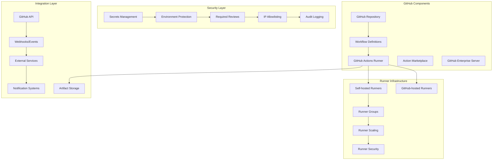

# GitHub Actions Enterprise CI/CD Platform 深度实践

> **Author**: DevOps Platform Architect | **Version**: v1.0 | **Update Time**: 2026-02-07
> **Scenario**: Enterprise-grade GitHub Actions workflow automation | **Complexity**: ⭐⭐⭐⭐

## 🎯 Abstract

This document provides comprehensive exploration of GitHub Actions enterprise deployment architecture, security practices, and operational management. Based on large-scale production environment experience, it offers complete technical guidance from workflow design to security hardening, helping enterprises build secure, scalable CI/CD automation platforms with GitHub Actions integrated security features and enterprise governance capabilities.

## 1. GitHub Actions Enterprise Architecture

### 1.1 Core Component Architecture



### 1.2 Enterprise Runner Architecture

```yaml
github_actions_enterprise:
  runner_groups:
    linux_runners:
      name: "linux-enterprise"
      visibility: "selected"
      selected_repositories: ["org/repo1", "org/repo2"]
      runners:
        - name: "linux-large-1"
          os: "linux"
          labels: ["ubuntu-20.04", "large", "docker"]
          capacity: 8
          
        - name: "linux-medium-1"
          os: "linux"
          labels: ["ubuntu-20.04", "medium", "node"]
          capacity: 4
    
    windows_runners:
      name: "windows-enterprise"
      visibility: "all"
      runners:
        - name: "windows-large-1"
          os: "windows"
          labels: ["windows-2019", "large", "dotnet"]
          capacity: 6
  
  security_policies:
    secret_scanning:
      enabled: true
      push_protection: true
      alert_recipients: ["security-team@company.com"]
    
    dependency_review:
      enabled: true
      fail_on_severity: "high"
    
    ip_allowlist:
      enabled: true
      allowed_ips:
        - "10.0.0.0/8"
        - "172.16.0.0/12"
        - "192.168.0.0/16"
```

## 2. Advanced Workflow Configuration

### 2.1 Enterprise Workflow Template

```yaml
# .github/workflows/enterprise-build-deploy.yml
name: Enterprise Build and Deploy Pipeline

on:
  push:
    branches: [ main, release/* ]
  pull_request:
    branches: [ main ]
  workflow_dispatch:

env:
  NODE_VERSION: '18.x'
  DOCKER_REGISTRY: 'ghcr.io'
  DEPLOY_ENVIRONMENT: ${{ github.ref == 'refs/heads/main' && 'production' || 'staging' }}

jobs:
  security-scan:
    runs-on: ubuntu-latest
    steps:
      - uses: actions/checkout@v4
      
      - name: Setup Node.js
        uses: actions/setup-node@v4
        with:
          node-version: ${{ env.NODE_VERSION }}
          cache: 'npm'
      
      - name: Install dependencies
        run: npm ci --audit=false
      
      - name: Run security audit
        run: npm audit --audit-level=high
        
      - name: Run SAST scan
        uses: github/codeql-action/analyze@v2
        with:
          languages: javascript
          
      - name: Dependency review
        uses: actions/dependency-review-action@v3
        with:
          fail-on-severity: high

  build-and-test:
    needs: security-scan
    runs-on: [self-hosted, linux, medium]
    strategy:
      matrix:
        node-version: [16.x, 18.x, 20.x]
        os: [ubuntu-20.04, ubuntu-22.04]
    steps:
      - uses: actions/checkout@v4
      
      - name: Setup Node.js ${{ matrix.node-version }}
        uses: actions/setup-node@v4
        with:
          node-version: ${{ matrix.node-version }}
          cache: 'npm'
      
      - name: Install dependencies
        run: npm ci
      
      - name: Run tests
        run: |
          npm run test:unit
          npm run test:integration
          
      - name: Code coverage
        run: npm run test:coverage
        
      - name: Upload coverage to Codecov
        uses: codecov/codecov-action@v3
        with:
          file: ./coverage/lcov.info
          flags: unittests
          name: codecov-umbrella

  build-container:
    needs: build-and-test
    runs-on: [self-hosted, linux, docker]
    steps:
      - uses: actions/checkout@v4
      
      - name: Set up Docker Buildx
        uses: docker/setup-buildx-action@v3
        
      - name: Login to Container Registry
        uses: docker/login-action@v3
        with:
          registry: ${{ env.DOCKER_REGISTRY }}
          username: ${{ github.actor }}
          password: ${{ secrets.GITHUB_TOKEN }}
      
      - name: Extract metadata
        id: meta
        uses: docker/metadata-action@v5
        with:
          images: ${{ env.DOCKER_REGISTRY }}/${{ github.repository }}
          tags: |
            type=ref,event=branch
            type=ref,event=pr
            type=sha,prefix={{branch}}-
            type=raw,value=latest,enable={{is_default_branch}}
      
      - name: Build and push
        uses: docker/build-push-action@v5
        with:
          context: .
          push: true
          tags: ${{ steps.meta.outputs.tags }}
          labels: ${{ steps.meta.outputs.labels }}
          cache-from: type=gha
          cache-to: type=gha,mode=max

  deploy-staging:
    needs: build-container
    runs-on: ubuntu-latest
    environment: staging
    if: github.ref == 'refs/heads/main' || startsWith(github.ref, 'refs/heads/release/')
    steps:
      - name: Deploy to staging
        run: |
          echo "Deploying to staging environment"
          # Deployment logic here
          
      - name: Run integration tests
        run: |
          echo "Running staging integration tests"
          # Integration test logic here

  deploy-production:
    needs: deploy-staging
    runs-on: ubuntu-latest
    environment: production
    if: github.ref == 'refs/heads/main'
    steps:
      - name: Deploy to production
        run: |
          echo "Deploying to production environment"
          # Production deployment logic here
          
      - name: Post-deployment verification
        run: |
          echo "Running post-deployment verification"
          # Verification logic here
```

### 2.2 Reusable Workflow Components

```yaml
# .github/workflows/reusable-security-scan.yml
name: Reusable Security Scan
on:
  workflow_call:
    inputs:
      node-version:
        required: false
        type: string
        default: '18.x'
      scan-level:
        required: false
        type: string
        default: 'high'
    outputs:
      scan-result:
        description: "Security scan result"
        value: ${{ jobs.security-scan.outputs.result }}

jobs:
  security-scan:
    runs-on: ubuntu-latest
    outputs:
      result: ${{ steps.scan-result.outputs.result }}
    steps:
      - uses: actions/checkout@v4
      
      - name: Setup Node.js
        uses: actions/setup-node@v4
        with:
          node-version: ${{ inputs.node-version }}
      
      - name: Install dependencies
        run: npm ci --audit=false
      
      - name: Run security audit
        id: audit
        run: |
          npm audit --audit-level=${{ inputs.scan-level }}
          echo "result=passed" >> $GITHUB_OUTPUT
        continue-on-error: true
      
      - name: Set scan result
        id: scan-result
        run: |
          if [ "${{ steps.audit.outcome }}" == "success" ]; then
            echo "result=passed" >> $GITHUB_OUTPUT
          else
            echo "result=failed" >> $GITHUB_OUTPUT
          fi
```

## 3. Enterprise Security and Governance

### 3.1 Security Hardening Configuration

```yaml
# .github/dependabot.yml
version: 2
updates:
  - package-ecosystem: "npm"
    directory: "/"
    schedule:
      interval: "daily"
    open-pull-requests-limit: 10
    reviewers:
      - "security-team"
    assignees:
      - "devops-team"
    labels:
      - "dependencies"
      - "security"
    commit-message:
      prefix: "security"
      include: "scope"
    ignore:
      - dependency-name: "lodash"
        versions: ["4.17.20"]

  - package-ecosystem: "docker"
    directory: "/"
    schedule:
      interval: "weekly"
    reviewers:
      - "platform-team"
```

### 3.2 Environment Protection Rules

```yaml
# Environment protection configuration
environments:
  production:
    wait_timer: 1440  # 24 hours
    reviewers:
      - "production-approvers"
    deployment_branch_policy:
      protected_branches: true
      custom_branch_policies:
        - "release/*"
        - "hotfix/*"
    
    secrets:
      PROD_DATABASE_URL: ${{ secrets.PROD_DATABASE_URL }}
      PROD_API_KEY: ${{ secrets.PROD_API_KEY }}
    
    variables:
      DEPLOY_TIMEOUT: "300"
      HEALTH_CHECK_ENDPOINT: "/health"
  
  staging:
    wait_timer: 60  # 1 hour
    reviewers:
      - "staging-approvers"
    deployment_branch_policy:
      protected_branches: true
    
    secrets:
      STAGING_DATABASE_URL: ${{ secrets.STAGING_DATABASE_URL }}
    
    variables:
      DEPLOY_TIMEOUT: "120"
      HEALTH_CHECK_ENDPOINT: "/health"
```

### 3.3 Custom GitHub App for Governance

```python
#!/usr/bin/env python3
# github_actions_governance.py
import requests
import json
from datetime import datetime, timedelta

class GitHubActionsGovernance:
    def __init__(self, github_token, org_name):
        self.token = github_token
        self.org = org_name
        self.headers = {
            'Authorization': f'token {github_token}',
            'Accept': 'application/vnd.github.v3+json'
        }
    
    def get_workflow_usage(self):
        """获取工作流使用统计"""
        workflows = []
        
        # 获取组织中的所有仓库
        repos_url = f"https://api.github.com/orgs/{self.org}/repos"
        repos_response = requests.get(repos_url, headers=self.headers)
        
        for repo in repos_response.json():
            # 获取仓库工作流
            workflows_url = f"https://api.github.com/repos/{self.org}/{repo['name']}/actions/workflows"
            workflows_response = requests.get(workflows_url, headers=self.headers)
            
            if workflows_response.status_code == 200:
                for workflow in workflows_response.json().get('workflows', []):
                    # 获取工作流运行历史
                    runs_url = f"https://api.github.com/repos/{self.org}/{repo['name']}/actions/workflows/{workflow['id']}/runs"
                    runs_response = requests.get(runs_url, headers=self.headers)
                    
                    if runs_response.status_code == 200:
                        runs = runs_response.json().get('workflow_runs', [])
                        workflows.append({
                            'repository': repo['name'],
                            'workflow': workflow['name'],
                            'total_runs': len(runs),
                            'success_rate': self._calculate_success_rate(runs),
                            'last_run': max([run['created_at'] for run in runs]) if runs else None
                        })
        
        return workflows
    
    def _calculate_success_rate(self, runs):
        """计算成功率"""
        if not runs:
            return 0
        
        successful_runs = len([run for run in runs if run['conclusion'] == 'success'])
        return (successful_runs / len(runs)) * 100
    
    def enforce_security_policies(self):
        """执行安全策略"""
        violations = []
        
        # 检查仓库安全设置
        repos_url = f"https://api.github.com/orgs/{self.org}/repos"
        repos_response = requests.get(repos_url, headers=self.headers)
        
        for repo in repos_response.json():
            # 检查是否启用了必需的状态检查
            branch_protection_url = f"https://api.github.com/repos/{self.org}/{repo['name']}/branches/main/protection"
            protection_response = requests.get(branch_protection_url, headers=self.headers)
            
            if protection_response.status_code != 200:
                violations.append({
                    'repository': repo['name'],
                    'violation': 'Missing branch protection',
                    'severity': 'high'
                })
            
            # 检查是否启用了依赖项审查
            security_config_url = f"https://api.github.com/repos/{self.org}/{repo['name']}/vulnerability-alerts"
            security_response = requests.get(security_config_url, headers=self.headers)
            
            if security_response.status_code != 204:
                violations.append({
                    'repository': repo['name'],
                    'violation': 'Dependency review not enabled',
                    'severity': 'medium'
                })
        
        return violations

# 使用示例
if __name__ == "__main__":
    governance = GitHubActionsGovernance("your-github-token", "your-organization")
    
    # 获取工作流使用情况
    usage = governance.get_workflow_usage()
    print("Workflow Usage Report:")
    for workflow in usage:
        print(f"{workflow['repository']}/{workflow['workflow']}: "
              f"{workflow['success_rate']:.1f}% success rate, "
              f"{workflow['total_runs']} total runs")
    
    # 检查安全违规
    violations = governance.enforce_security_policies()
    print("\nSecurity Violations:")
    for violation in violations:
        print(f"- {violation['repository']}: {violation['violation']} ({violation['severity']})")
```

## 4. Monitoring and Performance Optimization

### 4.1 Workflow Performance Monitoring

```yaml
# .github/workflows/performance-monitoring.yml
name: Workflow Performance Monitoring

on:
  schedule:
    - cron: '0 9 * * 1'  # 每周一上午9点运行
  workflow_dispatch:

jobs:
  monitor-workflows:
    runs-on: ubuntu-latest
    steps:
      - name: Checkout repository
        uses: actions/checkout@v4
      
      - name: Setup Python
        uses: actions/setup-python@v4
        with:
          python-version: '3.9'
      
      - name: Install dependencies
        run: |
          pip install requests pandas matplotlib
          
      - name: Run performance analysis
        run: python scripts/workflow_performance.py
        env:
          GITHUB_TOKEN: ${{ secrets.GITHUB_TOKEN }}
          ORG_NAME: ${{ github.repository_owner }}
      
      - name: Generate performance report
        run: |
          python scripts/generate_report.py
          
      - name: Upload report
        uses: actions/upload-artifact@v3
        with:
          name: performance-report
          path: reports/
```

### 4.2 Runner Optimization Scripts

```bash
#!/bin/bash
# runner_optimization.sh

# 1. 清理Runner缓存
cleanup_runner_cache() {
    echo "Cleaning up runner cache..."
    
    # 清理Docker缓存
    docker system prune -af --volumes
    
    # 清理npm缓存
    npm cache clean --force
    
    # 清理pip缓存
    pip cache purge
    
    # 清理系统缓存
    sudo apt-get clean
    sudo rm -rf /var/lib/apt/lists/*
    
    echo "Cache cleanup completed"
}

# 2. 监控Runner性能
monitor_runner_performance() {
    echo "Monitoring runner performance..."
    
    # CPU使用率
    cpu_usage=$(top -bn1 | grep "Cpu(s)" | awk '{print $2}' | cut -d'%' -f1)
    
    # 内存使用率
    mem_usage=$(free | grep Mem | awk '{printf("%.2f"), $3/$2 * 100.0}')
    
    # 磁盘使用率
    disk_usage=$(df -h / | awk 'NR==2 {print $5}' | sed 's/%//')
    
    # 记录到日志
    echo "$(date): CPU=${cpu_usage}%, MEM=${mem_usage}%, DISK=${disk_usage}%" >> /var/log/runner-performance.log
    
    # 如果资源使用率过高，发送告警
    if (( $(echo "$cpu_usage > 80" | bc -l) )) || \
       (( $(echo "$mem_usage > 85" | bc -l) )) || \
       [ "$disk_usage" -gt 90 ]; then
        echo "WARNING: High resource usage detected" | systemd-cat -p warning
    fi
}

# 3. 自动扩展Runner
auto_scale_runners() {
    CURRENT_RUNNERS=$(curl -s -H "Authorization: token $GITHUB_TOKEN" \
        "https://api.github.com/repos/$ORG_NAME/$REPO_NAME/actions/runners" | \
        jq '.runners | length')
    
    QUEUED_JOBS=$(curl -s -H "Authorization: token $GITHUB_TOKEN" \
        "https://api.github.com/repos/$ORG_NAME/$REPO_NAME/actions/runs?status=queued" | \
        jq '.total_count')
    
    # 如果队列中有等待的任务且Runner不足，启动新Runner
    if [ "$QUEUED_JOBS" -gt 0 ] && [ "$CURRENT_RUNNERS" -lt "$MAX_RUNNERS" ]; then
        echo "Scaling up runners: $CURRENT_RUNNERS -> $((CURRENT_RUNNERS + 1))"
        # 启动新Runner的逻辑
        ./scripts/start_new_runner.sh
    fi
}

# 主监控循环
while true; do
    cleanup_runner_cache
    monitor_runner_performance
    auto_scale_runners
    sleep 300  # 每5分钟执行一次
done
```

## 5. Integration with Enterprise Systems

### 5.1 Slack Integration

```yaml
# .github/workflows/slack-notification.yml
name: Slack Notifications

on:
  workflow_run:
    workflows: ["Enterprise Build and Deploy Pipeline"]
    types: [completed]

jobs:
  notify-slack:
    runs-on: ubuntu-latest
    steps:
      - name: Send Slack notification
        uses: slackapi/slack-github-action@v1.23.0
        with:
          payload: |
            {
              "text": "Workflow ${{ github.event.workflow_run.name }} has ${{ github.event.workflow_run.conclusion }}",
              "blocks": [
                {
                  "type": "section",
                  "text": {
                    "type": "mrkdwn",
                    "text": "*Workflow Status:*\n${{ github.event.workflow_run.name }} - ${{ github.event.workflow_run.conclusion }}"
                  }
                },
                {
                  "type": "section",
                  "fields": [
                    {
                      "type": "mrkdwn",
                      "text": "*Repository:*\n${{ github.repository }}"
                    },
                    {
                      "type": "mrkdwn",
                      "text": "*Branch:*\n${{ github.event.workflow_run.head_branch }}"
                    },
                    {
                      "type": "mrkdwn",
                      "text": "*Run ID:*\n${{ github.event.workflow_run.id }}"
                    },
                    {
                      "type": "mrkdwn",
                      "text": "*Duration:*\n${{ github.event.workflow_run.run_started_at }} - ${{ github.event.workflow_run.updated_at }}"
                    }
                  ]
                }
              ]
            }
        env:
          SLACK_WEBHOOK_URL: ${{ secrets.SLACK_WEBHOOK_URL }}
```

### 5.2 Jira Integration

```python
#!/usr/bin/env python3
# jira_github_integration.py
import requests
import json
import re

class JiraGitHubIntegration:
    def __init__(self, jira_url, jira_token, github_token):
        self.jira_url = jira_url
        self.jira_headers = {
            'Authorization': f'Basic {jira_token}',
            'Content-Type': 'application/json'
        }
        self.github_headers = {
            'Authorization': f'token {github_token}',
            'Accept': 'application/vnd.github.v3+json'
        }
    
    def extract_jira_keys(self, text):
        """从文本中提取JIRA键"""
        pattern = r'[A-Z]+-\d+'
        return re.findall(pattern, text)
    
    def update_jira_issues(self, repository, pull_request):
        """更新相关的JIRA问题"""
        # 获取PR信息
        pr_url = f"https://api.github.com/repos/{repository}/pulls/{pull_request}"
        pr_response = requests.get(pr_url, headers=self.github_headers)
        pr_data = pr_response.json()
        
        # 提取PR标题和描述中的JIRA键
        jira_keys = self.extract_jira_keys(pr_data['title'] + ' ' + pr_data['body'])
        
        # 更新每个相关的JIRA问题
        for key in jira_keys:
            issue_url = f"{self.jira_url}/rest/api/2/issue/{key}"
            
            # 更新JIRA问题状态
            update_data = {
                "fields": {
                    "customfield_10001": {  # 假设这是PR链接的自定义字段
                        "value": pr_data['html_url']
                    }
                }
            }
            
            requests.put(issue_url, headers=self.jira_headers, json=update_data)
            
            # 添加评论
            comment_data = {
                "body": f"Pull Request created: {pr_data['html_url']}"
            }
            
            requests.post(f"{issue_url}/comment", headers=self.jira_headers, json=comment_data)

# GitHub Action使用示例
# 在PR创建时自动调用
```

---
*This document is based on enterprise-level GitHub Actions practice experience and continuously updated with the latest technologies and best practices.*