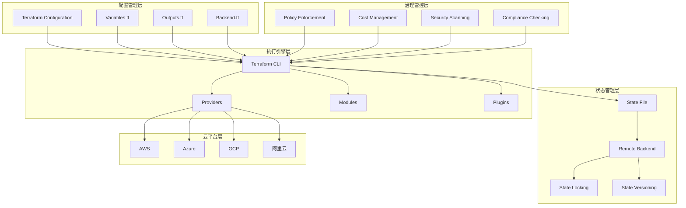

# Terraform企业级基础设施即代码实践

> **作者**: Infrastructure as Code专家 | **版本**: v1.0 | **更新时间**: 2026-02-07
> **适用场景**: 企业级基础设施自动化 | **复杂度**: ⭐⭐⭐⭐⭐

## 🎯 摘要

本文档深入探讨了Terraform企业级基础设施即代码的架构设计、最佳实践和运维管理，基于大规模云环境的部署经验，提供从基础资源配置到复杂架构编排的完整技术指南，帮助企业构建标准化、可重复的基础设施管理体系。

## 1. Terraform架构深度解析

### 1.1 核心组件架构



### 1.2 工作流程详解

```yaml
terraform_workflow:
  phases:
    init:
      - terraform_init: "初始化工作目录"
      - provider_installation: "安装所需Provider"
      - backend_configuration: "配置后端存储"
      - module_downloading: "下载模块依赖"
    
    plan:
      - configuration_validation: "验证配置语法"
      - dependency_analysis: "分析资源依赖关系"
      - execution_plan_generation: "生成执行计划"
      - cost_estimation: "估算资源成本"
      - security_analysis: "安全策略检查"
    
    apply:
      - state_locking: "锁定状态文件"
      - resource_creation: "创建基础设施资源"
      - dependency_resolution: "处理依赖关系"
      - parallel_execution: "并行资源部署"
      - state_synchronization: "同步状态文件"
    
    destroy:
      - dependency_calculation: "计算销毁顺序"
      - resource_teardown: "销毁基础设施资源"
      - state_cleanup: "清理状态记录"
      - confirmation_prompt: "用户确认机制"
```

## 2. 企业级项目结构设计

### 2.1 标准化目录结构

```bash
# 企业级Terraform项目结构
terraform-enterprise/
├── environments/
│   ├── dev/
│   │   ├── backend.tf          # 后端配置
│   │   ├── main.tf             # 主配置文件
│   │   ├── variables.tf        # 变量定义
│   │   ├── outputs.tf          # 输出定义
│   │   ├── terraform.tfvars    # 环境变量
│   │   └── modules/            # 环境特定模块
│   ├── staging/
│   │   ├── backend.tf
│   │   ├── main.tf
│   │   ├── variables.tf
│   │   ├── outputs.tf
│   │   ├── terraform.tfvars
│   │   └── modules/
│   └── prod/
│       ├── backend.tf
│       ├── main.tf
│       ├── variables.tf
│       ├── outputs.tf
│       ├── terraform.tfvars
│       └── modules/
├── modules/
│   ├── networking/
│   │   ├── main.tf
│   │   ├── variables.tf
│   │   ├── outputs.tf
│   │   └── README.md
│   ├── compute/
│   │   ├── main.tf
│   │   ├── variables.tf
│   │   ├── outputs.tf
│   │   └── README.md
│   └── storage/
│       ├── main.tf
│       ├── variables.tf
│       ├── outputs.tf
│       └── README.md
├── policies/
│   ├── sentinel.hcl            # Sentinel策略
│   ├── conftest.rego           # Conftest策略
│   └── tfsec.yml               # 安全扫描规则
├── scripts/
│   ├── deploy.sh               # 部署脚本
│   ├── validate.sh             # 验证脚本
│   └── cleanup.sh              # 清理脚本
├── Makefile                    # 构建文件
└── README.md                   # 项目文档
```

### 2.2 后端配置管理

```hcl
# backend.tf - 远程状态配置
terraform {
  backend "s3" {
    bucket         = "terraform-state-${var.environment}"
    key            = "terraform.tfstate"
    region         = "us-west-2"
    dynamodb_table = "terraform-state-lock"
    encrypt        = true
    
    # 状态锁定配置
    dynamodb_table_tags = {
      Name        = "terraform-state-lock"
      Environment = var.environment
      ManagedBy   = "terraform"
    }
  }
}

# backend-override.tf - 本地开发覆盖
# 仅在开发环境中使用
/*
terraform {
  backend "local" {
    path = "terraform.tfstate"
  }
}
*/
```

## 3. 模块化架构设计

### 3.1 网络基础设施模块

```hcl
# modules/networking/main.tf
variable "vpc_cidr" {
  description = "VPC CIDR block"
  type        = string
}

variable "environment" {
  description = "Environment name"
  type        = string
}

variable "availability_zones" {
  description = "Availability zones"
  type        = list(string)
  default     = ["us-west-2a", "us-west-2b", "us-west-2c"]
}

# VPC创建
resource "aws_vpc" "main" {
  cidr_block           = var.vpc_cidr
  enable_dns_hostnames = true
  enable_dns_support   = true
  
  tags = {
    Name        = "${var.environment}-vpc"
    Environment = var.environment
    Terraform   = "true"
  }
}

# 公有子网
resource "aws_subnet" "public" {
  count                   = length(var.availability_zones)
  vpc_id                  = aws_vpc.main.id
  cidr_block              = cidrsubnet(var.vpc_cidr, 8, count.index)
  availability_zone       = var.availability_zones[count.index]
  map_public_ip_on_launch = true
  
  tags = {
    Name        = "${var.environment}-public-${count.index}"
    Environment = var.environment
    Tier        = "public"
    Terraform   = "true"
  }
}

# 私有子网
resource "aws_subnet" "private" {
  count             = length(var.availability_zones)
  vpc_id            = aws_vpc.main.id
  cidr_block        = cidrsubnet(var.vpc_cidr, 8, count.index + 100)
  availability_zone = var.availability_zones[count.index]
  
  tags = {
    Name        = "${var.environment}-private-${count.index}"
    Environment = var.environment
    Tier        = "private"
    Terraform   = "true"
  }
}

# Internet Gateway
resource "aws_internet_gateway" "main" {
  vpc_id = aws_vpc.main.id
  
  tags = {
    Name        = "${var.environment}-igw"
    Environment = var.environment
    Terraform   = "true"
  }
}

# NAT Gateway
resource "aws_eip" "nat" {
  count  = length(var.availability_zones)
  domain = "vpc"
  
  tags = {
    Name        = "${var.environment}-nat-eip-${count.index}"
    Environment = var.environment
    Terraform   = "true"
  }
}

resource "aws_nat_gateway" "main" {
  count         = length(var.availability_zones)
  allocation_id = aws_eip.nat[count.index].id
  subnet_id     = aws_subnet.public[count.index].id
  
  tags = {
    Name        = "${var.environment}-nat-${count.index}"
    Environment = var.environment
    Terraform   = "true"
  }
  
  depends_on = [aws_internet_gateway.main]
}

# 路由表
resource "aws_route_table" "public" {
  vpc_id = aws_vpc.main.id
  
  route {
    cidr_block = "0.0.0.0/0"
    gateway_id = aws_internet_gateway.main.id
  }
  
  tags = {
    Name        = "${var.environment}-public-rt"
    Environment = var.environment
    Terraform   = "true"
  }
}

resource "aws_route_table" "private" {
  count  = length(var.availability_zones)
  vpc_id = aws_vpc.main.id
  
  route {
    cidr_block     = "0.0.0.0/0"
    nat_gateway_id = aws_nat_gateway.main[count.index].id
  }
  
  tags = {
    Name        = "${var.environment}-private-rt-${count.index}"
    Environment = var.environment
    Terraform   = "true"
  }
}

# 路由表关联
resource "aws_route_table_association" "public" {
  count          = length(var.availability_zones)
  subnet_id      = aws_subnet.public[count.index].id
  route_table_id = aws_route_table.public.id
}

resource "aws_route_table_association" "private" {
  count          = length(var.availability_zones)
  subnet_id      = aws_subnet.private[count.index].id
  route_table_id = aws_route_table.private[count.index].id
}

# 安全组
resource "aws_security_group" "bastion" {
  name        = "${var.environment}-bastion-sg"
  description = "Security group for bastion hosts"
  vpc_id      = aws_vpc.main.id
  
  ingress {
    from_port   = 22
    to_port     = 22
    protocol    = "tcp"
    cidr_blocks = ["0.0.0.0/0"]
  }
  
  egress {
    from_port   = 0
    to_port     = 0
    protocol    = "-1"
    cidr_blocks = ["0.0.0.0/0"]
  }
  
  tags = {
    Name        = "${var.environment}-bastion-sg"
    Environment = var.environment
    Terraform   = "true"
  }
}

# 输出定义
output "vpc_id" {
  description = "VPC ID"
  value       = aws_vpc.main.id
}

output "public_subnet_ids" {
  description = "Public subnet IDs"
  value       = aws_subnet.public[*].id
}

output "private_subnet_ids" {
  description = "Private subnet IDs"
  value       = aws_subnet.private[*].id
}

output "bastion_security_group_id" {
  description = "Bastion security group ID"
  value       = aws_security_group.bastion.id
}
```

### 3.2 计算资源模块

```hcl
# modules/compute/main.tf
variable "ami_id" {
  description = "AMI ID for EC2 instances"
  type        = string
}

variable "instance_type" {
  description = "EC2 instance type"
  type        = string
  default     = "t3.medium"
}

variable "subnet_ids" {
  description = "Subnet IDs for instances"
  type        = list(string)
}

variable "security_group_ids" {
  description = "Security group IDs"
  type        = list(string)
}

variable "key_name" {
  description = "SSH key pair name"
  type        = string
}

variable "instance_count" {
  description = "Number of instances to create"
  type        = number
  default     = 2
}

variable "environment" {
  description = "Environment name"
  type        = string
}

# 启动模板
resource "aws_launch_template" "app" {
  name_prefix   = "${var.environment}-app-"
  image_id      = var.ami_id
  instance_type = var.instance_type
  
  key_name = var.key_name
  
  vpc_security_group_ids = var.security_group_ids
  
  # IAM实例配置文件
  iam_instance_profile {
    name = aws_iam_instance_profile.app.name
  }
  
  # 用户数据脚本
  user_data = base64encode(templatefile("${path.module}/userdata.sh.tmpl", {
    environment = var.environment
  }))
  
  # 标签
  tag_specifications {
    resource_type = "instance"
    tags = {
      Name        = "${var.environment}-app-instance"
      Environment = var.environment
      Terraform   = "true"
    }
  }
  
  lifecycle {
    create_before_destroy = true
  }
}

# Auto Scaling组
resource "aws_autoscaling_group" "app" {
  name_prefix         = "${var.environment}-app-asg-"
  vpc_zone_identifier = var.subnet_ids
  target_group_arns   = [aws_lb_target_group.app.arn]
  
  launch_template {
    id      = aws_launch_template.app.id
    version = aws_launch_template.app.latest_version
  }
  
  min_size         = var.instance_count
  max_size         = var.instance_count * 2
  desired_capacity = var.instance_count
  
  health_check_type         = "ELB"
  health_check_grace_period = 300
  
  # 扩缩容策略
  dynamic "tag" {
    for_each = {
      Name        = "${var.environment}-app-asg"
      Environment = var.environment
      Terraform   = "true"
    }
    content {
      key                 = tag.key
      value               = tag.value
      propagate_at_launch = true
    }
  }
  
  lifecycle {
    ignore_changes = [desired_capacity]
  }
}

# 负载均衡器
resource "aws_lb" "app" {
  name               = "${var.environment}-app-alb"
  internal           = false
  load_balancer_type = "application"
  security_groups    = [aws_security_group.alb.id]
  subnets            = var.subnet_ids
  
  enable_deletion_protection = var.environment == "prod"
  
  tags = {
    Name        = "${var.environment}-app-alb"
    Environment = var.environment
    Terraform   = "true"
  }
}

resource "aws_lb_listener" "http" {
  load_balancer_arn = aws_lb.app.arn
  port              = "80"
  protocol          = "HTTP"
  
  default_action {
    type             = "forward"
    target_group_arn = aws_lb_target_group.app.arn
  }
}

resource "aws_lb_target_group" "app" {
  name     = "${var.environment}-app-tg"
  port     = 80
  protocol = "HTTP"
  vpc_id   = var.vpc_id
  
  health_check {
    path                = "/health"
    interval            = 30
    timeout             = 5
    healthy_threshold   = 2
    unhealthy_threshold = 3
  }
  
  tags = {
    Name        = "${var.environment}-app-tg"
    Environment = var.environment
    Terraform   = "true"
  }
}

# 安全组
resource "aws_security_group" "alb" {
  name        = "${var.environment}-alb-sg"
  description = "Security group for ALB"
  vpc_id      = var.vpc_id
  
  ingress {
    from_port   = 80
    to_port     = 80
    protocol    = "tcp"
    cidr_blocks = ["0.0.0.0/0"]
  }
  
  egress {
    from_port   = 0
    to_port     = 0
    protocol    = "-1"
    cidr_blocks = ["0.0.0.0/0"]
  }
  
  tags = {
    Name        = "${var.environment}-alb-sg"
    Environment = var.environment
    Terraform   = "true"
  }
}

# IAM角色和策略
resource "aws_iam_role" "app" {
  name = "${var.environment}-app-role"
  
  assume_role_policy = jsonencode({
    Version = "2012-10-17"
    Statement = [
      {
        Action = "sts:AssumeRole"
        Effect = "Allow"
        Principal = {
          Service = "ec2.amazonaws.com"
        }
      }
    ]
  })
  
  tags = {
    Name        = "${var.environment}-app-role"
    Environment = var.environment
    Terraform   = "true"
  }
}

resource "aws_iam_role_policy_attachment" "app_ssm" {
  role       = aws_iam_role.app.name
  policy_arn = "arn:aws:iam::aws:policy/AmazonSSMManagedInstanceCore"
}

resource "aws_iam_instance_profile" "app" {
  name = "${var.environment}-app-profile"
  role = aws_iam_role.app.name
}

# 输出定义
output "asg_name" {
  description = "Auto Scaling Group name"
  value       = aws_autoscaling_group.app.name
}

output "alb_dns_name" {
  description = "ALB DNS name"
  value       = aws_lb.app.dns_name
}

output "target_group_arn" {
  description = "Target group ARN"
  value       = aws_lb_target_group.app.arn
}
```

## 4. 策略管理与治理

### 4.1 Sentinel策略配置

```hcl
# policies/sentinel.hcl
# 成本控制策略
cost_control = rule {
  all sum asg in tfplan.resources.aws_autoscaling_group as asg {
    asg.applied.min_size <= 10
  }
}

# 安全组策略
security_groups = rule {
  all sg in tfplan.resources.aws_security_group as sg {
    sg.applied.ingress not contains {
      from_port = 22
      to_port   = 22
      protocol  = "tcp"
      cidr_blocks contains "0.0.0.0/0"
    }
  }
}

# 标签强制策略
required_tags = rule {
  all resource in tfplan.resources as resource {
    resource.applied.tags contains "Environment" and
    resource.applied.tags contains "Owner" and
    resource.applied.tags contains "Terraform"
  }
}

# 实例类型限制策略
instance_types = rule {
  all instance in tfplan.resources.aws_instance as instance {
    instance.applied.instance_type in [
      "t3.micro", "t3.small", "t3.medium",
      "m5.large", "m5.xlarge"
    ]
  }
}

# 主策略入口
main = rule {
  cost_control and
  security_groups and
  required_tags and
  instance_types
}
```

### 4.2 Conftest策略配置

```rego
# policies/conftest.rego
package main

# 拒绝公共S3存储桶
deny[msg] {
  resource := input.resource.aws_s3_bucket[_]
  resource.server_side_encryption_configuration == null
  msg = sprintf("S3 bucket %s must have server-side encryption enabled", [resource.bucket])
}

# 强制使用HTTPS
deny[msg] {
  lb := input.resource.aws_lb_listener[_]
  lb.protocol == "HTTP"
  msg = "Load balancer listeners must use HTTPS"
}

# 限制实例类型
deny[msg] {
  instance := input.resource.aws_instance[_]
  forbidden_types := {"t2.micro", "t2.small"}
  instance.instance_type in forbidden_types
  msg = sprintf("Instance type %s is not allowed", [instance.instance_type])
}

# 强制标签要求
deny[msg] {
  resource := input.resource[_][_]
  not resource.tags
  msg = "All resources must have tags defined"
}

# 成本预算检查
warn[msg] {
  asg := input.resource.aws_autoscaling_group[_]
  asg.max_size > 20
  msg = sprintf("Auto Scaling Group %s has max_size > 20, consider cost implications", [asg.name])
}
```

## 5. 状态管理与协作

### 5.1 远程状态配置

```hcl
# backend.tf - 生产环境后端配置
terraform {
  backend "s3" {
    bucket         = "company-terraform-state"
    key            = "production/terraform.tfstate"
    region         = "us-west-2"
    encrypt        = true
    kms_key_id     = "alias/terraform-state-key"
    dynamodb_table = "terraform-state-locks"
    
    # 状态文件版本控制
    workspace_key_prefix = "env:"
  }
}

# backend-staging.tf - 预发布环境
/*
terraform {
  backend "s3" {
    bucket         = "company-terraform-state"
    key            = "staging/terraform.tfstate"
    region         = "us-west-2"
    encrypt        = true
    dynamodb_table = "terraform-state-locks"
  }
}
*/
```

### 5.2 工作区管理

```bash
#!/bin/bash
# workspace_management.sh

# 创建环境工作区
create_workspaces() {
    environments=("dev" "staging" "prod")
    
    for env in "${environments[@]}"; do
        echo "Creating workspace: $env"
        terraform workspace new $env 2>/dev/null || terraform workspace select $env
        
        # 为每个工作区设置变量
        terraform workspace select $env
        terraform apply -var="environment=$env" -auto-approve
    done
}

# 状态迁移脚本
migrate_state() {
    local source_env=$1
    local target_env=$2
    
    echo "Migrating state from $source_env to $target_env"
    
    # 备份源状态
    terraform state pull > "state_backup_${source_env}.json"
    
    # 切换到目标环境
    terraform workspace select $target_env
    
    # 推送状态
    terraform state push "state_backup_${source_env}.json"
    
    echo "State migration completed"
}

# 状态检查脚本
validate_state() {
    echo "Validating Terraform state..."
    
    # 检查状态文件完整性
    terraform state list > /dev/null
    
    # 检查资源漂移
    terraform plan -detailed-exitcode
    
    # 输出状态摘要
    terraform state list | wc -l
    echo "Total resources in state: $(terraform state list | wc -l)"
}

# 锁定状态检查
check_state_lock() {
    local table_name="terraform-state-locks"
    local region="us-west-2"
    
    aws dynamodb scan \
        --table-name $table_name \
        --region $region \
        --query "Items[?LockID.S != null]"
}

case "$1" in
    create)
        create_workspaces
        ;;
    migrate)
        migrate_state $2 $3
        ;;
    validate)
        validate_state
        ;;
    lock-check)
        check_state_lock
        ;;
    *)
        echo "Usage: $0 {create|migrate|validate|lock-check}"
        exit 1
        ;;
esac
```

## 6. CI/CD集成实践

### 6.1 GitHub Actions工作流

```yaml
# .github/workflows/terraform.yml
name: Terraform CI/CD

on:
  push:
    branches:
      - main
      - develop
  pull_request:
    branches:
      - main

jobs:
  terraform-validate:
    name: Validate Terraform Configuration
    runs-on: ubuntu-latest
    steps:
      - name: Checkout code
        uses: actions/checkout@v3
        
      - name: Setup Terraform
        uses: hashicorp/setup-terraform@v2
        with:
          terraform_version: 1.6.0
          
      - name: Terraform fmt
        id: fmt
        run: terraform fmt -check
        continue-on-error: true
        
      - name: Terraform Init
        id: init
        run: terraform init
        
      - name: Terraform Validate
        id: validate
        run: terraform validate -no-color
        
      - name: Terraform Plan
        id: plan
        run: |
          terraform plan -no-color -input=false
        env:
          AWS_ACCESS_KEY_ID: ${{ secrets.AWS_ACCESS_KEY_ID }}
          AWS_SECRET_ACCESS_KEY: ${{ secrets.AWS_SECRET_ACCESS_KEY }}

  security-scan:
    name: Security Scan
    runs-on: ubuntu-latest
    needs: terraform-validate
    steps:
      - name: Checkout code
        uses: actions/checkout@v3
        
      - name: Run TFSec
        uses: aquasecurity/tfsec-action@v1.0.3
        with:
          soft_fail: false
          
      - name: Run Checkov
        uses: bridgecrewio/checkov-action@v12
        with:
          directory: .
          quiet: true
          output_format: cli

  cost-estimation:
    name: Cost Estimation
    runs-on: ubuntu-latest
    needs: terraform-validate
    steps:
      - name: Checkout code
        uses: actions/checkout@v3
        
      - name: Setup Terraform
        uses: hashicorp/setup-terraform@v2
        
      - name: Terraform Init
        run: terraform init
        
      - name: Install Infracost
        run: |
          curl -fsSL https://raw.githubusercontent.com/infracost/infracost/master/scripts/install.sh | sh
          
      - name: Infracost Breakdown
        run: |
          infracost breakdown --path . \
            --usage-file infracost-usage.yml \
            --format json \
            --out-file infracost-base.json
        env:
          INFRACOST_API_KEY: ${{ secrets.INFRACOST_API_KEY }}
          
      - name: Post comment
        uses: actions/github-script@v6
        with:
          script: |
            const fs = require('fs');
            const costData = JSON.parse(fs.readFileSync('infracost-base.json'));
            const monthlyCost = costData.totalMonthlyCost;
            
            github.rest.issues.createComment({
              issue_number: context.issue.number,
              owner: context.repo.owner,
              repo: context.repo.repo,
              body: `## 📊 Cost Estimation\nEstimated monthly cost: $${monthlyCost}`
            });

  deploy:
    name: Deploy Infrastructure
    runs-on: ubuntu-latest
    needs: [terraform-validate, security-scan]
    if: github.ref == 'refs/heads/main'
    environment: production
    steps:
      - name: Checkout code
        uses: actions/checkout@v3
        
      - name: Setup Terraform
        uses: hashicorp/setup-terraform@v2
        with:
          terraform_version: 1.6.0
          
      - name: Configure AWS Credentials
        uses: aws-actions/configure-aws-credentials@v2
        with:
          aws-access-key-id: ${{ secrets.AWS_ACCESS_KEY_ID }}
          aws-secret-access-key: ${{ secrets.AWS_SECRET_ACCESS_KEY }}
          aws-region: us-west-2
          
      - name: Terraform Init
        run: terraform init
        
      - name: Terraform Apply
        run: terraform apply -auto-approve -input=false
```

### 6.2 自动化测试脚本

```python
#!/usr/bin/env python3
# terraform_test_runner.py

import subprocess
import json
import os
import sys
from typing import Dict, List, Tuple

class TerraformTester:
    def __init__(self, working_dir: str = "."):
        self.working_dir = working_dir
        self.results = []
    
    def run_command(self, cmd: List[str]) -> Tuple[int, str, str]:
        """执行命令并返回结果"""
        try:
            result = subprocess.run(
                cmd,
                cwd=self.working_dir,
                capture_output=True,
                text=True,
                timeout=300
            )
            return result.returncode, result.stdout, result.stderr
        except subprocess.TimeoutExpired:
            return 1, "", "Command timed out"
        except Exception as e:
            return 1, "", str(e)
    
    def test_terraform_fmt(self) -> Dict:
        """测试代码格式化"""
        print("🧪 Running terraform fmt check...")
        exit_code, stdout, stderr = self.run_command(["terraform", "fmt", "-check"])
        
        return {
            "test": "terraform_fmt",
            "passed": exit_code == 0,
            "output": stdout,
            "error": stderr
        }
    
    def test_terraform_init(self) -> Dict:
        """测试初始化"""
        print("🧪 Running terraform init...")
        exit_code, stdout, stderr = self.run_command(["terraform", "init", "-backend=false"])
        
        return {
            "test": "terraform_init",
            "passed": exit_code == 0,
            "output": stdout,
            "error": stderr
        }
    
    def test_terraform_validate(self) -> Dict:
        """测试配置验证"""
        print("🧪 Running terraform validate...")
        exit_code, stdout, stderr = self.run_command(["terraform", "validate"])
        
        return {
            "test": "terraform_validate",
            "passed": exit_code == 0,
            "output": stdout,
            "error": stderr
        }
    
    def test_security_scan(self) -> Dict:
        """运行安全扫描"""
        print("🧪 Running security scan...")
        exit_code, stdout, stderr = self.run_command(["tfsec", "--format", "json"])
        
        vulnerabilities = []
        if exit_code in [0, 1]:  # tfsec返回1表示发现问题
            try:
                scan_result = json.loads(stdout)
                vulnerabilities = scan_result.get("results", [])
            except json.JSONDecodeError:
                pass
        
        return {
            "test": "security_scan",
            "passed": len(vulnerabilities) == 0,
            "output": stdout,
            "error": stderr,
            "vulnerabilities": len(vulnerabilities)
        }
    
    def test_module_documentation(self) -> Dict:
        """测试模块文档完整性"""
        print("🧪 Checking module documentation...")
        required_files = ["README.md", "variables.tf", "outputs.tf"]
        missing_files = []
        
        for file in required_files:
            if not os.path.exists(os.path.join(self.working_dir, file)):
                missing_files.append(file)
        
        return {
            "test": "module_documentation",
            "passed": len(missing_files) == 0,
            "missing_files": missing_files
        }
    
    def run_all_tests(self) -> List[Dict]:
        """运行所有测试"""
        tests = [
            self.test_terraform_fmt,
            self.test_terraform_init,
            self.test_terraform_validate,
            self.test_security_scan,
            self.test_module_documentation
        ]
        
        results = []
        for test in tests:
            result = test()
            results.append(result)
            status = "✅ PASS" if result["passed"] else "❌ FAIL"
            print(f"{status} {result['test']}")
            
            if not result["passed"]:
                if "error" in result and result["error"]:
                    print(f"   Error: {result['error']}")
                if "missing_files" in result and result["missing_files"]:
                    print(f"   Missing: {result['missing_files']}")
                if "vulnerabilities" in result:
                    print(f"   Vulnerabilities found: {result['vulnerabilities']}")
        
        return results
    
    def generate_report(self, results: List[Dict]) -> str:
        """生成测试报告"""
        passed = sum(1 for r in results if r["passed"])
        total = len(results)
        
        report = f"""
# Terraform Test Report
=====================

## Summary
- Total Tests: {total}
- Passed: {passed}
- Failed: {total - passed}
- Success Rate: {(passed/total)*100:.1f}%

## Detailed Results
"""
        
        for result in results:
            status = "✅" if result["passed"] else "❌"
            report += f"\n### {status} {result['test']}\n"
            if not result["passed"]:
                if "error" in result and result["error"]:
                    report += f"Error: {result['error']}\n"
                if "missing_files" in result and result["missing_files"]:
                    report += f"Missing files: {result['missing_files']}\n"
                if "vulnerabilities" in result:
                    report += f"Vulnerabilities: {result['vulnerabilities']}\n"
        
        return report

def main():
    tester = TerraformTester()
    results = tester.run_all_tests()
    report = tester.generate_report(results)
    
    print("\n" + "="*50)
    print(report)
    
    # 保存报告到文件
    with open("terraform_test_report.md", "w") as f:
        f.write(report)
    
    # 如果有任何测试失败，返回非零退出码
    failed_tests = [r for r in results if not r["passed"]]
    sys.exit(len(failed_tests))

if __name__ == "__main__":
    main()
```

## 7. 监控与运维管理

### 7.1 状态监控配置

```hcl
# monitoring/terraform_monitoring.tf
# Drift检测配置
resource "aws_cloudwatch_event_rule" "terraform_drift_detection" {
  name        = "terraform-drift-detection"
  description = "Detect infrastructure drift from Terraform state"
  
  schedule_expression = "rate(1 hour)"
}

resource "aws_cloudwatch_event_target" "terraform_drift_lambda" {
  rule      = aws_cloudwatch_event_rule.terraform_drift_detection.name
  target_id = "DriftDetectionLambda"
  arn       = aws_lambda_function.drift_detector.arn
}

resource "aws_lambda_function" "drift_detector" {
  filename         = "drift_detector.zip"
  function_name    = "terraform-drift-detector"
  role            = aws_iam_role.lambda_drift_detector.arn
  handler         = "drift_detector.handler"
  runtime         = "python3.9"
  timeout         = 300
  memory_size     = 256
  
  environment {
    variables = {
      TERRAFORM_STATE_BUCKET = "company-terraform-state"
      SLACK_WEBHOOK_URL      = var.slack_webhook_url
    }
  }
}

# 成本监控
resource "aws_cloudwatch_metric_alarm" "terraform_cost_alarm" {
  alarm_name          = "terraform-monthly-cost"
  comparison_operator = "GreaterThanThreshold"
  evaluation_periods  = "1"
  metric_name         = "EstimatedCharges"
  namespace           = "AWS/Billing"
  period              = "21600"  # 6小时
  statistic           = "Maximum"
  threshold           = "10000"  # $10,000
  
  alarm_description = "Monthly Terraform provisioned resources cost exceeds threshold"
  
  dimensions = {
    Currency = "USD"
  }
  
  alarm_actions = [aws_sns_topic.cost_alerts.arn]
}

resource "aws_sns_topic" "cost_alerts" {
  name = "terraform-cost-alerts"
}

resource "aws_sns_topic_subscription" "cost_slack" {
  topic_arn = aws_sns_topic.cost_alerts.arn
  protocol  = "https"
  endpoint  = var.slack_webhook_url
}
```

### 7.2 运维脚本工具

```bash
#!/bin/bash
# terraform_ops_toolkit.sh

set -euo pipefail

# 颜色定义
RED='\033[0;31m'
GREEN='\033[0;32m'
YELLOW='\033[1;33m'
BLUE='\033[0;34m'
NC='\033[0m' # No Color

# 日志函数
log_info() {
    echo -e "${BLUE}[INFO]${NC} $1"
}

log_warn() {
    echo -e "${YELLOW}[WARN]${NC} $1"
}

log_error() {
    echo -e "${RED}[ERROR]${NC} $1"
}

log_success() {
    echo -e "${GREEN}[SUCCESS]${NC} $1"
}

# 状态分析函数
analyze_state() {
    log_info "Analyzing Terraform state..."
    
    # 获取状态统计
    local resource_count=$(terraform state list | wc -l)
    local resource_types=$(terraform state list | cut -d'.' -f1 | sort | uniq | wc -l)
    
    echo "Total resources: $resource_count"
    echo "Resource types: $resource_types"
    
    # 检查孤立资源
    log_info "Checking for orphaned resources..."
    terraform state list | grep -E "(null_resource|random_|tls_)" || true
    
    # 检查昂贵资源
    log_info "Checking for expensive resources..."
    terraform state list | grep -E "(aws_instance|aws_db_instance|aws_elb)" || true
}

# 漂移检测函数
detect_drift() {
    log_info "Detecting infrastructure drift..."
    
    # 执行计划并检查变化
    local plan_output=$(terraform plan -detailed-exitcode 2>&1)
    local exit_code=$?
    
    case $exit_code in
        0)
            log_success "No drift detected"
            ;;
        1)
            log_error "Error during drift detection"
            echo "$plan_output"
            return 1
            ;;
        2)
            log_warn "Drift detected in infrastructure"
            echo "$plan_output" | grep -A 20 "^Plan:"
            ;;
    esac
}

# 成本分析函数
analyze_cost() {
    log_info "Analyzing infrastructure costs..."
    
    # 使用Infracost进行成本分析
    if command -v infracost &> /dev/null; then
        infracost breakdown --path . --format table
    else
        log_warn "Infracost not installed, skipping cost analysis"
    fi
}

# 安全扫描函数
security_scan() {
    log_info "Running security scan..."
    
    # 运行多个安全工具
    local scanners=("tfsec" "checkov")
    local failed=0
    
    for scanner in "${scanners[@]}"; do
        if command -v "$scanner" &> /dev/null; then
            log_info "Running $scanner..."
            if ! "$scanner" .; then
                log_error "$scanner found security issues"
                ((failed++))
            fi
        else
            log_warn "$scanner not installed"
        fi
    done
    
    if [ $failed -eq 0 ]; then
        log_success "Security scan completed with no critical issues"
    else
        log_error "Security scan found $failed issues"
        return 1
    fi
}

# 备份函数
backup_state() {
    local backup_dir="${1:-/tmp/terraform-backups}"
    local timestamp=$(date +%Y%m%d_%H%M%S)
    local backup_name="tfstate_backup_${timestamp}"
    
    log_info "Creating state backup..."
    
    mkdir -p "$backup_dir"
    
    # 拉取当前状态
    terraform state pull > "${backup_dir}/${backup_name}.json"
    
    # 创建压缩备份
    tar -czf "${backup_dir}/${backup_name}.tar.gz" -C "$backup_dir" "${backup_name}.json"
    
    # 清理临时文件
    rm "${backup_dir}/${backup_name}.json"
    
    log_success "Backup created: ${backup_dir}/${backup_name}.tar.gz"
}

# 主菜单
show_menu() {
    echo "==================================="
    echo "  Terraform Operations Toolkit"
    echo "==================================="
    echo "1. Analyze State"
    echo "2. Detect Drift"
    echo "3. Analyze Costs"
    echo "4. Security Scan"
    echo "5. Backup State"
    echo "6. Run All Checks"
    echo "0. Exit"
    echo "==================================="
}

# 主程序循环
main() {
    while true; do
        show_menu
        read -p "Select option: " choice
        
        case $choice in
            1)
                analyze_state
                ;;
            2)
                detect_drift
                ;;
            3)
                analyze_cost
                ;;
            4)
                security_scan
                ;;
            5)
                read -p "Backup directory (default: /tmp/terraform-backups): " backup_dir
                backup_state "${backup_dir:-/tmp/terraform-backups}"
                ;;
            6)
                log_info "Running all checks..."
                analyze_state
                detect_drift
                analyze_cost
                security_scan
                backup_state
                log_success "All checks completed"
                ;;
            0)
                log_info "Exiting..."
                exit 0
                ;;
            *)
                log_error "Invalid option"
                ;;
        esac
        
        echo
        read -p "Press Enter to continue..."
        clear
    done
}

# 参数处理
case "${1:-}" in
    --analyze-state)
        analyze_state
        ;;
    --detect-drift)
        detect_drift
        ;;
    --analyze-cost)
        analyze_cost
        ;;
    --security-scan)
        security_scan
        ;;
    --backup)
        backup_state "${2:-/tmp/terraform-backups}"
        ;;
    *)
        main
        ;;
esac
```

## 8. 最佳实践与经验总结

### 8.1 基础设施即代码最佳实践

```markdown
## 🏗️ Terraform最佳实践

### 1. 项目结构规范
- 模块化设计，职责分离
- 环境隔离，配置独立
- 版本控制，变更追踪
- 文档齐全，易于维护

### 2. 配置管理原则
- 变量抽象，避免硬编码
- 输出定义，便于集成
- 状态管理，远程存储
- 锁定机制，防止冲突

### 3. 安全合规要求
- 最小权限原则
- 加密传输存储
- 定期安全扫描
- 合规策略执行

### 4. 运维管理规范
- 自动化测试验证
- 持续集成部署
- 监控告警体系
- 灾难恢复预案
```

### 8.2 常见问题解决方案

```yaml
常见问题及解决方案:
  状态锁定问题:
    原因: 
      - 并发操作冲突
      - 进程意外终止
      - 网络连接中断
    解决方案:
      - 使用terraform force-unlock
      - 检查DynamoDB锁表
      - 清理僵尸进程
  
  依赖循环问题:
    原因:
      - 循环引用资源
      - 模块间相互依赖
      - 输出引用不当
    解决方案:
      - 重构资源依赖关系
      - 使用depends_on显式声明
      - 拆分复杂模块
  
  性能优化问题:
    原因:
      - 资源数量过多
      - 并行度设置不当
      - 网络延迟较高
    解决方案:
      - 启用并行处理
      - 优化模块结构
      - 使用本地执行计划
  
  成本控制问题:
    原因:
      - 资源规格过大
      - 自动扩缩容配置
      - 闲置资源未清理
    解决方案:
      - 实施成本策略
      - 启用资源标签
      - 定期成本审计
```

## 9. 未来发展与趋势

### 9.1 Infrastructure as Code演进方向

```yaml
IaC技术发展趋势:
  1. 云原生集成:
     - Kubernetes原生支持
     - Service Mesh配置管理
     - Serverless资源配置
     - 多云统一编排
  
  2. 智能化运维:
     - AI驱动的配置优化
     - 自动故障预测修复
     - 智能成本管理
     - 自适应安全策略
  
  3. 标准化发展:
     - OpenTofu开源标准
     - 跨平台统一接口
     - 行业最佳实践
     - 合规性框架集成
```

---
*本文档基于企业级Infrastructure as Code实践经验编写，持续更新最新技术和最佳实践。*