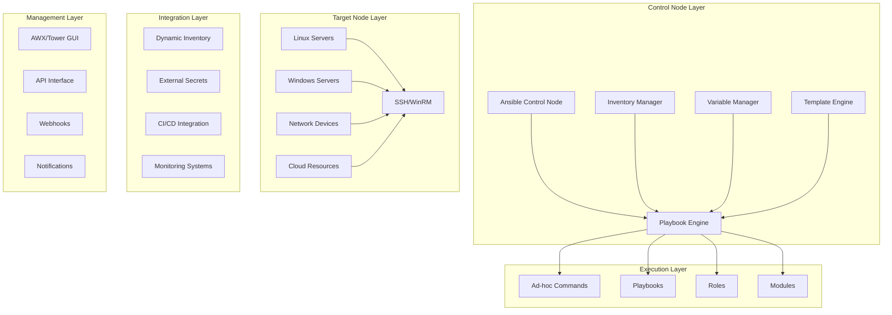

# Ansible企业级自动化运维深度实践

> **Author**: Automation Operations Architect | **Version**: v1.0 | **Update Time**: 2026-02-07
> **Scenario**: Enterprise-grade infrastructure automation | **Complexity**: ⭐⭐⭐⭐⭐

## 🎯 Abstract

This document provides in-depth exploration of Ansible enterprise infrastructure automation architecture design, deployment practices, and operational management. Based on large-scale production environment experience, it offers comprehensive technical guidance from playbook design to automated operations, helping enterprises build reliable, scalable infrastructure automation systems.

## 1. Ansible Architecture Deep Dive

### 1.1 Core Component Architecture



### 1.2 Execution Architecture

```yaml
ansible_execution_model:
  control_node:
    responsibilities:
      - playbook orchestration
      - inventory management
      - variable processing
      - result aggregation
    requirements:
      - python 3.6+
      - ansible core
      - ssh client
      - network connectivity
  
  managed_nodes:
    connection_methods:
      - ssh: "Linux/Unix systems"
      - winrm: "Windows systems"
      - local: "Local execution"
      - docker: "Container execution"
      - kubectl: "Kubernetes pods"
    
    prerequisites:
      - python interpreter
      - network accessibility
      - appropriate credentials
      - required packages/modules
```

## 2. Enterprise Deployment Architecture

### 2.1 Ansible Tower/AWX Setup

```yaml
# awx-deployment.yaml
apiVersion: apps/v1
kind: Deployment
metadata:
  name: awx
  namespace: automation
spec:
  replicas: 1
  selector:
    matchLabels:
      app: awx
  template:
    metadata:
      labels:
        app: awx
    spec:
      containers:
      - name: awx-web
        image: ansible/awx:21.10.0
        ports:
        - containerPort: 80
        env:
        - name: DATABASE_HOST
          value: "postgresql.awx.svc.cluster.local"
        - name: DATABASE_PORT
          value: "5432"
        - name: DATABASE_NAME
          value: "awx"
        - name: DATABASE_USER
          value: "awx"
        - name: DATABASE_PASSWORD
          valueFrom:
            secretKeyRef:
              name: awx-database-secret
              key: password
        - name: SECRET_KEY
          valueFrom:
            secretKeyRef:
              name: awx-secret-key
              key: secret-key
        - name: BROADCAST_WEBSOCKET_SECRET
          valueFrom:
            secretKeyRef:
              name: awx-ws-secret
              key: broadcast-websocket-secret
        volumeMounts:
        - name: awx-config
          mountPath: /etc/tower
        resources:
          requests:
            memory: "1Gi"
            cpu: "500m"
          limits:
            memory: "2Gi"
            cpu: "1000m"
      volumes:
      - name: awx-config
        configMap:
          name: awx-config
---
# awx-config.yaml
apiVersion: v1
kind: ConfigMap
metadata:
  name: awx-config
  namespace: automation
data:
  SECRET_KEY: "your-super-secret-key-here"
  ALLOWED_HOSTS: "*"
  DATABASE_HOST: "postgresql.awx.svc.cluster.local"
  DATABASE_PORT: "5432"
  DATABASE_NAME: "awx"
  DATABASE_USER: "awx"
  DATABASE_PASSWORD: "awx_password"
  BROKER_URL: "redis://redis.awx.svc.cluster.local:6379/1"
  CACHE_URL: "redis://redis.awx.svc.cluster.local:6379/2"
  DEBUG: "False"
  LOGGING_LEVEL: "INFO"
  DEFAULT_EXECUTION_ENVIRONMENT: "quay.io/ansible/awx-ee:latest"
  POD_SPEC_OVERRIDE: |
    {
      "containers": [
        {
          "name": "worker",
          "resources": {
            "requests": {
              "memory": "256Mi",
              "cpu": "100m"
            },
            "limits": {
              "memory": "1Gi",
              "cpu": "500m"
            }
          }
        }
      ]
    }
```

### 2.2 Dynamic Inventory Configuration

```yaml
# dynamic-inventory-aws.yaml
plugin: aws_ec2
regions:
  - us-east-1
  - us-west-2
filters:
  tag:Environment: production
  instance-state-name: running
keyed_groups:
  - key: tags.Environment
    prefix: env
  - key: tags.Application
    prefix: app
  - key: placement.region
    prefix: aws_region
hostnames:
  - ip-address
  - dns-name
  - tag:Name
compose:
  ansible_host: public_ip_address
  ansible_user: ec2-user
  ansible_ssh_private_key_file: ~/.ssh/aws-key.pem
```

## 3. Playbook Design Best Practices

### 3.1 Standard Playbook Structure

```yaml
# site.yml - Main site playbook
---
- name: Configure web servers
  hosts: webservers
  become: yes
  gather_facts: yes
  vars:
    http_port: 80
    https_port: 443
    max_clients: 200
  pre_tasks:
    - name: Ensure system is updated
      yum:
        name: "*"
        state: latest
      when: ansible_os_family == "RedHat"
  roles:
    - role: common
      tags: [common]
    - role: nginx
      tags: [nginx, web]
    - role: php
      tags: [php, web]
    - role: application
      tags: [app]
  post_tasks:
    - name: Restart services
      service:
        name: "{{ item }}"
        state: restarted
      loop:
        - nginx
        - php-fpm
      notify: verify_services
  handlers:
    - name: verify_services
      uri:
        url: "http://localhost"
        status_code: 200
```

### 3.2 Role Structure Template

```bash
# Standard role directory structure
roles/
├── common/
│   ├── defaults/
│   │   └── main.yml
│   ├── files/
│   │   └── motd
│   ├── handlers/
│   │   └── main.yml
│   ├── meta/
│   │   └── main.yml
│   ├── tasks/
│   │   ├── main.yml
│   │   ├── security.yml
│   │   └── users.yml
│   ├── templates/
│   │   └── ntp.conf.j2
│   └── vars/
│       └── main.yml
└── nginx/
    ├── defaults/
    │   └── main.yml
    ├── handlers/
    │   └── main.yml
    ├── tasks/
    │   ├── main.yml
    │   ├── install.yml
    │   ├── configure.yml
    │   └── service.yml
    ├── templates/
    │   ├── nginx.conf.j2
    │   └── site.conf.j2
    └── vars/
        └── main.yml
```

### 3.3 Advanced Playbook Example

```yaml
# advanced-deployment.yml
---
- name: Advanced application deployment
  hosts: application_servers
  become: yes
  gather_facts: yes
  vars:
    app_name: "ecommerce-platform"
    app_version: "2.1.0"
    deploy_user: "deploy"
    backup_enabled: true
    rollback_enabled: true
  
  vars_prompt:
    - name: "confirm_deployment"
      prompt: "Confirm deployment to production? (yes/no)"
      default: "no"
      private: no
  
  pre_tasks:
    - name: Validate deployment confirmation
      assert:
        that:
          - confirm_deployment == "yes"
        fail_msg: "Deployment cancelled by user"
    
    - name: Check system resources
      shell: "free -m | awk 'NR==2{printf \"%.2f\", $4*100/$2 }'"
      register: memory_usage
      changed_when: false
    
    - name: Fail if insufficient memory
      assert:
        that:
          - memory_usage.stdout | float > 20.0
        fail_msg: "Insufficient memory for deployment"
  
  tasks:
    - name: Create deployment user
      user:
        name: "{{ deploy_user }}"
        system: yes
        shell: /bin/bash
        home: "/home/{{ deploy_user }}"
        create_home: yes
    
    - name: Set up SSH keys for deployment user
      authorized_key:
        user: "{{ deploy_user }}"
        key: "{{ lookup('file', '~/.ssh/id_rsa.pub') }}"
    
    - name: Create application directories
      file:
        path: "{{ item }}"
        state: directory
        owner: "{{ deploy_user }}"
        group: "{{ deploy_user }}"
        mode: '0755'
      loop:
        - "/opt/{{ app_name }}"
        - "/opt/{{ app_name }}/releases"
        - "/opt/{{ app_name }}/shared"
        - "/var/log/{{ app_name }}"
    
    - name: Deploy application code
      block:
        - name: Download application package
          get_url:
            url: "https://artifacts.company.com/{{ app_name }}/{{ app_version }}.tar.gz"
            dest: "/tmp/{{ app_name }}-{{ app_version }}.tar.gz"
            checksum: "sha256:{{ app_checksum }}"
            timeout: 300
          register: download_result
          until: download_result is succeeded
          retries: 3
          delay: 10
        
        - name: Extract application package
          unarchive:
            src: "/tmp/{{ app_name }}-{{ app_version }}.tar.gz"
            dest: "/opt/{{ app_name }}/releases"
            remote_src: yes
            owner: "{{ deploy_user }}"
            group: "{{ deploy_user }}"
        
        - name: Create symlink to current release
          file:
            src: "/opt/{{ app_name }}/releases/{{ app_version }}"
            dest: "/opt/{{ app_name }}/current"
            state: link
            owner: "{{ deploy_user }}"
            group: "{{ deploy_user }}"
      
      rescue:
        - name: Rollback on failure
          file:
            src: "/opt/{{ app_name }}/releases/{{ previous_version }}"
            dest: "/opt/{{ app_name }}/current"
            state: link
          when: rollback_enabled
    
    - name: Configure application
      template:
        src: "app.conf.j2"
        dest: "/opt/{{ app_name }}/shared/config/app.conf"
        owner: "{{ deploy_user }}"
        group: "{{ deploy_user }}"
        mode: '0644'
      notify: reload_application
    
    - name: Set up systemd service
      template:
        src: "app.service.j2"
        dest: "/etc/systemd/system/{{ app_name }}.service"
        mode: '0644'
      notify: restart_application
    
    - name: Configure log rotation
      copy:
        src: "app-logrotate"
        dest: "/etc/logrotate.d/{{ app_name }}"
        mode: '0644'
    
    - name: Run database migrations
      command: "/opt/{{ app_name }}/current/bin/migrate.sh"
      become_user: "{{ deploy_user }}"
      environment:
        APP_ENV: production
        DB_HOST: "{{ db_host }}"
        DB_USER: "{{ db_user }}"
        DB_PASSWORD: "{{ db_password }}"
      when: run_migrations | default(false)
  
  handlers:
    - name: reload_application
      command: "/opt/{{ app_name }}/current/bin/reload.sh"
      become_user: "{{ deploy_user }}"
    
    - name: restart_application
      systemd:
        name: "{{ app_name }}"
        state: restarted
        daemon_reload: yes
  
  post_tasks:
    - name: Verify application health
      uri:
        url: "http://localhost:{{ app_port }}/health"
        status_code: 200
        timeout: 30
      register: health_check
      until: health_check.status == 200
      retries: 10
      delay: 5
    
    - name: Send deployment notification
      slack:
        token: "{{ slack_token }}"
        channel: "#deployments"
        msg: "✅ Deployment of {{ app_name }} v{{ app_version }} completed successfully on {{ ansible_date_time.iso8601 }}"
      delegate_to: localhost
      run_once: true
    
    - name: Create backup snapshot
      command: "/usr/local/bin/create-snapshot.sh {{ app_name }} {{ app_version }}"
      when: backup_enabled
      delegate_to: localhost
      run_once: true
```

## 4. Security and Compliance

### 4.1 Secure Configuration Management

```yaml
# security-hardening.yml
---
- name: Security hardening for Linux servers
  hosts: linux_servers
  become: yes
  vars:
    security_baseline: "cis-level1"
    audit_enabled: true
    fail2ban_enabled: true
  
  tasks:
    - name: Update system packages
      package:
        name: "*"
        state: latest
      notify: reboot_required
    
    - name: Configure SSH security
      block:
        - name: Disable root login
          lineinfile:
            path: /etc/ssh/sshd_config
            regexp: '^PermitRootLogin'
            line: 'PermitRootLogin no'
            backup: yes
        
        - name: Disable password authentication
          lineinfile:
            path: /etc/ssh/sshd_config
            regexp: '^PasswordAuthentication'
            line: 'PasswordAuthentication no'
            backup: yes
        
        - name: Set SSH port
          lineinfile:
            path: /etc/ssh/sshd_config
            regexp: '^Port'
            line: 'Port {{ ssh_port | default(22) }}'
            backup: yes
        
        - name: Restart SSH service
          service:
            name: sshd
            state: restarted
      notify: verify_ssh_config
    
    - name: Configure firewall
      firewalld:
        service: "{{ item }}"
        permanent: yes
        state: enabled
        immediate: yes
      loop:
        - ssh
        - http
        - https
      when: ansible_os_family == "RedHat"
    
    - name: Install and configure fail2ban
      block:
        - name: Install fail2ban
          package:
            name: fail2ban
            state: present
        
        - name: Configure fail2ban jail
          template:
            src: jail.local.j2
            dest: /etc/fail2ban/jail.local
            mode: '0644'
        
        - name: Start fail2ban service
          service:
            name: fail2ban
            state: started
            enabled: yes
      when: fail2ban_enabled
    
    - name: Configure audit logging
      block:
        - name: Install audit packages
          package:
            name: audit
            state: present
        
        - name: Configure audit rules
          template:
            src: audit.rules.j2
            dest: /etc/audit/rules.d/custom.rules
            mode: '0600'
        
        - name: Start audit service
          service:
            name: auditd
            state: started
            enabled: yes
      when: audit_enabled
    
    - name: Apply CIS benchmarks
      block:
        - name: Download CIS benchmark script
          get_url:
            url: "https://github.com/CISecurity/CISBenchmarkScripts/raw/master/Linux/CIS_Red_Hat_Enterprise_Linux_8_Benchmark_v1.0.1.sh"
            dest: /tmp/cis-benchmark.sh
            mode: '0755'
        
        - name: Run CIS benchmark
          command: /tmp/cis-benchmark.sh --level 1 --profile server
          register: cis_result
          changed_when: false
        
        - name: Save CIS results
          copy:
            content: "{{ cis_result.stdout }}"
            dest: "/var/log/cis-benchmark-{{ ansible_date_time.date }}.txt"
      when: security_baseline == "cis-level1"
  
  handlers:
    - name: reboot_required
      reboot:
        reboot_timeout: 300
    
    - name: verify_ssh_config
      command: sshd -t
      changed_when: false
```

### 4.2 Compliance Automation

```yaml
# compliance-checks.yml
---
- name: Compliance and audit checks
  hosts: all
  become: yes
  vars:
    compliance_standards:
      - name: "PCI DSS"
        enabled: true
        requirements:
          - file_permissions
          - log_retention
          - access_controls
      - name: "HIPAA"
        enabled: false
        requirements:
          - data_encryption
          - audit_logging
          - access_monitoring
      - name: "SOC2"
        enabled: true
        requirements:
          - system_availability
          - data_integrity
          - confidentiality
  
  tasks:
    - name: Check file permissions
      stat:
        path: "{{ item.path }}"
      register: file_stats
      loop:
        - { path: "/etc/passwd", mode: "0644" }
        - { path: "/etc/shadow", mode: "0640" }
        - { path: "/etc/ssh/sshd_config", mode: "0600" }
      when: "compliance_standards | selectattr('name', 'equalto', 'PCI DSS') | list | length > 0"
    
    - name: Verify log retention policies
      shell: "find /var/log -name '*.log' -mtime +{{ log_retention_days | default(90) }} -delete"
      when: "compliance_standards | selectattr('name', 'equalto', 'PCI DSS') | list | length > 0"
    
    - name: Check access controls
      command: "getent group {{ item }}"
      register: group_check
      failed_when: group_check.rc != 0
      loop:
        - wheel
        - sudo
      when: "compliance_standards | selectattr('name', 'equalto', 'PCI DSS') | list | length > 0"
    
    - name: Generate compliance report
      template:
        src: compliance-report.j2
        dest: "/var/reports/compliance-{{ ansible_date_time.date }}.html"
      delegate_to: localhost
      run_once: true
```

## 5. Monitoring and Maintenance

### 5.1 Health Monitoring

```yaml
# monitoring-setup.yml
---
- name: Set up monitoring and alerting
  hosts: monitoring_servers
  become: yes
  vars:
    monitoring_stack:
      - prometheus
      - grafana
      - alertmanager
      - node_exporter
  
  tasks:
    - name: Install monitoring components
      package:
        name: "{{ item }}"
        state: present
      loop: "{{ monitoring_stack }}"
    
    - name: Configure Prometheus
      template:
        src: prometheus.yml.j2
        dest: /etc/prometheus/prometheus.yml
        mode: '0644'
      notify: restart_prometheus
    
    - name: Configure Alertmanager
      template:
        src: alertmanager.yml.j2
        dest: /etc/alertmanager/alertmanager.yml
        mode: '0644'
      notify: restart_alertmanager
    
    - name: Set up monitoring dashboards
      copy:
        src: "{{ item }}"
        dest: "/var/lib/grafana/dashboards/{{ item | basename }}"
        mode: '0644'
      loop:
        - files/system-overview.json
        - files/application-metrics.json
        - files/security-dashboard.json
    
    - name: Configure log aggregation
      block:
        - name: Install ELK stack
          package:
            name:
              - elasticsearch
              - logstash
              - kibana
            state: present
        
        - name: Configure Logstash
          template:
            src: logstash.conf.j2
            dest: /etc/logstash/conf.d/ansible.conf
            mode: '0644'
          notify: restart_logstash
    
  handlers:
    - name: restart_prometheus
      service:
        name: prometheus
        state: restarted
    
    - name: restart_alertmanager
      service:
        name: alertmanager
        state: restarted
    
    - name: restart_logstash
      service:
        name: logstash
        state: restarted
```

### 5.2 Automated Maintenance

```yaml
# automated-maintenance.yml
---
- name: Automated system maintenance
  hosts: all
  become: yes
  serial: 10
  max_fail_percentage: 5
  
  tasks:
    - name: Clean package cache
      package:
        autoremove: yes
        autoclean: yes
    
    - name: Rotate logs
      command: logrotate -f /etc/logrotate.conf
      when: ansible_date_time.weekday == "Sunday"
    
    - name: Check disk space
      shell: "df -h | awk '$5 > 80 {print $1, $5}'"
      register: disk_usage
      changed_when: false
    
    - name: Alert on high disk usage
      debug:
        msg: "⚠️ High disk usage detected: {{ disk_usage.stdout_lines }}"
      when: disk_usage.stdout_lines | length > 0
    
    - name: Update security patches
      package:
        name: "*"
        state: latest
      when: ansible_date_time.hour == 2
    
    - name: Restart services if needed
      shell: "needs-restarting -r"
      register: reboot_needed
      changed_when: false
      when: ansible_os_family == "RedHat"
    
    - name: Schedule reboot if needed
      reboot:
        reboot_timeout: 600
      when: reboot_needed.rc == 1
```

## 6. Performance Optimization

### 6.1 Ansible Configuration Tuning

```ini
# ansible.cfg - Optimized configuration
[defaults]
# Connection settings
host_key_checking = False
timeout = 30
gather_timeout = 30

# Performance optimizations
forks = 50
poll_interval = 0.05
internal_poll_interval = 0.001

# Fact gathering
gathering = smart
fact_caching = jsonfile
fact_caching_connection = /tmp/ansible_facts
fact_caching_timeout = 86400

# Callback plugins
stdout_callback = yaml
callback_whitelist = timer,profile_tasks

# Strategy plugins
strategy = free
strategy_plugins = ~/.ansible/plugins/strategy:/usr/share/ansible/plugins/strategy

[inventory]
enable_plugins = host_list, script, auto, yaml, ini, toml, aws_ec2, gcp_compute

[ssh_connection]
pipelining = True
ssh_args = -o ControlMaster=auto -o ControlPersist=60s
control_path = %(directory)s/%%h-%%r
scp_if_ssh = True

[persistent_connection]
connect_timeout = 30
command_timeout = 30
```

### 6.2 Parallel Execution Strategies

```yaml
# parallel-execution.yml
---
- name: Parallel deployment with custom strategy
  hosts: application_servers
  strategy: host_pinned
  serial: 20%
  
  tasks:
    - name: Deploy application in parallel
      block:
        - name: Stop application service
          systemd:
            name: "{{ app_service }}"
            state: stopped
        
        - name: Deploy new version
          unarchive:
            src: "{{ artifact_url }}"
            dest: "{{ app_directory }}"
            remote_src: yes
        
        - name: Run migrations
          command: "{{ app_directory }}/bin/migrate"
          environment:
            DATABASE_URL: "{{ db_url }}"
        
        - name: Start application service
          systemd:
            name: "{{ app_service }}"
            state: started
            enabled: yes
      
      rescue:
        - name: Rollback on failure
          include_tasks: rollback.yml
          vars:
            failed_host: "{{ inventory_hostname }}"
      
      always:
        - name: Verify deployment
          uri:
            url: "http://{{ ansible_default_ipv4.address }}:{{ app_port }}/health"
            status_code: 200
            timeout: 10
```

## 7. Best Practices and Guidelines

### 7.1 Infrastructure as Code Principles

```markdown
## 🏗️ Ansible Best Practices

### 1. Code Organization
- Use roles for reusable components
- Implement proper directory structure
- Separate variables from playbooks
- Document all playbooks and roles

### 2. Security Practices
- Never store secrets in plain text
- Use Ansible Vault for sensitive data
- Implement least privilege access
- Regular security audits and reviews

### 3. Performance Optimization
- Use appropriate forks setting
- Enable pipelining for SSH
- Implement fact caching
- Use dynamic inventories

### 4. Reliability and Testing
- Implement comprehensive testing
- Use check mode before applying changes
- Implement proper error handling
- Maintain rollback procedures
```

### 7.2 Maintenance Guidelines

```yaml
maintenance_schedule:
  daily:
    - log_cleaning: "Clean old log files"
    - fact_cache_cleanup: "Clear expired fact cache"
    - vault_rotation: "Rotate vault passwords"
  
  weekly:
    - system_updates: "Apply security patches"
    - performance_review: "Review playbook performance"
    - inventory_validation: "Validate inventory accuracy"
  
  monthly:
    - playbook_audit: "Review and refactor playbooks"
    - role_optimization: "Optimize role performance"
    - security_assessment: "Comprehensive security review"
    - capacity_planning: "Review resource utilization"
```

## 8. Future Trends and Evolution

### 8.1 Automation Evolution

```yaml
future_trends:
  ai_enhanced_automation:
    - intelligent_playbook_generation
    - automated_troubleshooting
    - predictive_maintenance
    - self_healing_systems
  
  cloud_native_integration:
    - kubernetes_operator_patterns
    - serverless_automation
    - multi_cloud_orchestration
    - service_mesh_integration
  
  security_first_approach:
    - zero_trust_automation
    - compliance_as_code
    - supply_chain_security
    - continuous_security_validation
  
  workflow_evolution:
    - event_driven_automation
    - gitops_integration
    - policy_as_code
    - declarative_infrastructure
```

---
*This document is based on enterprise-level infrastructure automation practice experience and continuously updated with the latest technologies and best practices.*