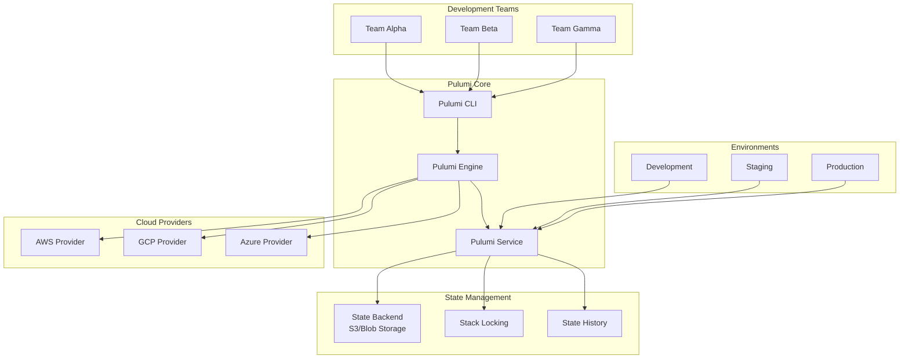

# Pulumi Enterprise Infrastructure as Code Platform

## 概述 (Overview)

Pulumi 是现代化的基础设施即代码平台，支持使用真实编程语言（Python、JavaScript、TypeScript、Go、C#）来管理云基础设施。本文档详细介绍 Pulumi 企业级部署架构、多云管理实践和团队协作模式。

Pulumi is a modern infrastructure as code platform that supports managing cloud infrastructure using real programming languages (Python, JavaScript, TypeScript, Go, C#). This document details Pulumi enterprise deployment architecture, multi-cloud management practices, and team collaboration patterns.

## 架构设计 (Architecture Design)

### 企业级架构 (Enterprise Architecture)

```yaml
# Pulumi 企业级部署架构
apiVersion: v1
kind: Namespace
metadata:
  name: pulumi-system
---
apiVersion: v1
kind: ConfigMap
metadata:
  name: pulumi-config
  namespace: pulumi-system
data:
  Pulumi.yaml: |
    name: enterprise-infra
    runtime: python
    description: Enterprise Infrastructure Management
    
  Pulumi.dev.yaml: |
    config:
      aws:region: us-west-2
      gcp:project: my-project-id
      azure:environment: public
      pulumi:template: aws-python
      
  Pulumi.prod.yaml: |
    config:
      aws:region: us-east-1
      gcp:project: prod-project-id
      azure:environment: public
      pulumi:template: multi-cloud
      
  __main__.py: |
    import pulumi
    import pulumi_aws as aws
    import pulumi_gcp as gcp
    import pulumi_azure_native as azure
    
    # AWS 基础设施
    aws_vpc = aws.ec2.Vpc(
        "enterprise-vpc",
        cidr_block="10.0.0.0/16",
        enable_dns_hostnames=True,
        enable_dns_support=True,
        tags={
            "Name": "enterprise-vpc",
            "Environment": pulumi.get_stack(),
        }
    )
    
    # GCP 基础设施
    gcp_project = gcp.organizations.Project(
        "enterprise-project",
        project_id=f"enterprise-{pulumi.get_stack()}",
        name=f"Enterprise {pulumi.get_stack().title()}",
        org_id="123456789012"
    )
    
    # Azure 基础设施
    azure_resource_group = azure.resources.ResourceGroup(
        "enterprise-rg",
        resource_group_name=f"enterprise-{pulumi.get_stack()}-rg",
        location="East US"
    )
```

### 多云架构 (Multi-cloud Architecture)



## 部署配置 (Deployment Configuration)

### Python 基础设施定义 (Python Infrastructure Definition)

```python
# __main__.py - 企业级基础设施定义
import pulumi
import pulumi_aws as aws
import pulumi_gcp as gcp
import pulumi_azure_native as azure
from pulumi import ResourceOptions, export
import json

# 配置加载
config = pulumi.Config()
aws_region = config.require('aws:region')
gcp_project = config.require('gcp:project')
azure_location = config.get('azure:location') or 'East US'

# 环境变量
environment = pulumi.get_stack()
is_production = environment == 'prod'

class EnterpriseInfrastructure:
    def __init__(self):
        self.resources = {}
        self.create_networking()
        self.create_compute()
        self.create_storage()
        self.create_security()
        self.export_outputs()
    
    def create_networking(self):
        """创建网络基础设施"""
        # AWS VPC
        self.aws_vpc = aws.ec2.Vpc(
            f"{environment}-vpc",
            cidr_block="10.0.0.0/16",
            enable_dns_hostnames=True,
            enable_dns_support=True,
            tags={
                "Name": f"{environment}-vpc",
                "Environment": environment,
                "ManagedBy": "Pulumi"
            }
        )
        
        # AWS 子网
        self.public_subnet = aws.ec2.Subnet(
            f"{environment}-public-subnet",
            vpc_id=self.aws_vpc.id,
            cidr_block="10.0.1.0/24",
            availability_zone="us-west-2a",
            map_public_ip_on_launch=True,
            tags={"Name": f"{environment}-public-subnet"}
        )
        
        self.private_subnet = aws.ec2.Subnet(
            f"{environment}-private-subnet",
            vpc_id=self.aws_vpc.id,
            cidr_block="10.0.2.0/24",
            availability_zone="us-west-2b",
            tags={"Name": f"{environment}-private-subnet"}
        )
        
        # AWS 互联网网关
        self.internet_gateway = aws.ec2.InternetGateway(
            f"{environment}-igw",
            vpc_id=self.aws_vpc.id,
            tags={"Name": f"{environment}-igw"}
        )
        
        # AWS 路由表
        self.route_table = aws.ec2.RouteTable(
            f"{environment}-rt",
            vpc_id=self.aws_vpc.id,
            routes=[aws.ec2.RouteTableRouteArgs(
                cidr_block="0.0.0.0/0",
                gateway_id=self.internet_gateway.id
            )],
            tags={"Name": f"{environment}-rt"}
        )
        
        # 路由表关联
        aws.ec2.RouteTableAssociation(
            f"{environment}-public-rt-assoc",
            subnet_id=self.public_subnet.id,
            route_table_id=self.route_table.id
        )
    
    def create_compute(self):
        """创建计算资源"""
        # AWS EC2 实例配置
        ami = aws.ec2.get_ami(
            most_recent=True,
            owners=["amazon"],
            filters=[
                aws.ec2.GetAmiFilterArgs(
                    name="name",
                    values=["amzn2-ami-hvm-*-x86_64-gp2"]
                )
            ]
        )
        
        # 安全组
        security_group = aws.ec2.SecurityGroup(
            f"{environment}-web-sg",
            vpc_id=self.aws_vpc.id,
            description="Web server security group",
            ingress=[
                aws.ec2.SecurityGroupIngressArgs(
                    protocol="tcp",
                    from_port=22,
                    to_port=22,
                    cidr_blocks=["0.0.0.0/0"],
                    description="SSH access"
                ),
                aws.ec2.SecurityGroupIngressArgs(
                    protocol="tcp",
                    from_port=80,
                    to_port=80,
                    cidr_blocks=["0.0.0.0/0"],
                    description="HTTP access"
                ),
                aws.ec2.SecurityGroupIngressArgs(
                    protocol="tcp",
                    from_port=443,
                    to_port=443,
                    cidr_blocks=["0.0.0.0/0"],
                    description="HTTPS access"
                )
            ],
            egress=[
                aws.ec2.SecurityGroupEgressArgs(
                    protocol="-1",
                    from_port=0,
                    to_port=0,
                    cidr_blocks=["0.0.0.0/0"]
                )
            ],
            tags={"Name": f"{environment}-web-sg"}
        )
        
        # EC2 实例
        self.web_instance = aws.ec2.Instance(
            f"{environment}-web-instance",
            ami=ami.id,
            instance_type="t3.medium" if is_production else "t3.micro",
            subnet_id=self.public_subnet.id,
            vpc_security_group_ids=[security_group.id],
            key_name=config.get('aws:key_name'),
            user_data="""#!/bin/bash
                yum update -y
                yum install -y httpd
                systemctl start httpd
                systemctl enable httpd
                echo '<h1>Hello from Pulumi-managed instance!</h1>' > /var/www/html/index.html
            """,
            tags={
                "Name": f"{environment}-web-instance",
                "Environment": environment,
                "Service": "web"
            },
            opts=ResourceOptions(
                ignore_changes=["user_data"] if not is_production else None
            )
        )
    
    def create_storage(self):
        """创建存储资源"""
        # S3 存储桶
        self.s3_bucket = aws.s3.Bucket(
            f"{environment}-assets-bucket",
            bucket=f"enterprise-{environment}-assets-{pulumi.get_stack()}",
            acl="private",
            versioning=aws.s3.BucketVersioningArgs(enabled=True),
            server_side_encryption_configuration=aws.s3.BucketServerSideEncryptionConfigurationArgs(
                rule=aws.s3.BucketServerSideEncryptionConfigurationRuleArgs(
                    apply_server_side_encryption_by_default=aws.s3.BucketServerSideEncryptionConfigurationRuleApplyServerSideEncryptionByDefaultArgs(
                        sse_algorithm="AES256"
                    )
                )
            ),
            lifecycle_rules=[
                aws.s3.BucketLifecycleRuleArgs(
                    enabled=True,
                    expiration=aws.s3.BucketLifecycleRuleExpirationArgs(days=90),
                    transitions=[
                        aws.s3.BucketLifecycleRuleTransitionArgs(
                            days=30,
                            storage_class="STANDARD_IA"
                        )
                    ]
                )
            ],
            tags={
                "Environment": environment,
                "ManagedBy": "Pulumi"
            }
        )
        
        # S3 存储桶策略
        aws.s3.BucketPolicy(
            f"{environment}-bucket-policy",
            bucket=self.s3_bucket.id,
            policy=self.s3_bucket.id.apply(lambda bucket_id: json.dumps({
                "Version": "2012-10-17",
                "Statement": [
                    {
                        "Effect": "Deny",
                        "Principal": "*",
                        "Action": "s3:*",
                        "Resource": [
                            f"arn:aws:s3:::{bucket_id}",
                            f"arn:aws:s3:::{bucket_id}/*"
                        ],
                        "Condition": {
                            "Bool": {"aws:SecureTransport": "false"}
                        }
                    }
                ]
            }))
        )
    
    def create_security(self):
        """创建安全资源"""
        # AWS CloudTrail
        self.cloudtrail = aws.cloudtrail.Trail(
            f"{environment}-cloudtrail",
            name=f"{environment}-trail",
            s3_bucket_name=self.s3_bucket.bucket,
            is_multi_region_trail=True,
            enable_logging=True,
            include_global_service_events=True,
            tags={"Environment": environment}
        )
        
        # AWS Config
        self.config_recorder = aws.cfg.Recorder(
            f"{environment}-config-recorder",
            name=f"{environment}-config-recorder",
            role_arn=aws.iam.get_role(name="config-role").arn
        )
    
    def export_outputs(self):
        """导出输出变量"""
        export("web_instance_public_ip", self.web_instance.public_ip)
        export("web_instance_private_ip", self.web_instance.private_ip)
        export("s3_bucket_name", self.s3_bucket.bucket)
        export("vpc_id", self.aws_vpc.id)
        export("public_subnet_id", self.public_subnet.id)
        export("private_subnet_id", self.private_subnet.id)

# 创建基础设施实例
infra = EnterpriseInfrastructure()
```

### 多环境配置 (Multi-environment Configuration)

```python
# environments.py - 环境配置管理
from typing import Dict, Any
import pulumi

class EnvironmentConfig:
    def __init__(self):
        self.stack = pulumi.get_stack()
        self.config = self._load_config()
    
    def _load_config(self) -> Dict[str, Any]:
        """加载环境特定配置"""
        base_config = {
            'dev': {
                'instance_type': 't3.micro',
                'min_instances': 1,
                'max_instances': 3,
                'database_instance_class': 'db.t3.micro',
                'enable_monitoring': False,
                'backup_retention_days': 7
            },
            'staging': {
                'instance_type': 't3.small',
                'min_instances': 2,
                'max_instances': 5,
                'database_instance_class': 'db.t3.small',
                'enable_monitoring': True,
                'backup_retention_days': 30
            },
            'prod': {
                'instance_type': 't3.medium',
                'min_instances': 3,
                'max_instances': 10,
                'database_instance_class': 'db.t3.medium',
                'enable_monitoring': True,
                'backup_retention_days': 90
            }
        }
        
        return base_config.get(self.stack, base_config['dev'])
    
    @property
    def instance_type(self) -> str:
        return self.config['instance_type']
    
    @property
    def min_instances(self) -> int:
        return self.config['min_instances']
    
    @property
    def max_instances(self) -> int:
        return self.config['max_instances']
    
    @property
    def database_instance_class(self) -> str:
        return self.config['database_instance_class']
    
    @property
    def enable_monitoring(self) -> bool:
        return self.config['enable_monitoring']
    
    @property
    def backup_retention_days(self) -> int:
        return self.config['backup_retention_days']

# 使用示例
env_config = EnvironmentConfig()
print(f"Current environment: {env_config.stack}")
print(f"Instance type: {env_config.instance_type}")
```

## 团队协作 (Team Collaboration)

### 项目结构 (Project Structure)

```python
# project_structure.py - 项目结构定义
"""
企业级 Pulumi 项目结构示例

enterprise-infra/
├── __main__.py                 # 主入口文件
├── Pulumi.yaml                # 项目配置
├── Pulumi.dev.yaml            # 开发环境配置
├── Pulumi.staging.yaml        # 预发布环境配置
├── Pulumi.prod.yaml           # 生产环境配置
├── components/                # 可复用组件
│   ├── __init__.py
│   ├── vpc.py                # VPC 组件
│   ├── eks_cluster.py        # EKS 集群组件
│   ├── rds_instance.py       # RDS 实例组件
│   └── alb.py                # 应用负载均衡器组件
├── modules/                  # 模块化基础设施
│   ├── __init__.py
│   ├── networking/           # 网络模块
│   ├── compute/             # 计算模块
│   ├── storage/             # 存储模块
│   └── security/            # 安全模块
├── stacks/                  # 堆栈定义
│   ├── __init__.py
│   ├── development.py       # 开发堆栈
│   ├── staging.py          # 预发布堆栈
│   └── production.py       # 生产堆栈
└── utils/                  # 工具函数
    ├── __init__.py
    ├── validators.py       # 验证器
    └── helpers.py          # 辅助函数
"""

# components/vpc.py - VPC 组件示例
import pulumi
from pulumi_aws import ec2

class VPCComponent(pulumi.ComponentResource):
    def __init__(self, name: str, opts: pulumi.ResourceOptions = None):
        super().__init__('custom:network:VPC', name, None, opts)
        
        # 创建 VPC
        self.vpc = ec2.Vpc(
            f"{name}-vpc",
            cidr_block="10.0.0.0/16",
            enable_dns_hostnames=True,
            enable_dns_support=True,
            tags={"Name": f"{name}-vpc"},
            opts=pulumi.ResourceOptions(parent=self)
        )
        
        # 导出属性
        self.register_outputs({
            'vpc_id': self.vpc.id,
            'cidr_block': self.vpc.cidr_block
        })

# modules/networking/__init__.py - 网络模块
from .vpc_module import VPCModule
from .subnet_module import SubnetModule
from .security_module import SecurityModule

__all__ = ['VPCModule', 'SubnetModule', 'SecurityModule']
```

### 权限管理 (Permission Management)

```python
# iam_policies.py - IAM 策略管理
import pulumi
import pulumi_aws as aws
from typing import List, Dict, Any

class IAMManager:
    def __init__(self, environment: str):
        self.environment = environment
        self.policies = {}
        self.roles = {}
        self.users = {}
        
    def create_policy(self, name: str, policy_document: Dict[str, Any]) -> aws.iam.Policy:
        """创建 IAM 策略"""
        policy = aws.iam.Policy(
            f"{self.environment}-{name}-policy",
            name=f"{self.environment}-{name}-policy",
            policy=pulumi.Output.json_dumps(policy_document),
            description=f"IAM policy for {name} in {self.environment} environment"
        )
        self.policies[name] = policy
        return policy
    
    def create_role(self, name: str, trust_policy: Dict[str, Any], 
                   attached_policies: List[str] = None) -> aws.iam.Role:
        """创建 IAM 角色"""
        role = aws.iam.Role(
            f"{self.environment}-{name}-role",
            name=f"{self.environment}-{name}-role",
            assume_role_policy=pulumi.Output.json_dumps(trust_policy),
            description=f"IAM role for {name} in {self.environment} environment"
        )
        
        # 附加策略
        if attached_policies:
            for policy_name in attached_policies:
                if policy_name in self.policies:
                    aws.iam.RolePolicyAttachment(
                        f"{self.environment}-{name}-{policy_name}-attachment",
                        role=role.name,
                        policy_arn=self.policies[policy_name].arn
                    )
        
        self.roles[name] = role
        return role
    
    def create_user(self, name: str, groups: List[str] = None) -> aws.iam.User:
        """创建 IAM 用户"""
        user = aws.iam.User(
            f"{self.environment}-{name}-user",
            name=f"{self.environment}-{name}",
            tags={"Environment": self.environment}
        )
        
        # 添加到用户组
        if groups:
            for group_name in groups:
                aws.iam.UserGroupMembership(
                    f"{self.environment}-{name}-{group_name}-membership",
                    user=user.name,
                    groups=[f"{self.environment}-{group_name}"]
                )
        
        self.users[name] = user
        return user

# 使用示例
iam_manager = IAMManager(pulumi.get_stack())

# 创建 EC2 管理策略
ec2_policy_doc = {
    "Version": "2012-10-17",
    "Statement": [
        {
            "Effect": "Allow",
            "Action": [
                "ec2:Describe*",
                "ec2:StartInstances",
                "ec2:StopInstances"
            ],
            "Resource": "*"
        }
    ]
}

ec2_policy = iam_manager.create_policy("ec2-admin", ec2_policy_doc)

# 创建 EC2 管理角色
ec2_role_trust = {
    "Version": "2012-10-17",
    "Statement": [
        {
            "Effect": "Allow",
            "Principal": {"Service": "ec2.amazonaws.com"},
            "Action": "sts:AssumeRole"
        }
    ]
}

ec2_role = iam_manager.create_role("ec2-manager", ec2_role_trust, ["ec2-admin"])
```

## 监控告警 (Monitoring and Alerting)

### 基础设施监控 (Infrastructure Monitoring)

```python
# monitoring.py - 监控告警配置
import pulumi
import pulumi_aws as aws

class MonitoringStack:
    def __init__(self, environment: str, vpc_id: pulumi.Input[str]):
        self.environment = environment
        self.vpc_id = vpc_id
        self.create_cloudwatch_alarms()
        self.create_sns_topics()
    
    def create_sns_topics(self):
        """创建 SNS 通知主题"""
        self.alarm_topic = aws.sns.Topic(
            f"{self.environment}-alarm-topic",
            name=f"{self.environment}-alarms",
            display_name=f"{self.environment.title()} Infrastructure Alarms"
        )
        
        # 订阅邮件通知
        aws.sns.TopicSubscription(
            f"{self.environment}-email-subscription",
            topic=self.alarm_topic.arn,
            protocol="email",
            endpoint="ops-team@example.com"
        )
    
    def create_cloudwatch_alarms(self):
        """创建 CloudWatch 告警"""
        # CPU 使用率告警
        aws.cloudwatch.MetricAlarm(
            f"{self.environment}-cpu-alarm",
            alarm_name=f"{self.environment}-high-cpu-utilization",
            comparison_operator="GreaterThanThreshold",
            evaluation_periods=2,
            metric_name="CPUUtilization",
            namespace="AWS/EC2",
            period=300,
            statistic="Average",
            threshold=80,
            alarm_description="This metric monitors EC2 instance CPU utilization",
            alarm_actions=[self.alarm_topic.arn],
            ok_actions=[self.alarm_topic.arn]
        )
        
        # 磁盘空间告警
        aws.cloudwatch.MetricAlarm(
            f"{self.environment}-disk-alarm",
            alarm_name=f"{self.environment}-low-disk-space",
            comparison_operator="LessThanThreshold",
            evaluation_periods=1,
            metric_name="disk_used_percent",
            namespace="CWAgent",
            period=300,
            statistic="Average",
            threshold=20,
            alarm_description="This metric monitors disk space usage",
            alarm_actions=[self.alarm_topic.arn],
            ok_actions=[self.alarm_topic.arn]
        )
        
        # 网络流量异常告警
        aws.cloudwatch.MetricAlarm(
            f"{self.environment}-network-alarm",
            alarm_name=f"{self.environment}-unusual-network-traffic",
            comparison_operator="GreaterThanThreshold",
            evaluation_periods=2,
            metric_name="NetworkOut",
            namespace="AWS/EC2",
            period=300,
            statistic="Sum",
            threshold=1000000000,  # 1GB
            alarm_description="This metric monitors unusual network traffic",
            alarm_actions=[self.alarm_topic.arn],
            ok_actions=[self.alarm_topic.arn]
        )

# 使用示例
monitoring = MonitoringStack(pulumi.get_stack(), infra.aws_vpc.id)
```

### 成本管理 (Cost Management)

```python
# cost_management.py - 成本管理配置
import pulumi
import pulumi_aws as aws

class CostManagement:
    def __init__(self, environment: str):
        self.environment = environment
        self.create_budgets()
        self.create_cost_anomaly_detection()
    
    def create_budgets(self):
        """创建预算警报"""
        # 月度预算
        aws.budgets.Budget(
            f"{self.environment}-monthly-budget",
            name=f"{self.environment}-monthly-budget",
            budget_type="COST",
            limit_amount="1000",
            limit_unit="USD",
            time_unit="MONTHLY",
            cost_filters={
                "TagKeyValue": [f"Environment${chr(36)}{self.environment}"]
            },
            notification_configs=[
                aws.budgets.BudgetNotificationConfigArgs(
                    comparison_operator="GREATER_THAN",
                    notification_type="ACTUAL",
                    threshold=80,
                    threshold_type="PERCENTAGE",
                    subscriber_email_addresses=["finance@example.com"]
                ),
                aws.budgets.BudgetNotificationConfigArgs(
                    comparison_operator="GREATER_THAN",
                    notification_type="ACTUAL",
                    threshold=100,
                    threshold_type="PERCENTAGE",
                    subscriber_email_addresses=["finance@example.com", "ops@example.com"]
                )
            ]
        )
    
    def create_cost_anomaly_detection(self):
        """创建成本异常检测"""
        aws.ce.AnomalyMonitor(
            f"{self.environment}-anomaly-monitor",
            name=f"{self.environment}-cost-anomalies",
            monitor_type="DIMENSIONAL",
            monitor_dimension="SERVICE"
        )

# 使用示例
cost_mgmt = CostManagement(pulumi.get_stack())
```

## 故障排除 (Troubleshooting)

### 常见问题诊断 (Common Issue Diagnosis)

```python
# troubleshooting.py - 故障排除工具
import pulumi
import json
from typing import Dict, Any

class InfrastructureDebugger:
    def __init__(self, stack_name: str):
        self.stack_name = stack_name
    
    def diagnose_resources(self) -> Dict[str, Any]:
        """诊断基础设施资源状态"""
        diagnostics = {
            "stack_info": {
                "name": self.stack_name,
                "current_state": "unknown"
            },
            "resource_health": {},
            "potential_issues": []
        }
        
        try:
            # 检查堆栈状态
            stack = pulumi.runtime.invoke("pulumi:pulumi:getStack", {})
            diagnostics["stack_info"]["current_state"] = stack.get("state", "unknown")
            
            # 检查资源依赖关系
            diagnostics["dependencies"] = self._analyze_dependencies()
            
        except Exception as e:
            diagnostics["errors"] = [str(e)]
        
        return diagnostics
    
    def _analyze_dependencies(self) -> Dict[str, Any]:
        """分析资源依赖关系"""
        dependencies = {
            "vpc_dependents": [],
            "security_group_dependents": [],
            "instance_dependents": []
        }
        
        # 这里可以添加具体的依赖分析逻辑
        return dependencies
    
    def generate_debug_report(self) -> str:
        """生成调试报告"""
        diagnostics = self.diagnose_resources()
        return json.dumps(diagnostics, indent=2, default=str)

# 使用示例
debugger = InfrastructureDebugger(pulumi.get_stack())
debug_report = debugger.generate_debug_report()
pulumi.export("debug_report", debug_report)
```

## 最佳实践 (Best Practices)

### 代码组织最佳实践 (Code Organization Best Practices)

1. **模块化设计**
   ```python
   # 推荐的项目结构
   project/
   ├── __main__.py          # 主入口
   ├── components/          # 可复用组件
   ├── modules/            # 功能模块
   ├── stacks/             # 环境堆栈
   └── utils/              # 工具函数
   ```

2. **配置管理**
   ```python
   # 使用配置类管理环境差异
   class Config:
       def __init__(self):
           self.stack = pulumi.get_stack()
           self.region = pulumi.Config().require('aws:region')
   ```

3. **资源命名规范**
   ```python
   # 使用一致的命名约定
   resource_name = f"{environment}-{service}-{resource_type}-{unique_id}"
   ```

### 安全最佳实践 (Security Best Practices)

1. **最小权限原则**
   ```python
   # 为每个服务创建专用 IAM 角色
   role = aws.iam.Role(
       "service-role",
       assume_role_policy=json.dumps({
           "Version": "2012-10-17",
           "Statement": [{
               "Effect": "Allow",
               "Principal": {"Service": "ec2.amazonaws.com"},
               "Action": "sts:AssumeRole"
           }]
       })
   )
   ```

2. **敏感信息管理**
   ```python
   # 使用 Pulumi Config 管理敏感信息
   config = pulumi.Config()
   db_password = config.require_secret('database-password')
   ```

3. **网络安全**
   ```python
   # 默认拒绝所有流量，显式允许所需流量
   security_group = aws.ec2.SecurityGroup(
       "secure-sg",
       ingress=[],
       egress=[]
   )
   ```

### 运维最佳实践 (Operations Best Practices)

1. **状态管理**
   ```bash
   # 使用远程后端存储状态
   pulumi login s3://my-pulumi-state-bucket
   pulumi stack init prod
   ```

2. **变更管理**
   ```bash
   # 预览变更前总是先检查
   pulumi preview --diff
   pulumi up --yes
   ```

3. **监控和告警**
   ```python
   # 为关键资源设置监控
   cloudwatch_alarm = aws.cloudwatch.MetricAlarm(
       "critical-resource-alarm",
       alarm_actions=[sns_topic.arn]
   )
   ```

---

**文档版本**: v1.0  
**最后更新**: 2024年  
**适用版本**: Pulumi 3.0+