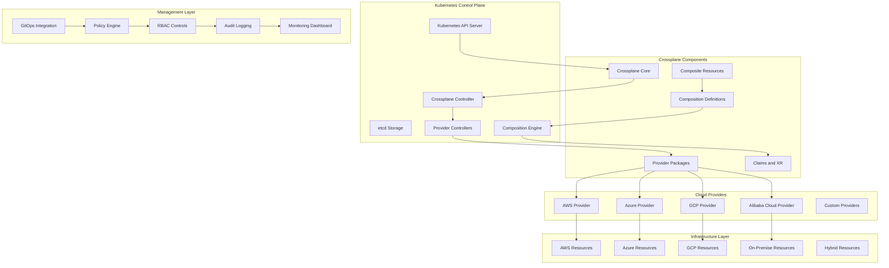

# Crossplane Enterprise Infrastructure Orchestration 深度实践

> **Author**: Multi-Cloud Platform Architect | **Version**: v1.0 | **Update Time**: 2026-02-07
> **Scenario**: Enterprise-grade multi-cloud infrastructure orchestration | **Complexity**: ⭐⭐⭐⭐⭐

## 🎯 Abstract

This document provides comprehensive exploration of Crossplane enterprise deployment architecture, multi-cloud management practices, and operational orchestration. Based on large-scale production environment experience, it offers complete technical guidance from control plane setup to provider management, helping enterprises build unified, vendor-agnostic infrastructure automation platforms with Kubernetes-native approach across AWS, Azure, GCP and other cloud providers.

## 1. Crossplane Enterprise Architecture

### 1.1 Core Component Architecture



### 1.2 Enterprise Deployment Architecture

```yaml
crossplane_enterprise_deployment:
  control_plane:
    kubernetes_cluster:
      type: "managed"  # EKS, AKS, GKE, or self-managed
      version: "1.25+"
      nodes:
        - type: "control_plane"
          count: 3
          instance_type: "t3.medium"
        - type: "worker"
          count: 5
          instance_type: "m5.large"
    
    crossplane_components:
      core:
        version: "v1.12.0"
        replicas: 2
        resources:
          requests:
            cpu: "100m"
            memory: "256Mi"
          limits:
            cpu: "500m"
            memory: "1Gi"
      
      providers:
        aws:
          version: "v0.44.0"
          controller_config:
            args:
              - --debug
            resources:
              requests:
                cpu: "50m"
                memory: "128Mi"
        
        azure:
          version: "v0.20.0"
          controller_config:
            args:
              - --debug
            resources:
              requests:
                cpu: "50m"
                memory: "128Mi"
        
        gcp:
          version: "v0.22.0"
          controller_config:
            args:
              - --debug
            resources:
              requests:
                cpu: "50m"
                memory: "128Mi"
  
  multi_cloud_connectivity:
    aws:
      authentication:
        method: "IRSA"  # IAM Roles for Service Accounts
        role_arn: "arn:aws:iam::123456789012:role/crossplane-aws-role"
      
    azure:
      authentication:
        method: "WorkloadIdentity"
        tenant_id: "your-tenant-id"
        client_id: "your-client-id"
      
    gcp:
      authentication:
        method: "WorkloadIdentity"
        project_id: "your-project-id"
        service_account: "crossplane@gcp-project.iam.gserviceaccount.com"
  
  security_configuration:
    rbac:
      cluster_roles:
        - name: "crossplane-admin"
          rules:
            - apiGroups: ["*"]
              resources: ["*"]
              verbs: ["*"]
        
        - name: "crossplane-viewer"
          rules:
            - apiGroups: ["apiextensions.crossplane.io"]
              resources: ["compositeresourcedefinitions", "compositions"]
              verbs: ["get", "list", "watch"]
    
    network_policies:
      enabled: true
      policies:
        - name: "crossplane-egress"
          egress:
            - to:
                - namespaceSelector:
                    matchLabels:
                      name: "kube-system"
              ports:
                - protocol: "TCP"
                  port: 53
                - protocol: "UDP"
                  port: 53
```

## 2. Advanced Provider Management

### 2.1 Provider Configuration

```yaml
# provider_config.yaml
apiVersion: pkg.crossplane.io/v1
kind: Provider
metadata:
  name: provider-aws
spec:
  package: xpkg.upbound.io/upbound/provider-aws:v0.44.0
  controllerConfigRef:
    name: aws-controller-config

---
apiVersion: pkg.crossplane.io/v1alpha1
kind: ControllerConfig
metadata:
  name: aws-controller-config
spec:
  args:
    - --debug
  metadata:
    annotations:
      prometheus.io/scrape: "true"
      prometheus.io/port: "8080"
  resources:
    limits:
      cpu: 100m
      memory: 128Mi
    requests:
      cpu: 50m
      memory: 64Mi
  serviceAccountName: crossplane-aws-provider

---
apiVersion: aws.crossplane.io/v1beta1
kind: ProviderConfig
metadata:
  name: aws-provider-config
spec:
  credentials:
    source: IRSA
  region: us-west-2
  assumeRoleARN: arn:aws:iam::123456789012:role/crossplane-infrastructure-role
```

### 2.2 Multi-Provider Composition

```yaml
# composite_database.yaml
apiVersion: apiextensions.crossplane.io/v1
kind: CompositeResourceDefinition
metadata:
  name: compositedatabases.example.org
spec:
  group: example.org
  names:
    kind: CompositeDatabase
    plural: compositedatabases
  claimNames:
    kind: Database
    plural: databases
  versions:
  - name: v1alpha1
    served: true
    referenceable: true
    schema:
      openAPIV3Schema:
        type: object
        properties:
          spec:
            type: object
            properties:
              parameters:
                type: object
                properties:
                  engine:
                    type: string
                    enum: [mysql, postgresql, mongodb]
                  size:
                    type: string
                    enum: [small, medium, large]
                  environment:
                    type: string
                    enum: [dev, staging, prod]
                required:
                - engine
                - size
                - environment

---
apiVersion: apiextensions.crossplane.io/v1
kind: Composition
metadata:
  name: composite-database-aws
  labels:
    provider: aws
    engine: mysql
spec:
  compositeTypeRef:
    apiVersion: example.org/v1alpha1
    kind: CompositeDatabase
  resources:
    - name: rds-instance
      base:
        apiVersion: rds.aws.crossplane.io/v1alpha1
        kind: DBInstance
        spec:
          forProvider:
            dbInstanceClass: db.t3.micro
            engine: mysql
            allocatedStorage: 20
            masterUsername: admin
          writeConnectionSecretToRef:
            namespace: crossplane-system
      patches:
        - type: FromCompositeFieldPath
          fromFieldPath: spec.parameters.size
          toFieldPath: spec.forProvider.dbInstanceClass
          transforms:
            - type: map
              map:
                small: db.t3.micro
                medium: db.t3.small
                large: db.t3.medium
```

## 3. GitOps Integration and Automation

### 3.1 Argo CD Integration

```yaml
# argo_application.yaml
apiVersion: argoproj.io/v1alpha1
kind: Application
metadata:
  name: crossplane-infrastructure
  namespace: argocd
spec:
  project: default
  source:
    repoURL: https://github.com/company/infrastructure.git
    targetRevision: HEAD
    path: crossplane/definitions
    directory:
      recurse: true
  destination:
    server: https://kubernetes.default.svc
    namespace: crossplane-system
  syncPolicy:
    automated:
      prune: true
      selfHeal: true
    syncOptions:
      - CreateNamespace=true
      - ApplyOutOfSyncOnly=true
  ignoreDifferences:
    - group: apiextensions.crossplane.io
      kind: Composition
      jsonPointers:
        - /status
```

### 3.2 Flux CD Integration

```yaml
# flux_kustomization.yaml
apiVersion: kustomize.toolkit.fluxcd.io/v1
kind: Kustomization
metadata:
  name: crossplane-compositions
  namespace: flux-system
spec:
  interval: 10m0s
  path: ./crossplane/compositions
  prune: true
  sourceRef:
    kind: GitRepository
    name: infrastructure-repo
  validation: client
  postBuild:
    substitute:
      cluster_name: production-cluster
      region: us-west-2
```

## 4. Security and Governance

### 4.1 RBAC Configuration

```yaml
# crossplane_rbac.yaml
apiVersion: rbac.authorization.k8s.io/v1
kind: ClusterRole
metadata:
  name: crossplane-composite-admin
rules:
  - apiGroups:
      - "*.example.org"
    resources:
      - "*"
    verbs:
      - "*"
  - apiGroups:
      - apiextensions.crossplane.io
    resources:
      - compositeresourcedefinitions
      - compositions
    verbs:
      - "*"

---
apiVersion: rbac.authorization.k8s.io/v1
kind: ClusterRoleBinding
metadata:
  name: crossplane-composite-admin-binding
subjects:
  - kind: User
    name: platform-team
    apiGroup: rbac.authorization.k8s.io
roleRef:
  kind: ClusterRole
  name: crossplane-composite-admin
  apiGroup: rbac.authorization.k8s.io

---
# Namespace-specific RBAC
apiVersion: rbac.authorization.k8s.io/v1
kind: Role
metadata:
  name: crossplane-namespace-admin
  namespace: team-a-infra
rules:
  - apiGroups:
      - "*.example.org"
    resources:
      - databases
      - storages
      - networks
    verbs:
      - get
      - list
      - create
      - update
      - delete
```

### 4.2 Policy Enforcement with OPA

```rego
# crossplane_policy.rego
package crossplane.validation

# 禁止在生产环境中使用小规格资源
deny[msg] {
    input.kind == "CompositeDatabase"
    input.spec.parameters.environment == "prod"
    input.spec.parameters.size == "small"
    msg := "Production databases must use at least medium size"
}

# 强制标签要求
deny[msg] {
    input.kind == "CompositeDatabase"
    not input.metadata.labels.team
    msg := "Team label is required for all infrastructure resources"
}

# 成本控制策略
deny[msg] {
    input.kind == "CompositeDatabase"
    input.spec.parameters.environment == "dev"
    input.spec.parameters.size == "large"
    msg := "Development environments cannot use large database instances"
}

# 区域限制策略
allowed_regions = {"us-west-2", "us-east-1", "eu-west-1"}

deny[msg] {
    input.kind == "ProviderConfig"
    input.spec.region
    not input.spec.region == allowed_regions[_]
    msg := sprintf("Region %s is not allowed. Allowed regions: %v", [input.spec.region, allowed_regions])
}
```

## 5. Monitoring and Observability

### 5.1 Prometheus Metrics Configuration

```yaml
# crossplane_monitoring.yaml
apiVersion: monitoring.coreos.com/v1
kind: ServiceMonitor
metadata:
  name: crossplane-metrics
  namespace: crossplane-system
  labels:
    app: crossplane
spec:
  selector:
    matchLabels:
      app: crossplane
  namespaceSelector:
    matchNames:
      - crossplane-system
  endpoints:
    - port: metrics
      interval: 30s
      path: /metrics
      relabelings:
        - sourceLabels: [__meta_kubernetes_pod_name]
          targetLabel: pod
        - sourceLabels: [__meta_kubernetes_namespace]
          targetLabel: namespace

---
apiVersion: v1
kind: Service
metadata:
  name: crossplane-metrics
  namespace: crossplane-system
  labels:
    app: crossplane
spec:
  selector:
    app: crossplane
  ports:
    - name: metrics
      port: 8080
      targetPort: 8080
      protocol: TCP
```

### 5.2 Grafana Dashboard

```json
{
  "dashboard": {
    "id": null,
    "title": "Crossplane Infrastructure Overview",
    "tags": ["crossplane", "infrastructure", "multi-cloud"],
    "timezone": "browser",
    "schemaVersion": 38,
    "version": 1,
    "panels": [
      {
        "type": "stat",
        "title": "Managed Resources",
        "gridPos": {
          "h": 6,
          "w": 4,
          "x": 0,
          "y": 0
        },
        "targets": [
          {
            "expr": "count(crossplane_managed_resource_total)",
            "instant": true
          }
        ]
      },
      {
        "type": "graph",
        "title": "Resource Provisioning Rate",
        "gridPos": {
          "h": 8,
          "w": 12,
          "x": 4,
          "y": 0
        },
        "targets": [
          {
            "expr": "rate(crossplane_managed_resource_total[5m])",
            "legendFormat": "{{provider}}"
          }
        ]
      },
      {
        "type": "table",
        "title": "Failed Resource Creations",
        "gridPos": {
          "h": 8,
          "w": 8,
          "x": 16,
          "y": 0
        },
        "targets": [
          {
            "expr": "crossplane_managed_resource_failed_total > 0",
            "format": "table"
          }
        ]
      }
    ]
  }
}
```

## 6. Multi-Cloud Resource Management

### 6.1 Cloud-Specific Configurations

```yaml
# multi_cloud_database.yaml
apiVersion: example.org/v1alpha1
kind: Database
metadata:
  name: multi-cloud-db
  namespace: team-a-infra
spec:
  parameters:
    engine: postgresql
    size: medium
    environment: prod
  compositionSelector:
    matchLabels:
      provider: aws
      region: us-west-2

---
# Azure equivalent
apiVersion: example.org/v1alpha1
kind: Database
metadata:
  name: azure-db
  namespace: team-b-infra
spec:
  parameters:
    engine: postgresql
    size: medium
    environment: prod
  compositionSelector:
    matchLabels:
      provider: azure
      region: eastus
```

### 6.2 Hybrid Cloud Networking

```yaml
# hybrid_network.yaml
apiVersion: network.example.org/v1alpha1
kind: HybridNetwork
metadata:
  name: enterprise-hybrid-network
spec:
  parameters:
    onPremCIDR: "10.0.0.0/16"
    cloudCIDR: "172.16.0.0/16"
    vpnEnabled: true
    privateLinkEnabled: true
  compositionRef:
    name: hybrid-network-composition

---
apiVersion: apiextensions.crossplane.io/v1
kind: Composition
metadata:
  name: hybrid-network-composition
spec:
  compositeTypeRef:
    apiVersion: network.example.org/v1alpha1
    kind: HybridNetwork
  resources:
    - name: aws-vpc
      base:
        apiVersion: ec2.aws.crossplane.io/v1beta1
        kind: VPC
        spec:
          forProvider:
            cidrBlock: 172.16.0.0/16
            enableDnsHostnames: true
            enableDnsSupport: true
    - name: azure-vnet
      base:
        apiVersion: network.azure.crossplane.io/v1beta1
        kind: VirtualNetwork
        spec:
          forProvider:
            addressSpace:
              addressPrefixes:
                - 172.17.0.0/16
    - name: gcp-network
      base:
        apiVersion: compute.gcp.crossplane.io/v1beta1
        kind: Network
        spec:
          forProvider:
            autoCreateSubnetworks: false
```

## 7. Disaster Recovery and Backup

### 7.1 Crossplane State Backup

```bash
#!/bin/bash
# crossplane_backup.sh

BACKUP_DIR="/backup/crossplane"
DATE=$(date +%Y%m%d_%H%M%S)
NAMESPACE="crossplane-system"

# 1. 备份Crossplane CRDs
kubectl get crd -o json | jq '.items[] | select(.metadata.name | contains("crossplane") or contains("composite"))' > "$BACKUP_DIR/crossplane_crds_$DATE.json"

# 2. 备份Provider配置
kubectl get providerconfig -A -o yaml > "$BACKUP_DIR/provider_configs_$DATE.yaml"

# 3. 备份Composition定义
kubectl get compositions -A -o yaml > "$BACKUP_DIR/compositions_$DATE.yaml"

# 4. 备份CompositeResourceDefinitions
kubectl get compositeresourcedefinitions -A -o yaml > "$BACKUP_DIR/crds_$DATE.yaml"

# 5. 备份实际的Managed Resources
kubectl get managed -A -o yaml > "$BACKUP_DIR/managed_resources_$DATE.yaml"

# 6. 创建备份清单
cat > "$BACKUP_DIR/backup_manifest_$DATE.json" << EOF
{
  "backup_id": "$DATE",
  "timestamp": "$(date -Iseconds)",
  "components": {
    "crds": "crossplane_crds_$DATE.json",
    "provider_configs": "provider_configs_$DATE.yaml",
    "compositions": "compositions_$DATE.yaml",
    "crds_definitions": "crds_$DATE.yaml",
    "managed_resources": "managed_resources_$DATE.yaml"
  },
  "size_bytes": $(du -sb "$BACKUP_DIR" | cut -f1)
}
EOF

# 7. 验证备份完整性
echo "Verifying backup integrity..."
for file in "$BACKUP_DIR"/*_"$DATE".*; do
    if [ -f "$file" ]; then
        echo "✓ $file"
    else
        echo "✗ Missing backup file: $file"
    fi
done

echo "Backup completed: $BACKUP_DIR/backup_manifest_$DATE.json"
```

### 7.2 Cross-Cloud Recovery Strategy

```yaml
# disaster_recovery_plan.yaml
apiVersion: disasterrecovery.example.org/v1alpha1
kind: RecoveryPlan
metadata:
  name: crossplane-dr-plan
spec:
  primaryRegion: us-west-2
  secondaryRegion: us-east-1
  failoverThreshold: 5  # 分钟
  recoverySteps:
    - name: "Validate backup integrity"
      action: "crossplane-backup-validate"
      timeout: "5m"
      
    - name: "Restore ProviderConfigs"
      action: "kubectl apply -f backup/provider_configs.yaml"
      timeout: "2m"
      
    - name: "Restore Compositions"
      action: "kubectl apply -f backup/compositions.yaml"
      timeout: "3m"
      
    - name: "Restore Managed Resources"
      action: "kubectl apply -f backup/managed_resources.yaml"
      timeout: "10m"
      
    - name: "Verify resource status"
      action: "crossplane-resource-verify"
      timeout: "5m"
  
  monitoring:
    enabled: true
    alertThresholds:
      recoveryTime: "15m"
      successRate: "95%"
```

## 8. Performance Optimization

### 8.1 Controller Optimization

```yaml
# optimized_controller_config.yaml
apiVersion: pkg.crossplane.io/v1alpha1
kind: ControllerConfig
metadata:
  name: optimized-crossplane-config
spec:
  args:
    - --debug
    - --sync-period=10m  # 增加同步周期减少API调用
    - --max-reconcile-rate=10  # 限制最大协调速率
  metadata:
    labels:
      app: crossplane
  replicas: 2
  resources:
    limits:
      cpu: 200m
      memory: 512Mi
    requests:
      cpu: 100m
      memory: 256Mi
  serviceAccountName: crossplane
  affinity:
    podAntiAffinity:
      preferredDuringSchedulingIgnoredDuringExecution:
        - weight: 100
          podAffinityTerm:
            labelSelector:
              matchLabels:
                app: crossplane
            topologyKey: kubernetes.io/hostname
```

### 8.2 Caching and Rate Limiting

```yaml
# caching_config.yaml
apiVersion: v1
kind: ConfigMap
metadata:
  name: crossplane-caching-config
  namespace: crossplane-system
data:
  cache-config.yaml: |
    apiVersion: v1
    kind: CacheConfig
    metadata:
      name: crossplane-cache
    spec:
      ttl: "300s"  # 5分钟缓存
      maxSize: 1000
      evictionPolicy: "LRU"
      cacheTypes:
        - "ProviderConfig"
        - "Composition"
        - "CompositeResourceDefinition"
```

---
*This document is based on enterprise-level Crossplane platform practice experience and continuously updated with the latest technologies and best practices.*