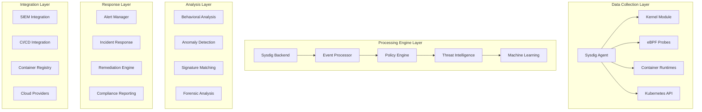

# Sysdig企业级容器安全深度实践

> **Author**: Container Security Architect | **Version**: v1.0 | **Update Time**: 2026-02-07
> **Scenario**: Enterprise-grade container security platform | **Complexity**: ⭐⭐⭐⭐⭐

## 🎯 Abstract

This document provides in-depth exploration of Sysdig enterprise container security platform architecture design, deployment practices, and operational management. Based on large-scale production environment experience, it offers comprehensive technical guidance from runtime protection to threat detection, helping enterprises build comprehensive, proactive container security systems.

## 1. Sysdig Architecture Deep Dive

### 1.1 Core Component Architecture



### 1.2 Security Capabilities Matrix

```yaml
sysdig_security_capabilities:
  runtime_protection:
    container_drift_detection: true
    file_integrity_monitoring: true
    process_activity_monitoring: true
    network_connection_tracking: true
    syscall_monitoring: true
    
  vulnerability_management:
    image_scanning: true
    registry_integration: true
    cve_database: true
    remediation_guidance: true
    sbom_generation: true
    
  compliance_enforcement:
    cis_benchmarks: true
    nist_framework: true
    pci_dss: true
    hipaa: true
    gdpr: true
    
  threat_detection:
    behavioral_analysis: true
    machine_learning_models: true
    threat_intelligence_feeds: true
    custom_rule_engine: true
    forensic_capabilities: true
```

## 2. Enterprise Deployment Architecture

### 2.1 Sysdig Agent Deployment

```yaml
# sysdig-agent-daemonset.yaml
apiVersion: apps/v1
kind: DaemonSet
metadata:
  name: sysdig-agent
  namespace: sysdig-agent
spec:
  selector:
    matchLabels:
      app: sysdig-agent
  template:
    metadata:
      labels:
        app: sysdig-agent
    spec:
      hostPID: true
      hostIPC: true
      hostNetwork: true
      dnsPolicy: ClusterFirstWithHostNet
      tolerations:
        - effect: NoSchedule
          operator: Exists
        - effect: NoExecute
          operator: Exists
      containers:
        - name: sysdig-agent
          image: sysdig/agent:12.10.0
          securityContext:
            privileged: true
          env:
            - name: ACCESS_KEY
              valueFrom:
                secretKeyRef:
                  name: sysdig-agent
                  key: access-key
            - name: TAGS
              value: "cluster:production,region:us-west-2"
            - name: SECURE_INGESTION_URL
              value: "https://secure.sysdig.com"
            - name: COLLECTOR_PORT
              value: "6443"
            - name: K8S_CLUSTER_NAME
              value: "production-cluster"
            - name: AGENT_MODE
              value: "secure"
            - name: SCRAPER
              value: "true"
            - name: PROMETHEUS_ENABLED
              value: "true"
          volumeMounts:
            - mountPath: /host/var/run/docker.sock
              name: docker-sock
              readOnly: true
            - mountPath: /host/dev
              name: dev-vol
              readOnly: true
            - mountPath: /host/proc
              name: proc-vol
              readOnly: true
            - mountPath: /host/boot
              name: boot-vol
              readOnly: true
            - mountPath: /host/lib/modules
              name: modules-vol
              readOnly: true
            - mountPath: /host/usr
              name: usr-vol
              readOnly: true
            - mountPath: /host/run/containerd
              name: containerd-sock
              readOnly: true
            - mountPath: /host/run/crio
              name: crio-sock
              readOnly: true
            - mountPath: /host/sys/fs/cgroup
              name: cgroup-vol
              readOnly: true
            - mountPath: /host/etc
              name: etc-vol
              readOnly: true
            - mountPath: /host/var/lib/kubelet
              name: kubelet-vol
              readOnly: true
            - mountPath: /host/var/lib/calico
              name: calico-vol
              readOnly: true
          resources:
            requests:
              cpu: 100m
              memory: 512Mi
            limits:
              cpu: 1000m
              memory: 1536Mi
      volumes:
        - name: docker-sock
          hostPath:
            path: /var/run/docker.sock
        - name: dev-vol
          hostPath:
            path: /dev
        - name: proc-vol
          hostPath:
            path: /proc
        - name: boot-vol
          hostPath:
            path: /boot
        - name: modules-vol
          hostPath:
            path: /lib/modules
        - name: usr-vol
          hostPath:
            path: /usr
        - name: containerd-sock
          hostPath:
            path: /run/containerd
        - name: crio-sock
          hostPath:
            path: /run/crio
        - name: cgroup-vol
          hostPath:
            path: /sys/fs/cgroup
        - name: etc-vol
          hostPath:
            path: /etc
        - name: kubelet-vol
          hostPath:
            path: /var/lib/kubelet
        - name: calico-vol
          hostPath:
            path: /var/lib/calico
```

### 2.2 Sysdig Secure Configuration

```yaml
# sysdig-secure-config.yaml
apiVersion: v1
kind: ConfigMap
metadata:
  name: sysdig-secure-config
  namespace: sysdig-agent
data:
  agent.yaml: |
    # Sysdig Agent Configuration
    customerid: ${ACCESS_KEY}
    cluster_name: ${K8S_CLUSTER_NAME}
    tags: ${TAGS}
    
    # Security Configuration
    security:
      enabled: true
      runtime_policy_enabled: true
      image_scanning_enabled: true
      compliance_enabled: true
      threat_detection_enabled: true
    
    # Collector Configuration
    collector: ${COLLECTOR_URL}
    collector_port: ${COLLECTOR_PORT}
    ssl: true
    ssl_verify_certificate: true
    
    # Kubernetes Integration
    kubernetes:
      enabled: true
      api_server_url: https://kubernetes.default.svc
      bearer_token_path: /var/run/secrets/kubernetes.io/serviceaccount/token
      ca_cert_path: /var/run/secrets/kubernetes.io/serviceaccount/ca.crt
      node_name_env_var: NODE_NAME
    
    # Container Runtime Configuration
    container_engines:
      docker:
        enabled: true
        socket_path: /host/var/run/docker.sock
      containerd:
        enabled: true
        socket_path: /host/run/containerd/containerd.sock
      crio:
        enabled: true
        socket_path: /host/run/crio/crio.sock
    
    # Logging Configuration
    log:
      level: info
      output: file
      path: /var/log/sysdig-agent.log
    
    # Performance Tuning
    sysdig:
      proc_lookups_max_processes: 10000
      proc_lookups_timeout_ms: 5000
      thread_table_size: 131072
      snaplen: 256
    
    # eBPF Configuration
    ebpf:
      enabled: true
      probe_path: /opt/sysdig/ebpf-probe.o
```

## 3. Security Policy Management

### 3.1 Runtime Security Policies

```yaml
# runtime-security-policies.yaml
apiVersion: v1
kind: ConfigMap
metadata:
  name: sysdig-runtime-policies
  namespace: sysdig-agent
data:
  # Critical Security Policies
  critical-policies.yaml: |
    - name: Detect Privileged Containers
      description: Alert when containers run in privileged mode
      enabled: true
      severity: HIGH
      rules:
        - macro: container_started
          condition: evt.type = container and evt.dir = >
        - rule: Privileged Container
          desc: Privileged container started
          condition: container_started and container.privileged = true
          output: Privileged container started (user=%user.name command=%proc.cmdline container=%container.name image=%container.image.repository)
          priority: WARNING
          tags: [container, mitre_privilege_escalation]
    
    - name: Detect Host PID Mounts
      description: Alert when containers mount host PID namespace
      enabled: true
      severity: HIGH
      rules:
        - rule: Host PID Namespace
          desc: Container mounting host PID namespace
          condition: container_started and container.pid_mode = host
          output: Container mounting host PID namespace (user=%user.name command=%proc.cmdline container=%container.name)
          priority: WARNING
          tags: [container, mitre_privilege_escalation]
    
    - name: Detect Network Activity from Suspicious Processes
      description: Monitor unusual network connections from known malicious processes
      enabled: true
      severity: CRITICAL
      rules:
        - list: suspicious_binaries
          items: [minerd, xmrig, cgminer, ethminer]
        - rule: Suspicious Network Activity
          desc: Network activity from suspicious binary
          condition: >
            evt.type in (connect, accept) and
            proc.name in (suspicious_binaries) and
            container
          output: Suspicious network activity detected (process=%proc.name connection=%fd.name container=%container.name)
          priority: CRITICAL
          tags: [network, crypto_mining, security]
    
    - name: Detect Fileless Malware
      description: Monitor for fileless malware execution techniques
      enabled: true
      severity: CRITICAL
      rules:
        - rule: Fileless Malware Execution
          desc: Potential fileless malware execution detected
          condition: >
            spawned_process and
            proc.cmdline contains "memfd:" and
            container
          output: Fileless malware execution detected (process=%proc.name cmdline=%proc.cmdline container=%container.name)
          priority: CRITICAL
          tags: [malware, fileless, security]
  
  # Compliance Policies
  compliance-policies.yaml: |
    - name: CIS Docker Benchmark
      description: Enforce CIS Docker container security benchmarks
      enabled: true
      severity: MEDIUM
      rules:
        - rule: CIS 4.1 - Ensure a user for the container has been created
          desc: Container running as root user
          condition: >
            container and
            user.uid = 0 and
            not proc.name in (docker-init, dumb-init)
          output: Container running as root user (container=%container.name image=%container.image.repository)
          priority: WARNING
          tags: [cis, docker, compliance]
        
        - rule: CIS 5.3 - Ensure containers do not have CAP_SYS_ADMIN capability
          desc: Container with excessive capabilities
          condition: >
            container_started and
            container.cap_effective contains "CAP_SYS_ADMIN"
          output: Container with CAP_SYS_ADMIN capability (container=%container.name capabilities=%container.cap_effective)
          priority: WARNING
          tags: [cis, capabilities, compliance]
```

### 3.2 Image Scanning Policies

```yaml
# image-scanning-policies.yaml
apiVersion: v1
kind: ConfigMap
metadata:
  name: sysdig-image-scanning-policies
  namespace: sysdig-agent
data:
  scanning-policies.yaml: |
    # Image Scanning Policies
    policies:
      - name: Critical Vulnerability Block
        description: Block images with critical vulnerabilities
        enabled: true
        scope:
          - registry: "*"
          - repository: "*"
        rules:
          - type: vulnerability
            severity: CRITICAL
            action: block
            max_count: 0
        
      - name: High Severity Threshold
        description: Alert on high severity vulnerabilities
        enabled: true
        scope:
          - registry: "docker.io"
          - repository: "library/*"
        rules:
          - type: vulnerability
            severity: HIGH
            action: alert
            max_count: 5
        
      - name: License Compliance
        description: Check for prohibited licenses
        enabled: true
        scope:
          - registry: "internal-registry.company.com"
        rules:
          - type: license
            prohibited_licenses:
              - GPL-3.0
              - AGPL-3.0
            action: block
        
      - name: Base Image Validation
        description: Ensure approved base images
        enabled: true
        scope:
          - registry: "*"
        rules:
          - type: base_image
            approved_images:
              - alpine:3.16
              - ubuntu:20.04
              - centos:8
            action: block
            message: "Using unauthorized base image"
```

## 4. Threat Detection and Response

### 4.1 Behavioral Analysis Rules

```python
#!/usr/bin/env python3
# threat-detection-engine.py

import json
import time
import logging
from typing import Dict, List, Any
from dataclasses import dataclass
from collections import defaultdict, deque
import numpy as np
from sklearn.ensemble import IsolationForest
from sklearn.preprocessing import StandardScaler

@dataclass
class SecurityEvent:
    timestamp: float
    event_type: str
    source: str
    severity: str
    details: Dict[str, Any]

class BehavioralAnalyzer:
    def __init__(self):
        self.event_history = defaultdict(lambda: deque(maxlen=1000))
        self.baseline_profiles = {}
        self.anomaly_detectors = {}
        self.threat_patterns = self.load_threat_patterns()
        self.logger = logging.getLogger(__name__)
    
    def load_threat_patterns(self) -> Dict:
        """加载已知威胁模式"""
        return {
            'lateral_movement': {
                'indicators': ['ssh_connection', 'credential_access', 'process_injection'],
                'window': 300,  # 5分钟窗口
                'threshold': 3
            },
            'data_exfiltration': {
                'indicators': ['large_data_transfer', 'unusual_network_destinations', 'file_access_patterns'],
                'window': 600,  # 10分钟窗口
                'threshold': 2
            },
            'privilege_escalation': {
                'indicators': ['sudo_usage', 'capability_addition', 'namespace_escape'],
                'window': 120,  # 2分钟窗口
                'threshold': 1
            }
        }
    
    def train_anomaly_detector(self, container_id: str, features: List[List[float]]):
        """训练异常检测模型"""
        if len(features) < 50:
            return False
        
        # 标准化特征
        scaler = StandardScaler()
        normalized_features = scaler.fit_transform(features)
        
        # 训练隔离森林
        detector = IsolationForest(
            contamination=0.1,
            random_state=42,
            n_estimators=100
        )
        detector.fit(normalized_features)
        
        self.anomaly_detectors[container_id] = {
            'detector': detector,
            'scaler': scaler,
            'trained_at': time.time()
        }
        
        self.logger.info(f"Trained anomaly detector for container {container_id}")
        return True
    
    def detect_anomalies(self, container_id: str, current_features: List[float]) -> bool:
        """检测异常行为"""
        if container_id not in self.anomaly_detectors:
            return False
        
        detector_info = self.anomaly_detectors[container_id]
        scaler = detector_info['scaler']
        detector = detector_info['detector']
        
        # 标准化当前特征
        normalized_features = scaler.transform([current_features])
        
        # 预测异常
        anomaly_score = detector.decision_function(normalized_features)[0]
        is_anomaly = detector.predict(normalized_features)[0] == -1
        
        if is_anomaly:
            self.logger.warning(f"Anomaly detected in container {container_id} (score: {anomaly_score})")
        
        return is_anomaly
    
    def analyze_behavioral_patterns(self, events: List[SecurityEvent]) -> List[Dict]:
        """分析行为模式"""
        threats = []
        
        for pattern_name, pattern_config in self.threat_patterns.items():
            # 按时间窗口分组事件
            time_windows = self.group_events_by_time(events, pattern_config['window'])
            
            for window_events in time_windows:
                threat_indicators = self.extract_threat_indicators(window_events)
                
                # 检查是否匹配威胁模式
                matches = sum(1 for indicator in threat_indicators 
                            if indicator in pattern_config['indicators'])
                
                if matches >= pattern_config['threshold']:
                    threat = {
                        'type': pattern_name,
                        'confidence': matches / len(pattern_config['indicators']),
                        'events': [e.__dict__ for e in window_events],
                        'timestamp': max(e.timestamp for e in window_events)
                    }
                    threats.append(threat)
        
        return threats
    
    def group_events_by_time(self, events: List[SecurityEvent], window_size: int) -> List[List[SecurityEvent]]:
        """按时间窗口分组事件"""
        if not events:
            return []
        
        events.sort(key=lambda x: x.timestamp)
        windows = []
        current_window = [events[0]]
        
        for event in events[1:]:
            if event.timestamp - current_window[0].timestamp <= window_size:
                current_window.append(event)
            else:
                if len(current_window) > 1:  # 只返回有意义的窗口
                    windows.append(current_window)
                current_window = [event]
        
        if len(current_window) > 1:
            windows.append(current_window)
        
        return windows
    
    def extract_threat_indicators(self, events: List[SecurityEvent]) -> List[str]:
        """提取威胁指标"""
        indicators = []
        
        for event in events:
            if event.event_type == 'process_exec':
                if 'crypto' in event.details.get('process_name', '').lower():
                    indicators.append('crypto_mining')
                elif event.details.get('privilege_escalation'):
                    indicators.append('privilege_escalation')
            
            elif event.event_type == 'network_connection':
                if event.details.get('destination_port') in [22, 3389]:
                    indicators.append('remote_access')
                elif event.details.get('data_volume', 0) > 1000000:  # 1MB
                    indicators.append('large_data_transfer')
            
            elif event.event_type == 'file_access':
                if event.details.get('sensitive_file'):
                    indicators.append('sensitive_file_access')
        
        return list(set(indicators))  # 去重

class ThreatResponseEngine:
    def __init__(self):
        self.response_actions = {
            'isolate_container': self.isolate_container,
            'terminate_process': self.terminate_process,
            'block_network': self.block_network,
            'quarantine_image': self.quarantine_image
        }
    
    def execute_response(self, threat: Dict, action: str) -> bool:
        """执行响应动作"""
        if action not in self.response_actions:
            logging.error(f"Unknown response action: {action}")
            return False
        
        try:
            return self.response_actions[action](threat)
        except Exception as e:
            logging.error(f"Failed to execute {action}: {e}")
            return False
    
    def isolate_container(self, threat: Dict) -> bool:
        """隔离容器"""
        container_id = threat['events'][0]['details'].get('container_id')
        if not container_id:
            return False
        
        # 实现容器网络隔离逻辑
        # 这里应该是实际的Kubernetes API调用
        logging.info(f"Isolating container {container_id}")
        return True
    
    def terminate_process(self, threat: Dict) -> bool:
        """终止恶意进程"""
        process_pid = threat['events'][0]['details'].get('process_pid')
        if not process_pid:
            return False
        
        # 实现进程终止逻辑
        logging.info(f"Terminating process {process_pid}")
        return True
    
    def block_network(self, threat: Dict) -> bool:
        """阻止网络连接"""
        container_id = threat['events'][0]['details'].get('container_id')
        if not container_id:
            return False
        
        # 实现网络策略更新
        logging.info(f"Blocking network for container {container_id}")
        return True
    
    def quarantine_image(self, threat: Dict) -> bool:
        """隔离镜像"""
        image_name = threat['events'][0]['details'].get('image_name')
        if not image_name:
            return False
        
        # 实现镜像隔离逻辑
        logging.info(f"Quarantining image {image_name}")
        return True

# 主要威胁检测引擎
class SysdigThreatEngine:
    def __init__(self):
        self.behavioral_analyzer = BehavioralAnalyzer()
        self.response_engine = ThreatResponseEngine()
        self.logger = logging.getLogger(__name__)
    
    def process_security_events(self, raw_events: List[Dict]) -> List[Dict]:
        """处理安全事件"""
        # 转换原始事件为SecurityEvent对象
        events = [SecurityEvent(**event) for event in raw_events]
        
        # 行为分析
        behavioral_threats = self.behavioral_analyzer.analyze_behavioral_patterns(events)
        
        # 异常检测
        anomaly_threats = self.detect_anomalies(events)
        
        # 合并所有威胁
        all_threats = behavioral_threats + anomaly_threats
        
        # 执行自动响应
        for threat in all_threats:
            self.respond_to_threat(threat)
        
        return [threat for threat in all_threats if threat['confidence'] > 0.7]
    
    def detect_anomalies(self, events: List[SecurityEvent]) -> List[Dict]:
        """检测异常"""
        anomalies = []
        
        # 按容器分组事件
        container_events = defaultdict(list)
        for event in events:
            container_id = event.details.get('container_id')
            if container_id:
                container_events[container_id].append(event)
        
        # 对每个容器进行异常检测
        for container_id, events in container_events.items():
            if len(events) < 10:  # 需要足够的样本
                continue
            
            # 提取特征向量
            features = self.extract_features(events)
            
            # 训练模型（如果需要）
            if container_id not in self.behavioral_analyzer.anomaly_detectors:
                self.behavioral_analyzer.train_anomaly_detector(container_id, features[:-10])
            
            # 检测最近的异常
            recent_features = features[-10:]
            for feature_vector in recent_features:
                if self.behavioral_analyzer.detect_anomalies(container_id, feature_vector):
                    anomaly = {
                        'type': 'behavioral_anomaly',
                        'confidence': 0.9,
                        'events': [e.__dict__ for e in events[-5:]],
                        'timestamp': time.time(),
                        'container_id': container_id
                    }
                    anomalies.append(anomaly)
        
        return anomalies
    
    def extract_features(self, events: List[SecurityEvent]) -> List[List[float]]:
        """从事件中提取特征"""
        features = []
        
        for event in events:
            feature_vector = [
                float(hash(event.event_type)) % 1000,  # 事件类型特征
                float(hash(event.source)) % 1000,      # 来源特征
                len(str(event.details)),               # 详情复杂度
                time.time() - event.timestamp,         # 时间特征
            ]
            features.append(feature_vector)
        
        return features
    
    def respond_to_threat(self, threat: Dict):
        """响应威胁"""
        threat_type = threat['type']
        confidence = threat['confidence']
        
        # 根据威胁类型和置信度选择响应动作
        if threat_type == 'lateral_movement' and confidence > 0.8:
            self.response_engine.execute_response(threat, 'isolate_container')
        elif threat_type == 'data_exfiltration' and confidence > 0.7:
            self.response_engine.execute_response(threat, 'block_network')
        elif threat_type == 'privilege_escalation' and confidence > 0.9:
            self.response_engine.execute_response(threat, 'terminate_process')

# 使用示例
if __name__ == "__main__":
    # 配置日志
    logging.basicConfig(level=logging.INFO)
    
    # 初始化威胁引擎
    engine = SysdigThreatEngine()
    
    # 模拟安全事件
    sample_events = [
        {
            'timestamp': time.time() - 300,
            'event_type': 'process_exec',
            'source': 'container_123',
            'severity': 'HIGH',
            'details': {
                'process_name': 'xmrig',
                'container_id': 'container_123',
                'command_line': './xmrig --donate-level 1'
            }
        },
        {
            'timestamp': time.time() - 200,
            'event_type': 'network_connection',
            'source': 'container_123',
            'severity': 'CRITICAL',
            'details': {
                'container_id': 'container_123',
                'destination_ip': '185.156.178.123',
                'destination_port': 3333,
                'data_volume': 1500000
            }
        }
    ]
    
    # 处理威胁
    threats = engine.process_security_events(sample_events)
    
    for threat in threats:
        print(f"Detected threat: {threat['type']} (confidence: {threat['confidence']})")
```

### 4.2 Automated Response Configuration

```yaml
# automated-response-config.yaml
apiVersion: v1
kind: ConfigMap
metadata:
  name: sysdig-automated-response
  namespace: sysdig-agent
data:
  response-rules.yaml: |
    # Automated Response Rules
    response_rules:
      - name: Crypto Mining Detection
        condition: "rule = 'Suspicious Network Activity' and proc.name in ('minerd', 'xmrig')"
        actions:
          - type: kill_container
            enabled: true
            grace_period: 30
          - type: isolate_network
            enabled: true
          - type: notify_slack
            enabled: true
            channel: "#security-alerts"
        
      - name: Privilege Escalation Attempt
        condition: "rule = 'Privileged Container' or rule = 'Host PID Namespace'"
        actions:
          - type: terminate_process
            enabled: true
            process_pattern: "*"
          - type: block_capability
            enabled: true
            capabilities: ["CAP_SYS_ADMIN", "CAP_SYS_PTRACE"]
          - type: audit_log
            enabled: true
            retention_days: 90
        
      - name: Data Exfiltration Prevention
        condition: "rule = 'Large Data Transfer' and fd.type = ipv4"
        actions:
          - type: network_quarantine
            enabled: true
            duration: "1h"
          - type: forensic_capture
            enabled: true
            capture_duration: "10m"
          - type: notify_security_team
            enabled: true
            escalation_level: "high"
        
      - name: Compliance Violation Response
        condition: "rule starts with 'CIS' and priority >= WARNING"
        actions:
          - type: generate_report
            enabled: true
            format: "pdf"
            recipients: ["compliance@company.com"]
          - type: remediation_suggestion
            enabled: true
          - type: workflow_ticket
            enabled: true
            system: "jira"
            project: "SEC"
```

## 5. Compliance and Reporting

### 5.1 Compliance Framework Integration

```yaml
# compliance-frameworks.yaml
apiVersion: v1
kind: ConfigMap
metadata:
  name: sysdig-compliance-config
  namespace: sysdig-agent
data:
  compliance-frameworks.yaml: |
    compliance_frameworks:
      cis_docker:
        enabled: true
        version: "1.6"
        benchmark_url: "https://workbench.cisecurity.org/files/3416"
        schedule: "daily"
        remediation_automation: true
        
      nist_csf:
        enabled: true
        framework_version: "1.1"
        functions:
          - identify
          - protect
          - detect
          - respond
          - recover
        schedule: "weekly"
        
      pci_dss:
        enabled: true
        version: "4.0"
        requirements:
          - "2.2 - Configuration standards"
          - "10.1 - Audit trails"
          - "11.5 - File integrity monitoring"
        schedule: "monthly"
        
      hipaa:
        enabled: false
        requirements:
          - "164.308 - Administrative safeguards"
          - "164.312 - Technical safeguards"
        schedule: "quarterly"
        
      soc2:
        enabled: true
        principles:
          - security
          - availability
          - processing_integrity
          - confidentiality
          - privacy
        schedule: "monthly"
```

### 5.2 Automated Reporting

```python
#!/usr/bin/env python3
# compliance-report-generator.py

import json
import pandas as pd
import matplotlib.pyplot as plt
import seaborn as sns
from datetime import datetime, timedelta
from jinja2 import Template
import smtplib
from email.mime.multipart import MIMEMultipart
from email.mime.text import MIMEText
from email.mime.base import MIMEBase
from email import encoders
import logging

class ComplianceReporter:
    def __init__(self, sysdig_client):
        self.sysdig_client = sysdig_client
        self.logger = logging.getLogger(__name__)
    
    def generate_weekly_report(self, week_start: datetime) -> str:
        """生成周度合规报告"""
        week_end = week_start + timedelta(days=7)
        
        # 收集数据
        compliance_data = self.collect_compliance_data(week_start, week_end)
        security_events = self.collect_security_events(week_start, week_end)
        vulnerability_data = self.collect_vulnerability_data(week_start, week_end)
        
        # 生成报告内容
        report_content = self.create_report_content(
            compliance_data, 
            security_events, 
            vulnerability_data,
            week_start,
            week_end
        )
        
        # 生成可视化图表
        self.generate_visualizations(compliance_data, security_events)
        
        return report_content
    
    def collect_compliance_data(self, start_date: datetime, end_date: datetime) -> Dict:
        """收集合规数据"""
        # 这里应该是实际的Sysdig API调用
        return {
            'cis_compliance': {
                'score': 94.2,
                'total_checks': 127,
                'passed_checks': 120,
                'failed_checks': 7,
                'trend': '+2.1%'
            },
            'nist_compliance': {
                'score': 87.5,
                'coverage': '85%',
                'improvements': ['Access Control', 'Audit Logging']
            },
            'pci_compliance': {
                'score': 96.8,
                'requirements_met': 12,
                'requirements_total': 12
            }
        }
    
    def collect_security_events(self, start_date: datetime, end_date: datetime) -> List[Dict]:
        """收集安全事件"""
        # 模拟安全事件数据
        return [
            {
                'timestamp': start_date + timedelta(hours=2),
                'type': 'container_drift',
                'severity': 'MEDIUM',
                'description': 'Unexpected process execution in production container'
            },
            {
                'timestamp': start_date + timedelta(hours=15),
                'type': 'vulnerability_detected',
                'severity': 'HIGH',
                'description': 'Critical vulnerability found in nginx base image'
            }
        ]
    
    def collect_vulnerability_data(self, start_date: datetime, end_date: datetime) -> Dict:
        """收集漏洞数据"""
        return {
            'total_vulnerabilities': 45,
            'critical_vulns': 3,
            'high_vulns': 12,
            'medium_vulns': 25,
            'low_vulns': 5,
            'trend': 'decreasing'
        }
    
    def create_report_content(self, compliance_data: Dict, security_events: List[Dict], 
                            vuln_data: Dict, start_date: datetime, end_date: datetime) -> str:
        """创建报告内容"""
        
        template = Template("""
        # Weekly Security & Compliance Report
        **Period**: {{ start_date.strftime('%Y-%m-%d') }} to {{ end_date.strftime('%Y-%m-%d') }}
        
        ## Executive Summary
        This week showed strong compliance performance with notable improvements in container security posture.
        
        ## Compliance Scores
        | Framework | Score | Trend | Notes |
        |-----------|-------|-------|-------|
        | CIS Docker | {{ compliance.cis_compliance.score }}% | {{ compliance.cis_compliance.trend }} | {{ compliance.cis_compliance.passed_checks }}/{{ compliance.cis_compliance.total_checks }} checks passed |
        | NIST CSF | {{ compliance.nist_compliance.score }}% | Stable | Focus on {{ compliance.nist_compliance.improvements | join(', ') }} |
        | PCI DSS | {{ compliance.pci_compliance.score }}% | Excellent | All requirements met |
        
        ## Security Events Summary
        
        - **{{ event.timestamp.strftime('%Y-%m-%d %H:%M') }}**: {{ event.type }} ({{ event.severity }}) - {{ event.description }}
        
        
        ## Vulnerability Statistics
        - **Total Vulnerabilities**: {{ vulns.total_vulnerabilities }}
        - **Critical**: {{ vulns.critical_vulns }}
        - **High**: {{ vulns.high_vulns }}
        - **Medium**: {{ vulns.medium_vulns }}
        - **Low**: {{ vulns.low_vulns }}
        
        ## Recommendations
        1. Address the 3 critical vulnerabilities identified
        2. Review container drift incidents for policy improvements
        3. Continue monitoring NIST compliance improvement areas
        """)
        
        return template.render(
            compliance=compliance_data,
            events=security_events,
            vulns=vuln_data,
            start_date=start_date,
            end_date=end_date
        )
    
    def generate_visualizations(self, compliance_data: Dict, security_events: List[Dict]):
        """生成可视化图表"""
        # 合规分数趋势图
        plt.figure(figsize=(12, 8))
        
        # 子图1: 合规分数对比
        plt.subplot(2, 2, 1)
        frameworks = ['CIS Docker', 'NIST CSF', 'PCI DSS']
        scores = [
            compliance_data['cis_compliance']['score'],
            compliance_data['nist_compliance']['score'],
            compliance_data['pci_compliance']['score']
        ]
        bars = plt.bar(frameworks, scores, color=['#2E86AB', '#A23B72', '#F18F01'])
        plt.title('Compliance Framework Scores')
        plt.ylabel('Score (%)')
        plt.ylim(0, 100)
        
        # 添加数值标签
        for bar, score in zip(bars, scores):
            plt.text(bar.get_x() + bar.get_width()/2, bar.get_height() + 1,
                    f'{score}%', ha='center', va='bottom')
        
        # 子图2: 漏洞严重性分布
        plt.subplot(2, 2, 2)
        vuln_severity = ['Critical', 'High', 'Medium', 'Low']
        vuln_counts = [
            compliance_data['vulnerability_data']['critical_vulns'],
            compliance_data['vulnerability_data']['high_vulns'],
            compliance_data['vulnerability_data']['medium_vulns'],
            compliance_data['vulnerability_data']['low_vulns']
        ]
        plt.pie(vuln_counts, labels=vuln_severity, autopct='%1.1f%%',
                colors=['#FF4444', '#FF8844', '#FFFF44', '#44FF44'])
        plt.title('Vulnerability Severity Distribution')
        
        # 子图3: 安全事件时间线
        plt.subplot(2, 2, 3)
        if security_events:
            event_times = [event['timestamp'] for event in security_events]
            event_severities = [1 if event['severity'] == 'CRITICAL' else 
                              2 if event['severity'] == 'HIGH' else 
                              3 for event in security_events]
            severities = ['red' if s == 1 else 'orange' if s == 2 else 'yellow' for s in event_severities]
            
            plt.scatter(event_times, event_severities, c=severities, s=100, alpha=0.7)
            plt.title('Security Events Timeline')
            plt.xlabel('Time')
            plt.ylabel('Severity')
            plt.yticks([1, 2, 3], ['Critical', 'High', 'Medium'])
        
        # 子图4: 合规趋势
        plt.subplot(2, 2, 4)
        # 模拟历史数据
        weeks = ['Week 1', 'Week 2', 'Week 3', 'Week 4']
        cis_scores = [89.5, 91.2, 92.8, compliance_data['cis_compliance']['score']]
        nist_scores = [82.1, 84.3, 85.9, compliance_data['nist_compliance']['score']]
        
        plt.plot(weeks, cis_scores, marker='o', label='CIS Docker', linewidth=2)
        plt.plot(weeks, nist_scores, marker='s', label='NIST CSF', linewidth=2)
        plt.title('Compliance Trend')
        plt.ylabel('Score (%)')
        plt.legend()
        plt.grid(True, alpha=0.3)
        
        plt.tight_layout()
        plt.savefig('/tmp/compliance_report_visualizations.png', dpi=300, bbox_inches='tight')
        plt.close()
    
    def send_email_report(self, report_content: str, recipients: List[str]):
        """发送邮件报告"""
        # 创建邮件
        msg = MIMEMultipart()
        msg['From'] = 'security-reports@company.com'
        msg['To'] = ', '.join(recipients)
        msg['Subject'] = f'Weekly Security & Compliance Report - {datetime.now().strftime("%Y-%m-%d")}'
        
        # 添加HTML内容
        msg.attach(MIMEText(report_content, 'html'))
        
        # 添加附件（可视化图表）
        if os.path.exists('/tmp/compliance_report_visualizations.png'):
            with open('/tmp/compliance_report_visualizations.png', 'rb') as attachment:
                part = MIMEBase('application', 'octet-stream')
                part.set_payload(attachment.read())
                encoders.encode_base64(part)
                part.add_header(
                    'Content-Disposition',
                    f'attachment; filename= {"compliance_visualizations.png"}'
                )
                msg.attach(part)
        
        # 发送邮件
        try:
            server = smtplib.SMTP('smtp.company.com', 587)
            server.starttls()
            server.login('security-reports@company.com', 'your_password')
            server.send_message(msg)
            server.quit()
            self.logger.info("Compliance report sent successfully")
        except Exception as e:
            self.logger.error(f"Failed to send compliance report: {e}")

# 使用示例
if __name__ == "__main__":
    # 配置日志
    logging.basicConfig(level=logging.INFO)
    
    # 初始化报告生成器
    reporter = ComplianceReporter(sysdig_client=None)  # 实际使用时传入真正的客户端
    
    # 生成上周的报告
    last_week = datetime.now() - timedelta(days=7)
    report = reporter.generate_weekly_report(last_week)
    
    # 发送报告
    recipients = ['security-team@company.com', 'compliance@company.com']
    reporter.send_email_report(report, recipients)
    
    print("Weekly compliance report generated and sent")
```

## 6. Monitoring and Alerting

### 6.1 Prometheus Integration

```yaml
# prometheus-monitoring.yaml
apiVersion: monitoring.coreos.com/v1
kind: ServiceMonitor
metadata:
  name: sysdig-monitor
  namespace: sysdig-agent
spec:
  selector:
    matchLabels:
      app: sysdig-agent
  endpoints:
  - port: metrics
    path: /metrics
    interval: 30s
    metricRelabelings:
    - sourceLabels: [__name__]
      regex: 'sysdig_(.*)'
      targetLabel: __name__
---
# alerting-rules.yaml
apiVersion: monitoring.coreos.com/v1
kind: PrometheusRule
metadata:
  name: sysdig-security-alerts
  namespace: sysdig-agent
spec:
  groups:
  - name: sysdig.rules
    rules:
    - alert: SysdigAgentDown
      expr: up{job="sysdig-agent"} == 0
      for: 2m
      labels:
        severity: critical
      annotations:
        summary: "Sysdig agent is down"
        description: "Sysdig agent on {{ $labels.instance }} is not responding"
    
    - alert: HighSecurityEvents
      expr: rate(sysdig_security_events_total[5m]) > 10
      for: 1m
      labels:
        severity: warning
      annotations:
        summary: "High volume of security events"
        description: "Security event rate is {{ $value }}/second"
    
    - alert: CriticalVulnerabilityFound
      expr: sysdig_vulnerabilities_critical > 0
      for: 30s
      labels:
        severity: critical
      annotations:
        summary: "Critical vulnerability detected"
        description: "{{ $value }} critical vulnerabilities found in scanned images"
    
    - alert: ComplianceScoreDrop
      expr: sysdig_compliance_score < 90
      for: 15m
      labels:
        severity: warning
      annotations:
        summary: "Compliance score below threshold"
        description: "Current compliance score is {{ $value }}%"
```

### 6.2 Custom Dashboards

```json
{
  "dashboard": {
    "id": null,
    "title": "Sysdig Security Overview",
    "timezone": "browser",
    "schemaVersion": 16,
    "version": 0,
    "refresh": "30s",
    "panels": [
      {
        "type": "graph",
        "title": "Security Events Trend",
        "gridPos": {
          "h": 8,
          "w": 12,
          "x": 0,
          "y": 0
        },
        "targets": [
          {
            "expr": "rate(sysdig_security_events_total[5m])",
            "legendFormat": "{{severity}}"
          }
        ],
        "alert": {
          "conditions": [
            {
              "evaluator": {
                "params": [50],
                "type": "gt"
              },
              "operator": {
                "type": "and"
              },
              "query": {
                "params": ["A", "5m", "now"]
              },
              "reducer": {
                "params": [],
                "type": "avg"
              },
              "type": "query"
            }
          ]
        }
      },
      {
        "type": "stat",
        "title": "Critical Vulnerabilities",
        "gridPos": {
          "h": 4,
          "w": 6,
          "x": 12,
          "y": 0
        },
        "targets": [
          {
            "expr": "sysdig_vulnerabilities_critical",
            "instant": true
          }
        ]
      },
      {
        "type": "gauge",
        "title": "Compliance Score",
        "gridPos": {
          "h": 4,
          "w": 6,
          "x": 18,
          "y": 0
        },
        "targets": [
          {
            "expr": "sysdig_compliance_score"
          }
        ]
      }
    ]
  }
}
```

## 7. Best Practices and Guidelines

### 7.1 Security Implementation Guidelines

```markdown
## 🔐 Sysdig Security Best Practices

### 1. Deployment Security
- Run agents with minimal required privileges
- Use secure communication channels (TLS)
- Implement proper network segmentation
- Regular security updates and patches

### 2. Policy Management
- Start with default policies and customize gradually
- Regular policy review and updates
- Implement least privilege principles
- Maintain policy version control

### 3. Monitoring and Response
- Configure appropriate alert thresholds
- Establish incident response procedures
- Regular drill and testing
- Continuous improvement based on findings

### 4. Compliance and Auditing
- Align policies with regulatory requirements
- Maintain comprehensive audit logs
- Regular compliance reporting
- Automated compliance checking
```

### 7.2 Performance Optimization

```yaml
performance_optimization:
  agent_tuning:
    # 资源限制
    resources:
      requests:
        memory: "512Mi"
        cpu: "100m"
      limits:
        memory: "1536Mi"
        cpu: "1000m"
    
    # 缓冲区配置
    buffering:
      event_buffer_size: 10000
      metric_buffer_size: 5000
      log_buffer_size: 1000
    
    # 采样配置
    sampling:
      enabled: true
      rate: 1000  # 每秒事件数
      burst: 2000
    
    # 网络优化
    network:
      connection_timeout: 30
      retry_attempts: 3
      compression: true
```

## 8. Future Trends and Evolution

### 8.1 Container Security Evolution

```yaml
future_trends:
  ai_enhanced_security:
    - behavioral_ai_models
    - predictive_threat_detection
    - automated_incident_response
    - intelligent_policy_recommendation
  
  zero_trust_architecture:
    - continuous_verification
    - micro_segmentation
    - identity_based_access
    - dynamic_policy_enforcement
  
  cloud_native_integration:
    - service_mesh_security
    - serverless_protection
    - multi_cloud_governance
    - edge_security
  
  compliance_automation:
    - policy_as_code
    - continuous_compliance
    - automated_remediation
    - real_time_auditing
```

---
*This document is based on enterprise-level container security practice experience and continuously updated with the latest technologies and best practices.*