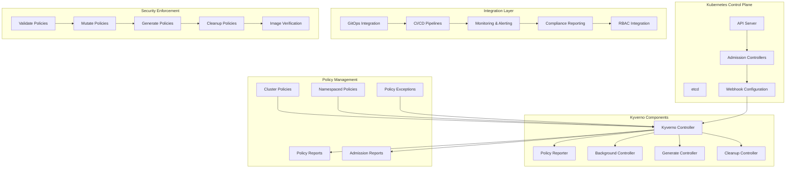

# Kyverno Enterprise Policy Management 深度实践

> **Author**: Cloud Native Security Architect | **Version**: v1.0 | **Update Time**: 2026-02-07
> **Scenario**: Enterprise-grade Kubernetes policy management and security enforcement | **Complexity**: ⭐⭐⭐⭐

## 🎯 Abstract

This document provides comprehensive exploration of Kyverno enterprise deployment architecture, policy management practices, and security enforcement mechanisms. Based on large-scale production environment experience, it offers complete technical guidance from policy design to admission control, helping enterprises build unified, declarative security policy management platforms with GitOps integration and compliance automation capabilities.

## 1. Kyverno Enterprise Architecture

### 1.1 Core Component Architecture



### 1.2 Enterprise Deployment Architecture

```yaml
kyverno_enterprise_deployment:
  control_plane:
    kubernetes_version: "1.25+"
    kyverno_version: "v1.11.0"
    
    deployment:
      replicas: 3
      resources:
        requests:
          cpu: "100m"
          memory: "256Mi"
        limits:
          cpu: "500m"
          memory: "1Gi"
      
      affinity:
        podAntiAffinity:
          preferredDuringSchedulingIgnoredDuringExecution:
            - weight: 100
              podAffinityTerm:
                labelSelector:
                  matchLabels:
                    app.kubernetes.io/name: kyverno
                topologyKey: kubernetes.io/hostname
    
    configuration:
      enablePolicyException: true
      enableReporting: true
      backgroundScan: true
      backgroundScanInterval: "1h"
      admissionReports: true
      aggregateReports: true
  
  high_availability:
    webhooks:
      timeoutSeconds: 10
      failurePolicy: Fail
      matchPolicy: Equivalent
      reinvocationPolicy: Never
    
    certificates:
      caBundle: "base64-encoded-ca-bundle"
      secretName: "kyverno-svc.kyverno.svc"
    
    monitoring:
      prometheus:
        enabled: true
        serviceMonitor:
          enabled: true
          interval: "30s"
```

## 2. Advanced Policy Management

### 2.1 Security Policy Examples

```yaml
# security_policies.yaml
apiVersion: kyverno.io/v1
kind: ClusterPolicy
metadata:
  name: restrict-image-registries
  annotations:
    policies.kyverno.io/title: Restrict Image Registries
    policies.kyverno.io/category: Security
    policies.kyverno.io/severity: high
    policies.kyverno.io/subject: Pod
spec:
  validationFailureAction: Enforce
  background: true
  rules:
    - name: validate-registries
      match:
        any:
        - resources:
            kinds:
              - Pod
      validate:
        message: "Images must come from approved registries"
        pattern:
          spec:
            containers:
              - image: "registry.company.com/* | harbor.company.com/* | gcr.io/*"

---
apiVersion: kyverno.io/v1
kind: ClusterPolicy
metadata:
  name: require-pod-probes
  annotations:
    policies.kyverno.io/title: Require Pod Probes
    policies.kyverno.io/category: Best Practices
    policies.kyverno.io/severity: medium
spec:
  validationFailureAction: Audit
  background: true
  rules:
    - name: validate-liveness-readiness
      match:
        any:
        - resources:
            kinds:
              - Pod
      validate:
        message: "Liveness and readiness probes are required"
        pattern:
          spec:
            containers:
              - livenessProbe:
                  periodSeconds: ">0"
                readinessProbe:
                  periodSeconds: ">0"

---
apiVersion: kyverno.io/v1
kind: ClusterPolicy
metadata:
  name: restrict-host-path
  annotations:
    policies.kyverno.io/title: Restrict Host Path
    policies.kyverno.io/category: Security
    policies.kyverno.io/severity: high
spec:
  validationFailureAction: Enforce
  background: true
  rules:
    - name: validate-host-path
      match:
        any:
        - resources:
            kinds:
              - Pod
      validate:
        message: "HostPath volumes are not allowed"
        pattern:
          spec:
            =(volumes):
              - X(hostPath): "null"
```

### 2.2 Mutation Policies

```yaml
# mutation_policies.yaml
apiVersion: kyverno.io/v1
kind: ClusterPolicy
metadata:
  name: add-security-context
  annotations:
    policies.kyverno.io/title: Add Security Context
    policies.kyverno.io/category: Security
    policies.kyverno.io/severity: medium
spec:
  rules:
    - name: add-default-security-context
      match:
        any:
        - resources:
            kinds:
              - Pod
      mutate:
        patchStrategicMerge:
          spec:
            securityContext:
              runAsNonRoot: true
              runAsUser: 1000
              fsGroup: 2000

---
apiVersion: kyverno.io/v1
kind: ClusterPolicy
metadata:
  name: add-labels
  annotations:
    policies.kyverno.io/title: Add Standard Labels
    policies.kyverno.io/category: Metadata
    policies.kyverno.io/severity: low
spec:
  rules:
    - name: add-team-label
      match:
        any:
        - resources:
            kinds:
              - Deployment
              - StatefulSet
              - DaemonSet
      mutate:
        patchStrategicMerge:
          metadata:
            labels:
              +(team): "{{request.object.metadata.namespace}}"
              +(environment): "{{request.object.metadata.namespace}}"
```

## 3. GitOps Integration

### 3.1 Argo CD Integration

```yaml
# argo_kyverno_application.yaml
apiVersion: argoproj.io/v1alpha1
kind: Application
metadata:
  name: kyverno-policies
  namespace: argocd
spec:
  project: default
  source:
    repoURL: https://github.com/company/kubernetes-policies.git
    targetRevision: HEAD
    path: policies/kyverno
    directory:
      recurse: true
      jsonnet:
        extVars:
          - name: environment
            value: production
  destination:
    server: https://kubernetes.default.svc
    namespace: kyverno
  syncPolicy:
    automated:
      prune: true
      selfHeal: true
    syncOptions:
      - CreateNamespace=true
      - ApplyOutOfSyncOnly=true
      - RespectIgnoreDifferences=true
  ignoreDifferences:
    - group: kyverno.io
      kind: ClusterPolicyReport
      jsonPointers:
        - /status
```

### 3.2 Policy as Code Workflow

```yaml
# .github/workflows/kyverno-policy-validation.yml
name: Kyverno Policy Validation

on:
  pull_request:
    branches: [ main, develop ]
    paths:
      - 'policies/kyverno/**'

jobs:
  validate-policies:
    runs-on: ubuntu-latest
    steps:
      - uses: actions/checkout@v4
      
      - name: Setup Kyverno CLI
        run: |
          curl -s https://raw.githubusercontent.com/kyverno/kyverno/main/hack/install-cli.sh | bash
          
      - name: Validate Policy Syntax
        run: |
          kyverno validate policies/kyverno/
          
      - name: Test Policies Against Resources
        run: |
          kyverno test policies/kyverno/test/ --manifests policies/kyverno/test/resources/
          
      - name: Apply Policies to Test Cluster
        run: |
          kind create cluster --name test-cluster
          kubectl apply -f policies/kyverno/
          # Test policy enforcement
          kubectl run test-pod --image=nginx:latest && echo "Policy enforcement failed" && exit 1
```

## 4. Compliance and Reporting

### 4.1 Compliance Policy Sets

```yaml
# compliance_policies.yaml
apiVersion: kyverno.io/v1
kind: ClusterPolicy
metadata:
  name: pci-dss-compliance
  annotations:
    policies.kyverno.io/title: PCI DSS Compliance
    policies.kyverno.io/category: Compliance
    policies.kyverno.io/severity: high
spec:
  validationFailureAction: Audit
  background: true
  rules:
    - name: require-network-policies
      match:
        any:
        - resources:
            kinds:
              - Namespace
      validate:
        message: "Network policies are required for PCI DSS compliance"
        deny:
          conditions:
            any:
            - key: "{{ request.object.metadata.name }}"
              operator: NotEquals
              value: "kube-system"
            - key: "{{ request.object.metadata.name }}"
              operator: NotEquals
              value: "kyverno"

---
apiVersion: kyverno.io/v1
kind: ClusterPolicy
metadata:
  name: hipaa-compliance
  annotations:
    policies.kyverno.io/title: HIPAA Compliance
    policies.kyverno.io/category: Compliance
    policies.kyverno.io/severity: high
spec:
  validationFailureAction: Enforce
  background: true
  rules:
    - name: encrypt-secrets
      match:
        any:
        - resources:
            kinds:
              - Secret
      validate:
        message: "Secrets must be encrypted at rest"
        pattern:
          metadata:
            annotations:
              encryption-at-rest: "enabled"
```

### 4.2 Policy Reporting and Analytics

```yaml
# policy_report_dashboard.yaml
apiVersion: v1
kind: ConfigMap
metadata:
  name: kyverno-dashboard
  namespace: monitoring
data:
  dashboard.json: |
    {
      "dashboard": {
        "title": "Kyverno Policy Compliance",
        "panels": [
          {
            "title": "Policy Violations by Severity",
            "type": "piechart",
            "targets": [
              {
                "expr": "count by (policy, severity) (kyverno_policy_results_total{result=\"fail\"})"
              }
            ]
          },
          {
            "title": "Policy Enforcement Rate",
            "type": "graph",
            "targets": [
              {
                "expr": "rate(kyverno_admission_requests_total[5m])",
                "legendFormat": "Total Requests"
              },
              {
                "expr": "rate(kyverno_admission_requests_total{allowed=\"true\"}[5m])",
                "legendFormat": "Allowed Requests"
              }
            ]
          }
        ]
      }
    }
```

## 5. Advanced Security Features

### 5.1 Image Verification

```yaml
# image_verification.yaml
apiVersion: kyverno.io/v1
kind: ClusterPolicy
metadata:
  name: verify-image-signatures
  annotations:
    policies.kyverno.io/title: Verify Image Signatures
    policies.kyverno.io/category: Security
    policies.kyverno.io/severity: high
spec:
  validationFailureAction: Enforce
  background: false
  webhookTimeoutSeconds: 30
  failurePolicy: Fail
  rules:
    - name: check-image-signature
      match:
        any:
        - resources:
            kinds:
              - Pod
      verifyImages:
        - imageReferences:
            - "*"
          mutateDigest: true
          attestors:
            - entries:
                - keyless:
                    subject: "https://github.com/company/*"
                    issuer: "https://token.actions.githubusercontent.com"
                    rekor:
                      url: https://rekor.sigstore.dev
```

### 5.2 Resource Quota Management

```yaml
# resource_quota_policies.yaml
apiVersion: kyverno.io/v1
kind: ClusterPolicy
metadata:
  name: enforce-resource-quotas
  annotations:
    policies.kyverno.io/title: Enforce Resource Quotas
    policies.kyverno.io/category: Resource Management
    policies.kyverno.io/severity: medium
spec:
  validationFailureAction: Enforce
  background: true
  rules:
    - name: validate-resource-requests
      match:
        any:
        - resources:
            kinds:
              - Pod
      validate:
        message: "Resource requests and limits are required"
        pattern:
          spec:
            containers:
              - resources:
                  requests:
                    memory: "?*"
                    cpu: "?*"
                  limits:
                    memory: "?*"
                    cpu: "?*"
```

## 6. Monitoring and Alerting

### 6.1 Prometheus Integration

```yaml
# kyverno_monitoring.yaml
apiVersion: monitoring.coreos.com/v1
kind: ServiceMonitor
metadata:
  name: kyverno-metrics
  namespace: kyverno
  labels:
    app: kyverno
spec:
  selector:
    matchLabels:
      app.kubernetes.io/name: kyverno
  namespaceSelector:
    matchNames:
      - kyverno
  endpoints:
    - port: metrics
      interval: 30s
      path: /metrics
      relabelings:
        - sourceLabels: [__meta_kubernetes_pod_name]
          targetLabel: pod
        - sourceLabels: [__meta_kubernetes_namespace]
          targetLabel: namespace

---
apiVersion: v1
kind: Service
metadata:
  name: kyverno-metrics
  namespace: kyverno
  labels:
    app: kyverno
spec:
  selector:
    app.kubernetes.io/name: kyverno
  ports:
    - name: metrics
      port: 8000
      targetPort: 8000
      protocol: TCP
```

### 6.2 Alerting Rules

```yaml
# alerting_rules.yaml
apiVersion: monitoring.coreos.com/v1
kind: PrometheusRule
metadata:
  name: kyverno-alerts
  namespace: kyverno
spec:
  groups:
    - name: kyverno.rules
      rules:
        - alert: KyvernoControllerDown
          expr: up{job="kyverno"} == 0
          for: 5m
          labels:
            severity: critical
          annotations:
            summary: "Kyverno controller is down"
            description: "Kyverno controller has been down for more than 5 minutes"
            
        - alert: HighPolicyViolationRate
          expr: rate(kyverno_policy_results_total{result="fail"}[5m]) > 10
          for: 2m
          labels:
            severity: warning
          annotations:
            summary: "High policy violation rate detected"
            description: "Policy violations are occurring at a high rate: {{ $value }} per second"
            
        - alert: KyvernoWebhookLatencyHigh
          expr: histogram_quantile(0.95, rate(kyverno_admission_review_duration_seconds_bucket[5m])) > 2
          for: 5m
          labels:
            severity: warning
          annotations:
            summary: "Kyverno webhook latency is high"
            description: "95th percentile admission webhook latency is above 2 seconds"
```

## 7. Policy Exception Management

### 7.1 Exception Handling

```yaml
# policy_exceptions.yaml
apiVersion: kyverno.io/v1
kind: PolicyException
metadata:
  name: development-exceptions
  namespace: development
spec:
  background: true
  match:
    any:
      - resources:
          kinds:
            - Pod
          namespaces:
            - development
  exceptions:
    - policyName: restrict-host-path
      ruleNames:
        - validate-host-path
    - policyName: require-pod-probes
      ruleNames:
        - validate-liveness-readiness
```

### 7.2 RBAC Configuration

```yaml
# kyverno_rbac.yaml
apiVersion: rbac.authorization.k8s.io/v1
kind: ClusterRole
metadata:
  name: kyverno-policy-admin
rules:
  - apiGroups:
      - kyverno.io
    resources:
      - clusterpolicies
      - policies
      - policyexceptions
      - updaterequests
    verbs:
      - get
      - list
      - watch
      - create
      - update
      - delete
  - apiGroups:
      - kyverno.io
    resources:
      - clusterpolicyreports
      - policyreports
    verbs:
      - get
      - list
      - watch

---
apiVersion: rbac.authorization.k8s.io/v1
kind: ClusterRoleBinding
metadata:
  name: kyverno-policy-admin-binding
subjects:
  - kind: User
    name: security-team
    apiGroup: rbac.authorization.k8s.io
roleRef:
  kind: ClusterRole
  name: kyverno-policy-admin
  apiGroup: rbac.authorization.k8s.io
```

---
*This document is based on enterprise-level Kyverno policy management practice experience and continuously updated with the latest technologies and best practices.*