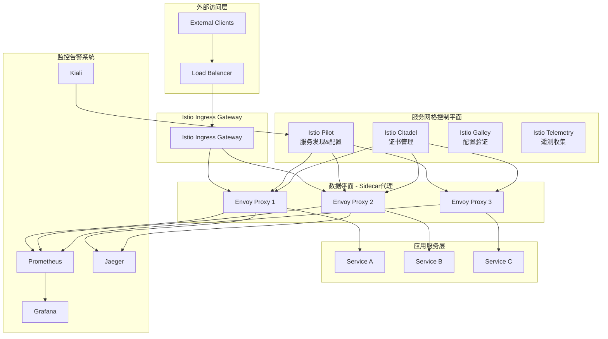

# Istio 企业级服务网格架构与实践

## 概述 (Overview)

Istio 是业界领先的开源服务网格平台，为企业级微服务架构提供流量管理、安全控制、可观察性和策略执行等核心能力。本文档从生产环境运维专家角度，深入探讨 Istio 的企业级部署架构、性能优化和运维管理最佳实践。

Istio is the industry-leading open-source service mesh platform that provides core capabilities including traffic management, security control, observability, and policy enforcement for enterprise microservice architectures. This document explores Istio's enterprise deployment architecture, performance optimization, and operational management best practices from a production environment operations expert perspective.

## 架构设计 (Architecture Design)

### 企业级部署架构 (Enterprise Deployment Architecture)

```yaml
# Istio 控制平面高可用部署
apiVersion: install.istio.io/v1alpha1
kind: IstioOperator
metadata:
  name: istio-controlplane
  namespace: istio-system
spec:
  profile: demo
  components:
    pilot:
      enabled: true
      k8s:
        resources:
          requests:
            cpu: "500m"
            memory: "2Gi"
          limits:
            cpu: "1"
            memory: "4Gi"
        replicaCount: 3
        nodeSelector:
          kubernetes.io/arch: amd64
        tolerations:
        - key: "dedicated"
          operator: "Equal"
          value: "istio"
          effect: "NoSchedule"
        
    ingressGateways:
    - name: istio-ingressgateway
      enabled: true
      k8s:
        resources:
          requests:
            cpu: "100m"
            memory: "128Mi"
          limits:
            cpu: "2"
            memory: "1Gi"
        replicaCount: 3
        service:
          ports:
          - port: 80
            targetPort: 8080
            name: http2
          - port: 443
            targetPort: 8443
            name: https
          
    egressGateways:
    - name: istio-egressgateway
      enabled: true
      k8s:
        resources:
          requests:
            cpu: "100m"
            memory: "128Mi"
          limits:
            cpu: "2"
            memory: "1Gi"
        replicaCount: 2

  values:
    global:
      proxy:
        resources:
          requests:
            cpu: "100m"
            memory: "128Mi"
          limits:
            cpu: "2"
            memory: "1Gi"
      
    pilot:
      autoscaleEnabled: true
      autoscaleMin: 3
      autoscaleMax: 10
      traceSampling: 100.0
      
    gateways:
      istio-ingressgateway:
        autoscaleEnabled: true
        autoscaleMin: 3
        autoscaleMax: 10
```

### 服务网格架构图 (Service Mesh Architecture Diagram)



## 核心功能配置 (Core Functionality Configuration)

### 流量管理 (Traffic Management)

```yaml
# 虚拟服务配置 - 流量路由规则
apiVersion: networking.istio.io/v1alpha3
kind: VirtualService
metadata:
  name: bookinfo
  namespace: default
spec:
  hosts:
  - bookinfo.example.com
  gateways:
  - bookinfo-gateway
  http:
  - match:
    - uri:
        prefix: /productpage
    - uri:
        prefix: /static
    - uri:
        prefix: /login
    - uri:
        prefix: /logout
    - uri:
        prefix: /api/v1/products
    route:
    - destination:
        host: productpage
        port:
          number: 9080
  - match:
    - uri:
        prefix: /reviews
    route:
    - destination:
        host: reviews
        port:
          number: 9080
        subset: v2
    retries:
      attempts: 3
      perTryTimeout: 2s
    timeout: 5s
    fault:
      delay:
        percentage:
          value: 0.1
        fixedDelay: 5s
```

### 目标规则配置 (Destination Rule Configuration)

```yaml
# 目标规则 - 负载均衡和服务子集
apiVersion: networking.istio.io/v1alpha3
kind: DestinationRule
metadata:
  name: reviews
  namespace: default
spec:
  host: reviews
  trafficPolicy:
    loadBalancer:
      simple: LEAST_CONN
    connectionPool:
      tcp:
        maxConnections: 100
      http:
        http1MaxPendingRequests: 1000
        maxRequestsPerConnection: 10
    outlierDetection:
      consecutive5xxErrors: 7
      interval: 5s
      baseEjectionTime: 15s
  subsets:
  - name: v1
    labels:
      version: v1
    trafficPolicy:
      loadBalancer:
        simple: ROUND_ROBIN
  - name: v2
    labels:
      version: v2
    trafficPolicy:
      loadBalancer:
        simple: LEAST_REQUEST
```

### 安全配置 (Security Configuration)

```yaml
# PeerAuthentication - mTLS配置
apiVersion: security.istio.io/v1beta1
kind: PeerAuthentication
metadata:
  name: default
  namespace: istio-system
spec:
  mtls:
    mode: STRICT

---
# AuthorizationPolicy - 授权策略
apiVersion: security.istio.io/v1beta1
kind: AuthorizationPolicy
metadata:
  name: allow-nothing
  namespace: default
spec:
  action: ALLOW
  rules:
  - from:
    - source:
        principals: ["cluster.local/ns/istio-system/sa/istio-ingressgateway-service-account"]
    to:
    - operation:
        methods: ["GET", "POST", "PUT", "DELETE"]
        paths: ["/api/*"]
    when:
    - key: request.headers[x-api-key]
      values: ["valid-api-key"]
```

## 性能优化 (Performance Optimization)

### 资源调优配置 (Resource Tuning Configuration)

```yaml
# Envoy代理性能调优
apiVersion: v1
kind: ConfigMap
metadata:
  name: istio-proxy-config
  namespace: istio-system
data:
  envoy.yaml: |
    static_resources:
      listeners:
      - name: virtualInbound
        address:
          socket_address:
            address: 0.0.0.0
            port_value: 15006
        filter_chains:
        - filters:
          - name: envoy.filters.network.http_connection_manager
            typed_config:
              "@type": type.googleapis.com/envoy.extensions.filters.network.http_connection_manager.v3.HttpConnectionManager
              stat_prefix: inbound_http
              route_config:
                name: local_route
              http_filters:
              - name: envoy.filters.http.router
                typed_config:
                  "@type": type.googleapis.com/envoy.extensions.filters.http.router.v3.Router
              stream_idle_timeout: 5s
              request_timeout: 15s
              drain_timeout: 45s
              
    admin:
      access_log_path: /dev/null
      address:
        socket_address:
          address: 127.0.0.1
          port_value: 15000
```

### 监控告警配置 (Monitoring and Alerting Configuration)

```yaml
# Prometheus告警规则
apiVersion: monitoring.coreos.com/v1
kind: PrometheusRule
metadata:
  name: istio-rules
  namespace: istio-system
spec:
  groups:
  - name: istio.rules
    rules:
    - alert: IstioComponentDown
      expr: up{job=~"istiod|istio-proxy"} == 0
      for: 5m
      labels:
        severity: critical
      annotations:
        summary: "Istio component is down"
        description: "{{ $labels.instance }} of job {{ $labels.job }} has been down for more than 5 minutes."
        
    - alert: HighRequestLatency
      expr: histogram_quantile(0.99, rate(istio_request_duration_milliseconds_bucket[1m])) > 1000
      for: 2m
      labels:
        severity: warning
      annotations:
        summary: "High request latency"
        description: "99th percentile request latency is above 1 second"
        
    - alert: HighErrorRate
      expr: rate(istio_requests_total{response_code=~"5.."}[1m]) / rate(istio_requests_total[1m]) > 0.05
      for: 2m
      labels:
        severity: warning
      annotations:
        summary: "High error rate"
        description: "Error rate is above 5%"
```

## 运维管理 (Operational Management)

### 故障排查命令 (Troubleshooting Commands)

```bash
#!/bin/bash
# Istio故障排查工具脚本

# 检查Istio组件状态
echo "=== Checking Istio Component Status ==="
kubectl get pods -n istio-system
echo ""

# 检查sidecar注入状态
echo "=== Checking Sidecar Injection Status ==="
kubectl get mutatingwebhookconfiguration istio-sidecar-injector
echo ""

# 查看Istio配置
echo "=== Viewing Istio Configuration ==="
istioctl proxy-status
echo ""

# 检查服务网格连通性
echo "=== Checking Service Mesh Connectivity ==="
istioctl proxy-config cluster deployment/productpage-v1
echo ""

# 查看流量路由配置
echo "=== Viewing Traffic Routing Configuration ==="
kubectl get virtualservices -A
kubectl get destinationrules -A
echo ""

# 性能监控
echo "=== Performance Monitoring ==="
kubectl top pods -n istio-system
echo ""

# 日志分析
echo "=== Log Analysis ==="
kubectl logs -n istio-system -l app=istiod --tail=100 | grep -i error
```

### 日常运维检查清单 (Daily Operations Checklist)

```markdown
## Istio日常运维检查清单

### 每日检查项
- [ ] 检查istiod控制平面Pod状态
- [ ] 检查ingress gateway Pod状态  
- [ ] 检查所有应用Pod的sidecar状态
- [ ] 查看关键服务的请求成功率
- [ ] 监控服务网格延迟指标
- [ ] 检查证书有效期
- [ ] 审计安全策略变更

### 每周检查项
- [ ] 分析流量模式变化
- [ ] 评估资源使用情况
- [ ] 审查配置变更历史
- [ ] 更新安全策略
- [ ] 备份关键配置

### 每月检查项
- [ ] 性能基准测试
- [ ] 安全漏洞扫描
- [ ] 版本兼容性检查
- [ ] 灾备演练
- [ ] 文档更新
```

## 最佳实践 (Best Practices)

### 部署最佳实践 (Deployment Best Practices)

1. **渐进式部署**
   - 先在测试环境验证配置
   - 逐步扩大到生产环境
   - 使用金丝雀发布策略

2. **资源配置优化**
   ```yaml
   resources:
     requests:
       cpu: "100m"
       memory: "128Mi"
     limits:
       cpu: "500m"
       memory: "512Mi"
   ```

3. **安全加固**
   - 启用严格的mTLS
   - 实施最小权限原则
   - 定期轮换证书

### 运维最佳实践 (Operations Best Practices)

1. **监控覆盖**
   - 端到端延迟监控
   - 错误率跟踪
   - 资源使用率监控

2. **故障恢复**
   - 建立标准化故障处理流程
   - 准备回滚预案
   - 定期演练应急响应

3. **变更管理**
   - 严格的变更审批流程
   - 自动化测试验证
   - 渐进式发布策略

---

**文档版本**: v1.0  
**最后更新**: 2024年2月7日  
**适用版本**: Istio 1.16+