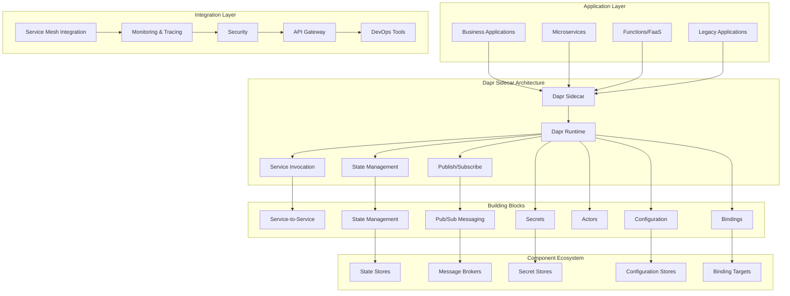

# Dapr (Distributed Application Runtime) Enterprise 深度实践

> **Author**: Microservices Platform Architect | **Version**: v1.0 | **Update Time**: 2026-02-07
> **Scenario**: Enterprise-grade distributed application runtime and microservices platform | **Complexity**: ⭐⭐⭐⭐

## 🎯 Abstract

This document provides comprehensive exploration of Dapr enterprise deployment architecture, microservices patterns implementation, and distributed system management. Based on large-scale production environment experience, it offers complete technical guidance from runtime setup to service mesh integration, helping enterprises build portable, cloud-native microservices applications with unified APIs and runtime capabilities across hybrid environments.

## 1. Dapr Enterprise Architecture

### 1.1 Core Component Architecture



### 1.2 Enterprise Deployment Architecture

```yaml
dapr_enterprise_deployment:
  kubernetes_mode:
    namespace_isolation:
      - name: "production-apps"
        dapr_enabled: true
        sidecar_limits:
          cpu: "100m"
          memory: "256Mi"
        placement_service:
          replicas: 3
          resources:
            requests:
              cpu: "50m"
              memory: "128Mi"
            
      - name: "development-apps"
        dapr_enabled: true
        sidecar_limits:
          cpu: "50m"
          memory: "128Mi"
        placement_service:
          replicas: 1
          resources:
            requests:
              cpu: "25m"
              memory: "64Mi"
    
    control_plane:
      operator:
        replicas: 2
        resources:
          requests:
            cpu: "50m"
            memory: "128Mi"
          limits:
            cpu: "200m"
            memory: "512Mi"
      
      injector:
        replicas: 2
        resources:
          requests:
            cpu: "50m"
            memory: "128Mi"
          limits:
            cpu: "200m"
            memory: "512Mi"
      
      placement:
        replicas: 3
        resources:
          requests:
            cpu: "100m"
            memory: "256Mi"
          limits:
            cpu: "300m"
            memory: "1Gi"
      
      sentry:
        replicas: 2
        resources:
          requests:
            cpu: "50m"
            memory: "128Mi"
          limits:
            cpu: "200m"
            memory: "512Mi"
  
  security_configuration:
    mtls:
      enabled: true
      workload_cert_ttl: "24h"
      allowed_clock_skew: "15m"
    
    authentication:
      token_audience: "dapr-api"
      jwt_issuer: "https://auth.company.com"
    
    authorization:
      rbac_enabled: true
      policy_engine: "opa"
```

## 2. Advanced Service Invocation Patterns

### 2.1 Service-to-Service Communication

```yaml
# service_invocation_config.yaml
apiVersion: dapr.io/v1alpha1
kind: Configuration
metadata:
  name: service-invocation-config
  namespace: production
spec:
  tracing:
    samplingRate: "1"
    zipkin:
      endpointAddress: "http://zipkin.default.svc.cluster.local:9411/api/v2/spans"
  mtls:
    enabled: true
  accessControl:
    defaultAction: allow
    trustDomain: "company.com"
    policies:
      - appId: order-service
        defaultAction: deny
        trustDomain: '*'
        namespace: "production"
        operations:
          - name: "/checkout"
            httpVerb: ["POST"]
            action: allow
          - name: "/cancel"
            httpVerb: ["POST"]
            action: allow
```

```go
// Go service invocation example
package main

import (
    "context"
    "log"
    "net/http"
    "github.com/dapr/go-sdk/service/common"
    daprd "github.com/dapr/go-sdk/service/http"
)

func main() {
    s := daprd.NewService(":8080")
    
    // 服务调用处理函数
    if err := s.AddServiceInvocationHandler("/process-order", processOrderHandler); err != nil {
        log.Fatalf("error adding invocation handler: %v", err)
    }
    
    // 启动服务
    if err := s.Start(); err != nil && err != http.ErrServerClosed {
        log.Fatalf("error listening: %v", err)
    }
}

func processOrderHandler(ctx context.Context, in *common.InvocationEvent) (*common.Content, error) {
    // 处理订单逻辑
    log.Printf("Processing order: %s", string(in.Data))
    
    // 调用库存服务
    resp, err := http.Get("http://localhost:3500/v1.0/invoke/inventory-service/method/check-stock")
    if err != nil {
        return nil, err
    }
    defer resp.Body.Close()
    
    // 返回处理结果
    return &common.Content{
        Data:        []byte("Order processed successfully"),
        ContentType: "text/plain",
    }, nil
}
```

### 2.2 Resiliency Configuration

```yaml
# resiliency_config.yaml
apiVersion: dapr.io/v1alpha1
kind: Resiliency
metadata:
  name: app-resiliency
  namespace: production
spec:
  policies:
    timeouts:
      general: 5s
      critical: 30s
    
    retries:
      general:
        policy: constant
        duration: 5s
        maxRetries: 3
      
      exponential:
        policy: exponential
        maxInterval: 60s
        maxRetries: 3
    
    circuitBreakers:
      simpleCB:
        maxRequests: 1
        timeout: 60s
        trip: consecutiveFailures >= 5
    
  targets:
    apps:
      inventory-service:
        timeout: general
        retry: exponential
        circuitBreaker: simpleCB
      
      payment-service:
        timeout: critical
        retry: general
        circuitBreaker: simpleCB
    
    components:
      redis-statestore:
        outbound:
          timeout: general
          retry: exponential
        inbound:
          timeout: general
          retry: general
```

## 3. State Management and Data Patterns

### 3.1 Multi-State Store Configuration

```yaml
# state_store_config.yaml
apiVersion: dapr.io/v1alpha1
kind: Component
metadata:
  name: production-statestore
  namespace: production
spec:
  type: state.redis
  version: v1
  metadata:
    - name: redisHost
      value: "redis-master.production.svc.cluster.local:6379"
    - name: redisPassword
      secretKeyRef:
        name: redis-secret
        key: password
    - name: actorStateStore
      value: "true"
    - name: redisType
      value: "cluster"
    - name: enableTLS
      value: "true"
    - name: failover
      value: "true"

---
apiVersion: dapr.io/v1alpha1
kind: Component
metadata:
  name: user-session-store
  namespace: production
spec:
  type: state.mongodb
  version: v1
  metadata:
    - name: host
      value: "mongodb.production.svc.cluster.local:27017"
    - name: username
      secretKeyRef:
        name: mongodb-secret
        key: username
    - name: password
      secretKeyRef:
        name: mongodb-secret
        key: password
    - name: databaseName
      value: "user_sessions"
    - name: collectionName
      value: "sessions"
```

### 3.2 Actor Pattern Implementation

```csharp
// C# Actor implementation
using Dapr.Actors;
using Dapr.Actors.Runtime;
using System.Threading.Tasks;

[Actor(TypeName = "OrderActor")]
public class OrderActor : Actor, IOrderActor
{
    public OrderActor(ActorHost host) : base(host)
    {
    }

    public async Task<Order> GetOrderAsync(string orderId)
    {
        // 从状态存储获取订单
        return await this.StateManager.GetStateAsync<Order>("order");
    }

    public async Task UpdateOrderStatusAsync(string status)
    {
        var order = await this.StateManager.GetStateAsync<Order>("order");
        order.Status = status;
        
        // 更新状态
        await this.StateManager.SetStateAsync("order", order);
        
        // 发布状态变更事件
        await this.ActorProxyFactory.CreateActorProxy<IEventPublisherActor>(
            new ActorId(order.Id), "EventPublisherActor")
            .PublishEventAsync("order-status-changed", new { OrderId = order.Id, Status = status });
    }

    public async Task<decimal> CalculateTotalAsync()
    {
        var order = await this.StateManager.GetStateAsync<Order>("order");
        return order.Items.Sum(item => item.Price * item.Quantity);
    }
}

public interface IOrderActor : IActor
{
    Task<Order> GetOrderAsync(string orderId);
    Task UpdateOrderStatusAsync(string status);
    Task<decimal> CalculateTotalAsync();
}
```

## 4. Pub/Sub Messaging Patterns

### 4.1 Advanced Pub/Sub Configuration

```yaml
# pubsub_component.yaml
apiVersion: dapr.io/v1alpha1
kind: Component
metadata:
  name: production-pubsub
  namespace: production
spec:
  type: pubsub.rabbitmq
  version: v1
  metadata:
    - name: host
      value: "amqp://rabbitmq.production.svc.cluster.local:5672"
    - name: username
      secretKeyRef:
        name: rabbitmq-secret
        key: username
    - name: password
      secretKeyRef:
        name: rabbitmq-secret
        key: password
    - name: durable
      value: "true"
    - name: deletedWhenUnused
      value: "false"
    - name: autoAck
      value: "false"
    - name: requeueInFailure
      value: "true"
    - name: prefetchCount
      value: "1"
    - name: reconnectWait
      value: "5s"

---
apiVersion: dapr.io/v1alpha1
kind: Subscription
metadata:
  name: order-processing-subscription
  namespace: production
spec:
  topic: orders
  route: /orders/process
  pubsubname: production-pubsub
  metadata:
    - name: deadLetterTopic
      value: orders-deadletter
    - name: maxDeliveryCount
      value: "3"
    - name: ackWaitTime
      value: "30s"
```

### 4.2 Event-Driven Architecture Implementation

```python
# Python event-driven service
import flask
from dapr.clients import DaprClient
import json
import logging

app = flask.Flask(__name__)
logging.basicConfig(level=logging.INFO)

@app.route('/orders/process', methods=['POST'])
def process_order():
    try:
        # 获取订单数据
        order_data = flask.request.get_json()
        logging.info(f"Processing order: {order_data['orderId']}")
        
        # 验证库存
        with DaprClient() as client:
            # 调用库存服务
            inventory_response = client.invoke_method(
                'inventory-service',
                'check-stock',
                json.dumps({"productId": order_data['productId'], "quantity": order_data['quantity']})
            )
            
            inventory_result = json.loads(inventory_response.data)
            
            if not inventory_result['available']:
                # 发布库存不足事件
                client.publish_event(
                    pubsub_name='production-pubsub',
                    topic_name='inventory-shortage',
                    data=json.dumps({
                        'orderId': order_data['orderId'],
                        'productId': order_data['productId'],
                        'required': order_data['quantity'],
                        'available': inventory_result['availableQuantity']
                    })
                )
                return {'status': 'inventory_shortage'}, 400
            
            # 处理支付
            payment_response = client.invoke_method(
                'payment-service',
                'process-payment',
                json.dumps({
                    'orderId': order_data['orderId'],
                    'amount': order_data['totalAmount'],
                    'paymentMethod': order_data['paymentMethod']
                })
            )
            
            payment_result = json.loads(payment_response.data)
            
            if payment_result['status'] == 'success':
                # 更新订单状态
                client.invoke_method(
                    'order-service',
                    'update-status',
                    json.dumps({
                        'orderId': order_data['orderId'],
                        'status': 'confirmed'
                    })
                )
                
                # 发布订单确认事件
                client.publish_event(
                    pubsub_name='production-pubsub',
                    topic_name='order-confirmed',
                    data=json.dumps({
                        'orderId': order_data['orderId'],
                        'customerId': order_data['customerId']
                    })
                )
                
                return {'status': 'order_confirmed'}, 200
            else:
                return {'status': 'payment_failed'}, 400
                
    except Exception as e:
        logging.error(f"Error processing order: {str(e)}")
        return {'error': str(e)}, 500

if __name__ == '__main__':
    app.run(host='0.0.0.0', port=8080)
```

## 5. Observability and Monitoring

### 5.1 Distributed Tracing Configuration

```yaml
# tracing_config.yaml
apiVersion: dapr.io/v1alpha1
kind: Configuration
metadata:
  name: tracing-config
  namespace: production
spec:
  tracing:
    samplingRate: "1"
    otel:
      endpointAddress: "http://otel-collector.monitoring.svc.cluster.local:4317"
      isSecure: false
      protocol: "grpc"
    zipkin:
      endpointAddress: "http://zipkin.monitoring.svc.cluster.local:9411/api/v2/spans"
    stdout:
      enabled: true

---
apiVersion: dapr.io/v1alpha1
kind: Component
metadata:
  name: tracing-exporter
  namespace: production
spec:
  type: exporters.tracing.otlp
  version: v1
  metadata:
    - name: endpoint
      value: "otel-collector.monitoring.svc.cluster.local:4317"
    - name: insecure
      value: "true"
    - name: protocol
      value: "grpc"
```

### 5.2 Metrics and Health Monitoring

```yaml
# metrics_config.yaml
apiVersion: dapr.io/v1alpha1
kind: Configuration
metadata:
  name: metrics-config
  namespace: production
spec:
  metric:
    enabled: true
    rules:
      - name: "dapr_runtime_.*"
        enabled: true
      - name: "dapr_component_.*"
        enabled: true
      - name: "dapr_actor_.*"
        enabled: true
  health:
    probeInterval: "5s"
    probeTimeout: "3s"
    probeThreshold: 3
```

```python
# Custom metrics collection
from prometheus_client import Counter, Histogram, generate_latest
from flask import Flask, Response
import time

app = Flask(__name__)

# 自定义指标
order_processing_duration = Histogram('order_processing_duration_seconds', 'Time spent processing orders')
orders_processed_total = Counter('orders_processed_total', 'Total orders processed', ['status'])

@app.route('/metrics')
def metrics():
    return Response(generate_latest(), mimetype='text/plain')

@app.route('/process-order', methods=['POST'])
@order_processing_duration.time()
def process_order():
    start_time = time.time()
    try:
        # 订单处理逻辑
        # ...
        orders_processed_total.labels(status='success').inc()
        return {'status': 'success'}, 200
    except Exception as e:
        orders_processed_total.labels(status='failure').inc()
        return {'error': str(e)}, 500
```

## 6. Security and Compliance

### 6.1 Advanced Security Configuration

```yaml
# security_config.yaml
apiVersion: dapr.io/v1alpha1
kind: Configuration
metadata:
  name: security-config
  namespace: production
spec:
  mtls:
    enabled: true
    workloadCertTTL: "24h"
    allowedClockSkew: "15m"
  
  accessControl:
    defaultAction: deny
    trustDomain: "company.com"
    policies:
      - appId: order-service
        defaultAction: allow
        trustDomain: "company.com"
        namespace: "production"
        operations:
          - name: "/checkout"
            httpVerb: ["POST"]
            action: allow
          - name: "/cancel"
            httpVerb: ["POST"]
            action: allow
          
      - appId: payment-service
        defaultAction: deny
        trustDomain: "company.com"
        namespace: "production"
        operations:
          - name: "/process"
            httpVerb: ["POST"]
            action: allow
            principals: ["order-service"]
```

### 6.2 Secret Management Integration

```yaml
# secret_store.yaml
apiVersion: dapr.io/v1alpha1
kind: Component
metadata:
  name: production-secrets
  namespace: production
spec:
  type: secretstores.azure.keyvault
  version: v1
  metadata:
    - name: vaultName
      value: "company-dapr-vault"
    - name: spnTenantId
      value: "your-tenant-id"
    - name: spnClientId
      value: "your-client-id"
    - name: spnClientSecret
      secretKeyRef:
        name: azure-spn-secret
        key: client-secret

---
# 应用中使用密钥
apiVersion: apps/v1
kind: Deployment
metadata:
  name: order-service
  namespace: production
spec:
  replicas: 3
  selector:
    matchLabels:
      app: order-service
  template:
    metadata:
      labels:
        app: order-service
      annotations:
        dapr.io/enabled: "true"
        dapr.io/app-id: "order-service"
        dapr.io/config: "security-config"
    spec:
      containers:
        - name: order-service
          image: company/order-service:latest
          env:
            - name: DATABASE_CONNECTION_STRING
              valueFrom:
                secretKeyRef:
                  name: production-secrets
                  key: database-connection-string
```

## 7. Multi-Environment Deployment

### 7.1 Environment-Specific Configuration

```yaml
# development_config.yaml
apiVersion: dapr.io/v1alpha1
kind: Configuration
metadata:
  name: dev-config
  namespace: development
spec:
  tracing:
    samplingRate: "0.1"  # 10% 采样率
  mtls:
    enabled: false  # 开发环境禁用mTLS
  metric:
    enabled: true

---
# production_config.yaml
apiVersion: dapr.io/v1alpha1
kind: Configuration
metadata:
  name: prod-config
  namespace: production
spec:
  tracing:
    samplingRate: "1"  # 100% 采样率
  mtls:
    enabled: true
  metric:
    enabled: true
    rules:
      - name: "dapr_runtime_.*"
        enabled: true
```

### 7.2 CI/CD Integration

```yaml
# github_actions_dapr.yml
name: Dapr Application Deployment

on:
  push:
    branches: [ main, develop ]

jobs:
  build-and-deploy:
    runs-on: ubuntu-latest
    steps:
      - uses: actions/checkout@v4
      
      - name: Set up Docker Buildx
        uses: docker/setup-buildx-action@v3
        
      - name: Login to Container Registry
        uses: docker/login-action@v3
        with:
          registry: ghcr.io
          username: ${{ github.actor }}
          password: ${{ secrets.GITHUB_TOKEN }}
      
      - name: Build and push
        uses: docker/build-push-action@v5
        with:
          context: .
          push: true
          tags: ghcr.io/${{ github.repository }}/order-service:${{ github.sha }}
      
      - name: Deploy to Kubernetes
        run: |
          # 设置kubectl上下文
          echo "${{ secrets.KUBECONFIG }}" | base64 -d > kubeconfig
          export KUBECONFIG=./kubeconfig
          
          # 部署应用
          kubectl set image deployment/order-service \
            order-service=ghcr.io/${{ github.repository }}/order-service:${{ github.sha }} \
            -n production
          
          # 等待部署完成
          kubectl rollout status deployment/order-service -n production --timeout=300s
          
          # 验证Dapr sidecar健康状态
          kubectl wait --for=condition=ready pod -l app=order-service -n production --timeout=300s
```

## 8. Performance Optimization

### 8.1 Sidecar Resource Optimization

```yaml
# optimized_sidecar_config.yaml
apiVersion: dapr.io/v1alpha1
kind: Configuration
metadata:
  name: performance-config
  namespace: production
spec:
  features:
    - name: "ActorStateTTL"
      enabled: true
    - name: "PubSubFiltering"
      enabled: true
    - name: "DirectStreaming"
      enabled: true
  
  metric:
    enabled: true
    rules:
      - name: "dapr_runtime_actor_.*"
        enabled: false  # 禁用Actor指标以提高性能
      - name: "dapr_runtime_component_.*"
        enabled: true

---
apiVersion: apps/v1
kind: Deployment
metadata:
  name: optimized-service
  namespace: production
spec:
  template:
    metadata:
      annotations:
        dapr.io/enabled: "true"
        dapr.io/app-id: "optimized-service"
        dapr.io/config: "performance-config"
        dapr.io/sidecar-cpu-limit: "200m"
        dapr.io/sidecar-memory-limit: "512Mi"
        dapr.io/sidecar-cpu-request: "50m"
        dapr.io/sidecar-memory-request: "128Mi"
        dapr.io/sidecar-readiness-probe-delay-seconds: "3"
        dapr.io/sidecar-readiness-probe-timeout-seconds: "3"
        dapr.io/sidecar-readiness-probe-period-seconds: "5"
        dapr.io/sidecar-readiness-probe-threshold: "3"
```

### 8.2 Caching and State Optimization

```python
# Python caching implementation
import redis
import json
from functools import lru_cache
import time

class DaprCache:
    def __init__(self):
        self.redis_client = redis.Redis(
            host='localhost',
            port=6379,
            db=0,
            decode_responses=True
        )
        self.dapr_client = DaprClient()
    
    @lru_cache(maxsize=1000)
    def get_cached_data(self, key, ttl=300):
        """获取缓存数据，支持LRU和Redis双重缓存"""
        # 首先检查内存缓存
        try:
            cached_value = self.redis_client.get(f"cache:{key}")
            if cached_value:
                return json.loads(cached_value)
        except Exception as e:
            print(f"Redis cache error: {e}")
        
        # 从Dapr状态存储获取
        try:
            state_response = self.dapr_client.get_state(
                store_name='production-statestore',
                key=key
            )
            data = json.loads(state_response.data)
            
            # 更新缓存
            self.redis_client.setex(
                f"cache:{key}",
                ttl,
                json.dumps(data)
            )
            
            return data
        except Exception as e:
            print(f"Dapr state error: {e}")
            return None
    
    def set_cached_data(self, key, value, ttl=300):
        """设置缓存数据"""
        try:
            # 更新Dapr状态存储
            self.dapr_client.save_state(
                store_name='production-statestore',
                key=key,
                value=json.dumps(value)
            )
            
            # 更新Redis缓存
            self.redis_client.setex(
                f"cache:{key}",
                ttl,
                json.dumps(value)
            )
            
            # 清除LRU缓存
            self.get_cached_data.cache_clear()
            
        except Exception as e:
            print(f"Cache set error: {e}")

# 使用示例
cache = DaprCache()

# 获取用户信息（自动缓存）
user_data = cache.get_cached_data(f"user:{user_id}")

# 更新用户信息（自动更新缓存）
cache.set_cached_data(f"user:{user_id}", updated_user_data)
```

---
*This document is based on enterprise-level Dapr platform practice experience and continuously updated with the latest technologies and best practices.*