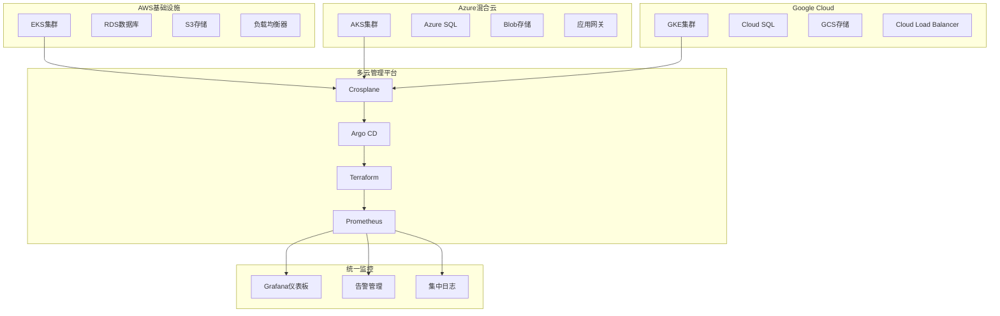

# AWS EKS 企业级多云管理平台

## 概述 (Overview)

Amazon Elastic Kubernetes Service (EKS) 是AWS提供的托管Kubernetes服务，为企业提供高度可扩展、安全可靠的容器编排平台。本文档从生产环境运维专家角度，深入探讨EKS的企业级部署架构、多云管理策略和运维最佳实践。

Amazon Elastic Kubernetes Service (EKS) is AWS's managed Kubernetes service that provides enterprises with a highly scalable, secure, and reliable container orchestration platform. This document explores EKS's enterprise deployment architecture, multi-cloud management strategies, and operational best practices from a production environment operations expert perspective.

## 架构设计 (Architecture Design)

### 企业级EKS集群架构 (Enterprise EKS Cluster Architecture)

```yaml
# EKS 集群基础设施定义
apiVersion: eksctl.io/v1alpha5
kind: ClusterConfig
metadata:
  name: production-eks-cluster
  region: us-west-2
  version: "1.28"

availabilityZones: ["us-west-2a", "us-west-2b", "us-west-2c"]

iam:
  withOIDC: true
  serviceAccounts:
  - metadata:
      name: cluster-autoscaler
      namespace: kube-system
    attachPolicyARNs:
    - "arn:aws:iam::aws:policy/AutoScalingFullAccess"

vpc:
  cidr: "10.0.0.0/16"
  subnets:
    private:
      us-west-2a: { cidr: "10.0.0.0/19" }
      us-west-2b: { cidr: "10.0.32.0/19" }
      us-west-2c: { cidr: "10.0.64.0/19" }
    public:
      us-west-2a: { cidr: "10.0.96.0/19" }
      us-west-2b: { cidr: "10.0.128.0/19" }
      us-west-2c: { cidr: "10.0.160.0/19" }

managedNodeGroups:
  - name: system-ng
    instanceType: m5.large
    desiredCapacity: 3
    minSize: 3
    maxSize: 10
    volumeSize: 50
    volumeType: gp3
    amiFamily: AmazonLinux2
    labels: { role: system }
    tags:
      k8s.io/cluster-autoscaler/enabled: "true"
      k8s.io/cluster-autoscaler/production-eks-cluster: "owned"
      
  - name: application-ng
    instanceType: m5.xlarge
    desiredCapacity: 6
    minSize: 3
    maxSize: 20
    volumeSize: 100
    volumeType: gp3
    amiFamily: AmazonLinux2
    labels: { role: application }
    tags:
      k8s.io/cluster-autoscaler/enabled: "true"
      k8s.io/cluster-autoscaler/production-eks-cluster: "owned"
      
  - name: gpu-ng
    instanceType: g4dn.xlarge
    desiredCapacity: 2
    minSize: 1
    maxSize: 5
    volumeSize: 200
    volumeType: gp3
    amiFamily: AmazonLinux2
    labels: { role: gpu, accelerator: nvidia }
    tags:
      k8s.io/cluster-autoscaler/enabled: "true"
      k8s.io/cluster-autoscaler/production-eks-cluster: "owned"

addons:
- name: vpc-cni
  version: latest
  configurationValues: |-
    env:
      ENABLE_PREFIX_DELEGATION: "true"
      WARM_PREFIX_TARGET: "1"
- name: coredns
  version: latest
- name: kube-proxy
  version: latest
```

### 多云架构集成 (Multi-cloud Architecture Integration)



## 核心组件配置 (Core Component Configuration)

### 节点组管理 (Node Group Management)

```yaml
# 自动扩缩容配置
apiVersion: autoscaling.k8s.io/v1
kind: VerticalPodAutoscaler
metadata:
  name: vpa-recommender
  namespace: kube-system
spec:
  targetRef:
    apiVersion: "apps/v1"
    kind: Deployment
    name: application-deployment
  updatePolicy:
    updateMode: "Auto"
  resourcePolicy:
    containerPolicies:
    - containerName: '*'
      maxAllowed:
        cpu: 2
        memory: 4Gi
      minAllowed:
        cpu: 100m
        memory: 128Mi
---
apiVersion: autoscaling.k8s.io/v1
kind: HorizontalPodAutoscaler
metadata:
  name: application-hpa
  namespace: default
spec:
  scaleTargetRef:
    apiVersion: apps/v1
    kind: Deployment
    name: application-deployment
  minReplicas: 3
  maxReplicas: 30
  metrics:
  - type: Resource
    resource:
      name: cpu
      target:
        type: Utilization
        averageUtilization: 70
  - type: Resource
    resource:
      name: memory
      target:
        type: Utilization
        averageUtilization: 80
```

### 网络策略配置 (Network Policy Configuration)

```yaml
# 网络安全策略
apiVersion: networking.k8s.io/v1
kind: NetworkPolicy
metadata:
  name: default-deny-all
  namespace: production
spec:
  podSelector: {}
  policyTypes:
  - Ingress
  - Egress
---
apiVersion: networking.k8s.io/v1
kind: NetworkPolicy
metadata:
  name: allow-backend-to-database
  namespace: production
spec:
  podSelector:
    matchLabels:
      app: database
  policyTypes:
  - Ingress
  ingress:
  - from:
    - podSelector:
        matchLabels:
          app: backend
    ports:
    - protocol: TCP
      port: 5432
---
apiVersion: networking.k8s.io/v1
kind: NetworkPolicy
metadata:
  name: allow-external-api
  namespace: production
spec:
  podSelector:
    matchLabels:
      app: api
  policyTypes:
  - Ingress
  ingress:
  - from:
    - ipBlock:
        cidr: 0.0.0.0/0
    ports:
    - protocol: TCP
      port: 80
    - protocol: TCP
      port: 443
```

### 存储类配置 (Storage Class Configuration)

```yaml
# AWS EBS CSI Driver 配置
apiVersion: storage.k8s.io/v1
kind: StorageClass
metadata:
  name: ebs-gp3
  annotations:
    storageclass.kubernetes.io/is-default-class: "true"
provisioner: ebs.csi.aws.com
volumeBindingMode: WaitForFirstConsumer
allowVolumeExpansion: true
parameters:
  type: gp3
  fsType: ext4
  iops: "3000"
  throughput: "125"
---
apiVersion: storage.k8s.io/v1
kind: StorageClass
metadata:
  name: ebs-io2
provisioner: ebs.csi.aws.com
volumeBindingMode: WaitForFirstConsumer
allowVolumeExpansion: true
parameters:
  type: io2
  fsType: ext4
  iopsPerGB: "100"
```

## 安全配置 (Security Configuration)

### IAM角色绑定 (IAM Role Binding)

```yaml
# Kubernetes服务账户IAM角色映射
apiVersion: v1
kind: ServiceAccount
metadata:
  name: s3-access-sa
  namespace: default
  annotations:
    eks.amazonaws.com/role-arn: arn:aws:iam::123456789012:role/S3AccessRole
---
apiVersion: rbac.authorization.k8s.io/v1
kind: Role
metadata:
  name: s3-access-role
  namespace: default
rules:
- apiGroups: [""]
  resources: ["pods"]
  verbs: ["get", "list"]
---
apiVersion: rbac.authorization.k8s.io/v1
kind: RoleBinding
metadata:
  name: s3-access-binding
  namespace: default
subjects:
- kind: ServiceAccount
  name: s3-access-sa
  namespace: default
roleRef:
  kind: Role
  name: s3-access-role
  apiGroup: rbac.authorization.k8s.io
```

### 加密配置 (Encryption Configuration)

```yaml
# KMS加密配置
apiVersion: v1
kind: Secret
metadata:
  name: encryption-config
  namespace: kube-system
type: Opaque
data:
  aws-encryption-provider.yaml: |
    apiVersion: apiserver.config.k8s.io/v1
    kind: EncryptionConfiguration
    resources:
      - resources:
        - secrets
        providers:
        - kms:
            name: aws-kms-provider
            endpoint: unix:///var/run/kmsplugin/socket.sock
            cachesize: 1000
        - identity: {}
```

## 监控告警 (Monitoring and Alerting)

### Prometheus监控配置 (Prometheus Monitoring Configuration)

```yaml
# ServiceMonitor配置
apiVersion: monitoring.coreos.com/v1
kind: ServiceMonitor
metadata:
  name: eks-cluster-monitoring
  namespace: monitoring
  labels:
    app: prometheus-operator
spec:
  selector:
    matchLabels:
      app: eks-monitoring
  namespaceSelector:
    matchNames:
    - kube-system
    - monitoring
  endpoints:
  - port: metrics
    interval: 30s
    path: /metrics
    relabelings:
    - sourceLabels: [__meta_kubernetes_pod_name]
      targetLabel: pod
    - sourceLabels: [__meta_kubernetes_namespace]
      targetLabel: namespace
---
apiVersion: monitoring.coreos.com/v1
kind: PrometheusRule
metadata:
  name: eks-alert-rules
  namespace: monitoring
spec:
  groups:
  - name: eks.rules
    rules:
    - alert: EKSClusterUnhealthy
      expr: aws_eks_cluster_status_condition{condition="Ready"} != 1
      for: 5m
      labels:
        severity: critical
      annotations:
        summary: "EKS cluster is unhealthy"
        description: "EKS cluster {{ $labels.cluster }} is not in ready state"
        
    - alert: NodeNotReady
      expr: kube_node_status_condition{condition="Ready",status="false"} == 1
      for: 5m
      labels:
        severity: warning
      annotations:
        summary: "Kubernetes node is not ready"
        description: "Node {{ $labels.node }} has been not ready for more than 5 minutes"
```

## 运维管理 (Operational Management)

### 故障排查工具 (Troubleshooting Tools)

```bash
#!/bin/bash
# EKS故障排查脚本

# 集群健康检查
check_cluster_health() {
    echo "=== EKS Cluster Health Check ==="
    
    # 检查集群状态
    aws eks describe-cluster --name production-eks-cluster --query 'cluster.status'
    
    # 检查节点组状态
    aws eks list-nodegroups --cluster-name production-eks-cluster
    
    # 检查Kubernetes组件状态
    kubectl get nodes -o wide
    kubectl get pods -A | grep -v Running
    
    # 检查核心组件
    kubectl get pods -n kube-system
}

# 网络诊断
network_diagnostics() {
    echo "=== Network Diagnostics ==="
    
    # 检查CNI插件状态
    kubectl get daemonset -n kube-system aws-node
    
    # 检查网络策略
    kubectl get networkpolicies -A
    
    # 测试Pod间连通性
    kubectl run debug-pod --image=busybox --rm -it -- sh -c "ping -c 4 8.8.8.8"
}

# 性能分析
performance_analysis() {
    echo "=== Performance Analysis ==="
    
    # 检查资源使用情况
    kubectl top nodes
    kubectl top pods -A
    
    # 检查Pod重启次数
    kubectl get pods -A --sort-by='.status.containerStatuses[0].restartCount'
    
    # 检查事件日志
    kubectl get events --sort-by='.lastTimestamp' | tail -20
}
```

### 日常运维脚本 (Daily Operations Scripts)

```bash
#!/bin/bash
# EKS日常运维脚本

# 自动扩缩容管理
manage_autoscaling() {
    echo "Managing auto-scaling..."
    
    # 检查HPA状态
    kubectl get hpa -A
    
    # 检查集群自动扩缩容器状态
    kubectl -n kube-system get deployment cluster-autoscaler
    
    # 根据CPU使用率调整节点组大小
    local avg_cpu=$(kubectl top nodes | awk 'NR>1 {sum+=$3} END {print sum/NR}')
    
    if (( $(echo "$avg_cpu > 70" | bc -l) )); then
        echo "CPU usage high, considering scale up"
        # 实施扩缩容逻辑
    fi
}

# 安全扫描
security_scan() {
    echo "Performing security scan..."
    
    # 检查过期证书
    kubectl get secrets -A -o json | jq '.items[] | select(.type=="kubernetes.io/tls") | .metadata.name'
    
    # 扫描不安全的Pod配置
    kubectl get pods -A -o json | jq '.items[] | select(.spec.containers[].securityContext == null)'
    
    # 检查RBAC权限
    kubectl get clusterroles,clusterrolebindings -o wide
}

# 备份管理
manage_backups() {
    echo "Managing backups..."
    
    # etcd备份
    kubectl exec -n kube-system etcd-production-eks-cluster -c etcd -- \
        etcdctl snapshot save /backup/etcd-snapshot-$(date +%Y%m%d-%H%M%S)
    
    # 资源清单备份
    kubectl get all -A -o yaml > /backup/k8s-resources-$(date +%Y%m%d-%H%M%S).yaml
}
```

## 最佳实践 (Best Practices)

### 部署最佳实践 (Deployment Best Practices)

1. **基础设施即代码**
   ```yaml
   # 使用Terraform管理EKS基础设施
   module "eks" {
     source  = "terraform-aws-modules/eks/aws"
     version = "~> 19.0"
     
     cluster_name    = "production-eks"
     cluster_version = "1.28"
     
     vpc_id          = module.vpc.vpc_id
     subnet_ids      = module.vpc.private_subnets
     
     eks_managed_node_groups = {
       system = {
         desired_size = 3
         min_size     = 3
         max_size     = 10
         instance_types = ["m5.large"]
       }
     }
   }
   ```

2. **资源优化**
   ```yaml
   # Pod资源请求和限制
   resources:
     requests:
       cpu: "100m"
       memory: "128Mi"
     limits:
       cpu: "500m"
       memory: "512Mi"
   ```

3. **标签策略**
   ```yaml
   # 标准化标签
   metadata:
     labels:
       app: my-app
       version: v1.0.0
       environment: production
       team: backend
       cost-center: engineering
   ```

### 安全最佳实践 (Security Best Practices)

1. **网络隔离**
   ```yaml
   # 网络策略实施
   networkPolicy:
     enabled: true
     allowExternal: false
   ```

2. **镜像安全**
   ```yaml
   # 镜像扫描和策略
   image:
     repository: my-app
     tag: v1.0.0
     pullPolicy: Always
     securityContext:
       runAsNonRoot: true
       readOnlyRootFilesystem: true
   ```

3. **密钥管理**
   ```bash
   # 使用AWS Secrets Manager
   aws secretsmanager create-secret \
     --name kubernetes/my-app/database-credentials \
     --description "Database credentials for my-app" \
     --secret-string file://db-credentials.json
   ```

### 监控最佳实践 (Monitoring Best Practices)

1. **多维度监控**
   - 基础设施层面：CPU、内存、磁盘、网络
   - 应用层面：请求率、错误率、延迟
   - 业务层面：关键业务指标、用户体验

2. **告警分级**
   ```yaml
   # 告警严重程度分级
   severity: 
     critical: 影响业务连续性
     warning:  潜在问题
     info:     信息性通知
   ```

3. **日志管理**
   ```yaml
   # 结构化日志配置
   logging:
     format: json
     level: info
     destination: cloudwatch
   ```

---

**文档版本**: v1.0  
**最后更新**: 2024年2月7日  
**适用版本**: EKS 1.28+