# 企业级多云治理与成本优化深度实践

> **作者**: 企业级多云架构专家 | **版本**: v1.0 | **更新时间**: 2026-02-07
> **适用场景**: 企业级多云环境治理与成本优化 | **复杂度**: ⭐⭐⭐⭐⭐

## 🎯 摘要

本文档深入探讨企业级多云治理架构、统一身份认证和成本优化策略，基于大型企业多云环境的实践经验，提供从云资源管理到成本控制的完整技术指南。

## 1. 多云治理架构设计

### 1.1 统一治理框架

```mermaid
graph TB
    subgraph "治理策略层"
        A[治理策略] --> B[合规要求]
        C[成本控制] --> D[安全标准]
        E[性能指标] --> F[服务等级]
    end
    
    subgraph "统一管理层"
        G[基础设施即代码] --> H[Terraform]
        I[配置管理] --> J[Ansible]
        K[监控告警] --> L[Prometheus]
        M[日志管理] --> N[ELK Stack]
    end
    
    subgraph "身份认证层"
        O[统一身份] --> P[LDAP/AD]
        Q[单点登录] --> R[SSO]
        S[权限管理] --> T[RBAC]
        U[审计追踪] --> V[合规日志]
    end
    
    subgraph "多云平台层"
        W[AWS] --> X[EC2/EKS/S3]
        Y[Azure] --> Z[VM/AKS/Storage]
        AA[GCP] --> AB[GCE/GKE/Cloud Storage]
        AC[阿里云] --> AD[ECS/ACK/OSS]
    end
    
    subgraph "成本优化层"
        AE[成本分析] --> AF[FinOps]
        AG[资源优化] --> AH[自动伸缩]
        AI[预算管理] --> AJ[告警机制]
        AK[利用率监控] --> AL[优化建议]
    end
```



### 1.2 云资源统一管理

```yaml
# multi-cloud-management.yaml
cloud_management_framework:
  infrastructure_as_code:
    terraform:
      backend: "s3"
      workspaces:
        - name: "production"
          provider: "aws"
          region: "us-east-1"
        - name: "staging"
          provider: "azure"
          region: "eastus"
        - name: "development"
          provider: "gcp"
          region: "us-central1"
      
    module_structure:
      networking:
        description: "统一网络架构"
        providers: ["aws", "azure", "gcp"]
        variables:
          - cidr_block
          - availability_zones
          - environment
      
      compute:
        description: "计算资源管理"
        providers: ["aws", "azure", "gcp"]
        variables:
          - instance_type
          - ami_id
          - disk_size
      
      storage:
        description: "存储资源管理"
        providers: ["aws", "azure", "gcp"]
        variables:
          - storage_class
          - replication
          - encryption

  unified_monitoring:
    metrics_collection:
      cloudwatch:
        enabled: true
        regions: ["us-east-1", "us-west-2"]
      azure_monitor:
        enabled: true
        subscriptions: ["sub-123", "sub-456"]
      stackdriver:
        enabled: true
        projects: ["project-1", "project-2"]
    
    alerting_system:
      severity_levels:
        critical: "24/7响应"
        high: "工作时间响应"
        medium: "定期检查"
        low: "周报汇总"
      
      notification_channels:
        - slack: "#cloud-ops"
        - email: "ops-team@company.com"
        - pagerduty: "cloud-incident"

  cost_governance:
    budget_alerts:
      monthly_budget: 50000
      warning_threshold: 80
      critical_threshold: 95
      
    resource_lifecycle:
      idle_resource_detection: true
      retirement_policy: "30天无使用自动删除"
      rightsizing_recommendations: true
```

## 2. 统一身份认证体系

### 2.1 企业级SSO架构

```yaml
# enterprise-sso-architecture.yaml
sso_architecture:
  identity_provider:
    type: "Active Directory Federation Services"
    version: "4.0"
    high_availability:
      servers: 3
      load_balancer: "Azure Application Gateway"
      
  service_providers:
    cloud_platforms:
      - name: "AWS"
        integration: "SAML 2.0"
        role_mapping:
          - group: "AWS-Admins"
            role: "AdministratorAccess"
          - group: "AWS-Developers"
            role: "PowerUserAccess"
            
      - name: "Azure"
        integration: "OIDC"
        role_mapping:
          - group: "Azure-Contributors"
            role: "Contributor"
            
      - name: "GCP"
        integration: "OIDC"
        role_mapping:
          - group: "GCP-Admins"
            role: "Project Owner"

  access_management:
    just_in_time_access:
      enabled: true
      duration: "8h"
      approval_required: true
      
    privilege_access_management:
      session_recording: true
      access_approval_workflow: true
      emergency_access: true
      
    audit_compliance:
      logging: "All authentication events"
      retention: "7 years"
      reporting: "Monthly compliance reports"
```

## 3. 成本优化策略

### 3.1 FinOps实践框架

```python
# finops-cost-optimizer.py
import boto3
import pandas as pd
from datetime import datetime, timedelta
from typing import Dict, List
import json

class FinOpsCostOptimizer:
    def __init__(self):
        self.aws_clients = {
            'ce': boto3.client('ce'),
            'ec2': boto3.client('ec2'),
            'rds': boto3.client('rds'),
            's3': boto3.client('s3')
        }
        self.cost_data = {}
        
    def analyze_monthly_costs(self, months_back: int = 3) -> Dict:
        """分析月度成本趋势"""
        end_date = datetime.now()
        start_date = end_date - timedelta(days=30 * months_back)
        
        response = self.aws_clients['ce'].get_cost_and_usage(
            TimePeriod={
                'Start': start_date.strftime('%Y-%m-%d'),
                'End': end_date.strftime('%Y-%m-%d')
            },
            Granularity='MONTHLY',
            Metrics=['UNBLENDEDCOST'],
            GroupBy=[
                {'Type': 'DIMENSION', 'Key': 'SERVICE'},
                {'Type': 'DIMENSION', 'Key': 'USAGE_TYPE'}
            ]
        )
        
        cost_analysis = {
            'period': f"{start_date.strftime('%Y-%m')} to {end_date.strftime('%Y-%m')}",
            'total_cost': 0,
            'service_breakdown': {},
            'trend_analysis': {}
        }
        
        for result in response['ResultsByTime']:
            month_total = float(result['Total']['UnblendedCost']['Amount'])
            cost_analysis['total_cost'] += month_total
            
            for group in result['Groups']:
                service = group['Keys'][0]
                usage_type = group['Keys'][1]
                cost = float(group['Metrics']['UnblendedCost']['Amount'])
                
                if service not in cost_analysis['service_breakdown']:
                    cost_analysis['service_breakdown'][service] = {
                        'total_cost': 0,
                        'usage_types': {}
                    }
                
                cost_analysis['service_breakdown'][service]['total_cost'] += cost
                cost_analysis['service_breakdown'][service]['usage_types'][usage_type] = cost
        
        return cost_analysis
    
    def identify_cost_savings_opportunities(self) -> List[Dict]:
        """识别成本节约机会"""
        savings_opportunities = []
        
        # 1. 闲置资源检测
        idle_resources = self._detect_idle_ec2_instances()
        savings_opportunities.extend(idle_resources)
        
        # 2. 未使用EBS卷检测
        unused_volumes = self._detect_unused_ebs_volumes()
        savings_opportunities.extend(unused_volumes)
        
        # 3. S3存储类别优化
        s3_optimization = self._analyze_s3_storage_classes()
        savings_opportunities.extend(s3_optimization)
        
        # 4. Reserved Instance建议
        ri_recommendations = self._generate_ri_recommendations()
        savings_opportunities.extend(ri_recommendations)
        
        return savings_opportunities
    
    def _detect_idle_ec2_instances(self) -> List[Dict]:
        """检测空闲EC2实例"""
        instances = self.aws_clients['ec2'].describe_instances()
        idle_instances = []
        
        for reservation in instances['Reservations']:
            for instance in reservation['Instances']:
                # 简化的空闲检测逻辑
                cpu_utilization = self._get_instance_cpu_utilization(instance['InstanceId'])
                
                if cpu_utilization < 5:  # CPU使用率低于5%认为是空闲
                    idle_instances.append({
                        'type': 'idle_ec2_instance',
                        'resource_id': instance['InstanceId'],
                        'instance_type': instance['InstanceType'],
                        'estimated_savings': self._calculate_ec2_savings(instance['InstanceType']),
                        'recommendation': '考虑终止或降级实例'
                    })
        
        return idle_instances
    
    def _detect_unused_ebs_volumes(self) -> List[Dict]:
        """检测未使用的EBS卷"""
        volumes = self.aws_clients['ec2'].describe_volumes()
        unused_volumes = []
        
        for volume in volumes['Volumes']:
            if volume['State'] == 'available':  # 未挂载的卷
                unused_volumes.append({
                    'type': 'unused_ebs_volume',
                    'resource_id': volume['VolumeId'],
                    'size': volume['Size'],
                    'volume_type': volume['VolumeType'],
                    'estimated_savings': volume['Size'] * 0.1,  # 简化计算
                    'recommendation': '考虑删除未使用的EBS卷'
                })
        
        return unused_volumes
    
    def _analyze_s3_storage_classes(self) -> List[Dict]:
        """分析S3存储类别优化"""
        buckets = self.aws_clients['s3'].list_buckets()
        optimization_opportunities = []
        
        for bucket in buckets['Buckets']:
            try:
                # 获取存储使用情况
                usage = self._get_s3_bucket_usage(bucket['Name'])
                
                if usage['standard_storage'] > usage['infrequent_access'] * 2:
                    optimization_opportunities.append({
                        'type': 's3_storage_optimization',
                        'resource_id': bucket['Name'],
                        'current_class': 'STANDARD',
                        'recommended_class': 'STANDARD_IA',
                        'estimated_savings': usage['standard_storage'] * 0.02,
                        'recommendation': '将不频繁访问的数据迁移到STANDARD_IA'
                    })
            except Exception:
                continue
        
        return optimization_opportunities
    
    def generate_cost_dashboard(self) -> Dict:
        """生成成本仪表板数据"""
        cost_analysis = self.analyze_monthly_costs()
        savings_opportunities = self.identify_cost_savings_opportunities()
        
        dashboard = {
            'timestamp': datetime.now().isoformat(),
            'cost_overview': {
                'total_monthly_cost': cost_analysis['total_cost'],
                'cost_trend': self._calculate_cost_trend(cost_analysis),
                'top_costly_services': self._get_top_costly_services(cost_analysis)
            },
            'savings_opportunities': {
                'total_estimated_savings': sum(op['estimated_savings'] for op in savings_opportunities),
                'opportunities_by_type': self._categorize_savings(savings_opportunities),
                'priority_recommendations': self._prioritize_recommendations(savings_opportunities)
            },
            'budget_status': self._check_budget_status(cost_analysis['total_cost'])
        }
        
        return dashboard
    
    def _calculate_cost_trend(self, cost_analysis: Dict) -> str:
        """计算成本趋势"""
        services = cost_analysis['service_breakdown']
        total_costs = [service['total_cost'] for service in services.values()]
        
        if len(total_costs) < 2:
            return "insufficient_data"
        
        recent_cost = total_costs[-1]
        previous_cost = total_costs[-2] if len(total_costs) > 1 else 0
        
        if recent_cost > previous_cost * 1.1:
            return "increasing"
        elif recent_cost < previous_cost * 0.9:
            return "decreasing"
        else:
            return "stable"
    
    def _get_top_costly_services(self, cost_analysis: Dict, top_n: int = 5) -> List[Dict]:
        """获取成本最高的服务"""
        services = cost_analysis['service_breakdown']
        sorted_services = sorted(
            services.items(), 
            key=lambda x: x[1]['total_cost'], 
            reverse=True
        )
        
        return [
            {
                'service': service[0],
                'cost': service[1]['total_cost'],
                'percentage': (service[1]['total_cost'] / cost_analysis['total_cost']) * 100
            }
            for service in sorted_services[:top_n]
        ]

# 使用示例
optimizer = FinOpsCostOptimizer()
dashboard = optimizer.generate_cost_dashboard()
print(json.dumps(dashboard, indent=2))
```

通过以上企业级多云治理与成本优化深度实践，企业可以建立统一的多云管理平台，实现资源的高效利用和成本的有效控制。