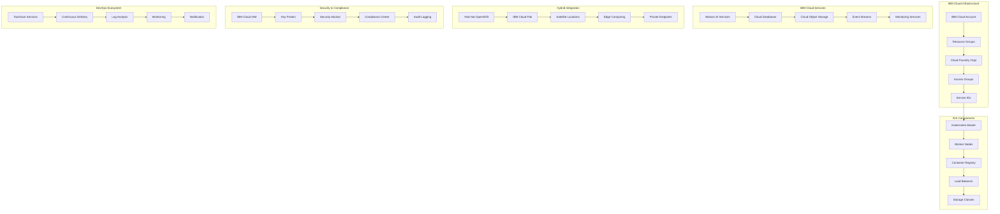

# IBM Cloud Kubernetes Service (IKS) Enterprise 深度实践

> **Author**: Multi-Cloud Platform Architect | **Version**: v1.0 | **Update Time**: 2026-02-07
> **Scenario**: Enterprise-grade Kubernetes management on IBM Cloud with integrated AI and hybrid cloud capabilities | **Complexity**: ⭐⭐⭐⭐

## 🎯 Abstract

This document provides comprehensive exploration of IBM Cloud Kubernetes Service enterprise deployment architecture, hybrid cloud integration patterns, and AI-powered operations management. Based on large-scale production environment experience, it offers complete technical guidance from cluster provisioning to advanced workload management, helping enterprises build intelligent, secure Kubernetes platforms with IBM Watson AI integration and seamless hybrid cloud connectivity across on-premises, IBM Cloud, and other cloud providers.

## 1. IKS Enterprise Architecture

### 1.1 Core Component Architecture



### 1.2 Enterprise Deployment Architecture

```yaml
iks_enterprise_deployment:
  account_organization:
    account_id: "1234567890abcdef"
    resource_groups:
      - name: "production-rg"
        description: "Production workloads"
        quota:
          instances: 100
          vcpu: 400
          memory: 1600
      
      - name: "development-rg"
        description: "Development and testing"
        quota:
          instances: 50
          vcpu: 200
          memory: 800
      
      - name: "platform-rg"
        description: "Platform services"
        quota:
          instances: 30
          vcpu: 120
          memory: 480
  
  cluster_configuration:
    production_cluster:
      name: "prod-iks-cluster"
      region: "us-south"
      zone: "us-south-1,us-south-2,us-south-3"
      kubernetes_version: "1.25.7"
      machine_type: "bx2.4x16"  # 4 vCPU, 16 GB RAM
      worker_count: 6
      worker_pools:
        - name: "compute-pool"
          machine_type: "bx2.4x16"
          size: 3
          labels:
            pool: "compute"
            environment: "production"
        
        - name: "database-pool"
          machine_type: "bx2.8x32"
          size: 2
          labels:
            pool: "database"
            environment: "production"
            dedicated: "true"
        
        - name: "ai-pool"
          machine_type: "bx2.16x64"
          size: 1
          labels:
            pool: "ai"
            environment: "production"
            gpu: "false"
      
      private_vlan: "1234567"
      public_vlan: "7654321"
      pod_subnet: "172.30.0.0/16"
      service_subnet: "172.21.0.0/16"
      
      features:
        private_service_endpoint: true
        public_service_endpoint: true
        disable_public_service_endpoint: false
        hardware: "shared"
        kube_version_update: "patch"
        update_all_workers: true
      
      addons:
        - name: "istio"
          version: "1.15"
        - name: "kubernetes-dashboard"
          version: "5.4.1"
        - name: "ibm-observability"
          version: "4.10"
  
  security_configuration:
    iam_policies:
      - roles: ["Administrator"]
        resources: ["cluster"]
        users: ["platform-admin@company.com"]
      
      - roles: ["Manager"]
        resources: ["namespace"]
        users: ["dev-team@company.com"]
        resource_attributes:
          - name: "namespace"
            value: "development"
      
      - roles: ["Viewer"]
        resources: ["cluster"]
        service_ids: ["monitoring-service"]
    
    key_management:
      key_protect_instance: "crn:v1:bluemix:public:kms:us-south:a/1234567890abcdef::"
      root_key: "crn:v1:bluemix:public:kms:us-south:a/1234567890abcdef:key:abcd1234-5678-efgh-9012-ijklmnopqrst"
      disk_encryption: true
      secrets_encryption: true
```

## 2. Advanced Cluster Management

### 2.1 Multi-Zone Cluster Setup

```bash
#!/bin/bash
# iks_multi_zone_setup.sh

RESOURCE_GROUP="production-rg"
CLUSTER_NAME="multi-zone-cluster"
REGION="us-south"

# 1. 创建多区域集群
ibmcloud ks cluster create classic \
    --name $CLUSTER_NAME \
    --zone $REGION-1 \
    --zone $REGION-2 \
    --zone $REGION-3 \
    --resource-group $RESOURCE_GROUP \
    --kube-version 1.25.7 \
    --machine-type bx2.4x16 \
    --workers 2 \
    --private-vlan 1234567 \
    --public-vlan 7654321 \
    --pod-subnet 172.30.0.0/16 \
    --service-subnet 172.21.0.0/16 \
    --private-service-endpoint \
    --public-service-endpoint

# 2. 添加额外的工作者节点池
ibmcloud ks worker-pool create classic \
    --name database-pool \
    --cluster $CLUSTER_NAME \
    --machine-type bx2.8x32 \
    --size-per-zone 2 \
    --hardware shared \
    --labels "pool=database,environment=production"

# 3. 为AI工作负载创建专用池
ibmcloud ks worker-pool create classic \
    --name ai-pool \
    --cluster $CLUSTER_NAME \
    --machine-type bx2.16x64 \
    --size-per-zone 1 \
    --hardware dedicated \
    --labels "pool=ai,environment=production,gpu=false"

# 4. 验证集群状态
ibmcloud ks cluster get --cluster $CLUSTER_NAME
ibmcloud ks worker-pools --cluster $CLUSTER_NAME
ibmcloud ks workers --cluster $CLUSTER_NAME
```

### 2.2 Cluster Configuration Management

```yaml
# cluster_config.yaml
apiVersion: v1
kind: ConfigMap
metadata:
  name: iks-cluster-config
  namespace: kube-system
data:
  cluster-config.yaml: |
    apiVersion: v1
    kind: ClusterConfiguration
    metadata:
      name: production-cluster
    spec:
      kubernetesVersion: "1.25.7"
      network:
        serviceCIDR: "172.21.0.0/16"
        podCIDR: "172.30.0.0/16"
        dnsDomain: "cluster.local"
      apiServer:
        auditPolicy:
          apiVersion: audit.k8s.io/v1
          kind: Policy
          rules:
            - level: Metadata
              resources:
                - group: ""
                  resources: ["pods", "services"]
            - level: Request
              resources:
                - group: "authorization.k8s.io"
                  resources: ["subjectaccessreviews"]
        admissionControl:
          - name: "PodSecurityPolicy"
            enabled: true
          - name: "ResourceQuota"
            enabled: true
        encryptionConfig:
          enabled: true
          provider: "ibm-key-protect"
      
      controllerManager:
        horizontalPodAutoscaler:
          syncPeriod: "15s"
          tolerance: "0.1"
        deploymentController:
          concurrentDeploymentSyncs: 5
      
      scheduler:
        schedulerName: "default-scheduler"
        algorithmSource:
          provider: "DefaultProvider"
```

## 3. IBM Cloud Service Integration

### 3.1 Watson AI Services Integration

```bash
#!/bin/bash
# watson_ai_integration.sh

RESOURCE_GROUP="platform-rg"
CLUSTER_NAME="ai-cluster"

# 1. 启用Watson服务
ibmcloud resource service-instance-create watson-assistant assistant free $RESOURCE_GROUP
ibmcloud resource service-instance-create watson-natural-language-understanding natural-language-understanding free $RESOURCE_GROUP
ibmcloud resource service-instance-create watson-text-to-speech text-to-speech free $RESOURCE_GROUP

# 2. 创建服务凭证
ibmcloud resource service-key-create watson-assistant-key Manager --instance-name watson-assistant
ibmcloud resource service-key-create watson-nlu-key Manager --instance-name watson-natural-language-understanding
ibmcloud resource service-key-create watson-tts-key Manager --instance-name watson-text-to-speech

# 3. 将凭证注入Kubernetes Secret
kubectl create secret generic watson-credentials \
    --from-literal=assistant-apikey=$(ibmcloud resource service-key watson-assistant-key --output json | jq -r '.[0].credentials.apikey') \
    --from-literal=nlu-apikey=$(ibmcloud resource service-key watson-nlu-key --output json | jq -r '.[0].credentials.apikey') \
    --from-literal=tts-apikey=$(ibmcloud resource service-key watson-tts-key --output json | jq -r '.[0].credentials.apikey') \
    --from-literal=assistant-url=$(ibmcloud resource service-key watson-assistant-key --output json | jq -r '.[0].credentials.url') \
    --from-literal=nlu-url=$(ibmcloud resource service-key watson-nlu-key --output json | jq -r '.[0].credentials.url') \
    --from-literal=tts-url=$(ibmcloud resource service-key watson-tts-key --output json | jq -r '.[0].credentials.url')

# 4. 部署AI应用示例
cat > ai-application.yaml << 'EOF'
apiVersion: apps/v1
kind: Deployment
metadata:
  name: ai-chatbot
  namespace: production
spec:
  replicas: 3
  selector:
    matchLabels:
      app: ai-chatbot
  template:
    metadata:
      labels:
        app: ai-chatbot
    spec:
      containers:
        - name: chatbot
          image: icr.io/namespace/ai-chatbot:latest
          env:
            - name: WATSON_ASSISTANT_APIKEY
              valueFrom:
                secretKeyRef:
                  name: watson-credentials
                  key: assistant-apikey
            - name: WATSON_ASSISTANT_URL
              valueFrom:
                secretKeyRef:
                  name: watson-credentials
                  key: assistant-url
            - name: WATSON_NLU_APIKEY
              valueFrom:
                secretKeyRef:
                  name: watson-credentials
                  key: nlu-apikey
          resources:
            requests:
              cpu: "500m"
              memory: "1Gi"
            limits:
              cpu: "1000m"
              memory: "2Gi"
          ports:
            - containerPort: 8080
---
apiVersion: v1
kind: Service
metadata:
  name: ai-chatbot-service
  namespace: production
spec:
  selector:
    app: ai-chatbot
  ports:
    - protocol: TCP
      port: 80
      targetPort: 8080
  type: LoadBalancer
EOF

kubectl apply -f ai-application.yaml
```

### 3.2 Cloud Database Integration

```yaml
# database_integration.yaml
apiVersion: v1
kind: Secret
metadata:
  name: database-credentials
  namespace: production
type: Opaque
data:
  username: $(echo -n "dbuser" | base64)
  password: $(echo -n "dbpassword" | base64)
  hostname: $(echo -n "databases-for-postgresql-1234567890abcdef.us-south.db.appdomain.cloud" | base64)
  port: $(echo -n "32154" | base64)
  database: $(echo -n "myappdb" | base64)

---
apiVersion: apps/v1
kind: Deployment
metadata:
  name: database-app
  namespace: production
spec:
  replicas: 3
  selector:
    matchLabels:
      app: database-app
  template:
    metadata:
      labels:
        app: database-app
    spec:
      containers:
        - name: app
          image: icr.io/namespace/database-app:latest
          env:
            - name: DB_USERNAME
              valueFrom:
                secretKeyRef:
                  name: database-credentials
                  key: username
            - name: DB_PASSWORD
              valueFrom:
                secretKeyRef:
                  name: database-credentials
                  key: password
            - name: DB_HOST
              valueFrom:
                secretKeyRef:
                  name: database-credentials
                  key: hostname
            - name: DB_PORT
              valueFrom:
                secretKeyRef:
                  name: database-credentials
                  key: port
            - name: DB_NAME
              valueFrom:
                secretKeyRef:
                  name: database-credentials
                  key: database
          resources:
            requests:
              cpu: "250m"
              memory: "512Mi"
            limits:
              cpu: "500m"
              memory: "1Gi"
```

## 4. Hybrid Cloud Integration

### 4.1 IBM Cloud Satellite Setup

```bash
#!/bin/bash
# satellite_setup.sh

LOCATION_NAME="company-hybrid-location"
MANAGED_INSTANCE_ID="12345678-1234-1234-1234-123456789012"

# 1. 创建Satellite位置
ibmcloud sat location create \
    --name $LOCATION_NAME \
    --managed-from $MANAGED_INSTANCE_ID \
    --coreos-enabled

# 2. 添加主机到位置
ibmcloud sat host attach \
    --location $LOCATION_NAME \
    --host-id host-1 \
    --labels "env=onprem,rack=rack1"

ibmcloud sat host attach \
    --location $LOCATION_NAME \
    --host-id host-2 \
    --labels "env=onprem,rack=rack2"

# 3. 分配主机到控制平面
ibmcloud sat host assign \
    --location $LOCATION_NAME \
    --host-id host-1 \
    --cluster control-plane

ibmcloud sat host assign \
    --location $LOCATION_NAME \
    --host-id host-2 \
    --cluster control-plane

# 4. 创建边缘集群
ibmcloud sat cluster create \
    --name edge-cluster \
    --location $LOCATION_NAME \
    --kube-version 1.25.7 \
    --host-label "env=edge" \
    --enable-config-reload
```

### 4.2 Red Hat OpenShift Integration

```yaml
# openshift_integration.yaml
apiVersion: v1
kind: ConfigMap
metadata:
  name: openshift-config
  namespace: openshift-config
data:
  config.yaml: |
    apiVersion: config.openshift.io/v1
    kind: ClusterVersion
    metadata:
      name: version
    spec:
      channel: "stable-4.12"
      clusterID: "12345678-1234-1234-1234-123456789012"
      desiredUpdate:
        version: "4.12.15"
        image: "quay.io/openshift-release-dev/ocp-release:4.12.15-x86_64"
      
      upstream: "https://api.openshift.com/api/upgrades_info/v1/graph"
      capabilities:
        baselineCapabilitySet: "None"
        additionalEnabledCapabilities:
          - "openshift-samples"
          - "marketplace"
          - "NodeTuning"
```

## 5. Security and Compliance

### 5.1 Advanced Security Configuration

```bash
#!/bin/bash
# iks_security_hardening.sh

CLUSTER_NAME="secure-cluster"
RESOURCE_GROUP="production-rg"

# 1. 启用安全服务
ibmcloud ks cluster feature enable security-groups --cluster $CLUSTER_NAME

# 2. 配置网络安全策略
cat > network_security.yaml << 'EOF'
apiVersion: security.ibm.com/v1
kind: SecurityGroup
metadata:
  name: production-security-group
  namespace: production
spec:
  rules:
    - name: "allow-internal-traffic"
      direction: "inbound"
      protocol: "tcp"
      portMin: 1
      portMax: 65535
      source:
        - "172.30.0.0/16"
        - "172.21.0.0/16"
    
    - name: "allow-loadbalancer-traffic"
      direction: "inbound"
      protocol: "tcp"
      portMin: 80
      portMax: 443
      source:
        - "0.0.0.0/0"
    
    - name: "allow-monitoring"
      direction: "inbound"
      protocol: "tcp"
      portMin: 9100
      portMax: 9100
      source:
        - "10.0.0.0/8"
EOF

# 3. 配置Pod安全策略
cat > pod_security_policy.yaml << 'EOF'
apiVersion: policy/v1beta1
kind: PodSecurityPolicy
metadata:
  name: ibm-restricted-psp
  annotations:
    seccomp.security.alpha.kubernetes.io/allowedProfileNames: 'docker/default,runtime/default'
    apparmor.security.beta.kubernetes.io/allowedProfileNames: 'runtime/default'
    seccomp.security.alpha.kubernetes.io/defaultProfileName:  'runtime/default'
    apparmor.security.beta.kubernetes.io/defaultProfileName:  'runtime/default'
spec:
  privileged: false
  allowPrivilegeEscalation: false
  requiredDropCapabilities:
    - ALL
  volumes:
    - 'configMap'
    - 'emptyDir'
    - 'projected'
    - 'secret'
    - 'downwardAPI'
    - 'persistentVolumeClaim'
  hostNetwork: false
  hostIPC: false
  hostPID: false
  runAsUser:
    rule: 'MustRunAsNonRoot'
  seLinux:
    rule: 'RunAsAny'
  supplementalGroups:
    rule: 'MustRunAs'
    ranges:
      - min: 1
        max: 65535
  fsGroup:
    rule: 'MustRunAs'
    ranges:
      - min: 1
        max: 65535
  readOnlyRootFilesystem: false
EOF
```

### 5.2 Compliance Management

```yaml
# compliance_config.yaml
apiVersion: security.ibm.com/v1
kind: ComplianceCheck
metadata:
  name: hipaa-compliance
  namespace: compliance
spec:
  standards:
    - name: "HIPAA"
      version: "latest"
      controls:
        - "164.308(a)(1)(i)"
        - "164.308(a)(3)(ii)"
        - "164.312(a)(1)"
        - "164.312(e)(2)(i)"
  
  schedule: "0 0 * * 0"  # Weekly
  notification:
    email: "security-team@company.com"
    slack: "#compliance-alerts"
  
  remediation:
    autoFix: true
    approvalRequired: false

---
apiVersion: v1
kind: ConfigMap
metadata:
  name: compliance-rules
  namespace: compliance
data:
  hipaa-rules.yaml: |
    rules:
      - name: "encrypt-data-at-rest"
        description: "All data must be encrypted at rest"
        severity: "HIGH"
        condition: "all_persistent_volumes_encrypted"
        remediation: "enable_encryption_for_all_pvcs"
      
      - name: "audit-logging"
        description: "Audit logging must be enabled"
        severity: "HIGH"
        condition: "audit_logging_enabled"
        remediation: "enable_cluster_audit_logging"
      
      - name: "network-policies"
        description: "Network policies must be enforced"
        severity: "MEDIUM"
        condition: "network_policies_implemented"
        remediation: "implement_default_deny_network_policies"
```

## 6. Observability and Monitoring

### 6.1 IBM Cloud Monitoring Setup

```bash
#!/bin/bash
# observability_setup.sh

CLUSTER_NAME="monitoring-cluster"
RESOURCE_GROUP="platform-rg"

# 1. 启用IBM Cloud Monitoring
ibmcloud ks cluster addon enable ibm-observe --cluster $CLUSTER_NAME

# 2. 配置Sysdig监控
cat > sysdig_config.yaml << 'EOF'
apiVersion: v1
kind: Secret
metadata:
  name: sysdig-access-key
  namespace: ibm-observe
type: Opaque
data:
  access-key: $(echo -n "your-sysdig-access-key" | base64)

---
apiVersion: apps/v1
kind: Deployment
metadata:
  name: sysdig-agent
  namespace: ibm-observe
spec:
  replicas: 1
  selector:
    matchLabels:
      app: sysdig-agent
  template:
    metadata:
      labels:
        app: sysdig-agent
    spec:
      hostNetwork: true
      hostPID: true
      containers:
        - name: sysdig-agent
          image: sysdig/agent:latest
          env:
            - name: ACCESS_KEY
              valueFrom:
                secretKeyRef:
                  name: sysdig-access-key
                  key: access-key
            - name: TAGS
              value: "cluster:$CLUSTER_NAME,region:us-south"
          volumeMounts:
            - name: docker-sock
              mountPath: /var/run/docker.sock
            - name: dev-vol
              mountPath: /host/dev
            - name: proc-vol
              mountPath: /host/proc
              readOnly: true
            - name: boot-vol
              mountPath: /host/boot
              readOnly: true
            - name: modules-vol
              mountPath: /host/lib/modules
              readOnly: true
            - name: usr-vol
              mountPath: /host/usr
              readOnly: true
          securityContext:
            privileged: true
      volumes:
        - name: docker-sock
          hostPath:
            path: /var/run/docker.sock
        - name: dev-vol
          hostPath:
            path: /dev
        - name: proc-vol
          hostPath:
            path: /proc
        - name: boot-vol
          hostPath:
            path: /boot
        - name: modules-vol
          hostPath:
            path: /lib/modules
        - name: usr-vol
          hostPath:
            path: /usr
EOF
```

### 6.2 Custom Metrics and Alerting

```yaml
# custom_monitoring.yaml
apiVersion: monitoring.coreos.com/v1
kind: ServiceMonitor
metadata:
  name: application-monitor
  namespace: monitoring
spec:
  selector:
    matchLabels:
      app: business-app
  endpoints:
    - port: metrics
      interval: 30s
      path: /metrics
      scheme: https
      tlsConfig:
        insecureSkipVerify: true

---
apiVersion: monitoring.coreos.com/v1
kind: PrometheusRule
metadata:
  name: application-alerts
  namespace: monitoring
spec:
  groups:
    - name: application.rules
      rules:
        - alert: HighErrorRate
          expr: rate(http_requests_total{status=~"5.."}[5m]) > 0.05
          for: 10m
          labels:
            severity: page
          annotations:
            summary: "High error rate detected"
            description: "Error rate for {{ $labels.job }} is above 5%"
        
        - alert: HighLatency
          expr: histogram_quantile(0.95, rate(http_request_duration_seconds_bucket[5m])) > 2
          for: 10m
          labels:
            severity: warning
          annotations:
            summary: "High latency detected"
            description: "95th percentile latency for {{ $labels.job }} is above 2 seconds"
```

## 7. DevOps Integration

### 7.1 CI/CD Pipeline Setup

```yaml
# tekton_pipeline.yaml
apiVersion: tekton.dev/v1beta1
kind: Pipeline
metadata:
  name: iks-deployment-pipeline
  namespace: cicd
spec:
  workspaces:
    - name: shared-workspace
  params:
    - name: git-url
      type: string
      description: git repository url
    - name: git-revision
      type: string
      description: git revision to checkout
    - name: image-name
      type: string
      description: image name
    - name: cluster-name
      type: string
      description: target cluster name
  tasks:
    - name: fetch-repository
      taskRef:
        name: git-clone
      workspaces:
        - name: output
          workspace: shared-workspace
      params:
        - name: url
          value: $(params.git-url)
        - name: revision
          value: $(params.git-revision)
    
    - name: run-tests
      taskRef:
        name: npm-test
      runAfter:
        - fetch-repository
      workspaces:
        - name: source
          workspace: shared-workspace
    
    - name: build-image
      taskRef:
        name: buildah
      runAfter:
        - run-tests
      workspaces:
        - name: source
          workspace: shared-workspace
      params:
        - name: IMAGE
          value: $(params.image-name)
    
    - name: deploy-to-iks
      taskRef:
        name: iks-deploy
      runAfter:
        - build-image
      workspaces:
        - name: manifests
          workspace: shared-workspace
      params:
        - name: cluster-name
          value: $(params.cluster-name)
        - name: image-name
          value: $(params.image-name)
```

### 7.2 Automated Deployment

```bash
#!/bin/bash
# automated_deployment.sh

PIPELINE_NAME="iks-deployment-pipeline"
APPLICATION_NAME="my-application"
CLUSTER_NAME="prod-iks-cluster"

# 1. 创建PipelineRun
cat > pipeline_run.yaml << EOF
apiVersion: tekton.dev/v1beta1
kind: PipelineRun
metadata:
  name: ${APPLICATION_NAME}-deployment-$(date +%Y%m%d-%H%M%S)
  namespace: cicd
spec:
  pipelineRef:
    name: $PIPELINE_NAME
  params:
    - name: git-url
      value: "https://github.com/company/${APPLICATION_NAME}.git"
    - name: git-revision
      value: "main"
    - name: image-name
      value: "icr.io/namespace/${APPLICATION_NAME}:latest"
    - name: cluster-name
      value: "$CLUSTER_NAME"
  workspaces:
    - name: shared-workspace
      volumeClaimTemplate:
        spec:
          accessModes:
            - ReadWriteOnce
          resources:
            requests:
              storage: 1Gi
EOF

# 2. 执行部署
kubectl apply -f pipeline_run.yaml

# 3. 监控部署状态
kubectl get pipelinerun -n cicd | grep ${APPLICATION_NAME}-deployment
```

---
*This document is based on enterprise-level IBM Cloud Kubernetes Service practice experience and continuously updated with the latest technologies and best practices.*