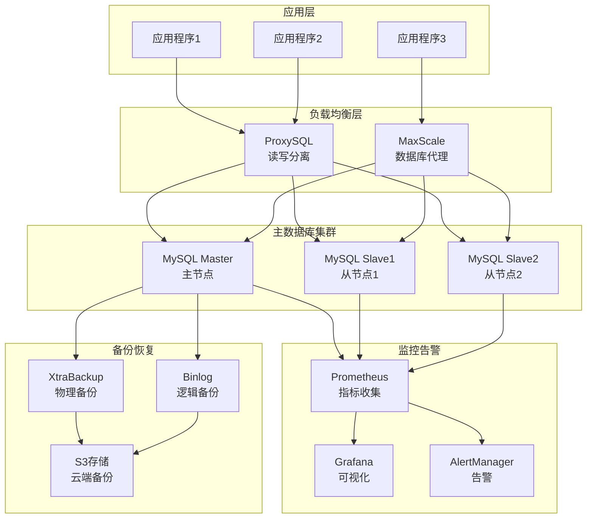

# MySQL 企业级数据库运维管理

## 概述 (Overview)

MySQL是世界上最流行的开源关系型数据库管理系统，在企业级应用中广泛使用。本文档从生产环境运维专家角度，深入探讨MySQL的企业级部署架构、高可用方案、性能优化和运维管理最佳实践。

MySQL is the world's most popular open-source relational database management system, widely used in enterprise applications. This document explores MySQL's enterprise deployment architecture, high availability solutions, performance optimization, and operational management best practices from a production environment operations expert perspective.

## 架构设计 (Architecture Design)

### 企业级MySQL主从架构 (Enterprise MySQL Master-Slave Architecture)

```yaml
# MySQL主从复制配置
version: '3.8'
services:
  mysql-master:
    image: mysql:8.0
    container_name: mysql-master
    environment:
      MYSQL_ROOT_PASSWORD: ${MYSQL_ROOT_PASSWORD}
      MYSQL_DATABASE: production_db
      MYSQL_USER: app_user
      MYSQL_PASSWORD: ${MYSQL_USER_PASSWORD}
    volumes:
      - mysql-master-data:/var/lib/mysql
      - ./config/master.cnf:/etc/mysql/conf.d/master.cnf
    ports:
      - "3306:3306"
    networks:
      - mysql-network
    command: >
      bash -c "
        mysqld &
        sleep 10
        mysql -u root -p${MYSQL_ROOT_PASSWORD} -e \"
          CREATE USER 'repl_user'@'%' IDENTIFIED BY '${MYSQL_REPL_PASSWORD}';
          GRANT REPLICATION SLAVE ON *.* TO 'repl_user'@'%';
          FLUSH PRIVILEGES;
        \"
        wait
      "

  mysql-slave:
    image: mysql:8.0
    container_name: mysql-slave
    environment:
      MYSQL_ROOT_PASSWORD: ${MYSQL_ROOT_PASSWORD}
    volumes:
      - mysql-slave-data:/var/lib/mysql
      - ./config/slave.cnf:/etc/mysql/conf.d/slave.cnf
    ports:
      - "3307:3306"
    networks:
      - mysql-network
    depends_on:
      - mysql-master
    command: >
      bash -c "
        mysqld &
        sleep 20
        mysql -u root -p${MYSQL_ROOT_PASSWORD} -e \"
          CHANGE MASTER TO
            MASTER_HOST='mysql-master',
            MASTER_USER='repl_user',
            MASTER_PASSWORD='${MYSQL_REPL_PASSWORD}',
            MASTER_LOG_FILE='mysql-bin.000001',
            MASTER_LOG_POS=156;
          START SLAVE;
        \"
        wait
      "

volumes:
  mysql-master-data:
  mysql-slave-data:

networks:
  mysql-network:
    driver: bridge
```

### MySQL高可用架构图 (MySQL High Availability Architecture)



## 核心配置优化 (Core Configuration Optimization)

### MySQL配置文件优化 (MySQL Configuration Optimization)

```ini
# my.cnf - MySQL主节点优化配置
[mysqld]
# 基础配置
port = 3306
socket = /var/run/mysqld/mysqld.sock
pid-file = /var/run/mysqld/mysqld.pid
datadir = /var/lib/mysql
log-error = /var/log/mysql/error.log

# 性能优化
innodb_buffer_pool_size = 2G
innodb_log_file_size = 512M
innodb_log_buffer_size = 64M
innodb_flush_log_at_trx_commit = 2
innodb_flush_method = O_DIRECT
innodb_file_per_table = 1
innodb_thread_concurrency = 0
innodb_read_io_threads = 8
innodb_write_io_threads = 8

# 复制配置
server-id = 1
log-bin = mysql-bin
binlog-format = ROW
binlog-row-image = FULL
expire_logs_days = 7
sync_binlog = 1
relay-log = relay-bin
read_only = 0

# 安全配置
bind-address = 0.0.0.0
skip-name-resolve = 1
max_connections = 1000
max_connect_errors = 100000
wait_timeout = 28800
interactive_timeout = 28800

# 字符集配置
character-set-server = utf8mb4
collation-server = utf8mb4_unicode_ci

# 查询缓存
query_cache_type = 1
query_cache_size = 128M
query_cache_limit = 2M

# 慢查询日志
slow_query_log = 1
long_query_time = 2
slow_query_log_file = /var/log/mysql/slow.log
log_queries_not_using_indexes = 1
```

### 从节点配置 (Slave Configuration)

```ini
# slave.cnf - MySQL从节点配置
[mysqld]
server-id = 2
relay-log = relay-bin
log-bin = mysql-bin
read_only = 1
super_read_only = 1

# 复制优化
slave_parallel_workers = 4
slave_parallel_type = LOGICAL_CLOCK
slave_preserve_commit_order = 1

# 其他配置继承主节点
!includedir /etc/mysql/conf.d/
```

## 高可用方案 (High Availability Solutions)

### MHA (Master High Availability) 配置

```yaml
# MHA Manager配置
[server default]
manager_workdir = /var/log/masterha/app1
manager_log = /var/log/masterha/app1/manager.log
remote_workdir = /var/log/masterha/app1
ssh_user = mysql
repl_user = repl_user
repl_password = ${MYSQL_REPL_PASSWORD}
ping_interval = 1
master_binlog_dir = /var/lib/mysql

[server1]
hostname = mysql-master
candidate_master = 1

[server2]
hostname = mysql-slave1
candidate_master = 1

[server3]
hostname = mysql-slave2
no_master = 1
```

### Orchestrator 配置

```json
{
  "Debug": true,
  "EnableSyslog": false,
  "ListenAddress": ":3000",
  "MySQLTopologyUser": "orchestrator",
  "MySQLTopologyPassword": "${ORCHESTRATOR_PASSWORD}",
  "MySQLTopologyCredentialsConfigFile": "",
  "MySQLTopologySSLPrivateKeyFile": "",
  "MySQLTopologySSLCertFile": "",
  "MySQLTopologySSLCAFile": "",
  "MySQLTopologySSLSkipVerify": true,
  "MySQLTopologyUseMutualTLS": false,
  "BackendDB": "sqlite",
  "SQLite3DataFile": "/usr/local/orchestrator/orchestrator.sqlite3",
  "RaftEnabled": false,
  "RaftDataDir": "/var/lib/orchestrator",
  "RaftBind": "127.0.0.1",
  "DefaultInstancePort": 3306,
  "DiscoverByShowSlaveHosts": true,
  "InstancePollSeconds": 5,
  "ReadOnly": false,
  "KVClusterMasterPrefix": "mysql/master",
  "FailMasterFailoverIfSlaveStopped": true,
  "DelayMasterFailoverIfSlaveLatencySeconds": 10
}
```

## 性能监控 (Performance Monitoring)

### 监控指标配置 (Monitoring Metrics Configuration)

```yaml
# Prometheus MySQL Exporter配置
scrape_configs:
  - job_name: 'mysql-exporter'
    static_configs:
      - targets: ['mysql-exporter:9104']
    metrics_path: /metrics
    params:
      collect[]:
        - global_status
        - global_variables
        - slave_status
        - processlist
        - table_schema
        - info_schema.innodb_metrics
        - custom_query.hr
        - custom_query.lr

# 关键监控指标
mysql_global_status_threads_connected{}  # 当前连接数
mysql_global_status_uptime{}             # 运行时间
mysql_global_status_questions{}          # 查询总数
mysql_global_status_slow_queries{}       # 慢查询数
mysql_global_status_innodb_buffer_pool_pages_free{}  # 缓冲池空闲页
mysql_slave_status_seconds_behind_master{}  # 从库延迟
```

### 告警规则配置 (Alerting Rules Configuration)

```yaml
# Prometheus告警规则
groups:
- name: mysql.rules
  rules:
  - alert: MySQLDown
    expr: mysql_up == 0
    for: 2m
    labels:
      severity: critical
    annotations:
      summary: "MySQL instance is down"
      description: "MySQL instance {{ $labels.instance }} is down for more than 2 minutes"

  - alert: MySQLHighConnectionCount
    expr: mysql_global_status_threads_connected > 800
    for: 2m
    labels:
      severity: warning
    annotations:
      summary: "High MySQL connection count"
      description: "MySQL instance {{ $labels.instance }} has {{ $value }} connections"

  - alert: MySQLReplicationLag
    expr: mysql_slave_status_seconds_behind_master > 300
    for: 2m
    labels:
      severity: warning
    annotations:
      summary: "MySQL replication lag"
      description: "MySQL slave {{ $labels.instance }} is {{ $value }} seconds behind master"

  - alert: MySQLSlowQueries
    expr: increase(mysql_global_status_slow_queries[5m]) > 10
    for: 2m
    labels:
      severity: warning
    annotations:
      summary: "High MySQL slow query rate"
      description: "MySQL instance {{ $labels.instance }} has {{ $value }} slow queries in the last 5 minutes"
```

## 运维管理 (Operational Management)

### 故障排查工具 (Troubleshooting Tools)

```bash
#!/bin/bash
# MySQL故障排查脚本

# 数据库健康检查
check_mysql_health() {
    echo "=== MySQL Health Check ==="
    
    # 检查MySQL服务状态
    systemctl status mysql | grep Active
    
    # 检查连接数
    mysql -e "SHOW STATUS LIKE 'Threads_connected';"
    
    # 检查慢查询
    mysql -e "SHOW STATUS LIKE 'Slow_queries';"
    
    # 检查复制状态
    mysql -e "SHOW SLAVE STATUS\G" | grep -E "Slave_IO_Running|Slave_SQL_Running|Seconds_Behind_Master"
}

# 性能分析
performance_analysis() {
    echo "=== Performance Analysis ==="
    
    # 检查缓冲池使用情况
    mysql -e "SHOW ENGINE INNODB STATUS\G" | grep -A 10 "BUFFER POOL AND MEMORY"
    
    # 检查锁等待
    mysql -e "SHOW ENGINE INNODB STATUS\G" | grep -A 20 "TRANSACTIONS"
    
    # 检查未使用索引的查询
    mysql -e "SELECT * FROM performance_schema.events_statements_summary_by_digest 
              WHERE DIGEST_TEXT LIKE '%SELECT%' AND 
              SUM_NO_GOOD_INDEX_USED > 0 
              ORDER BY SUM_NO_GOOD_INDEX_USED DESC LIMIT 10;"
}

# 备份验证
backup_verification() {
    echo "=== Backup Verification ==="
    
    # 检查备份完整性
    innobackupex --apply-log /backup/mysql/latest/
    
    # 验证备份文件
    ls -la /backup/mysql/latest/
    
    # 检查二进制日志
    mysql -e "SHOW BINARY LOGS;"
}
```

### 日常运维脚本 (Daily Operations Scripts)

```bash
#!/bin/bash
# MySQL日常运维脚本

# 自动备份
auto_backup() {
    echo "Performing automatic backup..."
    
    local backup_dir="/backup/mysql/$(date +%Y%m%d_%H%M%S)"
    
    # 物理备份
    innobackupex --user=root --password=${MYSQL_ROOT_PASSWORD} $backup_dir
    
    # 应用日志
    innobackupex --apply-log $backup_dir
    
    # 清理旧备份（保留7天）
    find /backup/mysql/ -type d -mtime +7 -exec rm -rf {} \;
}

# 性能优化
performance_optimization() {
    echo "Optimizing MySQL performance..."
    
    # 分析表碎片
    mysql -e "SELECT table_schema, table_name, data_free 
              FROM information_schema.tables 
              WHERE data_free > 1024*1024*100;" > /tmp/table_fragmentation.txt
    
    # 优化碎片表
    while read schema table free; do
        if [[ $schema != "table_schema" ]]; then
            mysql -e "OPTIMIZE TABLE \`$schema\`.\`$table\`;"
        fi
    done < /tmp/table_fragmentation.txt
    
    # 更新统计信息
    mysql -e "ANALYZE TABLE *.*;"
}

# 安全检查
security_audit() {
    echo "Performing security audit..."
    
    # 检查弱密码用户
    mysql -e "SELECT User, Host FROM mysql.user WHERE LENGTH(Authentication_string) < 41;"
    
    # 检查root用户访问权限
    mysql -e "SELECT User, Host FROM mysql.user WHERE User='root';"
    
    # 检查匿名用户
    mysql -e "SELECT User, Host FROM mysql.user WHERE User='';"
}
```

## 最佳实践 (Best Practices)

### 部署最佳实践 (Deployment Best Practices)

1. **硬件规划**
   ```bash
   # 内存分配建议
   innodb_buffer_pool_size = 物理内存的 70-80%
   key_buffer_size = 物理内存的 5-10% (MyISAM)
   query_cache_size = 128MB-1GB
   ```

2. **存储优化**
   ```bash
   # 使用SSD存储
   # RAID 10配置
   # LVM快照用于备份
   ```

3. **网络配置**
   ```ini
   # 网络优化参数
   net_buffer_length = 32K
   max_allowed_packet = 64M
   net_read_timeout = 30
   net_write_timeout = 60
   ```

### 安全最佳实践 (Security Best Practices)

1. **访问控制**
   ```sql
   -- 创建应用专用用户
   CREATE USER 'app_user'@'10.0.0.%' IDENTIFIED BY 'strong_password';
   GRANT SELECT, INSERT, UPDATE, DELETE ON production_db.* TO 'app_user'@'10.0.0.%';
   
   -- 限制root访问
   DELETE FROM mysql.user WHERE User='root' AND Host NOT IN ('localhost', '127.0.0.1');
   ```

2. **数据加密**
   ```ini
   # 启用SSL连接
   ssl-ca = /etc/mysql/ssl/ca.pem
   ssl-cert = /etc/mysql/ssl/server-cert.pem
   ssl-key = /etc/mysql/ssl/server-key.pem
   ```

3. **审计日志**
   ```sql
   -- 启用通用查询日志
   SET GLOBAL general_log = 'ON';
   SET GLOBAL general_log_file = '/var/log/mysql/general.log';
   
   -- 启用审计插件
   INSTALL PLUGIN audit_log SONAME 'audit_log.so';
   ```

### 监控最佳实践 (Monitoring Best Practices)

1. **关键指标监控**
   - 连接数使用率 < 80%
   - 缓冲池命中率 > 95%
   - 复制延迟 < 30秒
   - 慢查询率 < 0.1%

2. **告警策略**
   ```yaml
   # 分级告警
   critical: 数据库宕机、复制中断
   warning: 连接数过高、性能下降
   info: 常规状态更新
   ```

3. **容量规划**
   ```sql
   -- 监控表增长趋势
   SELECT table_schema, table_name, 
          ROUND(((data_length + index_length) / 1024 / 1024), 2) AS 'Size (MB)'
   FROM information_schema.tables 
   ORDER BY (data_length + index_length) DESC;
   ```

---

**文档版本**: v1.0  
**最后更新**: 2024年2月7日  
**适用版本**: MySQL 8.0+