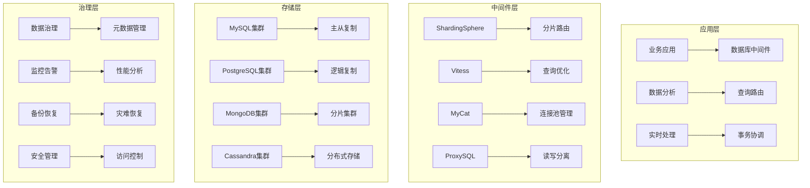

# 分布式数据库企业级实践深度指南

> **作者**: 企业级数据库架构专家 | **版本**: v1.0 | **更新时间**: 2026-02-07
> **适用场景**: 企业级分布式数据库架构与治理 | **复杂度**: ⭐⭐⭐⭐⭐

## 🎯 摘要

本文档深入探讨企业级分布式数据库架构设计、数据治理策略和性能优化实践，基于金融、电信、电商等大规模业务场景的实践经验，提供从数据库选型到运维管理的完整技术指南。

## 1. 分布式数据库架构设计

### 1.1 核心架构模式



### 1.2 数据分片策略

```yaml
# sharding-strategy.yaml
sharding_configuration:
  database_sharding:
    strategy: "consistent_hashing"
    shard_count: 16
    key_generation:
      algorithm: "snowflake"
      datacenter_id: 1
      worker_id: 1
      
  table_sharding:
    orders_table:
      sharding_column: "user_id"
      sharding_algorithm: "mod"
      shard_count: 8
      
    user_profiles_table:
      sharding_column: "user_id"
      sharding_algorithm: "hash"
      shard_count: 4
      
    transaction_logs_table:
      sharding_column: "created_time"
      sharding_algorithm: "range"
      shard_count: 12
      range_config:
        - start: "2023-01-01"
          end: "2023-12-31"
          shard: 0
        - start: "2024-01-01"
          end: "2024-12-31"
          shard: 1

  routing_rules:
    read_write_splitting:
      master_nodes: ["db-master-1", "db-master-2"]
      slave_nodes: ["db-slave-1", "db-slave-2", "db-slave-3"]
      routing_policy: "round_robin"
      
    failover_mechanism:
      health_check_interval: "30s"
      failover_timeout: "60s"
      recovery_threshold: 3
```

## 2. 数据库Mesh架构

### 2.1 服务网格集成

```yaml
# database-mesh.yaml
apiVersion: databases.mesh/v1alpha1
kind: DatabaseService
metadata:
  name: user-database-service
  namespace: database-mesh
spec:
  database_type: "mysql"
  version: "8.0"
  endpoints:
    - address: "mysql-primary.database.svc.cluster.local:3306"
      role: "primary"
    - address: "mysql-replica-1.database.svc.cluster.local:3306"
      role: "replica"
    - address: "mysql-replica-2.database.svc.cluster.local:3306"
      role: "replica"
      
  connection_pool:
    max_connections: 100
    min_connections: 10
    connection_timeout: "30s"
    idle_timeout: "300s"
    
  security:
    encryption:
      tls_enabled: true
      ca_certificate: "/etc/ssl/ca.crt"
      client_certificate: "/etc/ssl/client.crt"
      client_key: "/etc/ssl/client.key"
    authentication:
      method: "iam"
      iam_role: "database-access-role"
      
  observability:
    metrics:
      enabled: true
      scrape_interval: "15s"
      metrics_path: "/metrics"
    tracing:
      enabled: true
      sampling_rate: 0.1
    logging:
      level: "INFO"
      format: "json"
```

## 3. 企业级数据治理

### 3.1 数据质量管理

```python
# data-quality-governance.py
import pandas as pd
import numpy as np
from datetime import datetime
from typing import Dict, List, Optional
import hashlib
import json

class DataQualityGovernance:
    def __init__(self):
        self.quality_rules = {}
        self.data_lineage = {}
        self.quality_metrics = {}
        
    def define_quality_rules(self, table_name: str, rules: Dict):
        """定义数据质量规则"""
        self.quality_rules[table_name] = rules
        
    def assess_data_quality(self, table_name: str, data: pd.DataFrame) -> Dict:
        """评估数据质量"""
        if table_name not in self.quality_rules:
            raise ValueError(f"No quality rules defined for table: {table_name}")
            
        rules = self.quality_rules[table_name]
        assessment_results = {
            'table_name': table_name,
            'assessment_time': datetime.now().isoformat(),
            'total_rows': len(data),
            'quality_score': 0.0,
            'dimension_scores': {},
            'violations': []
        }
        
        # 完整性检查
        completeness_score = self._assess_completeness(data, rules.get('completeness', {}))
        assessment_results['dimension_scores']['completeness'] = completeness_score
        
        # 准确性检查
        accuracy_score = self._assess_accuracy(data, rules.get('accuracy', {}))
        assessment_results['dimension_scores']['accuracy'] = accuracy_score
        
        # 一致性检查
        consistency_score = self._assess_consistency(data, rules.get('consistency', {}))
        assessment_results['dimension_scores']['consistency'] = consistency_score
        
        # 及时性检查
        timeliness_score = self._assess_timeliness(data, rules.get('timeliness', {}))
        assessment_results['dimension_scores']['timeliness'] = timeliness_score
        
        # 计算总体质量分数
        weights = rules.get('weights', {
            'completeness': 0.3,
            'accuracy': 0.3,
            'consistency': 0.2,
            'timeliness': 0.2
        })
        
        assessment_results['quality_score'] = round(
            (completeness_score * weights['completeness'] +
             accuracy_score * weights['accuracy'] +
             consistency_score * weights['consistency'] +
             timeliness_score * weights['timeliness']) * 100, 2
        )
        
        return assessment_results
    
    def _assess_completeness(self, data: pd.DataFrame, rules: Dict) -> float:
        """评估数据完整性"""
        violations = []
        total_checks = 0
        passed_checks = 0
        
        for column, rule in rules.items():
            if column in data.columns:
                total_checks += 1
                
                if rule == 'not_null':
                    null_count = data[column].isnull().sum()
                    if null_count == 0:
                        passed_checks += 1
                    else:
                        violations.append({
                            'type': 'completeness',
                            'column': column,
                            'issue': f'{null_count} null values found',
                            'severity': 'high'
                        })
                elif isinstance(rule, dict) and 'min_length' in rule:
                    short_values = data[data[column].str.len() < rule['min_length']].shape[0]
                    if short_values == 0:
                        passed_checks += 1
                    else:
                        violations.append({
                            'type': 'completeness',
                            'column': column,
                            'issue': f'{short_values} values below minimum length',
                            'severity': 'medium'
                        })
        
        score = passed_checks / max(total_checks, 1)
        self.quality_metrics.setdefault('completeness_violations', []).extend(violations)
        return score
    
    def _assess_accuracy(self, data: pd.DataFrame, rules: Dict) -> float:
        """评估数据准确性"""
        violations = []
        total_checks = 0
        passed_checks = 0
        
        for column, rule in rules.items():
            if column in data.columns:
                total_checks += 1
                
                if 'valid_values' in rule:
                    invalid_count = (~data[column].isin(rule['valid_values'])).sum()
                    if invalid_count == 0:
                        passed_checks += 1
                    else:
                        violations.append({
                            'type': 'accuracy',
                            'column': column,
                            'issue': f'{invalid_count} invalid values found',
                            'severity': 'high'
                        })
                elif 'pattern' in rule:
                    pattern_matches = data[column].str.match(rule['pattern']).sum()
                    if pattern_matches == len(data):
                        passed_checks += 1
                    else:
                        violations.append({
                            'type': 'accuracy',
                            'column': column,
                            'issue': f'{len(data) - pattern_matches} values not matching pattern',
                            'severity': 'medium'
                        })
        
        score = passed_checks / max(total_checks, 1)
        self.quality_metrics.setdefault('accuracy_violations', []).extend(violations)
        return score
    
    def generate_quality_report(self, assessments: List[Dict]) -> Dict:
        """生成数据质量报告"""
        report = {
            'report_generated': datetime.now().isoformat(),
            'summary': {
                'total_tables': len(assessments),
                'average_quality_score': np.mean([a['quality_score'] for a in assessments]),
                'highest_quality_table': max(assessments, key=lambda x: x['quality_score']),
                'lowest_quality_table': min(assessments, key=lambda x: x['quality_score'])
            },
            'detailed_assessments': assessments,
            'recommendations': self._generate_recommendations(assessments)
        }
        
        return report
    
    def _generate_recommendations(self, assessments: List[Dict]) -> List[str]:
        """生成改进建议"""
        recommendations = []
        
        # 识别常见问题
        all_violations = []
        for assessment in assessments:
            for dimension, violations in self.quality_metrics.items():
                all_violations.extend(violations)
        
        # 按类型统计问题
        violation_types = {}
        for violation in all_violations:
            vtype = violation['type']
            violation_types[vtype] = violation_types.get(vtype, 0) + 1
        
        # 生成建议
        if violation_types.get('completeness', 0) > 0:
            recommendations.append("加强数据录入验证，确保必填字段完整")
        
        if violation_types.get('accuracy', 0) > 0:
            recommendations.append("实施数据标准化和验证规则")
        
        if violation_types.get('consistency', 0) > 0:
            recommendations.append("建立主数据管理和数据字典")
        
        return recommendations

# 使用示例
governance = DataQualityGovernance()

# 定义质量规则
governance.define_quality_rules('users', {
    'completeness': {
        'user_id': 'not_null',
        'email': 'not_null',
        'name': {'min_length': 2}
    },
    'accuracy': {
        'email': {'pattern': r'^[a-zA-Z0-9._%+-]+@[a-zA-Z0-9.-]+\.[a-zA-Z]{2,}$'},
        'status': {'valid_values': ['active', 'inactive', 'pending']}
    },
    'weights': {
        'completeness': 0.4,
        'accuracy': 0.4,
        'consistency': 0.1,
        'timeliness': 0.1
    }
})

# 评估数据质量
sample_data = pd.DataFrame({
    'user_id': [1, 2, 3, 4, None],
    'email': ['user1@test.com', 'invalid-email', 'user3@test.com', 'user4@test.com', 'user5@test.com'],
    'name': ['John', 'Jane', '', 'Bob', 'Alice'],
    'status': ['active', 'invalid', 'active', 'pending', 'active']
})

assessment = governance.assess_data_quality('users', sample_data)
report = governance.generate_quality_report([assessment])
print(json.dumps(report, indent=2))
```

通过以上分布式数据库企业级实践深度指南，企业可以构建高可用、高性能的分布式数据库架构，实现数据的有效治理和质量管控。