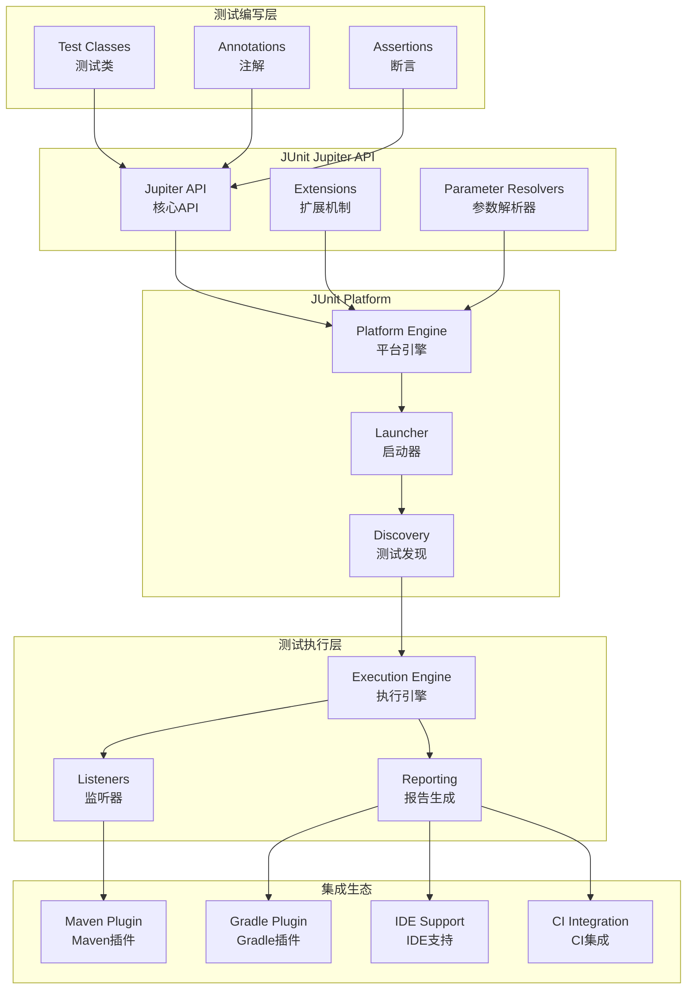

# JUnit 5 企业级单元测试框架深度实践

## 概述 (Overview)

JUnit 5是Java生态系统中最先进的单元测试框架，提供了丰富的注解、扩展机制和现代化的测试功能。本文档从企业级测试专家角度，深入探讨JUnit 5的架构设计、高级特性、测试策略和最佳实践。

JUnit 5 is the most advanced unit testing framework in the Java ecosystem, providing rich annotations, extension mechanisms, and modern testing capabilities. This document explores JUnit 5's architecture design, advanced features, testing strategies, and best practices from an enterprise testing expert perspective.

## 架构设计 (Architecture Design)

### JUnit 5 架构组件 (JUnit 5 Architecture Components)

```java
// JUnit 5 模块化架构
module com.company.testing {
    requires org.junit.jupiter.api;
    requires org.junit.jupiter.engine;
    requires org.junit.platform.commons;
    requires org.junit.platform.engine;
    
    exports com.company.testing.unit;
    exports com.company.testing.integration;
    opens com.company.testing.unit to org.junit.platform.commons;
    opens com.company.testing.integration to org.junit.platform.commons;
}
```

### JUnit 5 架构图 (JUnit 5 Architecture Diagram)



## 核心特性配置 (Core Feature Configuration)

### Maven项目配置 (Maven Project Configuration)

```xml
<!-- pom.xml - JUnit 5 完整配置 -->
<project xmlns="http://maven.apache.org/POM/4.0.0"
         xmlns:xsi="http://www.w3.org/2001/XMLSchema-instance"
         xsi:schemaLocation="http://maven.apache.org/POM/4.0.0 
         http://maven.apache.org/xsd/maven-4.0.0.xsd">
    <modelVersion>4.0.0</modelVersion>
    
    <groupId>com.company</groupId>
    <artifactId>enterprise-testing</artifactId>
    <version>1.0.0</version>
    
    <properties>
        <maven.compiler.source>17</maven.compiler.source>
        <maven.compiler.target>17</maven.compiler.target>
        <project.build.sourceEncoding>UTF-8</project.build.sourceEncoding>
        <junit.version>5.10.1</junit.version>
        <mockito.version>5.7.0</mockito.version>
        <assertj.version>3.24.2</assertj.version>
    </properties>
    
    <dependencies>
        <!-- JUnit 5 Jupiter API -->
        <dependency>
            <groupId>org.junit.jupiter</groupId>
            <artifactId>junit-jupiter-api</artifactId>
            <version>${junit.version}</version>
            <scope>test</scope>
        </dependency>
        
        <!-- JUnit 5 Jupiter Engine -->
        <dependency>
            <groupId>org.junit.jupiter</groupId>
            <artifactId>junit-jupiter-engine</artifactId>
            <version>${junit.version}</version>
            <scope>test</scope>
        </dependency>
        
        <!-- JUnit 5 Vintage Engine (兼容JUnit 4) -->
        <dependency>
            <groupId>org.junit.vintage</groupId>
            <artifactId>junit-vintage-engine</artifactId>
            <version>${junit.version}</version>
            <scope>test</scope>
        </dependency>
        
        <!-- Mockito -->
        <dependency>
            <groupId>org.mockito</groupId>
            <artifactId>mockito-core</artifactId>
            <version>${mockito.version}</version>
            <scope>test</scope>
        </dependency>
        
        <!-- Mockito JUnit Jupiter Extension -->
        <dependency>
            <groupId>org.mockito</groupId>
            <artifactId>mockito-junit-jupiter</artifactId>
            <version>${mockito.version}</version>
            <scope>test</scope>
        </dependency>
        
        <!-- AssertJ -->
        <dependency>
            <groupId>org.assertj</groupId>
            <artifactId>assertj-core</artifactId>
            <version>${assertj.version}</version>
            <scope>test</scope>
        </dependency>
        
        <!-- Testcontainers -->
        <dependency>
            <groupId>org.testcontainers</groupId>
            <artifactId>testcontainers</artifactId>
            <version>1.19.3</version>
            <scope>test</scope>
        </dependency>
        
        <dependency>
            <groupId>org.testcontainers</groupId>
            <artifactId>junit-jupiter</artifactId>
            <version>1.19.3</version>
            <scope>test</scope>
        </dependency>
    </dependencies>
    
    <build>
        <plugins>
            <plugin>
                <groupId>org.apache.maven.plugins</groupId>
                <artifactId>maven-surefire-plugin</artifactId>
                <version>3.2.2</version>
                <configuration>
                    <includes>
                        <include>**/*Test.java</include>
                        <include>**/*Tests.java</include>
                    </includes>
                    <excludes>
                        <exclude>**/integration/**</exclude>
                    </excludes>
                    <properties>
                        <configurationParameters>
                            junit.jupiter.execution.parallel.enabled=true
                            junit.jupiter.execution.parallel.mode.default=concurrent
                            junit.jupiter.execution.parallel.mode.classes.default=concurrent
                        </configurationParameters>
                    </properties>
                </configuration>
            </plugin>
            
            <plugin>
                <groupId>org.apache.maven.plugins</groupId>
                <artifactId>maven-failsafe-plugin</artifactId>
                <version>3.2.2</version>
                <configuration>
                    <includes>
                        <include>**/integration/**/*Test.java</include>
                        <include>**/integration/**/*IT.java</include>
                    </includes>
                </configuration>
                <executions>
                    <execution>
                        <goals>
                            <goal>integration-test</goal>
                            <goal>verify</goal>
                        </goals>
                    </execution>
                </executions>
            </plugin>
        </plugins>
    </build>
</project>
```

### Gradle项目配置 (Gradle Project Configuration)

```gradle
// build.gradle - JUnit 5 Gradle配置
plugins {
    id 'java'
    id 'jacoco'
}

group = 'com.company'
version = '1.0.0'
sourceCompatibility = '17'

repositories {
    mavenCentral()
}

dependencies {
    // JUnit 5 dependencies
    testImplementation 'org.junit.jupiter:junit-jupiter-api:5.10.1'
    testImplementation 'org.junit.jupiter:junit-jupiter-params:5.10.1'
    testRuntimeOnly 'org.junit.jupiter:junit-jupiter-engine:5.10.1'
    testRuntimeOnly 'org.junit.vintage:junit-vintage-engine:5.10.1'
    
    // Mockito
    testImplementation 'org.mockito:mockito-core:5.7.0'
    testImplementation 'org.mockito:mockito-junit-jupiter:5.7.0'
    
    // AssertJ
    testImplementation 'org.assertj:assertj-core:3.24.2'
    
    // Testcontainers
    testImplementation 'org.testcontainers:testcontainers:1.19.3'
    testImplementation 'org.testcontainers:junit-jupiter:1.19.3'
    testImplementation 'org.testcontainers:postgresql:1.19.3'
    
    // Spring Boot Test (如果使用Spring)
    testImplementation 'org.springframework.boot:spring-boot-starter-test'
}

test {
    useJUnitPlatform {
        includeEngines 'junit-jupiter'
        excludeEngines 'junit-vintage'
        includeTags 'fast'
        excludeTags 'slow'
    }
    
    // 并行测试配置
    maxParallelForks = Runtime.runtime.availableProcessors().intdiv(2) ?: 1
    forkEvery = 100
    
    // 测试报告配置
    testLogging {
        events "passed", "skipped", "failed"
        exceptionFormat "full"
        showCauses true
        showExceptions true
        showStackTraces true
    }
    
    // 系统属性传递
    systemProperty 'junit.jupiter.extensions.autodetection.enabled', 'true'
    systemProperty 'junit.jupiter.execution.parallel.enabled', 'true'
}

// 集成测试任务
task integrationTest(type: Test) {
    useJUnitPlatform {
        includeTags 'integration'
    }
    
    shouldRunAfter test
    finalizedBy jacocoTestReport
}

check.dependsOn integrationTest

// JaCoCo代码覆盖率配置
jacoco {
    toolVersion = "0.8.11"
}

jacocoTestReport {
    dependsOn test
    reports {
        xml.required = true
        html.required = true
        csv.required = false
    }
    
    afterEvaluate {
        classDirectories.setFrom(files(classDirectories.files.collect {
            fileTree(dir: it, exclude: [
                '**/*Config.*',
                '**/*Application.*',
                '**/*Dto.*',
                '**/*Entity.*'
            ])
        }))
    }
}
```

## 高级测试特性 (Advanced Testing Features)

### 参数化测试 (Parameterized Tests)

```java
// 参数化测试示例
@DisplayName("Calculator Parameterized Tests")
class CalculatorParameterizedTest {
    
    @ParameterizedTest(name = "Test {index}: {0} + {1} = {2}")
    @CsvSource({
        "1, 2, 3",
        "0, 0, 0",
        "-1, 1, 0",
        "99, 1, 100"
    })
    @DisplayName("Addition with CSV source")
    void testAdditionWithCsvSource(int a, int b, int expected) {
        Calculator calculator = new Calculator();
        assertEquals(expected, calculator.add(a, b));
    }
    
    @ParameterizedTest
    @ValueSource(strings = {"racecar", "radar", "level", "madam"})
    @DisplayName("Palindrome check with ValueSource")
    void testPalindromes(String word) {
        assertTrue(isPalindrome(word));
    }
    
    @ParameterizedTest
    @EnumSource(value = TimeUnit.class, names = {"SECONDS", "MINUTES", "HOURS"})
    @DisplayName("Time unit conversion test")
    void testTimeUnitConversion(TimeUnit unit) {
        assertThat(unit.convert(1, TimeUnit.MILLISECONDS)).isPositive();
    }
    
    @ParameterizedTest
    @MethodSource("provideUserData")
    @DisplayName("User validation test")
    void testUserValidation(User user, boolean expectedValid) {
        UserValidator validator = new UserValidator();
        assertEquals(expectedValid, validator.isValid(user));
    }
    
    static Stream<Arguments> provideUserData() {
        return Stream.of(
            Arguments.of(new User("john", "john@example.com", 25), true),
            Arguments.of(new User("", "invalid-email", -1), false),
            Arguments.of(new User("jane", "jane@example.com", 17), false)
        );
    }
    
    @ParameterizedTest
    @CsvFileSource(resources = "/test-data/calculator-test-data.csv", numLinesToSkip = 1)
    @DisplayName("Addition with CSV file source")
    void testAdditionWithCsvFile(int a, int b, int expected) {
        Calculator calculator = new Calculator();
        assertEquals(expected, calculator.add(a, b));
    }
}
```

### 动态测试 (Dynamic Tests)

```java
// 动态测试示例
@TestFactory
@DisplayName("Dynamic Math Tests")
Stream<DynamicTest> dynamicMathTests() {
    Calculator calculator = new Calculator();
    
    return Stream.of(
        DynamicTest.dynamicTest("Addition test", 
            () -> assertEquals(4, calculator.add(2, 2))),
        DynamicTest.dynamicTest("Subtraction test", 
            () -> assertEquals(2, calculator.subtract(4, 2))),
        DynamicTest.dynamicTest("Multiplication test", 
            () -> assertEquals(6, calculator.multiply(2, 3))),
        DynamicTest.dynamicTest("Division test", 
            () -> assertEquals(2.0, calculator.divide(6, 3)))
    );
}

@TestFactory
@DisplayName("Dynamic Fibonacci Tests")
Collection<DynamicTest> dynamicFibonacciTests() {
    return Arrays.asList(
        DynamicTest.dynamicTest("Fibonacci(0)", () -> assertEquals(0, fibonacci(0))),
        DynamicTest.dynamicTest("Fibonacci(1)", () -> assertEquals(1, fibonacci(1))),
        DynamicTest.dynamicTest("Fibonacci(10)", () -> assertEquals(55, fibonacci(10))),
        DynamicTest.dynamicTest("Fibonacci(20)", () -> assertEquals(6765, fibonacci(20)))
    );
}

@TestFactory
@DisplayName("Dynamic User Validation Tests")
Stream<DynamicNode> dynamicUserValidationTests() {
    UserValidator validator = new UserValidator();
    
    return Stream.of(
        dynamicContainer("Valid Users", 
            Stream.of(
                dynamicTest("Valid adult user", 
                    () -> assertTrue(validator.isValid(new User("John", "john@example.com", 25)))),
                dynamicTest("Valid senior user", 
                    () -> assertTrue(validator.isValid(new User("Jane", "jane@example.com", 65))))
            )
        ),
        dynamicContainer("Invalid Users",
            Stream.of(
                dynamicTest("Empty name user", 
                    () -> assertFalse(validator.isValid(new User("", "test@example.com", 25)))),
                dynamicTest("Invalid email user", 
                    () -> assertFalse(validator.isValid(new User("Test", "invalid-email", 25)))),
                dynamicTest("Minor user", 
                    () -> assertFalse(validator.isValid(new User("Kid", "kid@example.com", 15))))
            )
        )
    );
}
```

### 自定义扩展 (Custom Extensions)

```java
// 自定义测试扩展示例
public class DatabaseExtension implements BeforeEachCallback, AfterEachCallback {
    private static final Logger logger = LoggerFactory.getLogger(DatabaseExtension.class);
    
    @Override
    public void beforeEach(ExtensionContext context) throws Exception {
        logger.info("Setting up database for test: {}", context.getDisplayName());
        
        // 初始化测试数据库
        DatabaseTestUtils.setupTestDatabase();
        
        // 注入测试数据
        DatabaseTestUtils.insertTestData();
    }
    
    @Override
    public void afterEach(ExtensionContext context) throws Exception {
        logger.info("Cleaning up database after test: {}", context.getDisplayName());
        
        // 清理测试数据
        DatabaseTestUtils.cleanupTestData();
        
        // 重置数据库状态
        DatabaseTestUtils.resetDatabase();
    }
}

// 自定义参数解析器
public class UserServiceParameterResolver implements ParameterResolver {
    
    @Override
    public boolean supportsParameter(ParameterContext parameterContext, 
                                   ExtensionContext extensionContext) throws ParameterResolutionException {
        return parameterContext.getParameter().getType() == UserService.class;
    }
    
    @Override
    public Object resolveParameter(ParameterContext parameterContext, 
                                 ExtensionContext extensionContext) throws ParameterResolutionException {
        UserRepository userRepository = Mockito.mock(UserRepository.class);
        EmailService emailService = Mockito.mock(EmailService.class);
        return new UserService(userRepository, emailService);
    }
}

// 条件测试扩展
public class IntegrationTestCondition implements ExecutionCondition {
    
    @Override
    public ConditionEvaluationResult evaluateExecutionCondition(ExtensionContext context) {
        String profile = System.getProperty("spring.profiles.active", "default");
        boolean isIntegrationTest = context.getElement()
            .map(el -> el.isAnnotationPresent(IntegrationTest.class))
            .orElse(false);
            
        if (isIntegrationTest && !"integration".equals(profile)) {
            return ConditionEvaluationResult.disabled(
                "Integration tests are disabled for profile: " + profile);
        }
        
        return ConditionEvaluationResult.enabled("Test execution allowed");
    }
}

// 测试类使用自定义扩展
@ExtendWith({DatabaseExtension.class, UserServiceParameterResolver.class})
@ExtendWith(IntegrationTestCondition.class)
class UserServiceTest {
    
    @Test
    void testCreateUser(@TestInstance.UserService userService) {
        User user = new User("test", "test@example.com", 25);
        User createdUser = userService.createUser(user);
        
        assertThat(createdUser).isNotNull();
        assertThat(createdUser.getId()).isNotNull();
    }
    
    @Test
    @IntegrationTest
    void testIntegrationScenario() {
        // 这个测试只在integration profile下执行
        // ...
    }
}
```

## 测试策略与框架 (Testing Strategy and Framework)

### 测试分层架构 (Test Layered Architecture)

```java
// 测试分层结构示例
package com.company.testing;

// 单元测试层
package com.company.testing.unit;
/**
 * 单元测试 - 测试单个类或方法
 * 运行速度：最快
 * 依赖隔离：完全隔离
 * 覆盖范围：核心业务逻辑
 */

@DisplayName("User Service Unit Tests")
class UserServiceUnitTest {
    
    @Mock
    private UserRepository userRepository;
    
    @Mock
    private EmailService emailService;
    
    @InjectMocks
    private UserService userService;
    
    @BeforeEach
    void setUp() {
        MockitoAnnotations.openMocks(this);
    }
    
    @Test
    @DisplayName("Should create user successfully")
    void testCreateUser() {
        // Given
        User user = new User("john", "john@example.com", 25);
        when(userRepository.save(any(User.class))).thenReturn(user);
        
        // When
        User result = userService.createUser(user);
        
        // Then
        assertThat(result).isNotNull();
        verify(userRepository).save(user);
        verify(emailService).sendWelcomeEmail(user.getEmail());
    }
}

// 集成测试层
package com.company.testing.integration;
/**
 * 集成测试 - 测试多个组件协作
 * 运行速度：中等
 * 依赖隔离：部分隔离
 * 覆盖范围：组件间交互
 */

@SpringBootTest
@Testcontainers
@DisplayName("User Service Integration Tests")
class UserServiceIntegrationTest {
    
    @Container
    static PostgreSQLContainer<?> postgres = new PostgreSQLContainer<>("postgres:15")
            .withDatabaseName("testdb")
            .withUsername("test")
            .withPassword("test");
    
    @Autowired
    private UserService userService;
    
    @Autowired
    private UserRepository userRepository;
    
    @DynamicPropertySource
    static void configureProperties(DynamicPropertyRegistry registry) {
        registry.add("spring.datasource.url", postgres::getJdbcUrl);
        registry.add("spring.datasource.username", postgres::getUsername);
        registry.add("spring.datasource.password", postgres::getPassword);
    }
    
    @Test
    @DisplayName("Should persist user in database")
    void testUserPersistence() {
        // Given
        User user = new User("jane", "jane@example.com", 30);
        
        // When
        User savedUser = userService.createUser(user);
        
        // Then
        assertThat(savedUser.getId()).isNotNull();
        assertThat(userRepository.findById(savedUser.getId())).isPresent();
    }
}

// 端到端测试层
package com.company.testing.e2e;
/**
 * 端到端测试 - 测试完整业务流程
 * 运行速度：较慢
 * 依赖隔离：最少隔离
 * 覆盖范围：完整业务流程
 */

@SpringBootTest(webEnvironment = SpringBootTest.WebEnvironment.RANDOM_PORT)
@AutoConfigureTestDatabase(replace = AutoConfigureTestDatabase.Replace.NONE)
@DisplayName("User Registration End-to-End Tests")
class UserRegistrationE2ETest {
    
    @LocalServerPort
    private int port;
    
    @Autowired
    private TestRestTemplate restTemplate;
    
    @Test
    @DisplayName("Should register user through REST API")
    void testUserRegistrationAPI() {
        // Given
        UserRegistrationRequest request = new UserRegistrationRequest();
        request.setUsername("testuser");
        request.setEmail("test@example.com");
        request.setPassword("password123");
        
        // When
        ResponseEntity<UserRegistrationResponse> response = restTemplate
            .postForEntity("/api/users/register", request, UserRegistrationResponse.class);
        
        // Then
        assertThat(response.getStatusCode()).isEqualTo(HttpStatus.CREATED);
        assertThat(response.getBody()).isNotNull();
        assertThat(response.getBody().getUserId()).isNotNull();
    }
}
```

### 测试数据管理 (Test Data Management)

```java
// 测试数据工厂模式
public class TestDataFactory {
    
    public static class UserBuilder {
        private String username = "testuser";
        private String email = "test@example.com";
        private int age = 25;
        private UserRole role = UserRole.USER;
        
        public UserBuilder withUsername(String username) {
            this.username = username;
            return this;
        }
        
        public UserBuilder withEmail(String email) {
            this.email = email;
            return this;
        }
        
        public UserBuilder withAge(int age) {
            this.age = age;
            return this;
        }
        
        public UserBuilder withRole(UserRole role) {
            this.role = role;
            return this;
        }
        
        public User build() {
            return new User(username, email, age, role);
        }
        
        public User buildValid() {
            return withAge(25).withEmail("valid@example.com").build();
        }
        
        public User buildInvalid() {
            return withAge(-1).withEmail("invalid-email").build();
        }
    }
    
    public static class OrderBuilder {
        private String orderId = UUID.randomUUID().toString();
        private User user;
        private List<OrderItem> items = new ArrayList<>();
        private OrderStatus status = OrderStatus.PENDING;
        
        public OrderBuilder withOrderId(String orderId) {
            this.orderId = orderId;
            return this;
        }
        
        public OrderBuilder withUser(User user) {
            this.user = user;
            return this;
        }
        
        public OrderBuilder withItems(List<OrderItem> items) {
            this.items = items;
            return this;
        }
        
        public OrderBuilder addItem(OrderItem item) {
            this.items.add(item);
            return this;
        }
        
        public OrderBuilder withStatus(OrderStatus status) {
            this.status = status;
            return this;
        }
        
        public Order build() {
            Order order = new Order(orderId, user, items);
            order.setStatus(status);
            return order;
        }
    }
    
    // 预定义的测试数据
    public static final User VALID_USER = new UserBuilder()
        .withUsername("john")
        .withEmail("john@example.com")
        .withAge(30)
        .build();
        
    public static final User INVALID_USER = new UserBuilder()
        .withUsername("")
        .withEmail("invalid")
        .withAge(-1)
        .build();
        
    public static List<User> createMultipleUsers(int count) {
        List<User> users = new ArrayList<>();
        for (int i = 0; i < count; i++) {
            users.add(new UserBuilder()
                .withUsername("user" + i)
                .withEmail("user" + i + "@example.com")
                .withAge(20 + i)
                .build());
        }
        return users;
    }
}
```

## 持续集成配置 (Continuous Integration Configuration)

### GitHub Actions配置 (GitHub Actions Configuration)

```yaml
# .github/workflows/java-ci.yml
name: Java CI with Maven

on:
  push:
    branches: [ main, develop ]
  pull_request:
    branches: [ main ]

jobs:
  build:
    runs-on: ubuntu-latest
    strategy:
      matrix:
        java-version: [ 17, 21 ]
    
    steps:
    - uses: actions/checkout@v4
    
    - name: Set up JDK ${{ matrix.java-version }}
      uses: actions/setup-java@v3
      with:
        java-version: ${{ matrix.java-version }}
        distribution: 'temurin'
        cache: maven
    
    - name: Build with Maven
      run: mvn -B clean verify
    
    - name: Upload Test Results
      uses: actions/upload-artifact@v3
      if: always()
      with:
        name: test-results-${{ matrix.java-version }}
        path: target/surefire-reports/
    
    - name: Upload Coverage Report
      uses: actions/upload-artifact@v3
      if: always()
      with:
        name: coverage-report-${{ matrix.java-version }}
        path: target/site/jacoco/
    
    - name: Publish Test Report
      uses: scacap/action-surefire-report@v1
      if: always()
      with:
        github_token: ${{ secrets.GITHUB_TOKEN }}
        report_paths: '**/surefire-reports/TEST-*.xml'

  integration-test:
    runs-on: ubuntu-latest
    needs: build
    services:
      postgres:
        image: postgres:15
        env:
          POSTGRES_PASSWORD: postgres
          POSTGRES_DB: testdb
        options: >-
          --health-cmd pg_isready
          --health-interval 10s
          --health-timeout 5s
          --health-retries 5
    
    steps:
    - uses: actions/checkout@v4
    
    - name: Set up JDK 17
      uses: actions/setup-java@v3
      with:
        java-version: '17'
        distribution: 'temurin'
        cache: maven
    
    - name: Run Integration Tests
      run: mvn -B verify -Dgroups=integration
      env:
        SPRING_DATASOURCE_URL: jdbc:postgresql://localhost:5432/testdb
        SPRING_DATASOURCE_USERNAME: postgres
        SPRING_DATASOURCE_PASSWORD: postgres
```

## 监控与报告 (Monitoring and Reporting)

### 测试报告配置 (Test Report Configuration)

```java
// 自定义测试监听器
public class CustomTestListener implements TestExecutionListener {
    private static final Logger logger = LoggerFactory.getLogger(CustomTestListener.class);
    private final Map<String, Long> testStartTimes = new ConcurrentHashMap<>();
    
    @Override
    public void testPlanExecutionStarted(TestPlan testPlan) {
        logger.info("=== Test execution started ===");
        logger.info("Total tests: {}", testPlan.countTestIdentifiers(TestIdentifier::isTest));
    }
    
    @Override
    public void executionStarted(TestIdentifier testIdentifier) {
        if (testIdentifier.isTest()) {
            testStartTimes.put(testIdentifier.getUniqueId(), System.currentTimeMillis());
            logger.info("Starting test: {}", testIdentifier.getDisplayName());
        }
    }
    
    @Override
    public void executionFinished(TestIdentifier testIdentifier, TestExecutionResult testExecutionResult) {
        if (testIdentifier.isTest()) {
            long startTime = testStartTimes.getOrDefault(testIdentifier.getUniqueId(), System.currentTimeMillis());
            long duration = System.currentTimeMillis() - startTime;
            
            String status = testExecutionResult.getStatus().name();
            String testName = testIdentifier.getDisplayName();
            
            logger.info("Test {} finished in {}ms with status: {}", testName, duration, status);
            
            if (testExecutionResult.getStatus() == TestExecutionResult.Status.FAILED) {
                testExecutionResult.getThrowable().ifPresent(throwable -> 
                    logger.error("Test failed with exception: ", throwable));
            }
        }
    }
    
    @Override
    public void testPlanExecutionFinished(TestPlan testPlan) {
        logger.info("=== Test execution finished ===");
    }
}

// 测试指标收集
@Component
public class TestMetricsCollector {
    private final MeterRegistry meterRegistry;
    private final Timer.Sample currentSample;
    private final Counter testCounter;
    private final Counter failureCounter;
    
    public TestMetricsCollector(MeterRegistry meterRegistry) {
        this.meterRegistry = meterRegistry;
        this.testCounter = Counter.builder("test.executions.total")
            .description("Total number of test executions")
            .register(meterRegistry);
        this.failureCounter = Counter.builder("test.failures.total")
            .description("Total number of test failures")
            .register(meterRegistry);
    }
    
    @EventListener
    public void handleTestStarted(TestStartedEvent event) {
        testCounter.increment();
        currentSample = Timer.start(meterRegistry);
    }
    
    @EventListener
    public void handleTestFinished(TestFinishedEvent event) {
        if (currentSample != null) {
            currentSample.stop(Timer.builder("test.duration")
                .description("Test execution duration")
                .register(meterRegistry));
        }
    }
    
    @EventListener
    public void handleTestFailed(TestFailedEvent event) {
        failureCounter.increment();
    }
}
```

## 运维管理 (Operational Management)

### 故障排查工具 (Troubleshooting Tools)

```bash
#!/bin/bash
# JUnit 5 故障排查脚本

# 测试执行诊断
diagnose_test_execution() {
    echo "=== Test Execution Diagnosis ==="
    
    # 检查测试类路径
    mvn dependency:build-classpath -Dmdep.outputFile=/tmp/classpath.txt
    echo "Classpath: $(cat /tmp/classpath.txt)"
    
    # 运行单个测试类
    local test_class=$1
    mvn test -Dtest=$test_class -X 2>&1 | tee /tmp/test-debug.log
    
    # 分析失败原因
    if [ ${PIPESTATUS[0]} -ne 0 ]; then
        echo "Test execution failed. Analyzing logs..."
        grep -A 10 -B 10 "ERROR\|FAIL\|Exception" /tmp/test-debug.log
    fi
}

# 性能分析
performance_analysis() {
    echo "=== Performance Analysis ==="
    
    # 运行测试并收集性能数据
    mvn test -Djunit.jupiter.execution.parallel.enabled=false \
             -Djunit.jupiter.execution.timeout.default=30s \
             -DargLine="-XX:+PrintGCDetails -XX:+PrintGCTimeStamps"
    
    # 分析测试执行时间
    find target/surefire-reports -name "*.xml" -exec xmlstarlet sel -t -v "//testcase/@time" {} \; | \
    awk '{sum+=$1; count++} END {print "Average test time:", sum/count, "seconds"}'
    
    # 检查内存使用
    jstat -gc $(jps -l | grep surefirebooter | awk '{print $1}') 1s 5
}

# 依赖冲突检查
check_dependency_conflicts() {
    echo "=== Dependency Conflict Check ==="
    
    # 检查JUnit版本冲突
    mvn dependency:tree | grep -E "(junit|jupiter|platform)"
    
    # 检查测试范围依赖
    mvn dependency:tree -Dscope=test
    
    # 生成依赖分析报告
    mvn dependency:analyze-only
}
```

### 日常运维脚本 (Daily Operations Scripts)

```bash
#!/bin/bash
# JUnit 5 日常运维脚本

# 自动化测试套件执行
run_test_suite() {
    echo "Running automated test suite..."
    
    local profile=${1:-"development"}
    local test_type=${2:-"all"}
    
    case $test_type in
        "unit")
            mvn test -P$profile
            ;;
        "integration")
            mvn verify -P$profile -Dgroups=integration
            ;;
        "all")
            mvn verify -P$profile
            ;;
        *)
            echo "Unknown test type: $test_type"
            return 1
            ;;
    esac
    
    # 检查测试结果
    if [ $? -eq 0 ]; then
        echo "✓ All tests passed"
        return 0
    else
        echo "✗ Some tests failed"
        return 1
    fi
}

# 代码覆盖率报告生成
generate_coverage_report() {
    echo "Generating code coverage report..."
    
    # 运行带覆盖率的测试
    mvn clean test jacoco:report
    
    # 生成HTML报告
    local report_dir="target/site/jacoco"
    if [ -d "$report_dir" ]; then
        echo "Coverage report generated at: $report_dir/index.html"
        
        # 检查覆盖率阈值
        local min_coverage=${1:-80}
        local actual_coverage=$(xmlstarlet sel -t -v "//counter[@type='LINE']/@covered" $report_dir/jacoco.xml)
        local total_lines=$(xmlstarlet sel -t -v "//counter[@type='LINE']/@missed" $report_dir/jacoco.xml)
        local coverage_percent=$((actual_coverage * 100 / (actual_coverage + total_lines)))
        
        echo "Current coverage: ${coverage_percent}%"
        if [ $coverage_percent -lt $min_coverage ]; then
            echo "⚠ Coverage below threshold (${min_coverage}%)"
            return 1
        else
            echo "✓ Coverage meets threshold"
            return 0
        fi
    fi
}

# 测试环境健康检查
test_environment_health() {
    echo "Performing test environment health check..."
    
    # 检查Java版本
    java -version 2>&1 | head -1
    
    # 检查Maven版本
    mvn --version | head -1
    
    # 检查必要服务
    for service in postgresql redis; do
        if systemctl is-active --quiet $service; then
            echo "✓ $service is running"
        else
            echo "✗ $service is not running"
        fi
    done
    
    # 检查磁盘空间
    local disk_usage=$(df / | tail -1 | awk '{print $5}' | sed 's/%//')
    if [ $disk_usage -gt 80 ]; then
        echo "⚠ Disk usage is high: ${disk_usage}%"
    else
        echo "✓ Disk usage is normal: ${disk_usage}%"
    fi
}
```

## 最佳实践 (Best Practices)

### 测试设计最佳实践 (Test Design Best Practices)

1. **测试命名规范**
   ```java
   // 好的测试命名
   @Test
   @DisplayName("Should create user with valid credentials")
   void testCreateUserWithValidCredentials() { /* ... */ }
   
   @Test
   @DisplayName("Should throw exception when email is invalid")
   void testThrowExceptionWhenEmailIsInvalid() { /* ... */ }
   
   // 避免的命名
   @Test
   void test1() { /* ... */ }
   @Test
   void createUser() { /* ... */ }
   ```

2. **AAA模式 (Arrange-Act-Assert)**
   ```java
   @Test
   void testUserCreation() {
       // Arrange (准备)
       User user = new User("john", "john@example.com", 25);
       when(userRepository.save(any(User.class))).thenReturn(user);
       
       // Act (执行)
       User result = userService.createUser(user);
       
       // Assert (断言)
       assertThat(result).isNotNull();
       assertThat(result.getUsername()).isEqualTo("john");
       verify(userRepository).save(user);
   }
   ```

3. **测试独立性**
   ```java
   @Test
   void testIndependentOperation1() {
       // 每个测试都应该独立，不依赖其他测试的状态
   }
   
   @Test
   void testIndependentOperation2() {
       // 这个测试不应该依赖上面测试的结果
   }
   ```

### 基础设施最佳实践 (Infrastructure Best Practices)

1. **测试配置管理**
   ```properties
   # application-test.properties
   # 测试环境专用配置
   spring.datasource.url=jdbc:h2:mem:testdb
   spring.datasource.driver-class-name=org.h2.Driver
   spring.jpa.hibernate.ddl-auto=create-drop
   logging.level.com.company=DEBUG
   ```

2. **资源管理**
   ```java
   @Testcontainers
   class DatabaseTest {
       @Container
       static PostgreSQLContainer<?> postgres = new PostgreSQLContainer<>("postgres:15")
               .withDatabaseName("testdb")
               .withUsername("test")
               .withPassword("test")
               .withReuse(true);  // 重用容器提高性能
   }
   ```

3. **并行测试执行**
   ```xml
   <!-- pom.xml 配置 -->
   <configuration>
       <properties>
           <configurationParameters>
               junit.jupiter.execution.parallel.enabled=true
               junit.jupiter.execution.parallel.mode.default=concurrent
               junit.jupiter.execution.parallel.mode.classes.default=concurrent
           </configurationParameters>
       </properties>
   </configuration>
   ```

### 质量保证最佳实践 (Quality Assurance Best Practices)

1. **测试覆盖率目标**
   ```xml
   <!-- JaCoCo配置 -->
   <configuration>
       <rules>
           <rule>
               <element>BUNDLE</element>
               <limits>
                   <limit>
                       <counter>LINE</counter>
                       <value>COVEREDRATIO</value>
                       <minimum>0.80</minimum>
                   </limit>
                   <limit>
                       <counter>BRANCH</counter>
                       <value>COVEREDRATIO</value>
                       <minimum>0.70</minimum>
                   </limit>
               </limits>
           </rule>
       </rules>
   </configuration>
   ```

2. **执行频率策略**
   ```bash
   # 不同类型测试的执行频率
   # 单元测试: 每次提交
   # 集成测试: 每日构建
   # 端到端测试: 每周执行
   # 性能测试: 每月执行
   ```

3. **报告和度量**
   - 测试通过率 > 95%
   - 平均修复时间 < 24小时
   - 测试执行时间 < 30分钟
   - 代码覆盖率 > 80%

---

**文档版本**: v1.0  
**最后更新**: 2024年2月7日  
**适用版本**: JUnit 5.10+