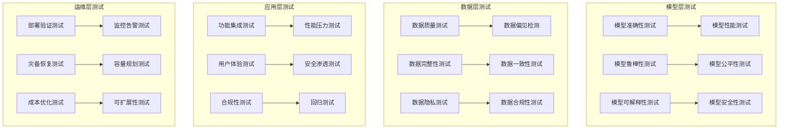

# 企业级AI测试与质量保障深度实践

> **作者**: 企业级测试架构专家 | **版本**: v1.0 | **更新时间**: 2026-02-07
> **适用场景**: 企业级AI系统测试与质量保障 | **复杂度**: ⭐⭐⭐⭐⭐

## 🎯 摘要

本文档深入探讨企业级AI系统测试策略、自动化测试框架和质量保障体系，基于大模型、机器学习平台等AI系统的实践经验，提供从模型验证到系统集成的完整测试技术指南。

## 1. AI系统测试架构

### 1.1 测试层次设计



### 1.2 智能测试框架

```python
# ai-test-framework.py
import unittest
import pytest
import numpy as np
import pandas as pd
from sklearn.metrics import accuracy_score, precision_recall_fscore_support
from typing import Dict, List, Tuple, Any
import json
import time
from datetime import datetime

class AITestFramework:
    def __init__(self):
        self.test_results = {}
        self.model_registry = {}
        self.test_datasets = {}
        
    def register_model(self, model_name: str, model_obj: Any, metadata: Dict):
        """注册待测试模型"""
        self.model_registry[model_name] = {
            'model': model_obj,
            'metadata': metadata,
            'registration_time': datetime.now().isoformat()
        }
        
    def load_test_dataset(self, dataset_name: str, data: pd.DataFrame, labels: List = None):
        """加载测试数据集"""
        self.test_datasets[dataset_name] = {
            'data': data,
            'labels': labels,
            'loaded_time': datetime.now().isoformat()
        }
    
    def model_accuracy_test(self, model_name: str, dataset_name: str, 
                          threshold: float = 0.8) -> Dict:
        """模型准确性测试"""
        if model_name not in self.model_registry:
            raise ValueError(f"Model {model_name} not registered")
            
        if dataset_name not in self.test_datasets:
            raise ValueError(f"Dataset {dataset_name} not loaded")
            
        model = self.model_registry[model_name]['model']
        test_data = self.test_datasets[dataset_name]['data']
        test_labels = self.test_datasets[dataset_name]['labels']
        
        # 执行预测
        start_time = time.time()
        predictions = model.predict(test_data)
        inference_time = time.time() - start_time
        
        # 计算准确性指标
        accuracy = accuracy_score(test_labels, predictions)
        precision, recall, f1, _ = precision_recall_fscore_support(
            test_labels, predictions, average='weighted'
        )
        
        # 生成详细报告
        test_result = {
            'test_name': 'model_accuracy_test',
            'model_name': model_name,
            'dataset_name': dataset_name,
            'timestamp': datetime.now().isoformat(),
            'metrics': {
                'accuracy': round(accuracy, 4),
                'precision': round(precision, 4),
                'recall': round(recall, 4),
                'f1_score': round(f1, 4),
                'inference_time_per_sample': round(inference_time / len(test_data), 6)
            },
            'passed': accuracy >= threshold,
            'threshold': threshold,
            'details': {
                'total_samples': len(test_data),
                'correct_predictions': int(accuracy * len(test_data)),
                'incorrect_predictions': int((1 - accuracy) * len(test_data))
            }
        }
        
        self._store_test_result(model_name, 'accuracy', test_result)
        return test_result
    
    def model_robustness_test(self, model_name: str, dataset_name: str,
                            noise_levels: List[float] = [0.1, 0.2, 0.3]) -> Dict:
        """模型鲁棒性测试"""
        if model_name not in self.model_registry:
            raise ValueError(f"Model {model_name} not registered")
            
        model = self.model_registry[model_name]['model']
        test_data = self.test_datasets[dataset_name]['data']
        test_labels = self.test_datasets[dataset_name]['labels']
        
        robustness_results = []
        
        for noise_level in noise_levels:
            # 添加噪声
            noisy_data = self._add_noise(test_data, noise_level)
            
            # 执行预测
            predictions = model.predict(noisy_data)
            accuracy = accuracy_score(test_labels, predictions)
            
            robustness_results.append({
                'noise_level': noise_level,
                'accuracy': round(accuracy, 4),
                'degradation': round(1 - accuracy, 4)
            })
        
        # 计算鲁棒性指标
        baseline_accuracy = robustness_results[0]['accuracy']
        avg_degradation = np.mean([r['degradation'] for r in robustness_results])
        
        test_result = {
            'test_name': 'model_robustness_test',
            'model_name': model_name,
            'timestamp': datetime.now().isoformat(),
            'noise_test_results': robustness_results,
            'robustness_metrics': {
                'baseline_accuracy': baseline_accuracy,
                'average_degradation': round(avg_degradation, 4),
                'robustness_score': round(1 - avg_degradation, 4)
            },
            'passed': avg_degradation < 0.2,  # 退化小于20%认为通过
            'details': {
                'tested_noise_levels': noise_levels,
                'total_test_cases': len(noise_levels)
            }
        }
        
        self._store_test_result(model_name, 'robustness', test_result)
        return test_result
    
    def bias_detection_test(self, model_name: str, dataset_name: str,
                          protected_attributes: List[str]) -> Dict:
        """偏见检测测试"""
        model = self.model_registry[model_name]['model']
        test_data = self.test_datasets[dataset_name]['data']
        test_labels = self.test_datasets[dataset_name]['labels']
        
        bias_results = {}
        
        for attribute in protected_attributes:
            if attribute in test_data.columns:
                # 按属性分组分析
                grouped_results = {}
                
                for attr_value in test_data[attribute].unique():
                    mask = test_data[attribute] == attr_value
                    subset_data = test_data[mask]
                    subset_labels = [test_labels[i] for i in range(len(test_labels)) if mask.iloc[i]]
                    
                    if len(subset_labels) > 0:
                        subset_predictions = model.predict(subset_data)
                        subset_accuracy = accuracy_score(subset_labels, subset_predictions)
                        
                        grouped_results[attr_value] = {
                            'sample_count': len(subset_labels),
                            'accuracy': round(subset_accuracy, 4)
                        }
                
                # 计算偏差指标
                accuracies = [result['accuracy'] for result in grouped_results.values()]
                max_diff = max(accuracies) - min(accuracies) if accuracies else 0
                
                bias_results[attribute] = {
                    'group_results': grouped_results,
                    'bias_metrics': {
                        'max_accuracy_difference': round(max_diff, 4),
                        'fairness_score': round(1 - max_diff, 4)
                    },
                    'passed': max_diff < 0.1  # 差异小于10%认为公平
                }
        
        test_result = {
            'test_name': 'bias_detection_test',
            'model_name': model_name,
            'timestamp': datetime.now().isoformat(),
            'bias_analysis': bias_results,
            'overall_passed': all(result['passed'] for result in bias_results.values()),
            'recommendations': self._generate_bias_recommendations(bias_results)
        }
        
        self._store_test_result(model_name, 'bias', test_result)
        return test_result
    
    def adversarial_attack_test(self, model_name: str, dataset_name: str,
                              attack_types: List[str] = ['fgsm', 'pgd']) -> Dict:
        """对抗攻击测试"""
        # 这里简化实现，实际应该使用专门的对抗攻击库
        model = self.model_registry[model_name]['model']
        test_data = self.test_datasets[dataset_name]['data']
        test_labels = self.test_datasets[dataset_name]['labels']
        
        attack_results = {}
        
        for attack_type in attack_types:
            # 生成对抗样本（简化版本）
            adversarial_samples = self._generate_adversarial_examples(
                model, test_data, test_labels, attack_type
            )
            
            # 测试模型对对抗样本的鲁棒性
            adv_predictions = model.predict(adversarial_samples)
            adv_accuracy = accuracy_score(test_labels, adv_predictions)
            
            attack_results[attack_type] = {
                'attack_success_rate': round(1 - adv_accuracy, 4),
                'model_accuracy_under_attack': round(adv_accuracy, 4),
                'passed': adv_accuracy > 0.7  # 攻击后准确率仍高于70%认为通过
            }
        
        test_result = {
            'test_name': 'adversarial_attack_test',
            'model_name': model_name,
            'timestamp': datetime.now().isoformat(),
            'attack_results': attack_results,
            'security_score': round(np.mean([r['model_accuracy_under_attack'] 
                                           for r in attack_results.values()]), 4),
            'overall_passed': all(result['passed'] for result in attack_results.values())
        }
        
        self._store_test_result(model_name, 'adversarial', test_result)
        return test_result
    
    def generate_test_report(self, model_name: str) -> Dict:
        """生成综合测试报告"""
        if model_name not in self.test_results:
            return {'error': f'No test results found for model: {model_name}'}
            
        model_tests = self.test_results[model_name]
        all_passed = all(test['passed'] for test in model_tests.values())
        
        report = {
            'model_name': model_name,
            'report_generated': datetime.now().isoformat(),
            'model_metadata': self.model_registry[model_name]['metadata'],
            'test_summary': {
                'total_tests': len(model_tests),
                'passed_tests': sum(1 for test in model_tests.values() if test['passed']),
                'failed_tests': sum(1 for test in model_tests.values() if not test['passed']),
                'overall_status': 'PASSED' if all_passed else 'FAILED'
            },
            'detailed_results': model_tests,
            'quality_score': self._calculate_quality_score(model_tests),
            'recommendations': self._generate_final_recommendations(model_tests)
        }
        
        return report
    
    def _add_noise(self, data: pd.DataFrame, noise_level: float) -> pd.DataFrame:
        """向数据添加噪声"""
        noisy_data = data.copy()
        numeric_columns = noisy_data.select_dtypes(include=[np.number]).columns
        
        for col in numeric_columns:
            noise = np.random.normal(0, noise_level * noisy_data[col].std(), len(noisy_data))
            noisy_data[col] = noisy_data[col] + noise
            
        return noisy_data
    
    def _generate_adversarial_examples(self, model: Any, data: pd.DataFrame, 
                                     labels: List, attack_type: str) -> pd.DataFrame:
        """生成对抗样本（简化实现）"""
        # 实际应用中应该使用专业的对抗攻击库如ART、Foolbox等
        adversarial_data = data.copy()
        
        if attack_type == 'fgsm':
            # 简化的FGSM实现
            epsilon = 0.1
            for col in adversarial_data.columns:
                if adversarial_data[col].dtype in ['int64', 'float64']:
                    adversarial_data[col] = adversarial_data[col] + np.random.uniform(
                        -epsilon, epsilon, len(adversarial_data)
                    )
        
        return adversarial_data
    
    def _store_test_result(self, model_name: str, test_type: str, result: Dict):
        """存储测试结果"""
        if model_name not in self.test_results:
            self.test_results[model_name] = {}
        self.test_results[model_name][test_type] = result
    
    def _calculate_quality_score(self, test_results: Dict) -> float:
        """计算综合质量分数"""
        scores = []
        weights = {
            'accuracy': 0.4,
            'robustness': 0.25,
            'bias': 0.2,
            'adversarial': 0.15
        }
        
        for test_type, weight in weights.items():
            if test_type in test_results:
                score = 1.0 if test_results[test_type]['passed'] else 0.0
                scores.append(score * weight)
        
        return round(sum(scores), 4)
    
    def _generate_bias_recommendations(self, bias_results: Dict) -> List[str]:
        """生成偏见缓解建议"""
        recommendations = []
        
        for attribute, result in bias_results.items():
            if not result['passed']:
                max_diff = result['bias_metrics']['max_accuracy_difference']
                recommendations.append(
                    f"属性 '{attribute}' 存在偏见问题，最大准确率差异达到 {max_diff:.2%}，"
                    f"建议检查训练数据分布和特征工程"
                )
        
        return recommendations
    
    def _generate_final_recommendations(self, test_results: Dict) -> List[str]:
        """生成最终建议"""
        recommendations = []
        
        if not test_results.get('accuracy', {}).get('passed', True):
            recommendations.append("模型准确性未达标，建议重新训练或调整超参数")
        
        if not test_results.get('robustness', {}).get('passed', True):
            recommendations.append("模型鲁棒性不足，建议增加数据增强和正则化")
        
        if not test_results.get('bias', {}).get('passed', True):
            recommendations.append("模型存在偏见问题，建议进行公平性优化")
        
        if not test_results.get('adversarial', {}).get('passed', True):
            recommendations.append("模型安全性不足，建议实施对抗训练")
        
        if not recommendations:
            recommendations.append("模型质量良好，可以进入生产环境")
        
        return recommendations

# 使用示例
framework = AITestFramework()

# 注册模型和数据
# framework.register_model("chatbot_model", model_obj, {"version": "1.0", "type": "NLP"})
# framework.load_test_dataset("validation_data", test_df, test_labels)

# 执行各类测试
# accuracy_result = framework.model_accuracy_test("chatbot_model", "validation_data")
# robustness_result = framework.model_robustness_test("chatbot_model", "validation_data")
# bias_result = framework.bias_detection_test("chatbot_model", "validation_data", ["gender", "age"])
# adversarial_result = framework.adversarial_attack_test("chatbot_model", "validation_data")

# 生成报告
# report = framework.generate_test_report("chatbot_model")
# print(json.dumps(report, indent=2, ensure_ascii=False))
```

通过以上企业级AI测试与质量保障深度实践，企业可以建立完善的AI系统测试体系，确保AI产品的质量和可靠性。