# Cypress Enterprise Automation Testing 深度实践

> **Author**: Test Automation Architect | **Version**: v1.0 | **Update Time**: 2026-02-07
> **Scenario**: Enterprise-grade end-to-end testing automation with Cypress | **Complexity**: ⭐⭐⭐⭐

## 🎯 Abstract

This document provides comprehensive exploration of Cypress enterprise deployment architecture, test automation frameworks, and quality assurance practices. Based on large-scale production environment experience, it offers complete technical guidance from test suite setup to advanced testing patterns, helping enterprises build robust, maintainable end-to-end testing pipelines with integrated reporting, parallel execution, and continuous integration capabilities for web applications and microservices.

## 1. Cypress Enterprise Architecture

### 1.1 Core Component Architecture

```mermaid
graph TB
    subgraph "Test Framework Layer"
        A[Cypress Test Runner]
        B[Test Configuration]
        C[Plugin System]
        D[Custom Commands]
        E[Page Objects]
    end
    
    subgraph "Test Execution Layer"
        F[Headless Execution]
        G[Interactive Mode]
        H[Parallel Testing]
        I[Cross-browser Testing]
        J[Mobile Testing]
    end
    
    subgraph "Test Data Management"
        K[Test Data Generation]
        L[Fake Data Libraries]
        M[Database Seeding]
        N[API Mocking]
        O[Test Environment Setup]
    end
    
    subgraph "Reporting & Analytics"
        P[Test Reports]
        Q[Screenshots/Videos]
        R[Performance Metrics]
        S[Flaky Test Detection]
        T[Trend Analysis]
    end
    
    subgraph "CI/CD Integration"
        U[GitHub Actions]
        V[Jenkins Pipeline]
        W[GitLab CI]
        X[Azure DevOps]
        Y[CircleCI]
    end
    
    subgraph "Quality Assurance"
        Z[Code Coverage]
        AA[Accessibility Testing]
        AB[Visual Regression]
        AC[Security Testing]
        AD[Performance Testing]
    end
    
    A --> B
    B --> C
    C --> D
    D --> E
    
    F --> G
    G --> H
    H --> I
    I --> J
    
    K --> L
    L --> M
    M --> N
    N --> O
    
    P --> Q
    Q --> R
    R --> S
    S --> T
    
    U --> V
    V --> W
    W --> X
    X --> Y
    
    Z --> AA
    AA --> AB
    AB --> AC
    AC --> AD
```



### 1.2 Enterprise Test Suite Architecture

```yaml
cypress_enterprise_suite:
  project_structure:
    cypress:
      fixtures:
        users.json
        products.json
        test-data.yml
      integration:
        authentication/
          login.spec.js
          logout.spec.js
          password-reset.spec.js
        dashboard/
          navigation.spec.js
          widgets.spec.js
          reports.spec.js
        forms/
          user-registration.spec.js
          data-entry.spec.js
          validation.spec.js
        api/
          rest-api.spec.js
          graphql-api.spec.js
          websocket.spec.js
      e2e:
        smoke-tests/
          critical-path.spec.js
        regression-tests/
          full-suite.spec.js
        performance-tests/
          load-testing.spec.js
      component/
        ui-components/
          button.spec.js
          form.spec.js
          modal.spec.js
      support:
        commands.js
        index.js
        selectors.js
        utils.js
      plugins:
        index.js
        database.js
        api-mocking.js
        reporting.js
      downloads/
      screenshots/
      videos/
  
  configuration:
    cypress.config.js:
      e2e:
        baseUrl: "https://app.company.com"
        specPattern: "cypress/e2e/**/*.spec.{js,jsx,ts,tsx}"
        excludeSpecPattern: "*.skip.js"
        supportFile: "cypress/support/e2e.js"
        experimentalStudio: true
        experimentalWebKitSupport: true
        experimentalRunAllSpecs: true
      
      component:
        devServer:
          framework: "react"
          bundler: "webpack"
        specPattern: "cypress/component/**/*.spec.{js,jsx,ts,tsx}"
      
      viewportWidth: 1920
      viewportHeight: 1080
      defaultCommandTimeout: 10000
      pageLoadTimeout: 60000
      requestTimeout: 15000
      responseTimeout: 30000
      execTimeout: 60000
      taskTimeout: 60000
      
      retries:
        runMode: 2
        openMode: 0
      
      env:
        environment: "production"
        apiBaseUrl: "https://api.company.com"
        authUrl: "https://auth.company.com"
        testUser: "testuser@company.com"
        testPassword: "${CYPRESS_TEST_PASSWORD}"
      
      chromeWebSecurity: false
      experimentalSourceRewriting: false
      experimentalModifyObstructiveThirdPartyCode: false
      
      projectId: "company-test-suite"
      
      reporter: "junit"
      reporterOptions:
        mochaFile: "results/test-output-[hash].xml"
        toConsole: true
      
      video: true
      videoUploadOnPasses: false
      screenshotOnRunFailure: true
      trashAssetsBeforeRuns: true
      
      numTestsKeptInMemory: 50
      watchForFileChanges: true
      waitForAnimations: true
      animationDistanceThreshold: 5
      scrollBehavior: "center"
```

## 2. Advanced Test Automation Framework

### 2.1 Page Object Model Implementation

```javascript
// Page Objects for Enterprise Application

// Base Page Class
class BasePage {
  constructor() {
    this.timeout = 10000;
  }

  visit(url) {
    cy.visit(url, { timeout: this.timeout });
    return this;
  }

  waitForElement(selector, timeout = this.timeout) {
    cy.get(selector, { timeout }).should('be.visible');
    return this;
  }

  clickElement(selector) {
    cy.get(selector).click({ force: true });
    return this;
  }

  typeText(selector, text) {
    cy.get(selector).type(text, { delay: 100 });
    return this;
  }

  selectDropdown(selector, value) {
    cy.get(selector).select(value);
    return this;
  }

  assertElementContainsText(selector, expectedText) {
    cy.get(selector).should('contain.text', expectedText);
    return this;
  }

  assertElementExists(selector) {
    cy.get(selector).should('exist');
    return this;
  }

  takeScreenshot(name) {
    cy.screenshot(name);
    return this;
  }
}

// Authentication Page Object
class LoginPage extends BasePage {
  constructor() {
    super();
    this.selectors = {
      usernameInput: '[data-testid="username-input"]',
      passwordInput: '[data-testid="password-input"]',
      loginButton: '[data-testid="login-button"]',
      errorMessage: '[data-testid="error-message"]',
      forgotPasswordLink: '[data-testid="forgot-password"]',
      rememberMeCheckbox: '[data-testid="remember-me"]'
    };
  }

  login(username, password) {
    this.typeText(this.selectors.usernameInput, username)
        .typeText(this.selectors.passwordInput, password)
        .clickElement(this.selectors.loginButton);
    return new DashboardPage();
  }

  loginWithRememberMe(username, password) {
    this.typeText(this.selectors.usernameInput, username)
        .typeText(this.selectors.passwordInput, password)
        .clickElement(this.selectors.rememberMeCheckbox)
        .clickElement(this.selectors.loginButton);
    return new DashboardPage();
  }

  forgotPassword() {
    this.clickElement(this.selectors.forgotPasswordLink);
    return new ForgotPasswordPage();
  }

  assertLoginError(message) {
    this.assertElementContainsText(this.selectors.errorMessage, message);
    return this;
  }
}

// Dashboard Page Object
class DashboardPage extends BasePage {
  constructor() {
    super();
    this.selectors = {
      welcomeMessage: '[data-testid="welcome-message"]',
      userProfile: '[data-testid="user-profile"]',
      logoutButton: '[data-testid="logout-button"]',
      navigationMenu: '[data-testid="navigation-menu"]',
      dashboardWidgets: '[data-testid="dashboard-widget"]',
      notifications: '[data-testid="notifications"]'
    };
  }

  assertWelcomeMessage(expectedUser) {
    this.assertElementContainsText(this.selectors.welcomeMessage, `Welcome, ${expectedUser}`);
    return this;
  }

  openUserProfile() {
    this.clickElement(this.selectors.userProfile);
    return new UserProfilePage();
  }

  logout() {
    this.clickElement(this.selectors.logoutButton);
    return new LoginPage();
  }

  navigateTo(section) {
    cy.get(this.selectors.navigationMenu)
      .contains(section)
      .click();
    return this;
  }

  getWidgetCount() {
    return cy.get(this.selectors.dashboardWidgets).its('length');
  }
}

// User Profile Page Object
class UserProfilePage extends BasePage {
  constructor() {
    super();
    this.selectors = {
      firstNameInput: '[data-testid="first-name"]',
      lastNameInput: '[data-testid="last-name"]',
      emailInput: '[data-testid="email"]',
      phoneInput: '[data-testid="phone"]',
      saveButton: '[data-testid="save-profile"]',
      cancelButton: '[data-testid="cancel"]',
      successMessage: '[data-testid="success-message"]'
    };
  }

  updateProfile(userData) {
    if (userData.firstName) {
      this.typeText(this.selectors.firstNameInput, userData.firstName);
    }
    if (userData.lastName) {
      this.typeText(this.selectors.lastNameInput, userData.lastName);
    }
    if (userData.email) {
      this.typeText(this.selectors.emailInput, userData.email);
    }
    if (userData.phone) {
      this.typeText(this.selectors.phoneInput, userData.phone);
    }
    
    this.clickElement(this.selectors.saveButton);
    return this;
  }

  assertSuccessMessage() {
    this.assertElementContainsText(this.selectors.successMessage, 'Profile updated successfully');
    return this;
  }
}

// Forgot Password Page Object
class ForgotPasswordPage extends BasePage {
  constructor() {
    super();
    this.selectors = {
      emailInput: '[data-testid="email-input"]',
      submitButton: '[data-testid="submit-button"]',
      successMessage: '[data-testid="success-message"]',
      errorMessage: '[data-testid="error-message"]'
    };
  }

  requestPasswordReset(email) {
    this.typeText(this.selectors.emailInput, email)
        .clickElement(this.selectors.submitButton);
    return this;
  }

  assertSuccessMessage() {
    this.assertElementContainsText(this.selectors.successMessage, 'Password reset email sent');
    return this;
  }
}

// Export page objects
module.exports = {
  BasePage,
  LoginPage,
  DashboardPage,
  UserProfilePage,
  ForgotPasswordPage
};
```

### 2.2 Custom Commands and Utilities

```javascript
// cypress/support/commands.js

// Authentication Commands
Cypress.Commands.add('login', (username, password) => {
  cy.session([username, password], () => {
    cy.visit('/login');
    cy.get('[data-testid="username-input"]').type(username);
    cy.get('[data-testid="password-input"]').type(password);
    cy.get('[data-testid="login-button"]').click();
    cy.get('[data-testid="welcome-message"]').should('contain.text', `Welcome, ${username}`);
  }, {
    cacheAcrossSpecs: true
  });
});

Cypress.Commands.add('logout', () => {
  cy.get('[data-testid="user-profile"]').click();
  cy.get('[data-testid="logout-button"]').click();
  cy.get('[data-testid="login-button"]').should('be.visible');
});

// API Testing Commands
Cypress.Commands.add('apiLogin', (username, password) => {
  cy.request({
    method: 'POST',
    url: `${Cypress.env('apiBaseUrl')}/auth/login`,
    body: {
      username: username,
      password: password
    },
    failOnStatusCode: false
  }).then((response) => {
    if (response.status === 200) {
      window.localStorage.setItem('authToken', response.body.token);
      window.localStorage.setItem('userId', response.body.userId);
    }
    return response;
  });
});

Cypress.Commands.add('apiRequest', (method, url, body = null, headers = {}) => {
  const defaultHeaders = {
    'Authorization': `Bearer ${window.localStorage.getItem('authToken')}`,
    'Content-Type': 'application/json'
  };

  return cy.request({
    method: method,
    url: `${Cypress.env('apiBaseUrl')}${url}`,
    headers: { ...defaultHeaders, ...headers },
    body: body,
    failOnStatusCode: false
  });
});

// Database Commands
Cypress.Commands.add('seedDatabase', (fixtureName) => {
  cy.task('seedDatabase', fixtureName);
});

Cypress.Commands.add('resetDatabase', () => {
  cy.task('resetDatabase');
});

// Utility Commands
Cypress.Commands.add('generateRandomEmail', () => {
  const randomString = Math.random().toString(36).substring(2, 15);
  return `${randomString}@test.company.com`;
});

Cypress.Commands.add('generateRandomString', (length = 10) => {
  const characters = 'ABCDEFGHIJKLMNOPQRSTUVWXYZabcdefghijklmnopqrstuvwxyz0123456789';
  let result = '';
  for (let i = 0; i < length; i++) {
    result += characters.charAt(Math.floor(Math.random() * characters.length));
  }
  return result;
});

Cypress.Commands.add('waitForLoadingSpinner', (timeout = 10000) => {
  cy.get('[data-testid="loading-spinner"]', { timeout }).should('not.exist');
});

Cypress.Commands.add('interceptGraphQL', (operationName, response) => {
  cy.intercept('POST', '/graphql', (req) => {
    if (req.body.operationName === operationName) {
      req.reply(response);
    }
  });
});

// Assertion Commands
Cypress.Commands.add('assertApiResponse', (response, expectedStatus, expectedBodyKeys = []) => {
  expect(response.status).to.eq(expectedStatus);
  if (expectedBodyKeys.length > 0) {
    expectedBodyKeys.forEach(key => {
      expect(response.body).to.have.property(key);
    });
  }
});

Cypress.Commands.add('assertElementHasAttribute', (selector, attribute, expectedValue) => {
  cy.get(selector).should('have.attr', attribute, expectedValue);
});

Cypress.Commands.add('assertUrlContains', (expectedPath) => {
  cy.url().should('include', expectedPath);
});
```

## 3. Test Data Management

### 3.1 Dynamic Test Data Generation

```javascript
// cypress/support/test-data.js

class TestDataGenerator {
  constructor() {
    this.faker = require('faker');
    this.chance = require('chance').Chance();
  }

  // User Data Generation
  generateUserData(options = {}) {
    const defaults = {
      firstName: this.faker.name.firstName(),
      lastName: this.faker.name.lastName(),
      email: this.faker.internet.email(),
      phone: this.faker.phone.phoneNumber(),
      address: {
        street: this.faker.address.streetAddress(),
        city: this.faker.address.city(),
        state: this.faker.address.state(),
        zipCode: this.faker.address.zipCode(),
        country: this.faker.address.country()
      },
      dateOfBirth: this.faker.date.past(30, new Date('2000-01-01')),
      ...options
    };
    
    return defaults;
  }

  // Product Data Generation
  generateProductData(options = {}) {
    const categories = ['Electronics', 'Clothing', 'Books', 'Home & Garden', 'Sports'];
    const defaults = {
      name: this.faker.commerce.productName(),
      description: this.faker.commerce.productDescription(),
      price: parseFloat(this.faker.commerce.price(10, 1000, 2)),
      category: this.faker.random.arrayElement(categories),
      sku: this.faker.random.alphaNumeric(8).toUpperCase(),
      stock: this.faker.datatype.number({ min: 0, max: 1000 }),
      ...options
    };
    
    return defaults;
  }

  // Order Data Generation
  generateOrderData(options = {}) {
    const statuses = ['pending', 'processing', 'shipped', 'delivered', 'cancelled'];
    const defaults = {
      orderId: `ORD-${this.faker.random.alphaNumeric(8).toUpperCase()}`,
      customerId: this.faker.datatype.uuid(),
      items: this.generateOrderItems(this.faker.datatype.number({ min: 1, max: 5 })),
      totalAmount: 0,
      status: this.faker.random.arrayElement(statuses),
      createdAt: this.faker.date.recent(30),
      updatedAt: new Date(),
      ...options
    };
    
    // Calculate total amount
    defaults.totalAmount = defaults.items.reduce((sum, item) => sum + (item.price * item.quantity), 0);
    
    return defaults;
  }

  generateOrderItems(count) {
    const items = [];
    for (let i = 0; i < count; i++) {
      items.push({
        productId: this.faker.datatype.uuid(),
        productName: this.faker.commerce.productName(),
        price: parseFloat(this.faker.commerce.price(10, 500, 2)),
        quantity: this.faker.datatype.number({ min: 1, max: 10 })
      });
    }
    return items;
  }

  // API Token Generation
  generateApiToken() {
    return this.faker.random.alphaNumeric(32);
  }

  // Credit Card Data (Fake but Valid Format)
  generateCreditCardData() {
    return {
      number: this.faker.finance.creditCardNumber('visa'),
      name: this.faker.name.findName(),
      expiry: this.faker.finance.creditCardExpirationDate(),
      cvv: this.faker.finance.creditCardCVV()
    };
  }

  // Company Data Generation
  generateCompanyData(options = {}) {
    const industries = ['Technology', 'Finance', 'Healthcare', 'Retail', 'Manufacturing'];
    const defaults = {
      companyName: this.faker.company.companyName(),
      industry: this.faker.random.arrayElement(industries),
      employees: this.faker.datatype.number({ min: 10, max: 10000 }),
      revenue: this.faker.finance.amount(1000000, 100000000, 2),
      website: this.faker.internet.url(),
      founded: this.faker.date.past(50, new Date('2020-01-01')).getFullYear(),
      ...options
    };
    
    return defaults;
  }
}

// Database Seeding Utilities
class DatabaseSeeder {
  constructor() {
    this.testDataGen = new TestDataGenerator();
  }

  async seedUsers(count = 10) {
    const users = [];
    for (let i = 0; i < count; i++) {
      const userData = this.testDataGen.generateUserData({
        username: `testuser${i + 1}`,
        password: 'TestPassword123!'
      });
      users.push(userData);
    }
    
    // Save to database or return for API calls
    return users;
  }

  async seedProducts(count = 20) {
    const products = [];
    for (let i = 0; i < count; i++) {
      const productData = this.testDataGen.generateProductData();
      products.push(productData);
    }
    
    return products;
  }

  async seedOrders(userIds, productIds, count = 15) {
    const orders = [];
    for (let i = 0; i < count; i++) {
      const orderData = this.testDataGen.generateOrderData({
        customerId: this.faker.random.arrayElement(userIds)
      });
      
      // Assign real product IDs to order items
      orderData.items = orderData.items.map(item => ({
        ...item,
        productId: this.faker.random.arrayElement(productIds)
      }));
      
      orders.push(orderData);
    }
    
    return orders;
  }

  async setupTestData() {
    // Seed users
    const users = await this.seedUsers(5);
    
    // Seed products
    const products = await this.seedProducts(10);
    
    // Get IDs for foreign key relationships
    const userIds = users.map(user => user.id || this.faker.datatype.uuid());
    const productIds = products.map(product => product.id || this.faker.datatype.uuid());
    
    // Seed orders
    const orders = await this.seedOrders(userIds, productIds, 8);
    
    return {
      users,
      products,
      orders,
      userIds,
      productIds
    };
  }
}

module.exports = {
  TestDataGenerator,
  DatabaseSeeder
};
```

### 3.2 API Mocking and Stubbing

```javascript
// cypress/plugins/api-mocking.js

const { createMockServer } = require('mockttp');

module.exports = (on, config) => {
  let mockServer;

  on('task', {
    async startMockServer() {
      mockServer = createMockServer();
      await mockServer.start(3001);
      
      // Mock authentication endpoints
      await mockServer.forPost('/api/auth/login').thenReply(200, JSON.stringify({
        token: 'mock-jwt-token',
        userId: 'mock-user-id',
        expiresIn: '24h'
      }), {
        'Content-Type': 'application/json'
      });

      // Mock user profile endpoint
      await mockServer.forGet('/api/users/profile').thenReply(200, JSON.stringify({
        id: 'mock-user-id',
        firstName: 'Test',
        lastName: 'User',
        email: 'test@example.com'
      }), {
        'Content-Type': 'application/json'
      });

      // Mock products endpoint
      await mockServer.forGet('/api/products').thenReply(200, JSON.stringify([
        { id: 1, name: 'Product 1', price: 29.99 },
        { id: 2, name: 'Product 2', price: 39.99 }
      ]), {
        'Content-Type': 'application/json'
      });

      console.log('Mock server started on port 3001');
      return mockServer.url;
    },

    async stopMockServer() {
      if (mockServer) {
        await mockServer.stop();
        console.log('Mock server stopped');
      }
      return null;
    },

    async mockExternalService(serviceName, response) {
      if (!mockServer) {
        throw new Error('Mock server not started');
      }

      const endpoints = {
        'payment-service': '/api/payment/process',
        'notification-service': '/api/notifications/send',
        'analytics-service': '/api/analytics/track'
      };

      const endpoint = endpoints[serviceName];
      if (!endpoint) {
        throw new Error(`Unknown service: ${serviceName}`);
      }

      await mockServer.forPost(endpoint).thenReply(200, JSON.stringify(response), {
        'Content-Type': 'application/json'
      });

      return `Mocked ${serviceName} at ${mockServer.url}${endpoint}`;
    }
  });

  return config;
};
```

## 4. Parallel Testing and CI/CD Integration

### 4.1 Parallel Test Execution Configuration

```javascript
// cypress.config.js - Parallel Execution Setup

const { defineConfig } = require('cypress');

module.exports = defineConfig({
  e2e: {
    baseUrl: 'https://app.company.com',
    specPattern: 'cypress/e2e/**/*.spec.{js,jsx,ts,tsx}',
    
    // Parallel execution configuration
    experimentalRunAllSpecs: true,
    numTestsKeptInMemory: 0, // Reduce memory usage for parallel runs
    
    setupNodeEvents(on, config) {
      // Load plugins
      require('./cypress/plugins/index')(on, config);
      
      // Record test results for parallel execution
      on('after:run', (results) => {
        console.log('Test run completed:', results.totalTests);
        console.log('Passed:', results.totalPassed);
        console.log('Failed:', results.totalFailed);
      });
      
      return config;
    },
  },
  
  // Reporter configuration for CI/CD
  reporter: 'junit',
  reporterOptions: {
    mochaFile: 'results/test-results-[hash].xml',
    toConsole: true,
    attachments: true
  },
  
  // Retry configuration
  retries: {
    runMode: 2,    // Retry failed tests twice in CI
    openMode: 0    // No retries in interactive mode
  },
  
  // Video and screenshot settings
  video: true,
  videoUploadOnPasses: false,
  screenshotOnRunFailure: true,
  
  // Timeout configurations
  defaultCommandTimeout: 10000,
  pageLoadTimeout: 60000,
  requestTimeout: 15000,
  responseTimeout: 30000,
  
  // Environment-specific configurations
  env: {
    environment: process.env.CYPRESS_ENV || 'development',
    apiBaseUrl: process.env.CYPRESS_API_BASE_URL || 'https://api.company.com',
    testUser: process.env.CYPRESS_TEST_USER || 'test@example.com',
    testPassword: process.env.CYPRESS_TEST_PASSWORD
  }
});
```

### 4.2 GitHub Actions CI/CD Pipeline

```yaml
# .github/workflows/cypress-tests.yml

name: Cypress Tests

on:
  push:
    branches: [ main, develop ]
  pull_request:
    branches: [ main ]

jobs:
  cypress-run:
    runs-on: ubuntu-latest
    strategy:
      fail-fast: false
      matrix:
        containers: [1, 2, 3, 4]  # Run tests in 4 parallel containers
    
    steps:
      - name: Checkout
        uses: actions/checkout@v4
      
      - name: Setup Node.js
        uses: actions/setup-node@v4
        with:
          node-version: '18'
          cache: 'npm'
      
      - name: Install Dependencies
        run: npm ci
      
      - name: Start Application
        run: |
          npm run start:test &
          # Wait for application to be ready
          timeout 60 bash -c 'until curl -s http://localhost:3000/health > /dev/null; do sleep 1; done'
      
      - name: Run Cypress Tests
        uses: cypress-io/github-action@v6
        with:
          start: npm run start:test
          wait-on: 'http://localhost:3000'
          record: true
          parallel: true
          group: 'GitHub Actions'
          tag: '${{ github.event_name }}'
        env:
          CYPRESS_RECORD_KEY: ${{ secrets.CYPRESS_RECORD_KEY }}
          CYPRESS_PROJECT_ID: ${{ secrets.CYPRESS_PROJECT_ID }}
          CYPRESS_ENV: test
          CYPRESS_API_BASE_URL: http://localhost:3001
      
      - name: Upload Test Results
        uses: actions/upload-artifact@v4
        if: always()
        with:
          name: cypress-test-results-${{ matrix.containers }}
          path: |
            results/
            cypress/screenshots/
            cypress/videos/
      
      - name: Publish Test Report
        if: always()
        run: |
          # Generate and publish test report
          npm run test:report
          
      - name: Slack Notification
        if: failure()
        uses: 8398a7/action-slack@v3
        with:
          status: ${{ job.status }}
          author_name: Cypress Tests
          fields: repo,message,commit,author,action,eventName,ref,workflow,job,took
        env:
          SLACK_WEBHOOK_URL: ${{ secrets.SLACK_WEBHOOK }}
```

## 5. Advanced Testing Patterns

### 5.1 Component Testing with Cypress

```javascript
// Component Testing Examples

// Button Component Test
import { mount } from '@cypress/react';
import Button from '../../src/components/Button';

describe('Button Component', () => {
  it('renders with correct text', () => {
    mount(<Button variant="primary">Click Me</Button>);
    
    cy.get('button')
      .should('have.text', 'Click Me')
      .and('have.class', 'btn-primary');
  });

  it('handles click events', () => {
    const onClickSpy = cy.spy().as('onClickSpy');
    
    mount(<Button onClick={onClickSpy}>Click Me</Button>);
    
    cy.get('button').click();
    cy.get('@onClickSpy').should('have.been.calledOnce');
  });

  it('shows loading state', () => {
    mount(<Button loading>Loading...</Button>);
    
    cy.get('button')
      .should('have.class', 'loading')
      .find('.spinner')
      .should('be.visible');
  });

  it('is disabled when prop is set', () => {
    mount(<Button disabled>Disabled Button</Button>);
    
    cy.get('button')
      .should('be.disabled')
      .and('have.attr', 'disabled');
  });
});

// Form Component Test
import Form from '../../src/components/Form';
import Input from '../../src/components/Input';

describe('Form Component', () => {
  it('validates required fields', () => {
    mount(
      <Form onSubmit={cy.spy().as('onSubmit')}>
        <Input name="email" label="Email" required />
        <Input name="password" label="Password" required type="password" />
        <button type="submit">Submit</button>
      </Form>
    );

    cy.get('button[type="submit"]').click();
    
    cy.contains('Email is required').should('be.visible');
    cy.contains('Password is required').should('be.visible');
    cy.get('@onSubmit').should('not.have.been.called');
  });

  it('submits valid form data', () => {
    const onSubmitSpy = cy.spy().as('onSubmit');
    
    mount(
      <Form onSubmit={onSubmitSpy}>
        <Input name="email" label="Email" defaultValue="test@example.com" />
        <Input name="password" label="Password" defaultValue="password123" type="password" />
        <button type="submit">Submit</button>
      </Form>
    );

    cy.get('button[type="submit"]').click();
    
    cy.get('@onSubmit').should('have.been.calledWith', {
      email: 'test@example.com',
      password: 'password123'
    });
  });
});
```

### 5.2 Visual Regression Testing

```javascript
// Visual Regression Testing with Percy

// cypress/support/visual-regression.js
import PercyAgent from '@percy/agent';

Cypress.Commands.add('percySnapshot', (name, options = {}) => {
  if (Cypress.env('PERCY_TOKEN')) {
    const percyAgent = new PercyAgent({
      handleAgentCommunication: false,
      domSerialization: true
    });

    return cy.document({ log: false }).then(doc => {
      const domSnapshot = percyAgent.snapshot({
        name: name,
        url: doc.URL,
        domSnapshot: doc.documentElement.outerHTML,
        widths: options.widths || [375, 1280],
        minHeight: options.minHeight || 1024,
        enableJavaScript: options.enableJavaScript || false
      });

      return cy.request({
        method: 'POST',
        url: 'http://localhost:5338/percy/snapshot',
        body: domSnapshot,
        log: false
      });
    });
  } else {
    cy.log('Percy token not found, skipping visual snapshot');
  }
});

// Usage in tests
describe('Visual Regression Tests', () => {
  beforeEach(() => {
    cy.visit('/');
    cy.viewport(1280, 720);
  });

  it('homepage layout', () => {
    cy.percySnapshot('Homepage - Desktop');
  });

  it('mobile navigation', () => {
    cy.viewport(375, 667);
    cy.get('[data-testid="mobile-menu"]').click();
    cy.percySnapshot('Mobile Navigation');
  });

  it('dashboard widgets', () => {
    cy.login(Cypress.env('testUser'), Cypress.env('testPassword'));
    cy.percySnapshot('Dashboard Layout');
  });
});
```

## 6. Performance and Load Testing

### 6.1 Performance Testing Integration

```javascript
// Performance Testing with Cypress

describe('Performance Tests', () => {
  it('measures page load time', () => {
    const startTime = performance.now();
    
    cy.visit('/dashboard').then(() => {
      const endTime = performance.now();
      const loadTime = endTime - startTime;
      
      expect(loadTime).to.be.lessThan(3000); // Should load within 3 seconds
      
      // Log performance metrics
      cy.task('logPerformance', {
        page: '/dashboard',
        loadTime: loadTime,
        timestamp: new Date().toISOString()
      });
    });
  });

  it('tests API response times', () => {
    cy.request({
      method: 'GET',
      url: '/api/users',
      timeout: 5000
    }).then((response) => {
      expect(response.duration).to.be.lessThan(1000); // API should respond within 1 second
      expect(response.status).to.eq(200);
    });
  });

  it('stress tests form submission', () => {
    // Submit form multiple times rapidly
    cy.visit('/contact');
    
    const submissions = Array.from({ length: 10 }, (_, i) => i);
    
    cy.wrap(submissions).each(() => {
      cy.get('[data-testid="name"]').clear().type(`User ${Math.random()}`);
      cy.get('[data-testid="email"]').clear().type(`user${Math.random()}@test.com`);
      cy.get('[data-testid="message"]').clear().type('Test message');
      cy.get('[data-testid="submit"]').click();
      
      // Wait for response but don't validate to simulate load
      cy.wait(100);
    });
  });
});

// Performance monitoring plugin
// cypress/plugins/performance.js
module.exports = (on, config) => {
  on('task', {
    logPerformance({ page, loadTime, timestamp }) {
      const fs = require('fs');
      const logEntry = {
        page,
        loadTime,
        timestamp,
        environment: config.env.environment
      };
      
      fs.appendFileSync(
        'performance-logs.json',
        JSON.stringify(logEntry) + '\n'
      );
      
      return null;
    },
    
    getPerformanceMetrics() {
      if (fs.existsSync('performance-logs.json')) {
        const logs = fs.readFileSync('performance-logs.json', 'utf8');
        const entries = logs.split('\n').filter(line => line).map(JSON.parse);
        return entries;
      }
      return [];
    }
  });
};
```

### 6.2 Accessibility Testing

```javascript
// Accessibility Testing with axe-core

import 'axe-core/axe.min.js';

Cypress.Commands.add('checkAccessibility', (context = null, options = {}) => {
  cy.injectAxe();
  
  const defaultOptions = {
    runOnly: {
      type: 'tag',
      values: ['wcag2a', 'wcag2aa', 'section508']
    },
    rules: {
      'color-contrast': { enabled: true },
      'image-alt': { enabled: true },
      'label': { enabled: true }
    }
  };

  cy.configureAxe({
    ...defaultOptions,
    ...options
  });

  cy.checkA11y(context, options, (violations) => {
    cy.task('logAccessibilityViolations', violations);
  }, true);
});

// Usage in tests
describe('Accessibility Tests', () => {
  it('checks homepage accessibility', () => {
    cy.visit('/');
    cy.checkAccessibility();
  });

  it('checks dashboard accessibility', () => {
    cy.login(Cypress.env('testUser'), Cypress.env('testPassword'));
    cy.visit('/dashboard');
    cy.checkAccessibility('[data-testid="dashboard-content"]');
  });

  it('checks form accessibility', () => {
    cy.visit('/register');
    cy.checkAccessibility('form', {
      rules: {
        'color-contrast': { enabled: false } // Temporarily disable for testing
      }
    });
  });
});
```

## 7. Test Reporting and Analytics

### 7.1 Custom Reporting Dashboard

```javascript
// cypress/plugins/reporting.js

const fs = require('fs');
const path = require('path');
const { merge } = require('lodash');

module.exports = (on, config) => {
  let testResults = [];
  let startTime;

  on('before:run', (details) => {
    startTime = new Date();
    testResults = [];
  });

  on('after:spec', (spec, results) => {
    if (results) {
      testResults.push({
        spec: spec.relative,
        stats: results.stats,
        tests: results.tests.map(test => ({
          title: test.title.join(' > '),
          state: test.state,
          duration: test.duration,
          error: test.displayError
        }))
      });
    }
  });

  on('after:run', async (results) => {
    const endTime = new Date();
    const duration = endTime - startTime;
    
    const report = {
      summary: {
        totalTests: results.totalTests,
        totalPassed: results.totalPassed,
        totalFailed: results.totalFailed,
        totalPending: results.totalPending,
        totalSkipped: results.totalSkipped,
        startTime: startTime.toISOString(),
        endTime: endTime.toISOString(),
        duration: duration
      },
      specs: testResults,
      environment: {
        cypressVersion: results.cypressVersion,
        browserName: results.browserName,
        browserVersion: results.browserVersion,
        osName: results.osName,
        osVersion: results.osVersion
      }
    };

    // Save detailed report
    fs.writeFileSync(
      path.join(process.cwd(), 'reports', 'detailed-report.json'),
      JSON.stringify(report, null, 2)
    );

    // Generate HTML report
    await generateHtmlReport(report);
    
    return results;
  });

  async function generateHtmlReport(reportData) {
    const template = `
<!DOCTYPE html>
<html>
<head>
    <title>Test Execution Report</title>
    <style>
        body { font-family: Arial, sans-serif; margin: 20px; }
        .header { background: #f5f5f5; padding: 20px; border-radius: 5px; }
        .stats { display: flex; justify-content: space-around; margin: 20px 0; }
        .stat-box { text-align: center; padding: 15px; background: white; border-radius: 5px; box-shadow: 0 2px 4px rgba(0,0,0,0.1); }
        .passed { color: #28a745; }
        .failed { color: #dc3545; }
        .pending { color: #ffc107; }
        table { width: 100%; border-collapse: collapse; margin-top: 20px; }
        th, td { padding: 12px; text-align: left; border-bottom: 1px solid #ddd; }
        th { background-color: #f8f9fa; }
        .test-passed { background-color: #d4edda; }
        .test-failed { background-color: #f8d7da; }
        .test-pending { background-color: #fff3cd; }
    </style>
</head>
<body>
    <div class="header">
        <h1>📊 Cypress Test Execution Report</h1>
        <p>Generated at: ${new Date().toLocaleString()}</p>
        <p>Duration: ${(reportData.summary.duration / 1000 / 60).toFixed(2)} minutes</p>
    </div>
    
    <div class="stats">
        <div class="stat-box">
            <h3 class="passed">${reportData.summary.totalPassed}</h3>
            <p>Passed</p>
        </div>
        <div class="stat-box">
            <h3 class="failed">${reportData.summary.totalFailed}</h3>
            <p>Failed</p>
        </div>
        <div class="stat-box">
            <h3 class="pending">${reportData.summary.totalPending + reportData.summary.totalSkipped}</h3>
            <p>Pending/Skipped</p>
        </div>
        <div class="stat-box">
            <h3>${reportData.summary.totalTests}</h3>
            <p>Total Tests</p>
        </div>
    </div>
    
    <h2>📋 Test Results by Spec</h2>
    <table>
        <thead>
            <tr>
                <th>Specification</th>
                <th>Passed</th>
                <th>Failed</th>
                <th>Pending</th>
                <th>Duration</th>
            </tr>
        </thead>
        <tbody>
            ${reportData.specs.map(spec => `
                <tr>
                    <td>${spec.spec}</td>
                    <td class="passed">${spec.stats.passes}</td>
                    <td class="failed">${spec.stats.failures}</td>
                    <td class="pending">${spec.stats.pending + spec.stats.skipped}</td>
                    <td>${(spec.stats.wallClockDuration / 1000).toFixed(2)}s</td>
                </tr>
            `).join('')}
        </tbody>
    </table>
</body>
</html>`;

    fs.writeFileSync(
      path.join(process.cwd(), 'reports', 'test-report.html'),
      template
    );
  }

  return config;
};
```

---
*This document is based on enterprise-level Cypress practice experience and continuously updated with the latest technologies and best practices.*