# Playwright Enterprise Automation Testing 深度实践

> **Author**: Test Automation Architect | **Version**: v1.0 | **Update Time**: 2026-02-07
> **Scenario**: Enterprise-grade cross-browser testing automation with Playwright | **Complexity**: ⭐⭐⭐⭐

## 🎯 Abstract

This document provides comprehensive exploration of Playwright enterprise deployment architecture, multi-browser test automation frameworks, and quality assurance practices. Based on large-scale production environment experience, it offers complete technical guidance from test suite setup to advanced testing patterns, helping enterprises build robust, fast, and reliable end-to-end testing pipelines with native cross-browser support, parallel execution, and integrated performance monitoring for modern web applications and progressive web apps.

## 1. Playwright Enterprise Architecture

### 1.1 Core Component Architecture

```mermaid
graph TB
    subgraph "Test Framework Layer"
        A[Playwright Test Runner]
        B[Test Configuration]
        C[Fixture System]
        D[Page Object Model]
        E[Custom Assertions]
    end
    
    subgraph "Browser Support"
        F[Chromium Engine]
        G[Firefox Engine]
        H[WebKit Engine]
        I[Mobile Emulation]
        J[Device Simulation]
    end
    
    subgraph "Test Execution Layer"
        K[Parallel Execution]
        L[Shard Testing]
        M[Headless/HCI Modes]
        N[Video Recording]
        O[Screenshot Capture]
    end
    
    subgraph "Advanced Testing"
        P[API Testing]
        Q[Accessibility Testing]
        R[Visual Regression]
        S[Performance Testing]
        T[Security Testing]
    end
    
    subgraph "CI/CD Integration"
        U[GitHub Actions]
        V[GitLab CI/CD]
        W[Azure Pipelines]
        X[Jenkins]
        Y[CircleCI]
    end
    
    subgraph "Reporting & Analytics"
        Z[HTML Reports]
        AA[JUnit/XML Reports]
        AB[Allure Reports]
        AC[Custom Dashboards]
        AD[Trend Analysis]
    end
    
    A --> B
    B --> C
    C --> D
    D --> E
    
    F --> G
    G --> H
    H --> I
    I --> J
    
    K --> L
    L --> M
    M --> N
    N --> O
    
    P --> Q
    Q --> R
    R --> S
    S --> T
    
    U --> V
    V --> W
    W --> X
    X --> Y
    
    Z --> AA
    AA --> AB
    AB --> AC
    AC --> AD
```



### 1.2 Enterprise Test Suite Architecture

```typescript
// playwright.config.ts
import { defineConfig, devices } from '@playwright/test';

export default defineConfig({
  // Global settings
  testDir: './tests',
  outputDir: './test-results',
  fullyParallel: true,
  forbidOnly: !!process.env.CI,
  retries: process.env.CI ? 2 : 0,
  workers: process.env.CI ? 4 : undefined,
  
  // Reporter configuration
  reporter: [
    ['html', { open: 'never' }],
    ['junit', { outputFile: 'results.xml' }],
    ['json', { outputFile: 'results.json' }],
    ['list']
  ],
  
  // Shared settings for all projects
  use: {
    baseURL: process.env.BASE_URL || 'https://app.company.com',
    trace: 'on-first-retry',
    screenshot: 'only-on-failure',
    video: 'retain-on-failure',
    extraHTTPHeaders: {
      'Authorization': `Bearer ${process.env.TEST_AUTH_TOKEN}`
    }
  },
  
  // Configure projects for different browsers and environments
  projects: [
    // Desktop browsers
    {
      name: 'chromium',
      use: { 
        ...devices['Desktop Chrome'],
        viewport: { width: 1920, height: 1080 }
      }
    },
    {
      name: 'firefox',
      use: { ...devices['Desktop Firefox'] }
    },
    {
      name: 'webkit',
      use: { ...devices['Desktop Safari'] }
    },

    // Mobile browsers
    {
      name: 'Mobile Chrome',
      use: { ...devices['Pixel 5'] }
    },
    {
      name: 'Mobile Safari',
      use: { ...devices['iPhone 12'] }
    },

    // Edge cases and special configurations
    {
      name: 'chromium-dark-mode',
      use: { 
        ...devices['Desktop Chrome'],
        colorScheme: 'dark'
      }
    },
    {
      name: 'firefox-touch',
      use: { 
        ...devices['Desktop Firefox'],
        hasTouch: true
      }
    }
  ],
  
  // Web server configuration for testing
  webServer: {
    command: 'npm run start:test',
    url: 'http://localhost:3000',
    reuseExistingServer: !process.env.CI,
    timeout: 120 * 1000
  },
  
  // Global setup and teardown
  globalSetup: require.resolve('./tests/global-setup'),
  globalTeardown: require.resolve('./tests/global-teardown'),
  
  // Timeout configurations
  timeout: 30 * 1000,
  expect: {
    timeout: 10 * 1000
  }
});
```

## 2. Advanced Test Automation Framework

### 2.1 Page Object Model Implementation

```typescript
// Base Page Class
export abstract class BasePage {
  protected readonly page: Page;
  protected readonly timeout: number = 30000;

  constructor(page: Page) {
    this.page = page;
  }

  async goto(url: string): Promise<void> {
    await this.page.goto(url, { timeout: this.timeout });
  }

  async waitForElement(selector: string, timeout?: number): Promise<void> {
    await this.page.waitForSelector(selector, { 
      timeout: timeout || this.timeout,
      state: 'visible' 
    });
  }

  async click(selector: string): Promise<void> {
    await this.waitForElement(selector);
    await this.page.click(selector);
  }

  async fill(selector: string, value: string): Promise<void> {
    await this.waitForElement(selector);
    await this.page.fill(selector, value);
  }

  async type(selector: string, value: string): Promise<void> {
    await this.waitForElement(selector);
    await this.page.type(selector, value);
  }

  async getText(selector: string): Promise<string> {
    await this.waitForElement(selector);
    return await this.page.textContent(selector) || '';
  }

  async isVisible(selector: string): Promise<boolean> {
    try {
      await this.page.waitForSelector(selector, { 
        timeout: 5000,
        state: 'visible' 
      });
      return true;
    } catch {
      return false;
    }
  }

  async screenshot(name: string): Promise<void> {
    await this.page.screenshot({ 
      path: `screenshots/${name}.png`,
      fullPage: true 
    });
  }

  async waitForNavigation(): Promise<void> {
    await this.page.waitForLoadState('networkidle');
  }
}

// Authentication Page Object
export class LoginPage extends BasePage {
  private readonly selectors = {
    usernameInput: '[data-testid="username-input"]',
    passwordInput: '[data-testid="password-input"]',
    loginButton: '[data-testid="login-button"]',
    errorMessage: '[data-testid="error-message"]',
    forgotPasswordLink: '[data-testid="forgot-password"]',
    rememberMeCheckbox: '[data-testid="remember-me"]'
  };

  async login(username: string, password: string): Promise<DashboardPage> {
    await this.fill(this.selectors.usernameInput, username);
    await this.fill(this.selectors.passwordInput, password);
    await this.click(this.selectors.loginButton);
    
    // Wait for navigation to complete
    await this.waitForNavigation();
    
    return new DashboardPage(this.page);
  }

  async loginWithRememberMe(username: string, password: string): Promise<DashboardPage> {
    await this.fill(this.selectors.usernameInput, username);
    await this.fill(this.selectors.passwordInput, password);
    await this.click(this.selectors.rememberMeCheckbox);
    await this.click(this.selectors.loginButton);
    
    await this.waitForNavigation();
    return new DashboardPage(this.page);
  }

  async forgotPassword(): Promise<ForgotPasswordPage> {
    await this.click(this.selectors.forgotPasswordLink);
    return new ForgotPasswordPage(this.page);
  }

  async assertLoginError(expectedMessage: string): Promise<void> {
    await this.waitForElement(this.selectors.errorMessage);
    const actualMessage = await this.getText(this.selectors.errorMessage);
    expect(actualMessage).toContain(expectedMessage);
  }
}

// Dashboard Page Object
export class DashboardPage extends BasePage {
  private readonly selectors = {
    welcomeMessage: '[data-testid="welcome-message"]',
    userProfile: '[data-testid="user-profile"]',
    logoutButton: '[data-testid="logout-button"]',
    navigationMenu: '[data-testid="navigation-menu"]',
    dashboardWidgets: '[data-testid="dashboard-widget"]',
    notifications: '[data-testid="notifications"]'
  };

  async assertWelcomeMessage(expectedUser: string): Promise<void> {
    await this.waitForElement(this.selectors.welcomeMessage);
    const message = await this.getText(this.selectors.welcomeMessage);
    expect(message).toContain(`Welcome, ${expectedUser}`);
  }

  async openUserProfile(): Promise<UserProfilePage> {
    await this.click(this.selectors.userProfile);
    return new UserProfilePage(this.page);
  }

  async logout(): Promise<LoginPage> {
    await this.click(this.selectors.userProfile);
    await this.click(this.selectors.logoutButton);
    return new LoginPage(this.page);
  }

  async navigateTo(section: string): Promise<void> {
    await this.click(`${this.selectors.navigationMenu} >> text=${section}`);
  }

  async getWidgetCount(): Promise<number> {
    const widgets = await this.page.$$(this.selectors.dashboardWidgets);
    return widgets.length;
  }

  async waitForDashboardLoad(): Promise<void> {
    await this.waitForElement(this.selectors.welcomeMessage);
    await this.page.waitForFunction(() => {
      const loadingIndicators = document.querySelectorAll('[data-loading="true"]');
      return loadingIndicators.length === 0;
    });
  }
}

// User Profile Page Object
export class UserProfilePage extends BasePage {
  private readonly selectors = {
    firstNameInput: '[data-testid="first-name"]',
    lastNameInput: '[data-testid="last-name"]',
    emailInput: '[data-testid="email"]',
    phoneInput: '[data-testid="phone"]',
    saveButton: '[data-testid="save-profile"]',
    cancelButton: '[data-testid="cancel"]',
    successMessage: '[data-testid="success-message"]'
  };

  async updateProfile(userData: Partial<{
    firstName: string;
    lastName: string;
    email: string;
    phone: string;
  }>): Promise<this> {
    if (userData.firstName) {
      await this.fill(this.selectors.firstNameInput, userData.firstName);
    }
    if (userData.lastName) {
      await this.fill(this.selectors.lastNameInput, userData.lastName);
    }
    if (userData.email) {
      await this.fill(this.selectors.emailInput, userData.email);
    }
    if (userData.phone) {
      await this.fill(this.selectors.phoneInput, userData.phone);
    }
    
    await this.click(this.selectors.saveButton);
    return this;
  }

  async assertSuccessMessage(): Promise<void> {
    await this.waitForElement(this.selectors.successMessage);
    const message = await this.getText(this.selectors.successMessage);
    expect(message).toContain('Profile updated successfully');
  }
}

// Forgot Password Page Object
export class ForgotPasswordPage extends BasePage {
  private readonly selectors = {
    emailInput: '[data-testid="email-input"]',
    submitButton: '[data-testid="submit-button"]',
    successMessage: '[data-testid="success-message"]',
    errorMessage: '[data-testid="error-message"]'
  };

  async requestPasswordReset(email: string): Promise<this> {
    await this.fill(this.selectors.emailInput, email);
    await this.click(this.selectors.submitButton);
    return this;
  }

  async assertSuccessMessage(): Promise<void> {
    await this.waitForElement(this.selectors.successMessage);
    const message = await this.getText(this.selectors.successMessage);
    expect(message).toContain('Password reset email sent');
  }
}
```

### 2.2 Fixture-Based Test Structure

```typescript
// tests/fixtures/authenticated-user.ts
import { test as base } from '@playwright/test';
import { LoginPage, DashboardPage } from '../pages';

interface AuthenticatedUserFixtures {
  authenticatedUser: {
    loginPage: LoginPage;
    dashboardPage: DashboardPage;
    username: string;
  };
}

export const test = base.extend<AuthenticatedUserFixtures>({
  authenticatedUser: async ({ page }, use) => {
    const loginPage = new LoginPage(page);
    const username = process.env.TEST_USERNAME || 'test@example.com';
    const password = process.env.TEST_PASSWORD || 'TestPassword123!';
    
    // Navigate to login page
    await loginPage.goto('/login');
    
    // Perform login
    const dashboardPage = await loginPage.login(username, password);
    
    // Verify successful login
    await dashboardPage.assertWelcomeMessage(username);
    
    await use({
      loginPage,
      dashboardPage,
      username
    });
  },
});

export { expect } from '@playwright/test';
```

### 2.3 Custom Test Utilities

```typescript
// tests/utils/test-helpers.ts

import { Page, expect } from '@playwright/test';
import { faker } from '@faker-js/faker';

export class TestHelpers {
  static async generateRandomEmail(): Promise<string> {
    return faker.internet.email();
  }

  static async generateRandomString(length: number = 10): Promise<string> {
    return faker.random.alphaNumeric(length);
  }

  static async generateUserData() {
    return {
      firstName: faker.name.firstName(),
      lastName: faker.name.lastName(),
      email: faker.internet.email(),
      phone: faker.phone.number(),
      address: {
        street: faker.address.streetAddress(),
        city: faker.address.city(),
        state: faker.address.state(),
        zipCode: faker.address.zipCode(),
        country: faker.address.country()
      }
    };
  }

  static async waitForLoadingSpinner(page: Page, spinnerSelector: string = '[data-testid="loading-spinner"]'): Promise<void> {
    // Wait for spinner to appear and then disappear
    try {
      await page.waitForSelector(spinnerSelector, { timeout: 5000 });
      await page.waitForSelector(spinnerSelector, { 
        state: 'detached',
        timeout: 30000 
      });
    } catch (error) {
      // Spinner might not appear, continue anyway
      console.log('Loading spinner not found or already disappeared');
    }
  }

  static async interceptGraphQL(page: Page, operationName: string, mockResponse: any): Promise<void> {
    await page.route('**/graphql', async (route) => {
      const request = route.request();
      const postData = request.postDataJSON();
      
      if (postData?.operationName === operationName) {
        await route.fulfill({
          status: 200,
          contentType: 'application/json',
          body: JSON.stringify(mockResponse)
        });
      } else {
        await route.continue();
      }
    });
  }

  static async assertApiResponse(response: any, expectedStatus: number, expectedKeys: string[] = []): Promise<void> {
    expect(response.status()).toBe(expectedStatus);
    
    if (expectedKeys.length > 0) {
      const responseBody = await response.json();
      expectedKeys.forEach(key => {
        expect(responseBody).toHaveProperty(key);
      });
    }
  }

  static async takeScreenshotOnFailure(page: Page, testName: string): Promise<void> {
    const screenshotPath = `test-results/${testName}-${Date.now()}.png`;
    await page.screenshot({ path: screenshotPath, fullPage: true });
    console.log(`Screenshot saved: ${screenshotPath}`);
  }

  static async measurePerformanceMetric<T>(
    page: Page, 
    action: () => Promise<T>,
    metricName: string
  ): Promise<{ result: T; duration: number }> {
    const startTime = Date.now();
    const result = await action();
    const endTime = Date.now();
    const duration = endTime - startTime;
    
    console.log(`${metricName} took ${duration}ms`);
    
    // Log to performance monitoring system
    await page.evaluate(({ metricName, duration }) => {
      // @ts-ignore
      if (window.performanceMetrics) {
        // @ts-ignore
        window.performanceMetrics.push({ metricName, duration, timestamp: Date.now() });
      }
    }, { metricName, duration });
    
    return { result, duration };
  }
}

// API Client Helper
export class ApiClient {
  private readonly baseURL: string;
  private readonly authToken: string;

  constructor(baseURL: string, authToken: string) {
    this.baseURL = baseURL;
    this.authToken = authToken;
  }

  private async makeRequest(endpoint: string, options: RequestInit = {}) {
    const url = `${this.baseURL}${endpoint}`;
    const defaultHeaders = {
      'Authorization': `Bearer ${this.authToken}`,
      'Content-Type': 'application/json'
    };

    const response = await fetch(url, {
      ...options,
      headers: {
        ...defaultHeaders,
        ...options.headers
      }
    });

    return response;
  }

  async getUser(userId: string) {
    return this.makeRequest(`/api/users/${userId}`);
  }

  async createUser(userData: any) {
    return this.makeRequest('/api/users', {
      method: 'POST',
      body: JSON.stringify(userData)
    });
  }

  async updateUser(userId: string, userData: any) {
    return this.makeRequest(`/api/users/${userId}`, {
      method: 'PUT',
      body: JSON.stringify(userData)
    });
  }

  async deleteUser(userId: string) {
    return this.makeRequest(`/api/users/${userId}`, {
      method: 'DELETE'
    });
  }

  async getProducts(filters: any = {}) {
    const queryParams = new URLSearchParams(filters).toString();
    return this.makeRequest(`/api/products?${queryParams}`);
  }
}
```

## 3. Cross-Browser Testing Strategies

### 3.1 Multi-Browser Test Configuration

```typescript
// tests/browser-specific-tests.spec.ts

import { test, expect } from '@playwright/test';

// Browser-specific tests
test.describe('Cross-Browser Compatibility', () => {
  test('should work correctly in all browsers', async ({ page, browserName }) => {
    await page.goto('/');
    
    // Common assertions that should work across all browsers
    await expect(page).toHaveTitle(/Company App/);
    await expect(page.locator('[data-testid="login-button"]')).toBeVisible();
    
    // Browser-specific behaviors
    switch (browserName) {
      case 'chromium':
        // Chromium-specific test
        await test.step('Chromium specific test', async () => {
          // Test Chromium-specific features
          await expect(page.locator('[data-chrome-feature]')).toBeVisible();
        });
        break;
        
      case 'firefox':
        // Firefox-specific test
        await test.step('Firefox specific test', async () => {
          // Test Firefox-specific features
          await expect(page.locator('[data-firefox-feature]')).toBeVisible();
        });
        break;
        
      case 'webkit':
        // WebKit-specific test
        await test.step('WebKit specific test', async () => {
          // Test Safari-specific features
          await expect(page.locator('[data-safari-feature]')).toBeVisible();
        });
        break;
    }
  });

  test('localStorage persistence across sessions', async ({ browser }) => {
    // Test that works across different browser contexts
    const context1 = await browser.newContext();
    const page1 = await context1.newPage();
    
    await page1.goto('/');
    await page1.evaluate(() => {
      localStorage.setItem('test-key', 'test-value');
    });
    
    await context1.close();
    
    // New context should have persisted data
    const context2 = await browser.newContext();
    const page2 = await context2.newPage();
    await page2.goto('/');
    
    const storedValue = await page2.evaluate(() => {
      return localStorage.getItem('test-key');
    });
    
    expect(storedValue).toBe('test-value');
    
    await context2.close();
  });

  test('clipboard API support', async ({ page, browserName }) => {
    await page.goto('/clipboard-test');
    
    if (browserName === 'chromium') {
      // Chromium has full clipboard support
      await page.evaluate(async () => {
        await navigator.clipboard.writeText('test clipboard content');
        const result = await navigator.clipboard.readText();
        return result;
      }).then(result => {
        expect(result).toBe('test clipboard content');
      });
    } else if (browserName === 'firefox') {
      // Firefox requires user activation for clipboard
      test.skip(true, 'Firefox requires user activation for clipboard API');
    } else {
      // WebKit/Safari limitations
      test.skip(true, 'WebKit has limited clipboard API support');
    }
  });
});
```

### 3.2 Device Emulation Testing

```typescript
// tests/mobile-device-tests.spec.ts

import { test, devices } from '@playwright/test';

test.describe('Mobile Device Testing', () => {
  test.use({ ...devices['iPhone 12'] });

  test('mobile navigation menu', async ({ page }) => {
    await page.goto('/');
    
    // Mobile hamburger menu should be visible
    await expect(page.locator('[data-testid="mobile-menu-button"]')).toBeVisible();
    
    // Desktop navigation should be hidden
    await expect(page.locator('[data-testid="desktop-nav"]')).not.toBeVisible();
    
    // Test mobile menu functionality
    await page.click('[data-testid="mobile-menu-button"]');
    await expect(page.locator('[data-testid="mobile-menu"]')).toBeVisible();
  });

  test('touch gestures', async ({ page }) => {
    await page.goto('/gallery');
    
    // Test swipe gestures
    const galleryItem = page.locator('[data-testid="gallery-item"]').first();
    
    // Swipe left
    await galleryItem.swipe({
      direction: 'left',
      distance: 100
    });
    
    // Verify navigation occurred
    await expect(page.locator('[data-testid="current-slide"]')).toHaveText('2');
  });

  test('responsive images', async ({ page }) => {
    await page.goto('/products');
    
    // Check that mobile-optimized images are loaded
    const images = await page.locator('img[data-mobile-src]').all();
    
    for (const img of images) {
      const src = await img.getAttribute('src');
      const mobileSrc = await img.getAttribute('data-mobile-src');
      
      // On mobile, should use mobile-optimized images
      expect(src).toBe(mobileSrc);
    }
  });
});

test.describe('Tablet Device Testing', () => {
  test.use({ ...devices['iPad Mini'] });

  test('tablet-specific layout', async ({ page }) => {
    await page.goto('/');
    
    // Tablet should show tablet-optimized navigation
    await expect(page.locator('[data-testid="tablet-nav"]')).toBeVisible();
    
    // Should not show mobile menu
    await expect(page.locator('[data-testid="mobile-menu-button"]')).not.toBeVisible();
  });
});

test.describe('Various Screen Sizes', () => {
  const screenSizes = [
    { name: 'Small Mobile', width: 320, height: 568 },
    { name: 'Large Mobile', width: 414, height: 896 },
    { name: 'Tablet', width: 768, height: 1024 },
    { name: 'Small Desktop', width: 1024, height: 768 },
    { name: 'Large Desktop', width: 1920, height: 1080 }
  ];

  for (const { name, width, height } of screenSizes) {
    test(`responsive design - ${name}`, async ({ page }) => {
      await page.setViewportSize({ width, height });
      await page.goto('/');
      
      // Test responsive behavior
      const headerHeight = await page.locator('header').boundingBox().then(box => box?.height || 0);
      
      if (width < 768) {
        // Mobile - header should be compact
        expect(headerHeight).toBeLessThan(80);
      } else {
        // Desktop - header can be taller
        expect(headerHeight).toBeGreaterThan(60);
      }
    });
  }
});
```

## 4. API and Integration Testing

### 4.1 API Testing with Playwright

```typescript
// tests/api-tests.spec.ts

import { test, expect, request } from '@playwright/test';
import { ApiClient } from './utils/test-helpers';

test.describe('API Integration Tests', () => {
  let apiClient: ApiClient;

  test.beforeEach(async ({ playwright }) => {
    const baseURL = process.env.API_BASE_URL || 'https://api.company.com';
    const authToken = process.env.TEST_AUTH_TOKEN || 'test-token';
    apiClient = new ApiClient(baseURL, authToken);
  });

  test('user CRUD operations', async () => {
    // Create user
    const newUser = {
      firstName: 'John',
      lastName: 'Doe',
      email: 'john.doe@test.com',
      role: 'user'
    };

    const createResponse = await apiClient.createUser(newUser);
    expect(createResponse.status).toBe(201);
    
    const createdUser = await createResponse.json();
    const userId = createdUser.id;

    // Get user
    const getResponse = await apiClient.getUser(userId);
    expect(getResponse.status).toBe(200);
    
    const fetchedUser = await getResponse.json();
    expect(fetchedUser.email).toBe(newUser.email);

    // Update user
    const updateData = { lastName: 'Smith' };
    const updateResponse = await apiClient.updateUser(userId, updateData);
    expect(updateResponse.status).toBe(200);
    
    const updatedUser = await updateResponse.json();
    expect(updatedUser.lastName).toBe('Smith');

    // Delete user
    const deleteResponse = await apiClient.deleteUser(userId);
    expect(deleteResponse.status).toBe(204);
  });

  test('product search and filtering', async () => {
    // Search products
    const searchResponse = await apiClient.getProducts({
      category: 'electronics',
      minPrice: '100',
      maxPrice: '1000',
      sortBy: 'price',
      sortOrder: 'asc'
    });

    expect(searchResponse.status).toBe(200);
    const products = await searchResponse.json();
    
    // Verify filtering worked
    expect(products).toHaveLength(10); // Default page size
    expect(products.every((p: any) => 
      p.category === 'electronics' && 
      p.price >= 100 && 
      p.price <= 1000
    )).toBeTruthy();
  });

  test('authentication and authorization', async ({ request }) => {
    // Test unauthenticated access
    const unauthResponse = await request.get('/api/user/profile');
    expect(unauthResponse.status).toBe(401);

    // Test invalid token
    const invalidTokenResponse = await request.get('/api/user/profile', {
      headers: {
        'Authorization': 'Bearer invalid-token'
      }
    });
    expect(invalidTokenResponse.status).toBe(401);

    // Test valid token
    const validResponse = await request.get('/api/user/profile', {
      headers: {
        'Authorization': `Bearer ${process.env.VALID_TEST_TOKEN}`
      }
    });
    expect(validResponse.status).toBe(200);
  });

  test('rate limiting', async ({ request }) => {
    // Make rapid requests to test rate limiting
    const requests = Array.from({ length: 20 }, () => 
      request.get('/api/public/endpoint')
    );

    const responses = await Promise.all(requests);
    
    // Some requests should be rate limited
    const rateLimitedResponses = responses.filter(r => r.status() === 429);
    expect(rateLimitedResponses.length).toBeGreaterThan(0);
  });
});
```

### 4.2 GraphQL Testing

```typescript
// tests/graphql-tests.spec.ts

import { test, expect } from '@playwright/test';

test.describe('GraphQL API Tests', () => {
  test('user query', async ({ page }) => {
    // Intercept GraphQL requests
    let interceptedRequest: any;
    
    await page.route('**/graphql', async (route) => {
      interceptedRequest = route.request();
      await route.fulfill({
        status: 200,
        contentType: 'application/json',
        body: JSON.stringify({
          data: {
            user: {
              id: '123',
              firstName: 'John',
              lastName: 'Doe',
              email: 'john@example.com',
              profile: {
                avatar: 'avatar.jpg',
                bio: 'Software Engineer'
              }
            }
          }
        })
      });
    });

    // Trigger GraphQL query
    await page.goto('/profile');
    await page.click('[data-testid="load-user-data"]');
    
    // Verify the GraphQL query was made correctly
    const requestBody = interceptedRequest.postDataJSON();
    expect(requestBody.query).toContain('query GetUser');
    expect(requestBody.variables.userId).toBe('123');
  });

  test('mutation testing', async ({ page }) => {
    // Mock mutation response
    await page.route('**/graphql', async (route) => {
      const requestBody = route.request().postDataJSON();
      
      if (requestBody.query.includes('mutation UpdateUser')) {
        await route.fulfill({
          status: 200,
          contentType: 'application/json',
          body: JSON.stringify({
            data: {
              updateUser: {
                success: true,
                user: {
                  id: '123',
                  firstName: 'Jane',
                  lastName: 'Smith'
                }
              }
            }
          })
        });
      } else {
        await route.continue();
      }
    });

    // Perform update
    await page.goto('/profile/edit');
    await page.fill('[data-testid="first-name"]', 'Jane');
    await page.fill('[data-testid="last-name"]', 'Smith');
    await page.click('[data-testid="save-button"]');
    
    // Verify success
    await expect(page.locator('[data-testid="success-message"]'))
      .toContainText('Profile updated successfully');
  });
});
```

## 5. Performance and Visual Testing

### 5.1 Performance Testing

```typescript
// tests/performance-tests.spec.ts

import { test, expect } from '@playwright/test';

test.describe('Performance Testing', () => {
  test('page load performance', async ({ page }) => {
    // Measure page load time
    const startTime = Date.now();
    await page.goto('/dashboard');
    const loadTime = Date.now() - startTime;
    
    console.log(`Page loaded in ${loadTime}ms`);
    expect(loadTime).toBeLessThan(3000); // Should load within 3 seconds

    // Measure specific metrics
    const metrics = await page.evaluate(() => {
      return {
        domContentLoaded: performance.timing.domContentLoadedEventEnd - performance.timing.navigationStart,
        firstPaint: performance.getEntriesByName('first-paint')[0]?.startTime,
        firstContentfulPaint: performance.getEntriesByName('first-contentful-paint')[0]?.startTime
      };
    });

    expect(metrics.domContentLoaded).toBeLessThan(2000);
    expect(metrics.firstContentfulPaint).toBeLessThan(2500);
  });

  test('API response times', async ({ page }) => {
    // Intercept and measure API calls
    const apiTimings: number[] = [];
    
    await page.route('**/api/**', async (route) => {
      const startTime = Date.now();
      await route.continue();
      const response = await route.response();
      const endTime = Date.now();
      
      apiTimings.push(endTime - startTime);
    });

    await page.goto('/data-heavy-page');
    
    // Verify all API calls are fast enough
    const avgResponseTime = apiTimings.reduce((a, b) => a + b, 0) / apiTimings.length;
    console.log(`Average API response time: ${avgResponseTime}ms`);
    expect(avgResponseTime).toBeLessThan(1000);
  });

  test('memory usage', async ({ page }) => {
    await page.goto('/');
    
    // Force garbage collection and measure memory
    await page.evaluate(() => {
      // @ts-ignore
      if (window.gc) {
        // @ts-ignore
        window.gc();
      }
    });
    
    const memoryUsage = await page.evaluate(() => {
      // @ts-ignore
      return performance.memory ? {
        used: performance.memory.usedJSHeapSize,
        total: performance.memory.totalJSHeapSize,
        limit: performance.memory.jsHeapSizeLimit
      } : null;
    });
    
    if (memoryUsage) {
      expect(memoryUsage.used).toBeLessThan(memoryUsage.limit * 0.8); // Less than 80% of limit
    }
  });

  test('stress testing form submissions', async ({ page }) => {
    await page.goto('/contact');
    
    // Submit form rapidly multiple times
    const startTime = Date.now();
    
    for (let i = 0; i < 50; i++) {
      await page.fill('[data-testid="name"]', `User ${i}`);
      await page.fill('[data-testid="email"]', `user${i}@test.com`);
      await page.fill('[data-testid="message"]', `Test message ${i}`);
      await page.click('[data-testid="submit"]');
      
      // Wait a bit between submissions
      await page.waitForTimeout(100);
    }
    
    const totalTime = Date.now() - startTime;
    console.log(`50 form submissions took ${totalTime}ms`);
    
    // Verify the system handled the load
    await expect(page.locator('[data-testid="submission-success"]')).toBeVisible();
  });
});
```

### 5.2 Visual Regression Testing

```typescript
// tests/visual-tests.spec.ts

import { test, expect } from '@playwright/test';

test.describe('Visual Regression Testing', () => {
  test('homepage layout', async ({ page }) => {
    await page.goto('/');
    await page.setViewportSize({ width: 1280, height: 720 });
    
    // Take screenshot and compare with baseline
    await expect(page).toHaveScreenshot('homepage-desktop.png', {
      maxDiffPixels: 100,
      threshold: 0.2
    });
  });

  test('mobile navigation', async ({ page }) => {
    await page.setViewportSize({ width: 375, height: 667 });
    await page.goto('/');
    
    await page.click('[data-testid="mobile-menu-button"]');
    
    await expect(page).toHaveScreenshot('mobile-navigation.png', {
      maxDiffPixels: 50,
      threshold: 0.1
    });
  });

  test('dashboard widgets', async ({ page }) => {
    // Login first
    await page.goto('/login');
    await page.fill('[data-testid="username"]', 'test@example.com');
    await page.fill('[data-testid="password"]', 'password');
    await page.click('[data-testid="login-button"]');
    
    await page.waitForURL('/dashboard');
    
    await expect(page).toHaveScreenshot('dashboard-layout.png', {
      maxDiffPixels: 200,
      threshold: 0.3,
      fullPage: true
    });
  });

  test('dark mode appearance', async ({ page }) => {
    await page.goto('/');
    await page.emulateMedia({ colorScheme: 'dark' });
    
    await expect(page).toHaveScreenshot('homepage-dark-mode.png', {
      maxDiffPixels: 100,
      threshold: 0.2
    });
  });

  test('component variations', async ({ page }) => {
    await page.goto('/components/button');
    
    // Test different button states
    const buttons = await page.locator('[data-testid="button"]').all();
    
    for (let i = 0; i < buttons.length; i++) {
      await expect(buttons[i]).toHaveScreenshot(`button-variant-${i}.png`, {
        maxDiffPixels: 50,
        threshold: 0.1
      });
    }
  });

  test('animation sequences', async ({ page }) => {
    await page.goto('/animations');
    
    // Capture animation at different stages
    await expect(page).toHaveScreenshot('animation-start.png');
    
    await page.click('[data-testid="start-animation"]');
    
    // Wait for animation to progress
    await page.waitForTimeout(500);
    await expect(page).toHaveScreenshot('animation-middle.png');
    
    // Wait for animation to complete
    await page.waitForTimeout(1000);
    await expect(page).toHaveScreenshot('animation-end.png');
  });
});
```

## 6. CI/CD Integration and Reporting

### 6.1 GitHub Actions Pipeline

```yaml
# .github/workflows/playwright-tests.yml

name: Playwright Tests

on:
  push:
    branches: [ main, develop ]
  pull_request:
    branches: [ main ]

jobs:
  test:
    timeout-minutes: 60
    runs-on: ubuntu-latest
    strategy:
      fail-fast: false
      matrix:
        project: [chromium, firefox, webkit, 'Mobile Chrome', 'Mobile Safari']

    steps:
      - uses: actions/checkout@v4

      - uses: actions/setup-node@v4
        with:
          node-version: 18
          cache: 'npm'

      - name: Install dependencies
        run: npm ci

      - name: Install Playwright Browsers
        run: npx playwright install --with-deps

      - name: Start test server
        run: |
          npm run start:test &
          # Wait for server to be ready
          timeout 60 bash -c 'until curl -s http://localhost:3000/health > /dev/null; do sleep 1; done'

      - name: Run Playwright tests
        run: npx playwright test --project=${{ matrix.project }}
        env:
          BASE_URL: http://localhost:3000
          TEST_USERNAME: ${{ secrets.TEST_USERNAME }}
          TEST_PASSWORD: ${{ secrets.TEST_PASSWORD }}
          TEST_AUTH_TOKEN: ${{ secrets.TEST_AUTH_TOKEN }}

      - name: Upload test results
        if: always()
        uses: actions/upload-artifact@v4
        with:
          name: playwright-report-${{ matrix.project }}
          path: playwright-report/
          retention-days: 30

      - name: Upload screenshots
        if: failure()
        uses: actions/upload-artifact@v4
        with:
          name: playwright-screenshots-${{ matrix.project }}
          path: test-results/
          retention-days: 7

  publish-report:
    needs: test
    runs-on: ubuntu-latest
    if: always()

    steps:
      - uses: actions/checkout@v4

      - name: Download all test reports
        uses: actions/download-artifact@v4
        with:
          path: test-reports

      - name: Generate combined report
        run: |
          # Combine test results and generate summary
          npm run test:combine-reports

      - name: Deploy report to GitHub Pages
        if: github.ref == 'refs/heads/main'
        uses: peaceiris/actions-gh-pages@v3
        with:
          github_token: ${{ secrets.GITHUB_TOKEN }}
          publish_dir: ./test-reports/combined
          destination_dir: test-reports

      - name: Slack notification
        if: failure()
        uses: 8398a7/action-slack@v3
        with:
          status: ${{ job.status }}
          fields: repo,message,commit,author,action,eventName,ref,workflow,took
        env:
          SLACK_WEBHOOK_URL: ${{ secrets.SLACK_WEBHOOK }}
```

### 6.2 Advanced Reporting Configuration

```typescript
// playwright.config.ts - Enhanced Reporting

import { defineConfig } from '@playwright/test';

export default defineConfig({
  reporter: [
    ['html', { 
      open: process.env.CI ? 'never' : 'on-failure',
      outputFolder: 'playwright-report/html'
    }],
    ['junit', { 
      outputFile: 'test-results/junit.xml'
    }],
    ['json', { 
      outputFile: 'test-results/results.json'
    }],
    ['github'],
    ['./custom-reporter.ts']
  ],

  // Custom metadata for enhanced reporting
  metadata: {
    application: 'Company Web App',
    environment: process.env.TEST_ENV || 'development',
    build: process.env.BUILD_NUMBER || 'local',
    branch: process.env.GITHUB_REF || 'unknown'
  }
});
```

---
*This document is based on enterprise-level Playwright practice experience and continuously updated with the latest technologies and best practices.*