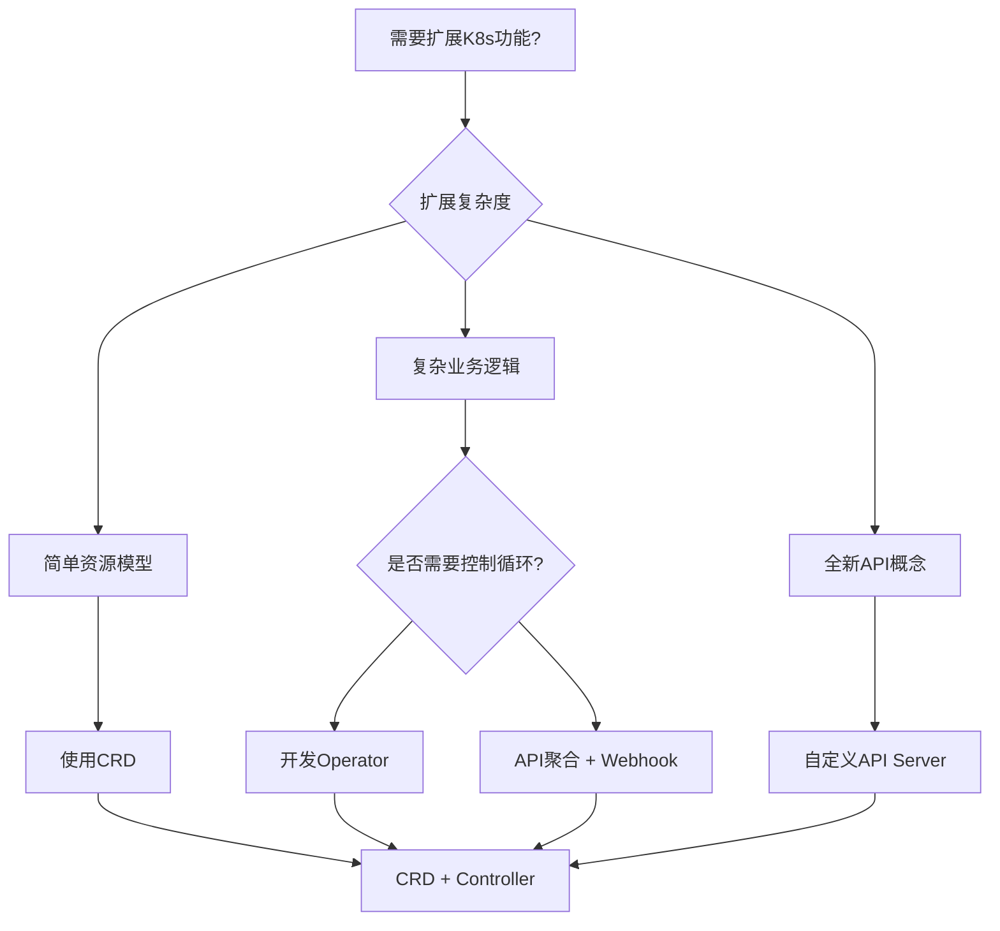

# Kubernetes API扩展深度解析 (API Extensions Deep Dive)

> **适用版本**: Kubernetes v1.25 - v1.32 | **最后更新**: 2026-02 | **文档类型**: API扩展文档

---

## 目录

1. [API扩展概述](#1-api扩展概述)
2. [Custom Resource Definitions (CRD)](#2-custom-resource-definitions-crd)
3. [API聚合层](#3-api聚合层)
4. [自定义API服务器](#4-自定义api服务器)
5. [Webhook扩展机制](#5-webhook扩展机制)
6. [Operator模式实践](#6-operator模式实践)
7. [API版本管理](#7-api版本管理)
8. [扩展开发最佳实践](#8-扩展开发最佳实践)

---

## 1. API扩展概述

### 1.1 扩展机制全景图

Kubernetes提供了多层次的API扩展能力，满足不同场景的定制需求。

```
┌─────────────────────────────────────────────────────────────────────────────────┐
│                         API Extension Architecture                              │
├─────────────────────────────────────────────────────────────────────────────────┤
│                                                                                  │
│  ┌─────────────────────────────────────────────────────────────────────────┐    │
│  │                        Extension Levels                                 │    │
│  │  ┌─────────────┐ ┌─────────────┐ ┌─────────────┐ ┌─────────────────────┐│    │
│  │  │ Level 1     │ │ Level 2     │ │ Level 3     │ │ Level 4             ││    │
│  │  │ CRD         │ │ API聚合     │ │ 自定义API   │ │ 核心修改            ││    │
│  │  │ (简单)      │ │ (中等)      │ │ Server      │ │ (复杂)              ││    │
│  │  └─────────────┘ └─────────────┘ └─────────────┘ └─────────────────────┘│    │
│  └─────────────────────────────────────────────────────────────────────────┘    │
│                                                                                  │
│  Complexity: Low ←──────────────────────────────────────────────────→ High      │
│  Maintenance: Easy ←────────────────────────────────────────────────→ Hard      │
│                                                                                  │
└─────────────────────────────────────────────────────────────────────────────────┘
```

### 1.2 扩展选择决策树



## 2. Custom Resource Definitions (CRD)

### 2.1 CRD基础概念

CRD允许用户定义自己的资源类型，无需修改Kubernetes核心代码。

#### CRD基本结构

```yaml
# myresource-crd.yaml
apiVersion: apiextensions.k8s.io/v1
kind: CustomResourceDefinition
metadata:
  name: myresources.example.com
spec:
  group: example.com
  versions:
  - name: v1
    served: true
    storage: true
    schema:
      openAPIV3Schema:
        type: object
        properties:
          spec:
            type: object
            properties:
              replicas:
                type: integer
                minimum: 1
            # 使用 CEL 进行直接验证 (v1.25+)
            x-kubernetes-validations:
              - rule: "self.replicas <= 100"
                message: "Replicas cannot exceed 100"
              - rule: "self.image.startsWith('registry.example.com/')"
                message: "Only images from registry.example.com are allowed"
          status:
            type: object
            properties:
              readyReplicas:
                type: integer
              conditions:
                type: array
                items:
                  type: object
                  properties:
                    type:
                      type: string
                    status:
                      type: string
                    reason:
                      type: string
                    message:
                      type: string
  scope: Namespaced
  names:
    plural: myresources
    singular: myresource
    kind: MyResource
    listKind: MyResourceList
    shortNames:
    - mr
```

### 2.2 CRD版本管理

```yaml
# 多版本CRD示例
apiVersion: apiextensions.k8s.io/v1
kind: CustomResourceDefinition
metadata:
  name: databases.database.example.com
spec:
  group: database.example.com
  versions:
  - name: v1alpha1
    served: true
    storage: false
    schema:
      openAPIV3Schema:
        type: object
        properties:
          spec:
            type: object
            properties:
              size:
                type: string
  - name: v1beta1
    served: true
    storage: false
    schema:
      openAPIV3Schema:
        type: object
        properties:
          spec:
            type: object
            properties:
              storageSize:
                type: string
              replicas:
                type: integer
  - name: v1
    served: true
    storage: true
    schema:
      openAPIV3Schema:
        type: object
        properties:
          spec:
            type: object
            properties:
              storageGB:
                type: integer
              replicaCount:
                type: integer
    # 版本转换配置
    subresources:
      status: {}
    additionalPrinterColumns:
    - name: Storage
      type: integer
      jsonPath: .spec.storageGB
    - name: Replicas
      type: integer
      jsonPath: .spec.replicaCount
    - name: Age
      type: date
      jsonPath: .metadata.creationTimestamp
```

### 2.3 CRD控制器实现

```go
// controller.go - CRD控制器示例
package main

import (
    "context"
    "fmt"
    "time"
    
    "k8s.io/apimachinery/pkg/api/errors"
    metav1 "k8s.io/apimachinery/pkg/apis/meta/v1"
    "k8s.io/apimachinery/pkg/runtime"
    "k8s.io/apimachinery/pkg/types"
    ctrl "sigs.k8s.io/controller-runtime"
    "sigs.k8s.io/controller-runtime/pkg/client"
    "sigs.k8s.io/controller-runtime/pkg/log"
    
    examplev1 "github.com/example/myoperator/api/v1"
)

// MyResourceReconciler reconciles a MyResource object
type MyResourceReconciler struct {
    client.Client
    Scheme *runtime.Scheme
}

//+kubebuilder:rbac:groups=example.com,resources=myresources,verbs=get;list;watch;create;update;patch;delete
//+kubebuilder:rbac:groups=example.com,resources=myresources/status,verbs=get;update;patch
//+kubebuilder:rbac:groups=example.com,resources=myresources/finalizers,verbs=update

func (r *MyResourceReconciler) Reconcile(ctx context.Context, req ctrl.Request) (ctrl.Result, error) {
    log := log.FromContext(ctx)
    
    // 获取CR实例
    myResource := &examplev1.MyResource{}
    if err := r.Get(ctx, req.NamespacedName, myResource); err != nil {
        if errors.IsNotFound(err) {
            return ctrl.Result{}, nil
        }
        return ctrl.Result{}, err
    }
    
    // 检查删除时间戳
    if myResource.DeletionTimestamp != nil {
        return r.handleDeletion(ctx, myResource)
    }
    
    // 添加Finalizer
    if !containsString(myResource.GetFinalizers(), "myresource.finalizer.example.com") {
        myResource.SetFinalizers(append(myResource.GetFinalizers(), "myresource.finalizer.example.com"))
        if err := r.Update(ctx, myResource); err != nil {
            return ctrl.Result{}, err
        }
    }
    
    // 业务逻辑处理
    result, err := r.reconcileBusinessLogic(ctx, myResource)
    if err != nil {
        // 更新状态
        myResource.Status.Conditions = append(myResource.Status.Conditions, examplev1.Condition{
            Type:    "ReconcileFailed",
            Status:  "True",
            Reason:  "ReconcileError",
            Message: err.Error(),
        })
        if updateErr := r.Status().Update(ctx, myResource); updateErr != nil {
            return ctrl.Result{}, fmt.Errorf("update status failed: %v, original error: %v", updateErr, err)
        }
        return result, err
    }
    
    // 更新成功状态
    myResource.Status.ReadyReplicas = myResource.Spec.Replicas
    myResource.Status.Conditions = []examplev1.Condition{
        {
            Type:   "Ready",
            Status: "True",
            Reason: "ReconcileSuccess",
        },
    }
    
    if err := r.Status().Update(ctx, myResource); err != nil {
        return ctrl.Result{}, err
    }
    
    return ctrl.Result{RequeueAfter: time.Minute * 5}, nil
}

func (r *MyResourceReconciler) reconcileBusinessLogic(ctx context.Context, myResource *examplev1.MyResource) (ctrl.Result, error) {
    // 实际的业务逻辑实现
    log := log.FromContext(ctx)
    log.Info("Reconciling MyResource", "name", myResource.Name)
    
    // 创建Deployment
    deployment := &appsv1.Deployment{
        ObjectMeta: metav1.ObjectMeta{
            Name:      myResource.Name,
            Namespace: myResource.Namespace,
            OwnerReferences: []metav1.OwnerReference{
                *metav1.NewControllerRef(myResource, examplev1.GroupVersion.WithKind("MyResource")),
            },
        },
        Spec: appsv1.DeploymentSpec{
            Replicas: &myResource.Spec.Replicas,
            Selector: &metav1.LabelSelector{
                MatchLabels: map[string]string{
                    "app": myResource.Name,
                },
            },
            Template: corev1.PodTemplateSpec{
                ObjectMeta: metav1.ObjectMeta{
                    Labels: map[string]string{
                        "app": myResource.Name,
                    },
                },
                Spec: corev1.PodSpec{
                    Containers: []corev1.Container{
                        {
                            Name:  "main",
                            Image: myResource.Spec.Image,
                            Ports: []corev1.ContainerPort{
                                {
                                    ContainerPort: myResource.Spec.Ports[0],
                                },
                            },
                        },
                    },
                },
            },
        },
    }
    
    // 创建或更新Deployment
    if err := ctrl.SetControllerReference(myResource, deployment, r.Scheme); err != nil {
        return ctrl.Result{}, err
    }
    
    found := &appsv1.Deployment{}
    err := r.Get(ctx, types.NamespacedName{Name: deployment.Name, Namespace: deployment.Namespace}, found)
    if err != nil && errors.IsNotFound(err) {
        log.Info("Creating Deployment", "name", deployment.Name)
        if err := r.Create(ctx, deployment); err != nil {
            return ctrl.Result{}, err
        }
    } else if err != nil {
        return ctrl.Result{}, err
    } else {
        // 更新现有Deployment
        if !reflect.DeepEqual(deployment.Spec, found.Spec) {
            found.Spec = deployment.Spec
            log.Info("Updating Deployment", "name", deployment.Name)
            if err := r.Update(ctx, found); err != nil {
                return ctrl.Result{}, err
            }
        }
    }
    
    return ctrl.Result{}, nil
}

// SetupWithManager sets up the controller with the Manager.
func (r *MyResourceReconciler) SetupWithManager(mgr ctrl.Manager) error {
    return ctrl.NewControllerManagedBy(mgr).
        For(&examplev1.MyResource{}).
        Owns(&appsv1.Deployment{}).
        Complete(r)
}
```

## 3. API聚合层

### 3.1 API聚合概述

API聚合允许将自定义API服务器注册到主API服务器，提供原生的kubectl体验。

#### 聚合架构

```
┌─────────────────────────────────────────────────────────────────────────────────┐
│                           API Aggregation Flow                                  │
├─────────────────────────────────────────────────────────────────────────────────┤
│                                                                                  │
│  kubectl get myresources.example.com                                             │
│        ↓                                                                         │
│  ┌─────────────────────────────────────────────────────────────────────────┐    │
│  │                    kube-apiserver                                       │    │
│  │  ┌─────────────┐ ┌─────────────┐ ┌─────────────┐                       │    │
│  │  │ Core APIs   │ │ Extensions  │ │ Aggregated  │                       │    │
│  │  │ (/api/v1)   │ │ (/apis)     │ │ APIs        │                       │    │
│  │  └─────────────┘ └─────────────┘ └─────────────┘                       │    │
│  └─────────────────────────────────────────────────────────────────────────┘    │
│        ↓                                                                         │
│  APIService Registration                                                         │
│        ↓                                                                         │
│  ┌─────────────────────────────────────────────────────────────────────────┐    │
│  │                 Custom API Server                                       │    │
│  │  ┌─────────────┐ ┌─────────────┐ ┌─────────────┐                       │    │
│  │  │ MyResource  │ │ Handler     │ │ Storage     │                       │    │
│  │  │ Controller  │ │ Logic       │ │ Backend     │                       │    │
│  │  └─────────────┘ └─────────────┘ └─────────────┘                       │    │
│  └─────────────────────────────────────────────────────────────────────────┘    │
│                                                                                  │
└─────────────────────────────────────────────────────────────────────────────────┘
```

### 3.2 APIService配置

```yaml
# apiservice.yaml
apiVersion: apiregistration.k8s.io/v1
kind: APIService
metadata:
  name: v1alpha1.database.example.com
spec:
  group: database.example.com
  version: v1alpha1
  groupPriorityMinimum: 2000
  versionPriority: 100
  service:
    name: database-apiserver
    namespace: database-system
  caBundle: <base64-encoded-ca-cert>
  insecureSkipTLSVerify: false
```

### 3.3 自定义API服务器实现

```go
// main.go - 自定义API服务器示例
package main

import (
    "flag"
    "net/http"
    "os"
    
    "k8s.io/apimachinery/pkg/runtime"
    "k8s.io/apimachinery/pkg/runtime/schema"
    "k8s.io/apimachinery/pkg/runtime/serializer"
    "k8s.io/apiserver/pkg/endpoints/discovery"
    genericapiserver "k8s.io/apiserver/pkg/server"
    "k8s.io/apiserver/pkg/server/options"
    "k8s.io/klog/v2"
    
    // 自定义API组
    databaseinstall "github.com/example/database-apiserver/pkg/apis/database/install"
    databasev1alpha1 "github.com/example/database-apiserver/pkg/apis/database/v1alpha1"
    databasev1alpha1storage "github.com/example/database-apiserver/pkg/registry/database/v1alpha1"
)

func main() {
    stopCh := genericapiserver.SetupSignalHandler()
    
    // 解析命令行参数
    opts := options.NewServerRunOptions()
    opts.AddFlags(flag.CommandLine)
    flag.Parse()
    
    // 创建服务器配置
    serverConfig := genericapiserver.NewRecommendedConfig(serializer.NewCodecFactory(runtime.NewScheme()))
    if err := opts.ApplyTo(serverConfig); err != nil {
        klog.Fatalf("Failed to apply options: %v", err)
    }
    
    // 安装自定义API组
    databaseinstall.Install(serverConfig.Scheme)
    
    // 配置API组信息
    apiGroupInfo := genericapiserver.NewDefaultAPIGroupInfo(
        databasev1alpha1.GroupName,
        serverConfig.Scheme,
        metav1.ParameterCodec,
        serializer.NewCodecFactory(serverConfig.Scheme),
    )
    
    // 注册存储
    v1alpha1storage := map[string]rest.Storage{}
    v1alpha1storage["databases"] = databasev1alpha1storage.NewREST(Scheme, c.GenericConfig.RESTOptionsGetter)
    apiGroupInfo.VersionedResourcesStorageMap["v1alpha1"] = v1alpha1storage
    
    // 创建服务器
    server, err := serverConfig.Complete().New("database-apiserver", genericapiserver.NewEmptyDelegate())
    if err != nil {
        klog.Fatalf("Failed to create server: %v", err)
    }
    
    // 安装API组
    if err := server.InstallAPIGroup(&apiGroupInfo); err != nil {
        klog.Fatalf("Failed to install API group: %v", err)
    }
    
    // 启动服务器
    if err := server.PrepareRun().Run(stopCh); err != nil {
        klog.Fatalf("Failed to run server: %v", err)
    }
}
```

## 4. 自定义API服务器

### 4.1 完整实现示例

```yaml
# custom-apiserver-deployment.yaml
apiVersion: apps/v1
kind: Deployment
metadata:
  name: custom-apiserver
  namespace: custom-apisystem
spec:
  replicas: 2
  selector:
    matchLabels:
      app: custom-apiserver
  template:
    metadata:
      labels:
        app: custom-apiserver
    spec:
      containers:
      - name: apiserver
        image: example/custom-apiserver:v1.0.0
        args:
        - --secure-port=443
        - --etcd-servers=https://etcd-client:2379
        - --etcd-cafile=/etc/etcd/ca.crt
        - --etcd-certfile=/etc/etcd/client.crt
        - --etcd-keyfile=/etc/etcd/client.key
        - --tls-cert-file=/etc/apiserver/tls.crt
        - --tls-private-key-file=/etc/apiserver/tls.key
        - --client-ca-file=/etc/apiserver/ca.crt
        - --authorization-mode=RBAC
        ports:
        - containerPort: 443
          protocol: TCP
        volumeMounts:
        - name: etcd-certs
          mountPath: /etc/etcd
          readOnly: true
        - name: apiserver-certs
          mountPath: /etc/apiserver
          readOnly: true
        livenessProbe:
          httpGet:
            scheme: HTTPS
            path: /healthz
            port: 443
          initialDelaySeconds: 30
          periodSeconds: 10
        readinessProbe:
          httpGet:
            scheme: HTTPS
            path: /readyz
            port: 443
          initialDelaySeconds: 5
          periodSeconds: 5
      volumes:
      - name: etcd-certs
        secret:
          secretName: etcd-client-certs
      - name: apiserver-certs
        secret:
          secretName: custom-apiserver-certs
---
apiVersion: v1
kind: Service
metadata:
  name: custom-apiserver
  namespace: custom-apisystem
spec:
  selector:
    app: custom-apiserver
  ports:
  - port: 443
    targetPort: 443
    protocol: TCP
```

## 5. Webhook扩展机制

### 5.1 准入Webhook配置

```yaml
# webhook-deployment.yaml
apiVersion: apps/v1
kind: Deployment
metadata:
  name: validation-webhook
  namespace: webhook-system
spec:
  replicas: 2
  selector:
    matchLabels:
      app: validation-webhook
  template:
    metadata:
      labels:
        app: validation-webhook
    spec:
      containers:
      - name: webhook
        image: example/validation-webhook:v1.0.0
        ports:
        - containerPort: 8443
        env:
        - name: TLS_CERT_FILE
          value: /etc/webhook/certs/tls.crt
        - name: TLS_KEY_FILE
          value: /etc/webhook/certs/tls.key
        volumeMounts:
        - name: webhook-certs
          mountPath: /etc/webhook/certs
          readOnly: true
      volumes:
      - name: webhook-certs
        secret:
          secretName: webhook-certs
---
apiVersion: v1
kind: Service
metadata:
  name: validation-webhook-service
  namespace: webhook-system
spec:
  selector:
    app: validation-webhook
  ports:
  - port: 443
    targetPort: 8443
```

### 5.2 Webhook处理逻辑

```go
// webhook.go - Webhook处理器示例
package main

import (
    "context"
    "encoding/json"
    "net/http"
    
    admissionv1 "k8s.io/api/admission/v1"
    metav1 "k8s.io/apimachinery/pkg/apis/meta/v1"
    "k8s.io/apimachinery/pkg/runtime"
    "k8s.io/apimachinery/pkg/runtime/serializer"
    "k8s.io/klog/v2"
)

var (
    scheme = runtime.NewScheme()
    codecs = serializer.NewCodecFactory(scheme)
)

type webhookServer struct {
    server *http.Server
}

func (wh *webhookServer) validate(ar *admissionv1.AdmissionReview) *admissionv1.AdmissionResponse {
    req := ar.Request
    var result *metav1.Status
    var msg string
    
    klog.Infof("AdmissionReview for Kind=%v, Namespace=%v Name=%v UID=%v Operation=%v",
        req.Kind, req.Namespace, req.Name, req.UID, req.Operation)
    
    switch req.Kind.Kind {
    case "MyResource":
        if req.Operation == admissionv1.Create || req.Operation == admissionv1.Update {
            // 验证自定义资源
            if err := wh.validateMyResource(req.Object.Raw); err != nil {
                result = &metav1.Status{
                    Message: err.Error(),
                }
                msg = err.Error()
                return &admissionv1.AdmissionResponse{
                    Allowed: false,
                    Result:  result,
                }
            }
        }
    }
    
    return &admissionv1.AdmissionResponse{
        Allowed: true,
        Result:  result,
    }
}

func (wh *webhookServer) serve(w http.ResponseWriter, r *http.Request) {
    var body []byte
    if r.Body != nil {
        if data, err := io.ReadAll(r.Body); err == nil {
            body = data
        }
    }
    
    if len(body) == 0 {
        klog.Error("empty body")
        http.Error(w, "empty body", http.StatusBadRequest)
        return
    }
    
    // 验证Content-Type
    contentType := r.Header.Get("Content-Type")
    if contentType != "application/json" {
        klog.Errorf("Content-Type=%s, expect application/json", contentType)
        http.Error(w, "invalid Content-Type, expect `application/json`", http.StatusUnsupportedMediaType)
        return
    }
    
    // 解析AdmissionReview
    obj, gvk, err := codecs.UniversalDeserializer().Decode(body, nil, nil)
    if err != nil {
        msg := fmt.Sprintf("Request could not be decoded: %v", err)
        klog.Error(msg)
        http.Error(w, msg, http.StatusBadRequest)
        return
    }
    
    var responseObj runtime.Object
    switch *gvk {
    case admissionv1.SchemeGroupVersion.WithKind("AdmissionReview"):
        requestAdmissionReview, ok := obj.(*admissionv1.AdmissionReview)
        if !ok {
            klog.Errorf("Expected v1.AdmissionReview but got: %T", obj)
            return
        }
        responseAdmissionReview := &admissionv1.AdmissionReview{}
        responseAdmissionReview.SetGroupVersionKind(*gvk)
        responseAdmissionReview.Response = wh.validate(requestAdmissionReview)
        responseAdmissionReview.Response.UID = requestAdmissionReview.Request.UID
        responseObj = responseAdmissionReview
    default:
        msg := fmt.Sprintf("Unsupported group version kind: %v", gvk)
        klog.Error(msg)
        http.Error(w, msg, http.StatusBadRequest)
        return
    }
    
    respBytes, err := json.Marshal(responseObj)
    if err != nil {
        klog.Error(err)
        http.Error(w, err.Error(), http.StatusInternalServerError)
        return
    }
    
    klog.Info(fmt.Sprintf("sending response: %v", responseObj))
    w.Header().Set("Content-Type", "application/json")
    w.WriteHeader(http.StatusOK)
    w.Write(respBytes)
}

func main() {
    klog.InitFlags(nil)
    flag.Parse()
    
    certFile := os.Getenv("TLS_CERT_FILE")
    keyFile := os.Getenv("TLS_KEY_FILE")
    
    wh := &webhookServer{
        server: &http.Server{
            Addr: ":8443",
            TLSConfig: &tls.Config{
                ClientAuth: tls.NoClientCert,
            },
        },
    }
    
    http.HandleFunc("/validate", wh.serve)
    
    klog.Info("Starting webhook server...")
    if err := wh.server.ListenAndServeTLS(certFile, keyFile); err != nil {
        klog.Fatalf("Failed to listen and serve webhook server: %v", err)
    }
}
```

## 6. Operator模式实践

### 6.1 Operator SDK项目结构

```bash
# 初始化Operator项目
mkdir my-operator && cd my-operator
operator-sdk init --domain=example.com --repo=github.com/example/my-operator

# 创建API
operator-sdk create api --group=apps --version=v1alpha1 --kind=MyApp --resource=true --controller=true

# 生成CRD manifests
make manifests

# 生成代码
make generate

# 构建镜像
make docker-build IMG=example/my-operator:v0.0.1

# 部署
make deploy IMG=example/my-operator:v0.0.1
```

### 6.2 完整Operator示例

```yaml
# config/samples/apps_v1alpha1_myapp.yaml
apiVersion: apps.example.com/v1alpha1
kind: MyApp
metadata:
  name: myapp-sample
spec:
  size: 3
  image: nginx:latest
  ports:
  - containerPort: 80
  resources:
    requests:
      memory: "64Mi"
      cpu: "250m"
    limits:
      memory: "128Mi"
      cpu: "500m"
```

## 7. API版本管理

### 7.1 版本转换策略

```go
// conversion.go - 版本转换示例
package v1alpha1

import (
    "github.com/example/my-operator/api/v1beta1"
    ctrl "sigs.k8s.io/controller-runtime"
    "sigs.k8s.io/controller-runtime/pkg/conversion"
)

// ConvertTo converts this MyApp to the Hub version (v1beta1).
func (src *MyApp) ConvertTo(dstRaw conversion.Hub) error {
    dst := dstRaw.(*v1beta1.MyApp)
    
    // 复制基础字段
    dst.ObjectMeta = src.ObjectMeta
    
    // 转换Spec字段
    dst.Spec.Replicas = src.Spec.Size
    dst.Spec.Image = src.Spec.Image
    dst.Spec.ContainerPorts = src.Spec.Ports
    
    // 设置默认值
    if dst.Spec.Replicas == 0 {
        dst.Spec.Replicas = 1
    }
    
    return nil
}

// ConvertFrom converts from the Hub version (v1beta1) to this version.
func (dst *MyApp) ConvertFrom(srcRaw conversion.Hub) error {
    src := srcRaw.(*v1beta1.MyApp)
    
    // 复制基础字段
    dst.ObjectMeta = src.ObjectMeta
    
    // 转换Spec字段
    dst.Spec.Size = src.Spec.Replicas
    dst.Spec.Image = src.Spec.Image
    
    // 转换端口格式
    dst.Spec.Ports = make([]int32, len(src.Spec.ContainerPorts))
    for i, port := range src.Spec.ContainerPorts {
        dst.Spec.Ports[i] = port.ContainerPort
    }
    
    return nil
}
```

## 8. 扩展开发最佳实践

### 8.1 开发与运维最佳实践

- **CEL 优先原则**: 对于简单的字段验证，优先使用 CRD 内置的 `x-kubernetes-validations` 或 `ValidatingAdmissionPolicy`。
- **Finalizer 安全**: 务必在控制器中正确处理 Finalizer，防止资源由于外部依赖未清理而处于 Terminating 状态无法删除。
- **Status 子资源**: 始终启用 `/status` 子资源，并在控制器中通过 `r.Status().Update()` 更新，以避免不必要的 Spec 变更触发 Reconcile。
- **存储迁移**: 在变更 CRD 版本时，务必考虑存量数据的转换（Conversion Webhook）。

### 8.2 安全最佳实践

```yaml
# 安全的RBAC配置
apiVersion: rbac.authorization.k8s.io/v1
kind: ClusterRole
metadata:
  name: my-operator-role
rules:
# 最小必要权限
- apiGroups:
  - apps.example.com
  resources:
  - myapps
  - myapps/status
  - myapps/finalizers
  verbs:
  - get
  - list
  - watch
  - create
  - update
  - patch
  - delete
# 仅需要的核心资源权限
- apiGroups:
  - apps
  resources:
  - deployments
  verbs:
  - get
  - list
  - watch
  - create
  - update
  - patch
  - delete
- apiGroups:
  - ""
  resources:
  - services
  - configmaps
  - secrets
  verbs:
  - get
  - list
  - watch
  - create
  - update
  - patch
  - delete
```

### 8.2 监控和日志

```yaml
# Prometheus监控配置
apiVersion: monitoring.coreos.com/v1
kind: ServiceMonitor
metadata:
  name: my-operator-metrics
  namespace: monitoring
spec:
  selector:
    matchLabels:
      app: my-operator
  endpoints:
  - port: metrics
    interval: 30s
---
# Grafana仪表板配置
apiVersion: v1
kind: ConfigMap
metadata:
  name: my-operator-dashboard
  namespace: monitoring
  labels:
    grafana_dashboard: "1"
data:
  my-operator.json: |
    {
      "dashboard": {
        "title": "My Operator Metrics",
        "panels": [
          {
            "title": "Reconciliation Rate",
            "type": "graph",
            "targets": [
              {
                "expr": "rate(controller_runtime_reconcile_total[5m])",
                "legendFormat": "{{controller}}"
              }
            ]
          }
        ]
      }
    }
```

### 8.3 部署和升级策略

```yaml
# Helm Chart结构
my-operator/
├── Chart.yaml
├── values.yaml
├── templates/
│   ├── deployment.yaml
│   ├── rbac.yaml
│   ├── crds/
│   │   └── apps.example.com_myapps.yaml
│   └── _helpers.tpl
└── crds/
    └── apps.example.com_myapps.yaml
```

---
**文档维护**: Kusheet API Extensions Team | **最后审查**: 2026-02 | **复杂度**: ★★★★☆