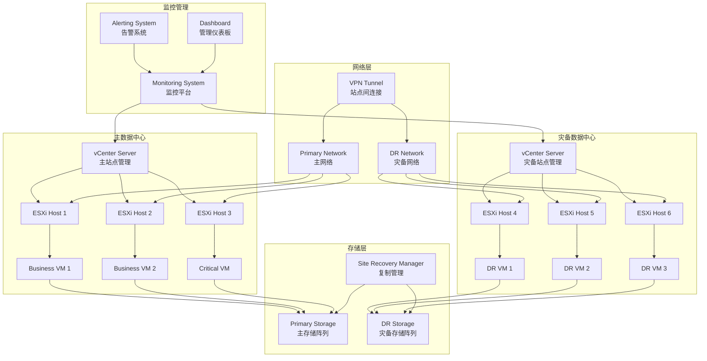

# VMware vSphere 企业级灾备与业务连续性

## 概述 (Overview)

VMware vSphere是业界领先的企业级虚拟化平台，提供完整的数据中心虚拟化解决方案。本文档从生产环境运维专家角度，深入探讨vSphere的企业级灾备架构、业务连续性策略和运维管理最佳实践。

VMware vSphere is the industry-leading enterprise virtualization platform that provides a complete data center virtualization solution. This document explores vSphere's enterprise disaster recovery architecture, business continuity strategies, and operational management best practices from a production environment operations expert perspective.

## 架构设计 (Architecture Design)

### 企业级vSphere灾备架构 (Enterprise vSphere Disaster Recovery Architecture)

```yaml
# vSphere环境基础设施定义
version: '3.8'
services:
  vcenter-server:
    image: vmware/vcenter-server-appliance:7.0
    container_name: vcenter-server
    hostname: vcenter.company.com
    environment:
      - DEPLOYMENT_PLATFORM=docker
      - VCSA_ROOT_PASSWORD=${VCENTER_ROOT_PASSWORD}
      - SSO_DOMAIN_NAME=vsphere.local
      - SSO_SITE_NAME=CompanySite
    ports:
      - "443:443"
      - "902:902"
    networks:
      - vsphere-network
    volumes:
      - vcenter-data:/storage

  esxi-host-1:
    image: vmware/esxi:7.0
    container_name: esxi-host-1
    privileged: true
    environment:
      - ESXI_ROOT_PASSWORD=${ESXI_ROOT_PASSWORD}
      - ESXI_HOSTNAME=esxi01.company.com
    networks:
      - vsphere-network
    volumes:
      - esxi-data-1:/vmfs/volumes
    devices:
      - /dev/vmxmon

  esxi-host-2:
    image: vmware/esxi:7.0
    container_name: esxi-host-2
    privileged: true
    environment:
      - ESXI_ROOT_PASSWORD=${ESXI_ROOT_PASSWORD}
      - ESXI_HOSTNAME=esxi02.company.com
    networks:
      - vsphere-network
    volumes:
      - esxi-data-2:/vmfs/volumes
    devices:
      - /dev/vmxmon

  esxi-host-3:
    image: vmware/esxi:7.0
    container_name: esxi-host-3
    privileged: true
    environment:
      - ESXI_ROOT_PASSWORD=${ESXI_ROOT_PASSWORD}
      - ESXI_HOSTNAME=esxi03.company.com
    networks:
      - vsphere-network
    volumes:
      - esxi-data-3:/vmfs/volumes
    devices:
      - /dev/vmxmon

volumes:
  vcenter-data:
  esxi-data-1:
  esxi-data-2:
  esxi-data-3:

networks:
  vsphere-network:
    driver: bridge
    ipam:
      config:
        - subnet: 192.168.10.0/24
```

### 灾备架构图 (Disaster Recovery Architecture Diagram)



## 核心组件配置 (Core Component Configuration)

### vCenter Server配置 (vCenter Server Configuration)

```json
{
  "vcenter": {
    "deployment": {
      "type": "embedded",
      "size": "medium",
      "network": {
        "ip": "192.168.10.10",
        "netmask": "255.255.255.0",
        "gateway": "192.168.10.1",
        "dns": ["8.8.8.8", "8.8.4.4"]
      }
    },
    "sso": {
      "domain": "vsphere.local",
      "site": "CompanyPrimary"
    },
    "database": {
      "type": "embedded",
      "size": "large"
    },
    "storage": {
      "type": "nfs",
      "path": "/vsphere/vcenter"
    }
  },
  "license": {
    "key": "XXXXX-XXXXX-XXXXX-XXXXX-XXXXX",
    "edition": "Enterprise Plus"
  }
}
```

### ESXi主机配置 (ESXi Host Configuration)

```bash
# ESXi主机网络配置
esxcli network vswitch standard add --vswitch-name=vSwitch0
esxcli network vswitch standard portgroup add --portgroup-name="Management Network" --vswitch-name=vSwitch0
esxcli network vswitch standard portgroup add --portgroup-name="VM Network" --vswitch-name=vSwitch0
esxcli network vswitch standard portgroup add --portgroup-name="Storage Network" --vswitch-name=vSwitch0

# 存储配置
esxcli storage core adapter rescan --all
esxcli storage core path list
esxcli storage vmfs extent list

# 安全配置
esxcli system settings advanced set -o /UserVars/ESXiShellInteractiveTimeOut -i 600
esxcli system settings advanced set -o /UserVars/ESXiShellTimeOut -i 3600
esxcli system settings advanced set -o /Net/GuestIPHack -i 0
```

### 虚拟机配置模板 (VM Configuration Template)

```xml
<!-- VMX配置文件模板 -->
.encoding = "UTF-8"
config.version = "8"
virtualHW.version = "17"
pciBridge0.present = "TRUE"
svga.present = "TRUE"
memsize = "4096"
numvcpus = "2"
scsi0.present = "TRUE"
scsi0.virtualDev = "lsilogic"
sata0.present = "TRUE"
usb.present = "TRUE"
ehci.present = "TRUE"
ethernet0.present = "TRUE"
ethernet0.connectionType = "bridged"
ethernet0.startConnected = "TRUE"
ethernet0.wakeOnPcktRcv = "FALSE"
ethernet0.addressType = "generated"
usb.vbluetooth.startConnected = "TRUE"
sound.present = "TRUE"
sound.fileName = "-1"
sound.autodetect = "TRUE"
mks.enable3d = "TRUE"
serial0.present = "TRUE"
serial0.fileType = "thinprint"
serial0.autodetect = "TRUE"
floppy0.present = "FALSE"
guestOS = "centos-64"
nvram = "centos7.nvram"
virtualHW.productCompatibility = "hosted"
powerType.powerOff = "soft"
powerType.powerOn = "soft"
powerType.suspend = "soft"
powerType.reset = "soft"
extendedConfigFile = "centos7.vmxf"
ide1:0.present = "TRUE"
ide1:0.autodetect = "TRUE"
ide1:0.deviceType = "cdrom-image"
ide1:0.fileName = "/vmimages/linux.iso"
scsi0:0.present = "TRUE"
scsi0:0.fileName = "centos7.vmdk"
scsi0:0.redo = ""
sata0:1.present = "TRUE"
sata0:1.fileName = "centos7_1.vmdk"
sata0:1.redo = ""
ethernet0.generatedAddress = "00:0c:29:12:34:56"
uuid.location = "56 4d 12 34 56 78 90 ab cd ef 12 34 56 78 90 ab"
uuid.bios = "56 4d 12 34 56 78 90 ab cd ef 12 34 56 78 90 ab"
cleanShutdown = "TRUE"
replay.supported = "FALSE"
replay.filename = ""
scsi0:0.redo = ""
sata0:1.redo = ""
pciBridge0.pciSlotNumber = "17"
scsi0.pciSlotNumber = "160"
usb.pciSlotNumber = "32"
ethernet0.pciSlotNumber = "192"
sound.pciSlotNumber = "33"
ehci.pciSlotNumber = "34"
sata0.pciSlotNumber = "35"
vmci0.pciSlotNumber = "36"
vmci0.present = "TRUE"
hpet0.present = "TRUE"
ich7m.present = "TRUE"
smc.present = "TRUE"
firmware = "bios"
```

## 灾备方案配置 (Disaster Recovery Configuration)

### Site Recovery Manager配置 (Site Recovery Manager Configuration)

```xml
<!-- SRM配置文件 -->
<srm>
  <version>8.4.0</version>
  <sites>
    <site>
      <name>Primary Site</name>
      <vcenter>
        <hostname>vcenter-primary.company.com</hostname>
        <username>administrator@vsphere.local</username>
        <password>${PRIMARY_VC_PASSWORD}</password>
      </vcenter>
      <storage>
        <arrays>
          <array>
            <name>Primary Storage Array</name>
            <type>VMware</type>
            <connection>
              <ip>192.168.20.10</ip>
              <username>admin</username>
              <password>${STORAGE_PASSWORD}</password>
            </connection>
          </array>
        </arrays>
      </storage>
    </site>
    <site>
      <name>Recovery Site</name>
      <vcenter>
        <hostname>vcenter-dr.company.com</hostname>
        <username>administrator@vsphere.local</username>
        <password>${DR_VC_PASSWORD}</password>
      </vcenter>
      <storage>
        <arrays>
          <array>
            <name>DR Storage Array</name>
            <type>VMware</type>
            <connection>
              <ip>192.168.30.10</ip>
              <username>admin</username>
              <password>${STORAGE_PASSWORD}</password>
            </connection>
          </array>
        </arrays>
      </storage>
    </site>
  </sites>
  
  <recoveryPlans>
    <plan>
      <name>Critical Business Applications</name>
      <priority>1</priority>
      <recoveryPointObjective>15</recoveryPointObjective>
      <recoveryTimeObjective>60</recoveryTimeObjective>
      <vms>
        <vm>
          <name>ERP-Database</name>
          <protected>true</protected>
          <testNetwork>vlan-100</testNetwork>
        </vm>
        <vm>
          <name>CRM-Application</name>
          <protected>true</protected>
          <testNetwork>vlan-100</testNetwork>
        </vm>
        <vm>
          <name>Email-Server</name>
          <protected>true</protected>
          <testNetwork>vlan-100</testNetwork>
        </vm>
      </vms>
    </plan>
  </recoveryPlans>
</srm>
```

### 存储复制配置 (Storage Replication Configuration)

```bash
# 存储阵列复制配置脚本
#!/bin/bash

# 配置主存储阵列
configure_primary_array() {
    echo "Configuring primary storage array..."
    
    # 创建复制组
    ssh storage-admin@192.168.20.10 "
        create replication-group rg-critical-apps
        add volume ERP-DB-VOL to rg-critical-apps
        add volume CRM-APP-VOL to rg-critical-apps
        set replication-policy synchronous
        activate replication-group rg-critical-apps
    "
}

# 配置灾备存储阵列
configure_dr_array() {
    echo "Configuring DR storage array..."
    
    # 配置接收端
    ssh storage-admin@192.168.30.10 "
        create replication-group rg-critical-apps-dr
        set replication-mode receive
        activate replication-group rg-critical-apps-dr
    "
}

# 验证复制状态
verify_replication() {
    echo "Verifying replication status..."
    
    ssh storage-admin@192.168.20.10 "
        show replication-status rg-critical-apps
        show replication-lag rg-critical-apps
    "
}
```

## 监控告警 (Monitoring and Alerting)

### vSphere监控配置 (vSphere Monitoring Configuration)

```yaml
# vRealize Operations Manager配置
managementPack:
  name: "vSphere Management Pack"
  version: "8.6"
  collectors:
    - name: "vCenter Collector"
      type: "vcenter"
      endpoint: "vcenter.company.com"
      credentials:
        username: "administrator@vsphere.local"
        password: "${VCENTER_PASSWORD}"
      
    - name: "ESXi Collector"
      type: "esxi"
      endpoints:
        - "esxi01.company.com"
        - "esxi02.company.com"
        - "esxi03.company.com"
      credentials:
        username: "root"
        password: "${ESXI_PASSWORD}"

alerts:
  - name: "Host Unreachable"
    symptom: "ESXi host ping failed"
    impact: "critical"
    recommendation: "Check network connectivity and host status"
    
  - name: "Storage Space Low"
    symptom: "Datastore usage > 85%"
    impact: "warning"
    recommendation: "Extend datastore or migrate VMs"
    
  - name: "VM CPU Ready Time High"
    symptom: "CPU ready time > 10%"
    impact: "warning"
    recommendation: "Add CPU resources or migrate VM"
```

### 告警规则配置 (Alerting Rules Configuration)

```json
{
  "alertRules": [
    {
      "name": "vSphereHostDown",
      "expression": "esxi_host_status == 'unreachable'",
      "duration": "5m",
      "severity": "critical",
      "actions": [
        {
          "type": "email",
          "recipients": ["noc@company.com", "admin@company.com"]
        },
        {
          "type": "webhook",
          "url": "https://chat.company.com/hooks/vsphere-alerts"
        }
      ]
    },
    {
      "name": "DatastoreSpaceLow",
      "expression": "datastore_usage_percent > 85",
      "duration": "10m",
      "severity": "warning",
      "actions": [
        {
          "type": "email",
          "recipients": ["storage-team@company.com"]
        }
      ]
    },
    {
      "name": "VMDiskIOWait",
      "expression": "vm_disk_io_wait > 50",
      "duration": "5m",
      "severity": "warning",
      "actions": [
        {
          "type": "slack",
          "channel": "#performance-alerts"
        }
      ]
    }
  ]
}
```

## 运维管理 (Operational Management)

### 故障排查工具 (Troubleshooting Tools)

```bash
#!/bin/bash
# vSphere故障排查脚本

# 系统健康检查
check_vsphere_health() {
    echo "=== vSphere Health Check ==="
    
    # 检查vCenter服务状态
    service-control --status vmware-vpxd
    
    # 检查ESXi主机连接状态
    govc about -u administrator@vsphere.local:${VCENTER_PASSWORD}@vcenter.company.com
    
    # 检查存储状态
    govc datastore.info
    
    # 检查网络连接
    govc host.portgroup.info
    
    # 检查虚拟机状态
    govc vm.info -vm.ipath /Datacenter/vm/*
}

# 性能分析
performance_analysis() {
    echo "=== Performance Analysis ==="
    
    # 检查CPU使用情况
    govc metric.sample -n 10 -t host/*/cpu/usage.average
    
    # 检查内存使用情况
    govc metric.sample -n 10 -t host/*/mem/usage.average
    
    # 检查存储I/O性能
    govc metric.sample -n 10 -t datastore/*/disk.used.latest
    
    # 检查网络吞吐量
    govc metric.sample -n 10 -t host/*/net/throughput.contention.average
}

# 灾备演练
disaster_recovery_drill() {
    echo "=== Disaster Recovery Drill ==="
    
    # 检查SRM配置
    drs-getconfig -s vcenter-dr.company.com
    
    # 验证复制状态
    govc datastore.info | grep -i replicated
    
    # 测试故障切换
    srm-runtest -p "Critical Business Applications" -t "test-failover"
    
    # 验证恢复点目标
    srm-getrpo -p "Critical Business Applications"
}
```

### 日常运维脚本 (Daily Operations Scripts)

```bash
#!/bin/bash
# vSphere日常运维脚本

# 自动备份配置
backup_configuration() {
    echo "Performing configuration backup..."
    
    local backup_dir="/backup/vsphere/$(date +%Y%m%d_%H%M%S)"
    mkdir -p $backup_dir
    
    # 备份vCenter配置
    vcsa-config backup -c /etc/vmware-vpx/vcdb.properties \
        -f $backup_dir/vcenter-config.tar.gz
    
    # 备份ESXi主机配置
    for host in esxi01 esxi02 esxi03; do
        ssh root@$host.local "vim-cfgbackup -s" > $backup_dir/$host-config.tgz
    done
    
    # 备份虚拟机配置
    govc ls /Datacenter/vm/* | while read vm; do
        govc vm.info -vm.ipath $vm > $backup_dir/$(basename $vm)-config.txt
    done
    
    # 清理旧备份
    find /backup/vsphere/ -type d -mtime +30 -exec rm -rf {} \;
}

# 资源优化
resource_optimization() {
    echo "Optimizing resources..."
    
    # 检查并关闭闲置虚拟机
    govc ls /Datacenter/vm/* | while read vm; do
        local power_state=$(govc vm.info -vm.ipath $vm | grep "Power state" | awk '{print $3}')
        local uptime=$(govc vm.info -vm.ipath $vm | grep "Boot time" | awk '{print $3}')
        
        if [[ $power_state == "poweredOn" ]] && [[ $uptime -gt 172800 ]]; then  # 2天以上
            echo "VM $vm has been running for over 2 days, checking usage..."
            # 进一步检查资源使用情况
        fi
    done
    
    # 平衡主机负载
    govc host.maintenance.enter -host.ipath /Datacenter/host/esxi01
    # 迁移虚拟机到其他主机
    govc host.maintenance.exit -host.ipath /Datacenter/host/esxi01
}

# 安全检查
security_audit() {
    echo "Performing security audit..."
    
    # 检查未授权访问
    govc logs.ls | grep -i "unauthorized\|denied\|failed"
    
    # 检查用户权限
    govc permissions.ls -principal Administrator
    
    # 检查SSL证书有效期
    openssl x509 -in /etc/vmware-vpx/ssl/rui.crt -text -noout | grep "Not After"
    
    # 检查防火墙配置
    esxcli network firewall ruleset list
}
```

## 最佳实践 (Best Practices)

### 部署最佳实践 (Deployment Best Practices)

1. **硬件规划**
   ```bash
   # vCenter Server资源要求
   CPU: 4 cores minimum (8 cores recommended)
   Memory: 16GB minimum (24GB recommended)
   Storage: 200GB minimum (500GB recommended)
   
   # ESXi主机资源要求
   CPU: 2 sockets, 8 cores per socket minimum
   Memory: 64GB minimum (128GB recommended)
   Storage: Local SSD for boot, shared storage for VMs
   ```

2. **网络设计**
   ```bash
   # 推荐的网络分段
   Management Network: 192.168.10.0/24
   VM Network: 192.168.20.0/24
   Storage Network: 192.168.30.0/24
   vMotion Network: 192.168.40.0/24
   ```

3. **存储配置**
   ```bash
   # 存储最佳实践
   # 使用RAID 10或RAID 6
   # 配置存储多路径
   # 启用存储DRS
   # 定期检查存储性能
   ```

### 灾备最佳实践 (Disaster Recovery Best Practices)

1. **恢复目标设定**
   ```bash
   # RTO/RPO要求
   Critical Applications: RTO < 4 hours, RPO < 15 minutes
   Important Applications: RTO < 8 hours, RPO < 1 hour
   Standard Applications: RTO < 24 hours, RPO < 4 hours
   ```

2. **测试策略**
   ```bash
   # 定期灾备测试
   Quarterly: Table-top exercises
   Semi-annually: Failover drills
   Annually: Full disaster recovery test
   ```

3. **文档管理**
   ```bash
   # 必需的灾备文档
   - 灾备计划文档
   - 联系人清单
   - 系统架构图
   - 操作手册
   - 测试报告
   ```

### 监控最佳实践 (Monitoring Best Practices)

1. **关键指标监控**
   - 主机可用性 > 99.9%
   - 存储利用率 < 80%
   - CPU使用率 < 70%
   - 内存使用率 < 75%

2. **告警分级**
   ```yaml
   severity:
     critical: 影响业务连续性
     warning:  潜在性能问题
     info:     常规状态更新
   ```

3. **容量规划**
   ```bash
   # 容量预测公式
   Future Capacity = Current Usage × (1 + Growth Rate) × Time Period
   # 预留20%缓冲空间
   ```

### 安全最佳实践 (Security Best Practices)

1. **访问控制**
   ```bash
   # 用户权限管理
   - 最小权限原则
   - 定期权限审查
   - 多因素认证
   - 会话超时设置
   ```

2. **网络安全**
   ```bash
   # 网络安全措施
   - 启用防火墙
   - 网络隔离
   - SSL/TLS加密
   - 定期安全扫描
   ```

3. **审计合规**
   ```bash
   # 合规要求
   - 日志保留90天以上
   - 定期安全审计
   - 符合行业标准
   - 第三方认证
   ```

---

**文档版本**: v1.0  
**最后更新**: 2024年2月7日  
**适用版本**: vSphere 7.0+