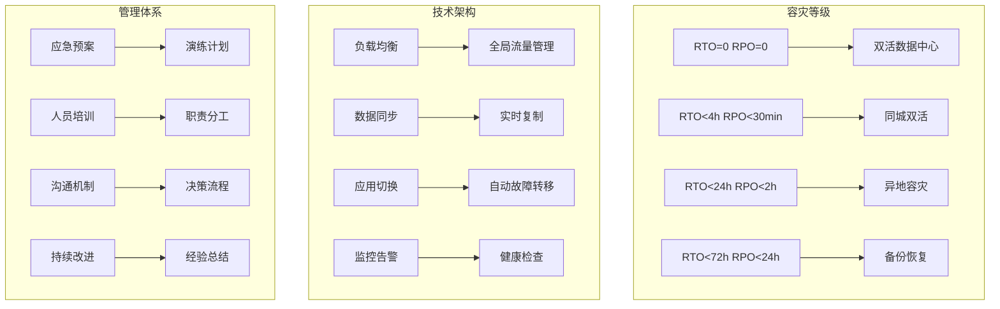

# 企业级容灾架构与混沌工程深度实践

> **作者**: 企业级灾备架构专家 | **版本**: v1.0 | **更新时间**: 2026-02-07
> **适用场景**: 企业级容灾架构设计与混沌工程实践 | **复杂度**: ⭐⭐⭐⭐⭐

## 🎯 摘要

本文档深入探讨企业级容灾架构设计、混沌工程实践和业务连续性管理，基于金融、电信、能源等关键行业的实践经验，提供从灾备策略到故障演练的完整技术指南。

## 1. 企业级容灾架构设计

### 1.1 容灾等级与策略



### 1.2 双活架构实现

```yaml
# active-active-architecture.yaml
disaster_recovery_architecture:
  data_centers:
    primary_dc:
      location: "北京亦庄数据中心"
      capacity: "100%"
      network_latency: "<2ms"
      services:
        - kubernetes_cluster: "primary-k8s"
        - database_cluster: "primary-db"
        - storage_system: "primary-storage"
        
    secondary_dc:
      location: "上海张江数据中心"
      capacity: "100%"
      network_latency: "<2ms"
      services:
        - kubernetes_cluster: "secondary-k8s"
        - database_cluster: "secondary-db"
        - storage_system: "secondary-storage"
  
  data_synchronization:
    database_replication:
      type: "multi-master"
      sync_mode: "real-time"
      conflict_resolution: "timestamp-based"
      monitoring:
        lag_threshold: "1s"
        alert_threshold: "5s"
        
    storage_replication:
      type: "synchronous"
      bandwidth: "10Gbps"
      compression: "enabled"
      encryption: "AES-256"
      
  traffic_management:
    global_load_balancer:
      provider: "F5 BIG-IP"
      health_check:
        interval: "5s"
        timeout: "3s"
        failure_threshold: 3
      routing_policy:
        - primary_weight: 70
        - secondary_weight: 30
        - failover_threshold: 50
        
    dns_failover:
      ttl: "60s"
      monitoring_endpoints:
        - "http://health-check.beijing.com"
        - "http://health-check.shanghai.com"
```

## 2. 混沌工程实践

### 2.1 混沌实验框架

```python
# chaos-engineering-framework.py
import time
import random
import logging
from datetime import datetime, timedelta
from typing import Dict, List, Callable, Optional
import kubernetes
import requests
from kubernetes import client, config

class ChaosEngineeringFramework:
    def __init__(self, kube_config_path: Optional[str] = None):
        if kube_config_path:
            config.load_kube_config(config_file=kube_config_path)
        else:
            config.load_incluster_config()
            
        self.core_v1 = client.CoreV1Api()
        self.apps_v1 = client.AppsV1Api()
        self.networking_v1 = client.NetworkingV1Api()
        self.logger = logging.getLogger(__name__)
        self.experiments = {}
        
    def define_experiment(self, name: str, target: str, 
                         hypothesis: str, steady_state: Dict) -> str:
        """定义混沌实验"""
        experiment_id = f"exp_{int(time.time())}_{random.randint(1000, 9999)}"
        
        self.experiments[experiment_id] = {
            'name': name,
            'target': target,
            'hypothesis': hypothesis,
            'steady_state': steady_state,
            'created_at': datetime.now().isoformat(),
            'status': 'defined'
        }
        
        self.logger.info(f"实验已定义: {experiment_id} - {name}")
        return experiment_id
    
    def inject_pod_failure(self, experiment_id: str, namespace: str, 
                          deployment_name: str, failure_rate: float = 0.3) -> bool:
        """注入Pod故障"""
        try:
            # 获取部署信息
            deployment = self.apps_v1.read_namespaced_deployment(
                deployment_name, namespace
            )
            
            # 计算需要删除的Pod数量
            current_replicas = deployment.spec.replicas
            pods_to_delete = max(1, int(current_replicas * failure_rate))
            
            # 获取Pod列表
            pods = self.core_v1.list_namespaced_pod(
                namespace, 
                label_selector=f"app={deployment.metadata.labels.get('app')}"
            )
            
            # 随机选择Pod进行删除
            selected_pods = random.sample(pods.items, min(pods_to_delete, len(pods.items)))
            
            deleted_pods = []
            for pod in selected_pods:
                self.core_v1.delete_namespaced_pod(pod.metadata.name, namespace)
                deleted_pods.append(pod.metadata.name)
                self.logger.info(f"已删除Pod: {pod.metadata.name}")
            
            # 更新实验状态
            self.experiments[experiment_id]['injected_faults'] = {
                'type': 'pod_failure',
                'deleted_pods': deleted_pods,
                'failure_rate': failure_rate,
                'injected_at': datetime.now().isoformat()
            }
            self.experiments[experiment_id]['status'] = 'running'
            
            return True
            
        except Exception as e:
            self.logger.error(f"注入Pod故障失败: {e}")
            return False
    
    def inject_network_partition(self, experiment_id: str, namespace: str,
                               network_policy_name: str) -> bool:
        """注入网络分区故障"""
        try:
            # 创建网络隔离策略
            network_policy = client.V1NetworkPolicy(
                metadata=client.V1ObjectMeta(name=f"chaos-{network_policy_name}"),
                spec=client.V1NetworkPolicySpec(
                    pod_selector=client.V1LabelSelector(
                        match_labels={"chaos-target": "true"}
                    ),
                    policy_types=["Ingress", "Egress"],
                    ingress=[],
                    egress=[]
                )
            )
            
            # 应用网络策略
            self.networking_v1.create_namespaced_network_policy(
                namespace, network_policy
            )
            
            self.experiments[experiment_id]['injected_faults'] = {
                'type': 'network_partition',
                'policy_name': f"chaos-{network_policy_name}",
                'injected_at': datetime.now().isoformat()
            }
            self.experiments[experiment_id]['status'] = 'running'
            
            self.logger.info(f"网络分区已注入: {network_policy_name}")
            return True
            
        except Exception as e:
            self.logger.error(f"注入网络分区失败: {e}")
            return False
    
    def inject_resource_exhaustion(self, experiment_id: str, namespace: str,
                                 deployment_name: str, resource_type: str = 'cpu') -> bool:
        """注入资源耗尽故障"""
        try:
            # 修改部署资源配置
            deployment = self.apps_v1.read_namespaced_deployment(
                deployment_name, namespace
            )
            
            # 设置极低的资源限制来造成资源耗尽
            container = deployment.spec.template.spec.containers[0]
            
            if resource_type == 'cpu':
                container.resources = client.V1ResourceRequirements(
                    limits={'cpu': '10m', 'memory': container.resources.limits.get('memory', '128Mi')},
                    requests={'cpu': '5m', 'memory': container.resources.requests.get('memory', '64Mi')}
                )
            elif resource_type == 'memory':
                container.resources = client.V1ResourceRequirements(
                    limits={'cpu': container.resources.limits.get('cpu', '100m'), 'memory': '16Mi'},
                    requests={'cpu': container.resources.requests.get('cpu', '50m'), 'memory': '8Mi'}
                )
            
            # 更新部署
            self.apps_v1.patch_namespaced_deployment(
                deployment_name, namespace, deployment
            )
            
            self.experiments[experiment_id]['injected_faults'] = {
                'type': 'resource_exhaustion',
                'resource_type': resource_type,
                'deployment': deployment_name,
                'injected_at': datetime.now().isoformat()
            }
            self.experiments[experiment_id]['status'] = 'running'
            
            self.logger.info(f"资源耗尽已注入: {deployment_name} - {resource_type}")
            return True
            
        except Exception as e:
            self.logger.error(f"注入资源耗尽失败: {e}")
            return False
    
    def monitor_steady_state(self, experiment_id: str, 
                           duration_seconds: int = 300) -> Dict:
        """监控稳态指标"""
        experiment = self.experiments[experiment_id]
        steady_state = experiment['steady_state']
        
        monitoring_results = {
            'experiment_id': experiment_id,
            'monitoring_start': datetime.now().isoformat(),
            'duration_seconds': duration_seconds,
            'metrics': {},
            'violations': []
        }
        
        start_time = time.time()
        
        while time.time() - start_time < duration_seconds:
            # 检查各项稳态指标
            for metric_name, criteria in steady_state.items():
                current_value = self._get_metric_value(metric_name, criteria.get('target'))
                
                monitoring_results['metrics'][metric_name] = {
                    'current_value': current_value,
                    'expected_range': criteria.get('range'),
                    'timestamp': datetime.now().isoformat()
                }
                
                # 检查是否违反稳态假设
                if not self._validate_metric(metric_name, current_value, criteria):
                    monitoring_results['violations'].append({
                        'metric': metric_name,
                        'current_value': current_value,
                        'expected_criteria': criteria,
                        'timestamp': datetime.now().isoformat()
                    })
            
            time.sleep(10)  # 每10秒检查一次
        
        monitoring_results['monitoring_end'] = datetime.now().isoformat()
        monitoring_results['steady_state_breached'] = len(monitoring_results['violations']) > 0
        
        self.experiments[experiment_id]['monitoring_results'] = monitoring_results
        return monitoring_results
    
    def rollback_experiment(self, experiment_id: str) -> bool:
        """回滚实验"""
        try:
            experiment = self.experiments[experiment_id]
            faults = experiment.get('injected_faults', {})
            
            if faults.get('type') == 'pod_failure':
                # Pod故障会自动恢复，无需特殊处理
                pass
                
            elif faults.get('type') == 'network_partition':
                # 删除网络隔离策略
                namespace = faults.get('namespace', 'default')
                policy_name = faults.get('policy_name')
                if policy_name:
                    self.networking_v1.delete_namespaced_network_policy(
                        policy_name, namespace
                    )
                    
            elif faults.get('type') == 'resource_exhaustion':
                # 恢复正常的资源配置（需要预先保存）
                pass
            
            experiment['status'] = 'completed'
            experiment['rollback_completed'] = datetime.now().isoformat()
            
            self.logger.info(f"实验已回滚: {experiment_id}")
            return True
            
        except Exception as e:
            self.logger.error(f"回滚实验失败: {e}")
            return False
    
    def generate_experiment_report(self, experiment_id: str) -> Dict:
        """生成实验报告"""
        experiment = self.experiments[experiment_id]
        
        report = {
            'experiment_id': experiment_id,
            'name': experiment['name'],
            'target': experiment['target'],
            'hypothesis': experiment['hypothesis'],
            'execution_summary': {
                'created_at': experiment['created_at'],
                'status': experiment['status'],
                'injected_faults': experiment.get('injected_faults'),
                'monitoring_results': experiment.get('monitoring_results')
            },
            'analysis': self._analyze_experiment_outcome(experiment),
            'recommendations': self._generate_recommendations(experiment)
        }
        
        return report
    
    def _get_metric_value(self, metric_name: str, target: str) -> float:
        """获取指标值"""
        # 这里应该是实际的监控系统集成
        # 简化实现，返回模拟值
        if metric_name == 'response_time':
            return random.uniform(50, 200)
        elif metric_name == 'error_rate':
            return random.uniform(0, 0.05)
        elif metric_name == 'availability':
            return random.uniform(0.95, 1.0)
        else:
            return 0.0
    
    def _validate_metric(self, metric_name: str, value: float, criteria: Dict) -> bool:
        """验证指标是否符合预期"""
        expected_range = criteria.get('range', [0, float('inf')])
        return expected_range[0] <= value <= expected_range[1]
    
    def _analyze_experiment_outcome(self, experiment: Dict) -> Dict:
        """分析实验结果"""
        monitoring_results = experiment.get('monitoring_results', {})
        faults = experiment.get('injected_faults', {})
        
        analysis = {
            'hypothesis_validated': not monitoring_results.get('steady_state_breached', False),
            'system_resilience': 'high' if not monitoring_results.get('violations') else 'low',
            'recovery_observed': faults.get('type') is not None,
            'impact_assessment': {
                'severity': 'low' if not monitoring_results.get('violations') else 'high',
                'affected_components': [faults.get('type')] if faults.get('type') else []
            }
        }
        
        return analysis
    
    def _generate_recommendations(self, experiment: Dict) -> List[str]:
        """生成改进建议"""
        recommendations = []
        analysis = self._analyze_experiment_outcome(experiment)
        
        if not analysis['hypothesis_validated']:
            recommendations.append("系统在故障下未能保持稳态，需要加强容错能力")
        
        if analysis['system_resilience'] == 'low':
            recommendations.append("建议实施更完善的健康检查和自动恢复机制")
        
        fault_type = experiment.get('injected_faults', {}).get('type')
        if fault_type == 'pod_failure':
            recommendations.append("考虑增加Pod副本数和部署反亲和性策略")
        elif fault_type == 'network_partition':
            recommendations.append("优化服务间的超时和重试机制")
        elif fault_type == 'resource_exhaustion':
            recommendations.append("实施更精细的资源配额和限制策略")
        
        return recommendations

# 使用示例
chaos_framework = ChaosEngineeringFramework()

# 定义实验
exp_id = chaos_framework.define_experiment(
    name="用户服务容错能力测试",
    target="user-service-deployment",
    hypothesis="即使30%的Pod失效，服务仍能保持99%的可用性",
    steady_state={
        'availability': {'range': [0.99, 1.0]},
        'response_time': {'range': [0, 500]},
        'error_rate': {'range': [0, 0.01]}
    }
)

# 注入故障
chaos_framework.inject_pod_failure(exp_id, "production", "user-service", 0.3)

# 监控稳态
results = chaos_framework.monitor_steady_state(exp_id, 300)

# 回滚实验
chaos_framework.rollback_experiment(exp_id)

# 生成报告
report = chaos_framework.generate_experiment_report(exp_id)
print(json.dumps(report, indent=2, ensure_ascii=False))
```

## 3. 业务影响分析

### 3.1 业务连续性管理

```yaml
# business-continuity-management.yaml
business_continuity_plan:
  critical_business_functions:
    - function_name: "客户交易处理"
      rto: "2小时"
      rpo: "5分钟"
      dependencies:
        - "支付网关"
        - "风控系统"
        - "清算系统"
      recovery_procedures:
        - "启动备用交易通道"
        - "切换至灾备数据中心"
        - "验证交易数据一致性"
        
    - function_name: "客户服务热线"
      rto: "4小时"
      rpo: "30分钟"
      dependencies:
        - "呼叫中心系统"
        - "CRM系统"
        - "知识库系统"
      recovery_procedures:
        - "启用云呼叫中心"
        - "同步客户数据"
        - "配置话务路由"

  incident_response:
    escalation_levels:
      level_1:
        response_time: "15分钟"
        team: "一线运维"
        actions: ["初步诊断", "状态确认"]
        
      level_2:
        response_time: "1小时"
        team: "二线技术支持"
        actions: ["深入分析", "制定恢复方案"]
        
      level_3:
        response_time: "4小时"
        team: "高级专家团队"
        actions: ["根本原因分析", "重大故障处理"]
        
      level_4:
        response_time: "8小时"
        team: "管理层"
        actions: ["业务影响评估", "决策支持"]

  communication_plan:
    internal_stakeholders:
      - executives: ["CEO", "CTO", "CFO"]
      - department_heads: ["IT总监", "运营总监", "客服总监"]
      - technical_teams: ["运维团队", "开发团队", "安全团队"]
    
    external_stakeholders:
      - customers: ["重要客户通知", "服务状态更新"]
      - regulators: ["合规报告", "监管沟通"]
      - vendors: ["供应商协调", "第三方服务管理"]

  training_and_exercises:
    annual_schedule:
      q1: "桌面推演 - 理论流程验证"
      q2: "功能演练 - 部分系统测试"
      q3: "完整演练 - 全流程模拟"
      q4: "评估改进 - 经验总结优化"
    
    exercise_scenarios:
      - "数据中心火灾应急响应"
      - "大规模DDoS攻击处置"
      - "核心数据库损坏恢复"
      - "供应链中断应对"
```

通过以上企业级容灾架构与混沌工程深度实践，企业可以建立完善的业务连续性管理体系，确保在各种故障场景下都能快速恢复业务运营。