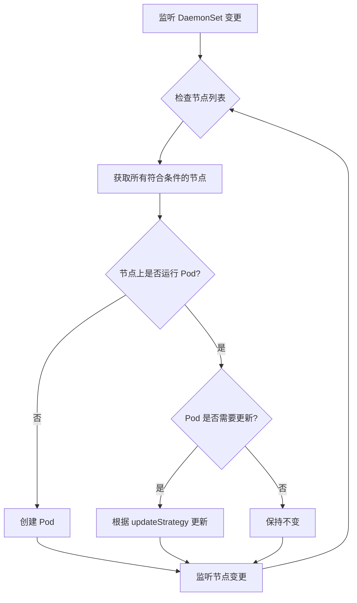

# 06 - DaemonSet YAML 配置参考

> **适用版本**: Kubernetes v1.25 - v1.32 | **最后更新**: 2026-02 | **难度**: 入门 → 专家全覆盖

---

## 📋 目录

- [概述](#概述)
- [API 信息](#api-信息)
- [完整字段规格表](#完整字段规格表)
- [最小配置示例](#最小配置示例)
- [生产级配置示例](#生产级配置示例)
- [高级特性](#高级特性)
- [内部原理](#内部原理)
- [版本兼容性](#版本兼容性)
- [最佳实践](#最佳实践)
- [常见问题 FAQ](#常见问题-faq)
- [生产案例](#生产案例)
- [相关资源](#相关资源)

---

## 概述

DaemonSet 确保**所有(或部分)节点上运行一个 Pod 副本**。当节点加入集群时,会自动为其添加 Pod;当节点从集群移除时,这些 Pod 也会被回收。删除 DaemonSet 将清理它创建的所有 Pod。

**核心特性**:
- **节点全覆盖** - 每个符合条件的节点自动运行一个 Pod
- **自动调度** - 无需 kube-scheduler,由 DaemonSet Controller 直接调度
- **节点亲和性** - 支持通过 nodeSelector/affinity 控制部署范围
- **滚动更新** - 支持 RollingUpdate 和 OnDelete 策略

**典型应用场景**:
- 日志收集 (Fluentd, Filebeat, Logstash)
- 监控代理 (Node Exporter, Datadog Agent, Prometheus Node Exporter)
- 网络插件 (Calico, Flannel, Cilium CNI)
- 存储守护进程 (Ceph, GlusterFS)
- 安全代理 (Falco, Sysdig)

---

## API 信息

```yaml
apiVersion: apps/v1
kind: DaemonSet
```

| 属性 | 值 |
|-----|-----|
| **API Group** | `apps` |
| **API Version** | `v1` (稳定版,自 Kubernetes v1.9) |
| **资源简称** | `ds` |
| **命名空间作用域** | 是 |
| **kubectl 命令** | `kubectl get daemonset`, `kubectl describe ds <name>` |

---

## 完整字段规格表

### 核心字段 (spec)

| 字段路径 | 类型 | 必需 | 默认值 | 说明 | 引入版本 |
|---------|------|------|--------|------|----------|
| `spec.selector` | object | ✅ | - | Pod 标签选择器 (必须匹配 template.labels) | v1.9 |
| `spec.template` | object | ✅ | - | Pod 模板定义 | v1.9 |
| `spec.updateStrategy.type` | string | ❌ | RollingUpdate | 更新策略: `RollingUpdate` / `OnDelete` | v1.6 |
| `spec.updateStrategy.rollingUpdate.maxUnavailable` | intstr | ❌ | 1 | 滚动更新时允许的最大不可用 Pod 数 | v1.6 |
| `spec.updateStrategy.rollingUpdate.maxSurge` | intstr | ❌ | 0 | 滚动更新时允许超出目标数量的 Pod 数 | v1.25+ |
| `spec.minReadySeconds` | integer | ❌ | 0 | Pod Ready 后等待的最小秒数 | v1.9 |
| `spec.revisionHistoryLimit` | integer | ❌ | 10 | 保留的历史版本数量 | v1.9 |

### updateStrategy 详细说明

| 策略类型 | 行为 | 使用场景 |
|---------|------|----------|
| **RollingUpdate** (默认) | 自动逐个节点滚动更新 Pod | 生产环境推荐,支持自动化更新 |
| **OnDelete** | 仅在手动删除旧 Pod 后创建新 Pod | 需要手动控制更新时机的场景 |

### maxUnavailable / maxSurge (v1.25+)

| 参数 | 类型 | 说明 | 示例 |
|------|------|------|------|
| `maxUnavailable` | int / string | 滚动更新时允许的最大不可用 Pod 数 | `1` (整数) / `"25%"` (百分比) |
| `maxSurge` | int / string | 允许超出期望数量的 Pod 数 (用于提前创建新 Pod) | `0` (默认) / `1` (整数) / `"10%"` (百分比) |

**maxSurge 工作原理** (v1.25+):
- `maxSurge: 0` (默认) - 先删除旧 Pod 再创建新 Pod (节点上只运行 1 个 Pod)
- `maxSurge: 1` - 先创建新 Pod,验证正常后再删除旧 Pod (短暂运行 2 个 Pod,减少服务中断)

---

## 最小配置示例

```yaml
# 最小 DaemonSet 配置 - Node Exporter 监控
apiVersion: apps/v1
kind: DaemonSet
metadata:
  name: node-exporter
  namespace: monitoring
spec:
  # 必需: Pod 选择器
  selector:
    matchLabels:
      app: node-exporter
  
  # 必需: Pod 模板
  template:
    metadata:
      labels:
        app: node-exporter
    spec:
      # 容忍主节点污点 (可选,如果需要在 Master 节点运行)
      tolerations:
      - key: node-role.kubernetes.io/control-plane
        effect: NoSchedule
      
      # Host 网络模式 (监控节点本身)
      hostNetwork: true
      hostPID: true
      
      containers:
      - name: node-exporter
        image: prom/node-exporter:v1.7.0
        ports:
        - containerPort: 9100
          name: metrics
        
        # 挂载主机文件系统 (只读)
        volumeMounts:
        - name: proc
          mountPath: /host/proc
          readOnly: true
        - name: sys
          mountPath: /host/sys
          readOnly: true
        
        # 资源限制
        resources:
          requests:
            cpu: 100m
            memory: 100Mi
          limits:
            cpu: 200m
            memory: 200Mi
      
      # 卷定义
      volumes:
      - name: proc
        hostPath:
          path: /proc
      - name: sys
        hostPath:
          path: /sys
```

**部署结果**:
- 每个节点自动运行 1 个 `node-exporter` Pod
- 新节点加入时自动部署
- 节点移除时自动清理

---

## 生产级配置示例

```yaml
# 生产级 DaemonSet 配置 - Fluentd 日志收集
apiVersion: apps/v1
kind: DaemonSet
metadata:
  name: fluentd
  namespace: kube-system
  labels:
    app: fluentd
    tier: logging
  annotations:
    description: "Fluentd 日志收集守护进程,收集所有节点容器日志"
spec:
  # Pod 选择器
  selector:
    matchLabels:
      app: fluentd
  
  # 滚动更新策略
  updateStrategy:
    type: RollingUpdate
    rollingUpdate:
      # 最大不可用 Pod 数量 (整数或百分比)
      maxUnavailable: 1
      # v1.25+ 允许超额 Pod 数量 (先创建新 Pod 再删除旧 Pod)
      maxSurge: 0
  
  # 最小就绪秒数 (防止新 Pod 未完全就绪就进行下一个更新)
  minReadySeconds: 30
  
  # 保留历史版本数量
  revisionHistoryLimit: 10
  
  # Pod 模板
  template:
    metadata:
      labels:
        app: fluentd
        tier: logging
      annotations:
        # Prometheus 监控
        prometheus.io/scrape: "true"
        prometheus.io/port: "24231"
        # 配置文件版本 (用于触发 Pod 重启)
        config-version: "v2.0"
    spec:
      # 服务账号 (需要权限访问 Kubernetes API)
      serviceAccountName: fluentd
      
      # 容忍度: 允许在所有节点(包括 Master)运行
      tolerations:
      - key: node-role.kubernetes.io/control-plane
        effect: NoSchedule
      - key: node-role.kubernetes.io/master
        effect: NoSchedule
      - key: node.kubernetes.io/not-ready
        effect: NoExecute
        tolerationSeconds: 300
      - key: node.kubernetes.io/unreachable
        effect: NoExecute
        tolerationSeconds: 300
      
      # 节点选择器: 仅在标记为日志收集的节点运行 (可选)
      # nodeSelector:
      #   logging: enabled
      
      # 节点亲和性: 排除特定节点
      affinity:
        nodeAffinity:
          requiredDuringSchedulingIgnoredDuringExecution:
            nodeSelectorTerms:
            - matchExpressions:
              # 排除 Windows 节点
              - key: kubernetes.io/os
                operator: In
                values:
                - linux
      
      # 优先级类 (确保日志收集优先级高)
      priorityClassName: system-node-critical
      
      # 初始化容器: 确保日志目录权限
      initContainers:
      - name: config-fluentd
        image: busybox:1.36
        command:
        - sh
        - -c
        - |
          # 创建日志缓冲目录
          mkdir -p /var/log/fluentd-buffers
          chmod 755 /var/log/fluentd-buffers
        volumeMounts:
        - name: varlog
          mountPath: /var/log
      
      # 主容器
      containers:
      - name: fluentd
        image: fluent/fluentd-kubernetes-daemonset:v1.16-debian-elasticsearch7-1
        env:
        - name: FLUENT_ELASTICSEARCH_HOST
          value: "elasticsearch.logging.svc.cluster.local"
        - name: FLUENT_ELASTICSEARCH_PORT
          value: "9200"
        - name: FLUENT_ELASTICSEARCH_SCHEME
          value: "http"
        - name: FLUENT_ELASTICSEARCH_USER
          valueFrom:
            secretKeyRef:
              name: elasticsearch-credentials
              key: username
        - name: FLUENT_ELASTICSEARCH_PASSWORD
          valueFrom:
            secretKeyRef:
              name: elasticsearch-credentials
              key: password
        - name: FLUENTD_SYSTEMD_CONF
          value: "disable"
        - name: FLUENT_CONTAINER_TAIL_PARSER_TYPE
          value: "cri"  # CRI 日志格式 (containerd/cri-o)
        - name: FLUENT_CONTAINER_TAIL_PARSER_TIME_FORMAT
          value: "%Y-%m-%dT%H:%M:%S.%N%:z"
        
        # 资源配置
        resources:
          requests:
            cpu: 100m
            memory: 200Mi
          limits:
            cpu: 500m
            memory: 500Mi
        
        # 存活探测
        livenessProbe:
          httpGet:
            path: /fluentd.healthcheck?json=%7B%22ping%22%3A+%22pong%22%7D
            port: 9880
          initialDelaySeconds: 120
          periodSeconds: 30
          timeoutSeconds: 5
          failureThreshold: 3
        
        # 就绪探测
        readinessProbe:
          httpGet:
            path: /fluentd.healthcheck?json=%7B%22ping%22%3A+%22pong%22%7D
            port: 9880
          initialDelaySeconds: 10
          periodSeconds: 10
          timeoutSeconds: 3
          successThreshold: 1
          failureThreshold: 3
        
        # 卷挂载
        volumeMounts:
        # 容器日志目录 (Kubelet 管理)
        - name: varlog
          mountPath: /var/log
          readOnly: true
        # 容器运行时数据目录
        - name: varlibdockercontainers
          mountPath: /var/lib/docker/containers
          readOnly: true
        # containerd 日志目录 (如果使用 containerd)
        - name: varlibcontainerd
          mountPath: /var/lib/containerd
          readOnly: true
        # Fluentd 配置文件
        - name: fluentd-config
          mountPath: /fluentd/etc/fluent.conf
          subPath: fluent.conf
        # Fluentd 缓冲目录 (持久化)
        - name: fluentd-buffer
          mountPath: /var/log/fluentd-buffers
        # 主机时区 (确保时间戳正确)
        - name: timezone
          mountPath: /etc/localtime
          readOnly: true
      
      # 卷定义
      volumes:
      # 主机日志目录
      - name: varlog
        hostPath:
          path: /var/log
      # Docker 容器日志目录
      - name: varlibdockercontainers
        hostPath:
          path: /var/lib/docker/containers
      # containerd 日志目录
      - name: varlibcontainerd
        hostPath:
          path: /var/lib/containerd
      # Fluentd 配置 (ConfigMap)
      - name: fluentd-config
        configMap:
          name: fluentd-config
      # Fluentd 缓冲目录 (使用 hostPath 持久化)
      - name: fluentd-buffer
        hostPath:
          path: /var/log/fluentd-buffers
          type: DirectoryOrCreate
      # 主机时区
      - name: timezone
        hostPath:
          path: /etc/localtime
      
      # 终止宽限期 (确保日志刷新)
      terminationGracePeriodSeconds: 60
---
# ServiceAccount (赋予 Fluentd 访问 Kubernetes API 的权限)
apiVersion: v1
kind: ServiceAccount
metadata:
  name: fluentd
  namespace: kube-system
---
# ClusterRole (定义权限)
apiVersion: rbac.authorization.k8s.io/v1
kind: ClusterRole
metadata:
  name: fluentd
rules:
- apiGroups: [""]
  resources:
  - pods
  - namespaces
  verbs:
  - get
  - list
  - watch
---
# ClusterRoleBinding (绑定权限)
apiVersion: rbac.authorization.k8s.io/v1
kind: ClusterRoleBinding
metadata:
  name: fluentd
roleRef:
  apiGroup: rbac.authorization.k8s.io
  kind: ClusterRole
  name: fluentd
subjects:
- kind: ServiceAccount
  name: fluentd
  namespace: kube-system
---
# ConfigMap (Fluentd 配置文件)
apiVersion: v1
kind: ConfigMap
metadata:
  name: fluentd-config
  namespace: kube-system
data:
  fluent.conf: |
    # 输入: 收集 Kubernetes 容器日志
    <source>
      @type tail
      path /var/log/containers/*.log
      pos_file /var/log/fluentd-containers.log.pos
      tag kubernetes.*
      read_from_head true
      <parse>
        @type json
        time_format %Y-%m-%dT%H:%M:%S.%NZ
      </parse>
    </source>
    
    # 过滤器: 添加 Kubernetes 元数据
    <filter kubernetes.**>
      @type kubernetes_metadata
    </filter>
    
    # 输出: 发送到 Elasticsearch
    <match **>
      @type elasticsearch
      host "#{ENV['FLUENT_ELASTICSEARCH_HOST']}"
      port "#{ENV['FLUENT_ELASTICSEARCH_PORT']}"
      scheme "#{ENV['FLUENT_ELASTICSEARCH_SCHEME']}"
      user "#{ENV['FLUENT_ELASTICSEARCH_USER']}"
      password "#{ENV['FLUENT_ELASTICSEARCH_PASSWORD']}"
      index_name fluentd
      type_name _doc
      logstash_format true
      logstash_prefix kubernetes
      <buffer>
        @type file
        path /var/log/fluentd-buffers/kubernetes.buffer
        flush_mode interval
        flush_interval 5s
        chunk_limit_size 2M
        queue_limit_length 32
        retry_max_interval 30
        retry_forever true
      </buffer>
    </match>
```

**配置说明**:
- **全节点覆盖**: 包括 Master 节点 (配置容忍度)
- **自动日志收集**: 挂载主机日志目录,收集所有容器日志
- **高可用**: 配置健康检查和资源限制
- **持久化缓冲**: 使用 hostPath 持久化日志缓冲 (避免节点重启丢失)
- **RBAC 权限**: 获取 Pod/Namespace 元数据丰富日志

---

## 高级特性

### 1. 控制部署范围

#### 方法 1: nodeSelector (简单选择)

```yaml
spec:
  template:
    spec:
      # 仅在标记为 logging=enabled 的节点运行
      nodeSelector:
        logging: enabled
```

```bash
# 为节点添加标签
kubectl label nodes node1 node2 logging=enabled

# 移除标签 (Pod 会自动从节点删除)
kubectl label nodes node1 logging-
```

#### 方法 2: nodeAffinity (复杂条件)

```yaml
spec:
  template:
    spec:
      affinity:
        nodeAffinity:
          # 必须满足的条件
          requiredDuringSchedulingIgnoredDuringExecution:
            nodeSelectorTerms:
            - matchExpressions:
              # 仅在 Linux 节点运行
              - key: kubernetes.io/os
                operator: In
                values:
                - linux
              # 排除 GPU 节点 (节省资源)
              - key: nvidia.com/gpu
                operator: DoesNotExist
          
          # 偏好条件 (权重)
          preferredDuringSchedulingIgnoredDuringExecution:
          - weight: 100
            preference:
              matchExpressions:
              - key: node-role.kubernetes.io/worker
                operator: Exists
```

#### 方法 3: Taints 和 Tolerations

```yaml
spec:
  template:
    spec:
      tolerations:
      # 容忍 Master 节点污点
      - key: node-role.kubernetes.io/control-plane
        effect: NoSchedule
      # 容忍 GPU 节点污点
      - key: nvidia.com/gpu
        operator: Exists
        effect: NoSchedule
      # 容忍节点未就绪 (短时间)
      - key: node.kubernetes.io/not-ready
        effect: NoExecute
        tolerationSeconds: 300
```

### 2. 更新策略对比

#### RollingUpdate (滚动更新)

```yaml
spec:
  updateStrategy:
    type: RollingUpdate
    rollingUpdate:
      maxUnavailable: 1  # 每次最多 1 个节点不可用
```

**工作流程**:
```
1. 删除 node1 上的旧 Pod
2. 等待旧 Pod 终止
3. 创建 node1 上的新 Pod
4. 等待新 Pod Ready
5. 继续更新 node2...
```

**优点**: 自动化,可控制更新速度
**缺点**: 可能在所有节点应用未验证的配置

#### OnDelete (手动更新)

```yaml
spec:
  updateStrategy:
    type: OnDelete
```

**工作流程**:
```bash
# 更新 DaemonSet 配置 (不会触发 Pod 更新)
kubectl apply -f daemonset.yaml

# 手动删除 Pod 触发更新
kubectl delete pod fluentd-xxx -n kube-system
# DaemonSet Controller 会创建新版本 Pod
```

**优点**: 完全控制更新时机,可逐个节点验证
**缺点**: 需要手动操作,容易遗漏节点

### 3. maxSurge 策略 (v1.25+)

```yaml
spec:
  updateStrategy:
    type: RollingUpdate
    rollingUpdate:
      maxUnavailable: 0  # 不允许不可用
      maxSurge: 1        # 允许临时超额 1 个 Pod
```

**工作原理**:
```
传统滚动更新 (maxSurge: 0):
1. 删除旧 Pod
2. 等待旧 Pod 终止 (服务中断)
3. 创建新 Pod
4. 等待新 Pod Ready (服务恢复)

maxSurge 滚动更新 (maxSurge: 1):
1. 创建新 Pod (与旧 Pod 共存)
2. 等待新 Pod Ready
3. 删除旧 Pod (无服务中断)
4. 等待旧 Pod 终止
```

**适用场景**:
- 关键服务 (日志收集、监控) - 不能中断
- 节点资源充足 (可以短暂运行 2 个 Pod)

**注意事项**:
- `maxSurge + maxUnavailable` 必须 > 0
- 节点上可能短暂运行 2 个 Pod (需要足够资源)

### 4. 优先级与抢占

```yaml
spec:
  template:
    spec:
      # 系统级优先级 (确保 DaemonSet 优先调度)
      priorityClassName: system-node-critical
```

**预定义优先级类**:

| 优先级类 | 值 | 适用场景 |
|---------|----|----|
| `system-node-critical` | 2000001000 | 关键节点组件 (CNI, kube-proxy) |
| `system-cluster-critical` | 2000000000 | 关键集群组件 (CoreDNS, Metrics Server) |

**自定义优先级类**:

```yaml
apiVersion: scheduling.k8s.io/v1
kind: PriorityClass
metadata:
  name: high-priority-daemonset
value: 1000000
globalDefault: false
description: "高优先级 DaemonSet"
```

---

## 内部原理

### 1. DaemonSet Controller 工作流程



**关键行为**:
1. **节点匹配**: 计算哪些节点应该运行 DaemonSet Pod
   - 检查 nodeSelector
   - 检查 nodeAffinity
   - 检查 taints/tolerations
2. **Pod 创建**: 为符合条件的节点创建 Pod
   - Pod 名称: `{daemonset-name}-{random-suffix}`
   - Pod 直接由 DaemonSet Controller 调度 (不经过 kube-scheduler)
3. **Pod 更新**: 根据 updateStrategy 更新 Pod
4. **Pod 删除**: 节点不再匹配时删除 Pod

### 2. DaemonSet 与 kube-scheduler 协作

**历史演进**:

| Kubernetes 版本 | 调度方式 | 说明 |
|----------------|---------|------|
| **v1.11 之前** | DaemonSet Controller 直接调度 | 绕过 kube-scheduler,直接设置 `spec.nodeName` |
| **v1.12+** | 默认调度器调度 (推荐) | 使用 `NodeAffinity` + kube-scheduler 调度 |

**现代调度流程** (v1.12+):

```yaml
# DaemonSet Controller 生成的 Pod 配置
apiVersion: v1
kind: Pod
metadata:
  name: fluentd-abc123
  ownerReferences:
  - apiVersion: apps/v1
    kind: DaemonSet
    name: fluentd
spec:
  # 由 DaemonSet Controller 自动注入
  affinity:
    nodeAffinity:
      requiredDuringSchedulingIgnoredDuringExecution:
        nodeSelectorTerms:
        - matchFields:
          - key: metadata.name
            operator: In
            values:
            - node1  # 指定节点
  tolerations:
  - key: node.kubernetes.io/not-ready
    operator: Exists
    effect: NoExecute
  - key: node.kubernetes.io/unreachable
    operator: Exists
    effect: NoExecute
  - key: node.kubernetes.io/disk-pressure
    operator: Exists
    effect: NoSchedule
  # ... (自动容忍所有污点)
```

**优势**:
- 支持自定义调度器 (schedulerName)
- 支持 Pod 优先级和抢占
- 统一调度逻辑 (Preemption, Topology Spread)

### 3. Pod 命名规则

```
{daemonset-name}-{random-5-char}
```

**示例**:
```
fluentd-x7d9f
fluentd-k2p8s
fluentd-m3n4t
```

**特性**:
- Pod 名称随机,不绑定节点名称
- Pod 重建后名称会变化
- 通过 `spec.nodeName` 字段确定运行节点

### 4. 节点变更自动响应

| 事件 | DaemonSet 行为 |
|------|---------------|
| **节点加入集群** | 自动在节点上创建 Pod |
| **节点打上新标签** | 如果匹配 nodeSelector,创建 Pod |
| **节点移除标签** | 如果不再匹配 nodeSelector,删除 Pod |
| **节点添加污点** | 如果没有对应 toleration,删除 Pod |
| **节点移除污点** | 如果现在匹配条件,创建 Pod |
| **节点从集群移除** | 自动删除 Pod (由 Node Controller 处理) |

---

## 版本兼容性

| 功能特性 | 引入版本 | 稳定版本 | 说明 |
|---------|---------|---------|------|
| **DaemonSet (基础)** | v1.2 (Beta) | v1.9 (GA) | 每节点运行一个 Pod 副本 |
| `updateStrategy.type: RollingUpdate` | v1.6 (Beta) | v1.9 (GA) | 滚动更新策略 |
| `updateStrategy.type: OnDelete` | v1.6 (Beta) | v1.9 (GA) | 手动删除更新策略 |
| `maxUnavailable` | v1.6 (Beta) | v1.9 (GA) | 控制滚动更新速度 |
| 默认调度器调度 | v1.12 (Beta) | v1.17 (GA) | 使用 kube-scheduler 而非直接设置 nodeName |
| `maxSurge` | v1.21 (Alpha) | v1.25 (Beta) | 先创建新 Pod 再删除旧 Pod (减少中断) |
| `minReadySeconds` | v1.9 (GA) | v1.9 (GA) | Pod 就绪等待时间 |

**Feature Gates**:

| Feature Gate | 默认启用版本 | GA 版本 |
|-------------|-------------|---------|
| `DaemonSetUpdateSurge` | v1.25 (Beta) | 计划 v1.32 (GA) |

---

## 最佳实践

### 1. 资源配置

✅ **设置合理的资源限制**:
```yaml
resources:
  requests:
    cpu: 100m      # 低优先级任务
    memory: 200Mi
  limits:
    cpu: 500m      # 防止节点资源耗尽
    memory: 500Mi
```

✅ **为关键服务预留资源**:
```yaml
# 在节点层面预留资源
kubelet --kube-reserved=cpu=500m,memory=1Gi --system-reserved=cpu=500m,memory=1Gi
```

### 2. 健康检查

✅ **配置 livenessProbe 和 readinessProbe**:
```yaml
livenessProbe:
  httpGet:
    path: /health
    port: 9880
  initialDelaySeconds: 120  # 初始化时间较长
  periodSeconds: 30
  timeoutSeconds: 5
  failureThreshold: 3

readinessProbe:
  httpGet:
    path: /ready
    port: 9880
  initialDelaySeconds: 10
  periodSeconds: 10
```

### 3. 日志与监控

✅ **标准化日志输出**:
```yaml
containers:
- name: app
  # 日志输出到 stdout/stderr (Fluentd 会自动收集)
  command: ["/app", "--log-to-stdout"]
```

✅ **暴露 Prometheus 指标**:
```yaml
containers:
- name: app
  ports:
  - name: metrics
    containerPort: 9090
  annotations:
    prometheus.io/scrape: "true"
    prometheus.io/port: "9090"
```

### 4. 安全配置

✅ **最小权限原则**:
```yaml
spec:
  template:
    spec:
      serviceAccountName: fluentd  # 专用 ServiceAccount
      securityContext:
        runAsNonRoot: true
        runAsUser: 1000
        fsGroup: 1000
        seccompProfile:
          type: RuntimeDefault
      containers:
      - name: app
        securityContext:
          allowPrivilegeEscalation: false
          readOnlyRootFilesystem: true
          capabilities:
            drop:
            - ALL
```

✅ **只读挂载主机目录**:
```yaml
volumeMounts:
- name: varlog
  mountPath: /var/log
  readOnly: true  # 只读,防止误修改
```

### 5. 更新策略

✅ **生产环境使用 maxSurge** (v1.25+):
```yaml
updateStrategy:
  type: RollingUpdate
  rollingUpdate:
    maxUnavailable: 0  # 不允许服务中断
    maxSurge: 1        # 先创建新 Pod
```

✅ **关键节点使用 OnDelete** (手动控制):
```yaml
updateStrategy:
  type: OnDelete  # 手动删除 Pod 触发更新
```

### 6. 节点容忍度

✅ **容忍常见污点**:
```yaml
tolerations:
# Master 节点
- key: node-role.kubernetes.io/control-plane
  effect: NoSchedule
# 节点未就绪 (短时间容忍)
- key: node.kubernetes.io/not-ready
  effect: NoExecute
  tolerationSeconds: 300
# 节点不可达
- key: node.kubernetes.io/unreachable
  effect: NoExecute
  tolerationSeconds: 300
# 磁盘压力
- key: node.kubernetes.io/disk-pressure
  effect: NoSchedule
# 内存压力
- key: node.kubernetes.io/memory-pressure
  effect: NoSchedule
```

---

## 常见问题 FAQ

### Q1: DaemonSet 和 Deployment 的区别?

| 特性 | DaemonSet | Deployment |
|-----|-----------|-----------|
| **副本数量** | 每节点 1 个 (自动) | 固定副本数 (手动设置) |
| **调度策略** | 每个符合条件的节点自动调度 | kube-scheduler 自由调度 |
| **扩缩容** | 跟随节点数量自动扩缩容 | 手动或 HPA 自动扩缩容 |
| **使用场景** | 节点级服务 (日志、监控、网络) | 应用服务 (Web、API) |
| **Pod 分布** | 每节点均匀分布 (强制) | 可能集中在少数节点 |

### Q2: 如何在特定节点上运行 DaemonSet?

**方法 1: nodeSelector (推荐)**:
```yaml
spec:
  template:
    spec:
      nodeSelector:
        role: logging  # 仅在标记的节点运行
```

```bash
# 为节点添加标签
kubectl label nodes node1 node2 node3 role=logging
```

**方法 2: nodeAffinity**:
```yaml
spec:
  template:
    spec:
      affinity:
        nodeAffinity:
          requiredDuringSchedulingIgnoredDuringExecution:
            nodeSelectorTerms:
            - matchExpressions:
              - key: node-role.kubernetes.io/worker
                operator: Exists
```

### Q3: 如何排除 Master 节点?

**移除 Master 节点容忍度** (默认配置会包含):
```yaml
spec:
  template:
    spec:
      tolerations: []  # 不容忍任何污点 (Master 节点会被排除)
```

**或者使用 nodeAffinity 排除**:
```yaml
affinity:
  nodeAffinity:
    requiredDuringSchedulingIgnoredDuringExecution:
      nodeSelectorTerms:
      - matchExpressions:
        - key: node-role.kubernetes.io/control-plane
          operator: DoesNotExist
```

### Q4: DaemonSet 滚动更新失败如何回滚?

```bash
# 查看历史版本
kubectl rollout history daemonset fluentd -n kube-system

# 回滚到上一个版本
kubectl rollout undo daemonset fluentd -n kube-system

# 回滚到指定版本
kubectl rollout undo daemonset fluentd -n kube-system --to-revision=3

# 查看回滚状态
kubectl rollout status daemonset fluentd -n kube-system
```

### Q5: 如何手动触发 DaemonSet Pod 重启?

**方法 1: 修改 Pod 模板 (触发滚动更新)**:
```bash
# 修改注解触发更新
kubectl patch daemonset fluentd -n kube-system -p \
  '{"spec":{"template":{"metadata":{"annotations":{"restart-at":"'$(date +%s)'"}}}}}'
```

**方法 2: 手动删除 Pod (DaemonSet 会自动重建)**:
```bash
# 删除特定节点的 Pod
kubectl delete pod fluentd-xxx -n kube-system

# 删除所有 Pod (逐个重建)
kubectl delete pods -l app=fluentd -n kube-system
```

### Q6: 节点资源不足时 DaemonSet Pod 会被驱逐吗?

**取决于 PriorityClass**:

| 场景 | PriorityClass | 结果 |
|------|--------------|------|
| **高优先级** | `system-node-critical` | 不会被驱逐,可能驱逐其他低优先级 Pod |
| **普通优先级** | 无或自定义 | 可能被驱逐 |

**推荐配置**:
```yaml
spec:
  template:
    spec:
      priorityClassName: system-node-critical  # 关键服务设置高优先级
```

### Q7: 如何监控 DaemonSet 健康状态?

```bash
# 查看 DaemonSet 状态
kubectl get daemonset fluentd -n kube-system

# 输出示例:
# NAME      DESIRED   CURRENT   READY   UP-TO-DATE   AVAILABLE   NODE SELECTOR   AGE
# fluentd   5         5         5       5            5           <none>          10d

# 查看详细事件
kubectl describe daemonset fluentd -n kube-system

# 查看所有 Pod 状态
kubectl get pods -l app=fluentd -n kube-system -o wide

# 监控滚动更新进度
kubectl rollout status daemonset fluentd -n kube-system
```

**关键指标**:
- `DESIRED` = 应该运行的 Pod 数量 (符合条件的节点数)
- `CURRENT` = 当前运行的 Pod 数量
- `READY` = Ready 状态的 Pod 数量
- `UP-TO-DATE` = 已更新到最新版本的 Pod 数量
- `AVAILABLE` = 可用的 Pod 数量 (Ready 且超过 minReadySeconds)

---

## 生产案例

### 案例 1: Fluentd 日志收集

**架构**:
- 每个节点运行 1 个 Fluentd Pod
- 收集所有容器日志并发送到 Elasticsearch
- 支持多租户日志隔离

**配置要点**:
```yaml
spec:
  template:
    spec:
      # 挂载主机日志目录
      volumes:
      - name: varlog
        hostPath:
          path: /var/log
      - name: varlibdockercontainers
        hostPath:
          path: /var/lib/docker/containers
      
      containers:
      - name: fluentd
        volumeMounts:
        - name: varlog
          mountPath: /var/log
          readOnly: true
        - name: varlibdockercontainers
          mountPath: /var/lib/docker/containers
          readOnly: true
        
        # 资源限制 (防止日志收集占用过多资源)
        resources:
          requests:
            cpu: 100m
            memory: 200Mi
          limits:
            cpu: 500m
            memory: 500Mi
```

**运维技巧**:
```bash
# 查看某节点的日志收集状态
kubectl exec -n kube-system fluentd-xxx -- fluentd --dry-run

# 动态修改日志级别
kubectl exec -n kube-system fluentd-xxx -- killall -USR1 fluentd

# 热重载配置 (如果支持)
kubectl exec -n kube-system fluentd-xxx -- killall -HUP fluentd
```

### 案例 2: Prometheus Node Exporter 监控

**架构**:
- 每个节点运行 1 个 Node Exporter Pod
- 收集节点级指标 (CPU、内存、磁盘、网络)
- Prometheus 通过 Service Discovery 自动发现

**配置要点**:
```yaml
spec:
  template:
    spec:
      # Host 网络模式 (访问节点级指标)
      hostNetwork: true
      hostPID: true
      
      # 挂载主机文件系统 (只读)
      volumes:
      - name: proc
        hostPath:
          path: /proc
      - name: sys
        hostPath:
          path: /sys
      - name: rootfs
        hostPath:
          path: /
      
      containers:
      - name: node-exporter
        args:
        - --path.procfs=/host/proc
        - --path.sysfs=/host/sys
        - --path.rootfs=/host/root
        - --collector.filesystem.mount-points-exclude=^/(dev|proc|sys|var/lib/docker/.+|var/lib/kubelet/.+)($|/)
        - --collector.filesystem.fs-types-exclude=^(autofs|binfmt_misc|bpf|cgroup2?|configfs|debugfs|devpts|devtmpfs|fusectl|hugetlbfs|iso9660|mqueue|nsfs|overlay|proc|procfs|pstore|rpc_pipefs|securityfs|selinuxfs|squashfs|sysfs|tracefs)$
        
        volumeMounts:
        - name: proc
          mountPath: /host/proc
          readOnly: true
        - name: sys
          mountPath: /host/sys
          readOnly: true
        - name: rootfs
          mountPath: /host/root
          mountPropagation: HostToContainer
          readOnly: true
        
        ports:
        - containerPort: 9100
          name: metrics
        
        resources:
          requests:
            cpu: 100m
            memory: 100Mi
          limits:
            cpu: 200m
            memory: 200Mi
---
# Service (用于 Prometheus 服务发现)
apiVersion: v1
kind: Service
metadata:
  name: node-exporter
  namespace: monitoring
  labels:
    app: node-exporter
spec:
  clusterIP: None  # Headless Service
  selector:
    app: node-exporter
  ports:
  - port: 9100
    name: metrics
```

**Prometheus 配置**:
```yaml
scrape_configs:
- job_name: 'kubernetes-node-exporter'
  kubernetes_sd_configs:
  - role: endpoints
  relabel_configs:
  - source_labels: [__meta_kubernetes_endpoints_name]
    action: keep
    regex: node-exporter
  - source_labels: [__meta_kubernetes_pod_node_name]
    target_label: instance
```

### 案例 3: Calico CNI 网络插件

**架构**:
- 每个节点运行 1 个 Calico Node Pod
- 负责容器网络配置和路由管理
- 实现 NetworkPolicy 策略

**配置要点**:
```yaml
spec:
  template:
    spec:
      # 系统级优先级 (CNI 必须优先启动)
      priorityClassName: system-node-critical
      
      # Host 网络模式
      hostNetwork: true
      
      # 容忍所有污点 (包括 Master 节点)
      tolerations:
      - operator: Exists
      
      # 初始化容器: 安装 CNI 二进制文件
      initContainers:
      - name: install-cni
        image: calico/cni:v3.27.0
        command: ["/opt/cni/bin/install"]
        volumeMounts:
        - name: cni-bin-dir
          mountPath: /host/opt/cni/bin
        - name: cni-net-dir
          mountPath: /host/etc/cni/net.d
      
      # 主容器
      containers:
      - name: calico-node
        image: calico/node:v3.27.0
        env:
        - name: DATASTORE_TYPE
          value: "kubernetes"
        - name: FELIX_LOGSEVERITYSCREEN
          value: "info"
        - name: CALICO_NETWORKING_BACKEND
          value: "bird"
        - name: IP
          value: "autodetect"
        - name: NODENAME
          valueFrom:
            fieldRef:
              fieldPath: spec.nodeName
        
        securityContext:
          privileged: true  # CNI 需要特权模式
        
        volumeMounts:
        - name: lib-modules
          mountPath: /lib/modules
          readOnly: true
        - name: var-run-calico
          mountPath: /var/run/calico
        - name: var-lib-calico
          mountPath: /var/lib/calico
        - name: xtables-lock
          mountPath: /run/xtables.lock
        
        livenessProbe:
          exec:
            command:
            - /bin/calico-node
            - -felix-live
          periodSeconds: 10
          initialDelaySeconds: 10
          failureThreshold: 6
        
        readinessProbe:
          exec:
            command:
            - /bin/calico-node
            - -felix-ready
          periodSeconds: 10
      
      volumes:
      - name: lib-modules
        hostPath:
          path: /lib/modules
      - name: var-run-calico
        hostPath:
          path: /var/run/calico
      - name: var-lib-calico
        hostPath:
          path: /var/lib/calico
      - name: xtables-lock
        hostPath:
          path: /run/xtables.lock
          type: FileOrCreate
      - name: cni-bin-dir
        hostPath:
          path: /opt/cni/bin
      - name: cni-net-dir
        hostPath:
          path: /etc/cni/net.d
```

**关键特性**:
- **特权模式**: CNI 需要修改主机网络配置
- **系统级优先级**: 确保网络插件优先于应用 Pod 启动
- **容忍所有污点**: 必须在所有节点(包括 Master)运行

---

## 相关资源

### 官方文档
- [Kubernetes DaemonSet 文档](https://kubernetes.io/docs/concepts/workloads/controllers/daemonset/)
- [DaemonSet API 参考](https://kubernetes.io/docs/reference/kubernetes-api/workload-resources/daemon-set-v1/)
- [DaemonSet Rolling Update](https://kubernetes.io/docs/tasks/manage-daemon/update-daemon-set/)

### 相关配置参考
- [01 - Pod YAML 配置参考](./01-pod-reference.md) - Pod 模板配置
- [08 - ConfigMap YAML 配置参考](./08-configmap-reference.md) - 配置文件管理
- [09 - Secret YAML 配置参考](./09-secret-reference.md) - 敏感信息管理

### 常用 DaemonSet 项目
- [Fluentd Kubernetes DaemonSet](https://github.com/fluent/fluentd-kubernetes-daemonset)
- [Prometheus Node Exporter](https://github.com/prometheus/node_exporter)
- [Datadog Agent](https://docs.datadoghq.com/containers/kubernetes/)
- [Calico CNI](https://docs.projectcalico.org/)
- [Falco Security](https://falco.org/docs/getting-started/running/#kubernetes)

### 最佳实践文章
- [Running DaemonSets in Production](https://kubernetes.io/docs/concepts/workloads/controllers/daemonset/#writing-a-daemonset-spec)
- [DaemonSet Performance Tuning](https://cloud.google.com/kubernetes-engine/docs/concepts/daemonset)

---

**贡献者**: Kubernetes 中文社区 | **许可证**: CC-BY-4.0
