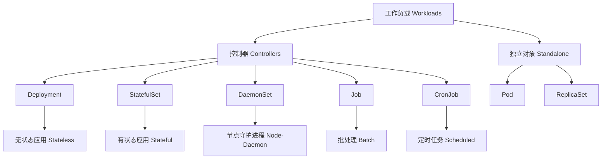
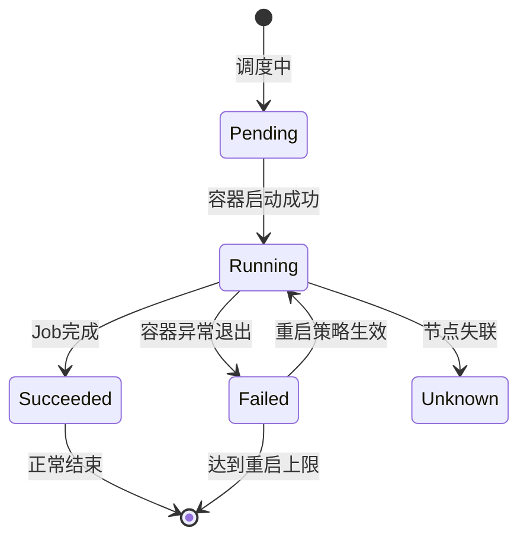

# 01 - Kubernetes 工作负载架构概览 (Workload Architecture Overview)

> **适用版本**: v1.25 - v1.32 | **最后更新**: 2026-02 | **参考**: [Kubernetes Workloads Concepts](https://kubernetes.io/docs/concepts/workloads/)

## 工作负载核心概念体系

### 1. 工作负载分类全景图



### 2. 控制器工作机制矩阵

| 控制器 | 管理对象 | 创建方式 | 更新策略 | 适用场景 | 生产成熟度 |
|--------|----------|----------|----------|----------|------------|
| **Deployment** | ReplicaSet | 声明式 | RollingUpdate/Recreate | 无状态微服务 | ⭐⭐⭐⭐⭐ |
| **StatefulSet** | Pod (有序) | 声明式 | RollingUpdate/OnDelete | 数据库/中间件 | ⭐⭐⭐⭐ |
| **DaemonSet** | Pod (每节点) | 声明式 | RollingUpdate | 日志/监控代理 | ⭐⭐⭐⭐⭐ |
| **Job** | Pod (一次性) | 声明式 | - | 批处理任务 | ⭐⭐⭐⭐ |
| **CronJob** | Job (定时) | 声明式 | - | 定时运维任务 | ⭐⭐⭐⭐ |

### 3. 工作负载生命周期管理

#### 3.1 Pod 生命周期状态转换



#### 3.2 控制器协调循环 (Reconciliation Loop)

```
期望状态 (Spec) → 控制器 → 当前状态 (Status) → 差异检测 → 调整动作
     ↓                                                    ↑
     ←←←←←←←←←←←←←←←←←←←←←←←←←←←←←←←←←←←←←←←←←←←←←←←←←←←←←←←←←←
```

### 4. 生产级工作负载设计原则

#### 4.1 可靠性设计 (Reliability)

```yaml
# 核心可靠性配置模板
apiVersion: apps/v1
kind: Deployment
metadata:
  name: production-app
  namespace: production
spec:
  # 副本管理
  replicas: 3
  revisionHistoryLimit: 10  # 保留历史版本
  
  # 更新策略
  strategy:
    type: RollingUpdate
    rollingUpdate:
      maxSurge: 1           # 允许超出1个副本
      maxUnavailable: 0     # 保证100%可用
  
  # 选择器
  selector:
    matchLabels:
      app: production-app
  
  template:
    metadata:
      labels:
        app: production-app
        version: v1.0.0
    
    spec:
      # 节点调度约束
      affinity:
        podAntiAffinity:
          requiredDuringSchedulingIgnoredDuringExecution:
          - labelSelector:
              matchExpressions:
              - key: app
                operator: In
                values: ["production-app"]
            topologyKey: kubernetes.io/hostname
      
      # 容器配置
      containers:
      - name: app
        image: registry.prod.local/app:v1.0.0
        imagePullPolicy: Always
        
        # 资源管理
        resources:
          requests:
            cpu: "500m"
            memory: "1Gi"
          limits:
            cpu: "1"
            memory: "2Gi"
        
        # 健康检查
        livenessProbe:
          httpGet:
            path: /health
            port: 8080
          initialDelaySeconds: 30
          periodSeconds: 10
          timeoutSeconds: 5
          failureThreshold: 3
        
        readinessProbe:
          httpGet:
            path: /ready
            port: 8080
          initialDelaySeconds: 5
          periodSeconds: 5
          timeoutSeconds: 3
          failureThreshold: 3
        
        # 启动探针 (v1.20+)
        startupProbe:
          httpGet:
            path: /startup
            port: 8080
          initialDelaySeconds: 10
          periodSeconds: 5
          timeoutSeconds: 3
          failureThreshold: 30  # 最长等待150秒
        
        # 生命周期钩子
        lifecycle:
          postStart:
            exec:
              command: ["/bin/sh", "-c", "echo 'App started' > /tmp/started"]
          preStop:
            exec:
              command: ["/bin/sh", "-c", "sleep 15 && echo 'Graceful shutdown'"]
```

#### 4.2 可观测性设计 (Observability)

```yaml
# 监控标签标准化
metadata:
  labels:
    app: my-app
    version: v1.2.3
    tier: backend
    env: production
    owner: team-devops
    cost-center: cc-001

# 注解用于扩展信息
metadata:
  annotations:
    prometheus.io/scrape: "true"
    prometheus.io/port: "9090"
    prometheus.io/path: "/metrics"
    kubernetes.io/change-cause: "部署修复安全漏洞 CVE-2024-XXXX"
```

### 5. 工作负载部署策略对比

| 策略 | 描述 | 优点 | 缺点 | 适用场景 |
|------|------|------|------|----------|
| **蓝绿部署** | 维护两套环境，切换流量 | 零停机，快速回滚 | 资源消耗双倍 | 关键业务发布 |
| **金丝雀发布** | 逐步将流量导向新版本 | 风险可控 | 需要复杂路由 | 新功能上线 |
| **滚动更新** | 逐个替换旧Pod | 资源效率高 | 更新时间较长 | 常规版本迭代 |
| **重新创建** | 全部销毁再创建 | 简单直接 | 服务中断 | 开发测试环境 |

#### 5.1 金丝雀发布实现示例

```yaml
# 第一阶段：部署少量新版本 (10%)
apiVersion: apps/v1
kind: Deployment
metadata:
  name: app-canary
  namespace: production
spec:
  replicas: 1  # 10% 流量 (总10个副本)
  selector:
    matchLabels:
      app: app
      version: v2.0.0-canary
  template:
    metadata:
      labels:
        app: app
        version: v2.0.0-canary
    spec:
      containers:
      - name: app
        image: app:v2.0.0

---
# 第二阶段：Service 分流配置
apiVersion: v1
kind: Service
metadata:
  name: app-service
  namespace: production
spec:
  selector:
    app: app  # 匹配所有版本
  ports:
  - port: 80
    targetPort: 8080

---
# 第三阶段：Ingress 流量分割
apiVersion: networking.k8s.io/v1
kind: Ingress
metadata:
  name: app-ingress
  namespace: production
  annotations:
    nginx.ingress.kubernetes.io/canary: "true"
    nginx.ingress.kubernetes.io/canary-weight: "10"  # 10% 流量到 Canary
spec:
  rules:
  - host: app.example.com
    http:
      paths:
      - path: /
        pathType: Prefix
        backend:
          service:
            name: app-service
            port:
              number: 80
```

### 6. 工作负载安全性设计

#### 6.1 安全上下文配置

```yaml
apiVersion: v1
kind: Pod
metadata:
  name: secure-app
spec:
  securityContext:
    runAsNonRoot: true
    runAsUser: 1000
    runAsGroup: 3000
    fsGroup: 2000
    supplementalGroups: [1001, 1002]
    
  containers:
  - name: app
    image: secure-app:latest
    securityContext:
      allowPrivilegeEscalation: false
      readOnlyRootFilesystem: true
      capabilities:
        drop: ["ALL"]
        add: ["NET_BIND_SERVICE"]  # 仅添加必要权限
      
    volumeMounts:
    - name: tmp-volume
      mountPath: /tmp
    - name: logs-volume
      mountPath: /var/log

  volumes:
  - name: tmp-volume
    emptyDir: {}
  - name: logs-volume
    emptyDir: {}
```

#### 6.2 网络策略隔离

```yaml
# 默认拒绝所有入站流量
apiVersion: networking.k8s.io/v1
kind: NetworkPolicy
metadata:
  name: default-deny-ingress
  namespace: production
spec:
  podSelector: {}
  policyTypes:
  - Ingress

---
# 允许同命名空间内部通信
apiVersion: networking.k8s.io/v1
kind: NetworkPolicy
metadata:
  name: allow-same-namespace
  namespace: production
spec:
  podSelector: {}
  ingress:
  - from:
    - podSelector: {}

---
# 允许特定应用间通信
apiVersion: networking.k8s.io/v1
kind: NetworkPolicy
metadata:
  name: allow-frontend-to-backend
  namespace: production
spec:
  podSelector:
    matchLabels:
      app: backend
  ingress:
  - from:
    - podSelector:
        matchLabels:
          app: frontend
    ports:
    - protocol: TCP
      port: 8080
```

### 7. 工作负载性能优化

#### 7.1 资源调优建议

| 应用类型 | CPU Request | Memory Request | CPU Limit | Memory Limit | QoS等级 |
|----------|-------------|----------------|-----------|--------------|---------|
| Web API | 100m-500m | 128Mi-1Gi | 不设置 | 1-2Gi | Burstable |
| 数据库 | 1-4核 | 2-8Gi | 等于Request | 等于Request | Guaranteed |
| 缓存 | 200m-1核 | 512Mi-2Gi | 不设置 | 1-4Gi | Burstable |
| 批处理 | 不设置 | 不设置 | 不设置 | 不设置 | BestEffort |

#### 7.2 调度优化配置

```yaml
apiVersion: apps/v1
kind: Deployment
metadata:
  name: optimized-app
spec:
  template:
    spec:
      # 拓扑分布约束
      topologySpreadConstraints:
      - maxSkew: 1
        topologyKey: topology.kubernetes.io/zone
        whenUnsatisfiable: ScheduleAnyway
        labelSelector:
          matchLabels:
            app: optimized-app
      
      # 节点亲和性
      affinity:
        nodeAffinity:
          requiredDuringSchedulingIgnoredDuringExecution:
            nodeSelectorTerms:
            - matchExpressions:
              - key: node-type
                operator: In
                values: ["compute-optimized"]
        
        podAntiAffinity:
          preferredDuringSchedulingIgnoredDuringExecution:
          - weight: 100
            podAffinityTerm:
              labelSelector:
                matchLabels:
                  app: optimized-app
              topologyKey: kubernetes.io/hostname
      
      # 容忍度配置
      tolerations:
      - key: dedicated
        operator: Equal
        value: app-tier
        effect: NoSchedule
```

### 8. 工作负载监控指标体系

#### 8.1 核心监控指标

```promql
# 应用可用性指标
up{job="kubernetes-pods", namespace="production"}

# 资源使用率
rate(container_cpu_usage_seconds_total{namespace="production"}[5m])
container_memory_working_set_bytes{namespace="production"} / 
container_spec_memory_limit_bytes{namespace="production"}

# Pod 状态统计
kube_pod_status_ready{condition="true", namespace="production"}
kube_pod_status_phase{phase="Running", namespace="production"}

# Deployment 状态
kube_deployment_status_replicas_available{namespace="production"}
kube_deployment_status_replicas_unavailable{namespace="production"}
```

#### 8.2 告警规则配置

```yaml
groups:
- name: workload_alerts
  rules:
  # Pod 重启频繁
  - alert: PodCrashLooping
    expr: rate(kube_pod_container_status_restarts_total[5m]) > 0.1
    for: 10m
    labels:
      severity: warning
    annotations:
      summary: "Pod {{ $labels.namespace }}/{{ $labels.pod }} 重启频繁"
  
  # Deployment 不可用副本
  - alert: DeploymentUnavailable
    expr: kube_deployment_status_replicas_unavailable > 0
    for: 5m
    labels:
      severity: critical
    annotations:
      summary: "Deployment {{ $labels.namespace }}/{{ $labels.deployment }} 存在不可用副本"
  
  # CPU 使用率过高
  - alert: ContainerCPULimitReached
    expr: |
      rate(container_cpu_usage_seconds_total[5m]) / 
      container_spec_cpu_quota * 100 > 85
    for: 10m
    labels:
      severity: warning
    annotations:
      summary: "容器 CPU 使用率超过 85%"
```

### 9. 工作负载最佳实践清单

✅ **必须项 (Must Have)**
- [ ] 配置合理的资源请求和限制
- [ ] 实施健康检查探针 (Liveness/Readiness)
- [ ] 设置适当的副本数和更新策略
- [ ] 配置 PodDisruptionBudget 保证高可用
- [ ] 使用标签进行资源管理和监控

✅ **推荐项 (Recommended)**
- [ ] 实施网络策略进行安全隔离
- [ ] 配置优先级类和抢占策略
- [ ] 使用拓扑分布约束优化调度
- [ ] 实施自动扩缩容 (HPA/VPA)
- [ ] 配置审计日志和安全上下文

✅ **高级项 (Advanced)**
- [ ] 实施服务网格进行流量治理
- [ ] 使用准入控制器进行策略管控
- [ ] 实施混沌工程验证系统韧性
- [ ] 建立完整的可观测性体系
- [ ] 实施 GitOps 进行声明式管理

---

**架构设计原则**: 以终为始，从生产需求出发设计工作负载；关注可靠性、可观测性和安全性；持续优化性能和成本。

---

**文档维护**: Kusheet Project | **作者**: Allen Galler (allengaller@gmail.com)