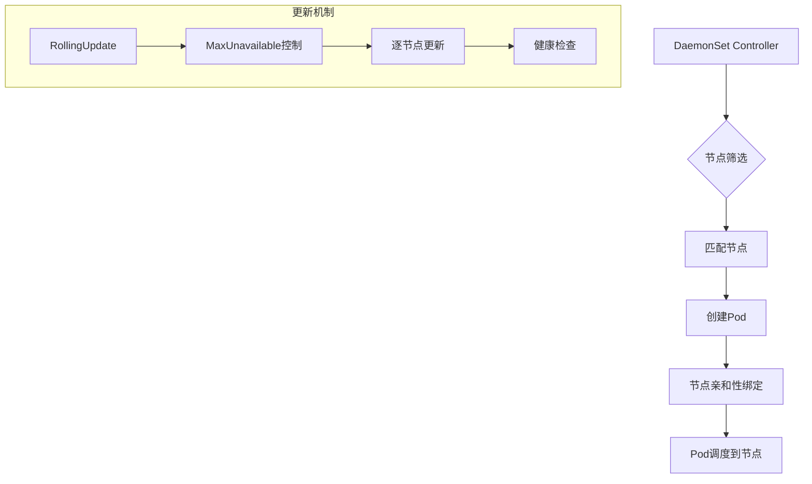

# 04 - DaemonSet 管理策略与最佳实践 (DaemonSet Management Strategies)

> **适用版本**: v1.25 - v1.32 | **最后更新**: 2026-02 | **参考**: [Kubernetes DaemonSet](https://kubernetes.io/docs/concepts/workloads/controllers/daemonset/)

## DaemonSet 核心架构与应用场景

### 1. DaemonSet 工作原理



### 2. 典型应用场景矩阵

| 场景类别 | 具体用途 | 推荐方案 | 关键配置 |
|----------|----------|----------|----------|
| **日志收集** | Fluentd/Filebeat | DaemonSet | hostPath挂载 |
| **监控代理** | Node Exporter | DaemonSet | 主机网络 |
| **网络插件** | CNI插件 | DaemonSet | 特权模式 |
| **存储插件** | CSI驱动 | DaemonSet | 节点选择器 |
| **安全扫描** | 安全代理 | DaemonSet | 定期重启 |

### 3. 生产级 DaemonSet 模板

#### 3.1 监控代理部署

```yaml
apiVersion: apps/v1
kind: DaemonSet
metadata:
  name: node-exporter
  namespace: monitoring
  labels:
    app: node-exporter
    component: monitoring
spec:
  selector:
    matchLabels:
      app: node-exporter
  
  # 更新策略
  updateStrategy:
    type: RollingUpdate
    rollingUpdate:
      maxUnavailable: 10%  # 控制同时不可用节点比例
  
  template:
    metadata:
      labels:
        app: node-exporter
        version: v1.6.1
      annotations:
        prometheus.io/scrape: "true"
        prometheus.io/port: "9100"
    
    spec:
      # 主机网络模式获取真实指标
      hostNetwork: true
      hostPID: true
      dnsPolicy: ClusterFirstWithHostNet
      
      # 节点选择器
      nodeSelector:
        kubernetes.io/os: linux
      
      # 污点容忍 (覆盖所有节点)
      tolerations:
      - operator: Exists  # 容忍所有污点
        effect: NoSchedule
      - operator: Exists
        effect: NoExecute
      - key: CriticalAddonsOnly
        operator: Exists
      
      # 安全上下文
      securityContext:
        runAsNonRoot: true
        runAsUser: 65534  # nobody 用户
        fsGroup: 65534
      
      containers:
      - name: node-exporter
        image: quay.io/prometheus/node-exporter:v1.6.1
        imagePullPolicy: IfNotPresent
        args:
        - --path.procfs=/host/proc
        - --path.sysfs=/host/sys
        - --collector.filesystem.mount-points-exclude=^/(dev|proc|sys|var/lib/docker/.+)($|/)
        - --collector.filesystem.fs-types-exclude=^(autofs|binfmt_misc|bpf|cgroup2?|configfs|debugfs|devpts|devtmpfs|fusectl|hugetlbfs|iso9660|mqueue|nsfs|overlay|proc|procfs|pstore|rpc_pipefs|securityfs|selinuxfs|squashfs|sysfs|tracefs)$
        
        ports:
        - name: metrics
          containerPort: 9100
          protocol: TCP
        
        # 资源限制
        resources:
          requests:
            cpu: "50m"
            memory: "64Mi"
            ephemeral-storage: "50Mi"
          limits:
            cpu: "200m"
            memory: "256Mi"
            ephemeral-storage: "100Mi"
        
        # 健康检查
        livenessProbe:
          httpGet:
            path: /
            port: 9100
          initialDelaySeconds: 30
          periodSeconds: 10
          timeoutSeconds: 5
        
        readinessProbe:
          httpGet:
            path: /
            port: 9100
          initialDelaySeconds: 5
          periodSeconds: 5
          timeoutSeconds: 3
        
        # 安全配置
        securityContext:
          allowPrivilegeEscalation: false
          readOnlyRootFilesystem: true
          capabilities:
            drop: ["ALL"]
        
        # 主机路径挂载
        volumeMounts:
        - name: proc
          mountPath: /host/proc
          readOnly: true
        - name: sys
          mountPath: /host/sys
          readOnly: true
        - name: root
          mountPath: /rootfs
          readOnly: true
          mountPropagation: HostToContainer
      
      volumes:
      - name: proc
        hostPath:
          path: /proc
      - name: sys
        hostPath:
          path: /sys
      - name: root
        hostPath:
          path: /
```

#### 3.2 日志收集代理部署

```yaml
apiVersion: apps/v1
kind: DaemonSet
metadata:
  name: fluentd
  namespace: logging
  labels:
    app: fluentd
    component: log-collection
spec:
  selector:
    matchLabels:
      app: fluentd
  
  updateStrategy:
    type: RollingUpdate
    rollingUpdate:
      maxUnavailable: 20%  # 更宽松的更新策略
  
  template:
    metadata:
      labels:
        app: fluentd
        version: v1.16.2
      annotations:
        checksum/config: abcdef123456
    
    spec:
      serviceAccountName: fluentd-sa
      terminationGracePeriodSeconds: 30
      
      # 节点选择
      nodeSelector:
        node-role: worker
      
      # 污点容忍
      tolerations:
      - key: node-role.kubernetes.io/master
        effect: NoSchedule
      - key: node.cloudprovider.kubernetes.io/uninitialized
        value: "true"
        effect: NoSchedule
      
      containers:
      - name: fluentd
        image: fluent/fluentd-kubernetes-daemonset:v1.16.2-debian-elasticsearch7-1.0
        env:
        - name: FLUENT_ELASTICSEARCH_HOST
          value: "elasticsearch.logging.svc.cluster.local"
        - name: FLUENT_ELASTICSEARCH_PORT
          value: "9200"
        - name: FLUENT_UID
          value: "0"  # root 权限读取日志文件
        
        # 资源配置
        resources:
          requests:
            cpu: "100m"
            memory: "200Mi"
          limits:
            cpu: "1"
            memory: "1Gi"
        
        # 存储卷挂载
        volumeMounts:
        - name: varlog
          mountPath: /var/log
        - name: varlibdockercontainers
          mountPath: /var/lib/docker/containers
          readOnly: true
        - name: fluentd-config
          mountPath: /fluentd/etc/fluent.conf
          subPath: fluent.conf
        - name: fluentd-config
          mountPath: /fluentd/etc/kubernetes.conf
          subPath: kubernetes.conf
        - name: docker-sock
          mountPath: /var/run/docker.sock
          readOnly: true
      
      volumes:
      - name: varlog
        hostPath:
          path: /var/log
      - name: varlibdockercontainers
        hostPath:
          path: /var/lib/docker/containers
      - name: fluentd-config
        configMap:
          name: fluentd-config
      - name: docker-sock
        hostPath:
          path: /var/run/docker.sock
```

### 4. 高级管理策略

#### 4.1 节点选择性部署

```yaml
apiVersion: apps/v1
kind: DaemonSet
metadata:
  name: gpu-monitor
  namespace: monitoring
spec:
  selector:
    matchLabels:
      app: gpu-monitor
  
  template:
    spec:
      # 仅在有GPU的节点部署
      nodeSelector:
        nvidia.com/gpu.present: "true"
      
      # GPU 资源请求
      containers:
      - name: gpu-exporter
        image: nvcr.io/nvidia/k8s/dcgm-exporter:3.1.8-3.1.2-ubuntu20.04
        resources:
          requests:
            nvidia.com/gpu: 1
          limits:
            nvidia.com/gpu: 1
        
        # 设备插件访问
        volumeMounts:
        - name: nvidia-ml
          mountPath: /usr/lib/x86_64-linux-gnu/libnvidia-ml.so.1
          readOnly: true
        
        env:
        - name: DCGM_EXPORTER_LISTEN
          value: ":9400"
        
        ports:
        - name: metrics
          containerPort: 9400
          protocol: TCP
      
      volumes:
      - name: nvidia-ml
        hostPath:
          path: /usr/lib/x86_64-linux-gnu/libnvidia-ml.so.1
```

#### 4.2 滚动更新优化

```yaml
apiVersion: apps/v1
kind: DaemonSet
metadata:
  name: optimized-daemonset
spec:
  updateStrategy:
    type: RollingUpdate
    rollingUpdate:
      maxUnavailable: "30%"  # 支持百分比配置
      # 或者使用具体数字
      # maxUnavailable: 2
  
  minReadySeconds: 30  # Pod 就绪后等待时间
  
  template:
    spec:
      # 预停止钩子实现优雅关闭
      terminationGracePeriodSeconds: 60
      
      containers:
      - name: app
        # ... 容器配置
        
        lifecycle:
          preStop:
            exec:
              command: ["/bin/sh", "-c", "sleep 30"]  # 等待连接迁移
        
        # 启动探针确保完全就绪
        startupProbe:
          httpGet:
            path: /health
            port: 8080
          failureThreshold: 60
          periodSeconds: 5
```

### 5. 监控与告警配置

#### 5.1 DaemonSet 特定监控

```yaml
# PrometheusRule 配置
apiVersion: monitoring.coreos.com/v1
kind: PrometheusRule
metadata:
  name: daemonset-alerts
  namespace: monitoring
spec:
  groups:
  - name: daemonset.rules
    rules:
    # DaemonSet 不完整部署
    - alert: DaemonSetMisscheduled
      expr: |
        kube_daemonset_status_number_misscheduled > 0
      for: 10m
      labels:
        severity: warning
      annotations:
        summary: "DaemonSet {{ $labels.daemonset }} 在 {{ $labels.namespace }} 中存在错误调度的 Pod"
    
    # DaemonSet 更新失败
    - alert: DaemonSetUpdateStuck
      expr: |
        kube_daemonset_status_number_unavailable > 0
      for: 15m
      labels:
        severity: critical
      annotations:
        summary: "DaemonSet {{ $labels.daemonset }} 更新卡住，{{ $value }} 个 Pod 不可用"
    
    # 节点覆盖率不足
    - alert: DaemonSetCoverageLow
      expr: |
        kube_daemonset_status_desired_number_scheduled / 
        kube_node_status_condition{condition="Ready",status="true"} * 100 < 95
      for: 5m
      labels:
        severity: warning
      annotations:
        summary: "DaemonSet {{ $labels.daemonset }} 节点覆盖率低于 95%"
```

#### 5.2 性能监控面板

```yaml
# Grafana Dashboard 配置
dashboard:
  title: "DaemonSet Performance Overview"
  panels:
  - title: "部署状态概览"
    type: stat
    targets:
    - expr: kube_daemonset_status_desired_number_scheduled
      legendFormat: "期望调度数"
    - expr: kube_daemonset_status_current_number_scheduled
      legendFormat: "当前调度数"
    - expr: kube_daemonset_status_number_ready
      legendFormat: "就绪数"
  
  - title: "节点覆盖率趋势"
    type: graph
    targets:
    - expr: |
        kube_daemonset_status_current_number_scheduled / 
        kube_node_status_condition{condition="Ready",status="true"} * 100
      legendFormat: "{{daemonset}} 覆盖率 %"
  
  - title: "资源使用分布"
    type: heatmap
    targets:
    - expr: |
        rate(container_cpu_usage_seconds_total{container!="POD", container!=""}[5m])
      legendFormat: "{{node}} - {{pod}}"
```

### 6. 故障排查与恢复

#### 6.1 常见问题诊断

```bash
# 1. 查看 DaemonSet 状态
kubectl describe daemonset <daemonset-name> -n <namespace>

# 2. 检查调度问题
kubectl get pods -l app=<app-name> -n <namespace> -o wide

# 3. 查看未调度原因
kubectl describe nodes | grep -A 5 "Taints"

# 4. 检查节点兼容性
kubectl get nodes -l <node-selector> --show-labels

# 5. 强制重新调度
kubectl delete pod -l app=<app-name> -n <namespace> --grace-period=0 --force

# 6. 检查污点容忍配置
kubectl get nodes -o jsonpath='{.items[*].spec.taints}'
```

#### 6.2 自动化运维脚本

```bash
#!/bin/bash
# DaemonSet 健康检查脚本

DAEMONSET_NAME=$1
NAMESPACE=${2:-monitoring}

echo "检查 DaemonSet $DAEMONSET_NAME 健康状态..."

# 获取状态指标
DESIRED=$(kubectl get daemonset $DAEMONSET_NAME -n $NAMESPACE -o jsonpath='{.status.desiredNumberScheduled}')
CURRENT=$(kubectl get daemonset $DAEMONSET_NAME -n $NAMESPACE -o jsonpath='{.status.currentNumberScheduled}')
READY=$(kubectl get daemonset $DAEMONSET_NAME -n $NAMESPACE -o jsonpath='{.status.numberReady}')
MISSCHEDULED=$(kubectl get daemonset $DAEMONSET_NAME -n $NAMESPACE -o jsonpath='{.status.numberMisscheduled}')

echo "期望: $DESIRED, 当前: $CURRENT, 就绪: $READY, 错误调度: $MISSCHEDULED"

# 检查覆盖率
COVERAGE_PERCENT=$((CURRENT * 100 / DESIRED))
if [ $COVERAGE_PERCENT -lt 95 ]; then
    echo "警告: 覆盖率 ${COVERAGE_PERCENT}% 低于阈值 95%"
    exit 1
fi

# 检查错误调度
if [ $MISSCHEDULED -gt 0 ]; then
    echo "错误: 存在 $MISSCHEDULED 个错误调度的 Pod"
    kubectl get pods -l app=$DAEMONSET_NAME -n $NAMESPACE --field-selector=status.phase!=Running
    exit 1
fi

echo "DaemonSet 状态正常 ✓"
exit 0
```

### 7. 安全加固配置

#### 7.1 完整安全配置示例

```yaml
apiVersion: apps/v1
kind: DaemonSet
metadata:
  name: secure-daemonset
  namespace: security
spec:
  template:
    spec:
      # 限制特权模式
      securityContext:
        runAsNonRoot: true
        runAsUser: 1000
        fsGroup: 2000
        seccompProfile:
          type: RuntimeDefault
      
      # 最小权限服务账户
      serviceAccountName: restricted-daemonset-sa
      
      containers:
      - name: agent
        image: secure-agent:latest
        imagePullPolicy: Always
        
        # 容器安全上下文
        securityContext:
          allowPrivilegeEscalation: false
          readOnlyRootFilesystem: true
          capabilities:
            drop: ["ALL"]
            # 仅添加必要的能力
            add: ["NET_BIND_SERVICE"] if needed
        
        # 最小化资源请求
        resources:
          requests:
            cpu: "10m"
            memory: "32Mi"
          limits:
            cpu: "100m"
            memory: "128Mi"
        
        # 限制敏感路径访问
        volumeMounts:
        - name: tmp-storage
          mountPath: /tmp
        - name: run-storage
          mountPath: /run
        
        # 禁用不必要的端口
        ports: []  # 不暴露任何端口
        
      volumes:
      - name: tmp-storage
        emptyDir: {}
      - name: run-storage
        emptyDir: {}
```

### 8. 成本优化实践

#### 8.1 资源优化配置

```yaml
apiVersion: apps/v1
kind: DaemonSet
metadata:
  name: cost-optimized-daemonset
  namespace: monitoring
spec:
  template:
    spec:
      # 节点选择优化
      nodeSelector:
        node-purpose: monitoring  # 专用监控节点池
      
      # 资源精细化配置
      containers:
      - name: lightweight-agent
        resources:
          requests:
            cpu: "10m"      # 最小化 CPU 请求
            memory: "16Mi"   # 最小化内存请求
          limits:
            cpu: "100m"     # 合理的 CPU 限制
            memory: "64Mi"   # 合理的内存限制
        
        # 启用压缩传输
        env:
        - name: ENABLE_COMPRESSION
          value: "true"
        - name: COMPRESSION_LEVEL
          value: "6"
```

---

**管理原则**: 全节点覆盖但精准控制，滚动更新保证业务连续性，资源优化降低成本，安全加固防范风险。

---

**文档维护**: Kusheet Project | **作者**: Allen Galler (allengaller@gmail.com)