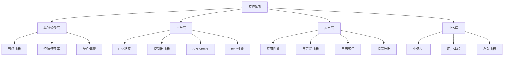

# 06 - 工作负载监控与告警体系 (Workload Monitoring & Alerting System)

> **适用版本**: v1.25 - v1.32 | **最后更新**: 2026-02 | **参考**: [Kubernetes Monitoring Guide](https://kubernetes.io/docs/tasks/debug/debug-cluster/resource-metrics-pipeline/)

## 监控体系架构设计

### 1. 监控层次模型



### 2. 核心监控组件栈

#### 2.1 Prometheus 监控栈

```yaml
# Prometheus Operator 部署配置
apiVersion: monitoring.coreos.com/v1
kind: Prometheus
metadata:
  name: k8s-prometheus
  namespace: monitoring
spec:
  serviceAccountName: prometheus
  serviceMonitorSelector:
    matchLabels:
      team: frontend
  ruleSelector:
    matchLabels:
      role: alert-rules
  resources:
    requests:
      memory: 400Mi
  enableAdminAPI: false
  
  # 持久化存储
  storage:
    volumeClaimTemplate:
      spec:
        storageClassName: fast-ssd
        resources:
          requests:
            storage: 50Gi
  
  # 远程写配置
  remoteWrite:
  - url: http://thanos-receive.monitoring.svc:19291/api/v1/receive
    writeRelabelConfigs:
    - sourceLabels: [__name__]
      regex: 'container_.+'
      action: keep
```

#### 2.2 ServiceMonitor 配置模板

```yaml
# 应用服务监控配置
apiVersion: monitoring.coreos.com/v1
kind: ServiceMonitor
metadata:
  name: application-monitor
  namespace: production
  labels:
    app: my-app
    team: devops
spec:
  selector:
    matchLabels:
      app: my-app
  namespaceSelector:
    matchNames:
    - production
  endpoints:
  - port: metrics
    interval: 30s
    path: /metrics
    scheme: http
    bearerTokenFile: /var/run/secrets/kubernetes.io/serviceaccount/token
    tlsConfig:
      insecureSkipVerify: true
    
    # 指标重标记
    relabelings:
    - sourceLabels: [__meta_kubernetes_pod_name]
      targetLabel: pod
    - sourceLabels: [__meta_kubernetes_namespace]
      targetLabel: namespace
    
    # 指标过滤
    metricRelabelings:
    - sourceLabels: [__name__]
      regex: 'go_.+'
      action: drop
```

### 3. 关键监控指标体系

#### 3.1 Pod 级别核心指标

```promql
# Pod 状态监控
groups:
- name: pod_health
  rules:
  # Pod 不可用检测
  - alert: PodNotReady
    expr: kube_pod_status_ready{condition="true"} == 0
    for: 5m
    labels:
      severity: warning
    annotations:
      summary: "Pod {{ $labels.namespace }}/{{ $labels.pod }} 未就绪超过5分钟"
  
  # Pod 重启频繁
  - alert: PodCrashLooping
    expr: rate(kube_pod_container_status_restarts_total[5m]) > 0.1
    for: 10m
    labels:
      severity: critical
    annotations:
      summary: "Pod {{ $labels.namespace }}/{{ $labels.pod }} 重启过于频繁"
  
  # Pod 等待状态
  - alert: PodPending
    expr: kube_pod_status_phase{phase="Pending"} == 1
    for: 15m
    labels:
      severity: warning
    annotations:
      summary: "Pod {{ $labels.namespace }}/{{ $labels.pod }} 长时间处于Pending状态"
```

#### 3.2 Deployment 控制器指标

```promql
# Deployment 健康度监控
groups:
- name: deployment_health
  rules:
  # 副本数不匹配
  - alert: DeploymentReplicasMismatch
    expr: |
      kube_deployment_status_replicas_available != 
      kube_deployment_spec_replicas
    for: 10m
    labels:
      severity: warning
    annotations:
      summary: "Deployment {{ $labels.namespace }}/{{ $labels.deployment }} 副本数不匹配"
  
  # 滚动更新卡住
  - alert: DeploymentStuck
    expr: |
      kube_deployment_status_replicas_updated != 
      kube_deployment_spec_replicas
    for: 15m
    labels:
      severity: critical
    annotations:
      summary: "Deployment {{ $labels.namespace }}/{{ $labels.deployment }} 更新卡住"
  
  # 更新失败
  - alert: DeploymentGenerationMismatch
    expr: |
      kube_deployment_status_observed_generation != 
      kube_deployment_metadata_generation
    for: 15m
    labels:
      severity: critical
    annotations:
      summary: "Deployment {{ $labels.namespace }}/{{ $labels.deployment }} 观察世代不匹配"
```

#### 3.3 资源使用率监控

```promql
# 资源使用率告警
groups:
- name: resource_utilization
  rules:
  # CPU 使用率过高
  - alert: ContainerCPULimitReached
    expr: |
      rate(container_cpu_usage_seconds_total{container!="POD",container!=""}[5m]) /
      container_spec_cpu_quota * 100 > 85
    for: 10m
    labels:
      severity: warning
    annotations:
      summary: "容器 {{ $labels.namespace }}/{{ $labels.pod }}/{{ $labels.container }} CPU使用率超过85%"
  
  # 内存使用率过高
  - alert: ContainerMemoryLimitReached
    expr: |
      container_memory_working_set_bytes{container!="POD",container!=""} /
      container_spec_memory_limit_bytes * 100 > 90
    for: 5m
    labels:
      severity: warning
    annotations:
      summary: "容器 {{ $labels.namespace }}/{{ $labels.pod }}/{{ $labels.container }} 内存使用率超过90%"
  
  # 节点资源紧张
  - alert: NodeMemoryPressure
    expr: |
      (node_memory_MemAvailable_bytes / node_memory_MemTotal_bytes * 100) < 15
    for: 5m
    labels:
      severity: critical
    annotations:
      summary: "节点 {{ $labels.node }} 可用内存不足15%"
```

### 4. 高级监控策略

#### 4.1 黑盒监控配置

```yaml
# Blackbox Exporter 配置
apiVersion: monitoring.coreos.com/v1
kind: Probe
metadata:
  name: application-health-check
  namespace: monitoring
spec:
  jobName: application-probe
  prober:
    url: blackbox-exporter.monitoring.svc:9115
  module: http_2xx
  targets:
    staticConfig:
      static:
      - http://my-app.production.svc.cluster.local:8080/health
      - https://app.example.com/health
      relabeling:
      - sourceLabels: [__address__]
        targetLabel: __param_target
      - sourceLabels: [__param_target]
        targetLabel: instance
      - targetLabel: __address__
        replacement: blackbox-exporter.monitoring.svc:9115
```

#### 4.2 日志监控集成

```yaml
# Loki 日志监控配置
apiVersion: monitoring.coreos.com/v1
kind: ServiceMonitor
metadata:
  name: loki-monitor
  namespace: logging
spec:
  selector:
    matchLabels:
      app: loki
  endpoints:
  - port: http-metrics
    interval: 30s
    path: /metrics
```

#### 4.3 分布式追踪监控

```yaml
# Jaeger 追踪监控
apiVersion: monitoring.coreos.com/v1
kind: ServiceMonitor
metadata:
  name: jaeger-monitor
  namespace: tracing
spec:
  selector:
    matchLabels:
      app: jaeger
  endpoints:
  - port: admin-http
    interval: 30s
    path: /metrics
```

### 5. 告警通知策略

#### 5.1 Alertmanager 配置

```yaml
# Alertmanager 配置
global:
  resolve_timeout: 5m
  smtp_smarthost: 'smtp.company.com:587'
  smtp_from: 'alertmanager@company.com'
  smtp_auth_username: 'alertmanager'
  smtp_auth_password: 'password'

route:
  group_by: ['alertname', 'cluster', 'service']
  group_wait: 30s
  group_interval: 5m
  repeat_interval: 3h
  receiver: 'default-receiver'
  
  routes:
  # 关键业务告警
  - match:
      severity: critical
    receiver: 'pagerduty'
    group_wait: 10s
    repeat_interval: 30m
  
  # 一般告警
  - match:
      severity: warning
    receiver: 'slack-warning'
    group_wait: 1m
    repeat_interval: 2h
  
  # 通知抑制规则
  inhibit_rules:
  - source_match:
      severity: 'critical'
    target_match:
      severity: 'warning'
    equal: ['alertname', 'namespace', 'pod']

receivers:
- name: 'default-receiver'
  email_configs:
  - to: 'team-devops@company.com'
    send_resolved: true

- name: 'pagerduty'
  pagerduty_configs:
  - service_key: 'XXXXXXXXXXXXXXXXXXXXXXXXXXXXXXXX'
    send_resolved: true

- name: 'slack-warning'
  slack_configs:
  - api_url: 'https://hooks.slack.com/services/XXX/YYY/ZZZ'
    channel: '#alerts-warning'
    send_resolved: true
    title: '{{ template "slack.warning.title" . }}'
    text: '{{ template "slack.warning.text" . }}'
```

### 6. 监控面板设计

#### 6.1 Grafana Dashboard 模板

```json
{
  "dashboard": {
    "title": "Production Workload Overview",
    "panels": [
      {
        "title": "Deployment Health Status",
        "type": "stat",
        "targets": [
          {
            "expr": "count(kube_deployment_status_replicas_available == kube_deployment_spec_replicas)",
            "legendFormat": "Healthy Deployments"
          },
          {
            "expr": "count(kube_deployment_status_replicas_available != kube_deployment_spec_replicas)",
            "legendFormat": "Unhealthy Deployments"
          }
        ]
      },
      {
        "title": "Pod Restart Rate",
        "type": "graph",
        "targets": [
          {
            "expr": "sum(rate(kube_pod_container_status_restarts_total[5m])) by (namespace, pod)",
            "legendFormat": "{{namespace}}/{{pod}}"
          }
        ]
      },
      {
        "title": "Resource Utilization",
        "type": "heatmap",
        "targets": [
          {
            "expr": "rate(container_cpu_usage_seconds_total[5m])",
            "legendFormat": "CPU Usage"
          }
        ]
      }
    ]
  }
}
```

### 7. 监控最佳实践

#### 7.1 指标命名规范

```yaml
# 推荐的指标命名格式
# {application}_{component}_{metric}_{unit}
# 示例：
http_requests_total: 计数器类型
http_request_duration_seconds: 直方图类型
cpu_usage_ratio: 比率类型
memory_bytes: 字节单位
```

#### 7.2 标签设计原则

```yaml
# 标准化标签体系
labels:
  namespace: "应用命名空间"
  pod: "Pod名称"
  container: "容器名称"
  app: "应用名称"
  version: "应用版本"
  tier: "应用层级(frontend/backend)"
  env: "环境(production/staging)"
  team: "负责团队"
  owner: "负责人"
```

#### 7.3 告警级别定义

| 级别 | 响应时间 | 通知渠道 | 处理要求 |
|------|----------|----------|----------|
| **Critical** | 5分钟内 | 电话/PagerDuty | 立即处理 |
| **Warning** | 30分钟内 | Slack/Email | 2小时内处理 |
| **Info** | 2小时内 | Email | 下个工作日处理 |

---

**监控原则**: 全面覆盖、分级告警、快速响应、持续优化

---
**文档维护**: Kusheet Project | **作者**: Allen Galler (allengaller@gmail.com)