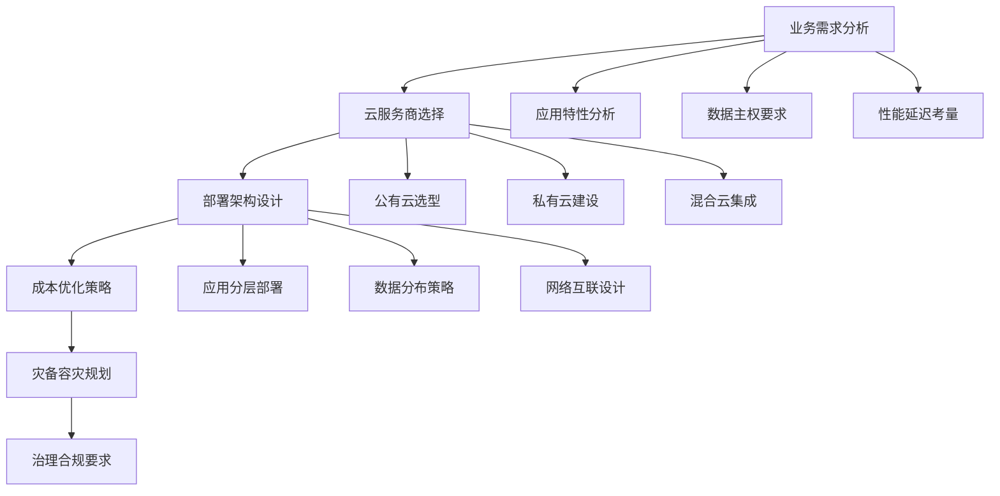
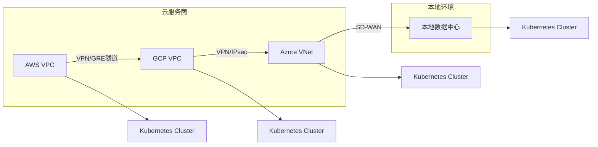

# 08 - 多云混合部署工作负载管理策略 (Multi-Cloud Hybrid Deployment Workload Strategy)

> **适用版本**: v1.25 - v1.32 | **最后更新**: 2026-02 | **参考**: [Kubernetes Federation](https://github.com/kubernetes-sigs/kubefed)

## 多云架构设计原则

### 1. 多云部署战略框架



### 2. 多云部署模式分类

#### 2.1 部署模式矩阵

| 模式 | 描述 | 优势 | 劣势 | 适用场景 |
|------|------|------|------|----------|
| **Active-Passive** | 主备模式，一个活跃 | 简单可靠，成本较低 | 资源利用率低 | 灾备场景 |
| **Active-Active** | 多活模式，同时服务 | 高可用，负载分担 | 复杂度高 | 核心业务 |
| **Geo-Distribution** | 地理分布式部署 | 就近访问，低延迟 | 数据一致性挑战 | 全球用户 |
| **Cloud-Bursting** | 云爆发模式 | 弹性扩容 | 网络延迟 | 突发流量 |

### 3. 多云工作负载管理工具栈

#### 3.1 Kubernetes Federation (KubeFed)

```yaml
# KubeFed 控制平面部署
apiVersion: v1
kind: Namespace
metadata:
  name: kubefed-system

---
# KubeFed Controller Manager
apiVersion: apps/v1
kind: Deployment
metadata:
  name: kubefed-controller-manager
  namespace: kubefed-system
spec:
  replicas: 2
  selector:
    matchLabels:
      app: kubefed-controller-manager
  template:
    metadata:
      labels:
        app: kubefed-controller-manager
    spec:
      containers:
      - name: controller-manager
        image: kubefed/controller:v0.9.2
        args:
        - --leader-elect=true
        - --metrics-addr=:8080
        - --health-probe-bind-address=:8081
        ports:
        - containerPort: 8080
          name: metrics
        - containerPort: 8081
          name: health
        livenessProbe:
          httpGet:
            path: /healthz
            port: 8081
        readinessProbe:
          httpGet:
            path: /readyz
            port: 8081
```

#### 3.2 跨集群资源分发配置

```yaml
# Federated Deployment 配置
apiVersion: types.kubefed.io/v1beta1
kind: FederatedDeployment
metadata:
  name: federated-app
  namespace: production
spec:
  template:
    metadata:
      labels:
        app: federated-app
    spec:
      replicas: 10
      selector:
        matchLabels:
          app: federated-app
      template:
        metadata:
          labels:
            app: federated-app
        spec:
          containers:
          - name: app
            image: registry.multi-cloud.local/app:v1.0.0
            ports:
            - containerPort: 8080
            resources:
              requests:
                cpu: "100m"
                memory: "128Mi"
              limits:
                cpu: "500m"
                memory: "512Mi"
  
  placement:
    clusters:
    - name: aws-us-east-1
    - name: gcp-us-central1
    - name: azure-eastus
  
  overrides:
  - clusterName: aws-us-east-1
    clusterOverrides:
    - path: "/spec/replicas"
      value: 4  # AWS 部署4个副本
    - path: "/spec/template/spec/nodeSelector"
      value:
        cloud-provider: aws
        region: us-east-1
  
  - clusterName: gcp-us-central1
    clusterOverrides:
    - path: "/spec/replicas"
      value: 3  # GCP 部署3个副本
    - path: "/spec/template/spec/nodeSelector"
      value:
        cloud-provider: gcp
        region: us-central1
  
  - clusterName: azure-eastus
    clusterOverrides:
    - path: "/spec/replicas"
      value: 3  # Azure 部署3个副本
    - path: "/spec/template/spec/nodeSelector"
      value:
        cloud-provider: azure
        region: eastus
```

### 4. 多云网络互联策略

#### 4.1 跨云网络架构



#### 4.2 服务发现与负载均衡

```yaml
# 多云服务网格配置 (Istio)
apiVersion: networking.istio.io/v1beta1
kind: ServiceEntry
metadata:
  name: multi-cloud-service
  namespace: istio-system
spec:
  hosts:
  - app.global  # 全局服务名
  location: MESH_EXTERNAL
  ports:
  - number: 80
    name: http
    protocol: HTTP
  resolution: DNS
  endpoints:
  - address: app.aws.example.com
    ports:
      http: 80
    labels:
      cluster: aws-us-east-1
      weight: "40"
  - address: app.gcp.example.com
    ports:
      http: 80
    labels:
      cluster: gcp-us-central1
      weight: "30"
  - address: app.azure.example.com
    ports:
      http: 80
    labels:
      cluster: azure-eastus
      weight: "30"
```

#### 4.3 DNS 多云解析策略

```yaml
# ExternalDNS 配置多云DNS
apiVersion: apps/v1
kind: Deployment
metadata:
  name: external-dns
  namespace: kube-system
spec:
  strategy:
    type: Recreate
  selector:
    matchLabels:
      app: external-dns
  template:
    metadata:
      labels:
        app: external-dns
    spec:
      serviceAccountName: external-dns
      containers:
      - name: external-dns
        image: k8s.gcr.io/external-dns/external-dns:v0.13.2
        args:
        - --source=service
        - --source=ingress
        - --domain-filter=multi-cloud.example.com
        - --provider=aws  # 可配置多个提供商
        - --aws-zone-type=public
        - --registry=txt
        - --txt-owner-id=multi-cloud-cluster
```

### 5. 多云数据管理策略

#### 5.1 数据同步与复制

```yaml
# Velero 多云备份配置
apiVersion: velero.io/v1
kind: Backup
metadata:
  name: multi-cloud-backup
  namespace: velero
spec:
  includedNamespaces:
  - production
  - staging
  includedResources:
  - deployments
  - services
  - configmaps
  - secrets
  storageLocation: aws-s3-primary
  volumeSnapshotLocations:
  - aws-us-east-1
  - gcp-us-central1
  - azure-eastus
  ttl: 168h0m0s  # 7天保留
```

#### 5.2 跨云存储类配置

```yaml
# 多云存储类定义
apiVersion: storage.k8s.io/v1
kind: StorageClass
metadata:
  name: multi-cloud-standard
provisioner: kubernetes.io/aws-ebs
parameters:
  type: gp3
  fsType: ext4
allowedTopologies:
- matchLabelExpressions:
  - key: topology.kubernetes.io/region
    values:
    - us-east-1  # AWS
    - us-central1 # GCP
    - eastus      # Azure
```

### 6. 多云成本优化策略

#### 6.1 成本监控与分析

```yaml
# Kubecost 多云成本监控
apiVersion: apps/v1
kind: Deployment
metadata:
  name: kubecost
  namespace: kubecost
spec:
  replicas: 1
  selector:
    matchLabels:
      app: kubecost
  template:
    metadata:
      labels:
        app: kubecost
    spec:
      containers:
      - name: cost-analyzer
        image: gcr.io/kubecost1/cost-model:prod-1.100.0
        env:
        - name: CLOUD_PROVIDER_API_KEY
          valueFrom:
            secretKeyRef:
              name: cloud-credentials
              key: aws-access-key-id
        - name: AZURE_CLIENT_ID
          valueFrom:
            secretKeyRef:
              name: cloud-credentials
              key: azure-client-id
        - name: GOOGLE_APPLICATION_CREDENTIALS
          value: /var/secrets/google/key.json
        volumeMounts:
        - name: cloud-key
          mountPath: /var/secrets/google
      volumes:
      - name: cloud-key
        secret:
          secretName: gcp-service-account-key
```

#### 6.2 Spot/Preemptible 实例策略

```yaml
# 混合实例组配置
apiVersion: apps/v1
kind: Deployment
metadata:
  name: spot-instance-app
  namespace: production
spec:
  replicas: 20
  selector:
    matchLabels:
      app: spot-app
  template:
    metadata:
      labels:
        app: spot-app
        instance-type: spot
    spec:
      # AWS Spot 实例配置
      nodeSelector:
        node.kubernetes.io/instance-type: spot
        topology.kubernetes.io/region: us-east-1
      
      # 中断容忍配置
      tolerations:
      - key: spot-instance
        operator: Equal
        value: "true"
        effect: NoSchedule
      
      # 优雅终止处理
      terminationGracePeriodSeconds: 120
      
      containers:
      - name: app
        image: app:latest
        lifecycle:
          preStop:
            exec:
              command: ["/bin/sh", "-c", "sleep 110"]  # 预留10秒缓冲
        
        # 工作负载分离配置
        resources:
          requests:
            cpu: "100m"
            memory: "128Mi"
          limits:
            cpu: "500m"
            memory: "512Mi"
```

### 7. 多云安全管理

#### 7.1 统一身份认证

```yaml
# Dex 身份认证配置
apiVersion: apps/v1
kind: Deployment
metadata:
  name: dex
  namespace: auth-system
spec:
  replicas: 2
  selector:
    matchLabels:
      app: dex
  template:
    metadata:
      labels:
        app: dex
    spec:
      containers:
      - name: dex
        image: dexidp/dex:v2.35.3
        args:
        - dex
        - serve
        - /etc/dex/config.yaml
        ports:
        - containerPort: 5556
          name: https
        volumeMounts:
        - name: config
          mountPath: /etc/dex
      volumes:
      - name: config
        configMap:
          name: dex-config

---
# Dex 配置文件
apiVersion: v1
kind: ConfigMap
metadata:
  name: dex-config
  namespace: auth-system
data:
  config.yaml: |
    issuer: https://dex.multi-cloud.example.com
    storage:
      type: kubernetes
      config:
        inCluster: true
    
    web:
      http: 0.0.0.0:5556
    
    connectors:
    - type: oidc
      id: aws-cognito
      name: AWS Cognito
      config:
        issuer: https://cognito-idp.us-east-1.amazonaws.com/us-east-1_XXXXXXXXX
        clientID: $CLIENT_ID
        clientSecret: $CLIENT_SECRET
        redirectURI: https://dex.multi-cloud.example.com/callback
    
    - type: saml
      id: azure-ad
      name: Azure Active Directory
      config:
        ssoURL: https://login.microsoftonline.com/XXXXXXXXX/saml2
        entityIssuer: https://dex.multi-cloud.example.com/saml2
        caData: $BASE64_ENCODED_CA_CERT
```

#### 7.2 策略引擎配置

```yaml
# Kyverno 多云策略管理
apiVersion: kyverno.io/v1
kind: ClusterPolicy
metadata:
  name: multi-cloud-security-controls
spec:
  validationFailureAction: enforce
  background: true
  rules:
  - name: require-network-policies
    match:
      resources:
        kinds:
        - Pod
    validate:
      message: "所有Pod必须关联NetworkPolicy"
      pattern:
        metadata:
          =(annotations):
            =(kubernetes.io/network-policy): "*"
  
  - name: restrict-cloud-specific-labels
    match:
      resources:
        kinds:
        - Deployment
        - StatefulSet
    validate:
      message: "禁止使用特定云厂商的节点选择器"
      pattern:
        spec:
          template:
            spec:
              =(nodeSelector):
                X(cluster-autoscaler.kubernetes.io/safe-to-evict): "*"
  
  - name: enforce-resource-limits
    match:
      resources:
        kinds:
        - Pod
    validate:
      message: "必须设置资源请求和限制"
      pattern:
        spec:
          containers:
          - resources:
              requests:
                memory: "?*"
                cpu: "?*"
              limits:
                memory: "?*"
                cpu: "?*"
```

### 8. 多云运维最佳实践

#### 8.1 统一监控告警

```yaml
# Thanos 多云监控架构
apiVersion: apps/v1
kind: Deployment
metadata:
  name: thanos-query
  namespace: monitoring
spec:
  replicas: 2
  selector:
    matchLabels:
      app: thanos-query
  template:
    metadata:
      labels:
        app: thanos-query
    spec:
      containers:
      - name: thanos-query
        image: quay.io/thanos/thanos:v0.32.0
        args:
        - query
        - --grpc-address=0.0.0.0:10901
        - --http-address=0.0.0.0:9090
        - --query.replica-label=cluster
        - --store=dnssrv+_grpc._tcp.thanos-storegateway.monitoring.svc.cluster.local
        ports:
        - containerPort: 9090
          name: http
        - containerPort: 10901
          name: grpc
```

#### 8.2 GitOps 多云部署

```yaml
# ArgoCD 多集群应用配置
apiVersion: argoproj.io/v1alpha1
kind: Application
metadata:
  name: multi-cloud-app
  namespace: argocd
spec:
  project: default
  source:
    repoURL: https://github.com/company/multi-cloud-manifests.git
    targetRevision: HEAD
    path: apps/production
  destination:
    server: https://kubernetes.default.svc
    namespace: production
  syncPolicy:
    automated:
      prune: true
      selfHeal: true
    syncOptions:
    - CreateNamespace=true
    - PrunePropagationPolicy=foreground
    - PruneLast=true
  
  # 多集群分发配置
  destinations:
  - name: aws-production
    namespace: production
    server: https://aws-api.example.com
  - name: gcp-production
    namespace: production
    server: https://gcp-api.example.com
  - name: azure-production
    namespace: production
    server: https://azure-api.example.com
```

### 9. 多云迁移策略

#### 9.1 应用评估框架

```bash
#!/bin/bash
# multi_cloud_assessment.sh - 多云应用评估工具

APP_NAME=$1
NAMESPACE=${2:-default}

echo "🔍 多云部署可行性评估: ${APP_NAME}"
echo "======================================"

# 1. 应用架构分析
analyze_architecture() {
    echo "🏗️ 应用架构特征分析:"
    
    # 检查是否有云厂商特定依赖
    kubectl get pods -n ${NAMESPACE} -l app=${APP_NAME} -o jsonpath='{.items[*].spec.containers[*].env[*].value}' | \
        grep -E "(AWS_|GOOGLE_|AZURE_)" && echo "⚠️ 发现云厂商特定环境变量"
    
    # 检查存储依赖
    kubectl get pvc -n ${NAMESPACE} -l app=${APP_NAME} -o jsonpath='{.items[*].spec.storageClassName}' | \
        grep -E "(ebs|pd|disk)" && echo "⚠️ 发现云厂商特定存储类"
    
    # 检查网络策略
    kubectl get networkpolicies -n ${NAMESPACE} -l app=${APP_NAME} && echo "✅ 有网络策略配置"
}

# 2. 数据依赖分析
analyze_data_dependencies() {
    echo -e "\n📊 数据依赖分析:"
    
    # 检查ConfigMap和Secret依赖
    kubectl get configmaps -n ${NAMESPACE} -l app=${APP_NAME} | wc -l
    kubectl get secrets -n ${NAMESPACE} -l app=${APP_NAME} | wc -l
    
    # 检查外部服务依赖
    kubectl get services -n ${NAMESPACE} -l app=${APP_NAME} -o jsonpath='{.items[*].spec.type}' | \
        grep LoadBalancer && echo "⚠️ 依赖云厂商负载均衡"
}

# 3. 成本效益分析
analyze_cost_benefit() {
    echo -e "\n💰 成本效益评估:"
    
    # 资源使用情况
    kubectl top pods -n ${NAMESPACE} -l app=${APP_NAME}
    
    # 副本数量
    kubectl get deployments -n ${NAMESPACE} -l app=${APP_NAME} -o jsonpath='{.items[*].spec.replicas}'
}

# 执行评估
analyze_architecture
analyze_data_dependencies
analyze_cost_benefit

echo -e "\n📋 评估结论:"
echo "✅ 适合多云部署的应用特征:"
echo "   - 无云厂商锁定依赖"
echo "   - 使用标准Kubernetes API"
echo "   - 数据可移植性强"
echo "   - 网络策略清晰"
```

---

**多云原则**: 统一标准、灵活适配、成本优化、安全合规

---
**文档维护**: Kusheet Project | **作者**: Allen Galler (allengaller@gmail.com)