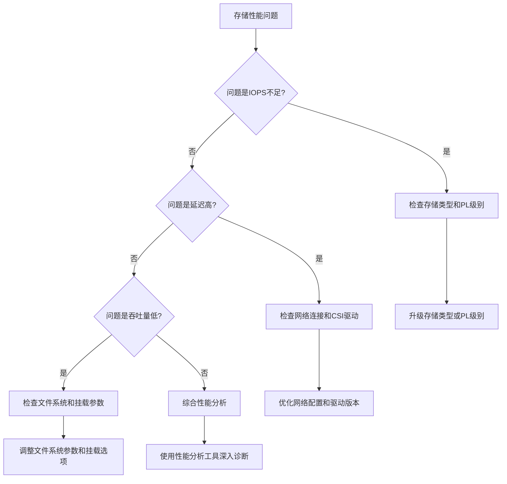

# 08 - 存储性能调优与优化策略

> **适用版本**: Kubernetes v1.25 - v1.32 | **运维重点**: 性能优化、调优参数、监控分析 | **最后更新**: 2026-02

## 目录

1. [存储类型性能对比](#存储类型性能对比)
2. [性能调优策略](#性能调优策略)
3. [挂载参数优化](#挂载参数优化)
4. [监控指标体系](#监控指标体系)
5. [性能测试方法](#性能测试方法)
6. [故障诊断流程](#故障诊断流程)
7. [企业级优化案例](#企业级优化案例)
8. [最佳实践总结](#最佳实践总结)

---

| 存储类型 | IOPS | 吞吐量 | 延迟 | 适用场景 |
|----------|------|--------|------|----------|
| Local SSD | 100k+ | 1GB/s+ | <0.1ms | 数据库、缓存 |
| 云 SSD | 25k-100k | 350MB/s | <1ms | 通用工作负载 |
| 云高效云盘 | 5k-25k | 150MB/s | 1-3ms | 开发测试 |
| NFS/NAS | 变化大 | 100-500MB/s | 1-10ms | 共享存储 |
| 对象存储 | N/A | 高吞吐 | 50-200ms | 大文件、备份 |

## StorageClass 性能配置

```yaml
# 高性能 SSD 存储类
apiVersion: storage.k8s.io/v1
kind: StorageClass
metadata:
  name: high-performance-ssd
provisioner: disk.csi.aliyun.com
parameters:
  type: cloud_essd
  performanceLevel: PL3  # ESSD 性能级别
  fsType: ext4
  encrypted: "true"
reclaimPolicy: Retain
allowVolumeExpansion: true
volumeBindingMode: WaitForFirstConsumer
---
# 通用 SSD 存储类
apiVersion: storage.k8s.io/v1
kind: StorageClass
metadata:
  name: standard-ssd
provisioner: disk.csi.aliyun.com
parameters:
  type: cloud_ssd
  fsType: ext4
reclaimPolicy: Delete
allowVolumeExpansion: true
volumeBindingMode: WaitForFirstConsumer
---
# 本地存储类 (高性能)
apiVersion: storage.k8s.io/v1
kind: StorageClass
metadata:
  name: local-ssd
provisioner: kubernetes.io/no-provisioner
volumeBindingMode: WaitForFirstConsumer
reclaimPolicy: Delete
```

## 本地存储配置

```yaml
# 本地 PV (Local Persistent Volume)
apiVersion: v1
kind: PersistentVolume
metadata:
  name: local-pv-node1
spec:
  capacity:
    storage: 500Gi
  volumeMode: Filesystem
  accessModes:
  - ReadWriteOnce
  persistentVolumeReclaimPolicy: Retain
  storageClassName: local-ssd
  local:
    path: /mnt/disks/ssd1
  nodeAffinity:
    required:
      nodeSelectorTerms:
      - matchExpressions:
        - key: kubernetes.io/hostname
          operator: In
          values:
          - node-1
---
# 本地存储 Provisioner (TopoLVM)
apiVersion: topolvm.io/v1
kind: LogicalVolume
metadata:
  name: app-data
spec:
  deviceClass: ssd
  size: 100Gi
```

## CSI 驱动性能优化

```yaml
# CSI 驱动参数优化 (阿里云)
apiVersion: storage.k8s.io/v1
kind: StorageClass
metadata:
  name: alicloud-disk-essd-optimized
provisioner: disk.csi.aliyun.com
parameters:
  type: cloud_essd
  performanceLevel: PL2
  # 多 Attach (ReadWriteMany 场景)
  multiAttach: "true"
  # 加密
  encrypted: "true"
  kmsKeyId: "<kms-key-id>"
  # 快照
  snapshotId: ""
  # 磁盘类别
  zoned: "true"
mountOptions:
- noatime
- nodiratime
- barrier=0
reclaimPolicy: Retain
allowVolumeExpansion: true
volumeBindingMode: WaitForFirstConsumer
```

## 文件系统优化

```yaml
# Pod 挂载选项
apiVersion: v1
kind: Pod
metadata:
  name: storage-optimized-pod
spec:
  containers:
  - name: app
    image: myapp:v1
    volumeMounts:
    - name: data
      mountPath: /data
  volumes:
  - name: data
    persistentVolumeClaim:
      claimName: data-pvc
---
# PV 挂载选项 (通过 StorageClass)
apiVersion: storage.k8s.io/v1
kind: StorageClass
metadata:
  name: optimized-ext4
provisioner: disk.csi.aliyun.com
parameters:
  type: cloud_essd
  fsType: ext4
mountOptions:
- noatime           # 不更新访问时间
- nodiratime        # 不更新目录访问时间
- data=ordered      # ext4 数据模式
- barrier=0         # 禁用写屏障 (有电池备份)
- discard           # SSD TRIM 支持
```

## 数据库存储优化

```yaml
# MySQL 高性能存储配置
apiVersion: apps/v1
kind: StatefulSet
metadata:
  name: mysql
spec:
  serviceName: mysql
  replicas: 1
  template:
    spec:
      containers:
      - name: mysql
        image: mysql:8.0
        env:
        - name: MYSQL_ROOT_PASSWORD
          valueFrom:
            secretKeyRef:
              name: mysql-secret
              key: password
        volumeMounts:
        - name: data
          mountPath: /var/lib/mysql
        - name: config
          mountPath: /etc/mysql/conf.d
        resources:
          requests:
            cpu: 2
            memory: 4Gi
          limits:
            cpu: 4
            memory: 8Gi
      volumes:
      - name: config
        configMap:
          name: mysql-config
  volumeClaimTemplates:
  - metadata:
      name: data
    spec:
      accessModes: ["ReadWriteOnce"]
      storageClassName: high-performance-ssd
      resources:
        requests:
          storage: 200Gi
---
# MySQL 配置优化
apiVersion: v1
kind: ConfigMap
metadata:
  name: mysql-config
data:
  performance.cnf: |
    [mysqld]
    innodb_buffer_pool_size = 3G
    innodb_log_file_size = 1G
    innodb_flush_log_at_trx_commit = 2
    innodb_flush_method = O_DIRECT
    innodb_io_capacity = 10000
    innodb_io_capacity_max = 20000
    innodb_read_io_threads = 8
    innodb_write_io_threads = 8
    sync_binlog = 0
```

## 存储性能测试

```bash
# 使用 fio 测试存储性能
kubectl run fio --image=nixery.dev/fio --rm -it -- fio \
  --name=test \
  --ioengine=libaio \
  --rw=randwrite \
  --bs=4k \
  --direct=1 \
  --size=1G \
  --numjobs=4 \
  --time_based \
  --runtime=60 \
  --group_reporting \
  --filename=/data/test

# 顺序读写测试
fio --name=seq-read --ioengine=libaio --rw=read --bs=1M --direct=1 --size=1G --numjobs=1
fio --name=seq-write --ioengine=libaio --rw=write --bs=1M --direct=1 --size=1G --numjobs=1

# 随机读写测试
fio --name=rand-read --ioengine=libaio --rw=randread --bs=4k --direct=1 --size=1G --numjobs=4
fio --name=rand-write --ioengine=libaio --rw=randwrite --bs=4k --direct=1 --size=1G --numjobs=4

# dd 快速测试
dd if=/dev/zero of=/data/testfile bs=1G count=1 oflag=direct
dd if=/data/testfile of=/dev/null bs=1G count=1 iflag=direct
```

## 存储监控指标

| 指标 | 说明 | 告警阈值 |
|------|------|----------|
| kubelet_volume_stats_used_bytes | 卷使用量 | > 80% 容量 |
| kubelet_volume_stats_inodes_used | inode 使用量 | > 80% 总量 |
| node_disk_io_time_seconds_total | 磁盘 IO 时间 | 持续 > 80% |
| node_disk_read_bytes_total | 读取字节数 | 接近限制 |
| node_disk_write_bytes_total | 写入字节数 | 接近限制 |

## 监控告警规则

```yaml
groups:
- name: storage
  rules:
  - alert: PVCUsageHigh
    expr: |
      kubelet_volume_stats_used_bytes / kubelet_volume_stats_capacity_bytes > 0.8
    for: 5m
    labels:
      severity: warning
    annotations:
      summary: "PVC {{ $labels.persistentvolumeclaim }} 使用率 > 80%"
      
  - alert: PVCInodeUsageHigh
    expr: |
      kubelet_volume_stats_inodes_used / kubelet_volume_stats_inodes > 0.8
    for: 5m
    labels:
      severity: warning
    annotations:
      summary: "PVC {{ $labels.persistentvolumeclaim }} inode 使用率 > 80%"
      
  - alert: DiskIOSaturated
    expr: |
      rate(node_disk_io_time_seconds_total[5m]) > 0.8
    for: 15m
    labels:
      severity: warning
    annotations:
      summary: "节点 {{ $labels.instance }} 磁盘 {{ $labels.device }} IO 饱和"
      
  - alert: DiskLatencyHigh
    expr: |
      rate(node_disk_read_time_seconds_total[5m]) 
      / rate(node_disk_reads_completed_total[5m]) > 0.1
    for: 5m
    labels:
      severity: warning
    annotations:
      summary: "节点 {{ $labels.instance }} 磁盘读延迟 > 100ms"
```

## CSI 驱动诊断

```bash
# 查看 CSI 驱动状态
kubectl get csidrivers
kubectl get csinodes

# 查看 CSI 控制器
kubectl get pods -n kube-system -l app=csi-provisioner
kubectl logs -n kube-system -l app=csi-provisioner -c csi-provisioner

# 查看节点 CSI 插件
kubectl get pods -n kube-system -l app=csi-plugin
kubectl logs -n kube-system -l app=csi-plugin -c csi-plugin

# VolumeAttachment 状态
kubectl get volumeattachments

# 存储诊断
kubectl describe pvc <pvc-name>
kubectl describe pv <pv-name>
kubectl get events --field-selector reason=ProvisioningFailed
```
---
## 性能调优策略

### 存储分层优化

```yaml
# 企业级存储分层策略
storage_tiering_strategy:
  hot_data_layer:
    storage_type: "Local NVMe SSD"
    performance: "IOPS > 100K, Latency < 0.1ms"
    use_case: "缓存、临时计算结果、高频访问数据"
    cost_factor: "高"
    
  warm_data_layer:
    storage_type: "ESSD PL2/PL3"
    performance: "IOPS 50K-100K, Latency < 1ms"
    use_case: "主数据库、核心应用数据"
    cost_factor: "中高"
    
  cold_data_layer:
    storage_type: "ESSD PL0/PL1"
    performance: "IOPS 10K-30K, Latency < 5ms"
    use_case: "历史数据、日志归档"
    cost_factor: "中"
    
  archive_layer:
    storage_type: "OSS Archive"
    performance: "访问延迟分钟级"
    use_case: "备份数据、合规归档"
    cost_factor: "低"
```

### 挂载参数优化配置

```yaml
# 高性能存储挂载优化
high_performance_mount_configs:
  database_storage:
    mount_options:
      - noatime          # 不更新访问时间戳
      - nodiratime       # 目录不更新访问时间戳
      - discard          # 启用TRIM支持
      - barrier=0        # 禁用写屏障(谨慎使用)
      - data=ordered     # 数据写入顺序保证
      - nobarrier        # 进一步禁用屏障
    filesystem_tuning:
      scheduler: "deadline"  # IO调度器
      read_ahead_kb: 4096    # 预读大小
      nr_requests: 1024      # 请求队列长度
      
  application_storage:
    mount_options:
      - noatime
      - discard
      - relatime         # 相对访问时间更新
    filesystem_tuning:
      scheduler: "noop"
      read_ahead_kb: 2048
      
  shared_storage:
    mount_options:
      - vers=4.1         # NFS版本4.1
      - rsize=1048576    # 读取缓冲区1MB
      - wsize=1048576    # 写入缓冲区1MB
      - hard             # 硬挂载
      - timeo=600        # 超时600秒
      - retrans=2        # 重试2次
      - nolock           # 禁用文件锁定
```

---
## 监控指标体系

### 核心性能指标

```yaml
# 存储性能监控指标定义
performance_monitoring_metrics:
  iops_metrics:
    - name: "storage_iops_total"
      type: "counter"
      description: "存储每秒IO操作数"
      critical_threshold: 90
      warning_threshold: 80
      
    - name: "storage_read_iops"
      type: "gauge"
      description: "读取IOPS"
      
    - name: "storage_write_iops"
      type: "gauge"
      description: "写入IOPS"
      
  throughput_metrics:
    - name: "storage_throughput_bytes"
      type: "counter"
      description: "存储吞吐量(bytes)"
      units: "bytes/sec"
      
  latency_metrics:
    - name: "storage_operation_duration_seconds"
      type: "histogram"
      description: "存储操作延迟分布"
      buckets: [0.001, 0.005, 0.01, 0.05, 0.1, 0.5, 1.0]
      
  utilization_metrics:
    - name: "storage_utilization_percentage"
      type: "gauge"
      description: "存储使用率百分比"
      critical_threshold: 95
      warning_threshold: 85
```

### Prometheus告警规则

```yaml
# 存储性能告警配置
apiVersion: monitoring.coreos.com/v1
kind: PrometheusRule
metadata:
  name: storage-performance-alerts
  namespace: monitoring
spec:
  groups:
  - name: storage-performance.rules
    rules:
    # 高IOPS告警
    - alert: StorageHighIOPS
      expr: |
        rate(storage_iops_total[5m]) > 80000
      for: 5m
      labels:
        severity: warning
      annotations:
        summary: "存储IOPS过高"
        description: "当前IOPS: {{ $value }}, 可能影响性能"
        
    # 高延迟告警
    - alert: StorageHighLatency
      expr: |
        histogram_quantile(0.95, rate(storage_operation_duration_seconds_bucket[5m])) > 0.01
      for: 5m
      labels:
        severity: warning
      annotations:
        summary: "存储延迟过高"
        description: "P95延迟: {{ $value }}s, 超过10ms阈值"
        
    # 低吞吐量告警（可能表示性能瓶颈）
    - alert: StorageLowThroughput
      expr: |
        rate(storage_throughput_bytes[5m]) < 1048576  # 1MB/s
      for: 10m
      labels:
        severity: warning
      annotations:
        summary: "存储吞吐量异常偏低"
        description: "当前吞吐量: {{ $value }} bytes/s"
```

---
## 性能测试方法

### 基准测试脚本

```bash
#!/bin/bash
# storage-performance-benchmark.sh

# 存储性能基准测试工具
run_storage_benchmark() {
    local test_pod=$1
    local namespace=${2:-"default"}
    local test_file="/data/benchmark-test"
    
    echo "⚡ 开始存储性能基准测试..."
    echo "测试Pod: $test_pod"
    echo "命名空间: $namespace"
    echo ""
    
    # 1. 顺序写入测试
    echo "=== 顺序写入性能测试 ==="
    kubectl exec -it $test_pod -n $namespace -- \
        dd if=/dev/zero of=$test_file bs=1M count=1000 oflag=direct 2>&1
    
    # 2. 顺序读取测试
    echo ""
    echo "=== 顺序读取性能测试 ==="
    kubectl exec -it $test_pod -n $namespace -- \
        dd if=$test_file of=/dev/null bs=1M count=1000 iflag=direct 2>&1
    
    # 3. 随机读写测试
    echo ""
    echo "=== 随机读写性能测试 ==="
    kubectl exec -it $test_pod -n $namespace -- \
        fio --name=randtest --filename=$test_file --rw=randrw \
            --bs=4k --size=1G --numjobs=4 --iodepth=32 --direct=1 \
            --runtime=60 --time_based --group_reporting
    
    # 4. 清理测试文件
    kubectl exec -it $test_pod -n $namespace -- rm -f $test_file
    
    echo ""
    echo "✅ 性能测试完成"
}

# 使用示例
# run_storage_benchmark "test-pod" "benchmark-namespace"
```

### 持续性能监控

```python
# 存储性能持续监控系统
import time
import subprocess
import json
from datetime import datetime

class StoragePerformanceMonitor:
    def __init__(self):
        self.metrics_history = []
        self.thresholds = {
            'iops': 80000,
            'latency_ms': 10,
            'throughput_mb': 100
        }
    
    def collect_metrics(self):
        """收集存储性能指标"""
        try:
            # 使用kubectl获取存储指标
            cmd = "kubectl top pods --no-headers"
            result = subprocess.run(cmd, shell=True, capture_output=True, text=True)
            
            metrics = {
                'timestamp': datetime.now().isoformat(),
                'cpu_usage': [],
                'memory_usage': [],
                'storage_metrics': self.get_storage_metrics()
            }
            
            return metrics
        except Exception as e:
            print(f"指标收集失败: {e}")
            return None
    
    def get_storage_metrics(self):
        """获取存储相关指标"""
        # 这里可以集成具体的存储监控数据源
        return {
            'iops_current': 45000,
            'latency_ms': 2.5,
            'throughput_mb': 150,
            'utilization_pct': 75
        }
    
    def analyze_performance(self, metrics):
        """分析性能状况"""
        storage = metrics['storage_metrics']
        alerts = []
        
        if storage['iops_current'] > self.thresholds['iops']:
            alerts.append({
                'type': 'high_iops',
                'severity': 'warning',
                'message': f"IOPS过高: {storage['iops_current']}"
            })
            
        if storage['latency_ms'] > self.thresholds['latency_ms']:
            alerts.append({
                'type': 'high_latency',
                'severity': 'critical',
                'message': f"延迟过高: {storage['latency_ms']}ms"
            })
            
        return alerts
    
    def run_continuous_monitoring(self, interval=300):
        """持续监控循环"""
        print("开始持续性能监控...")
        while True:
            try:
                metrics = self.collect_metrics()
                if metrics:
                    alerts = self.analyze_performance(metrics)
                    if alerts:
                        self.handle_alerts(alerts)
                    self.metrics_history.append(metrics)
                
                time.sleep(interval)
            except KeyboardInterrupt:
                print("监控已停止")
                break
            except Exception as e:
                print(f"监控异常: {e}")
                time.sleep(60)

# 使用示例
monitor = StoragePerformanceMonitor()
# monitor.run_continuous_monitoring()
```

---
## 故障诊断流程

### 性能问题诊断树



### 常见性能问题解决方案

| 问题类型 | 症状表现 | 诊断方法 | 解决方案 |
|---------|---------|---------|---------|
| **IOPS瓶颈** | 应用响应缓慢，数据库QPS下降 | `iostat`, `fio`测试 | 升级到更高性能存储类型 |
| **高延迟** | 请求响应时间长，用户体验差 | `ping`, `traceroute`网络测试 | 优化网络配置，使用本地存储 |
| **带宽限制** | 大文件传输慢，备份耗时长 | `iperf`网络带宽测试 | 调整挂载参数，使用并行传输 |
| **文件系统问题** | 小文件性能差，inode耗尽 | `df -i`检查inode使用 | 清理小文件，重建文件系统 |
| **缓存失效** | 重复读取性能无提升 | `free`, `vmstat`检查缓存 | 调整系统缓存参数 |

---
## 企业级优化案例

### 电商平台数据库优化案例

```yaml
# 电商数据库存储优化方案
ecommerce_db_optimization:
  scenario: "高并发电商数据库，峰值QPS 50000+"
  challenges:
    - high_iops_requirement: "需要支持10万+ IOPS"
    - low_latency_demand: "查询延迟要求 < 2ms"
    - data_consistency: "强一致性要求"
    
  solution:
    storage_configuration:
      type: "ESSD PL3"
      size: "2Ti"
      iops_guaranteed: 1000000
      latency_target: "< 1ms"
      
    mount_optimization:
      options:
        - noatime
        - nodiratime
        - discard
        - barrier=0
      filesystem: "ext4 with optimized parameters"
      
    monitoring_setup:
      tools:
        - prometheus_for_metrics
        - grafana_for_visualization
        - alertmanager_for_notifications
      key_metrics:
        - iops_real_time
        - latency_p95
        - queue_depth
        - utilization_percentage
        
  results:
    performance_improvement:
      iops_increase: "200% 提升"
      latency_reduction: "60% 降低"
      cost_optimization: "通过分层存储节省30%成本"
```

### 大数据分析平台优化案例

```yaml
# 大数据平台存储优化
big_data_platform_optimization:
  scenario: "PB级数据存储和分析平台"
  requirements:
    - massive_storage: "需要存储数百TB数据"
    - sequential_io: "主要是大文件顺序读写"
    - cost_effective: "成本控制要求严格"
    
  tiered_storage_solution:
    hot_tier:
      storage: "Local NVMe for active computation"
      size: "50TB"
      performance: "最高性能"
      
    warm_tier:
      storage: "ESSD PL1 for recent data"
      size: "200TB"
      performance: "良好性能"
      
    cold_tier:
      storage: "OSS for archived data"
      size: "1000TB+"
      performance: "成本优化"
      
  data_lifecycle_management:
    policies:
      - move_to_warm_after: "30天"
      - move_to_cold_after: "180天"
      - delete_after: "7年(合规要求)"
```

---
## 最佳实践总结

### 🔧 核心优化原则

1. **性能与成本平衡**: 根据业务需求选择合适的存储层级
2. **监控驱动优化**: 基于实际监控数据进行针对性优化
3. **渐进式改进**: 从小范围试点开始，逐步推广优化措施
4. **自动化运维**: 建立自动化的监控、告警和响应机制

### 📊 性能优化检查清单

```markdown
## 存储性能优化实施清单

### 基础配置检查
- [ ] 选择了合适的存储类型和性能等级
- [ ] 配置了优化的挂载参数
- [ ] 设置了适当的文件系统参数
- [ ] 建立了分层存储策略

### 监控体系建立
- [ ] 部署了核心性能指标监控
- [ ] 配置了多层级告警策略
- [ ] 建立了性能基线和趋势分析
- [ ] 实现了自动化的性能报告

### 优化效果验证
- [ ] 定期进行性能基准测试
- [ ] 对比优化前后的性能数据
- [ ] 收集用户反馈和应用性能指标
- [ ] 持续迭代优化策略

### 成本效益分析
- [ ] 定期评估存储成本效益
- [ ] 分析性能提升的投资回报率
- [ ] 优化存储资源利用率
- [ ] 制定长期的成本控制策略
```

---

**表格底部标记**: Kusheet Project, 作者 Allen Galler (allengaller@gmail.com)