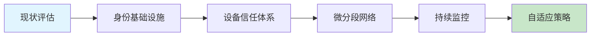

# 19 - 零信任安全架构实施指南

> **适用版本**: Kubernetes v1.25 - v1.32 | **难度**: 专家级 | **参考**: [NIST SP 800-207 Zero Trust Architecture](https://csrc.nist.gov/publications/detail/sp/800-207/final) | [Google BeyondCorp](https://cloud.google.com/beyondcorp) | [Microsoft Zero Trust](https://learn.microsoft.com/en-us/security/zero-trust/)

## 一、零信任架构核心理念

### 1.1 零信任原则与模型

```
┌─────────────────────────────────────────────────────────────────────────────────────┐
│                        Zero Trust Security Architecture                              │
├─────────────────────────────────────────────────────────────────────────────────────┤
│                                                                                      │
│  ┌────────────────────────────────────────────────────────────────────────────────┐ │
│  │                           核心原则 (Core Principles)                            │ │
│  │  ┌──────────────┐  ┌──────────────┐  ┌──────────────┐  ┌──────────────┐       │ │
│  │  │  Never Trust │  │  Always      │  │  Assume      │  │  Least       │       │ │
│  │  │  Always      │  │  Verify      │  │  Breach      │  │  Privilege   │       │ │
│  │  │  Verify      │  │  Explicitly  │  │  Exists      │  │  Access      │       │ │
│  │  └──────┬───────┘  └──────┬───────┘  └──────┬───────┘  └──────┬───────┘       │ │
│  │         │                 │                 │                 │                │ │
│  │         └─────────────────┼─────────────────┼─────────────────┘                │ │
│  │                           │                 │                                  │ │
│  │                    ┌──────▼─────────────────▼──────┐                          │ │
│  │                    │    Zero Trust Pillars         │                          │ │
│  │                    │   零信任三大支柱               │                          │ │
│  │                    └───────────────────────────────┘                          │ │
│  └────────────────────────────────────────────────────────────────────────────────┘ │
│                                    │                                                │
│  ┌─────────────────────────────────▼──────────────────────────────────────────────┐ │
│  │                        Kubernetes Zero Trust Model                             │ │
│  │  ┌─────────────────────────────────────────────────────────────────────────┐   │ │
│  │  │                           Identity Plane                                │   │ │
│  │  │  ┌────────────┐  ┌────────────┐  ┌────────────┐  ┌────────────┐         │   │ │
│  │  │  │   SPIFFE   │  │   SPIRE     │  │   OIDC      │  │   LDAP      │         │   │ │
│  │  │  │   身份框架   │  │   身份管理   │  │   认证协议   │  │   目录服务   │         │   │ │
│  │  │  └────────────┘  └────────────┘  └────────────┘  └────────────┘         │   │ │
│  │  └─────────────────────────────────────────────────────────────────────────┘   │ │
│  │  ┌─────────────────────────────────────────────────────────────────────────┐   │ │
│  │  │                           Device Plane                                  │   │ │
│  │  │  ┌────────────┐  ┌────────────┐  ┌────────────┐  ┌────────────┐         │   │ │
│  │  │  │   MDM       │  │   Endpoint  │  │   Asset     │  │   CMDB      │         │   │ │
│  │  │  │   设备管理   │  │   检测      │  │   管理      │  │   配置库    │         │   │ │
│  │  │  └────────────┘  └────────────┘  └────────────┘  └────────────┘         │   │ │
│  │  └─────────────────────────────────────────────────────────────────────────┘   │ │
│  │  ┌─────────────────────────────────────────────────────────────────────────┐   │ │
│  │  │                           Network Plane                                 │   │ │
│  │  │  ┌────────────┐  ┌────────────┐  ┌────────────┐  ┌────────────┐         │   │ │
│  │  │  │   Service   │  │   Network   │  │   Traffic   │  │   Micro-    │         │   │ │
│  │  │  │   Mesh      │  │   Segments  │  │   Inspection│  │   Segments  │         │   │ │
│  │  │  │   服务网格   │  │   网络分段   │  │   流量检查   │  │   微分段    │         │   │ │
│  │  │  └────────────┘  └────────────┘  └────────────┘  └────────────┘         │   │ │
│  │  └─────────────────────────────────────────────────────────────────────────┘   │ │
│  │  ┌─────────────────────────────────────────────────────────────────────────┐   │ │
│  │  │                           Application Plane                             │   │ │
│  │  │  ┌────────────┐  ┌────────────┐  ┌────────────┐  ┌────────────┐         │   │ │
│  │  │  │   API       │  │   Workload  │  │   Data      │  │   Policy    │         │   │ │
│  │  │  │   网关      │  │   认证      │  │   保护      │  │   引擎      │         │   │ │
│  │  │  └────────────┘  └────────────┘  └────────────┘  └────────────┘         │   │ │
│  │  └─────────────────────────────────────────────────────────────────────────┘   │ │
│  │  ┌─────────────────────────────────────────────────────────────────────────┐   │ │
│  │  │                           Data Plane                                    │   │ │
│  │  │  ┌────────────┐  ┌────────────┐  ┌────────────┐  ┌────────────┐         │   │ │
│  │  │  │   DLP       │  │   Crypto    │  │   Backup    │  │   Archive   │         │   │ │
│  │  │  │   数据防泄漏 │  │   加密      │  │   备份      │  │   归档      │         │   │ │
│  │  │  └────────────┘  └────────────┘  └────────────┘  └────────────┘         │   │ │
│  │  └─────────────────────────────────────────────────────────────────────────┘   │ │
│  └────────────────────────────────────────────────────────────────────────────────┘ │
│                                                                                      │
└─────────────────────────────────────────────────────────────────────────────────────┘
```

### 1.2 Kubernetes零信任实施框架

#### 零信任成熟度模型

| 成熟度等级 | 特征 | 实施重点 | 时间投入 | ROI |
|-----------|------|---------|---------|-----|
| **Level 1** | 基础身份认证 | 用户认证、基本RBAC | 2-3个月 | 中 |
| **Level 2** | 设备信任评估 | 终端检测、设备注册 | 3-6个月 | 高 |
| **Level 3** | 动态访问控制 | 上下文感知、实时决策 | 6-12个月 | 很高 |
| **Level 4** | 持续风险评估 | 行为分析、威胁检测 | 12-18个月 | 最高 |

#### 实施路线图



## 二、身份基础设施建设

### 2.1 SPIFFE/SPIRE身份体系

#### SPIRE服务器部署

```yaml
# 01-spire-server.yaml
apiVersion: apps/v1
kind: Deployment
metadata:
  name: spire-server
  namespace: spire
spec:
  replicas: 3
  selector:
    matchLabels:
      app: spire-server
  template:
    metadata:
      labels:
        app: spire-server
    spec:
      serviceAccountName: spire-server
      containers:
      - name: spire-server
        image: ghcr.io/spiffe/spire-server:1.8.0
        args:
        - -config
        - /run/spire/config/server.conf
        ports:
        - containerPort: 8081
          name: grpc
        volumeMounts:
        - name: spire-config
          mountPath: /run/spire/config
          readOnly: true
        - name: spire-data
          mountPath: /run/spire/data
        securityContext:
          runAsNonRoot: true
          runAsUser: 1000
      volumes:
      - name: spire-config
        configMap:
          name: spire-server-config
      - name: spire-data
        persistentVolumeClaim:
          claimName: spire-server-data
---
apiVersion: v1
kind: ConfigMap
metadata:
  name: spire-server-config
  namespace: spire
data:
  server.conf: |
    server {
      bind_address = "0.0.0.0"
      bind_port = "8081"
      trust_domain = "k8s.example.com"
      data_dir = "/run/spire/data"
      log_level = "INFO"
      ca_subject = {
        country = ["US"]
        organization = ["Example"]
        common_name = "K8s SPIRE CA"
      }
    }
    
    plugins {
      DataStore "sql" {
        plugin_data {
          database_type = "sqlite3"
          connection_string = "/run/spire/data/datastore.sqlite3"
        }
      }
      
      NodeAttestor "k8s_psat" {
        plugin_data {
          clusters = {
            "production" = {
              service_account_allow_list = ["spire:spire-agent"]
            }
          }
        }
      }
      
      KeyManager "disk" {
        plugin_data {
          keys_path = "/run/spire/data/keys.json"
        }
      }
      
      Notifier "k8sbundle" {
        plugin_data {
          namespace = "spire"
        }
      }
    }
```

#### SPIRE代理配置

```yaml
# 02-spire-agent.yaml
apiVersion: apps/v1
kind: DaemonSet
metadata:
  name: spire-agent
  namespace: spire
spec:
  selector:
    matchLabels:
      app: spire-agent
  template:
    metadata:
      labels:
        app: spire-agent
    spec:
      hostPID: true
      hostNetwork: true
      dnsPolicy: ClusterFirstWithHostNet
      serviceAccountName: spire-agent
      containers:
      - name: spire-agent
        image: ghcr.io/spiffe/spire-agent:1.8.0
        args:
        - -config
        - /run/spire/config/agent.conf
        volumeMounts:
        - name: spire-config
          mountPath: /run/spire/config
          readOnly: true
        - name: spire-agent-socket
          mountPath: /tmp/spire-agent/public
        - name: spire-bundle
          mountPath: /run/spire/bundle
          readOnly: true
        securityContext:
          privileged: true
          runAsUser: 0
      volumes:
      - name: spire-config
        configMap:
          name: spire-agent-config
      - name: spire-agent-socket
        hostPath:
          path: /tmp/spire-agent/public
          type: DirectoryOrCreate
      - name: spire-bundle
        configMap:
          name: spire-bundle
```

### 2.2 工作负载身份绑定

#### 工作负载注册入口

```yaml
# 03-workload-registration.yaml
apiVersion: spiffe.id/v1beta1
kind: ClusterSPIFFEID
metadata:
  name: production-workloads
spec:
  spiffeIDTemplate: "spiffe://k8s.example.com/ns/{{.PodMeta.Namespace}}/sa/{{.PodSpec.ServiceAccountName}}"
  podSelector:
    matchLabels:
      env: production
  workloadSelectorTemplates:
  - "k8s:ns:{{.PodMeta.Namespace}}"
  - "k8s:sa:{{.PodSpec.ServiceAccountName}}"
  - "k8s:app:{{.PodMeta.Labels.app}}"
---
apiVersion: spiffe.id/v1beta1
kind: ClusterSPIFFEID
metadata:
  name: database-workloads
spec:
  spiffeIDTemplate: "spiffe://k8s.example.com/database/{{.PodMeta.Name}}"
  namespaceSelector:
    matchLabels:
      tier: database
  podSelector:
    matchLabels:
      app: postgresql
```

#### 应用集成示例

```go
// 04-go-spiffe-example.go
package main

import (
    "context"
    "crypto/tls"
    "fmt"
    "log"
    "net/http"
    
    "github.com/spiffe/go-spiffe/v2/spiffetls/tlsconfig"
    "github.com/spiffe/go-spiffe/v2/workloadapi"
)

func main() {
    // 创建工作负载API客户端
    ctx := context.Background()
    source, err := workloadapi.NewX509Source(ctx, workloadapi.WithClientOptions(
        workloadapi.WithAddr("unix:///tmp/spire-agent/public/api.sock"),
    ))
    if err != nil {
        log.Fatalf("Unable to create X509Source: %v", err)
    }
    defer source.Close()
    
    // 创建mTLS服务器
    tlsConfig := tlsconfig.MTLSServerConfig(source, source, tlsconfig.AuthorizeAny())
    server := &http.Server{
        Addr:      ":8443",
        TLSConfig: tlsConfig,
        Handler:   http.HandlerFunc(handler),
    }
    
    log.Println("Starting mTLS server on :8443")
    if err := server.ListenAndServeTLS("", ""); err != nil {
        log.Fatal(err)
    }
}

func handler(w http.ResponseWriter, r *http.Request) {
    // 获取客户端SPIFFE ID
    if r.TLS != nil && len(r.TLS.PeerCertificates) > 0 {
        cert := r.TLS.PeerCertificates[0]
        spiffeID := cert.URIs[0].String()
        fmt.Fprintf(w, "Hello! Your SPIFFE ID is: %s\n", spiffeID)
    } else {
        http.Error(w, "No client certificate provided", http.StatusUnauthorized)
    }
}
```

## 三、设备信任与终端安全

### 3.1 终端检测与响应(EDR)

#### 节点安全代理部署

```yaml
# 05-node-security-agent.yaml
apiVersion: apps/v1
kind: DaemonSet
metadata:
  name: security-agent
  namespace: security
spec:
  selector:
    matchLabels:
      app: security-agent
  template:
    metadata:
      labels:
        app: security-agent
    spec:
      hostPID: true
      hostNetwork: true
      containers:
      - name: falco
        image: falcosecurity/falco-no-driver:0.36.0
        securityContext:
          privileged: true
        volumeMounts:
        - name: dev
          mountPath: /host/dev
        - name: proc
          mountPath: /host/proc
        - name: boot
          mountPath: /host/boot
        - name: lib-modules
          mountPath: /lib/modules
        - name: usr
          mountPath: /usr
        - name: etc
          mountPath: /etc
        env:
        - name: FALCO_BPF_PROBE
          value: ""
        - name: HOST_ROOT
          value: "/host"
      volumes:
      - name: dev
        hostPath:
          path: /dev
      - name: proc
        hostPath:
          path: /proc
      - name: boot
        hostPath:
          path: /boot
      - name: lib-modules
        hostPath:
          path: /lib/modules
      - name: usr
        hostPath:
          path: /usr
      - name: etc
        hostPath:
          path: /etc
```

### 3.2 设备合规性检查

#### 设备信任评估策略

```yaml
# 06-device-trust-policy.yaml
apiVersion: security.k8s.io/v1
kind: DeviceTrustPolicy
metadata:
  name: production-device-trust
spec:
  # 设备基线要求
  deviceRequirements:
    osVersion: ">= Ubuntu 20.04"
    kernelVersion: ">= 5.4"
    securityModules:
    - name: "apparmor"
      status: "enabled"
    - name: "selinux"
      status: "enforcing"
    
  # 网络要求
  networkRequirements:
    firewallStatus: "active"
    allowedPorts:
    - 22/tcp    # SSH
    - 10250/tcp # Kubelet
    blockedPorts:
    - 23/tcp    # Telnet
    - 135/tcp   # RPC
    
  # 软件要求
  softwareRequirements:
    requiredPackages:
    - "kubelet"
    - "containerd"
    forbiddenPackages:
    - "docker-ce"
    - "unattended-upgrades"
    
  # 行为基线
  behavioralBaselines:
    loginPatterns:
      maxFailedLogins: 3
      timeWindow: "1h"
    processExecution:
      allowedBinaries:
      - "/usr/bin/kubelet"
      - "/usr/bin/containerd"
      forbiddenPatterns:
      - "*nc*"
      - "*netcat*"
```

## 四、微分段与动态访问控制

### 4.1 基于上下文的网络策略

#### 动态网络策略引擎

```yaml
# 07-context-aware-policy.yaml
apiVersion: security.k8s.io/v1
kind: ContextualNetworkPolicy
metadata:
  name: dynamic-backend-access
spec:
  selector:
    matchLabels:
      app: backend-api
      
  # 基于时间的访问控制
  timeBasedRules:
  - schedule: "business-hours"
    timeRange:
      start: "09:00"
      end: "18:00"
    days: ["monday", "tuesday", "wednesday", "thursday", "friday"]
    allow:
    - from:
        namespaces: ["frontend"]
        
  # 基于威胁情报的访问控制
  threatIntelligenceRules:
  - feed: "alienvault"
    severity: "high"
    action: "block"
    duration: "24h"
    
  # 基于行为的访问控制
  behavioralRules:
  - metric: "connection_rate"
    threshold: 100
    timeframe: "5m"
    action: "rate_limit"
    
  # 基于地理位置的访问控制
  geoBasedRules:
  - countries: ["CN", "US"]
    action: "allow"
  - countries: ["RU", "KP"]
    action: "deny"
```

### 4.2 服务网格零信任配置

#### Istio零信任策略

```yaml
# 08-istio-zero-trust.yaml
apiVersion: security.istio.io/v1beta1
kind: AuthorizationPolicy
metadata:
  name: zero-trust-backend
  namespace: production
spec:
  selector:
    matchLabels:
      app: backend-api
      
  # 基于身份的访问控制
  rules:
  - from:
    - source:
        principals: 
        - "spiffe://k8s.example.com/ns/frontend/sa/frontend-sa"
        requestPrincipals: 
        - "https://accounts.google.com/*"
    to:
    - operation:
        methods: ["GET", "POST"]
        paths: ["/api/v1/*"]
    when:
    - key: request.auth.claims[groups]
      values: ["developers", "admins"]
    - key: source.ip
      values: ["10.0.0.0/8"]
    - key: request.time
      values: ["09:00:00Z-18:00:00Z"]
      
  # 条件访问控制
  - from:
    - source:
        principals: ["cluster.local/ns/monitoring/sa/prometheus"]
    to:
    - operation:
        methods: ["GET"]
        paths: ["/metrics"]
    when:
    - key: request.headers[x-forwarded-for]
      notValues: ["*"]
    - key: source.namespace
      values: ["monitoring"]
```

## 五、持续监控与自适应安全

### 5.1 行为分析与异常检测

#### 用户行为分析配置

```yaml
# 09-user-behavior-analytics.yaml
apiVersion: security.k8s.io/v1
kind: BehavioralAnalytics
metadata:
  name: k8s-user-analytics
spec:
  # 用户行为基线
  baselines:
    adminUser:
      normalPatterns:
        loginFrequency: "< 10 times/day"
        namespaceAccess: "all"
        rbacChanges: "< 5 changes/day"
      anomalyThresholds:
        loginFrequency: "> 50 times/day"
        concurrentSessions: "> 3"
        unusualCommands: "> 10 unique kubectl commands/hour"
        
    developerUser:
      normalPatterns:
        loginFrequency: "< 20 times/day"
        namespaceAccess: "specific projects"
        resourceCreation: "< 10 pods/day"
      anomalyThresholds:
        loginFrequency: "> 100 times/day"
        crossNamespaceAccess: "> 5 namespaces"
        privilegeEscalationAttempts: "> 1"
        
  # 实时检测规则
  detectionRules:
  - name: "suspicious_kubectl_usage"
    description: "检测可疑的kubectl使用模式"
    condition: |
      user_command_count > baseline * 3 AND
      commands_include_sensitive_verbs AND
      source_ip_not_in_known_list
    severity: "high"
    action: "alert_and_block"
    
  - name: "credential_theft_indicators"
    description: "凭证窃取指标检测"
    condition: |
      failed_login_attempts > 5 AND
      successful_login_within_1min AND
      source_ip_changed
    severity: "critical"
    action: "immediate_lockout"
```

### 5.2 安全事件编排与自动化响应

#### SOAR安全编排配置

```yaml
# 10-soar-orchestration.yaml
apiVersion: security.k8s.io/v1
kind: SecurityOrchestration
metadata:
  name: zero-trust-response
spec:
  # 事件触发器
  triggers:
  - name: "high-risk-login"
    source: "auth-system"
    condition: |
      event.type == "login" AND
      risk_score > 80 AND
      geolocation.risk == "high"
    actions:
    - name: "block-ip"
      type: "network"
      parameters:
        duration: "1h"
        scope: "cluster-wide"
    - name: "notify-security-team"
      type: "notification"
      parameters:
        channel: "slack-security"
        priority: "high"
        
  - name: "malicious-pod-behavior"
    source: "runtime-security"
    condition: |
      alert.type == "syscall_violation" AND
      severity == "critical"
    actions:
    - name: "isolate-pod"
      type: "network"
      parameters:
        network_policy: "deny-all"
    - name: "capture-forensics"
      type: "forensics"
      parameters:
        duration: "30m"
    - name: "scale-down-deployment"
      type: "workload"
      parameters:
        replicas: 0
```

## 六、零信任实施最佳实践

### 6.1 渐进式部署策略

#### 部署阶段规划

```bash
#!/bin/bash
# 11-zero-trust-deployment.sh

echo "=== Zero Trust Deployment Strategy ==="

# 阶段1: 身份基础设施 (Months 1-3)
echo "Phase 1: Identity Infrastructure"
kubectl apply -f 01-spire-server.yaml
kubectl apply -f 02-spire-agent.yaml
kubectl apply -f 03-workload-registration.yaml

# 阶段2: 设备信任体系 (Months 4-6)
echo "Phase 2: Device Trust System"
kubectl apply -f 05-node-security-agent.yaml
kubectl apply -f 06-device-trust-policy.yaml

# 阶段3: 微分段网络 (Months 7-9)
echo "Phase 3: Micro-segmentation"
kubectl apply -f 07-context-aware-policy.yaml
kubectl apply -f 08-istio-zero-trust.yaml

# 阶段4: 持续监控 (Months 10-12)
echo "Phase 4: Continuous Monitoring"
kubectl apply -f 09-user-behavior-analytics.yaml
kubectl apply -f 10-soar-orchestration.yaml

echo "Zero Trust deployment completed!"
```

### 6.2 运维管理规范

#### 零信任健康检查

```bash
#!/bin/bash
# 12-zero-trust-health-check.sh

echo "=== Zero Trust Health Check ==="

# 1. 身份系统健康检查
echo "1. Checking identity system health..."
kubectl exec -n spire deploy/spire-server -- spire-server healthcheck

# 2. 设备合规性检查
echo "2. Checking device compliance..."
kubectl get nodes -o jsonpath='{range .items[*]}{.metadata.name}{"\t"}{.status.conditions[?(@.type=="Ready")].status}{"\n"}{end}'

# 3. 网络策略有效性检查
echo "3. Checking network policy effectiveness..."
kubectl get networkpolicies --all-namespaces | wc -l

# 4. 异常行为检测
echo "4. Checking for anomalous behavior..."
kubectl logs -n security -l app=security-agent --tail=100 | grep -i "alert\|warning\|critical"

# 5. 证书有效性检查
echo "5. Checking certificate validity..."
kubectl get secrets -A -o jsonpath='{range .items[?(@.type=="kubernetes.io/tls")]}{.metadata.namespace}/{.metadata.name}{"\n"}{end}' | \
  while read secret; do
    ns=$(echo $secret | cut -d'/' -f1)
    name=$(echo $secret | cut -d'/' -f2)
    kubectl get secret $name -n $ns -o jsonpath='{.data.tls\.crt}' | base64 -d | openssl x509 -noout -dates
  done
```

这份零信任安全架构实施指南提供了从理论到实践的完整解决方案，特别适合大型企业和金融机构在生产环境中部署使用。