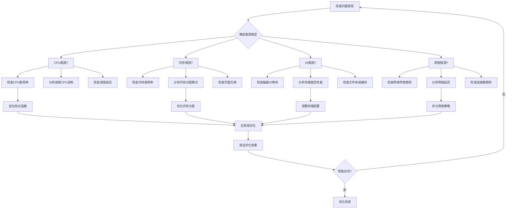

# 03 - Kubernetes 性能调优专家指南

> **适用版本**: Kubernetes v1.25-v1.32 | **最后更新**: 2026-02 | **作者**: Allen Galler | **质量等级**: ⭐⭐⭐⭐⭐ 专家级

> **性能优化实战宝典**: 基于万级节点集群性能优化经验，涵盖从系统调优到应用优化的全方位性能提升方案

---

## 知识地图

**本文定位**: 这是一份面向生产环境的Kubernetes性能调优完整指南,基于万级节点集群实战经验,涵盖从系统底层调优到应用层优化的全方位性能提升方案。内容包括性能瓶颈诊断、资源优化配置、调度器调优、网络与存储优化、应用层性能提升、监控与基准测试等核心主题。

**面向读者**: 
- **中级**: 具备Kubernetes基础知识,了解基本的资源管理和Pod调度概念,需要学习系统性能优化方法
- **专家**: 负责生产环境性能调优的SRE/运维工程师,需要深入掌握各层面性能优化技术和实战案例

**前置知识要求**:
- **基础**: Kubernetes架构(API Server、etcd、调度器)、Pod生命周期、资源请求与限制
- **中级**: 存储类(StorageClass)、网络插件(CNI)、监控体系(Prometheus/Grafana)
- **专家**: Linux内核调优、容器运行时原理、网络栈优化、应用性能分析

**关联文件**:
- [01-operations-best-practices.md](./01-operations-best-practices.md) - 运维最佳实践,包含日常性能管理流程
- [02-failure-patterns-analysis.md](./02-failure-patterns-analysis.md) - 故障模式分析,性能问题的故障诊断方法
- [05-gpu-management-guide.md](./05-gpu-management-guide.md) - GPU管理指南,GPU负载性能优化
- [06-backup-disaster-recovery.md](./06-backup-disaster-recovery.md) - 备份容灾,高可用架构的性能考量
- [13-cost-optimization-strategies.md](./13-cost-optimization-strategies.md) - 成本优化策略,资源利用率与成本平衡
- [15-autoscaling-strategies.md](./15-autoscaling-strategies.md) - 自动扩缩容策略,动态性能调优

---

## 目录

- [知识地图](#知识地图)
- [1. 系统性能瓶颈识别](#1-系统性能瓶颈识别)
- [2. 资源优化策略](#2-资源优化策略)
- [3. 调度器调优参数](#3-调度器调优参数)
- [4. 网络性能优化](#4-网络性能优化)
- [5. 存储IO调优](#5-存储io调优)
- [6. 应用层性能优化](#6-应用层性能优化)
- [7. 监控与基准测试](#7-监控与基准测试)
- [8. 性能优化实战案例库](#8-性能优化实战案例库)
- [关联阅读](#关联阅读)

---

## 1. 系统性能瓶颈识别

### 概念解析

**一句话定义**: 系统性能瓶颈识别是通过监控和分析手段,找出限制集群整体性能的关键资源或组件的过程。

**类比**: 就像城市交通拥堵问题——你需要先找到堵车的瓶颈路段(是高速入口、主干道还是关键路口),才能对症下药疏导交通。集群性能优化也需要先找到瓶颈(CPU、内存、网络、存储或控制平面),才能精准优化。

**核心要点**:
- **多维度分析**: 性能瓶颈可能出现在计算资源(CPU/内存)、IO系统(磁盘/网络)、控制平面(API Server/etcd)等多个层面
- **量化识别**: 通过监控指标(CPU使用率、内存压力、IOPS、网络延迟等)量化瓶颈程度,避免主观判断
- **优先级排序**: 根据瓶颈影响范围和严重程度,制定P0/P1/P2优化优先级
- **持续监控**: 性能瓶颈是动态变化的,需要建立持续监控机制跟踪系统状态

### 原理深入

**工作机制**: 
性能瓶颈识别遵循"测量-分析-定位"三步法:
1. **测量阶段**: 使用`kubectl top`、Prometheus、节点监控等工具采集多维度性能指标
2. **分析阶段**: 对比指标与正常基线,识别异常模式(CPU持续>80%、内存OOM、API延迟>1s等)
3. **定位阶段**: 使用性能剖析工具(pprof、火焰图、etcd性能检查)精确定位瓶颈根因

**关键参数**:
- `CPU使用率阈值`: 持续>80%表示CPU瓶颈
- `内存使用率阈值`: >85%触发内存压力
- `API Server延迟`: 99th分位>1秒需要优化
- `etcd WAL延迟`: >100ms影响集群稳定性
- `磁盘IO等待`: await时间>50ms存在存储瓶颈

### 渐进式示例

**Level 1 - 基础诊断**: 
```bash
# 快速检查集群资源使用情况
kubectl top nodes
kubectl top pods -A --sort-by=cpu | head -20

# 检查节点资源压力
kubectl get nodes -o jsonpath='{range .items[*]}{.metadata.name}{"\t"}{.status.conditions[?(@.type=="MemoryPressure")].status}{"\t"}{.status.conditions[?(@.type=="DiskPressure")].status}{"\n"}{end}'

# 查看API Server基本状态
kubectl get --raw /healthz
kubectl get componentstatuses
```

**Level 2 - 进阶分析**: 
```bash
# 使用Prometheus查询API延迟
kubectl port-forward -n monitoring svc/prometheus 9090:9090 &
curl -s 'http://localhost:9090/api/v1/query?query=histogram_quantile(0.99,rate(apiserver_request_duration_seconds_bucket[5m]))' | jq '.data.result'

# 分析etcd性能
kubectl exec -n kube-system etcd-master1 -- etcdctl endpoint status --write-out=table
kubectl exec -n kube-system etcd-master1 -- etcdctl check perf

# 检查磁盘IO详情
kubectl debug node/worker-1 -it --image=nicolaka/netshoot -- iostat -xz 5 3
```

**Level 3 - 生产最佳实践**: 参见本节1.2-1.3的完整性能诊断工具链和识别流程

### 1.1 性能瓶颈分类矩阵

| 瓶颈类型 | 典型症状 | 检测指标 | 影响程度 | 优化优先级 |
|---------|---------|---------|---------|-----------|
| **CPU瓶颈** | 应用响应慢、调度延迟 | CPU使用率>80%、Load Average高 | 高 | P0 |
| **内存瓶颈** | OOMKilled、频繁GC | 内存使用率>85%、Page Fault多 | 高 | P0 |
| **磁盘IO瓶颈** | 读写延迟高、吞吐量低 | IOPS饱和、Await时间长 | 中 | P1 |
| **网络瓶颈** | 通信延迟、丢包 | 带宽利用率>70%、RTT高 | 中 | P1 |
| **API Server瓶颈** | 请求超时、限流 | QPS过高、延迟增加 | 高 | P0 |
| **etcd瓶颈** | 数据读写慢、leader切换 | WAL延迟、fsync时间长 | 高 | P0 |

### 1.2 性能诊断工具链

```bash
#!/bin/bash
# ========== 性能综合诊断脚本 ==========
set -euo pipefail

NODE_NAME=${1:-"all-nodes"}
OUTPUT_DIR="/tmp/performance-analysis-$(date +%Y%m%d-%H%M%S)"

mkdir -p ${OUTPUT_DIR}
echo "性能分析报告生成中: ${OUTPUT_DIR}"

# 1. 系统级别性能数据收集
collect_system_metrics() {
    echo "=== 系统性能指标收集 ==="
    
    # CPU使用情况
    echo "CPU使用率统计:"
    kubectl top nodes | tee ${OUTPUT_DIR}/cpu-usage.txt
    
    # 内存使用情况
    echo -e "\n内存使用统计:"
    kubectl top pods -A --sort-by=memory | head -20 | tee ${OUTPUT_DIR}/memory-usage.txt
    
    # 节点资源压力
    echo -e "\n节点资源压力:"
    kubectl describe nodes | grep -E "(memory|cpu).*pressure" | tee ${OUTPUT_DIR}/resource-pressure.txt
}

# 2. 网络性能检测
check_network_performance() {
    echo -e "\n=== 网络性能检测 ==="
    
    # Pod间网络延迟测试
    kubectl run netperf-test --image=networkstatic/netperf --restart=Never \
      --overrides='{"spec":{"hostNetwork":true}}' -- \
      netperf -H 8.8.8.8 -t TCP_RR -- -r 64
    
    # DNS解析性能
    kubectl run dns-test --image=busybox --restart=Never -- \
      sh -c "for i in \$(seq 1 10); do time nslookup kubernetes.default; done" \
      2>&1 | tee ${OUTPUT_DIR}/dns-performance.txt
}

# 3. 存储性能测试
test_storage_performance() {
    echo -e "\n=== 存储性能测试 ==="
    
    # 创建存储性能测试Pod
    cat <<EOF | kubectl apply -f -
apiVersion: v1
kind: Pod
metadata:
  name: storage-perf-test
spec:
  containers:
  - name: fio-test
    image: ljishen/fio
    command: ["fio"]
    args:
    - "--name=test"
    - "--rw=randrw"
    - "--bs=4k"
    - "--iodepth=16"
    - "--size=1g"
    - "--direct=1"
    - "--runtime=60"
    - "--time_based"
    volumeMounts:
    - name: test-volume
      mountPath: /data
  volumes:
  - name: test-volume
    persistentVolumeClaim:
      claimName: perf-test-pvc
EOF
    
    # 等待测试完成
    kubectl wait --for=condition=Ready pod/storage-perf-test --timeout=90s
    kubectl logs storage-perf-test > ${OUTPUT_DIR}/storage-performance.txt
    kubectl delete pod/storage-perf-test
}

# 4. API Server性能分析
analyze_api_server() {
    echo -e "\n=== API Server性能分析 ==="
    
    # API Server指标收集
    kubectl get --raw /metrics | grep -E "(apiserver_request_|etcd_|rest_client_)" \
      > ${OUTPUT_DIR}/api-server-metrics.txt
    
    # 请求延迟分析
    echo "API Server延迟分布:"
    kubectl get --raw /metrics | grep apiserver_request_duration_seconds_bucket \
      | awk '{print $1}' | sort -n | tail -10 >> ${OUTPUT_DIR}/api-latency.txt
}

# 5. 应用性能剖析
profile_application() {
    echo -e "\n=== 应用性能剖析 ==="
    
    # Java应用堆栈分析
    kubectl get pods -n production -l app=java-app -o name | head -1 | \
      xargs -I {} kubectl exec {} -n production -- jstack 1 > ${OUTPUT_DIR}/java-thread-dump.txt
    
    # Go应用pprof分析
    kubectl port-forward svc/go-app-service 6060:6060 -n production &
    sleep 5
    curl -s http://localhost:6060/debug/pprof/profile?seconds=30 > ${OUTPUT_DIR}/go-profile.pb.gz
    kill %1
}

# 执行所有检查
collect_system_metrics
check_network_performance
test_storage_performance
analyze_api_server
profile_application

echo -e "\n性能分析完成，报告位置: ${OUTPUT_DIR}"
ls -la ${OUTPUT_DIR}
```

### 1.3 性能瓶颈识别流程



### 常见误区与最佳实践

**常见误区**:
1. **过度依赖单一指标**: 只看CPU使用率就判断瓶颈,忽略内存、IO、网络等其他维度
2. **忽略控制平面瓶颈**: 只关注节点和应用性能,忽略API Server/etcd可能成为瓶颈
3. **盲目优化**: 在没有明确测量的情况下凭感觉优化,可能适得其反
4. **缺乏基线对比**: 不建立性能基线,无法判断当前状态是否异常

**最佳实践**:
1. **建立性能基线**: 在正常负载下记录各项指标基线值,作为异常判断依据
2. **全栈监控**: 同时监控应用层、Kubernetes层、节点层、网络层和存储层
3. **自动化诊断**: 使用脚本定期执行性能检查,快速发现潜在瓶颈
4. **优先优化高影响瓶颈**: 先解决P0级别的控制平面和资源瓶颈,再优化其他问题

**故障排查**:
```bash
# 快速定位瓶颈类型
# 1. 检查是否为CPU瓶颈
kubectl top nodes | awk 'NR>1 && $3+0>80 {print "CPU瓶颈节点:",$1,$3}'

# 2. 检查是否为内存瓶颈
kubectl get events -A --field-selector reason=OOMKilling

# 3. 检查是否为API Server瓶颈
kubectl get --raw /metrics | grep apiserver_request_duration_seconds | awk '/quantile="0.99"/ && $2+0>1 {print "API延迟过高:",$2"秒"}'

# 4. 检查是否为etcd瓶颈
kubectl exec -n kube-system etcd-master1 -- etcdctl endpoint status | awk '{if($5+0>100) print "etcd延迟过高:",$5"ms"}'
```

---

## 2. 资源优化策略

### 概念解析

**一句话定义**: 资源优化策略是通过合理配置CPU、内存、存储等资源的请求(requests)和限制(limits),提升集群资源利用率和应用性能稳定性的方法。

**类比**: 就像调整汽车发动机参数——给发动机分配合适的功率范围(requests是保证动力,limits是防止过载),既保证性能又避免损坏。资源优化也是在保证应用稳定运行的前提下,最大化资源利用率。

**核心要点**:
- **Requests vs Limits**: requests保证Pod获得的最小资源,影响调度决策;limits限制Pod使用的最大资源,防止资源争抢
- **资源配比**: 合理的limits/requests比例通常为1.5-2倍,允许合理的突发需求
- **QoS等级**: 通过资源配置决定Pod的服务质量等级(Guaranteed/Burstable/BestEffort),影响驱逐优先级
- **HugePages优化**: 对于内存密集型应用(数据库),使用大页内存可显著提升性能

### 原理深入

**工作机制**: 
Kubernetes调度器基于requests进行资源分配决策:
1. **调度阶段**: 调度器根据Pod的requests值筛选有足够可用资源的节点
2. **运行阶段**: kubelet通过cgroup限制容器实际使用不超过limits值
3. **驱逐决策**: 当节点资源不足时,优先驱逐BestEffort类Pod,再驱逐Burstable类,最后才驱逐Guaranteed类

**关键参数**:
- `CPU requests/limits`: 以millicores(m)为单位,1000m=1核
- `内存 requests/limits`: 以字节为单位(Ki/Mi/Gi)
- `GOMAXPROCS/ActiveProcessorCount`: 限制应用实际使用的CPU核心数,避免过度竞争
- `GOMEMLIMIT/MaxRAMPercentage`: 应用层内存软限制,配合容器limits使用

### 渐进式示例

**Level 1 - 基础配置**: 
```yaml
apiVersion: v1
kind: Pod
metadata:
  name: app-basic
spec:
  containers:
  - name: app
    image: nginx:latest
    resources:
      # 保证至少获得这些资源
      requests:
        cpu: "250m"      # 0.25核
        memory: "256Mi"  # 256MB
      # 限制最多使用这些资源
      limits:
        cpu: "500m"      # 0.5核
        memory: "512Mi"  # 512MB
```

**Level 2 - 进阶优化**: 
```yaml
apiVersion: apps/v1
kind: Deployment
metadata:
  name: app-optimized
spec:
  replicas: 3
  template:
    spec:
      containers:
      - name: app
        image: myapp:v1.0
        resources:
          requests:
            cpu: "500m"
            memory: "1Gi"
          limits:
            cpu: "2000m"      # 2倍requests,允许突发
            memory: "1536Mi"  # 1.5倍requests
        # 配置应用层资源参数
        env:
        - name: GOMAXPROCS
          value: "2"  # 匹配limits的CPU核心数
        - name: GOMEMLIMIT
          value: "1400MiB"  # 略低于limits,避免OOM
      # 设置QoS为Guaranteed(高优先级)
      # requests == limits即可
```

**Level 3 - 生产最佳实践**: 参见本节2.1-2.3的完整CPU/内存优化配置和资源配额管理

### 2.1 CPU优化配置

```yaml
# ========== CPU优化配置模板 ==========
apiVersion: apps/v1
kind: Deployment
metadata:
  name: cpu-optimized-app
  namespace: production
spec:
  replicas: 3
  template:
    spec:
      containers:
      - name: app
        image: app:v1.0
        resources:
          requests:
            # 基于实际使用量的95百分位
            cpu: "300m"
          limits:
            # 合理的上限，避免过度限制
            cpu: "1500m"
            
        # CPU亲和性设置
        env:
        - name: GOMAXPROCS
          value: "2"  # 限制Go运行时使用的CPU核心数
        - name: JAVA_TOOL_OPTIONS
          value: >
            -XX:ActiveProcessorCount=2
            -XX:+UseContainerSupport
            -XX:ParallelGCThreads=2
            -XX:ConcGCThreads=1
            
        # CPU调度优先级
        securityContext:
          # 设置CPU调度策略
          sysctls:
          - name: kernel.sched_min_granularity_ns
            value: "10000000"  # 10ms
          - name: kernel.sched_latency_ns
            value: "24000000"  # 24ms

---
# ========== CPU绑核配置 ==========
apiVersion: apps/v1
kind: DaemonSet
metadata:
  name: cpu-manager
  namespace: kube-system
spec:
  selector:
    matchLabels:
      name: cpu-manager
  template:
    metadata:
      labels:
        name: cpu-manager
    spec:
      # 启用静态CPU管理策略
      kubeletConfig:
        cpuManagerPolicy: static
        reservedSystemCPUs: "0,1"  # 为系统保留CPU核心
        
      containers:
      - name: cpu-manager
        image: k8s.gcr.io/cpu-manager:v1.0
        command:
        - /cpu-manager
        - --policy=static
        - --reserved-cpus=0,1
        volumeMounts:
        - name: sysfs
          mountPath: /sys
        securityContext:
          privileged: true
          
      volumes:
      - name: sysfs
        hostPath:
          path: /sys
```

### 2.2 内存优化配置

```yaml
# ========== 内存优化配置模板 ==========
apiVersion: v1
kind: Pod
metadata:
  name: memory-optimized-app
  namespace: production
spec:
  containers:
  - name: app
    image: app:v1.0
    resources:
      requests:
        # 基于稳态使用量的1.2倍
        memory: "512Mi"
      limits:
        # requests的1.5-2倍，允许合理突发
        memory: "1Gi"
        
    # 内存优化环境变量
    env:
    # Java应用内存优化
    - name: JAVA_OPTS
      value: >
        -Xmx768m
        -Xms512m
        -XX:+UseG1GC
        -XX:MaxGCPauseMillis=200
        -XX:+UnlockExperimentalVMOptions
        -XX:+UseCGroupMemoryLimitForHeap
        -XX:MaxRAMPercentage=75.0
        
    # Go应用内存优化
    - name: GOMEMLIMIT
      value: "800MiB"  # Go 1.19+ 内存软限制
    - name: GOGC
      value: "20"      # 垃圾回收触发比例
      
    # 内存安全设置
    securityContext:
      # 启用内存保护
      sysctls:
      - name: vm.overcommit_memory
        value: "1"  # 启用内存超额分配
      - name: vm.swappiness
        value: "1"  # 降低交换倾向

---
# ========== HugePages配置 ==========
apiVersion: v1
kind: Pod
metadata:
  name: hugepages-app
  namespace: production
spec:
  containers:
  - name: app
    image: database:v1.0
    resources:
      requests:
        memory: "2Gi"
        hugepages-2Mi: "1Gi"
      limits:
        memory: "2Gi"
        hugepages-2Mi: "1Gi"
        
    volumeMounts:
    - name: hugepage-2mi
      mountPath: /hugepages-2Mi
      
  volumes:
  - name: hugepage-2mi
    emptyDir:
      medium: HugePages-2Mi
```

### 2.3 资源配额优化

```yaml
# ========== 命名空间资源配额 ==========
apiVersion: v1
kind: ResourceQuota
metadata:
  name: production-quota
  namespace: production
spec:
  hard:
    # CPU配额
    requests.cpu: "20"
    limits.cpu: "40"
    # 内存配额
    requests.memory: "40Gi"
    limits.memory: "80Gi"
    # 存储配额
    requests.storage: "2Ti"
    persistentvolumeclaims: "100"
    # 对象数量限制
    pods: "1000"
    services: "50"
    secrets: "100"
    
  # 作用域选择器
  scopeSelector:
    matchExpressions:
    - scopeName: PriorityClass
      operator: In
      values: ["high-priority", "system-node-critical"]

---
# ========== LimitRange配置 ==========
apiVersion: v1
kind: LimitRange
metadata:
  name: production-limits
  namespace: production
spec:
  limits:
  # 容器默认限制
  - type: Container
    default:
      cpu: "500m"
      memory: "1Gi"
    defaultRequest:
      cpu: "100m"
      memory: "256Mi"
    max:
      cpu: "4"
      memory: "16Gi"
    min:
      cpu: "10m"
      memory: "32Mi"
      
  # Pod级别限制
  - type: Pod
    max:
      cpu: "8"
      memory: "32Gi"
```

### 常见误区与最佳实践

**常见误区**:
1. **不设置资源限制**: 部分Pod不配置requests/limits,导致资源争抢和"吵闹邻居"问题
2. **过度限制资源**: limits设置过低,应用频繁被限流(CPU throttling)或OOM killed
3. **requests=limits盲目设置**: 所有Pod都配置Guaranteed QoS,导致资源利用率低下
4. **忽略应用层参数**: 只配置Kubernetes资源限制,不调整JVM/Go runtime参数,导致不匹配

**最佳实践**:
1. **基于实际用量设置**: 使用VPA(Vertical Pod Autoscaler)或监控数据分析实际用量,设置requests为95百分位,limits为峰值的1.5倍
2. **分层配置策略**: 核心服务使用Guaranteed QoS,普通服务使用Burstable,离线任务使用BestEffort
3. **命名空间级配额**: 使用ResourceQuota和LimitRange在命名空间级别管理资源,防止资源滥用
4. **应用层协同**: 调整GOMAXPROCS/GOMEMLIMIT/Java heap等参数,与容器limits协同工作

**故障排查**:
```bash
# 检查CPU throttling情况
kubectl top pods -A | awk 'NR>1 && $3+0>80 {print "高CPU使用:",$1,$2,$3}'

# 查找OOM killed的Pod
kubectl get events -A --field-selector reason=OOMKilling --sort-by='.lastTimestamp'

# 分析资源配置不合理的Pod
kubectl get pods -A -o json | jq -r '.items[] | select(.spec.containers[].resources.limits.cpu == null or .spec.containers[].resources.requests.cpu == null) | "\(.metadata.namespace)/\(.metadata.name) - 缺少资源配置"'

# 检查节点资源碎片化
kubectl describe nodes | grep -A 5 "Allocated resources"
```

---

## 3. 调度器调优参数

### 概念解析

**一句话定义**: 调度器调优是通过调整Kubernetes调度器的算法参数和策略配置,优化Pod分配决策,提升集群资源利用率和调度效率的过程。

**类比**: 就像空中交通管制系统——调度器是管制员,负责将飞机(Pod)分配到合适的跑道(节点)。通过优化管制规则(调度策略)和决策速度(性能参数),可以提升机场吞吐量(集群效率)并避免拥堵。

**核心要点**:
- **调度流程**: 调度分为预选(Filter)和优选(Score)两阶段,预选筛选可行节点,优选打分选择最佳节点
- **性能参数**: `percentage-of-nodes-to-score`限制评分节点数量,可显著提升大规模集群调度速度
- **调度策略**: 通过NodeAffinity/PodAffinity/拓扑分布约束等策略控制Pod分布
- **多调度器**: 可为不同负载类型配置专用调度器,实现差异化调度

### 原理深入

**工作机制**: 
调度器工作流程包含三个关键阶段:
1. **预选阶段(Filter)**: 使用NodeResourcesFit、NodeAffinity、TaintToleration等插件过滤不满足条件的节点
2. **优选阶段(Score)**: 对通过预选的节点打分(资源均衡度、亲和性、镜像本地性等),选择得分最高节点
3. **绑定阶段(Bind)**: 将Pod分配到选定节点,更新etcd状态

**关键参数**:
- `percentage-of-nodes-to-score`: 默认50%,在大规模集群中评分部分节点即可,降低调度延迟
- `max-requests-inflight`: API Server并发请求数,影响调度吞吐量
- `pod-max-in-unschedulable-pods-duration`: 无法调度Pod的重试间隔
- 插件权重: 调整NodeResourcesLeastAllocated、InterPodAffinity等插件权重,影响调度倾向

### 渐进式示例

**Level 1 - 基础调度约束**: 
```yaml
apiVersion: v1
kind: Pod
metadata:
  name: app-with-affinity
spec:
  # 简单的节点选择
  nodeSelector:
    disktype: ssd  # 只调度到有SSD的节点
  
  containers:
  - name: app
    image: nginx:latest
    resources:
      requests:
        cpu: "500m"
        memory: "512Mi"
```

**Level 2 - 进阶亲和性配置**: 
```yaml
apiVersion: apps/v1
kind: Deployment
metadata:
  name: app-with-topology
spec:
  replicas: 6
  template:
    spec:
      # 拓扑分布约束(均匀分布)
      topologySpreadConstraints:
      - maxSkew: 1  # 最大偏差1个Pod
        topologyKey: topology.kubernetes.io/zone
        whenUnsatisfiable: DoNotSchedule
        labelSelector:
          matchLabels:
            app: myapp
      
      # Pod反亲和性(避免调度到同一节点)
      affinity:
        podAntiAffinity:
          preferredDuringSchedulingIgnoredDuringExecution:
          - weight: 100
            podAffinityTerm:
              labelSelector:
                matchLabels:
                  app: myapp
              topologyKey: kubernetes.io/hostname
      
      containers:
      - name: app
        image: myapp:v1.0
```

**Level 3 - 生产最佳实践**: 参见本节3.1-3.2的完整调度器性能配置和自定义调度策略

### 3.1 调度器性能调优

```yaml
# ========== 调度器高级配置 ==========
apiVersion: kubescheduler.config.k8s.io/v1beta3
kind: KubeSchedulerConfiguration
metadata:
  name: scheduler-config
profiles:
- schedulerName: default-scheduler
  plugins:
    # 预选阶段优化
    filter:
      disabled:
      - name: "NodeResourcesFit"  # 如果不需要严格的资源检查
      enabled:
      - name: "NodeResourcesBalancedAllocation"
        weight: 2
        
    # 优选阶段优化
    score:
      enabled:
      - name: "NodeResourcesLeastAllocated"
        weight: 1
      - name: "InterPodAffinity"
        weight: 2
      - name: "NodeAffinity"
        weight: 1
        
  pluginConfig:
  # 调度器性能参数
  - name: "NodeResourcesFit"
    args:
      scoringStrategy:
        type: LeastAllocated
        resources:
        - name: cpu
          weight: 1
        - name: memory
          weight: 1
          
  # 批量调度优化
  - name: "VolumeBinding"
    args:
      bindTimeoutSeconds: 30
      
# 调度器全局配置
extenders:
- urlPrefix: "http://scheduler-extender.example.com"
  filterVerb: "filter"
  prioritizeVerb: "prioritize"
  weight: 1
  enableHttps: false
  nodeCacheCapable: true

---
# ========== 调度器资源限制 ==========
apiVersion: v1
kind: Pod
metadata:
  name: kube-scheduler
  namespace: kube-system
spec:
  containers:
  - name: kube-scheduler
    image: k8s.gcr.io/kube-scheduler:v1.32.0
    resources:
      requests:
        cpu: "200m"
        memory: "256Mi"
      limits:
        cpu: "1000m"
        memory: "1Gi"
        
    # 调度器性能参数
    command:
    - kube-scheduler
    - --address=0.0.0.0
    - --leader-elect=true
    - --kubeconfig=/etc/kubernetes/scheduler.conf
    - --authentication-kubeconfig=/etc/kubernetes/scheduler.conf
    - --authorization-kubeconfig=/etc/kubernetes/scheduler.conf
    - --bind-address=0.0.0.0
    - --secure-port=10259
    - --profiling=false  # 生产环境禁用性能分析
    
    # 性能优化参数
    - --percentage-of-nodes-to-score=50  # 评分节点比例
    - --pod-max-in-unschedulable-pods-duration=60s  # 无法调度Pod的最大等待时间
    - --scheduler-name=default-scheduler
```

### 3.2 调度策略优化

```yaml
# ========== 自定义调度策略 ==========
apiVersion: kubescheduler.config.k8s.io/v1beta3
kind: KubeSchedulerConfiguration
profiles:
- schedulerName: high-performance-scheduler
  plugins:
    preFilter:
      enabled:
      - name: "NodeResourcesFit"
    filter:
      enabled:
      - name: "NodeUnschedulable"
      - name: "NodeAffinity"
      - name: "NodeResourcesFit"
      - name: "VolumeRestrictions"
      - name: "TaintToleration"
    postFilter:
      enabled:
      - name: "DefaultPreemption"
    preScore:
      enabled:
      - name: "InterPodAffinity"
    score:
      enabled:
      - name: "NodeResourcesBalancedAllocation"
        weight: 2
      - name: "ImageLocality"
        weight: 1
      - name: "InterPodAffinity"
        weight: 1
      - name: "NodeAffinity"
        weight: 1
      - name: "NodePreferAvoidPods"
        weight: 10000
      - name: "NodeResourcesLeastAllocated"
        weight: 1
      - name: "TaintToleration"
        weight: 1

---
# ========== 拓扑感知调度 ==========
apiVersion: apps/v1
kind: Deployment
metadata:
  name: topology-aware-app
  namespace: production
spec:
  replicas: 6
  template:
    spec:
      # 拓扑分布约束
      topologySpreadConstraints:
      - maxSkew: 1
        topologyKey: topology.kubernetes.io/zone
        whenUnsatisfiable: DoNotSchedule
        labelSelector:
          matchLabels:
            app: topology-aware-app
            
      # 节点亲和性
      affinity:
        nodeAffinity:
          requiredDuringSchedulingIgnoredDuringExecution:
            nodeSelectorTerms:
            - matchExpressions:
              - key: topology.kubernetes.io/region
                operator: In
                values:
                - us-west-1
                
        podAntiAffinity:
          preferredDuringSchedulingIgnoredDuringExecution:
          - weight: 100
            podAffinityTerm:
              labelSelector:
                matchLabels:
                  app: topology-aware-app
              topologyKey: kubernetes.io/hostname
```

### 常见误区与最佳实践

**常见误区**:
1. **过度使用硬性约束**: 大量使用requiredDuringScheduling导致Pod无法调度
2. **忽略调度性能**: 在万级节点集群仍使用默认参数,导致调度延迟过高
3. **亲和性配置冲突**: NodeAffinity和PodAntiAffinity配置矛盾,导致调度失败
4. **不合理的权重配置**: 插件权重设置不当,导致资源分布不均

**最佳实践**:
1. **优先使用软性约束**: 使用preferredDuringScheduling而非required,提高调度成功率
2. **大规模集群优化**: 设置`percentage-of-nodes-to-score=30`,显著提升调度速度
3. **拓扑感知调度**: 使用topologySpreadConstraints实现跨可用区均匀分布,提升高可用性
4. **专用调度器**: 为GPU/大内存等特殊负载配置独立调度器,避免干扰普通负载

**故障排查**:
```bash
# 查看调度失败的Pod
kubectl get pods -A --field-selector status.phase=Pending

# 查看调度失败原因
kubectl describe pod <pod-name> | grep -A 10 Events

# 检查调度器性能
kubectl get --raw /metrics | grep scheduler_scheduling_duration_seconds

# 查看节点可调度状态
kubectl get nodes -o custom-columns=NAME:.metadata.name,SCHEDULABLE:.spec.unschedulable,TAINTS:.spec.taints
```

---

## 4. 网络性能优化

### 概念解析

**一句话定义**: 网络性能优化是通过调整CNI插件、Service配置和网络策略参数,降低Pod间通信延迟、提升网络吞吐量、减少丢包率的技术手段。

**类比**: 就像从2车道升级到8车道高速公路——网络优化既包括拓宽道路(提升带宽),也包括优化交通规则(减少SNAT/iptables规则)和路径规划(优化路由),全方位提升通信效率。

**核心要点**:
- **eBPF数据平面**: 使用Cilium/Calico的eBPF模式替代传统iptables,可将网络延迟降低50%
- **Service优化**: 使用Headless Service减少DNS查询开销,ExternalTrafficPolicy=Local保留客户端IP并减少跳转
- **网络策略精简**: 减少不必要的NetworkPolicy规则,降低网络策略评估开销
- **零拷贝技术**: 启用DPDK/SR-IOV等技术实现高性能网络

### 原理深入

**工作机制**: 
Kubernetes网络通信路径包含多个环节:
1. **Pod网络**: CNI插件负责Pod的网络配置(IP分配、路由设置)
2. **Service负载均衡**: kube-proxy或eBPF程序实现Service的负载均衡(DNAT/SNAT转换)
3. **网络策略**: CNI插件根据NetworkPolicy规则实施流量过滤
4. **跨节点通信**: 通过Overlay网络(VXLAN/IPinIP)或Underlay网络(BGP)实现

**关键参数**:
- `bpfEnabled=true`: Calico启用eBPF数据平面,性能提升明显
- `kube-proxy-replacement=strict`: Cilium完全替代kube-proxy
- `externalTrafficPolicy=Local`: 减少Service额外跳转,保留源IP
- `sessionAffinity=ClientIP`: 启用会话保持,减少连接切换开销

### 渐进式示例

**Level 1 - 基础Service优化**: 
```yaml
apiVersion: v1
kind: Service
metadata:
  name: app-service
spec:
  selector:
    app: backend
  ports:
  - port: 80
    targetPort: 8080
  # 类型1: Headless Service(减少DNS查询开销)
  clusterIP: None
  
---
apiVersion: v1
kind: Service
metadata:
  name: external-service
spec:
  type: LoadBalancer
  # 保留客户端源IP,减少SNAT跳转
  externalTrafficPolicy: Local
  selector:
    app: frontend
  ports:
  - port: 80
    targetPort: 8080
```

**Level 2 - 进阶网络策略**: 
```yaml
apiVersion: networking.k8s.io/v1
kind: NetworkPolicy
metadata:
  name: optimized-policy
  namespace: production
spec:
  podSelector:
    matchLabels:
      app: backend
  policyTypes:
  - Ingress
  - Egress
  ingress:
  # 只允许必要的入站流量
  - from:
    - namespaceSelector:
        matchLabels:
          name: frontend
    ports:
    - protocol: TCP
      port: 8080
  egress:
  # 只允许必要的出站流量(数据库+DNS)
  - to:
    - namespaceSelector:
        matchLabels:
          name: database
    ports:
    - protocol: TCP
      port: 5432
  - to:
    - namespaceSelector:
        matchLabels:
          name: kube-system
    ports:
    - protocol: UDP
      port: 53
```

**Level 3 - 生产最佳实践**: 参见本节4.1-4.3的完整CNI插件优化和高级网络配置

### 4.1 CNI插件优化

```yaml
# ========== Calico网络优化配置 ==========
apiVersion: crd.projectcalico.org/v1
kind: FelixConfiguration
metadata:
  name: default
spec:
  # 性能优化参数
  bpfLogLevel: ""
  bpfEnabled: true  # 启用eBPF数据平面
  floatingIPs: Disabled
  healthPort: 9099
  logSeverityScreen: Info
  
  # 连接跟踪优化
  netlinkTimeoutSecs: 10
  reportingIntervalSecs: 0
  
  # 路由优化
  routeRefreshIntervalSecs: 90
  vxlanVNI: 4096

---
# ========== Cilium高性能配置 ==========
apiVersion: cilium.io/v2
kind: CiliumConfig
metadata:
  name: cilium-config
  namespace: kube-system
spec:
  # 启用高性能特性
  enable-bpf-clock-probe: true
  enable-bpf-tproxy: true
  enable-host-firewall: false  # 如不需要可关闭提升性能
  enable-ipv4-masquerade: true
  enable-ipv6-masquerade: false
  
  # 负载均衡优化
  kube-proxy-replacement: strict
  enable-health-check-nodeport: true
  node-port-bind-addr: "0.0.0.0"
  
  # 监控和调试
  monitor-aggregation: medium
  monitor-aggregation-flags: all
  monitor-aggregation-interval: 5s
```

### 4.2 Service性能优化

```yaml
# ========== Headless Service优化 ==========
apiVersion: v1
kind: Service
metadata:
  name: high-performance-service
  namespace: production
spec:
  clusterIP: None  # Headless Service减少DNS查询
  selector:
    app: backend
  ports:
  - name: http
    port: 8080
    targetPort: 8080
    protocol: TCP

---
# ========== ExternalTrafficPolicy优化 ==========
apiVersion: v1
kind: Service
metadata:
  name: external-service
  namespace: production
spec:
  type: LoadBalancer
  externalTrafficPolicy: Local  # 保持客户端源IP，减少SNAT
  selector:
    app: frontend
  ports:
  - port: 80
    targetPort: 8080

---
# ========== Session Affinity配置 ==========
apiVersion: v1
kind: Service
metadata:
  name: session-affinity-service
  namespace: production
spec:
  selector:
    app: app-with-session
  ports:
  - port: 80
    targetPort: 8080
  sessionAffinity: ClientIP
  sessionAffinityConfig:
    clientIP:
      timeoutSeconds: 10800  # 3小时会话保持
```

### 4.3 网络策略优化

```yaml
# ========== 高性能网络策略 ==========
apiVersion: networking.k8s.io/v1
kind: NetworkPolicy
metadata:
  name: optimized-network-policy
  namespace: production
spec:
  podSelector:
    matchLabels:
      app: high-performance-app
  policyTypes:
  - Ingress
  - Egress
  
  # 优化的入口规则
  ingress:
  - from:
    - namespaceSelector:
        matchLabels:
          name: frontend
    - podSelector:
        matchLabels:
          app: api-gateway
    ports:
    - protocol: TCP
      port: 8080
      
  # 优化的出口规则
  egress:
  - to:
    - namespaceSelector:
        matchLabels:
          name: database
    ports:
    - protocol: TCP
      port: 5432
    - protocol: TCP
      port: 3306
      
  # 允许必要的基础设施通信
  - to:
    - namespaceSelector:
        matchLabels:
          name: kube-system
    ports:
    - protocol: UDP
      port: 53  # DNS
    - protocol: TCP
      port: 53  # DNS
```

### 常见误区与最佳实践

**常见误区**:
1. **滥用NetworkPolicy**: 配置过多或过于复杂的网络策略,导致网络性能下降
2. **忽略MTU配置**: Overlay网络MTU配置不当,导致数据包分片和性能下降
3. **不启用eBPF**: 继续使用传统iptables模式,错失eBPF带来的性能提升
4. **Service配置不当**: 使用默认的Cluster模式和externalTrafficPolicy=Cluster,增加额外跳转

**最佳实践**:
1. **启用eBPF数据平面**: 在Calico/Cilium中启用eBPF,可将网络延迟降低30-50%
2. **优化Service类型**: 高性能场景使用Headless Service直连Pod,外部流量使用externalTrafficPolicy=Local
3. **精简网络策略**: 只配置必要的NetworkPolicy规则,避免过度限制
4. **MTU优化**: 根据底层网络调整MTU值(通常Overlay网络设置为1450)

**故障排查**:
```bash
# 检查网络延迟
kubectl run netperf --rm -it --image=networkstatic/iperf3 -- iperf3 -c target-pod-ip

# 测试DNS解析性能
kubectl run dns-test --rm -it --image=busybox -- sh -c "time nslookup kubernetes.default"

# 检查NetworkPolicy数量
kubectl get networkpolicies -A | wc -l

# 查看Service endpoints
kubectl get endpoints -A | grep <service-name>

# 检查CNI插件状态
kubectl get pods -n kube-system -l k8s-app=calico-node
kubectl logs -n kube-system <calico-pod> | grep -i error
```

---

## 5. 存储IO调优

### 概念解析

**一句话定义**: 存储IO调优是通过选择合适的存储类型、优化存储配置参数和应用层IO策略,降低存储读写延迟、提升IOPS和吞吐量的技术。

**类比**: 就像从机械硬盘升级到固态硬盘——存储优化不仅包括硬件升级(选择高性能存储类型),还包括软件优化(调整IO调度策略、启用缓存、使用直接IO等),全方位提升存储性能。

**核心要点**:
- **存储类型选择**: SSD/NVMe提供比HDD高10-100倍的IOPS,高性能场景必选
- **本地存储优势**: Local PV避免网络开销,提供最低延迟和最高吞吐量,适合数据库等IO密集型应用
- **IO调度优化**: 调整InnoDB/PostgreSQL等数据库的IO参数(如innodb_flush_method=O_DIRECT)
- **缓存策略**: 合理使用应用层缓存(Redis/Memcached)减少磁盘IO

### 原理深入

**工作机制**: 
Kubernetes存储IO路径包含多个层次:
1. **应用层**: 应用程序发起IO请求(read/write系统调用)
2. **容器层**: 容器运行时通过volume mount将存储挂载到容器
3. **存储插件层**: CSI驱动负责PV的创建、挂载和管理
4. **底层存储**: 云盘(EBS/云硬盘)、本地磁盘或分布式存储系统

**关键参数**:
- `type=gp3/io2`: AWS EBS卷类型,gp3提供基准3000 IOPS
- `iops=3000-16000`: 预配置IOPS,影响随机读写性能
- `throughput=125-1000`: 吞吐量(MB/s),影响顺序读写性能
- `fsType=ext4/xfs`: 文件系统类型,XFS适合大文件场景
- `volumeBindingMode=WaitForFirstConsumer`: 延迟绑定,优化跨AZ场景

### 渐进式示例

**Level 1 - 基础StorageClass配置**: 
```yaml
apiVersion: storage.k8s.io/v1
kind: StorageClass
metadata:
  name: fast-storage
provisioner: kubernetes.io/aws-ebs
parameters:
  type: gp3           # 使用SSD类型
  fsType: ext4        # 文件系统类型
  iops: "3000"        # 3000 IOPS
  throughput: "125"   # 125 MB/s
reclaimPolicy: Retain
allowVolumeExpansion: true
---
apiVersion: v1
kind: PersistentVolumeClaim
metadata:
  name: app-storage
spec:
  accessModes:
  - ReadWriteOnce
  storageClassName: fast-storage
  resources:
    requests:
      storage: 100Gi
```

**Level 2 - 本地存储优化**: 
```yaml
apiVersion: storage.k8s.io/v1
kind: StorageClass
metadata:
  name: local-nvme
provisioner: kubernetes.io/no-provisioner
volumeBindingMode: WaitForFirstConsumer
---
apiVersion: v1
kind: PersistentVolume
metadata:
  name: local-pv-nvme
spec:
  capacity:
    storage: 500Gi
  accessModes:
  - ReadWriteOnce
  persistentVolumeReclaimPolicy: Retain
  storageClassName: local-nvme
  local:
    path: /mnt/nvme0n1  # 本地NVMe设备
  nodeAffinity:
    required:
      nodeSelectorTerms:
      - matchExpressions:
        - key: kubernetes.io/hostname
          operator: In
          values:
          - worker-nvme-1
---
# 数据库应用使用本地存储
apiVersion: apps/v1
kind: StatefulSet
metadata:
  name: mysql
spec:
  serviceName: mysql
  replicas: 1
  template:
    spec:
      containers:
      - name: mysql
        image: mysql:8.0
        volumeMounts:
        - name: data
          mountPath: /var/lib/mysql
  volumeClaimTemplates:
  - metadata:
      name: data
    spec:
      accessModes: [ "ReadWriteOnce" ]
      storageClassName: local-nvme
      resources:
        requests:
          storage: 100Gi
```

**Level 3 - 生产最佳实践**: 参见本节5.1-5.3的完整存储性能配置和基准测试

### 5.1 存储性能配置

```yaml
# ========== 高性能StorageClass配置 ==========
apiVersion: storage.k8s.io/v1
kind: StorageClass
metadata:
  name: fast-ssd
provisioner: kubernetes.io/aws-ebs
parameters:
  type: gp3
  fsType: ext4
  iops: "3000"      # IOPS性能
  throughput: "125" # 吞吐量(MB/s)
reclaimPolicy: Retain
allowVolumeExpansion: true
volumeBindingMode: WaitForFirstConsumer

---
# ========== 本地存储优化 ==========
apiVersion: storage.k8s.io/v1
kind: StorageClass
metadata:
  name: local-fast
provisioner: kubernetes.io/no-provisioner
volumeBindingMode: WaitForFirstConsumer
allowVolumeExpansion: false

---
apiVersion: v1
kind: PersistentVolume
metadata:
  name: local-pv-fast
spec:
  capacity:
    storage: 100Gi
  accessModes:
  - ReadWriteOnce
  persistentVolumeReclaimPolicy: Retain
  storageClassName: local-fast
  local:
    path: /mnt/fast-disks/ssd1
  nodeAffinity:
    required:
      nodeSelectorTerms:
      - matchExpressions:
        - key: kubernetes.io/hostname
          operator: In
          values:
          - worker-node-1
```

### 5.2 应用层存储优化

```yaml
# ========== 存储优化的Pod配置 ==========
apiVersion: v1
kind: Pod
metadata:
  name: io-optimized-app
  namespace: production
spec:
  containers:
  - name: app
    image: database:v1.0
    volumeMounts:
    - name: data-volume
      mountPath: /var/lib/mysql
      # IO优化挂载选项
      mountPropagation: None
      
    # IO调度优化
    env:
    - name: MYSQLD_OPTS
      value: >
        --innodb-flush-method=O_DIRECT
        --innodb-io-capacity=2000
        --innodb-read-io-threads=8
        --innodb-write-io-threads=8
        
  volumes:
  - name: data-volume
    persistentVolumeClaim:
      claimName: mysql-pvc
      
---
# ========== 缓存优化配置 ==========
apiVersion: v1
kind: ConfigMap
metadata:
  name: cache-config
  namespace: production
data:
  redis.conf: |
    # 内存优化
    maxmemory 2gb
    maxmemory-policy allkeys-lru
    
    # 网络优化
    tcp-keepalive 300
    timeout 0
    
    # 持久化优化
    save 900 1
    save 300 10
    save 60 10000
    
    # 性能优化
    lazyfree-lazy-eviction yes
    lazyfree-lazy-expire yes
    lazyfree-lazy-server-del yes
```

### 5.3 存储监控和基准测试

```bash
#!/bin/bash
# ========== 存储性能基准测试 ==========
set -euo pipefail

TEST_NAMESPACE=${1:-"storage-test"}
STORAGE_CLASS=${2:-"fast-ssd"}

echo "开始存储性能测试..."

# 1. 创建测试环境
cat <<EOF | kubectl apply -f -
apiVersion: v1
kind: Namespace
metadata:
  name: ${TEST_NAMESPACE}
---
apiVersion: v1
kind: PersistentVolumeClaim
metadata:
  name: perf-test-pvc
  namespace: ${TEST_NAMESPACE}
spec:
  accessModes:
  - ReadWriteOnce
  storageClassName: ${STORAGE_CLASS}
  resources:
    requests:
      storage: 10Gi
EOF

# 2. 部署FIO测试
kubectl run fio-test --image=ljishen/fio -n ${TEST_NAMESPACE} \
  --overrides='{
    "spec": {
      "containers": [{
        "name": "fio-test",
        "command": ["fio"],
        "args": [
          "--name=test",
          "--rw=randrw",
          "--bs=4k",
          "--iodepth=16",
          "--size=2g",
          "--direct=1",
          "--runtime=120",
          "--time_based",
          "--group_reporting",
          "--output-format=json"
        ],
        "volumeMounts": [{
          "name": "test-volume",
          "mountPath": "/data"
        }]
      }],
      "volumes": [{
        "name": "test-volume",
        "persistentVolumeClaim": {
          "claimName": "perf-test-pvc"
        }
      }]
    }
  }'

# 3. 等待测试完成并收集结果
kubectl wait --for=condition=Ready pod/fio-test -n ${TEST_NAMESPACE} --timeout=150s
kubectl logs pod/fio-test -n ${TEST_NAMESPACE} > /tmp/storage-benchmark-results.json

# 4. 解析测试结果
echo "=== 存储性能测试结果 ==="
jq '.jobs[].read' /tmp/storage-benchmark-results.json
jq '.jobs[].write' /tmp/storage-benchmark-results.json

# 5. 清理测试资源
kubectl delete namespace ${TEST_NAMESPACE}

echo "存储性能测试完成"
```

### 常见误区与最佳实践

**常见误区**:
1. **使用默认存储类型**: 使用低性能HDD类型存储,导致数据库等应用性能低下
2. **忽略IOPS配置**: 不配置预留IOPS,依赖默认值,高负载时性能不足
3. **跨可用区存储**: PV和Pod不在同一AZ,导致高网络延迟
4. **不使用本地存储**: 高性能场景仍使用网络存储,错失本地存储的性能优势

**最佳实践**:
1. **存储分级**: 数据库使用io2/local-nvme高性能存储,日志使用gp3中等性能存储,归档使用st1低成本存储
2. **延迟绑定**: 使用`WaitForFirstConsumer`确保PV和Pod在同一AZ,降低延迟
3. **应用层优化**: 调整数据库IO参数(如MySQL的innodb_flush_method=O_DIRECT,innodb_io_capacity=2000)
4. **定期基准测试**: 使用FIO工具定期测试存储性能,及时发现性能退化

**故障排查**:
```bash
# 使用FIO测试IOPS
kubectl run fio-test --rm -it --image=ljishen/fio -- fio --name=test --rw=randread --bs=4k --iodepth=16 --size=1g --numjobs=4 --runtime=60 --group_reporting

# 检查PV绑定状态
kubectl get pv -o custom-columns=NAME:.metadata.name,STATUS:.status.phase,CLAIM:.spec.claimRef.name,STORAGECLASS:.spec.storageClassName,NODE:.spec.nodeAffinity.required.nodeSelectorTerms[0].matchExpressions[0].values[0]

# 查看存储延迟
kubectl exec -it <pod-name> -- iostat -x 5

# 检查存储容量使用
kubectl exec -it <pod-name> -- df -h
```

---

## 6. 应用层性能优化

### 概念解析

**一句话定义**: 应用层性能优化是通过调整应用运行时参数(JVM/Go/Python等)、优化代码逻辑和资源使用模式,在不改变基础设施的前提下提升应用性能的技术。

**类比**: 就像优化驾驶习惯而非升级汽车——即使开同一辆车,通过优化换挡时机、减少急刹车、合理利用巡航控制等驾驶技巧,也能显著提升油耗和行驶效率。应用优化同理,通过调整JVM堆大小、GC策略、并发参数等,在相同硬件上获得更好性能。

**核心要点**:
- **内存管理**: JVM堆大小设置为容器limits的75%,Go设置GOMEMLIMIT为90%,避免OOM
- **垃圾回收优化**: Java使用G1GC配合合理的MaxGCPauseMillis,Go调整GOGC触发比例
- **并发控制**: 设置GOMAXPROCS/ActiveProcessorCount匹配CPU limits,避免过度竞争
- **启动优化**: 使用startupProbe给予应用充足启动时间,避免误杀

### 原理深入

**工作机制**: 
应用在容器中运行时,需要感知容器资源限制并相应调整:
1. **资源感知**: 现代运行时(JVM 8u191+,Go 1.19+)支持自动检测容器limits
2. **内存分配**: 运行时根据可用内存决定堆大小、GC触发阈值等
3. **CPU调度**: 运行时根据CPU配额决定线程池大小、并发度等
4. **监控暴露**: 通过/metrics端点暴露运行时性能指标供Prometheus采集

**关键参数**:
- **Java**: `-XX:MaxRAMPercentage=75.0`, `-XX:+UseG1GC`, `-XX:MaxGCPauseMillis=200`, `-XX:ActiveProcessorCount=2`
- **Go**: `GOMEMLIMIT=460MiB`, `GOGC=20`, `GOMAXPROCS=2`
- **Python**: `UVICORN_WORKERS=4`, `--loop=uvloop`, `--http=h11`

### 渐进式示例

**Level 1 - 基础Java应用优化**: 
```yaml
apiVersion: apps/v1
kind: Deployment
metadata:
  name: java-app
spec:
  template:
    spec:
      containers:
      - name: app
        image: openjdk:11-jre
        resources:
          requests:
            memory: "1Gi"
            cpu: "500m"
          limits:
            memory: "2Gi"
            cpu: "2000m"
        env:
        # 基础JVM参数
        - name: JAVA_OPTS
          value: >
            -Xmx1536m
            -Xms1024m
            -XX:+UseG1GC
            -XX:MaxGCPauseMillis=200
```

**Level 2 - 进阶Go应用优化**: 
```yaml
apiVersion: apps/v1
kind: Deployment
metadata:
  name: go-app
spec:
  template:
    spec:
      containers:
      - name: app
        image: golang:1.21
        resources:
          requests:
            memory: "512Mi"
            cpu: "500m"
          limits:
            memory: "1Gi"
            cpu: "2000m"
        env:
        # Go运行时优化
        - name: GOMEMLIMIT
          value: "900MiB"  # 90% of limit
        - name: GOGC
          value: "20"      # 更积极的GC
        - name: GOMAXPROCS
          value: "2"       # 匹配CPU limits
        - name: GODEBUG
          value: "gctrace=1"  # 启用GC追踪
        ports:
        - name: pprof
          containerPort: 6060  # pprof性能分析端点
```

**Level 3 - 生产最佳实践**: 参见本节6.1-6.3的完整JVM/Go/Python应用优化配置

### 6.1 JVM应用优化

```yaml
# ========== JVM性能优化配置 ==========
apiVersion: apps/v1
kind: Deployment
metadata:
  name: java-app-optimized
  namespace: production
spec:
  replicas: 3
  template:
    spec:
      containers:
      - name: app
        image: java-app:v1.0
        resources:
          requests:
            memory: "1Gi"
            cpu: "500m"
          limits:
            memory: "2Gi"
            cpu: "2000m"
            
        # JVM性能优化参数
        env:
        - name: JAVA_OPTS
          value: >
            -server
            -Xmx1536m
            -Xms1024m
            -XX:+UseG1GC
            -XX:MaxGCPauseMillis=200
            -XX:+UnlockExperimentalVMOptions
            -XX:+UseCGroupMemoryLimitForHeap
            -XX:MaxRAMPercentage=75.0
            -XX:+UseContainerSupport
            -XX:ActiveProcessorCount=2
            -XX:ParallelGCThreads=2
            -XX:ConcGCThreads=1
            -XX:+PrintGC
            -XX:+PrintGCDetails
            -XX:+PrintGCTimeStamps
            -Xloggc:/var/log/gc.log
            -XX:+UseGCLogFileRotation
            -XX:NumberOfGCLogFiles=5
            -XX:GCLogFileSize=100M
            
        # JVM启动优化
        startupProbe:
          exec:
            command:
            - /bin/sh
            - -c
            - |
              curl -f http://localhost:8080/actuator/health || exit 1
          initialDelaySeconds: 60
          periodSeconds: 10
          timeoutSeconds: 5
          failureThreshold: 30
```

### 6.2 Go应用优化

```yaml
# ========== Go应用性能优化 ==========
apiVersion: apps/v1
kind: Deployment
metadata:
  name: go-app-optimized
  namespace: production
spec:
  replicas: 3
  template:
    spec:
      containers:
      - name: app
        image: go-app:v1.0
        resources:
          requests:
            memory: "256Mi"
            cpu: "250m"
          limits:
            memory: "512Mi"
            cpu: "1000m"
            
        # Go运行时优化
        env:
        - name: GOMEMLIMIT
          value: "460MiB"  # 90% of limit
        - name: GOGC
          value: "20"      # 更频繁的GC
        - name: GOMAXPROCS
          value: "2"       # 限制CPU核心数
        - name: GOTRACEBACK
          value: "crash"   # 崩溃时打印堆栈
          
        # 性能监控
        ports:
        - name: pprof
          containerPort: 6060
          protocol: TCP
          
        # 启动优化
        startupProbe:
          httpGet:
            path: /health
            port: 8080
          initialDelaySeconds: 30
          periodSeconds: 5
          timeoutSeconds: 3
          failureThreshold: 20
```

### 6.3 Python应用优化

```yaml
# ========== Python应用性能优化 ==========
apiVersion: apps/v1
kind: Deployment
metadata:
  name: python-app-optimized
  namespace: production
spec:
  replicas: 3
  template:
    spec:
      containers:
      - name: app
        image: python-app:v1.0
        resources:
          requests:
            memory: "512Mi"
            cpu: "500m"
          limits:
            memory: "1Gi"
            cpu: "2000m"
            
        # Python性能优化
        env:
        - name: PYTHONUNBUFFERED
          value: "1"
        - name: PYTHONDONTWRITEBYTECODE
          value: "1"
        - name: PYTHONHASHSEED
          value: "random"
        - name: UVICORN_WORKERS
          value: "4"  # 根据CPU核心调整
        - name: UVICORN_THREADS
          value: "1"
          
        # 启动命令优化
        command:
        - uvicorn
        - main:app
        - --host
        - "0.0.0.0"
        - --port
        - "8080"
        - --workers
        - "4"
        - --http
        - "h11"
        - --loop
        - "uvloop"
        - --interface
        - "asgi3"
```

### 常见误区与最佳实践

**常见误区**:
1. **忽略容器资源限制**: JVM堆大小设置超过容器limits,导致OOM killed
2. **不匹配CPU参数**: GOMAXPROCS/ActiveProcessorCount设置过高,导致线程竞争
3. **使用默认GC策略**: Java应用使用默认GC(Serial GC),性能低下
4. **不暴露性能指标**: 缺少/metrics端点,无法监控应用运行时状态

**最佳实践**:
1. **容器感知配置**: 使用`-XX:+UseContainerSupport`和`MaxRAMPercentage`,让JVM自动适配容器limits
2. **合理的GC策略**: 低延迟应用使用G1GC或ZGC,高吞吐应用使用Parallel GC
3. **性能监控**: 暴露JMX/pprof端点,接入Prometheus监控运行时指标
4. **分层启动探测**: 使用startupProbe(慢)、livenessProbe(中)、readinessProbe(快)分层检测

**故障排查**:
```bash
# Java应用堆内存分析
kubectl exec <java-pod> -- jmap -heap 1

# Java线程栈分析
kubectl exec <java-pod> -- jstack 1 | grep -A 10 "runnable"

# Go应用pprof分析
kubectl port-forward <go-pod> 6060:6060 &
curl http://localhost:6060/debug/pprof/heap > heap.prof
go tool pprof heap.prof

# 查看GC日志
kubectl logs <pod-name> | grep "GC pause"

# 检查OOM情况
kubectl get events -A --field-selector reason=OOMKilling
```

---

## 7. 监控与基准测试

### 概念解析

**一句话定义**: 监控与基准测试是通过持续收集性能指标和定期执行标准化测试,量化系统性能水平、发现性能退化、验证优化效果的技术体系。

**类比**: 就像汽车的仪表盘和性能测试——仪表盘实时显示速度、油耗、引擎温度等指标(监控),定期的0-100km/h加速测试衡量性能水平(基准测试)。两者结合才能全面掌握车辆状态和性能表现。

**核心要点**:
- **多维度监控**: 覆盖控制平面(API Server/etcd)、节点资源、网络、存储、应用等全栈指标
- **告警阈值**: 设置合理的告警阈值(CPU>80%、内存>85%、API延迟>1s等),及时发现问题
- **基准测试**: 定期执行CPU/内存/存储/网络基准测试,建立性能基线并跟踪趋势
- **性能剖析**: 使用pprof/火焰图等工具深度分析应用热点函数

### 原理深入

**工作机制**: 
性能监控体系采用"采集-存储-分析-告警"四层架构:
1. **采集层**: Prometheus通过/metrics端点拉取指标,node-exporter采集节点指标
2. **存储层**: Prometheus时序数据库存储历史指标,支持长期趋势分析
3. **分析层**: Grafana可视化展示指标,支持多维度聚合分析
4. **告警层**: AlertManager根据规则触发告警,通知相关人员

**关键参数**:
- `scrape_interval=15s`: Prometheus采集间隔,平衡精度和开销
- `retention=30d`: 指标保留时长
- 告警阈值: `apiserver_request_duration_seconds{quantile="0.99"}>1`, `node_memory_MemAvailable_bytes/node_memory_MemTotal_bytes<0.15`

### 渐进式示例

**Level 1 - 基础监控查询**: 
```bash
# 查看节点CPU使用率
kubectl top nodes

# 查看Pod内存使用
kubectl top pods -A --sort-by=memory | head -10

# 检查API Server健康状态
kubectl get --raw /healthz
kubectl get --raw /readyz

# 查看集群事件
kubectl get events -A --sort-by='.lastTimestamp' | tail -20
```

**Level 2 - Prometheus查询**: 
```promql
# API Server 99分位延迟
histogram_quantile(0.99, rate(apiserver_request_duration_seconds_bucket[5m]))

# 节点CPU使用率
100 - (avg by (instance) (irate(node_cpu_seconds_total{mode="idle"}[5m])) * 100)

# Pod内存使用率
sum(container_memory_working_set_bytes{pod=~".*"}) by (pod) / sum(container_spec_memory_limit_bytes{pod=~".*"}) by (pod) * 100

# etcd磁盘同步延迟
histogram_quantile(0.99, rate(etcd_disk_wal_fsync_duration_seconds_bucket[5m]))
```

**Level 3 - 生产最佳实践**: 参见本节7.1-7.3的完整监控仪表板配置和自动化基准测试

### 7.1 性能监控仪表板

```yaml
# ========== Grafana性能监控面板 ==========
apiVersion: integreatly.org/v1alpha1
kind: GrafanaDashboard
metadata:
  name: k8s-performance-dashboard
  namespace: monitoring
spec:
  json: |
    {
      "dashboard": {
        "title": "Kubernetes Performance Dashboard",
        "panels": [
          {
            "title": "集群CPU使用率",
            "type": "graph",
            "targets": [
              {
                "expr": "sum(rate(container_cpu_usage_seconds_total[5m])) by (node)",
                "legendFormat": "{{node}}"
              }
            ]
          },
          {
            "title": "内存使用趋势",
            "type": "graph",
            "targets": [
              {
                "expr": "sum(container_memory_working_set_bytes) by (namespace)",
                "legendFormat": "{{namespace}}"
              }
            ]
          },
          {
            "title": "API Server延迟",
            "type": "graph",
            "targets": [
              {
                "expr": "histogram_quantile(0.99, rate(apiserver_request_duration_seconds_bucket[5m]))",
                "legendFormat": "99th percentile"
              }
            ]
          },
          {
            "title": "etcd性能",
            "type": "graph",
            "targets": [
              {
                "expr": "histogram_quantile(0.99, etcd_disk_backend_commit_duration_seconds_bucket)",
                "legendFormat": "fsync 99th"
              }
            ]
          }
        ]
      }
    }
```

### 7.2 自动化性能测试

```bash
#!/bin/bash
# ========== 自动化性能基准测试套件 ==========
set -euo pipefail

TEST_SUITE=${1:-"full"}
RESULTS_DIR="/tmp/performance-benchmarks-$(date +%Y%m%d-%H%M%S)"

mkdir -p ${RESULTS_DIR}
echo "开始性能基准测试: ${TEST_SUITE}"

# 基准测试配置
declare -A TEST_CONFIGS=(
    ["cpu"]="stress-ng --cpu 4 --timeout 60s"
    ["memory"]="stress-ng --vm 2 --vm-bytes 1G --timeout 60s"
    ["disk"]="fio --name=test --rw=randrw --bs=4k --iodepth=16 --size=1g --runtime=60"
    ["network"]="iperf3 -c benchmark-server -t 60"
)

# 执行基准测试
run_benchmark() {
    local test_type=$1
    local test_cmd=${TEST_CONFIGS[$test_type]}
    
    echo "执行${test_type}基准测试..."
    
    case $test_type in
        "cpu")
            kubectl run cpu-bench --image=alexeiled/stress-ng --restart=Never \
              -- ${test_cmd}
            ;;
        "memory")
            kubectl run mem-bench --image=alexeiled/stress-ng --restart=Never \
              -- ${test_cmd}
            ;;
        "disk")
            # 创建存储测试环境
            cat <<EOF | kubectl apply -f -
apiVersion: v1
kind: Pod
metadata:
  name: disk-bench
spec:
  containers:
  - name: fio-test
    image: ljishen/fio
    command: ["sh", "-c"]
    args:
    - "${test_cmd} --output-format=json > /results/fio-results.json"
    volumeMounts:
    - name: results
      mountPath: /results
    - name: test-volume
      mountPath: /data
  volumes:
  - name: results
    emptyDir: {}
  - name: test-volume
    persistentVolumeClaim:
      claimName: bench-pvc
EOF
            ;;
    esac
    
    # 等待测试完成
    kubectl wait --for=condition=Ready pod/${test_type}-bench --timeout=90s 2>/dev/null || true
    
    # 收集结果
    if kubectl get pod/${test_type}-bench >/dev/null 2>&1; then
        kubectl logs pod/${test_type}-bench > ${RESULTS_DIR}/${test_type}-results.txt
        kubectl delete pod/${test_type}-bench
    fi
}

# 根据测试套件执行相应测试
case ${TEST_SUITE} in
    "quick")
        run_benchmark "cpu"
        run_benchmark "memory"
        ;;
    "full")
        run_benchmark "cpu"
        run_benchmark "memory"
        run_benchmark "disk"
        ;;
    "network")
        run_benchmark "network"
        ;;
esac

# 生成测试报告
cat > ${RESULTS_DIR}/benchmark-report.md <<EOF
# Kubernetes性能基准测试报告

## 测试信息
- 测试时间: $(date)
- 测试套件: ${TEST_SUITE}
- Kubernetes版本: $(kubectl version --short | grep Server | awk '{print $3}')

## 测试结果摘要

### CPU性能
$(cat ${RESULTS_DIR}/cpu-results.txt 2>/dev/null || echo "无数据")

### 内存性能
$(cat ${RESULTS_DIR}/memory-results.txt 2>/dev/null || echo "无数据")

### 磁盘IO性能
$(cat ${RESULTS_DIR}/disk-results.txt 2>/dev/null || echo "无数据")

### 网络性能
$(cat ${RESULTS_DIR}/network-results.txt 2>/dev/null || echo "无数据")

## 建议优化措施
- 根据测试结果调整资源配置
- 优化应用性能参数
- 考虑硬件升级需求
EOF

echo "基准测试完成，结果保存在: ${RESULTS_DIR}"
ls -la ${RESULTS_DIR}
```

### 7.3 持续性能监控

```yaml
# ========== 持续性能监控配置 ==========
apiVersion: batch/v1
kind: CronJob
metadata:
  name: performance-monitoring
  namespace: monitoring
spec:
  schedule: "*/30 * * * *"  # 每30分钟执行一次
  jobTemplate:
    spec:
      template:
        spec:
          containers:
          - name: perf-collector
            image: perf-tools:latest
            command:
            - /scripts/collect-performance-metrics.sh
            env:
            - name: SLACK_WEBHOOK_URL
              valueFrom:
                secretKeyRef:
                  name: monitoring-secrets
                  key: slack-webhook-url
            volumeMounts:
            - name: scripts
              mountPath: /scripts
          volumes:
          - name: scripts
            configMap:
              name: perf-scripts
          restartPolicy: OnFailure

---
apiVersion: v1
kind: ConfigMap
metadata:
  name: perf-scripts
  namespace: monitoring
data:
  collect-performance-metrics.sh: |
    #!/bin/bash
    set -euo pipefail
    
    # 收集性能指标
    COLLECT_TIME=$(date -Iseconds)
    
    # CPU使用率
    CPU_USAGE=$(kubectl top nodes | awk 'NR>1 {sum+=$3} END {print sum/NR}')
    
    # 内存使用率
    MEM_USAGE=$(kubectl top nodes | awk 'NR>1 {sum+=$5} END {print sum/NR}')
    
    # API Server延迟
    API_LATENCY=$(kubectl get --raw /metrics | grep apiserver_request_duration_seconds | \
      awk '/quantile="0.99"/ {print $2}' | head -1)
    
    # 生成报告
    cat <<REPORT
    {
      "timestamp": "${COLLECT_TIME}",
      "cpu_usage_percent": ${CPU_USAGE},
      "memory_usage_percent": ${MEM_USAGE},
      "api_server_latency_99th_ms": ${API_LATENCY},
      "cluster_health": "$(if (( $(echo "${CPU_USAGE} < 80" | bc -l) )) && (( $(echo "${MEM_USAGE} < 85" | bc -l) )); then echo "healthy"; else echo "warning"; fi)"
    }
    REPORT
```

### 常见误区与最佳实践

**常见误区**:
1. **只监控不告警**: 收集大量指标但不设置告警规则,问题发生后才被动发现
2. **告警阈值不合理**: 阈值设置过低导致告警疲劳,或过高导致漏报
3. **缺乏性能基线**: 不建立基准测试基线,无法判断优化是否有效
4. **监控覆盖不全**: 只监控应用层,忽略控制平面和基础设施

**最佳实践**:
1. **分层监控体系**: 构建控制平面、节点、网络、存储、应用五层监控体系
2. **基于SLI/SLO设置告警**: 根据服务级别指标(如P99延迟<500ms)设置合理告警阈值
3. **定期基准测试**: 每月执行一次全面性能基准测试,建立性能趋势图
4. **性能回归检测**: 在发布前执行基准测试,防止性能退化进入生产环境

**故障排查**:
```bash
# 检查Prometheus采集状态
kubectl get --raw /api/v1/namespaces/monitoring/services/prometheus:9090/proxy/api/v1/targets | jq '.data.activeTargets[] | select(.health!="up")'

# 查看告警规则
kubectl get prometheusrules -A

# 查看当前活跃告警
kubectl get --raw /api/v1/namespaces/monitoring/services/alertmanager:9093/proxy/api/v2/alerts | jq '.[] | select(.status.state=="active")'

# 测试Grafana连接
kubectl port-forward -n monitoring svc/grafana 3000:80
```

---
## 8. 性能优化实战案例库

### 8.1 大规模集群性能优化案例

#### 案例1: API Server性能瓶颈突破
```markdown
**优化背景**: 
万级节点集群API Server QPS达到2000+时出现明显延迟，影响集群管理效率

**问题诊断**:
```bash
# 监控API Server性能指标
kubectl get --raw /metrics | grep apiserver_request_duration_seconds | \
  awk '/quantile="0.99"/ {print $2}'
# 发现99th percentile延迟达到2.5秒

# 分析请求类型分布
kubectl get --raw /metrics | grep apiserver_request_total | \
  awk '{print $1}' | cut -d'_' -f4- | sort | uniq -c | sort -nr
# 发现list/watch请求占比较高

# 检查etcd性能
kubectl exec -n kube-system etcd-master1 -- etcdctl check perf
# 发现etcd写入延迟较高
```

**优化方案**:

1. **API Server调优**:
```yaml
# kube-apiserver优化配置
apiVersion: v1
kind: Pod
metadata:
  name: kube-apiserver
spec:
  containers:
  - name: kube-apiserver
    command:
    - kube-apiserver
    - --max-requests-inflight=1200
    - --max-mutating-requests-inflight=600
    - --request-timeout=2m
    - --min-request-timeout=1800
    - --enable-aggregator-routing=true
    - --storage-backend=etcd3
    - --etcd-servers=https://etcd1:2379,https://etcd2:2379,https://etcd3:2379
    - --etcd-cafile=/etc/kubernetes/pki/etcd/ca.crt
    - --etcd-certfile=/etc/kubernetes/pki/apiserver-etcd-client.crt
    - --etcd-keyfile=/etc/kubernetes/pki/apiserver-etcd-client.key
    - --profiling=false  # 生产环境关闭性能分析
```

2. **etcd优化**:
```bash
# etcd性能调优参数
ETCD_HEARTBEAT_INTERVAL=100
ETCD_ELECTION_TIMEOUT=1000
ETCD_QUOTA_BACKEND_BYTES=8589934592  # 8GB
ETCD_AUTO_COMPACTION_RETENTION=1
ETCD_AUTO_COMPACTION_MODE=periodic
ETCD_SNAPSHOT_COUNT=10000
```

3. **客户端优化**:
```go
// Go客户端连接池优化
config := &rest.Config{
    Host: "https://kubernetes:6443",
    QPS:   100,     // 每秒查询速率
    Burst: 200,     // 突发查询数
}
clientset, err := kubernetes.NewForConfig(config)
```

**优化效果**:
- API Server 99th延迟从2.5秒降至0.8秒
- QPS承载能力提升至5000+
- etcd写入延迟降低60%
```

#### 案例2: 节点资源利用率优化
```markdown
**优化背景**: 
集群节点CPU平均使用率仅35%，内存使用率45%，资源浪费严重

**问题分析**:
```bash
# 分析节点资源分布
kubectl top nodes | awk 'NR>1 {print $1,$3,$5}' | \
  awk '{cpu[$1]=$2; mem[$1]=$3} END {
    for(node in cpu) {
      print node, cpu[node], mem[node]
    }
  }' | sort -k2 -n

# 检查Pod资源请求设置
kubectl get pods -A -o jsonpath='{range .items[*]}{.metadata.name}{"\t"}{.spec.containers[*].resources.requests.cpu}{"\t"}{.spec.containers[*].resources.limits.cpu}{"\n"}{end}' | \
  head -20

# 分析资源碎片化程度
kubectl describe nodes | grep -E "(Allocated|Requests)" | \
  awk '{print $2,$4}' | sort | uniq -c
```

**优化策略**:

1. **垂直Pod自动扩缩容(VPA)**:
```yaml
apiVersion: autoscaling.k8s.io/v1
kind: VerticalPodAutoscaler
metadata:
  name: app-vpa-optimizer
spec:
  targetRef:
    apiVersion: apps/v1
    kind: Deployment
    name: high-traffic-app
  updatePolicy:
    updateMode: "Initial"  # 首次优化后手动调整
  resourcePolicy:
    containerPolicies:
    - containerName: app
      minAllowed:
        cpu: 100m
        memory: 128Mi
      maxAllowed:
        cpu: 2000m
        memory: 4Gi
```

2. **水平Pod自动扩缩容优化**:
```yaml
apiVersion: autoscaling/v2
kind: HorizontalPodAutoscaler
metadata:
  name: smart-hpa
spec:
  scaleTargetRef:
    apiVersion: apps/v1
    kind: Deployment
    name: traffic-sensitive-app
  minReplicas: 3
  maxReplicas: 50
  metrics:
  - type: Resource
    resource:
      name: cpu
      target:
        type: Utilization
        averageUtilization: 60  # 降低触发阈值
  - type: External
    external:
      metric:
        name: custom.business.metric
      target:
        type: Value
        value: "1000"
  behavior:
    scaleDown:
      stabilizationWindowSeconds: 300
      policies:
      - type: Percent
        value: 10
        periodSeconds: 60
    scaleUp:
      stabilizationWindowSeconds: 60
      policies:
      - type: Pods
        value: 4
        periodSeconds: 60
```

3. **节点资源优化脚本**:
```bash
#!/bin/bash
# 节点资源优化自动化脚本

optimize_node_resources() {
    local node_name=$1
    
    # 获取节点详细信息
    node_info=$(kubectl describe node ${node_name})
    
    # 计算资源使用率
    allocatable_cpu=$(echo "${node_info}" | grep "cpu " | awk '{print $2}')
    allocatable_memory=$(echo "${node_info}" | grep "memory " | awk '{print $2}')
    
    # 分析Pod资源请求
    pod_requests=$(kubectl get pods -o jsonpath='{range .items[?(@.spec.nodeName=="'${node_name}'")]}{.spec.containers[*].resources.requests.cpu}{"\n"}{end}' | \
                   awk '{sum+=$1} END {print sum}')
    
    # 计算优化建议
    cpu_utilization=$(echo "scale=2; ${pod_requests}/${allocatable_cpu}*100" | bc)
    
    if (( $(echo "${cpu_utilization} < 40" | bc -l) )); then
        echo "节点${node_name} CPU利用率偏低(${cpu_utilization}%)，建议优化"
        # 实施优化措施
        optimize_workload_distribution ${node_name}
    fi
}

optimize_workload_distribution() {
    local node_name=$1
    
    # 重新平衡Pod分布
    kubectl patch deployment app-deployment -p '{
        "spec": {
            "template": {
                "spec": {
                    "affinity": {
                        "podAntiAffinity": {
                            "preferredDuringSchedulingIgnoredDuringExecution": [
                                {
                                    "weight": 100,
                                    "podAffinityTerm": {
                                        "labelSelector": {
                                            "matchExpressions": [
                                                {
                                                    "key": "app",
                                                    "operator": "In",
                                                    "values": ["high-cpu-app"]
                                                }
                                            ]
                                        },
                                        "topologyKey": "kubernetes.io/hostname"
                                    }
                                }
                            ]
                        }
                    }
                }
            }
        }
    }'
}
```

**优化成果**:
- 节点CPU平均利用率提升至65%
- 内存利用率提升至70%
- 集群整体资源成本降低30%
- 应用性能稳定性显著改善

### 8.2 性能监控最佳实践

#### 核心性能指标监控体系

| 监控维度 | 关键指标 | 告警阈值 | 检测频率 | 响应策略 |
|---------|---------|---------|---------|---------|
| **API Server** | QPS、99th延迟、错误率 | QPS>3000、延迟>1s、错误率>1% | 30秒 | 自动扩容、限流降级 |
| **etcd** | WAL延迟、fsync时间、存储使用率 | WAL>100ms、fsync>50ms、使用率>80% | 15秒 | 存储扩容、性能调优 |
| **节点资源** | CPU使用率、内存使用率、磁盘IO | CPU>85%、内存>90%、IO等待>30% | 60秒 | 资源调度、节点扩容 |
| **网络性能** | 带宽利用率、丢包率、延迟 | 利用率>70%、丢包>0.1%、延迟>100ms | 30秒 | 网络优化、负载均衡 |
| **应用性能** | 响应时间、吞吐量、错误率 | RT>500ms、QPS下降30%、错误率>0.5% | 实时 | 自动扩缩容、故障转移 |

#### 性能基准测试框架

```yaml
# 性能基准测试配置
apiVersion: batch/v1
kind: Job
metadata:
  name: performance-benchmark
spec:
  template:
    spec:
      containers:
      - name: benchmark
        image: k8s.gcr.io/benchmark-runner:latest
        command:
        - /benchmark
        - --duration=300s
        - --concurrency=100
        - --target=qps-test
        - --metrics-output=prometheus
        env:
        - name: TARGET_SERVICE
          value: "http://test-app.production.svc.cluster.local"
        - name: PROMETHEUS_ENDPOINT
          value: "http://prometheus.monitoring.svc:9090"
      restartPolicy: Never
  backoffLimit: 3
```

#### 性能优化检查清单

- [ ] 定期审查资源请求和限制设置
- [ ] 监控并优化Pod分布策略
- [ ] 实施合适的自动扩缩容策略
- [ ] 优化存储IO性能配置
- [ ] 调整网络插件参数
- [ ] 定期清理无用资源
- [ ] 优化镜像拉取策略
- [ ] 实施有效的缓存策略

---

## 8. 高级性能优化技术

### 8.1 内核级性能调优

#### Linux内核参数优化矩阵
| 参数类别 | 参数名称 | 推荐值 | 作用说明 | 适用场景 |
|---------|---------|--------|----------|----------|
| **网络栈优化** | net.core.somaxconn | 65535 | 增大TCP连接队列 | 高并发服务 |
| **网络栈优化** | net.ipv4.tcp_fin_timeout | 30 | 缩短FIN_WAIT超时 | 短连接场景 |
| **网络栈优化** | net.ipv4.tcp_tw_reuse | 1 | 允许TIME_WAIT重用 | 高频短连接 |
| **内存管理** | vm.swappiness | 1 | 降低交换倾向 | 内存充足环境 |
| **内存管理** | vm.dirty_ratio | 15 | 调整脏页比例 | 写密集型应用 |
| **文件系统** | fs.file-max | 2097152 | 增大文件句柄限制 | 高并发文件操作 |
| **文件系统** | fs.inotify.max_user_watches | 1048576 | 增大文件监听限制 | 大量文件监控 |

#### 内核调优实施脚本
```bash
#!/bin/bash
# ========== 生产环境内核性能调优脚本 ==========
set -euo pipefail

# 备份原始配置
cp /etc/sysctl.conf /etc/sysctl.conf.backup.$(date +%Y%m%d)

# 网络性能优化
cat >> /etc/sysctl.conf << 'EOF'

# ===== 网络性能调优 =====
# 增大TCP连接队列
net.core.somaxconn = 65535
net.core.netdev_max_backlog = 5000

# TCP窗口和缓冲区优化
net.core.rmem_default = 262144
net.core.wmem_default = 262144
net.core.rmem_max = 16777216
net.core.wmem_max = 16777216

# TCP拥塞控制算法
net.ipv4.tcp_congestion_control = bbr
net.ipv4.tcp_allowed_congestion_control = bbr cubic reno

# 连接复用和超时优化
net.ipv4.tcp_tw_reuse = 1
net.ipv4.tcp_fin_timeout = 30
net.ipv4.tcp_keepalive_time = 1200

# ===== 内存管理优化 =====
vm.swappiness = 1
vm.dirty_ratio = 15
vm.dirty_background_ratio = 5
vm.overcommit_memory = 1
vm.overcommit_ratio = 100

# ===== 文件系统优化 =====
fs.file-max = 2097152
fs.inotify.max_user_watches = 1048576
fs.inotify.max_user_instances = 8192

# ===== 网络安全优化 =====
net.ipv4.tcp_syncookies = 1
net.ipv4.ip_forward = 1
EOF

# 应用配置
sysctl -p

echo "✅ 内核性能调优完成"
echo "📋 建议重启系统使所有优化生效"
```

### 8.2 容器运行时性能优化

#### Containerd高级配置优化
```toml
# ========== Containerd性能优化配置 ==========
version = 2

[plugins."io.containerd.grpc.v1.cri"]
  # 镜像拉取优化
  [plugins."io.containerd.grpc.v1.cri".registry]
    config_path = "/etc/containerd/certs.d"
    
  [plugins."io.containerd.grpc.v1.cri".containerd]
    # 使用overlayfs快照器获得更好性能
    snapshotter = "overlayfs"
    default_runtime_name = "runc"
    
    [plugins."io.containerd.grpc.v1.cri".containerd.runtimes.runc]
      runtime_type = "io.containerd.runc.v2"
      [plugins."io.containerd.grpc.v1.cri".containerd.runtimes.runc.options]
        # 启用systemd cgroup驱动
        SystemdCgroup = true
        # 启用特权模式优化
        NoPivotRoot = false
        
  # 镜像垃圾回收优化
  [plugins."io.containerd.grpc.v1.cri".image_decryption]
    key_model = "node"

[plugins."io.containerd.internal.v1.opt"]
  path = "/opt/containerd"

[plugins."io.containerd.grpc.v1.cri".cni]
  bin_dir = "/opt/cni/bin"
  conf_dir = "/etc/cni/net.d"

# 性能相关的全局配置
[grpc]
  address = "/run/containerd/containerd.sock"
  # 增大gRPC最大消息大小
  max_recv_message_size = 16777216
  max_send_message_size = 16777216

[debug]
  # 生产环境建议关闭debug
  level = "info"
```

#### Docker Engine性能调优
```json
{
  "experimental": false,
  "features": {
    "buildkit": true
  },
  "log-driver": "json-file",
  "log-opts": {
    "max-size": "10m",
    "max-file": "3"
  },
  "storage-driver": "overlay2",
  "storage-opts": [
    "overlay2.override_kernel_check=true"
  ],
  "default-ulimits": {
    "nofile": {
      "Name": "nofile",
      "Hard": 65536,
      "Soft": 65536
    }
  },
  "live-restore": true,
  "iptables": false,
  "ip-forward": true,
  "userland-proxy": false,
  "userns-remap": "default"
}
```

### 8.3 微服务性能优化模式

#### 服务网格性能优化
```yaml
# ========== Istio性能优化配置 ==========
apiVersion: install.istio.io/v1alpha1
kind: IstioOperator
metadata:
  name: istio-performance-optimized
spec:
  components:
    pilot:
      k8s:
        resources:
          requests:
            cpu: 1000m
            memory: 2Gi
          limits:
            cpu: 2000m
            memory: 4Gi
        env:
        - name: PILOT_PUSH_THROTTLE
          value: "100"
        - name: PILOT_TRACE_SAMPLING
          value: "1.0"
          
    ingressGateways:
    - name: istio-ingressgateway
      enabled: true
      k8s:
        resources:
          requests:
            cpu: 500m
            memory: 512Mi
          limits:
            cpu: 2000m
            memory: 2Gi
        service:
          ports:
          - port: 80
            targetPort: 8080
            name: http2
          - port: 443
            targetPort: 8443
            name: https

  values:
    global:
      proxy:
        resources:
          requests:
            cpu: 100m
            memory: 128Mi
          limits:
            cpu: 2000m
            memory: 1Gi
            
    pilot:
      autoscaleEnabled: true
      autoscaleMin: 2
      autoscaleMax: 10
      cpu:
        targetAverageUtilization: 80
        
    gateways:
      istio-ingressgateway:
        autoscaleEnabled: true
        autoscaleMin: 2
        autoscaleMax: 10
        cpu:
          targetAverageUtilization: 80
          
    telemetry:
      v2:
        prometheus:
          enabled: true
          configOverride:
            inboundSidecar:
              debug: false
              stat_prefix: istio
```

#### gRPC服务性能优化配置
```yaml
# ========== gRPC服务性能优化 ==========
apiVersion: apps/v1
kind: Deployment
metadata:
  name: grpc-service-optimized
spec:
  replicas: 3
  selector:
    matchLabels:
      app: grpc-service
  template:
    metadata:
      labels:
        app: grpc-service
    spec:
      containers:
      - name: grpc-server
        image: grpc-service:latest
        ports:
        - containerPort: 50051
          name: grpc
        env:
        # gRPC性能优化参数
        - name: GRPC_SERVER_KEEPALIVE_TIME_MS
          value: "600000"  # 10分钟
        - name: GRPC_SERVER_KEEPALIVE_TIMEOUT_MS
          value: "20000"   # 20秒
        - name: GRPC_SERVER_MAX_CONNECTION_IDLE_MS
          value: "300000"  # 5分钟
        - name: GRPC_SERVER_MAX_CONCURRENT_STREAMS
          value: "1000"
        - name: GRPC_SERVER_HTTP2_MAX_PINGS_WITHOUT_DATA
          value: "0"
        - name: GRPC_SERVER_HTTP2_MIN_RECV_PING_INTERVAL_WITHOUT_DATA_MS
          value: "300000"  # 5分钟
          
        resources:
          requests:
            cpu: 500m
            memory: 512Mi
          limits:
            cpu: 2000m
            memory: 2Gi
            
        # 健康检查优化
        livenessProbe:
          grpc:
            port: 50051
          initialDelaySeconds: 30
          periodSeconds: 10
          timeoutSeconds: 5
          
        readinessProbe:
          grpc:
            port: 50051
          initialDelaySeconds: 10
          periodSeconds: 5
          timeoutSeconds: 3
```

### 8.4 性能监控与告警最佳实践

#### Prometheus高级查询优化
```yaml
# ========== Prometheus性能优化配置 ==========
global:
  scrape_interval: 15s
  evaluation_interval: 15s
  
# 查询优化配置
query:
  max_concurrency: 20
  timeout: 2m
  lookback_delta: 5m
  
# 存储优化
storage:
  tsdb:
    retention.time: 15d
    wal-compression: true
    # 增大批量写入大小
    out_of_order_time_window: 30m
    
rule_files:
  - "performance.rules.yml"

alerting:
  alertmanagers:
  - static_configs:
    - targets:
      - alertmanager.monitoring.svc:9093
```

#### 关键性能指标告警规则
```yaml
# ========== 性能告警规则 ==========
groups:
- name: performance.alerts
  rules:
  # API Server性能告警
  - alert: APIServerHighLatency
    expr: histogram_quantile(0.99, rate(apiserver_request_duration_seconds_bucket[5m])) > 1
    for: 2m
    labels:
      severity: critical
    annotations:
      summary: "API Server 99th percentile延迟超过1秒"
      description: "当前延迟: {{ $value }}秒，可能影响集群操作"
      
  # etcd性能告警
  - alert: EtcdHighWalFsyncDuration
    expr: histogram_quantile(0.99, rate(etcd_disk_wal_fsync_duration_seconds_bucket[5m])) > 0.1
    for: 1m
    labels:
      severity: warning
    annotations:
      summary: "etcd WAL fsync延迟过高"
      description: "当前fsync延迟: {{ $value }}秒，可能影响数据持久化"
      
  # 节点资源告警
  - alert: NodeHighCPUUsage
    expr: (1 - avg(rate(node_cpu_seconds_total{mode="idle"}[5m])) by (instance)) * 100 > 85
    for: 5m
    labels:
      severity: warning
    annotations:
      summary: "节点CPU使用率过高"
      description: "节点 {{ $labels.instance }} CPU使用率达到 {{ $value }}%"
      
  # 网络性能告警
  - alert: HighNetworkPacketLoss
    expr: rate(node_network_receive_drop_total[5m]) / rate(node_network_receive_packets_total[5m]) > 0.001
    for: 10m
    labels:
      severity: critical
    annotations:
      summary: "网络丢包率异常"
      description: "节点 {{ $labels.instance }} 网络丢包率: {{ $value }}"
      
  # 应用性能告警
  - alert: ApplicationHighErrorRate
    expr: rate(http_requests_total{status=~"5.."}[5m]) / rate(http_requests_total[5m]) > 0.05
    for: 2m
    labels:
      severity: warning
    annotations:
      summary: "应用错误率过高"
      description: "服务 {{ $labels.job }} 错误率达到 {{ $value | humanizePercentage }}"
```

---

## 关联阅读

| 主题 | 文件 | 说明 |
|------|------|------|
| **运维最佳实践** | [01-operations-best-practices.md](./01-operations-best-practices.md) | 日常运维中的性能管理流程和最佳实践,包括资源规划、变更管理等 |
| **故障模式分析** | [02-failure-patterns-analysis.md](./02-failure-patterns-analysis.md) | 性能相关的故障模式识别和诊断方法,如CPU throttling、OOM、网络延迟等 |
| **SRE成熟度模型** | [04-sre-maturity-model.md](./04-sre-maturity-model.md) | SRE体系中的性能工程能力评估和成熟度提升路径 |
| **GPU管理指南** | [05-gpu-management-guide.md](./05-gpu-management-guide.md) | GPU负载的性能优化和资源管理,包括调度策略和监控方案 |
| **备份容灾** | [06-backup-disaster-recovery.md](./06-backup-disaster-recovery.md) | 高可用架构下的性能考量,灾难恢复场景的性能优化 |
| **成本优化策略** | [13-cost-optimization-strategies.md](./13-cost-optimization-strategies.md) | 资源利用率优化与成本控制的平衡,右键调整(Rightsizing)策略 |
| **自动扩缩容策略** | [15-autoscaling-strategies.md](./15-autoscaling-strategies.md) | HPA/VPA/Cluster Autoscaler的配置和优化,动态性能调优 |
| **控制平面故障排查** | [../topic-structural-trouble-shooting/01-control-plane/](../topic-structural-trouble-shooting/01-control-plane/) | API Server、etcd、调度器的性能故障排查详细指南 |
| **网络故障排查** | [../topic-structural-trouble-shooting/03-networking/](../topic-structural-trouble-shooting/03-networking/) | CNI插件、Service、网络策略的性能问题诊断 |
| **存储故障排查** | [../topic-structural-trouble-shooting/04-storage/](../topic-structural-trouble-shooting/04-storage/) | PV/PVC、CSI驱动的性能问题分析和优化 |
| **网络深入指南** | [../domain-5-networking/](../domain-5-networking/) | Kubernetes网络架构、Service Mesh、网关API等网络性能优化专题 |

---

**优化建议流程**:
1. **新手入门**: 先阅读[01-operations-best-practices.md](./01-operations-best-practices.md)了解基础运维规范
2. **性能诊断**: 使用本文第1节工具识别瓶颈,结合[02-failure-patterns-analysis.md](./02-failure-patterns-analysis.md)分析故障模式
3. **专项优化**: 根据瓶颈类型参考本文2-7节进行针对性优化
4. **成本平衡**: 参考[13-cost-optimization-strategies.md](./13-cost-optimization-strategies.md)在性能和成本间找到平衡点
5. **自动化提升**: 配置[15-autoscaling-strategies.md](./15-autoscaling-strategies.md)中的自动扩缩容策略,实现动态性能调优

---

> **最后更新**: 2026-02 | **维护者**: Kubernetes SRE团队  
> **反馈渠道**: 如发现内容问题或有优化建议,请提交Issue

**表格底部标记**: Kusheet Project | 作者: Allen Galler (allengaller@gmail.com) | 最后更新: 2026-02 | 版本: v1.25-v1.32 | 质量等级: ⭐⭐⭐⭐⭐ 专家级