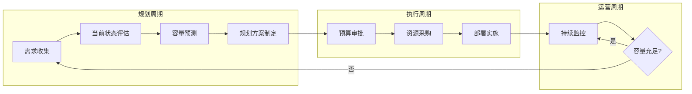

# 13 - 容量规划与资源预测

> **适用版本**: Kubernetes v1.25-v1.32 | **最后更新**: 2026-02 | **作者**: Allen Galler | **质量等级**: ⭐⭐⭐⭐⭐ 专家级

> **生产环境实战经验总结**: 基于万级节点集群容量管理经验，涵盖从资源预测到成本优化的全方位最佳实践

---

## 知识地图

| 属性 | 说明 |
|------|------|
| **文件角色** | 容量规划与资源预测 — K8s集群资源管理的完整方法论 |
| **适合读者** | 运维(资源管理) → 平台工程(容量规划) → CTO/VP(成本决策) |
| **前置知识** | 01(运维实践)、03(性能调优) |
| **关联文件** | 03(性能)、10(多云成本)、15(SLI/SLO) |

---

## 目录

- [1. 容量规划框架](#1-容量规划框架)
- [2. 资源使用分析](#2-资源使用分析)
- [3. 容量预测模型](#3-容量预测模型)
- [4. 集群扩容策略](#4-集群扩容策略)
- [5. 资源配额管理](#5-资源配额管理)
- [6. 成本优化实践](#6-成本优化实践)
- [7. 容量监控与告警](#7-容量监控与告警)
- [8. 实战案例分析](#8-实战案例分析)

---

## 1. 容量规划框架

> **🔰 初学者导读**: 容量规划就是回答"我需要多少资源"和"什么时候需要扩容"。就像城市规划师预测未来5年的用水用电需求一样——既不能浪费(过度配置)，也不能不够(影响业务)。

### 1.1 容量规划生命周期



### 1.2 容量规划维度

| 维度 | 关键指标 | 目标值 | 评估周期 | 数据来源 |
|------|----------|--------|----------|----------|
| **计算资源** | CPU 利用率、可调度容量 | 60-75% | 每周 | Prometheus、Metrics Server |
| **内存资源** | 内存利用率、OOM 频率 | 65-80% | 每周 | cAdvisor、Node Exporter |
| **存储资源** | 磁盘使用率、IOPS、带宽 | <80% | 每天 | CSI Metrics、Node Exporter |
| **网络资源** | 带宽使用率、PPS、连接数 | <70% | 每天 | CNI Metrics、Node Exporter |
| **Pod 密度** | 每节点 Pod 数、调度失败率 | <80% max-pods | 每周 | Kube-Scheduler Metrics |
| **etcd 容量** | DB 大小、请求延迟、吞吐量 | <8GB, <100ms | 每天 | etcd Metrics |

### 1.3 容量规划方法论

#### 深入理解：容量规划方法论

**容量规划的核心理念**：就像城市用水规划一样——规划部门需要根据人口增长、季节变化、工业发展预测未来的用水需求。Kubernetes 容量规划也是如此，需要预测业务增长、流量波动、资源消耗趋势。

**四大预测方法对比**：

| 方法 | 类比 | 适用场景 | 准确度 | 数据要求 |
|------|------|----------|--------|----------|
| **历史趋势分析** | 根据过去5年人口增长趋势预测未来 | 稳定增长的业务 | 70-85% | 至少6个月数据 |
| **业务驱动规划** | 根据新工厂建设计划预测工业用水 | 新业务上线、大促 | 60-75% | 业务指标 |
| **负载测试验证** | 在实验室模拟用水高峰 | 关键系统、高并发 | 85-95% | 测试环境 |
| **机器学习预测** | AI 分析复杂的用水模式 | 大规模复杂场景 | 80-90% | 至少12个月数据 |

**方法1：历史趋势分析** — 类比天气预报

就像天气预报根据过去的气象数据预测未来天气，历史趋势分析通过 Prometheus 采集过去 6-12 个月的资源使用数据，绘制趋势线，预测未来 3-6 个月的资源需求。

**关键步骤**：
1. 采集历史数据：CPU、内存、存储、网络使用量
2. 清洗异常数据：去除突发事件（如攻击、故障）导致的数据尖峰
3. 绘制趋势线：使用线性回归或多项式拟合
4. 加入安全系数：预留 20-30% buffer（就像天气预报说"可能下雨"）

**优点**：简单、快速、不需要复杂工具  
**缺点**：无法预测突发事件（如业务爆发增长、新功能上线）

---

**方法2：业务驱动规划** — 类比新工厂建设

当城市规划建设新工厂时，规划部门不会等工厂建好再考虑供水——而是提前根据工厂规模、用水强度计算需求。同理，当业务团队告诉你"下个月上线新功能，预计用户增长 3 倍"时，你需要提前计算资源需求。

**关键参数**：
- **预期用户增长**：DAU 从 100 万增长到 500 万
- **单用户资源消耗**：每用户平均消耗 0.01 核 CPU、50MB 内存
- **峰值倍数**：日均流量的 5-10 倍（如秒杀活动）
- **冗余系数**：1.3-1.5（预留 30-50% buffer）

**计算公式**：
```
总需求 = 预期用户数 × 单用户资源 × 峰值倍数 × 冗余系数
```

**实际案例**：
假设大促活动：
- 日常 DAU: 100 万
- 大促预期 DAU: 500 万
- 峰值倍数: 10x（凌晨秒杀）
- 单用户 CPU: 0.01 核
- 冗余系数: 1.5

```
峰值并发用户 = 5,000,000 × 10 / 24 = 2,083,333
所需 CPU = 2,083,333 × 0.01 × 1.5 = 31,250 核
```

**优点**：能预测计划内的大规模变化  
**缺点**：依赖业务团队的准确预测，实际用户行为可能偏差

```yaml
# 容量规划最佳实践
capacityPlanningMethods:
  
  # 方法1: 历史趋势分析
  trend-based-forecasting:
    description: "基于历史数据预测未来需求"
    适用场景: "稳定增长的业务"
    数据窗口: "至少6个月历史数据"
    预测周期: "未来3-6个月"
    准确度: "70-85%"
    工具: "Prometheus + Grafana + ML 模型"
    
  # 方法2: 业务驱动规划
  business-driven-planning:
    description: "根据业务目标反推资源需求"
    适用场景: "新业务上线、大促活动"
    输入参数:
      - "预期用户增长"
      - "单用户资源消耗"
      - "峰值倍数"
    计算公式: "总需求 = 日均用户 × 单用户资源 × 峰值倍数 × 冗余系数"
    准确度: "60-75%"
    
  # 方法3: 负载测试验证
  load-testing-validation:
    description: "通过压力测试验证容量假设"
    适用场景: "关键业务、高并发场景"
    测试工具: "K6、JMeter、Locust"
    测试维度:
      - "并发用户数"
      - "请求响应时间"
      - "资源使用率"
      - "错误率"
    准确度: "85-95%"
    
  # 方法4: 机器学习预测
  ml-based-forecasting:
    description: "使用 ML 模型预测资源需求"
    适用场景: "大规模集群、复杂业务模式"
    模型类型:
      - "时间序列预测 (ARIMA, Prophet)"
      - "回归模型 (Linear Regression)"
      - "深度学习 (LSTM)"
    训练数据: "至少12个月历史数据"
    准确度: "80-90%"
    工具: "Python + scikit-learn + TensorFlow"
```

---

## 2. 资源使用分析

> **🔰 初学者导读**: 分析当前资源使用情况是容量规划的第一步。通过Prometheus采集CPU、内存、存储、网络的使用数据，找出瓶颈和浪费点。就像"先体检再开药方"。

### 2.1 集群资源全景视图

```bash
#!/bin/bash
# cluster-capacity-report.sh - 生成集群容量报告

echo "========== Kubernetes 集群容量报告 =========="
echo "生成时间: $(date)"
echo ""

# 1. 节点总览
echo "=== 1. 节点资源总览 ==="
kubectl get nodes -o custom-columns=\
NAME:.metadata.name,\
STATUS:.status.conditions[-1].type,\
ROLE:.metadata.labels.node-role\\.kubernetes\\.io/master,\
CPU_CAPACITY:.status.capacity.cpu,\
CPU_ALLOCATABLE:.status.allocatable.cpu,\
MEM_CAPACITY:.status.capacity.memory,\
MEM_ALLOCATABLE:.status.allocatable.memory,\
PODS_CAPACITY:.status.capacity.pods

echo ""
echo "=== 2. 集群总容量汇总 ==="
kubectl get nodes -o json | jq -r '
.items | 
"总节点数: " + (length | tostring) + "\n" +
"总 CPU 核心数: " + ([.[].status.capacity.cpu | tonumber] | add | tostring) + "\n" +
"可分配 CPU: " + ([.[].status.allocatable.cpu | tonumber] | add | tostring) + "\n" +
"总内存 (GB): " + ([.[].status.capacity.memory | rtrimstr("Ki") | tonumber] | add / 1024 / 1024 | tostring) + "\n" +
"可分配内存 (GB): " + ([.[].status.allocatable.memory | rtrimstr("Ki") | tonumber] | add / 1024 / 1024 | tostring)
'

echo ""
echo "=== 3. 命名空间资源使用 TOP 10 ==="
kubectl get pods --all-namespaces -o json | jq -r '
.items | 
group_by(.metadata.namespace) | 
map({
  namespace: .[0].metadata.namespace,
  pod_count: length,
  cpu_requests: [.[].spec.containers[].resources.requests.cpu // "0" | gsub("m"; "") | tonumber] | add,
  mem_requests: [.[].spec.containers[].resources.requests.memory // "0" | gsub("Mi"; "") | tonumber] | add
}) | 
sort_by(.cpu_requests) | 
reverse | 
.[:10] | 
.[] | 
"\(.namespace)\t\(.pod_count)\t\(.cpu_requests)m\t\(.mem_requests)Mi"
' | column -t -s $'\t' -N "命名空间,Pod数,CPU请求,内存请求"

echo ""
echo "=== 4. 资源利用率（实时） ==="
kubectl top nodes | awk 'NR==1 {print; next} {
  cpu_pct=$3; mem_pct=$5;
  gsub("%", "", cpu_pct); gsub("%", "", mem_pct);
  total_cpu += cpu_pct; total_mem += mem_pct; count++
}
END {
  print "平均 CPU 利用率:", total_cpu/count "%"
  print "平均内存利用率:", total_mem/count "%"
}'

echo ""
echo "=== 5. 不可调度节点检查 ==="
kubectl get nodes -o json | jq -r '
.items[] | 
select(.spec.unschedulable == true or 
       (.status.conditions[] | select(.type == "Ready" and .status != "True"))) |
.metadata.name
' | while read node; do
  echo "⚠️  节点 $node 不可调度"
done

echo ""
echo "=== 6. 资源碎片化分析 ==="
kubectl describe nodes | awk '
/^Name:/ {node=$2}
/cpu.*requests/ {
  split($0, a, /[()]/);
  cpu_allocated=a[2];
  gsub("%", "", cpu_allocated);
}
/memory.*requests/ {
  split($0, a, /[()]/);
  mem_allocated=a[2];
  gsub("%", "", mem_allocated);
  if (cpu_allocated < 50 && mem_allocated < 50) {
    print node ": CPU=" cpu_allocated "%, MEM=" mem_allocated "% (低利用率)"
  }
}'
```

### 2.2 资源使用趋势分析

```promql
# Prometheus 查询 - 资源使用趋势

## 1. CPU 使用率趋势（过去7天）
avg(rate(container_cpu_usage_seconds_total[5m])) by (namespace)

## 2. 内存使用趋势（过去7天）
avg(container_memory_working_set_bytes) by (namespace) / 1024 / 1024 / 1024

## 3. Pod 数量增长趋势
count(kube_pod_info) by (namespace)

## 4. 节点 CPU 可调度容量剩余
sum(kube_node_status_allocatable{resource="cpu"}) - 
sum(kube_pod_container_resource_requests{resource="cpu"})

## 5. 内存可调度容量剩余 (GB)
(sum(kube_node_status_allocatable{resource="memory"}) - 
 sum(kube_pod_container_resource_requests{resource="memory"})) / 1024 / 1024 / 1024

## 6. 存储使用率
(node_filesystem_size_bytes{mountpoint="/"} - 
 node_filesystem_avail_bytes{mountpoint="/"}) / 
 node_filesystem_size_bytes{mountpoint="/"} * 100

## 7. 网络带宽使用
rate(node_network_receive_bytes_total[5m]) / 1024 / 1024

## 8. etcd 数据库大小
etcd_mvcc_db_total_size_in_bytes / 1024 / 1024 / 1024
```

---

## 3. 容量预测模型

> **🔰 初学者导读**: 预测未来资源需求的方法有：线性回归(简单趋势)、季节性分析(周期性变化)、机器学习(复杂模式)。生产环境最常用线性回归+安全系数(如预留30%buffer)。

### 3.1 线性回归预测模型

#### 深入理解：线性回归预测 — 根据过去走势画趋势线

**什么是线性回归预测**？

就像根据过去 6 个月的股票走势预测未来价格——在图表上画一条"最佳拟合线"，延伸到未来。对于资源预测，我们根据历史的 CPU、内存使用数据，绘制趋势线，预测未来的资源需求。

**线性回归的核心假设**：
- 资源使用量随时间呈线性增长（或稳定）
- 未来的增长模式与过去一致
- 没有突发的业务变化

**适用场景**：
✅ 成熟稳定的业务（如 SaaS 产品、内部系统）  
✅ 用户增长平稳的应用  
✅ 资源使用趋势明显的集群  

❌ 不适用：新业务上线、流量波动剧烈、季节性明显的场景

---

**预测步骤详解**：

1. **数据准备**：采集过去 6-12 个月的资源使用数据
   ```python
   # 从 Prometheus 导出历史数据
   dates = pd.date_range(start='2025-08-01', end='2026-01-31', freq='D')
   cpu_usage = [100, 102, 105, 107, ...]  # 每天的 CPU 使用量（核）
   ```

2. **数据清洗**：去除异常值（如故障导致的尖峰）
   ```python
   # 去除超过平均值 3 倍标准差的异常点
   mean = np.mean(cpu_usage)
   std = np.std(cpu_usage)
   clean_data = [x for x in cpu_usage if abs(x - mean) < 3 * std]
   ```

3. **模型训练**：拟合线性回归模型
   ```python
   model = LinearRegression()
   model.fit(X=days, y=cpu_usage)  # X 是天数，y 是 CPU 使用量
   ```

4. **未来预测**：预测未来 90 天的资源需求
   ```python
   future_days = np.arange(180, 270)  # 未来 90 天
   predicted_cpu = model.predict(future_days)
   ```

5. **加入安全缓冲**：预留 25-30% buffer
   ```python
   safe_prediction = predicted_cpu * 1.25  # 加 25% 安全系数
   ```

---

**实际案例**：

假设某集群过去 6 个月的 CPU 使用数据：
- 2025-08: 100 核
- 2025-09: 110 核
- 2025-10: 120 核
- 2025-11: 130 核
- 2025-12: 140 核
- 2026-01: 150 核

线性回归模型预测：
- **增长速率**：每月 +10 核
- **3 个月后（2026-04）**：180 核
- **加 25% buffer**：225 核

**扩容决策**：
- 当前集群总容量：200 核
- 预测 3 个月后需求：225 核
- **结论**：需要在 2 个月内增加 25 核（约 4 台 8 核服务器）

---

**模型准确度评估**：

```python
# 计算 R² 分数（越接近 1 越准确）
r2_score = model.score(X, y)
print(f"模型准确度 R²: {r2_score:.2f}")

# R² 解读
# 0.90-1.00: 优秀，趋势非常明确
# 0.70-0.89: 良好，可用于预测
# 0.50-0.69: 一般，需谨慎使用
# < 0.50: 差，数据波动太大，不适合线性预测
```

**优点**：
- 简单易懂，实施快速
- 不需要复杂的数学知识
- 适合大多数稳定业务场景

**局限性**：
- 无法预测突发变化（如病毒式增长、突然掉量）
- 忽略季节性因素（如节假日流量高峰）
- 假设未来趋势与过去一致（实际可能改变）

---

#### 深入理解：季节性分析 — 节假日客流量预测

**什么是季节性分析**？

就像商场预测节假日客流量——知道每年春节、双11、黑五会有流量高峰。季节性分析识别周期性的资源使用模式，预测未来的峰谷。

**常见季节性模式**：

| 周期 | 示例场景 | 特征 |
|------|----------|------|
| **每日** | 电商网站 | 白天流量高，凌晨低 |
| **每周** | B2B SaaS | 工作日高，周末低 |
| **每月** | 金融系统 | 月初月末高（工资、账单） |
| **每年** | 电商平台 | 春节、双11、黑五高峰 |

**季节性分解**：

资源使用量 = **趋势** + **季节性** + **随机噪声**

```
例如某电商 CPU 使用量：
- 基础趋势：每月增长 5 核（业务增长）
- 每周季节性：周末 +20%（流量高峰）
- 年度季节性：双11 +300%（促销活动）
```

**Prophet 模型示例**：

Facebook Prophet 是专门处理季节性时间序列的工具，自动识别周期性模式。

```python
from prophet import Prophet

# 准备数据（Prophet 要求特定格式）
df = pd.DataFrame({
    'ds': dates,  # 时间戳
    'y': cpu_usage  # CPU 使用量
})

# 创建模型（自动识别年度、周度季节性）
model = Prophet(
    yearly_seasonality=True,  # 识别年度季节性
    weekly_seasonality=True,  # 识别周度季节性
    daily_seasonality=False   # 关闭日度季节性
)

# 训练和预测
model.fit(df)
future = model.make_future_dataframe(periods=90)  # 预测 90 天
forecast = model.predict(future)
```

**Prophet 的优势**：
- 自动识别多种季节性模式
- 处理缺失数据和异常值
- 提供置信区间（预测上下限）

**实际应用**：

假设某电商平台，Prophet 分析发现：
- **基础趋势**：每月增长 10%
- **周度季节性**：周末流量比平日高 30%
- **年度季节性**：双11 流量是平日的 5 倍

**扩容策略**：
- 日常：按基础趋势每月扩容 10%
- 每周五下午：提前扩容 30% 应对周末高峰
- 双11 前 2 周：扩容至 5 倍容量，活动后缩容

---

**季节性分析的关键价值**：

✅ **避免过度配置**：平日不需要按双11峰值配置资源  
✅ **提前准备**：在高峰来临前 1-2 周完成扩容（避免临时抱佛脚）  
✅ **成本优化**：利用云厂商 Spot 实例应对临时高峰

```python
#!/usr/bin/env python3
# capacity_forecasting.py - 资源容量预测工具

import pandas as pd
import numpy as np
from sklearn.linear_model import LinearRegression
from sklearn.model_selection import train_test_split
from datetime import datetime, timedelta
import matplotlib.pyplot as plt

class CapacityForecaster:
    """Kubernetes 集群容量预测器"""
    
    def __init__(self, metric_data):
        """
        初始化预测器
        
        Args:
            metric_data: DataFrame，包含时间戳和资源使用量
                        列: ['timestamp', 'cpu_usage', 'memory_usage', 'pod_count']
        """
        self.data = metric_data
        self.model_cpu = LinearRegression()
        self.model_memory = LinearRegression()
        
    def prepare_data(self):
        """准备训练数据"""
        # 将时间戳转换为数值（天数）
        self.data['days'] = (self.data['timestamp'] - self.data['timestamp'].min()).dt.days
        
        # 特征和目标变量
        X = self.data[['days']].values
        y_cpu = self.data['cpu_usage'].values
        y_memory = self.data['memory_usage'].values
        
        return X, y_cpu, y_memory
    
    def train(self):
        """训练预测模型"""
        X, y_cpu, y_memory = self.prepare_data()
        
        # 训练 CPU 预测模型
        self.model_cpu.fit(X, y_cpu)
        
        # 训练内存预测模型
        self.model_memory.fit(X, y_memory)
        
        print(f"CPU 模型 R² 分数: {self.model_cpu.score(X, y_cpu):.4f}")
        print(f"内存模型 R² 分数: {self.model_memory.score(X, y_memory):.4f}")
    
    def forecast(self, days_ahead=90):
        """
        预测未来资源需求
        
        Args:
            days_ahead: 预测未来多少天
            
        Returns:
            DataFrame: 预测结果
        """
        last_day = self.data['days'].max()
        future_days = np.arange(last_day + 1, last_day + days_ahead + 1).reshape(-1, 1)
        
        # 预测
        cpu_forecast = self.model_cpu.predict(future_days)
        memory_forecast = self.model_memory.predict(future_days)
        
        # 构建结果 DataFrame
        forecast_df = pd.DataFrame({
            'days_from_now': future_days.flatten() - last_day,
            'predicted_cpu_usage': cpu_forecast,
            'predicted_memory_usage': memory_forecast
        })
        
        return forecast_df
    
    def calculate_capacity_needs(self, forecast_df, cluster_cpu_total, cluster_memory_total, buffer=0.25):
        """
        计算需要扩容的资源量
        
        Args:
            forecast_df: 预测结果
            cluster_cpu_total: 当前集群总 CPU 核心数
            cluster_memory_total: 当前集群总内存 (GB)
            buffer: 安全缓冲（默认25%）
            
        Returns:
            dict: 扩容建议
        """
        # 找到预测值超过当前容量的时间点
        cpu_threshold = cluster_cpu_total * (1 - buffer)
        memory_threshold = cluster_memory_total * (1 - buffer)
        
        cpu_exceed = forecast_df[forecast_df['predicted_cpu_usage'] > cpu_threshold]
        memory_exceed = forecast_df[forecast_df['predicted_memory_usage'] > memory_threshold]
        
        result = {
            'current_capacity': {
                'cpu': cluster_cpu_total,
                'memory': cluster_memory_total
            },
            'cpu_scale_recommendation': None,
            'memory_scale_recommendation': None
        }
        
        if not cpu_exceed.empty:
            days_until_cpu_full = cpu_exceed['days_from_now'].min()
            additional_cpu_needed = cpu_exceed['predicted_cpu_usage'].max() - cpu_threshold
            result['cpu_scale_recommendation'] = {
                'days_until_full': int(days_until_cpu_full),
                'additional_cores_needed': int(np.ceil(additional_cpu_needed)),
                'recommended_action': f"在 {days_until_cpu_full} 天内增加 {int(np.ceil(additional_cpu_needed))} 核 CPU"
            }
        
        if not memory_exceed.empty:
            days_until_memory_full = memory_exceed['days_from_now'].min()
            additional_memory_needed = memory_exceed['predicted_memory_usage'].max() - memory_threshold
            result['memory_scale_recommendation'] = {
                'days_until_full': int(days_until_memory_full),
                'additional_gb_needed': int(np.ceil(additional_memory_needed)),
                'recommended_action': f"在 {days_until_memory_full} 天内增加 {int(np.ceil(additional_memory_needed))} GB 内存"
            }
        
        return result
    
    def plot_forecast(self, forecast_df, cluster_cpu_total, cluster_memory_total):
        """绘制预测图表"""
        fig, (ax1, ax2) = plt.subplots(2, 1, figsize=(12, 10))
        
        # CPU 预测
        ax1.plot(self.data['days'], self.data['cpu_usage'], label='历史 CPU 使用', marker='o')
        ax1.plot(forecast_df['days_from_now'] + self.data['days'].max(), 
                 forecast_df['predicted_cpu_usage'], 
                 label='预测 CPU 使用', linestyle='--', marker='x')
        ax1.axhline(y=cluster_cpu_total, color='r', linestyle='-', label='集群总容量')
        ax1.axhline(y=cluster_cpu_total * 0.75, color='orange', linestyle=':', label='75% 警戒线')
        ax1.set_xlabel('天数')
        ax1.set_ylabel('CPU 核心数')
        ax1.set_title('CPU 容量预测')
        ax1.legend()
        ax1.grid(True)
        
        # 内存预测
        ax2.plot(self.data['days'], self.data['memory_usage'], label='历史内存使用', marker='o')
        ax2.plot(forecast_df['days_from_now'] + self.data['days'].max(), 
                 forecast_df['predicted_memory_usage'], 
                 label='预测内存使用', linestyle='--', marker='x')
        ax2.axhline(y=cluster_memory_total, color='r', linestyle='-', label='集群总容量')
        ax2.axhline(y=cluster_memory_total * 0.75, color='orange', linestyle=':', label='75% 警戒线')
        ax2.set_xlabel('天数')
        ax2.set_ylabel('内存 (GB)')
        ax2.set_title('内存容量预测')
        ax2.legend()
        ax2.grid(True)
        
        plt.tight_layout()
        plt.savefig('capacity_forecast.png', dpi=300)
        print("预测图表已保存至 capacity_forecast.png")


# 使用示例
if __name__ == "__main__":
    # 模拟历史数据（实际使用时从 Prometheus 获取）
    dates = pd.date_range(start='2025-08-01', end='2026-01-31', freq='D')
    np.random.seed(42)
    
    data = pd.DataFrame({
        'timestamp': dates,
        'cpu_usage': np.linspace(100, 180, len(dates)) + np.random.normal(0, 10, len(dates)),
        'memory_usage': np.linspace(500, 800, len(dates)) + np.random.normal(0, 50, len(dates)),
        'pod_count': np.linspace(1000, 1500, len(dates)) + np.random.normal(0, 100, len(dates))
    })
    
    # 创建预测器
    forecaster = CapacityForecaster(data)
    forecaster.train()
    
    # 预测未来 90 天
    forecast = forecaster.forecast(days_ahead=90)
    print("\n未来 90 天预测:")
    print(forecast.head(10))
    
    # 计算扩容需求
    recommendations = forecaster.calculate_capacity_needs(
        forecast, 
        cluster_cpu_total=200, 
        cluster_memory_total=1000
    )
    
    print("\n扩容建议:")
    print(f"CPU: {recommendations['cpu_scale_recommendation']}")
    print(f"内存: {recommendations['memory_scale_recommendation']}")
    
    # 绘制图表
    forecaster.plot_forecast(forecast, 200, 1000)
```

### 3.2 时间序列预测（Prophet）

```python
#!/usr/bin/env python3
# capacity_forecasting_prophet.py - 使用 Facebook Prophet 进行容量预测

from prophet import Prophet
import pandas as pd
import matplotlib.pyplot as plt

class ProphetCapacityForecaster:
    """基于 Prophet 的容量预测器"""
    
    def __init__(self, metric_data):
        self.data = metric_data
        self.model = Prophet(
            changepoint_prior_scale=0.05,  # 控制趋势灵活性
            seasonality_prior_scale=10.0,  # 控制季节性强度
            yearly_seasonality=True,
            weekly_seasonality=True,
            daily_seasonality=False
        )
    
    def prepare_data(self, metric_column):
        """准备 Prophet 格式数据"""
        df = pd.DataFrame({
            'ds': self.data['timestamp'],
            'y': self.data[metric_column]
        })
        return df
    
    def train_and_forecast(self, metric_column, periods=90):
        """训练模型并预测"""
        df = self.prepare_data(metric_column)
        
        # 训练模型
        self.model.fit(df)
        
        # 创建未来时间框架
        future = self.model.make_future_dataframe(periods=periods)
        
        # 预测
        forecast = self.model.predict(future)
        
        return forecast
    
    def plot_components(self, forecast):
        """绘制趋势和季节性组件"""
        fig = self.model.plot_components(forecast)
        plt.savefig('prophet_components.png', dpi=300)
        print("Prophet 组件图已保存")


# 使用示例
if __name__ == "__main__":
    # 生成模拟数据
    dates = pd.date_range(start='2024-02-01', end='2026-01-31', freq='D')
    np.random.seed(42)
    
    data = pd.DataFrame({
        'timestamp': dates,
        'cpu_usage': (np.linspace(100, 180, len(dates)) + 
                      20 * np.sin(np.arange(len(dates)) * 2 * np.pi / 365) +  # 年度季节性
                      10 * np.sin(np.arange(len(dates)) * 2 * np.pi / 7) +   # 周季节性
                      np.random.normal(0, 5, len(dates)))
    })
    
    forecaster = ProphetCapacityForecaster(data)
    forecast = forecaster.train_and_forecast('cpu_usage', periods=90)
    
    print("预测结果（未来10天）:")
    print(forecast[['ds', 'yhat', 'yhat_lower', 'yhat_upper']].tail(10))
    
    forecaster.plot_components(forecast)
```

---

## 4. 集群扩容策略

> **🔰 初学者导读**: 扩容策略决定"什么时候加机器、加多少"。自动扩容(Cluster Autoscaler)根据pending Pod自动添加节点；手动扩容适合有计划的大规模扩展。关键原则：提前扩容而非等到告急。

### 4.1 水平扩容决策矩阵

#### 深入理解：Cluster Autoscaler — 自动叫出租车

**什么是 Cluster Autoscaler**？

就像在高峰时段自动叫出租车——当系统检测到有乘客（Pod）等待时，自动增加车辆（节点）；当车辆空闲太久时，自动减少车辆节省成本。

**工作原理**：

1. **扩容触发条件**：
   - 有 Pod 因资源不足处于 Pending 状态
   - 持续时间超过阈值（如 10 分钟）
   - 现有节点无法满足 Pod 的 requests 要求

2. **扩容决策**：
   - 计算需要多少节点才能调度所有 Pending Pod
   - 选择合适的节点池（如 CPU 密集型、内存密集型）
   - 调用云厂商 API 创建新节点

3. **缩容触发条件**：
   - 节点利用率持续低于 50%（可配置）
   - 节点上的 Pod 可以迁移到其他节点
   - 节点空闲超过 10 分钟（可配置）

---

**Cluster Autoscaler vs 手动扩容**：

| 对比维度 | Cluster Autoscaler | 手动扩容 |
|----------|---------------------|----------|
| **响应速度** | 10-15 分钟（检测 + 创建节点） | 提前规划，无延迟 |
| **成本效率** | 高（按需扩缩） | 可能浪费（过度配置） |
| **适用场景** | 流量波动、突发负载 | 计划内大规模扩容 |
| **风险** | 扩容不及时可能影响业务 | 预测失误导致资源浪费 |

**最佳实践**：
- **日常运维**：使用 Cluster Autoscaler 应对流量波动
- **大促活动**：提前 2 周手动扩容到预期容量，避免临时扩容延迟
- **混合策略**：保持基础容量（手动），峰值容量（自动扩容）

---

**实际案例**：

某电商平台的扩容策略：
- **日常**：
  - 基础节点：200 台（固定）
  - Cluster Autoscaler 范围：200-500 台
  - 扩容阈值：Pod Pending > 10 分钟
  
- **大促（双11）**：
  - 提前 2 周手动扩容至 800 台
  - Cluster Autoscaler 范围：800-1200 台
  - 扩容阈值：Pod Pending > 3 分钟（更激进）
  
- **活动结束后**：
  - 观察 3 天流量趋势
  - 逐步缩容至 300 台（保留缓冲）
  - 1 周后恢复至 200 台基线

---

**Cluster Autoscaler 配置关键参数**：

```yaml
# 扩容策略
scaleUpDelay: 10m          # 检测到 Pending Pod 后等待 10 分钟才扩容
                           # 避免因短暂流量尖峰而扩容
cpuThreshold: 0.75         # 节点 CPU 利用率超过 75% 触发扩容
memoryThreshold: 0.80      # 节点内存利用率超过 80% 触发扩容

# 缩容策略
scaleDownDelay: 10m        # 节点空闲 10 分钟后才考虑缩容
nodeUtilizationThreshold: 0.50  # 节点利用率低于 50% 才缩容
scaleDownUnneededTime: 10m # 确认节点"不需要"持续 10 分钟后才缩容
```

**参数调优建议**：

- **保守策略**（金融、医疗）：
  - `scaleUpDelay: 5m`（快速扩容）
  - `scaleDownDelay: 30m`（谨慎缩容）
  - `nodeUtilizationThreshold: 0.40`（保留更多缓冲）

- **激进策略**（开发测试环境）：
  - `scaleUpDelay: 15m`（容忍短暂等待）
  - `scaleDownDelay: 5m`（快速缩容节省成本）
  - `nodeUtilizationThreshold: 0.60`（更高的利用率阈值）

---

#### 深入理解：节点池管理 — 停车场分区

**什么是节点池**？

就像停车场分为"小汽车区""货车区""电动车区"——不同类型的工作负载需要不同配置的节点。节点池（Node Pool）是一组相同配置的节点集合。

**常见节点池划分**：

| 节点池 | 机型 | 用途 | 扩容策略 |
|--------|------|------|----------|
| **通用型** | 8C16G | 无状态 Web 服务 | 自动扩缩容 |
| **计算密集型** | 32C64G | 视频转码、AI 推理 | 定期评估 |
| **内存密集型** | 8C128G | 缓存、数据库 | 手动扩容 |
| **GPU** | 8C32G + A100 | AI 训练 | 按需申请 |
| **Spot 实例** | 8C16G (竞价) | 批处理、非关键任务 | 激进扩缩容 |

**节点池的核心价值**：

1. **资源隔离**：GPU 任务不会和普通任务抢资源
2. **成本优化**：普通任务用便宜的通用型，AI 任务用 GPU
3. **扩容灵活**：可以针对不同类型分别设置扩容策略

**实际案例**：

某 AI 公司的节点池设计：

```yaml
nodePools:
  # 池 1: 通用 Web 服务
  - name: general-purpose
    instanceType: c5.2xlarge  # 8C16G
    minNodes: 50
    maxNodes: 500
    autoscaling: true
    labels:
      workload: web
    taints: []
    
  # 池 2: AI 推理服务
  - name: inference
    instanceType: g4dn.xlarge  # 4C16G + T4 GPU
    minNodes: 10
    maxNodes: 100
    autoscaling: true
    labels:
      workload: inference
    taints:
      - key: nvidia.com/gpu
        value: "true"
        effect: NoSchedule
    
  # 池 3: AI 训练
  - name: training
    instanceType: p4d.24xlarge  # 96C1152G + 8x A100
    minNodes: 0
    maxNodes: 20
    autoscaling: false  # 手动申请
    labels:
      workload: training
    taints:
      - key: training
        value: "true"
        effect: NoSchedule
    
  # 池 4: Spot 实例（成本优化）
  - name: spot-batch
    instanceType: c5.2xlarge
    instanceLifecycle: spot  # 竞价实例
    minNodes: 0
    maxNodes: 200
    autoscaling: true
    labels:
      workload: batch
    taints:
      - key: spot
        value: "true"
        effect: PreferNoSchedule
```

**Pod 如何选择节点池**：

```yaml
# Web 服务 → 通用节点池
apiVersion: apps/v1
kind: Deployment
metadata:
  name: web-app
spec:
  template:
    spec:
      nodeSelector:
        workload: web  # 匹配通用节点池
      containers:
      - name: app
        resources:
          requests:
            cpu: 500m
            memory: 1Gi

---
# AI 训练任务 → GPU 节点池
apiVersion: batch/v1
kind: Job
metadata:
  name: training-job
spec:
  template:
    spec:
      nodeSelector:
        workload: training  # 匹配 GPU 节点池
      tolerations:
      - key: training
        operator: Equal
        value: "true"
        effect: NoSchedule
      containers:
      - name: trainer
        resources:
          requests:
            nvidia.com/gpu: 8  # 请求 8 个 GPU
```

**节点池管理最佳实践**：

1. **按工作负载类型分池**：不要把所有任务混在一个池里
2. **设置合理的 taints**：防止错误调度（如普通任务调度到 GPU 节点）
3. **成本优化**：
   - 批处理任务用 Spot 实例（节省 60-90% 成本）
   - 关键任务用按需实例（保障稳定性）
4. **监控每个池的利用率**：避免某个池过载而其他池空闲

```yaml
# Cluster Autoscaler 配置
apiVersion: v1
kind: ConfigMap
metadata:
  name: cluster-autoscaler-config
  namespace: kube-system
data:
  # 扩容策略
  scale-up-config: |
    # CPU 阈值
    cpuThreshold: 0.75
    # 内存阈值
    memoryThreshold: 0.80
    # 扩容延迟（避免频繁扩容）
    scaleUpDelay: 10m
    # 最小节点数
    minNodes: 10
    # 最大节点数
    maxNodes: 1000
    # 扩容步长
    scaleUpIncrement: 5
    
  # 缩容策略
  scale-down-config: |
    # 节点空闲阈值
    nodeUtilizationThreshold: 0.50
    # 缩容延迟（确保真的空闲）
    scaleDownDelay: 10m
    # 不可缩容时间窗口
    scaleDownUnneededTime: 10m
    # 缩容步长
    scaleDownDecrement: 2

---
# HPA 配置示例
apiVersion: autoscaling/v2
kind: HorizontalPodAutoscaler
metadata:
  name: app-hpa
spec:
  scaleTargetRef:
    apiVersion: apps/v1
    kind: Deployment
    name: production-app
  minReplicas: 10
  maxReplicas: 100
  metrics:
  - type: Resource
    resource:
      name: cpu
      target:
        type: Utilization
        averageUtilization: 70
  - type: Resource
    resource:
      name: memory
      target:
        type: Utilization
        averageUtilization: 75
  - type: Pods
    pods:
      metric:
        name: custom_metric_qps
      target:
        type: AverageValue
        averageValue: "1000"
  behavior:
    scaleUp:
      stabilizationWindowSeconds: 60
      policies:
      - type: Percent
        value: 50
        periodSeconds: 60
      - type: Pods
        value: 10
        periodSeconds: 60
      selectPolicy: Max
    scaleDown:
      stabilizationWindowSeconds: 300
      policies:
      - type: Percent
        value: 10
        periodSeconds: 60
      selectPolicy: Min
```

---

## 5. 资源配额管理

> **🔰 初学者导读**: ResourceQuota和LimitRange是K8s的"用电额度"——防止某个团队/应用占用过多资源影响他人。多租户环境必须配置，否则一个团队可能耗尽所有集群资源。

### 5.1 命名空间资源配额

#### 深入理解：ResourceQuota — 水电配额制度

**什么是 ResourceQuota**？

就像小区物业给每户分配用水用电额度——防止某一户过度使用导致其他住户断水断电。在 Kubernetes 多租户环境中，ResourceQuota 限制每个命名空间（团队）能使用的资源总量。

**ResourceQuota 解决的核心问题**：

❌ **没有 ResourceQuota 的混乱场景**：
- 开发团队部署了 1000 个测试 Pod，占满了整个集群
- 某个应用没设置 limits，内存泄漏耗尽了节点资源
- 新业务上线无法调度，因为资源被其他团队占用

✅ **有 ResourceQuota 的秩序**：
- 每个团队有明确的资源额度
- 超过额度的 Pod 无法创建（提前拒绝，而非事后故障）
- 资源使用公平，不会互相影响

---

**ResourceQuota 的关键配置**：

```yaml
apiVersion: v1
kind: ResourceQuota
metadata:
  name: production-quota
  namespace: production
spec:
  hard:
    # 计算资源（最核心）
    requests.cpu: "500"           # 该命名空间所有 Pod 的 CPU requests 总和不能超过 500 核
    requests.memory: "1000Gi"     # 内存 requests 总和不能超过 1000GB
    limits.cpu: "1000"            # CPU limits 总和不能超过 1000 核
    limits.memory: "2000Gi"       # 内存 limits 总和不能超过 2000GB
    
    # 对象数量（防止无限创建）
    pods: "500"                   # 最多 500 个 Pod
    services: "100"               # 最多 100 个 Service
    persistentvolumeclaims: "50"  # 最多 50 个 PVC
    
    # 存储
    requests.storage: "10Ti"      # 存储总量不能超过 10TB
```

**requests vs limits 的区别**：

| 类型 | 含义 | 影响 |
|------|------|------|
| **requests** | 保证分配的资源（预留） | 影响调度（节点是否有足够的 requests 空间） |
| **limits** | 最大可使用的资源（上限） | 影响运行时（超过 limits 会被限流或 OOM Kill） |

**为什么要同时限制 requests 和 limits**？

- **只限制 requests**：可能导致 Pod 实际使用远超 requests（如设置 requests=1 核，limits=100 核）
- **只限制 limits**：可能导致过度调度（如所有 Pod 的 requests 总和超过集群容量）
- **同时限制**：既保证调度合理，又防止运行时资源争抢

---

**实际案例**：某公司的多租户配额设计

```yaml
# 团队A（生产环境）：核心业务，分配最多资源
apiVersion: v1
kind: ResourceQuota
metadata:
  name: team-a-quota
  namespace: team-a-prod
spec:
  hard:
    requests.cpu: "500"
    requests.memory: "1000Gi"
    limits.cpu: "1000"
    limits.memory: "2000Gi"
    pods: "500"

---
# 团队B（开发环境）：分配较少资源
apiVersion: v1
kind: ResourceQuota
metadata:
  name: team-b-quota
  namespace: team-b-dev
spec:
  hard:
    requests.cpu: "100"
    requests.memory: "200Gi"
    limits.cpu: "200"
    limits.memory: "400Gi"
    pods: "100"

---
# 团队C（测试环境）：资源受限
apiVersion: v1
kind: ResourceQuota
metadata:
  name: team-c-quota
  namespace: team-c-test
spec:
  hard:
    requests.cpu: "50"
    requests.memory: "100Gi"
    limits.cpu: "100"
    limits.memory: "200Gi"
    pods: "50"
```

**配额分配原则**：
- **生产环境**：优先级最高，分配充足资源
- **预发布环境**：次优先级，分配中等资源
- **开发测试环境**：最低优先级，分配有限资源

---

#### 深入理解：LimitRange — 单品限购制度

**什么是 LimitRange**？

如果 ResourceQuota 是"每户总用电量"，那么 LimitRange 就是"单个电器的功率限制"——防止某一个 Pod 或 Container 独占资源。

**LimitRange 解决的核心问题**：

❌ **没有 LimitRange 的问题**：
- 开发者创建 Pod 时不设置 requests/limits（"忘了"或"不知道怎么设置"）
- 某个 Pod 请求 100 核 CPU，占用大量资源配额
- 资源碎片化：有的 Pod 要 10m CPU，有的要 10 核 CPU，难以调度

✅ **有 LimitRange 的好处**：
- 自动为没设置 requests/limits 的 Pod 分配默认值
- 限制单个 Pod/Container 的资源范围
- 强制最佳实践（如 CPU limits 不能超过 requests 的 10 倍）

---

**LimitRange 的关键配置**：

```yaml
apiVersion: v1
kind: LimitRange
metadata:
  name: production-limit-range
  namespace: production
spec:
  limits:
  # Container 级别限制（最常用）
  - type: Container
    default:                    # 如果 Pod 没设置 limits，自动分配这个值
      cpu: "500m"
      memory: "512Mi"
    defaultRequest:             # 如果 Pod 没设置 requests，自动分配这个值
      cpu: "100m"
      memory: "128Mi"
    max:                        # 单个 Container 的最大值
      cpu: "4"
      memory: "8Gi"
    min:                        # 单个 Container 的最小值
      cpu: "50m"
      memory: "64Mi"
    maxLimitRequestRatio:       # limits 不能超过 requests 的 N 倍
      cpu: "10"                 # CPU limits 最多是 requests 的 10 倍
      memory: "2"               # 内存 limits 最多是 requests 的 2 倍
      
  # Pod 级别限制
  - type: Pod
    max:
      cpu: "8"
      memory: "16Gi"
    min:
      cpu: "100m"
      memory: "128Mi"
```

**配置参数详解**：

| 参数 | 作用 | 示例场景 |
|------|------|----------|
| **default** | 未设置 limits 时的默认值 | 开发者"忘了"设置，自动补充 |
| **defaultRequest** | 未设置 requests 时的默认值 | 确保所有 Pod 都有 requests（可调度） |
| **max** | 单个资源的最大值 | 防止"贪心" Pod（如误写 100 核） |
| **min** | 单个资源的最小值 | 强制最低配置（如内存至少 64Mi） |
| **maxLimitRequestRatio** | limits/requests 的最大比例 | 防止过度超卖（如 requests=1m, limits=100 核） |

---

**实际案例**：某公司的 LimitRange 最佳实践

```yaml
# 生产环境：严格限制
apiVersion: v1
kind: LimitRange
metadata:
  name: prod-limits
  namespace: production
spec:
  limits:
  - type: Container
    default:
      cpu: "1"
      memory: "1Gi"
    defaultRequest:
      cpu: "250m"
      memory: "256Mi"
    max:
      cpu: "8"
      memory: "16Gi"
    min:
      cpu: "100m"
      memory: "128Mi"
    maxLimitRequestRatio:
      cpu: "4"          # limits 最多是 requests 的 4 倍
      memory: "2"       # 内存 limits 最多是 requests 的 2 倍

---
# 开发环境：宽松限制
apiVersion: v1
kind: LimitRange
metadata:
  name: dev-limits
  namespace: development
spec:
  limits:
  - type: Container
    default:
      cpu: "500m"
      memory: "512Mi"
    defaultRequest:
      cpu: "100m"
      memory: "128Mi"
    max:
      cpu: "4"
      memory: "8Gi"
    min:
      cpu: "10m"        # 允许更小的 requests（如测试小应用）
      memory: "32Mi"
    maxLimitRequestRatio:
      cpu: "10"         # 允许更大的比例（开发环境资源充足）
      memory: "4"
```

---

**ResourceQuota 和 LimitRange 的配合使用**：

| 维度 | ResourceQuota | LimitRange |
|------|---------------|------------|
| **作用范围** | 整个命名空间（总额度） | 单个 Pod/Container（单品限制） |
| **类比** | 家庭总用电量 | 单个电器功率 |
| **典型限制** | "这个命名空间最多 500 核 CPU" | "单个 Pod 最多 8 核 CPU" |
| **配合效果** | 既控制总量，又控制单个资源大小 | 防止资源配额被少数"贪心" Pod 占满 |

**最佳实践组合**：

```yaml
# 命名空间总配额：500 核 CPU
ResourceQuota: requests.cpu = 500

# 单个 Container 限制：最大 4 核 CPU
LimitRange: max.cpu = 4

# 结果：
# ✅ 最多可以运行 125 个 4 核 Pod（500/4）
# ✅ 或者 500 个 1 核 Pod
# ❌ 无法创建超过 4 核的"超级 Pod"
```

```yaml
# 生产环境资源配额模板
apiVersion: v1
kind: ResourceQuota
metadata:
  name: production-quota
  namespace: production
spec:
  hard:
    # 计算资源限制
    requests.cpu: "500"           # 总 CPU 请求
    requests.memory: "1000Gi"     # 总内存请求
    limits.cpu: "1000"            # 总 CPU 限制
    limits.memory: "2000Gi"       # 总内存限制
    
    # 对象数量限制
    pods: "500"                   # 最大 Pod 数
    services: "100"               # 最大 Service 数
    persistentvolumeclaims: "50"  # 最大 PVC 数
    configmaps: "200"             # 最大 ConfigMap 数
    secrets: "200"                # 最大 Secret 数
    
    # 存储限制
    requests.storage: "10Ti"      # 总存储请求
    
---
# LimitRange 配置
apiVersion: v1
kind: LimitRange
metadata:
  name: production-limit-range
  namespace: production
spec:
  limits:
  # Pod 级别限制
  - type: Pod
    max:
      cpu: "8"
      memory: "16Gi"
    min:
      cpu: "100m"
      memory: "128Mi"
      
  # Container 级别限制
  - type: Container
    default:
      cpu: "500m"
      memory: "512Mi"
    defaultRequest:
      cpu: "100m"
      memory: "128Mi"
    max:
      cpu: "4"
      memory: "8Gi"
    min:
      cpu: "50m"
      memory: "64Mi"
      
  # PVC 限制
  - type: PersistentVolumeClaim
    max:
      storage: "100Gi"
    min:
      storage: "1Gi"
```

### 5.2 资源配额监控

```promql
# Prometheus 查询 - 资源配额监控

## 1. 命名空间配额使用率
kube_resourcequota{type="used"} / kube_resourcequota{type="hard"} * 100

## 2. CPU 配额使用率
kube_resourcequota{resource="requests.cpu", type="used"} / 
kube_resourcequota{resource="requests.cpu", type="hard"} * 100

## 3. 内存配额使用率
kube_resourcequota{resource="requests.memory", type="used"} / 
kube_resourcequota{resource="requests.memory", type="hard"} * 100

## 4. 即将超配额的命名空间（使用率 > 90%）
(kube_resourcequota{type="used"} / kube_resourcequota{type="hard"}) > 0.9
```

---

## 6. 成本优化实践

> **🔰 初学者导读**: 成本优化的核心是"不浪费"——识别并回收闲置资源、合理设置requests/limits、利用Spot实例。80%的成本优化来自合理的资源请求设置。

### 6.1 成本归因分析

```bash
#!/bin/bash
# cost-attribution.sh - 成本归因分析脚本

echo "=== Kubernetes 集群成本归因分析 ==="

# 假设单个 CPU 核心成本 $30/月，1GB 内存成本 $5/月

CPU_COST_PER_CORE=30
MEMORY_COST_PER_GB=5

kubectl get namespaces -o json | jq -r '.items[].metadata.name' | while read ns; do
  echo ""
  echo "命名空间: $ns"
  
  # 获取 CPU 和内存请求总量
  cpu_total=$(kubectl get pods -n $ns -o json | jq -r '
    [.items[].spec.containers[].resources.requests.cpu // "0" | 
     gsub("m"; "") | tonumber] | add / 1000
  ')
  
  mem_total=$(kubectl get pods -n $ns -o json | jq -r '
    [.items[].spec.containers[].resources.requests.memory // "0" | 
     gsub("Mi"; "") | tonumber] | add / 1024
  ')
  
  # 计算成本
  cpu_cost=$(echo "$cpu_total * $CPU_COST_PER_CORE" | bc)
  mem_cost=$(echo "$mem_total * $MEMORY_COST_PER_GB" | bc)
  total_cost=$(echo "$cpu_cost + $mem_cost" | bc)
  
  echo "  CPU 请求: ${cpu_total} 核 → 成本: \$$cpu_cost/月"
  echo "  内存请求: ${mem_total} GB → 成本: \$$mem_cost/月"
  echo "  总成本: \$$total_cost/月"
done
```

### 6.2 成本优化建议

| 优化策略 | 节省潜力 | 实施难度 | 风险等级 | 适用场景 |
|----------|----------|----------|----------|----------|
| **使用 Spot 实例** | 60-90% | ⭐⭐⭐ | 中 | 无状态工作负载 |
| **Right-sizing** | 20-40% | ⭐⭐ | 低 | 所有工作负载 |
| **预留实例** | 30-50% | ⭐ | 低 | 稳定工作负载 |
| **自动缩容** | 10-30% | ⭐⭐⭐ | 低 | 波动性工作负载 |
| **存储分层** | 15-35% | ⭐⭐ | 低 | 大量存储需求 |
| **多租户共享** | 20-40% | ⭐⭐⭐⭐ | 中 | 开发/测试环境 |

---

## 7. 容量监控与告警

> **🔰 初学者导读**: 容量告警应该是"预警"而非"报警"——在资源耗尽之前就通知你。设置多级水位线：70%预警→85%告警→95%紧急，给运维留出扩容时间。

### 7.1 容量告警规则

```yaml
# Prometheus 告警规则 - 容量管理
groups:
- name: capacity_alerts
  interval: 1m
  rules:
  
  # 集群 CPU 容量告警
  - alert: ClusterCPUCapacityLow
    expr: |
      (sum(kube_node_status_allocatable{resource="cpu"}) - 
       sum(kube_pod_container_resource_requests{resource="cpu"})) < 50
    for: 30m
    labels:
      severity: warning
      category: capacity
    annotations:
      summary: "集群 CPU 可用容量不足"
      description: "集群剩余可调度 CPU < 50 核，需要考虑扩容"
      
  # 集群内存容量告警
  - alert: ClusterMemoryCapacityLow
    expr: |
      (sum(kube_node_status_allocatable{resource="memory"}) - 
       sum(kube_pod_container_resource_requests{resource="memory"})) / 1024 / 1024 / 1024 < 200
    for: 30m
    labels:
      severity: warning
      category: capacity
    annotations:
      summary: "集群内存可用容量不足"
      description: "集群剩余可调度内存 < 200GB，需要考虑扩容"
      
  # 资源配额即将耗尽
  - alert: NamespaceQuotaAlmostExhausted
    expr: |
      kube_resourcequota{type="used"} / kube_resourcequota{type="hard"} > 0.90
    for: 15m
    labels:
      severity: warning
      category: quota
    annotations:
      summary: "命名空间 {{ $labels.namespace }} 资源配额即将耗尽"
      description: "资源 {{ $labels.resource }} 使用率 {{ $value | humanizePercentage }}"
      
  # Pod 密度过高
  - alert: NodePodDensityHigh
    expr: |
      kube_node_status_capacity{resource="pods"} - 
      kube_node_status_allocatable{resource="pods"} < 20
    for: 1h
    labels:
      severity: info
      category: capacity
    annotations:
      summary: "节点 {{ $labels.node }} Pod 密度过高"
      description: "剩余可调度 Pod 数 < 20"
      
  # etcd 数据库容量告警
  - alert: EtcdDatabaseSizeLarge
    expr: |
      etcd_mvcc_db_total_size_in_bytes / 1024 / 1024 / 1024 > 6
    for: 10m
    labels:
      severity: critical
      category: capacity
    annotations:
      summary: "etcd 数据库大小超过 6GB"
      description: "当前大小: {{ $value | humanize }}GB，需要执行碎片整理或扩容"
```

---

## 8. 实战案例分析

> **🔰 初学者导读**: 真实的容量规划案例帮你理解理论如何应用到实践。每个案例包含：背景→挑战→方案→结果→教训。

### 8.1 案例1：电商大促容量规划

**背景**
- 日常 DAU: 100 万
- 大促预期 DAU: 500 万
- 峰值倍数: 10x
- 活动时长: 24 小时

**容量计算**
```python
# 容量需求计算
daily_users = 5_000_000
peak_multiplier = 10
avg_user_cpu = 0.01  # 单用户平均消耗 0.01 核 CPU
avg_user_memory = 50  # 单用户平均消耗 50MB 内存
redundancy_factor = 1.5  # 冗余系数

peak_users = daily_users * peak_multiplier / 24  # 峰值并发用户
required_cpu = peak_users * avg_user_cpu * redundancy_factor
required_memory = peak_users * avg_user_memory * redundancy_factor / 1024  # GB

print(f"峰值并发用户: {peak_users:,.0f}")
print(f"所需 CPU 核心数: {required_cpu:,.0f}")
print(f"所需内存 (GB): {required_memory:,.0f}")

# 输出:
# 峰值并发用户: 2,083,333
# 所需 CPU 核心数: 31,250
# 所需内存 (GB): 1,526
```

**扩容方案**
| 资源类型 | 当前容量 | 大促需求 | 扩容量 | 扩容方式 | 成本 |
|----------|----------|----------|--------|----------|------|
| CPU | 10,000 核 | 31,250 核 | +21,250 核 | Spot 实例 | $12,750/天 |
| 内存 | 50 TB | 1.5 TB | +100 TB | 按需实例 | $500/天 |
| 存储 | 100 TB | 150 TB | +50 TB | SSD | $2,500/月 |

### 8.2 案例2：AI 训练集群容量规划

**背景**
- GPU 类型: NVIDIA A100 (40GB)
- 训练任务: 大语言模型微调
- 模型大小: 70B 参数
- 并发训练任务: 10 个

**GPU 需求计算**
```yaml
gpu-capacity-planning:
  model-size: 70B 参数
  gpu-memory-per-model: 280GB  # FP16 格式
  gpus-per-task: 8  # 8-way 模型并行
  concurrent-tasks: 10
  total-gpus-needed: 80
  
  redundancy:
    故障冗余: 10%
    调度缓冲: 15%
    
  final-gpu-count: 100  # 80 * 1.25
  
  infrastructure:
    nodes: 13  # 每节点 8 GPU
    node-type: "p4d.24xlarge"
    networking: "800 Gbps EFA"
    storage: "FSx for Lustre (100 TB)"
```

---

**表格底部标记**: Kusheet Project | 作者: Allen Galler (allengaller@gmail.com) | 最后更新: 2026-02 | 版本: v1.25-v1.32 | 质量等级: ⭐⭐⭐⭐⭐ 专家级
