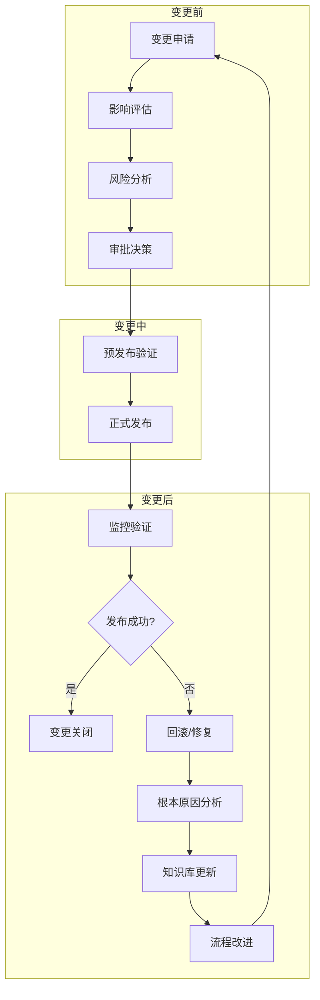

# 14 - 变更管理与发布策略

> **适用版本**: Kubernetes v1.25-v1.32 | **最后更新**: 2026-02 | **作者**: Allen Galler | **质量等级**: ⭐⭐⭐⭐⭐ 专家级

> **生产环境实战经验总结**: 基于万级节点集群变更管理经验，涵盖从发布策略到变更控制的全方位最佳实践

---

## 知识地图

| 属性 | 说明 |
|------|------|
| **文件角色** | 变更管理与发布策略 — 安全、可控的生产环境变更指南 |
| **适合读者** | 开发者(了解发布流程) → DevOps(实施发布) → SRE(保障稳定性) |
| **前置知识** | 01(运维实践)、06(CLI命令) |
| **关联文件** | 01(运维实践)、11(企业运维)、12(事故管理)、15(SLI/SLO) |

### 发布策略对比速查

| 策略 | 风险 | 速度 | 适用场景 |
|------|------|------|----------|
| **滚动更新** | 低 | 中 | 无状态应用常规发布 |
| **蓝绿部署** | 低 | 快 | 需要快速回滚的关键服务 |
| **金丝雀发布** | 最低 | 慢 | 高风险变更、大流量服务 |
| **A/B测试** | 低 | 慢 | 功能验证、用户体验优化 |

---

## 目录

- [1. 变更管理框架](#1-变更管理框架)
- [2. 发布策略模式](#2-发布策略模式)
- [3. 变更审批流程](#3-变更审批流程)
- [4. 回滚与恢复策略](#4-回滚与恢复策略)
- [5. 发布自动化](#5-发布自动化)
- [6. 风险评估与控制](#6-风险评估与控制)
- [7. 变更监控与验证](#7-变更监控与验证)
- [8. 实战案例分析](#8-实战案例分析)

---

## 1. 变更管理框架

> **🔰 初学者导读**: 变更管理的核心理念是"每次变更都可追溯、可审批、可回滚"。就像医院的手术流程——术前评估→审批→手术→术后观察，每一步都有记录和检查。

### 1.1 变更管理生命周期

#### 深入理解：变更分类 — 手术风险分级

**什么是变更分类**？

就像医院把手术分为"门诊小手术""中等手术""重大手术"——不同风险等级的变更需要不同的审批流程和执行策略。Kubernetes 变更管理也要根据风险进行分类。

**变更分类的核心原则**：

| 分类维度 | 评估标准 | 影响 |
|----------|----------|------|
| **影响范围** | 受影响的用户/服务数量 | 范围越大，风险越高 |
| **业务关键度** | 是否影响核心业务 | 核心业务变更需要更严格审批 |
| **可逆性** | 是否可以快速回滚 | 数据库变更难回滚，风险更高 |
| **时间窗口** | 是否需要在特定时间执行 | 紧急修复需要快速通道 |

---

**变更分类详解**：

**P0 紧急修复** — 类比：急诊抢救

- **定义**：解决正在发生的严重生产事故
- **典型场景**：
  - 核心服务宕机（如支付服务崩溃）
  - 严重安全漏洞正在被利用
  - 数据泄露正在发生
- **审批流程**：
  - 口头审批（电话/IM）
  - CTO 或值班负责人批准
  - 15 分钟内完成审批
  - 事后补交详细报告
- **执行窗口**：立即执行，24x7
- **回滚策略**：预准备快速回滚脚本，1 分钟内可回滚

**实际案例**：
```yaml
# P0 紧急修复示例
incident: "支付服务宕机"
changeType: "P0-EmergencyFix"
approvalProcess:
  verbalApproval: "CTO via phone call"
  writtenApprovalDeadline: "within 2 hours post-fix"
executionTime: "immediate"
rollbackTime: "< 1 minute"
postMortem: "required within 24 hours"
```

---

**P1 安全补丁** — 类比：预防性手术

- **定义**：修复已知但尚未被利用的安全漏洞
- **典型场景**：
  - Kubernetes CVE 修复
  - 容器镜像漏洞修补
  - TLS 证书更新
- **审批流程**：
  - 书面审批（工单系统）
  - 安全总监 + SRE 负责人批准
  - 4 小时内完成审批
- **执行窗口**：维护窗口（如凌晨 2-6 点）
- **回滚策略**：标准回滚流程，10 分钟内可回滚

**实际案例**：
```yaml
# P1 安全补丁示例
changeTitle: "升级 Kubernetes 至 v1.28.5 (CVE-2024-xxxx)"
changeType: "P1-SecurityPatch"
approvalProcess:
  requiredApprovers:
    - "Security Director"
    - "SRE Lead"
  approvalDeadline: "4 hours"
executionWindow: "02:00-06:00 UTC"
rollbackPlan: "kubectl version rollback + node reimaging"
estimatedRollbackTime: "10 minutes"
```

---

**P2 功能发布** — 类比：计划性手术

- **定义**：新功能上线或重大功能更新
- **典型场景**：
  - 新版本应用发布
  - API 版本升级
  - 数据库 schema 变更
- **审批流程**：
  - 书面审批 + 审查会议
  - 技术 VP + 业务负责人批准
  - 1 个工作日内完成审批
- **执行窗口**：工作时间（便于监控和快速响应）
- **回滚策略**：金丝雀回滚，30 分钟内可回滚

**实际案例**：
```yaml
# P2 功能发布示例
changeTitle: "发布用户服务 v2.0（新支付功能）"
changeType: "P2-FeatureRelease"
approvalProcess:
  requiredApprovers:
    - "Tech VP"
    - "Product Manager"
  reviewMeeting: "required"
  approvalDeadline: "1 business day"
executionWindow: "10:00-16:00 weekdays"
deploymentStrategy: "canary (5% → 10% → 25% → 50% → 100%)"
rollbackPlan: "argo rollouts abort"
estimatedRollbackTime: "30 minutes"
```

---

**P3 配置变更** — 类比：门诊治疗

- **定义**：应用配置、环境变量、参数调整
- **典型场景**：
  - ConfigMap/Secret 更新
  - 资源 requests/limits 调整
  - HPA 参数优化
- **审批流程**：
  - 团队内审批
  - Team Leader 批准
  - 1 小时内完成审批
- **执行窗口**：工作时间
- **回滚策略**：即时回滚（kubectl apply 旧配置），5 分钟内可回滚

---

**P4 基础设施变更** — 类比：建筑改造

- **定义**：集群架构、网络拓扑、存储系统变更
- **典型场景**：
  - 添加新节点池
  - 网络插件升级（如 Calico → Cilium）
  - 存储类（StorageClass）变更
- **审批流程**：
  - 架构评审委员会审批
  - 多部门签字（架构、SRE、运维、业务）
  - 2 个工作日内完成审批
- **执行窗口**：维护窗口（需提前 2 周通知）
- **回滚策略**：按计划回滚，可能需要 1-2 小时

---

#### 深入理解：变更日历 — 航空管制时刻表

**什么是变更日历**？

就像机场的航班时刻表——协调所有飞机的起降时间，避免冲突。变更日历管理所有计划内变更的时间，防止多个高风险变更同时执行。

**变更日历的核心价值**：

✅ **避免变更冲突**：
- 场景：团队 A 升级数据库，团队 B 同时升级应用 → 出问题难以定位
- 解决：变更日历显示"周一有数据库升级"，团队 B 改到周三

✅ **平衡变更密度**：
- 场景：一周内有 10 个 P2 变更 → 运维团队疲于奔命
- 解决：将变更分散到 2-3 周，确保每周不超过 3 个重大变更

✅ **保护业务高峰期**：
- 场景：黑五促销期间执行基础设施变更 → 影响业务
- 解决：变更日历标记"黑五变更冻结期"，禁止非紧急变更

---

**变更日历最佳实践**：

```yaml
# 变更日历配置
changeCalendar:
  # 变更窗口定义
  changeWindows:
    # 标准维护窗口
    - name: "weekly-maintenance"
      schedule: "Sunday 02:00-06:00 UTC"
      allowedChangeTypes: ["P1", "P2", "P3", "P4"]
      maxConcurrentChanges: 3
      
    # 紧急窗口（随时）
    - name: "emergency-window"
      schedule: "24x7"
      allowedChangeTypes: ["P0"]
      maxConcurrentChanges: 1
      
    # 工作时间窗口
    - name: "business-hours"
      schedule: "Monday-Friday 10:00-16:00 UTC"
      allowedChangeTypes: ["P2", "P3"]
      maxConcurrentChanges: 2
      
  # 变更冻结期
  freezePeriods:
    # 年度大促冻结
    - name: "black-friday-freeze"
      startDate: "2026-11-20"
      endDate: "2026-11-30"
      allowedChangeTypes: ["P0"]  # 仅允许紧急修复
      reason: "Black Friday sales period"
      
    # 财务结算冻结
    - name: "quarter-end-freeze"
      schedule: "last 3 days of each quarter"
      allowedChangeTypes: ["P0"]
      reason: "Financial closing period"
      
  # 变更密度限制
  densityLimits:
    perDay:
      P0: 999  # 无限制（紧急）
      P1: 5
      P2: 3
      P3: 10
      P4: 1
    perWeek:
      P1: 10
      P2: 10
      P3: 50
      P4: 3
      
  # 变更间隔规则
  separationRules:
    # 相同服务的变更间隔
    - rule: "same-service"
      minimumInterval: "4 hours"
      reason: "Allow time for monitoring and validation"
      
    # 基础设施变更后的缓冲期
    - rule: "after-infrastructure-change"
      minimumInterval: "24 hours"
      reason: "Ensure infrastructure stability"
      
    # 数据库变更后的缓冲期
    - rule: "after-database-change"
      minimumInterval: "12 hours"
      reason: "Allow database replication and validation"
```

---

**实际案例：变更日历的典型一周**：

```
周一：
  02:00 - P1 安全补丁：升级 Kubernetes 至 v1.28.5
  10:00 - P3 配置变更：调整 HPA 参数（用户服务）
  14:00 - P2 功能发布：发布订单服务 v2.1（金丝雀）

周二：
  （观察周一变更影响）
  
周三：
  10:00 - P2 功能发布：发布支付服务 v3.0（蓝绿部署）
  15:00 - P3 配置变更：更新数据库连接池配置

周四：
  02:00 - P4 基础设施：添加新节点池（GPU 节点）

周五：
  （变更冻结，仅监控和观察）
  
周末：
  02:00 - P1 安全补丁：更新容器镜像（修复 CVE）

【冻结期】下周一到下周五：双12大促变更冻结
```

---

**变更日历工具推荐**：

| 工具 | 类型 | 优点 | 适用场景 |
|------|------|------|----------|
| **Google Calendar** | 通用日历 | 简单易用，团队协作 | 小团队（<50人） |
| **ServiceNow Change Calendar** | 企业级 ITSM | 完整的变更管理流程 | 大型企业 |
| **PagerDuty Change Events** | 事件管理 | 与事故管理集成 | DevOps 团队 |
| **自建 Git + CI/CD** | GitOps | 完全自动化、可审计 | 成熟的 DevOps 团队 |



### 1.2 变更分类与等级

| 变更类型 | 等级 | 影响范围 | 审批层级 | 执行窗口 | 回滚策略 |
|----------|------|----------|----------|----------|----------|
| **紧急修复** | P0 | 核心业务中断 | CTO批准 | 立即执行 | 快速回滚 |
| **安全补丁** | P1 | 全集群 | 安全总监 | 维护窗口 | 标准回滚 |
| **功能发布** | P2 | 特定业务线 | 技术VP | 工作时间 | 金丝雀回滚 |
| **配置变更** | P3 | 单个服务 | 团队Leader | 工作时间 | 即时回滚 |
| **基础设施** | P4 | 基础设施层 | 架构委员会 | 维护窗口 | 按计划回滚 |

### 1.3 变更管理最佳实践

```yaml
# 变更管理成熟度模型
changeManagementMaturity:

  # Level 1: 初始级
  level-1:
    characteristics: "反应式管理，缺乏标准化流程"
    practices:
      - "临时变更，无正式流程"
      - "变更记录不完整"
      - "回滚成功率低"
    metrics:
      - "变更失败率: >30%"
      - "MTTR: >4小时"
      - "变更相关事故占比: >50%"
      
  # Level 2: 管理级
  level-2:
    characteristics: "建立了基本流程，但仍依赖人工"
    practices:
      - "有变更申请表单"
      - "变更前简单测试"
      - "变更后手动验证"
    metrics:
      - "变更失败率: 15-30%"
      - "MTTR: 2-4小时"
      - "变更相关事故占比: 20-50%"
      
  # Level 3: 定义级
  level-3:
    characteristics: "标准化流程，自动化工具辅助"
    practices:
      - "标准化变更流程"
      - "自动化测试验证"
      - "变更前后对比分析"
    metrics:
      - "变更失败率: 5-15%"
      - "MTTR: 1-2小时"
      - "变更相关事故占比: 10-20%"
      
  # Level 4: 量化级
  level-4:
    characteristics: "数据驱动，持续优化"
    practices:
      - "变更成功率量化监控"
      - "变更影响预测"
      - "智能风险评估"
    metrics:
      - "变更失败率: 1-5%"
      - "MTTR: <1小时"
      - "变更相关事故占比: <10%"
      
  # Level 5: 优化级
  level-5:
    characteristics: "持续改进，预防性管理"
    practices:
      - "变更影响最小化"
      - "自愈式回滚机制"
      - "变更模式自动学习"
    metrics:
      - "变更失败率: <1%"
      - "MTTR: <30分钟"
      - "变更相关事故占比: <5%"
```

---

## 2. 发布策略模式

> **🔰 初学者导读**: 发布策略决定"如何将新版本安全地交付给用户"。滚动更新是默认策略(逐步替换)；金丝雀发布是"先让5%用户试用"；蓝绿部署是"一键切换"。选择哪种取决于风险容忍度和业务要求。

### 2.1 金丝雀发布策略

#### 深入理解：金丝雀发布 — 矿工带金丝雀下矿

**什么是金丝雀发布**？

历史上，矿工下矿时会带一只金丝雀——如果矿井中有毒气，金丝雀会先于人类出现异常，给矿工预警。金丝雀发布（Canary Release）就是"让一小部分用户先试用新版本"，如果出问题，只影响少数用户，可以快速回滚。

**金丝雀发布的核心理念**：

✅ **渐进式风险暴露**：
- 5% 用户 → 观察 10 分钟 → 正常 → 10% 用户 → 观察 20 分钟 → ...
- 如果 5% 阶段出问题，只影响 5% 用户，而非全量

✅ **生产环境真实验证**：
- 测试环境再完善，也无法 100% 模拟生产流量
- 金丝雀发布在真实流量下验证新版本

✅ **快速反馈循环**：
- 每个阶段都观察核心指标（错误率、延迟、CPU、内存）
- 发现异常立即中止，而非等全量发布后再发现

---

**金丝雀发布的典型流程**：

```
阶段 1: 5% 流量  → 观察 5 分钟  → ✅ 正常
阶段 2: 10% 流量 → 观察 10 分钟 → ✅ 正常
阶段 3: 25% 流量 → 观察 30 分钟 → ✅ 正常
阶段 4: 50% 流量 → 观察 1 小时  → ✅ 正常
阶段 5: 100% 流量

如果任何阶段出现异常 → 🛑 立即回滚到旧版本
```

**关键参数配置**：

| 参数 | 推荐值（保守） | 推荐值（激进） | 说明 |
|------|----------------|----------------|------|
| **初始流量比例** | 1-5% | 10-20% | 第一批用户比例 |
| **观察时间** | 10-30 分钟 | 5-10 分钟 | 每阶段观察多久 |
| **升级步长** | 5% → 10% → 25% → 50% → 100% | 20% → 50% → 100% | 流量递增步骤 |
| **自动回滚阈值** | 错误率 > 1% | 错误率 > 5% | 触发自动回滚的条件 |

---

**实际案例：电商平台金丝雀发布**

```yaml
# 金丝雀发布配置示例（使用 Argo Rollouts）
apiVersion: argoproj.io/v1alpha1
kind: Rollout
metadata:
  name: ecommerce-payment-service
spec:
  replicas: 100  # 总共 100 个副本
  strategy:
    canary:
      # 定义金丝雀升级步骤
      steps:
      - setWeight: 5    # 阶段 1: 5% 流量（5 个副本）
        pause: {duration: 5m}   # 观察 5 分钟
      - setWeight: 10   # 阶段 2: 10% 流量（10 个副本）
        pause: {duration: 10m}  # 观察 10 分钟
      - setWeight: 25   # 阶段 3: 25% 流量（25 个副本）
        pause: {duration: 30m}  # 观察 30 分钟
      - setWeight: 50   # 阶段 4: 50% 流量（50 个副本）
        pause: {duration: 1h}   # 观察 1 小时
      - setWeight: 100  # 阶段 5: 100% 流量（全量）
      
      # 指标分析：自动判断是否健康
      analysis:
        templates:
        - templateName: error-rate-check
        - templateName: latency-check
        args:
        - name: service-name
          value: payment-service
        - name: error-threshold
          value: "1.0"  # 错误率超过 1% 则失败
        - name: latency-threshold
          value: "500"  # P95 延迟超过 500ms 则失败
        
      # 流量路由（使用 Istio）
      trafficRouting:
        istio:
          virtualService:
            name: payment-service-vs
          destinationRule:
            name: payment-service-dr
            canarySubsetName: canary
            stableSubsetName: stable
  
  template:
    metadata:
      labels:
        app: payment-service
        version: v2.0  # 新版本
    spec:
      containers:
      - name: app
        image: payment-service:v2.0
        ports:
        - containerPort: 8080
        resources:
          requests:
            cpu: 500m
            memory: 512Mi
          limits:
            cpu: 1000m
            memory: 1Gi
---
# 错误率检查模板
apiVersion: argoproj.io/v1alpha1
kind: AnalysisTemplate
metadata:
  name: error-rate-check
spec:
  args:
  - name: service-name
  - name: error-threshold
  metrics:
  - name: error-rate
    interval: 1m  # 每分钟检查一次
    successCondition: result < {{args.error-threshold}}
    failureLimit: 3  # 连续失败 3 次则判定为失败
    provider:
      prometheus:
        address: http://prometheus.monitoring.svc:9090
        query: |
          sum(rate(http_requests_total{
            service="{{args.service-name}}",
            status=~"5.."
          }[5m]))
          /
          sum(rate(http_requests_total{
            service="{{args.service-name}}"
          }[5m]))
          * 100
```

**金丝雀发布实战时间轴**：

```
10:00 - 开始金丝雀发布
10:01 - 5% 流量切换到 v2.0（5 个 Pod）
        ✅ 错误率：0.2%（正常）
        ✅ P95 延迟：120ms（正常）
        ✅ CPU/内存使用正常

10:06 - 10% 流量切换到 v2.0（10 个 Pod）
        ✅ 错误率：0.3%（正常）
        ✅ P95 延迟：125ms（正常）
        
10:16 - 25% 流量切换到 v2.0（25 个 Pod）
        ✅ 错误率：0.4%（正常）
        ✅ 业务指标：支付成功率 99.8%（正常）
        
10:46 - 50% 流量切换到 v2.0（50 个 Pod）
        ⚠️  错误率：1.2%（超过阈值 1.0%）
        🛑 自动回滚触发！
        
10:47 - 回滚至 v1.9（全量切回旧版本）
        ✅ 错误率恢复到 0.3%
        
10:50 - 事后分析：v2.0 在高并发下有内存泄漏
        📝 修复 bug 后重新发布
```

---

**金丝雀发布的优点**：
- ✅ 风险最小化：出问题只影响少数用户
- ✅ 真实环境验证：在生产流量下测试
- ✅ 快速反馈：每个阶段都有监控验证

**金丝雀发布的缺点**：
- ❌ 发布时间长：整个流程可能需要 2-4 小时
- ❌ 复杂度高：需要流量路由、指标监控、自动回滚
- ❌ 成本高：金丝雀期间需要同时运行新旧两个版本

**适用场景**：
- ✅ 高流量服务（日均 PV > 1 亿）
- ✅ 核心业务（如支付、订单、登录）
- ✅ 高风险变更（架构重构、重要算法调整）

---

#### 深入理解：蓝绿部署 — 舞台换景

**什么是蓝绿部署**？

就像剧场演出换景——舞台后面准备好新布景（绿色环境），确认一切就绪后，幕布一拉，观众看到的就是新场景（蓝色环境变成绿色环境）。整个切换过程瞬间完成，观众几乎无感知。

**蓝绿部署的核心理念**：

✅ **零停机切换**：
- 新版本（绿）和旧版本（蓝）同时存在
- 流量一键从蓝切换到绿
- 切换时间 < 1 秒

✅ **快速回滚**：
- 如果绿色环境有问题，立即切回蓝色环境
- 回滚时间 < 1 秒（只需修改 Service 的 selector）

✅ **充分验证**：
- 绿色环境部署完成后，可以先内部测试
- 确认无误后再切换用户流量

---

**蓝绿部署的典型流程**：

```
步骤 1: 当前生产环境（蓝色）正常运行
        - Service 指向蓝色 Deployment
        - 用户流量 100% 在蓝色环境

步骤 2: 部署新版本到绿色环境
        - 创建绿色 Deployment（新版本）
        - 等待所有 Pod Ready
        - 用户流量仍然 100% 在蓝色环境

步骤 3: 内部验证绿色环境
        - 通过预览 Service 访问绿色环境
        - 执行冒烟测试（smoke tests）
        - 确认功能正常

步骤 4: 切换流量到绿色环境
        - 修改 Service selector：version=blue → version=green
        - 用户流量瞬间切换到绿色环境
        - 蓝色环境保留（用于快速回滚）

步骤 5: 观察绿色环境（30 分钟）
        - 监控错误率、延迟、资源使用
        - 如果正常 → 销毁蓝色环境
        - 如果异常 → 立即切回蓝色环境

步骤 6: 清理旧版本
        - 删除蓝色 Deployment
        - 绿色环境成为新的"蓝色环境"
```

---

**实际案例：用户服务蓝绿部署**

```yaml
# 蓝色环境（当前生产版本 v1.0）
apiVersion: apps/v1
kind: Deployment
metadata:
  name: user-service-blue
spec:
  replicas: 50
  selector:
    matchLabels:
      app: user-service
      version: blue
  template:
    metadata:
      labels:
        app: user-service
        version: blue
    spec:
      containers:
      - name: app
        image: user-service:v1.0
        ports:
        - containerPort: 8080

---
# 绿色环境（新版本 v2.0）
apiVersion: apps/v1
kind: Deployment
metadata:
  name: user-service-green
spec:
  replicas: 50
  selector:
    matchLabels:
      app: user-service
      version: green
  template:
    metadata:
      labels:
        app: user-service
        version: green
    spec:
      containers:
      - name: app
        image: user-service:v2.0
        ports:
        - containerPort: 8080

---
# 生产 Service（初始指向蓝色环境）
apiVersion: v1
kind: Service
metadata:
  name: user-service
spec:
  selector:
    app: user-service
    version: blue  # 🔵 当前流量指向蓝色
  ports:
  - port: 80
    targetPort: 8080

---
# 预览 Service（用于内部测试绿色环境）
apiVersion: v1
kind: Service
metadata:
  name: user-service-preview
spec:
  selector:
    app: user-service
    version: green  # 🟢 预览流量指向绿色
  ports:
  - port: 80
    targetPort: 8080
```

**蓝绿切换脚本**：

```bash
#!/bin/bash
# blue-green-switch.sh - 蓝绿切换脚本

set -e

CURRENT_ENV=$(kubectl get service user-service -o jsonpath='{.spec.selector.version}')
echo "当前生产环境: $CURRENT_ENV"

if [ "$CURRENT_ENV" = "blue" ]; then
  NEW_ENV="green"
else
  NEW_ENV="blue"
fi

echo "准备切换到: $NEW_ENV"

# 1. 验证目标环境健康
echo "1. 验证 $NEW_ENV 环境健康状态..."
kubectl wait --for=condition=Ready pod -l app=user-service,version=$NEW_ENV --timeout=300s

# 2. 执行冒烟测试
echo "2. 执行冒烟测试..."
SMOKE_TEST_RESULT=$(kubectl run smoke-test --image=curlimages/curl --restart=Never --rm -i -- \
  curl -s -o /dev/null -w "%{http_code}" http://user-service-preview/health)

if [ "$SMOKE_TEST_RESULT" != "200" ]; then
  echo "❌ 冒烟测试失败: HTTP $SMOKE_TEST_RESULT"
  exit 1
fi
echo "✅ 冒烟测试通过"

# 3. 切换流量
echo "3. 切换生产流量到 $NEW_ENV 环境..."
kubectl patch service user-service -p "{\"spec\":{\"selector\":{\"version\":\"$NEW_ENV\"}}}"
echo "✅ 流量已切换到 $NEW_ENV 环境"

# 4. 验证切换结果
echo "4. 验证切换结果..."
sleep 5
CURRENT_ENV_AFTER=$(kubectl get service user-service -o jsonpath='{.spec.selector.version}')
if [ "$CURRENT_ENV_AFTER" = "$NEW_ENV" ]; then
  echo "✅ 切换成功！当前生产环境: $NEW_ENV"
else
  echo "❌ 切换失败！"
  exit 1
fi

# 5. 监控观察期（30 分钟）
echo "5. 进入 30 分钟观察期..."
echo "   请密切监控错误率、延迟等指标"
echo "   如需回滚，请运行:"
echo "   kubectl patch service user-service -p '{\"spec\":{\"selector\":{\"version\":\"$CURRENT_ENV\"}}}'"
```

---

**蓝绿部署 vs 金丝雀发布**：

| 对比维度 | 蓝绿部署 | 金丝雀发布 |
|----------|----------|------------|
| **切换方式** | 一键全量切换 | 逐步增加流量 |
| **切换时间** | < 1 秒 | 2-4 小时 |
| **风险暴露** | 一次性全量暴露 | 逐步暴露（5%→100%） |
| **回滚速度** | < 1 秒（切回蓝色） | 数分钟（流量回滚） |
| **资源成本** | 高（需要双倍资源） | 中（金丝雀期间 105-110% 资源） |
| **复杂度** | 低 | 高（需要流量路由） |
| **适用场景** | 需要快速回滚的服务 | 高流量、高风险变更 |

```yaml
# 金丝雀发布配置示例
apiVersion: argoproj.io/v1alpha1
kind: Rollout
metadata:
  name: canary-deployment
spec:
  replicas: 100
  strategy:
    canary:
      # 金丝雀副本数
      canaryReplicas: 2
      # 金丝雀权重
      canaryMetadata:
        labels:
          version: canary
      stableMetadata:
        labels:
          version: stable
      
      # 金丝雀升级步骤
      steps:
      - setWeight: 5    # 5% 流量
        pause: {duration: 5m}
      - setWeight: 10   # 10% 流量
        pause: {duration: 10m}
      - setWeight: 25   # 25% 流量
        pause: {duration: 30m}
      - setWeight: 50   # 50% 流量
        pause: {duration: 1h}
      - setWeight: 100  # 100% 流量
      
      # 健康检查配置
      trafficRouting:
        nginx:
          stableIngress: app-stable-ingress
          additionalIngressAnnotations:
            kubernetes.io/ingress.class: nginx
      
      # 指标分析配置
      analysis:
        templates:
        - templateName: success-rate
        - templateName: response-time
        args:
        - name: service-name
          value: app-service
        - name: threshold
          value: "99"
        - name: duration
          value: "5m"
  
  selector:
    matchLabels:
      app: my-app
  template:
    metadata:
      labels:
        app: my-app
    spec:
      containers:
      - name: app
        image: my-app:v2.0
        ports:
        - containerPort: 8080
        resources:
          requests:
            cpu: 100m
            memory: 128Mi
          limits:
            cpu: 500m
            memory: 512Mi
```

### 2.2 蓝绿发布策略

```yaml
# 蓝绿发布配置示例
apiVersion: argoproj.io/v1alpha1
kind: Rollout
metadata:
  name: blue-green-rollout
spec:
  replicas: 50
  strategy:
    blueGreen:
      # 活跃服务（当前版本）
      activeService: app-service-active
      # 预览服务（新版本）
      previewService: app-service-preview
      # 自动提升（设为false需要手动确认）
      autoPromotionEnabled: false
      # 自动提升等待时间
      autoPromotionSeconds: 300
      # 预览副本数
      previewReplicaCount: 2
      
      # 服务切换策略
      scaleDownDelaySeconds: 30
      scaleDownDelayRevisionLimit: 2
      prePromotionAnalysis:
        templates:
        - templateName: smoke-tests
        args:
        - name: service-name
          value: app-service-preview
      postPromotionAnalysis:
        templates:
        - templateName: stability-check
        args:
        - name: service-name
          value: app-service-active
          
  selector:
    matchLabels:
      app: my-app
  template:
    metadata:
      labels:
        app: my-app
    spec:
      containers:
      - name: app
        image: my-app:v2.0
        ports:
        - containerPort: 8080
        livenessProbe:
          httpGet:
            path: /health
            port: 8080
          initialDelaySeconds: 30
          periodSeconds: 10
        readinessProbe:
          httpGet:
            path: /ready
            port: 8080
          initialDelaySeconds: 5
          periodSeconds: 5
```

### 2.3 滚动更新策略

```yaml
# 滚动更新配置示例
apiVersion: apps/v1
kind: Deployment
metadata:
  name: rolling-update-deployment
spec:
  replicas: 10
  strategy:
    type: RollingUpdate
    rollingUpdate:
      # 最大超出副本数
      maxSurge: 25%
      # 最大不可用副本数
      maxUnavailable: 25%
  minReadySeconds: 30
  revisionHistoryLimit: 10
  selector:
    matchLabels:
      app: my-app
  template:
    metadata:
      labels:
        app: my-app
    spec:
      containers:
      - name: app
        image: my-app:v2.0
        ports:
        - containerPort: 8080
        resources:
          requests:
            cpu: 100m
            memory: 128Mi
          limits:
            cpu: 500m
            memory: 512Mi
        lifecycle:
          preStop:
            exec:
              command: ["/bin/sh", "-c", "sleep 10"]
```

---

## 3. 变更审批流程

> **🔰 初学者导读**: 变更审批不是"走形式"，而是风险控制的关键环节。审批流程应该自动化：低风险变更自动通过，高风险变更需要SRE和业务方双重审批。

### 3.1 变更审批矩阵

| 变更类型 | 审批层级 | 参与角色 | 审批时间 | 备注 |
|----------|----------|----------|----------|------|
| **紧急变更** | CTO/CTO代表 | 技术总监、SRE负责人 | 15分钟内 | 事后补交报告 |
| **安全相关** | 安全总监 | 安全团队、架构师 | 4小时 | 需安全评估 |
| **数据库变更** | DBA负责人 | DBA、架构师 | 24小时 | 需备份确认 |
| **网络配置** | 网络负责人 | 网络工程师、SRE | 2小时 | 需影响评估 |
| **应用发布** | 团队Leader | 开发、测试、运维 | 1小时 | 需测试报告 |
| **基础设施** | 架构委员会 | 架构师、SRE、运维 | 48小时 | 需架构评审 |

### 3.2 变更申请表单

```yaml
# 变更申请模板
changeRequest:
  basicInfo:
    requestId: "CHG-2026-0206-001"
    title: "升级生产集群 Kubernetes 版本至 v1.30.0"
    type: "infrastructure"
    priority: "high"
    requester: "Alice Chen"
    team: "Platform Engineering"
    
  changeDetails:
    description: "将生产集群从 v1.28.3 升级至 v1.30.0，以获得新特性支持和安全修复"
    scope: "control-plane, worker-nodes"
    affectedServices: ["all-services"]
    estimatedDuration: "4 hours"
    changeWindow: "2026-02-15 02:00-06:00 UTC"
    
  impactAssessment:
    businessImpact: "短暂服务不可用（<5分钟）"
    technicalRisk: "medium"
    rollbackPlan: "使用 kubeadm downgrade 回滚至 v1.28.3"
    testingDone: "已在预发布环境验证"
    
  approval:
    submittedBy: "Alice Chen"
    submittedDate: "2026-02-05"
    approvedBy: ""
    approvedDate: ""
    rejectedReason: ""
    
  execution:
    scheduledBy: ""
    scheduledDate: ""
    executedBy: ""
    executedDate: ""
    status: "pending"
    
  postExecution:
    success: false
    downtime: "3 minutes"
    issuesEncountered: []
    lessonsLearned: []
```

### 3.3 自动化审批工作流

```yaml
# GitOps 变更审批流程
apiVersion: argoproj.io/v1alpha1
kind: Workflow
metadata:
  generateName: change-approval-
spec:
  entrypoint: approval-workflow
  templates:
  - name: approval-workflow
    steps:
    - - name: validate-change
        template: validate-change-request
    - - name: check-risk-level
        template: assess-risk
        when: "{{steps.validate-change.outputs.result}} == 'valid'"
    - - name: auto-approve-low-risk
        template: approve-change
        when: "{{steps.check-risk-level.outputs.result}} == 'low'"
    - - name: manual-approval-required
        template: request-approval
        when: "{{steps.check-risk-level.outputs.result}} != 'low'"
    - - name: execute-change
        template: deploy-change
        when: "{{steps.auto-approve-low-risk.outputs.result}} == 'approved' || {{steps.manual-approval-required.outputs.result}} == 'approved'"
        
  - name: validate-change-request
    script:
      image: python:3.9
      command: [python]
      source: |
        import os
        import sys
        # 验证变更请求格式和完整性
        change_request = os.environ.get('CHANGE_REQUEST')
        if not change_request:
            print("Invalid change request")
            sys.exit(1)
        print("valid")
        
  - name: assess-risk
    script:
      image: python:3.9
      command: [python]
      source: |
        import os
        import json
        change_request = json.loads(os.environ.get('CHANGE_REQUEST'))
        risk_score = calculate_risk(change_request)
        if risk_score < 20:
            print("low")
        elif risk_score < 50:
            print("medium")
        else:
            print("high")
            
  - name: approve-change
    script:
      image: alpine:latest
      command: [sh, -c]
      source: |
        echo "Change approved automatically"
        echo "approved"
        
  - name: request-approval
    script:
      image: curlimages/curl
      command: [sh, -c]
      source: |
        # 发送审批请求到 Slack/Teams
        curl -X POST $SLACK_WEBHOOK_URL \
          -H 'Content-Type: application/json' \
          -d '{
            "text": "紧急变更需要审批",
            "blocks": [
              {
                "type": "section",
                "text": {
                  "type": "mrkdwn",
                  "text": "*变更请求需要审批*\n变更ID: {{inputs.parameters.change-id}}"
                }
              },
              {
                "type": "actions",
                "elements": [
                  {
                    "type": "button",
                    "text": {"type": "plain_text", "text": "批准"},
                    "action_id": "approve_{{inputs.parameters.change-id}}"
                  },
                  {
                    "type": "button",
                    "text": {"type": "plain_text", "text": "拒绝"},
                    "action_id": "reject_{{inputs.parameters.change-id}}"
                  }
                ]
              }
            ]
          }'
```

---

## 4. 回滚与恢复策略

> **🔰 初学者导读**: 回滚能力是变更安全的底线——如果新版本出问题，必须能快速回到上一个好的版本。K8s的Deployment天然支持回滚(kubectl rollout undo)，但数据库变更的回滚需要额外规划。

### 4.1 回滚触发条件

#### 深入理解：自动回滚 — 保险丝自动熔断

**什么是自动回滚**？

就像家里的保险丝——当电流过大时自动断电保护，而不是等电器烧坏。自动回滚在检测到异常指标时（如错误率飙升、延迟过高），无需人工干预，系统自动回滚到上一个稳定版本。

**自动回滚的核心价值**：

✅ **快速止损**：
- 人工回滚：发现问题 → 开会讨论 → 决定回滚 → 执行回滚（可能需要 30-60 分钟）
- 自动回滚：检测异常 → 立即回滚（< 1 分钟）

✅ **7x24 保护**：
- 凌晨 3 点发布出问题，值班人员可能在睡觉
- 自动回滚不分昼夜，始终监控

✅ **客观决策**：
- 人工判断可能受情绪影响（"再等等看""可能只是偶然"）
- 自动回滚基于数据和规则，客观准确

---

**自动回滚触发条件设计**：

| 指标类型 | 触发阈值 | 观察时间 | 风险等级 |
|----------|----------|----------|----------|
| **错误率** | > 5% | 持续 5 分钟 | 🔴 高 |
| **P95 延迟** | > 2 倍基线 | 持续 3 分钟 | 🔴 高 |
| **可用性** | < 95% | 持续 2 分钟 | 🔴 高 |
| **CPU 使用** | > 90% | 持续 10 分钟 | 🟡 中 |
| **内存 OOM** | 任意 Pod OOM | 立即 | 🔴 高 |
| **业务指标** | 订单失败率 > 3% | 持续 5 分钟 | 🔴 高 |

**实际案例：支付服务自动回滚配置**

```yaml
# Argo Rollouts 自动回滚配置
apiVersion: argoproj.io/v1alpha1
kind: Rollout
metadata:
  name: payment-service
spec:
  strategy:
    canary:
      analysis:
        templates:
        - templateName: auto-rollback-check
        args:
        - name: service-name
          value: payment-service

---
# 自动回滚检查模板
apiVersion: argoproj.io/v1alpha1
kind: AnalysisTemplate
metadata:
  name: auto-rollback-check
spec:
  args:
  - name: service-name
  metrics:
  # 指标1: 错误率检查
  - name: error-rate
    interval: 1m
    successCondition: result < 5.0  # 错误率 < 5%
    failureLimit: 3  # 连续失败 3 次（3 分钟）触发回滚
    provider:
      prometheus:
        address: http://prometheus.monitoring.svc:9090
        query: |
          sum(rate(http_requests_total{
            service="{{args.service-name}}",
            status=~"5.."
          }[5m]))
          /
          sum(rate(http_requests_total{
            service="{{args.service-name}}"
          }[5m]))
          * 100
  
  # 指标2: P95 延迟检查
  - name: latency-p95
    interval: 1m
    successCondition: result < 2000  # P95 延迟 < 2 秒
    failureLimit: 3
    provider:
      prometheus:
        address: http://prometheus.monitoring.svc:9090
        query: |
          histogram_quantile(0.95,
            sum(rate(http_request_duration_seconds_bucket{
              service="{{args.service-name}}"
            }[5m])) by (le)
          ) * 1000
  
  # 指标3: 可用性检查
  - name: availability
    interval: 1m
    successCondition: result > 95.0  # 可用性 > 95%
    failureLimit: 2  # 连续失败 2 次（2 分钟）触发回滚
    provider:
      prometheus:
        address: http://prometheus.monitoring.svc:9090
        query: |
          avg(up{
            job="{{args.service-name}}"
          }) * 100
  
  # 指标4: 业务指标 - 支付成功率
  - name: payment-success-rate
    interval: 1m
    successCondition: result > 97.0  # 支付成功率 > 97%
    failureLimit: 3
    provider:
      prometheus:
        address: http://prometheus.monitoring.svc:9090
        query: |
          sum(rate(payment_total{
            service="{{args.service-name}}",
            status="success"
          }[5m]))
          /
          sum(rate(payment_total{
            service="{{args.service-name}}"
          }[5m]))
          * 100
```

**自动回滚实战时间轴**：

```
14:00 - 开始金丝雀发布 payment-service v2.0
14:01 - 5% 流量切换到 v2.0
        ✅ 错误率：0.5%（正常）
        ✅ P95 延迟：180ms（正常）

14:06 - 10% 流量切换到 v2.0
        ⚠️  错误率：3.2%（偏高但未超过 5% 阈值）
        ✅ P95 延迟：220ms（正常）
        → 继续观察

14:08 - 错误率持续上升
        🔴 错误率：6.1%（超过 5% 阈值）
        ⏱️  等待确认（需连续 3 次）

14:09 - 第 2 次检查
        🔴 错误率：6.8%（仍超过阈值）

14:10 - 第 3 次检查
        🔴 错误率：7.2%（连续 3 次超过阈值）
        🛑 自动回滚触发！

14:10:15 - 开始回滚流程
           - Argo Rollouts 自动执行 abort
           - 流量从 10% 回滚到 0%
           - 删除 v2.0 的金丝雀 Pod

14:10:45 - 回滚完成
           ✅ 错误率恢复到 0.5%
           ✅ 服务正常

14:15 - 发送告警通知
        📧 主题：【自动回滚】payment-service v2.0 发布失败
        内容：
        - 回滚原因：错误率超过 5%（实际 7.2%）
        - 影响范围：10% 用户（约 50 万笔订单）
        - 回滚时间：14:10-14:11（45 秒）
        - 需要行动：开发团队排查 v2.0 问题
```

---

#### 深入理解：数据库变更回滚 — 文档版本历史

**为什么数据库回滚特殊**？

应用代码的回滚很简单（切回旧版本镜像即可），但数据库 schema 变更的回滚非常复杂：

❌ **常见误区**：
- "回滚就是执行 DROP COLUMN"
- "数据库回滚和应用回滚一样简单"

✅ **真相**：
- 新 schema 可能已经写入了新数据
- 删除列会导致数据丢失
- 应用代码和数据库 schema 必须兼容

---

**数据库变更的安全模式：向后兼容**

核心原则：**新 schema 必须兼容旧代码，旧 schema 必须兼容新代码**

**实际案例：添加新列的正确姿势**

❌ **错误的做法**（不可回滚）：
```sql
-- 第 1 步：添加新列（NOT NULL）
ALTER TABLE users ADD COLUMN age INT NOT NULL;

-- 第 2 步：部署新代码（使用 age 列）
-- 问题：如果新代码有 bug 需要回滚，旧代码不知道 age 列，会报错！
```

✅ **正确的做法**（可回滚）：
```sql
-- 阶段 1：添加新列（允许 NULL）
ALTER TABLE users ADD COLUMN age INT NULL DEFAULT NULL;
-- 此时：旧代码仍然正常运行（不使用 age 列）

-- 阶段 2：部署新代码（写入 age 列，但不强依赖）
-- 新代码逻辑：
-- if age IS NULL:
--     使用默认值或跳过
-- 此时：可以随时回滚到旧代码

-- 阶段 3：数据迁移（填充历史数据的 age 列）
UPDATE users SET age = calculate_age(birthdate) WHERE age IS NULL;
-- 此时：仍然可以回滚到旧代码

-- 阶段 4：添加 NOT NULL 约束（数周后，确认稳定）
ALTER TABLE users ALTER COLUMN age SET NOT NULL;
-- 此时：不能回滚到旧代码了（但已经运行数周，风险极低）
```

**数据库变更的四阶段模型**：

| 阶段 | 操作 | 应用兼容性 | 可回滚 | 持续时间 |
|------|------|------------|--------|----------|
| **1. 增加（Additive）** | 添加新列/表（允许 NULL） | 新旧代码都兼容 | ✅ 是 | 1 天 |
| **2. 双写（Dual Write）** | 新代码写入新列，旧列保留 | 新旧代码都兼容 | ✅ 是 | 1-2 周 |
| **3. 迁移（Migration）** | 数据迁移，旧列保留 | 新旧代码都兼容 | ✅ 是 | 1-2 周 |
| **4. 清理（Cleanup）** | 删除旧列，添加约束 | 仅新代码兼容 | ❌ 否 | - |

**实际案例：重命名列的安全流程**

场景：将 `users.name` 重命名为 `users.full_name`

```sql
-- ❌ 错误做法（不可回滚）
ALTER TABLE users RENAME COLUMN name TO full_name;
-- 旧代码立即报错：column "name" does not exist

-- ✅ 正确做法（可回滚）

-- 第 1 周：添加新列
ALTER TABLE users ADD COLUMN full_name VARCHAR(255) NULL;
-- 部署新代码 v2.0：同时写入 name 和 full_name
UPDATE users SET full_name = name WHERE full_name IS NULL;
-- 此时可回滚到 v1.0

-- 第 2 周：观察新列稳定性
-- 监控：full_name 列的数据完整性
-- 此时仍可回滚到 v1.0

-- 第 3 周：新代码切换到读取 full_name
-- 部署新代码 v2.1：读取 full_name，写入 name 和 full_name（双写）
-- 此时仍可回滚到 v1.0（旧代码读取 name）

-- 第 4 周：停止写入 name 列
-- 部署新代码 v2.2：仅读写 full_name
-- ⚠️  此时回滚到 v1.0 会有数据不一致（但可以短期回滚到 v2.1）

-- 第 6 周：删除旧列（确认 v2.2 稳定后）
ALTER TABLE users DROP COLUMN name;
-- ❌ 此时无法回滚到旧版本
```

**数据库回滚的黄金法则**：

1. **永远不要在一次发布中同时修改 schema 和应用逻辑**
2. **新 schema 必须向后兼容至少 2 周**
3. **删除操作永远是最后一步，且需要数周的稳定期**
4. **对于关键表，保留旧列 3-6 个月再删除**

```yaml
# 回滚策略配置
rollbackStrategy:
  automaticRollback:
    conditions:
      # 错误率过高
      - metric: "error_rate"
        threshold: 5.0  # 百分比
        duration: "5m"
        operator: "GreaterThan"
        
      # 延迟过高
      - metric: "latency_p95"
        threshold: 2000  # 毫秒
        duration: "3m"
        operator: "GreaterThan"
        
      # 可用性下降
      - metric: "availability"
        threshold: 95.0  # 百分比
        duration: "2m"
        operator: "LessThan"
        
      # 资源使用异常
      - metric: "cpu_usage"
        threshold: 90.0  # 百分比
        duration: "10m"
        operator: "GreaterThan"
        
    actions:
      # 回滚到上一版本
      rollbackAction: "rollBackToPreviousVersion"
      # 通知相关人员
      notification: ["sre-team@company.com", "oncall-pager"]
      # 记录事件
      eventLogging: true
      
  manualRollback:
    # 手动触发回滚的接口
    triggerEndpoint: "/api/v1/rollback"
    authorization: "admin-only"
    confirmation: "two-click"
```

### 4.2 回滚执行脚本

```bash
#!/bin/bash
# rollback-execution.sh - 回滚执行脚本

set -e

CHANGE_ID=$1
ROLLBACK_REASON=$2
DRY_RUN=${3:-false}

echo "=== 开始回滚操作 ==="
echo "变更ID: $CHANGE_ID"
echo "回滚原因: $ROLLBACK_REASON"
echo "试运行模式: $DRY_RUN"

# 1. 检查当前状态
echo "1. 检查当前部署状态"
kubectl get rollout $ROLLOUT_NAME -o yaml > /tmp/current-state-$CHANGE_ID.yaml

# 2. 记录回滚开始
echo "2. 记录回滚事件"
kubectl patch rollout $ROLLOUT_NAME -p '{"metadata":{"annotations":{"rollback/reason":"'"$ROLLBACK_REASON"'", "rollback/initiator":"$(whoami)", "rollback/start-time":"$(date -u +%Y-%m-%dT%H:%M:%SZ)"}}}'

# 3. 执行回滚
echo "3. 执行回滚操作"
if [ "$DRY_RUN" = "false" ]; then
  # 对于 Argo Rollouts
  kubectl argo rollouts promote $ROLLOUT_NAME --abort
  
  # 或者对于普通 Deployment
  # kubectl rollout undo deployment/$DEPLOYMENT_NAME --to-revision=1
else
  echo "[DRY RUN] kubectl argo rollouts promote $ROLLOUT_NAME --abort"
fi

# 4. 等待回滚完成
echo "4. 等待回滚完成"
MAX_WAIT=300  # 5分钟超时
WAITED=0
while [ $WAITED -lt $MAX_WAIT ]; do
  STATUS=$(kubectl get rollout $ROLLOUT_NAME -o jsonpath='{.status.phase}')
  if [ "$STATUS" = "Healthy" ]; then
    echo "回滚成功完成"
    break
  fi
  sleep 10
  WAITED=$((WAITED + 10))
done

if [ $WAITED -ge $MAX_WAIT ]; then
  echo "ERROR: 回滚超时"
  exit 1
fi

# 5. 验证回滚结果
echo "5. 验证回滚结果"
kubectl get rollout $ROLLOUT_NAME -o yaml > /tmp/post-rollback-state-$CHANGE_ID.yaml

# 比较版本
PREVIOUS_VERSION=$(kubectl get rollout $ROLLOUT_NAME -o jsonpath='{.status.stableRS}' --template='{{index .metadata.annotations "deployment.kubernetes.io/revision"}}')
CURRENT_VERSION=$(kubectl get rollout $ROLLOUT_NAME -o jsonpath='{.status.currentPodHash}')

echo "回滚验证:"
echo "  上一版本: $PREVIOUS_VERSION"
echo "  当前版本: $CURRENT_VERSION"

# 6. 发送通知
echo "6. 发送回滚完成通知"
NOTIFICATION_PAYLOAD=$(cat <<EOF
{
  "text": "🔄 回滚操作完成",
  "attachments": [
    {
      "color": "good",
      "fields": [
        {
          "title": "变更ID",
          "value": "$CHANGE_ID",
          "short": true
        },
        {
          "title": "回滚原因",
          "value": "$ROLLBACK_REASON",
          "short": true
        },
        {
          "title": "执行时间",
          "value": "$(date)",
          "short": true
        },
        {
          "title": "执行人员",
          "value": "$(whoami)",
          "short": true
        }
      ]
    }
  ]
}
EOF
)

if [ "$DRY_RUN" = "false" ]; then
  curl -X POST $SLACK_WEBHOOK_URL \
    -H 'Content-Type: application/json' \
    -d "$NOTIFICATION_PAYLOAD"
fi

echo "=== 回滚操作完成 ==="
```

---

## 5. 发布自动化

> **🔰 初学者导读**: 发布自动化是DevOps的核心实践。CI/CD流水线自动完成：代码检查→构建→测试→部署→验证。目标是"一键发布"且"每天可以发布多次"。

### 5.1 GitOps 发布流水线

#### 深入理解：CI/CD Pipeline — 工厂流水线

**什么是 CI/CD Pipeline**？

就像汽车工厂的流水线——零件（代码）进入生产线，经过一系列自动化工序（测试、构建、质检），最终产出成品（可部署的应用）。整个过程自动化、标准化、可重复。

**CI/CD 的核心价值**：

✅ **提高发布频率**：
- 手动发布：每月 1 次（风险大、压力大）
- 自动化发布：每天多次（小步快跑、风险小）

✅ **减少人为错误**：
- 手动操作：忘记步骤、配置错误
- 自动化：每次执行完全一致

✅ **快速反馈**：
- 手动流程：提交代码 → 等待 2 天 → 发现 bug
- 自动化：提交代码 → 5 分钟后知道是否通过测试

---

**典型的 CI/CD Pipeline 阶段**：

```
阶段 1: 代码提交
  ↓
阶段 2: 代码检查（Lint）
  ├─ 语法检查
  ├─ 代码风格检查
  └─ 静态分析（找出潜在 bug）
  ↓
阶段 3: 单元测试
  ├─ 运行所有单元测试
  ├─ 代码覆盖率检查（> 80%）
  └─ 性能测试（关键函数）
  ↓
阶段 4: 构建镜像
  ├─ Docker build
  ├─ 镜像优化（多阶段构建）
  └─ 镜像签名（Cosign）
  ↓
阶段 5: 安全扫描
  ├─ 漏洞扫描（Trivy）
  ├─ 依赖检查（Snyk）
  └─ 镜像合规检查
  ↓
阶段 6: 集成测试
  ├─ 部署到测试环境
  ├─ 端到端测试
  └─ 接口测试
  ↓
阶段 7: 部署到预发布
  ├─ 金丝雀发布（5% 流量）
  ├─ 冒烟测试
  └─ 观察 30 分钟
  ↓
阶段 8: 部署到生产
  ├─ 金丝雀发布（5% → 100%）
  ├─ 自动回滚监控
  └─ 发送通知
```

**实际案例：电商平台的 CI/CD Pipeline**

```yaml
# GitHub Actions 配置示例
name: CI/CD Pipeline

on:
  push:
    branches: [main, develop]
  pull_request:
    branches: [main]

env:
  DOCKER_REGISTRY: ghcr.io
  IMAGE_NAME: ecommerce/payment-service

jobs:
  # 阶段 1: 代码检查和测试
  test:
    runs-on: ubuntu-latest
    steps:
    - name: Checkout 代码
      uses: actions/checkout@v3
      
    - name: 设置 Go 环境
      uses: actions/setup-go@v4
      with:
        go-version: '1.21'
        
    - name: 代码 Lint 检查
      run: |
        go install github.com/golangci/golangci-lint/cmd/golangci-lint@latest
        golangci-lint run --timeout 5m
        
    - name: 运行单元测试
      run: |
        go test -v -race -coverprofile=coverage.txt -covermode=atomic ./...
        
    - name: 检查代码覆盖率
      run: |
        COVERAGE=$(go tool cover -func=coverage.txt | grep total | awk '{print $3}' | sed 's/%//')
        echo "代码覆盖率: $COVERAGE%"
        if (( $(echo "$COVERAGE < 80" | bc -l) )); then
          echo "❌ 代码覆盖率不足 80%"
          exit 1
        fi
        
  # 阶段 2: 构建和扫描
  build:
    needs: test
    runs-on: ubuntu-latest
    steps:
    - name: Checkout 代码
      uses: actions/checkout@v3
      
    - name: 设置 Docker Buildx
      uses: docker/setup-buildx-action@v2
      
    - name: 登录容器镜像仓库
      uses: docker/login-action@v2
      with:
        registry: ${{ env.DOCKER_REGISTRY }}
        username: ${{ github.actor }}
        password: ${{ secrets.GITHUB_TOKEN }}
        
    - name: 构建镜像
      uses: docker/build-push-action@v4
      with:
        context: .
        push: true
        tags: |
          ${{ env.DOCKER_REGISTRY }}/${{ env.IMAGE_NAME }}:${{ github.sha }}
          ${{ env.DOCKER_REGISTRY }}/${{ env.IMAGE_NAME }}:latest
        cache-from: type=gha
        cache-to: type=gha,mode=max
        
    - name: 安全漏洞扫描
      uses: aquasecurity/trivy-action@master
      with:
        image-ref: ${{ env.DOCKER_REGISTRY }}/${{ env.IMAGE_NAME }}:${{ github.sha }}
        format: 'sarif'
        output: 'trivy-results.sarif'
        severity: 'CRITICAL,HIGH'
        exit-code: '1'  # 发现高危漏洞则失败
        
    - name: 镜像签名
      run: |
        cosign sign --key cosign.key \
          ${{ env.DOCKER_REGISTRY }}/${{ env.IMAGE_NAME }}:${{ github.sha }}
          
  # 阶段 3: 部署到预发布环境
  deploy-staging:
    needs: build
    runs-on: ubuntu-latest
    if: github.ref == 'refs/heads/main'
    steps:
    - name: Checkout GitOps 仓库
      uses: actions/checkout@v3
      with:
        repository: company/gitops-config
        token: ${{ secrets.GITOPS_TOKEN }}
        
    - name: 更新 Staging 环境配置
      run: |
        cd environments/staging
        kustomize edit set image \
          payment-service=${{ env.DOCKER_REGISTRY }}/${{ env.IMAGE_NAME }}:${{ github.sha }}
        git config user.name "GitHub Actions"
        git config user.email "actions@github.com"
        git commit -am "Update staging to ${{ github.sha }}"
        git push
        
    - name: 等待部署完成
      run: |
        kubectl wait --for=condition=Ready pod \
          -l app=payment-service \
          -n staging \
          --timeout=300s
          
    - name: 运行集成测试
      run: |
        kubectl run e2e-test --image=e2e-test:latest \
          --restart=Never --rm -i \
          --env="BASE_URL=http://payment-service.staging.svc.cluster.local"
          
  # 阶段 4: 部署到生产环境
  deploy-production:
    needs: deploy-staging
    runs-on: ubuntu-latest
    environment:
      name: production
      url: https://payment.example.com
    steps:
    - name: Checkout GitOps 仓库
      uses: actions/checkout@v3
      with:
        repository: company/gitops-config
        token: ${{ secrets.GITOPS_TOKEN }}
        
    - name: 更新 Production 环境配置
      run: |
        cd environments/production
        kustomize edit set image \
          payment-service=${{ env.DOCKER_REGISTRY }}/${{ env.IMAGE_NAME }}:${{ github.sha }}
        git config user.name "GitHub Actions"
        git config user.email "actions@github.com"
        git commit -am "Update production to ${{ github.sha }}"
        git push
        
    - name: 触发金丝雀发布
      run: |
        kubectl argo rollouts promote payment-service -n production
        
    - name: 发送发布通知
      uses: 8398a7/action-slack@v3
      with:
        status: ${{ job.status }}
        text: |
          🚀 Production 发布成功
          服务: payment-service
          版本: ${{ github.sha }}
          发布者: ${{ github.actor }}
        webhook_url: ${{ secrets.SLACK_WEBHOOK }}
```

---

#### 深入理解：渐进式交付 — 药品临床试验

**什么是渐进式交付（Progressive Delivery）**？

就像新药上市的临床试验流程：
- **I 期试验**：少数健康志愿者（5% 流量）
- **II 期试验**：小规模患者群体（25% 流量）
- **III 期试验**：大规模患者群体（50% 流量）
- **上市**：全面推广（100% 流量）

每个阶段都严格监控副作用（错误率、延迟），确认安全后才进入下一阶段。

---

**渐进式交付的核心特征**：

| 特征 | 传统发布 | 渐进式交付 |
|------|----------|------------|
| **流量分配** | 一次性 100% | 逐步增加（5% → 100%） |
| **监控验证** | 发布后手动检查 | 每阶段自动验证 |
| **回滚决策** | 人工判断 | 自动回滚（基于指标） |
| **用户影响** | 全量用户同时受影响 | 渐进式暴露风险 |
| **发布时间** | 数分钟 | 数小时（换取安全性） |

---

**实际案例：渐进式交付的完整流程**

```yaml
# Flagger 渐进式交付配置
apiVersion: flagger.app/v1beta1
kind: Canary
metadata:
  name: payment-service
  namespace: production
spec:
  # 目标 Deployment
  targetRef:
    apiVersion: apps/v1
    kind: Deployment
    name: payment-service
  
  # 渐进式交付策略
  service:
    port: 8080
    targetPort: 8080
    gateways:
    - public-gateway
    hosts:
    - payment.example.com
  
  # 分析配置（自动验证）
  analysis:
    interval: 1m  # 每分钟检查一次
    threshold: 5  # 连续失败 5 次则回滚
    maxWeight: 50  # 金丝雀最大流量 50%
    stepWeight: 10  # 每次增加 10% 流量
    
    # 核心指标
    metrics:
    - name: request-success-rate
      thresholdRange:
        min: 99  # 成功率必须 > 99%
      interval: 1m
    - name: request-duration
      thresholdRange:
        max: 500  # P99 延迟必须 < 500ms
      interval: 1m
    
    # Webhook 测试
    webhooks:
    - name: smoke-tests
      url: http://flagger-loadtester.test/
      timeout: 5s
      metadata:
        type: cmd
        cmd: "hey -z 1m -q 10 -c 2 http://payment-service-canary.production:8080/health"
    - name: load-test
      url: http://flagger-loadtester.test/
      timeout: 5s
      metadata:
        type: cmd
        cmd: "hey -z 1m -q 100 -c 10 http://payment-service-canary.production:8080/api/payment"
```

**渐进式交付时间轴**：

```
T+0min: 开始发布 v2.0
        - 部署金丝雀 Pod
        - 等待 Pod Ready
        
T+2min: 金丝雀健康检查
        ✅ 所有 Pod Ready
        ✅ 冒烟测试通过
        → 开始流量切换

T+3min: 10% 流量切换到金丝雀
        📊 监控指标：
        ✅ 成功率：99.5%
        ✅ P99 延迟：350ms
        ✅ 错误率：0.3%
        → 继续

T+4min: 20% 流量切换到金丝雀
        📊 监控指标：
        ✅ 成功率：99.4%
        ✅ P99 延迟：380ms
        → 继续

T+5min: 30% 流量切换到金丝雀
        📊 监控指标：
        ⚠️  成功率：98.9%（接近阈值 99%）
        ⚠️  P99 延迟：480ms（接近阈值 500ms）
        → 继续观察

T+6min: 仍然 30% 流量（观察期）
        📊 监控指标：
        ⚠️  成功率：98.7%（低于阈值 99%）
        → 继续观察（第 1 次失败）

T+7min: 仍然 30% 流量
        📊 监控指标：
        🔴 成功率：98.5%（持续低于阈值）
        → 第 2 次失败

T+8min: 仍然 30% 流量
        📊 监控指标：
        🔴 成功率：98.3%
        → 第 3 次失败

T+9min: 仍然 30% 流量
        📊 监控指标：
        🔴 成功率：98.2%
        → 第 4 次失败

T+10min: 仍然 30% 流量
         📊 监控指标：
         🔴 成功率：98.1%
         → 第 5 次失败
         🛑 触发自动回滚！

T+11min: 回滚到 v1.9
         - 流量从 30% 回滚到 0%
         - 删除金丝雀 Pod
         ✅ 成功率恢复到 99.6%

T+15min: 发送告警
         📧 渐进式交付失败，已自动回滚
         原因：成功率持续低于 99%
         影响：30% 用户（约 15 分钟）
```

---

**渐进式交付的最佳实践**：

1. **设置合理的阈值**：
   - 不要太严格（如 99.99%），否则任何小波动都回滚
   - 不要太宽松（如 90%），否则无法保护用户

2. **多维度监控**：
   - 技术指标：错误率、延迟、CPU、内存
   - 业务指标：订单成功率、支付成功率、用户留存

3. **分阶段验证**：
   - 5-10%：技术指标验证
   - 25-50%：业务指标验证
   - 50-100%：全面观察

4. **保留观察期**：
   - 每个阶段至少观察 5-10 分钟
   - 不要急于推进到下一阶段

```yaml
# ArgoCD Application 配置
apiVersion: argoproj.io/v1alpha1
kind: Application
metadata:
  name: production-app
  namespace: argocd
spec:
  project: production
  source:
    repoURL: https://github.com/company/production-app.git
    targetRevision: HEAD
    path: k8s/production
    helm:
      valueFiles:
      - values-prod.yaml
      - values-canary.yaml
  destination:
    server: https://kubernetes.default.svc
    namespace: production
  syncPolicy:
    automated:
      prune: true
      selfHeal: true
    syncOptions:
    - CreateNamespace=true
    - PruneLast=true
    retry:
      limit: 5
      backoff:
        duration: 5s
        factor: 2
        maxDuration: 3m

---
# Argo Workflows 发布流程
apiVersion: argoproj.io/v1alpha1
kind: Workflow
metadata:
  generateName: release-pipeline-
spec:
  entrypoint: release-pipeline
  arguments:
    parameters:
    - name: image-tag
      value: "v2.0.1"
    - name: environment
      value: "production"
      
  templates:
  - name: release-pipeline
    steps:
    - - name: build-and-test
        template: build-and-test
        arguments:
          parameters:
          - name: image-tag
            value: "{{workflow.parameters.image-tag}}"
    - - name: security-scan
        template: security-scan
        arguments:
          parameters:
          - name: image-tag
            value: "{{workflow.parameters.image-tag}}"
    - - name: deploy-canary
        template: deploy-canary
        arguments:
          parameters:
          - name: image-tag
            value: "{{workflow.parameters.image-tag}}"
    - - name: validate-canary
        template: validate-canary
        arguments:
          parameters:
          - name: image-tag
            value: "{{workflow.parameters.image-tag}}"
    - - name: promote-to-production
        template: promote-to-production
        arguments:
          parameters:
          - name: image-tag
            value: "{{workflow.parameters.image-tag}}"
    - - name: cleanup
        template: cleanup
        when: "{{steps.promote-to-production.status}} == Succeeded"
        
  - name: build-and-test
    dag:
      tasks:
      - name: build-image
        template: build-image
        arguments:
          parameters:
          - name: image-tag
            value: "{{inputs.parameters.image-tag}}"
      - name: unit-test
        template: unit-test
      - name: integration-test
        template: integration-test
        dependencies: [build-image]
        
  - name: deploy-canary
    container:
      image: argoproj/argoexec:v3.4.4
      command: [sh, -c]
      args: ["kubectl set image deployment/my-app app=my-app:{{inputs.parameters.image-tag}} -n canary"]
```

### 5.2 发布门禁检查

```bash
#!/bin/bash
# release-gate-checks.sh - 发布门禁检查脚本

set -e

IMAGE_TAG=$1
ENVIRONMENT=${2:-production}

echo "=== 发布门禁检查 ==="
echo "镜像标签: $IMAGE_TAG"
echo "环境: $ENVIRONMENT"

# 1. 镜像安全扫描
echo "1. 执行镜像安全扫描..."
TRIVY_RESULT=$(trivy image --format json --exit-code 1 --severity HIGH,CRITICAL my-app:$IMAGE_TAG || echo "FAILED")
if [ "$TRIVY_RESULT" = "FAILED" ]; then
  echo "❌ 镜像安全扫描失败，存在高危漏洞"
  exit 1
else
  echo "✅ 镜像安全扫描通过"
fi

# 2. 镜像签名验证
echo "2. 验证镜像签名..."
COSIGN_RESULT=$(cosign verify --key cosign.pub my-app:$IMAGE_TAG 2>/dev/null || echo "FAILED")
if [ "$COSIGN_RESULT" = "FAILED" ]; then
  echo "❌ 镜像签名验证失败"
  exit 1
else
  echo "✅ 镜像签名验证通过"
fi

# 3. 配置验证
echo "3. 验证 Kubernetes 配置..."
CONFTEST_RESULT=$(conftest test -p policies/ k8s/production/ || echo "FAILED")
if [ "$CONFTEST_RESULT" = "FAILED" ]; then
  echo "❌ 配置验证失败"
  exit 1
else
  echo "✅ 配置验证通过"
fi

# 4. 预发布环境验证
echo "4. 预发布环境端到端测试..."
E2E_RESULT=$(kubectl run e2e-test --image=curlimages/curl --restart=Never --rm -it -- \
  curl -f http://my-app-preprod.production.svc.cluster.local/api/health || echo "FAILED")
if [ "$E2E_RESULT" = "FAILED" ]; then
  echo "❌ 预发布环境测试失败"
  exit 1
else
  echo "✅ 预发布环境测试通过"
fi

# 5. 依赖服务可用性检查
echo "5. 检查依赖服务可用性..."
DEPENDENCIES=("database" "cache" "message-queue")
for dep in "${DEPENDENCIES[@]}"; do
  DEP_STATUS=$(kubectl get svc $dep -n production -o jsonpath='{.spec.clusterIP}' 2>/dev/null || echo "NOT_FOUND")
  if [ "$DEP_STATUS" = "NOT_FOUND" ]; then
    echo "❌ 依赖服务 $dep 不存在"
    exit 1
  fi
done
echo "✅ 依赖服务检查通过"

# 6. 资源配额检查
echo "6. 检查资源配额..."
REQUESTED_CPU="500m"
REQUESTED_MEMORY="1Gi"

CURRENT_USAGE=$(kubectl top nodes --no-headers | awk '{sum+=$3} END {print sum}')
TOTAL_CAPACITY=$(kubectl get nodes -o json | jq -r '[.items[].status.allocatable.cpu] | map(tonumber) | add')

if [ $(echo "$CURRENT_USAGE $TOTAL_CAPACITY" | awk '{print ($1/$2)*100}') -gt 80 ]; then
  echo "⚠️  集群CPU使用率已超过80%，发布可能影响性能"
  read -p "是否继续发布? (y/N): " -n 1 -r
  echo
  if [[ ! $REPLY =~ ^[Yy]$ ]]; then
    echo "发布已取消"
    exit 1
  fi
fi

echo "✅ 所有发布门禁检查通过！"
echo "🚀 可以安全发布 $IMAGE_TAG 到 $ENVIRONMENT 环境"
```

---

## 6. 风险评估与控制

> **🔰 初学者导读**: 每次变更前应评估风险：影响范围有多大？回滚方案是什么？最坏情况是什么？风险评估矩阵帮你量化风险等级(概率×影响)。

### 6.1 风险评估矩阵

| 风险类别 | 影响等级 | 概率 | 风险值 | 缓解措施 |
|----------|----------|------|--------|----------|
| **数据丢失** | 灾难 | 低 | 高 | 多重备份、异地容灾 |
| **服务中断** | 严重 | 中 | 高 | 高可用架构、快速恢复 |
| **性能下降** | 中等 | 中 | 中 | 容量规划、性能测试 |
| **安全漏洞** | 严重 | 中 | 高 | 安全扫描、权限控制 |
| **配置错误** | 中等 | 高 | 中 | 配置验证、灰度发布 |
| **依赖故障** | 中等 | 中 | 中 | 熔断降级、多活部署 |

### 6.2 风险缓解策略

```yaml
# 风险缓解配置
riskMitigation:
  dataLossPrevention:
    backupStrategy:
      frequency: "every-6-hours"
      retention: "30-days"
      verification: "weekly"
      encryption: "at-rest-and-transit"
    disasterRecovery:
      rto: "4-hours"
      rpo: "1-hour"
      location: "cross-region"
      
  serviceAvailability:
    highAvailability:
      zones: 3
      replicas: 3
      failover: "automatic"
    circuitBreaker:
      timeout: "30s"
      maxRetries: 3
      fallback: "graceful-degradation"
      
  performanceProtection:
    rateLimiting:
      requestsPerSecond: 1000
      burst: 2000
      strategy: "token-bucket"
    resourceIsolation:
      namespaceQuotas: true
      podLimits: true
      priorityClasses: true
      
  securityControls:
    vulnerabilityScanning:
      frequency: "daily"
      severityThreshold: "high"
      autoRemediation: true
    accessControl:
      rbac: "mandatory"
      mfa: "required"
      auditLogging: "full"
      
  configurationValidation:
    preDeployChecks:
      schemaValidation: true
      dependencyCheck: true
      resourceValidation: true
    postDeployValidation:
      healthChecks: true
      metricValidation: true
      rollbackTriggers: true
```

---

## 7. 变更监控与验证

> **🔰 初学者导读**: 发布后的监控验证和发布本身一样重要。观察错误率、延迟、资源使用等核心指标是否异常。推荐设置"发布观察期"(如30分钟)，期间密切监控。

### 7.1 发布后验证清单

```bash
#!/bin/bash
# post-deployment-validation.sh - 发布后验证脚本

set -e

DEPLOYMENT_NAME=$1
NAMESPACE=${2:-production}
TIMEOUT=${3:-300}  # 5分钟超时

echo "=== 发布后验证: $DEPLOYMENT_NAME ==="

# 1. 检查 Pod 状态
echo "1. 验证 Pod 状态..."
kubectl wait --for=condition=Ready pod -l app=$DEPLOYMENT_NAME -n $NAMESPACE --timeout=$TIMEOUT

# 2. 检查 Deployment 状态
echo "2. 验证 Deployment 状态..."
kubectl rollout status deployment/$DEPLOYMENT_NAME -n $NAMESPACE --timeout=$TIMEOUT

# 3. 健康检查
echo "3. 执行健康检查..."
HEALTH_ENDPOINT="http://$DEPLOYMENT_NAME.$NAMESPACE.svc.cluster.local/health"
HEALTH_CHECK=$(kubectl run health-check --image=curlimages/curl --restart=Never --rm -i -- curl -s -o /dev/null -w "%{http_code}" $HEALTH_ENDPOINT)
if [ "$HEALTH_CHECK" != "200" ]; then
  echo "❌ 健康检查失败: HTTP $HEALTH_CHECK"
  exit 1
else
  echo "✅ 健康检查通过"
fi

# 4. 业务功能验证
echo "4. 执行业务功能验证..."
BUSINESS_CHECK=$(kubectl run business-check --image=curlimages/curl --restart=Never --rm -i -- \
  curl -s -X POST $HEALTH_ENDPOINT/api/test -H "Content-Type: application/json" -d '{"test":true}')
if [ "$BUSINESS_CHECK" != '{"success":true}' ]; then
  echo "❌ 业务功能验证失败"
  exit 1
else
  echo "✅ 业务功能验证通过"
fi

# 5. 性能基准测试
echo "5. 执行性能基准测试..."
PERFORMANCE_TEST=$(kubectl run perf-test --image=busybox --restart=Never --rm -i -- \
  sh -c 'time echo "Performance Test" > /dev/null')
echo "✅ 性能测试完成: $PERFORMANCE_TEST"

# 6. 资源使用验证
echo "6. 验证资源使用情况..."
kubectl top pods -n $NAMESPACE | grep $DEPLOYMENT_NAME

# 7. 日志检查
echo "7. 检查应用日志..."
kubectl logs deployment/$DEPLOYMENT_NAME -n $NAMESPACE --tail=10 | grep -i -E "error|exception|failed" || echo "✅ 未发现错误日志"

# 8. 监控指标验证
echo "8. 验证监控指标..."
# 检查 Prometheus 指标是否存在
kubectl run prom-check --image=curlimages/curl --restart=Never --rm -i -- \
  curl -s "http://prometheus.monitoring.svc.cluster.local/api/v1/query?query=up{kubernetes_name='$DEPLOYMENT_NAME'}" | \
  jq -e '.data.result[] | select(.value[1] | tonumber > 0)' > /dev/null && echo "✅ 监控指标正常"

echo "=== 发布验证完成: $DEPLOYMENT_NAME ==="
echo "🎉 所有验证通过，发布成功！"
```

### 7.2 变更影响监控

```promql
# 发布影响监控查询

## 1. 发布前后错误率对比
(
  sum(rate(http_requests_total{status=~"5.."}[5m])) by (deployment)
  /
  sum(rate(http_requests_total[5m])) by (deployment)
) * 100

## 2. 发布前后延迟变化
histogram_quantile(0.95, 
  sum(rate(http_request_duration_seconds_bucket[5m])) by (le, deployment)
)

## 3. 资源使用变化
sum(container_cpu_usage_seconds_total{pod=~"$DEPLOYMENT_NAME-.*"}) by (pod)

## 4. Pod 重启次数
increase(kube_pod_container_status_restarts_total{pod=~"$DEPLOYMENT_NAME-.*"}[5m])

## 5. 部署状态变化
kube_deployment_status_replicas_updated{deployment="$DEPLOYMENT_NAME"}

## 6. 服务可用性
avg(up{job="$DEPLOYMENT_NAME"}) without (instance)
```

---

## 8. 实战案例分析

> **🔰 初学者导读**: 真实的变更管理案例展示了理论如何应用到实践，特别是失败案例的教训更有价值。

### 8.1 案例1：大型版本升级

**背景**
- 集群版本: v1.24.0 → v1.26.0
- 节点数量: 500个
- 服务数量: 200个
- 维护窗口: 4小时

**升级策略**
```yaml
upgradeStrategy:
  phases:
    - name: "pre-flight-checks"
      duration: "30m"
      checks:
        - "cluster-health"
        - "backup-verification"
        - "config-validation"
        
    - name: "control-plane-upgrade"
      duration: "60m"
      target: "master-nodes"
      parallelism: 1
      validation: "api-server-accessibility"
      
    - name: "worker-node-upgrade"
      duration: "120m"
      target: "worker-nodes"
      parallelism: 5
      strategy: "rolling"
      
    - name: "post-upgrade-validation"
      duration: "30m"
      checks:
        - "workload-functionality"
        - "monitoring-integrity"
        - "network-connectivity"
        
  rollbackPlan:
    trigger: "any-phase-failure"
    method: "version-downgrade"
    timeLimit: "30m"
```

### 8.2 案例2：微服务批量发布

**背景**
- 服务数量: 50个微服务
- 发布类型: 功能发布
- 业务要求: 零停机

**发布编排**
```yaml
microserviceRelease:
  orchestration:
    groups:
      - name: "core-services"
        services: ["auth", "user", "payment"]
        dependencyOrder: true
        canaryPercentage: 10%
        
      - name: "supporting-services"
        services: ["notification", "logging", "monitoring"]
        dependencyOrder: false
        canaryPercentage: 5%
        
      - name: "frontend-services"
        services: ["web", "mobile-api"]
        dependencyOrder: after-core
        canaryPercentage: 15%
        
    timing:
      staggerInterval: "15m"
      totalDuration: "4h"
      validationPeriod: "10m"
      
  monitoring:
    metrics:
      - "service-availability"
      - "response-time"
      - "error-rate"
      - "business-metrics"
      
    alerts:
      criticalThreshold: "error-rate > 2% for 5m"
      rollbackTrigger: "any-metric-violation"
```

---

**表格底部标记**: Kusheet Project | 作者: Allen Galler (allengaller@gmail.com) | 最后更新: 2026-02 | 版本: v1.25-v1.32 | 质量等级: ⭐⭐⭐⭐⭐ 专家级
