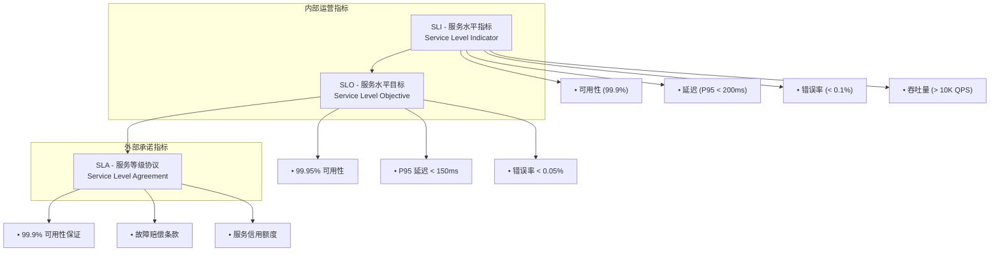
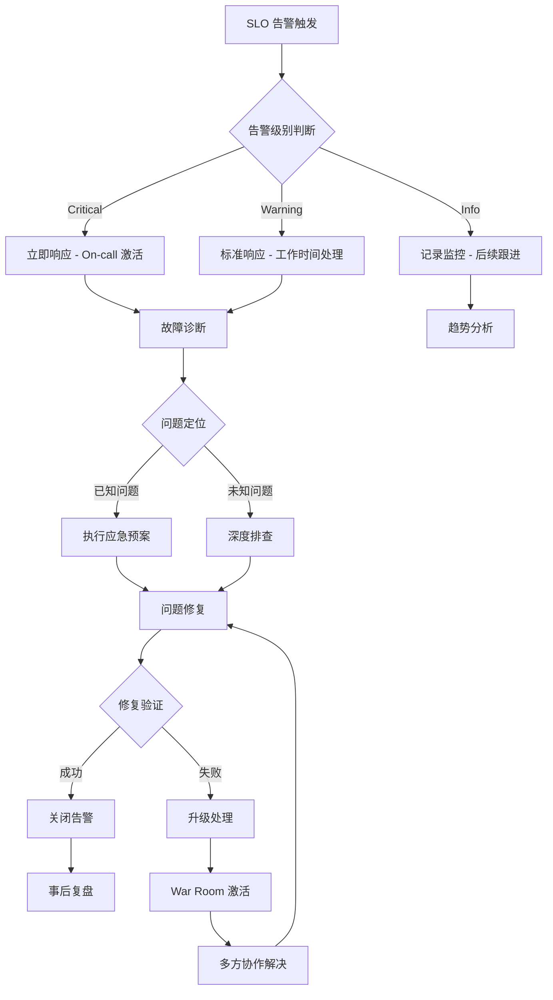

# 15 - SLI/SLO/SLA工程实践

> **适用版本**: Kubernetes v1.25-v1.32 | **最后更新**: 2026-02 | **作者**: Allen Galler | **质量等级**: ⭐⭐⭐⭐⭐ 专家级

> **生产环境实战经验总结**: 基于万级节点集群 SLO 管理经验，涵盖从指标定义到告警响应的全方位最佳实践

---

## 知识地图

| 属性 | 说明 |
|------|------|
| **文件角色** | SLI/SLO/SLA 工程实践 — 用数据驱动的可靠性管理方法论 |
| **适合读者** | 开发者(理解SLO) → SRE(实施SLO) → 管理层(SLA决策) |
| **前置知识** | 01(运维实践)、04(SRE成熟度) |
| **关联文件** | 04(SRE成熟度)、02(故障分析)、12(事故管理)、14(变更管理) |

### SLI/SLO/SLA 三者关系速查

| 概念 | 定义 | 类比 | 示例 |
|------|------|------|------|
| **SLI** (指标) | 衡量服务质量的具体指标 | 体温计读数 | 请求成功率、P99延迟 |
| **SLO** (目标) | SLI的目标值 | 体温正常范围(36-37.5°C) | 可用性 ≥ 99.9%、P99 ≤ 200ms |
| **SLA** (协议) | 对外承诺+违约赔偿 | 保险合同 | 99.9%可用性，低于则赔付10% |
| **错误预算** | SLO允许的失败空间 | "请假天数" | 99.9%→每月允许43分钟宕机 |

---

## 目录

- [1. SLI/SLO/SLA 概念框架](#1-slislosla-概念框架)
- [2. SLI 指标定义与采集](#2-sli-指标定义与采集)
- [3. SLO 设定与管理](#3-slo-设定与管理)
- [4. SLA 合规与问责](#4-sla-合规与问责)
- [5. 错误预算管理](#5-错误预算管理)
- [6. 监控与告警策略](#6-监控与告警策略)
- [7. 告警响应与处理](#7-告警响应与处理)
- [8. 实战案例分析](#8-实战案例分析)

---

## 1. SLI/SLO/SLA 概念框架

> **🔰 初学者导读**: SLI/SLO/SLA是Google SRE提出的可靠性管理体系。简单理解：SLI是"温度计"(衡量工具)，SLO是"正常体温范围"(内部目标)，SLA是"健康保证书"(对外承诺)。三者层层递进，是可靠性工程的基础。

### 1.1 三层服务指标体系



### 1.2 指标层次结构

| 层次 | 目标受众 | 使用场景 | 精度要求 | 更新频率 |
|------|----------|----------|----------|----------|
| **SLI** | 运维团队 | 性能监控、容量规划 | 高 | 实时 |
| **SLO** | 产品团队 | 服务发布、功能迭代 | 中 | 分钟级 |
| **SLA** | 客户 | 合同履约、商务谈判 | 低 | 月度/季度 |

### 1.3 SLI/SLO/SLA 核心区别详解

**类比：体温计、正常体温、健康保证书**

| 对比维度 | SLI | SLO | SLA |
|---------|-----|-----|-----|
| **本质** | 测量工具 | 内部目标 | 外部承诺 |
| **举例** | 体温计读数：36.8°C | 正常体温范围：36-37.5°C | 健康保证：体温超过38°C医保报销 |
| **受众** | 运维团队 | 产品&工程团队 | 客户&管理层 |
| **更新频率** | 实时(秒级) | 小时/天级 | 月度/季度 |
| **精确度** | 高(小数点后2-3位) | 中(小数点后1-2位) | 低(整数或1位小数) |
| **违反后果** | 触发告警 | 冻结发布 | 赔偿客户 |

**真实案例：API服务**
```yaml
# 同一个服务的三层指标
apiService:
  SLI:
    # 原始指标 - 过去5分钟的成功率
    metric: "sum(rate(http_requests_total{status=~'^2|^3'}[5m])) / sum(rate(http_requests_total[5m]))"
    currentValue: 99.973  # 实时测量值
    
  SLO:
    # 内部目标 - 28天滚动窗口
    target: 99.95  # 内部承诺：28天内99.95%可用
    window: "28d"
    errorBudget: "0.05%"  # 允许0.05%的失败
    consequence: "错误预算耗尽后禁止发布"
    
  SLA:
    # 对外承诺 - 月度合同
    guarantee: 99.9  # 对客户承诺：每月99.9%可用
    window: "monthly"
    penalty: 
      below99.9: "退款10%"
      below99.5: "退款25%"
      below99.0: "退款50%"
    consequence: "违反后财务赔偿"
```

**关键区别理解**

1. **SLI vs SLO**: 
   - SLI是"温度计读数"(实时观测值)
   - SLO是"正常体温范围"(可接受目标)
   - SLI可以短暂低于SLO，但长期不能

2. **SLO vs SLA**:
   - SLO是"内部及格线"(99.95%)，比SLA严格
   - SLA是"外部承诺线"(99.9%)，留有安全边际
   - SLO用于指导工程决策，SLA用于商务谈判

3. **为什么需要三层分离？**
   ```
   SLI=99.97% ✅ 高于SLO，可以继续发布
   SLO=99.95% ✅ 高于SLA，留有安全空间
   SLA=99.90% ✅ 对客户承诺达标
   
   如果只有SLA：
   SLI=99.91% ❌ 虽然高于SLA但没有预警
   突然降到99.89% → 立即违反SLA → 直接赔钱！
   ```

### 1.4 四个黄金信号详解

**类比：汽车仪表盘的四个核心表**

| 黄金信号 | 汽车类比 | 测量对象 | 典型阈值 | 业务影响 |
|---------|---------|---------|---------|---------|
| **Latency** | 时速表 | 响应时间 | P95<200ms | 用户体验 |
| **Traffic** | 转速表 | 请求量 | 10K QPS | 容量规划 |
| **Errors** | 故障灯 | 错误率 | <0.1% | 功能可用性 |
| **Saturation** | 油表/水温表 | 资源饱和度 | CPU<80% | 系统稳定性 |

**为什么是这四个？**

Google SRE团队研究发现，这四个信号能覆盖95%的故障场景：

1. **Latency (延迟)** - 用户等待时间
   ```promql
   # 好的延迟测量：P95而不是平均值
   histogram_quantile(0.95, 
     sum(rate(http_request_duration_seconds_bucket[5m])) by (le)
   )
   
   # 为什么用P95？
   # 平均值会掩盖问题：99个请求10ms + 1个请求1000ms = 平均19ms(看起来很好)
   # P95能发现真实问题：95%的用户体验 + 抓住慢请求
   ```

2. **Traffic (流量)** - 系统负载
   ```promql
   # 请求速率(QPS)
   sum(rate(http_requests_total[5m]))
   
   # 为什么重要？
   # 流量突增 → 需要扩容
   # 流量骤降 → 可能是故障导致用户无法访问
   ```

3. **Errors (错误)** - 失败率
   ```promql
   # 错误率百分比
   sum(rate(http_requests_total{status=~"^5"}[5m])) 
   / 
   sum(rate(http_requests_total[5m])) * 100
   
   # 为什么重要？
   # 错误率是最直接的用户影响指标
   # 500错误 = 用户功能不可用
   ```

4. **Saturation (饱和度)** - 资源压力
   ```promql
   # CPU饱和度
   1 - avg(rate(node_cpu_seconds_total{mode="idle"}[5m]))
   
   # 为什么重要？
   # 饱和度高 → 即将故障的预警信号
   # 类似汽车水温过高 → 即将开锅
   ```

**监控优先级排序**

```yaml
monitoringPriority:
  P0Critical:
    - "Errors: 影响用户功能"
    - "Latency P99: 用户体验恶化"
  P1High:
    - "Saturation: 资源即将耗尽"
    - "Traffic: 异常流量模式"
  P2Medium:
    - "Latency P95: 性能下降"
    - "Saturation 80%: 容量预警"
  P3Low:
    - "Traffic趋势: 长期容量规划"
```

### 1.5 SRE 黄金指标配置

```yaml
# SRE 黄金指标定义
sreGoldenSignals:
  latency:
    description: "请求处理时间"
    measurement:
      - "P50 (median)"
      - "P95 (95th percentile)"
      - "P99 (99th percentile)"
      - "P99.9 (99.9th percentile)"
    collection: "histogram buckets"
    
  traffic:
    description: "系统负载"
    measurement:
      - "requests per second"
      - "transactions per minute"
      - "concurrent connections"
      - "throughput (MB/s)"
    collection: "counter rates"
    
  errors:
    description: "错误率"
    measurement:
      - "rate of errors"
      - "error ratio"
      - "failure count"
      - "exception rate"
    collection: "error counters"
    
  saturation:
    description: "资源饱和度"
    measurement:
      - "CPU utilization"
      - "memory pressure"
      - "disk I/O"
      - "connection pool usage"
    collection: "gauge metrics"
```

---

## 2. SLI 指标定义与采集

> **🔰 初学者导读**: 好的SLI应该直接反映用户体验。最核心的四个SLI：可用性(请求成功率)、延迟(响应时间)、错误率(失败比例)、吞吐量(处理能力)。不要试图监控所有指标，先从最影响用户的开始。

### 2.1 核心 SLI 指标定义

```promql
# SLI 指标查询示例

## 1. 可用性 SLI (Availability)
# 分母: 总请求数
availability_denominator = sum(rate(http_requests_total[5m]))

# 分子: 成功请求数 (2xx, 3xx)
availability_numerator = sum(rate(http_requests_total{status=~"^2|^3"}[5m]))

# 可用性 = 成功请求数 / 总请求数
availability_sli = availability_numerator / availability_denominator

## 2. 延迟 SLI (Latency)
# 分母: 总请求数
latency_denominator = sum(rate(http_requests_total[5m]))

# 分子: 满足延迟要求的请求数 (P95 < 200ms)
latency_numerator = histogram_fraction(0.0, 0.2, rate(http_request_duration_seconds_bucket[5m]))

# 延迟满足率
latency_sli = latency_numerator / latency_denominator

## 3. 错误率 SLI (Error Rate)
# 分母: 总请求数
error_denominator = sum(rate(http_requests_total[5m]))

# 分子: 成功请求数
error_numerator = sum(rate(http_requests_total{status!~"^5"}[5m]))

# 成功率
error_sli = error_numerator / error_denominator

## 4. 吞吐量 SLI (Throughput)
# 平均 QPS
throughput_sli = avg(rate(http_requests_total[5m]))
```

### 2.2 SLI 指标采集配置

```yaml
# Prometheus 配置 - SLI 指标采集
global:
  scrape_interval: 15s
  evaluation_interval: 15s

rule_files:
  - "sli_rules.yml"

scrape_configs:
  # 应用服务指标
  - job_name: 'application'
    kubernetes_sd_configs:
      - role: pod
    relabel_configs:
      - source_labels: [__meta_kubernetes_pod_annotation_prometheus_io_scrape]
        action: keep
        regex: true
      - source_labels: [__address__, __meta_kubernetes_pod_annotation_prometheus_io_port]
        action: replace
        regex: ([^:]+)(?::\d+)?;(\d+)
        target_label: __address__
        replacement: $1:$2
    metric_relabel_configs:
      # 过滤掉不必要的标签
      - source_labels: [__name__]
        regex: 'http_requests_total|http_request_duration_seconds_bucket|go_goroutines'
        action: keep

  # 基础设施指标
  - job_name: 'kubernetes-nodes'
    kubernetes_sd_configs:
      - role: node
    relabel_configs:
      - action: labelmap
        regex: __meta_kubernetes_node_label_(.+)

# 记录规则 - SLI 指标预计算
recording_rules:
  # 应用层面
  - record: sli:availability:ratio
    expr: |
      sum(rate(http_requests_total{status=~"^2|^3"}[5m])) 
      / 
      sum(rate(http_requests_total[5m]))
      
  - record: sli:latency:p95
    expr: |
      histogram_quantile(0.95, 
        sum(rate(http_request_duration_seconds_bucket[5m])) by (le, service))
      
  - record: sli:error_rate:ratio
    expr: |
      (sum(rate(http_requests_total{status=~"^5"}[5m])) 
       / 
       sum(rate(http_requests_total[5m]))) * 100
       
  # 基础设施层面
  - record: sli:node_cpu_utilization:ratio
    expr: |
      1 - avg(rate(node_cpu_seconds_total{mode="idle"}[5m]))
      
  - record: sli:node_memory_utilization:ratio
    expr: |
      (node_memory_MemTotal_bytes - node_memory_MemAvailable_bytes) 
      / 
      node_memory_MemTotal_bytes
```

### 2.3 SLI 指标采集最佳实践

```bash
#!/bin/bash
# sli-collection-validation.sh - SLI 指标采集验证脚本

echo "=== SLI 指标采集验证 ==="

# 1. 验证指标存在性
echo "1. 验证关键指标是否存在..."
ESSENTIAL_METRICS=(
    "http_requests_total"
    "http_request_duration_seconds_bucket"
    "up"
    "kube_pod_status_ready"
)

for metric in "${ESSENTIAL_METRICS[@]}"; do
    RESULT=$(curl -s "http://prometheus:9090/api/v1/query?query=count($metric)" | jq -r '.data.result[0].value[1]')
    if [ -z "$RESULT" ] || [ "$RESULT" -eq 0 ]; then
        echo "❌ 指标 $metric 不存在或值为0"
    else
        echo "✅ 指标 $metric 存在 (值: $RESULT)"
    fi
done

# 2. 验证指标标签一致性
echo "2. 验证指标标签一致性..."
LABELS_CHECK=$(curl -s "http://prometheus:9090/api/v1/series?match[]={__name__=\"http_requests_total\"}&limit=10" | jq -r '.data[0] | keys | join(", ")')
echo "http_requests_total 标签: $LABELS_CHECK"

# 3. 验证指标更新频率
echo "3. 验证指标更新频率..."
LAST_UPDATE=$(curl -s "http://prometheus:9090/api/v1/query?query=up" | jq -r '.data.result[0].value[0]')
CURRENT_TIME=$(date +%s)
TIME_DIFF=$((CURRENT_TIME - LAST_UPDATE))

if [ $TIME_DIFF -gt 60 ]; then
    echo "❌ 指标更新延迟: ${TIME_DIFF}s"
else
    echo "✅ 指标更新正常: ${TIME_DIFF}s"
fi

# 4. 验证 SLI 计算规则
echo "4. 验证 SLI 计算规则..."
SLI_RULES=(
    "sli:availability:ratio"
    "sli:latency:p95"
    "sli:error_rate:ratio"
)

for rule in "${SLI_RULES[@]}"; do
    RESULT=$(curl -s "http://prometheus:9090/api/v1/query?query=$rule" | jq -r '.data.result | length')
    if [ "$RESULT" -eq 0 ]; then
        echo "❌ SLI 规则 $rule 未生成数据"
    else
        echo "✅ SLI 规则 $rule 正常 (数据点: $RESULT)"
    fi
done

echo "=== SLI 指标采集验证完成 ==="
```

---

## 3. SLO 设定与管理

> **🔰 初学者导读**: SLO不是"越高越好"——100%的可用性目标既不现实也不经济。99.9%和99.99%的差距意味着运维成本可能增加10倍。SLO应该基于用户期望和业务需求来设定。

### 3.1 SLO 目标设定方法论

**类比：考试及格线设定**

就像考试设定及格线(60分、80分、90分)一样，SLO设定需要平衡多方需求：

| 考试及格线 | SLO目标 | 考虑因素 |
|-----------|---------|---------|
| 60分：基础及格 | 99.0% | 最低可接受标准 |
| 80分：良好 | 99.9% | 常规业务标准 |
| 90分：优秀 | 99.95% | 关键业务标准 |
| 100分：满分 | 99.99%+ | 核心金融/医疗标准 |

**SLO设定五步法**

```yaml
sloSettingFramework:
  step1_用户期望:
    question: "用户能容忍多少故障时间？"
    method:
      - "问卷调查用户满意度"
      - "分析历史投诉数据"
      - "竞品对标分析"
    example:
      scenario: "电商网站"
      finding: "用户能容忍页面加载<3秒，超过3秒流失率增加40%"
      slo: "P95延迟 < 3s"
      
  step2_业务影响:
    question: "故障对业务影响有多大？"
    factors:
      revenue: "每小时宕机损失多少收入？"
      reputation: "用户流失率如何？"
      compliance: "是否有监管要求？"
    example:
      scenario: "支付服务"
      calculation: "1小时宕机 = 损失100万元"
      slo: "99.99% (每月最多4分钟宕机)"
      
  step3_当前能力:
    question: "现在能达到什么水平？"
    method:
      - "统计过去6个月实际可用性"
      - "评估系统架构能力"
      - "计算错误预算消耗速度"
    example:
      scenario: "新服务"
      currentState: "过去3个月平均99.8%"
      slo: "先设定99.5%，逐步提升"
      
  step4_成本平衡:
    question: "提升可靠性的成本是否合理？"
    costAnalysis:
      99.0_to_99.9: "增加1.5x运维成本"
      99.9_to_99.95: "增加3x运维成本"
      99.95_to_99.99: "增加10x运维成本"
    example:
      scenario: "内部工具"
      decision: "ROI不足，设定99.5%更合理"
      
  step5_迭代优化:
    principle: "SLO不是一成不变的"
    cycle:
      - "每季度回顾SLO是否合理"
      - "错误预算经常用完 → 降低SLO或增加投入"
      - "错误预算从不使用 → 可能SLO设置过低"
```

**不同服务类型的SLO基准**

| 服务类型 | 可用性SLO | 延迟SLO | 错误率SLO | 理由 |
|---------|----------|---------|----------|------|
| **核心交易** | 99.99% | P95<100ms | <0.01% | 直接影响收入 |
| **用户认证** | 99.95% | P95<200ms | <0.05% | 关键路径依赖 |
| **内容展示** | 99.9% | P95<500ms | <0.1% | 用户体验相关 |
| **后台任务** | 99.5% | P95<5s | <0.5% | 可延迟处理 |
| **内部工具** | 99.0% | P95<2s | <1% | 工作时间可用 |

### 3.2 SLO 文档模板

**类比：合同模板**

像签合同一样，SLO需要清晰的文档来避免歧义：

```yaml
# SLO 文档模板
sloDocument:
  metadata:
    service: "用户认证服务"
    owner: "identity-team@company.com"
    version: "v2.1"
    effectiveDate: "2026-01-01"
    reviewCycle: "quarterly"
    
  # 1. 服务描述
  serviceDescription:
    purpose: "为所有应用提供用户登录认证"
    users: "内部应用(50+) + 外部用户(100万+)"
    criticality: "P0 - 核心服务"
    dependencies:
      - "数据库: PostgreSQL"
      - "缓存: Redis"
      - "存储: S3"
      
  # 2. SLI 定义
  sliDefinitions:
    availability:
      name: "认证请求可用性"
      description: "成功处理的认证请求占总请求的比例"
      query: |
        sum(rate(auth_requests_total{status=~"^2|^3"}[5m])) 
        / 
        sum(rate(auth_requests_total[5m]))
      dataSource: "Prometheus"
      excludedRequests:
        - "健康检查请求"
        - "测试环境流量"
      goodDefinition: "HTTP状态码2xx/3xx"
      badDefinition: "HTTP状态码5xx + 超时"
      
    latency:
      name: "认证请求延迟"
      description: "95%的认证请求响应时间"
      query: |
        histogram_quantile(0.95,
          sum(rate(auth_request_duration_seconds_bucket[5m])) by (le)
        )
      threshold: "0.2s"  # 200ms
      measurement: "从接收请求到返回响应的时间"
      
  # 3. SLO 目标
  sloTargets:
    availability:
      target: 99.95
      window: "28d"
      errorBudget: "0.05%"
      calculation: |
        28天 = 40,320分钟
        99.95% → 允许宕机 20.16分钟/月
        
    latency:
      target: 95  # 95%的请求
      threshold: "200ms"
      window: "28d"
      errorBudget: "5%的请求可以超过200ms"
      
  # 4. 错误预算策略
  errorBudgetPolicy:
    100_to_75:
      status: "绿色"
      actions: "正常发布节奏"
    75_to_50:
      status: "黄色"
      actions:
        - "增加代码审查覆盖"
        - "金丝雀发布时间延长"
    50_to_25:
      status: "橙色"
      actions:
        - "暂停非关键功能"
        - "仅修复性发布"
    25_to_0:
      status: "红色"
      actions:
        - "禁止所有发布"
        - "启动稳定性冲刺"
        - "每日SLO回顾会议"
        
  # 5. 告警配置
  alerting:
    fastBurn:
      condition: "14.4x燃烧率持续1分钟"
      severity: "critical"
      channel: "PagerDuty"
      escalation: "立即呼叫on-call"
      
    slowBurn:
      condition: "6x燃烧率持续10分钟"
      severity: "warning"
      channel: "Slack + Email"
      escalation: "工作时间响应"
      
  # 6. 例外情况
  exclusions:
    plannedMaintenance:
      notification: "提前7天通知"
      window: "周末凌晨2-4点"
      maxDuration: "2小时/月"
      countTowardSLO: false
      
    dependencyFailure:
      thirdPartyServices:
        - "AWS S3"
        - "Cloudflare CDN"
      handling: "计入SLO，但单独跟踪"
      
  # 7. 回顾机制
  review:
    frequency: "每季度"
    participants:
      - "服务Owner"
      - "SRE团队"
      - "产品经理"
    agenda:
      - "SLO达成率回顾"
      - "错误预算使用情况"
      - "SLO是否需要调整"
      - "改进行动计划"
```

**SLO文档检查清单**

```bash
# slo-document-checklist.sh - SLO文档完整性检查

echo "=== SLO文档检查清单 ==="

CHECKLIST=(
  "[ ] 1. 服务描述清晰（用途、用户、重要性）"
  "[ ] 2. SLI定义明确（计算公式、数据源、好坏定义）"
  "[ ] 3. SLO目标合理（基于业务需求和用户期望）"
  "[ ] 4. 时间窗口明确（滚动窗口或日历窗口）"
  "[ ] 5. 错误预算策略（不同阈值的应对措施）"
  "[ ] 6. 告警配置完整（快速燃烧+慢速燃烧）"
  "[ ] 7. 排除条件明确（计划维护、依赖故障）"
  "[ ] 8. Owner清晰（负责人和团队联系方式）"
  "[ ] 9. 回顾机制（定期回顾SLO合理性）"
  "[ ] 10. 版本管理（文档版本和生效日期）"
)

for item in "${CHECKLIST[@]}"; do
  echo "$item"
done

echo ""
echo "✅ 完成所有检查项后，SLO文档才算完整"
```

### 3.3 SLO 设定模板（完整示例）

```yaml
# SLO 设定模板
serviceLevelObjectives:
  service: "production-app"
  version: "v1.0"
  
  objectives:
    availability:
      target: 99.95  # 99.95% 可用性
      window: "28d"  # 28天窗口期
      indicator:
        numerator: "sum(rate(http_requests_total{status=~'^2|^3'}[5m]))"
        denominator: "sum(rate(http_requests_total[5m]))"
      burnRateAlerts:
        - threshold: 14.4  # 14.4x burn rate = 1 hour alert
          duration: "1h"
          severity: "critical"
        - threshold: 6     # 6x burn rate = 6 hour alert
          duration: "6h"
          severity: "warning"
          
    latency:
      target: 95  # 95% 请求在阈值内
      window: "28d"
      threshold: "0.2"  # 200ms
      indicator:
        numerator: "histogram_fraction(0.0, 0.2, rate(http_request_duration_seconds_bucket[5m]))"
        denominator: "sum(rate(http_requests_total[5m]))"
      burnRateAlerts:
        - threshold: 14.4
          duration: "1h"
          severity: "critical"
          
    errorBudget:
      target: 0.05  # 0.05% 错误率
      window: "28d"
      indicator:
        numerator: "sum(rate(http_requests_total{status=~'^5'}[5m]))"
        denominator: "sum(rate(http_requests_total[5m]))"
      burnRateAlerts:
        - threshold: 14.4
          duration: "1h"
          severity: "critical"
```

### 3.2 SLO 管理工具

```python
#!/usr/bin/env python3
# slo_manager.py - SLO 管理工具

import requests
import json
from datetime import datetime, timedelta
from typing import Dict, List

class SLOManager:
    """SLO 管理器"""
    
    def __init__(self, prometheus_url: str):
        self.prometheus_url = prometheus_url
        
    def calculate_error_budget(self, current_sli: float, slo_target: float) -> float:
        """计算错误预算使用率"""
        error_budget_remaining = slo_target - (100 - current_sli)
        error_budget_consumed = max(0, slo_target - error_budget_remaining)
        error_budget_percentage = (error_budget_consumed / slo_target) * 100
        return error_budget_percentage
    
    def get_current_sli(self, query: str) -> float:
        """获取当前 SLI 值"""
        response = requests.get(f"{self.prometheus_url}/api/v1/query", params={"query": query})
        result = response.json()
        if result['data']['result']:
            return float(result['data']['result'][0]['value'][1]) * 100
        return 0.0
    
    def evaluate_burn_rate(self, slo_target: float, current_sli: float, window_hours: int) -> float:
        """计算错误预算燃烧率"""
        # 计算允许的错误率
        allowed_error_rate = (100 - slo_target) / 100
        
        # 计算实际错误率
        actual_error_rate = (100 - current_sli) / 100
        
        # 计算燃烧率
        if allowed_error_rate > 0:
            burn_rate = actual_error_rate / allowed_error_rate
        else:
            burn_rate = float('inf')
            
        # 考虑时间窗口
        time_factor = 24 / window_hours  # 标准化到24小时
        
        return burn_rate * time_factor
    
    def generate_slo_report(self, service_name: str) -> Dict:
        """生成 SLO 报告"""
        # 获取当前指标
        availability_sli = self.get_current_sli(
            'sum(rate(http_requests_total{status=~"^2|^3"}[1h])) / sum(rate(http_requests_total[1h]))'
        )
        
        # SLO 配置
        slo_config = {
            'availability': {
                'target': 99.95,
                'window': '28d',
                'current': availability_sli
            }
        }
        
        # 计算错误预算
        error_budget = self.calculate_error_budget(availability_sli, slo_config['availability']['target'])
        
        # 计算燃烧率
        burn_rate = self.evaluate_burn_rate(
            slo_config['availability']['target'],
            availability_sli,
            1  # 1小时窗口
        )
        
        report = {
            'service': service_name,
            'timestamp': datetime.now().isoformat(),
            'metrics': {
                'availability': {
                    'sli': availability_sli,
                    'slo_target': slo_config['availability']['target'],
                    'error_budget_remaining': 100 - error_budget,
                    'burn_rate': burn_rate
                }
            },
            'status': 'GREEN' if burn_rate < 1 else 'YELLOW' if burn_rate < 6 else 'RED'
        }
        
        return report

# 使用示例
if __name__ == "__main__":
    manager = SLOManager("http://prometheus:9090")
    report = manager.generate_slo_report("production-app")
    
    print(json.dumps(report, indent=2))
```

---

## 4. SLA 合规与问责

> **🔰 初学者导读**: SLA是写进合同的承诺，违反需要赔偿。SLA目标应该低于SLO(留安全边际)。例如SLO=99.95%时，SLA可以承诺99.9%。

### 4.1 SLA 合规监控

```yaml
# SLA 合规监控配置
apiVersion: monitoring.coreos.com/v1
kind: ServiceMonitor
metadata:
  name: sla-compliance-monitor
  namespace: monitoring
spec:
  selector:
    matchLabels:
      app: sla-monitor
  endpoints:
  - port: metrics
    interval: 30s
    path: /metrics
    relabelings:
    - sourceLabels: [__meta_kubernetes_pod_annotation_prometheus_io_scrape]
      action: keep
      regex: true

---
# SLA 合规性告警规则
groups:
- name: sla_compliance
  rules:
  # SLA 违规告警
  - alert: SLAViolation
    expr: |
      sli:availability:ratio < 0.999  # 低于 SLA 要求的 99.9%
    for: 5m
    labels:
      severity: critical
      category: sla
    annotations:
      summary: "SLA 违规 - 服务可用性低于承诺水平"
      description: "服务 {{ $labels.service }} 可用性 {{ $value | humanizePercentage }} 低于 SLA 要求的 99.9%"
      
  # 错误预算耗尽预警
  - alert: ErrorBudgetDepletionWarning
    expr: |
      (1 - sli:availability:ratio) / (1 - 0.9995) > 0.9  # 错误预算使用超过 90%
    for: 15m
    labels:
      severity: warning
      category: error-budget
    annotations:
      summary: "错误预算即将耗尽"
      description: "服务 {{ $labels.service }} 错误预算已使用 {{ $value | humanizePercentage }}，请注意控制变更节奏"
```

### 4.2 SLA 赔偿机制

```yaml
# SLA 赔偿计算
slaCompensation:
  availabilityTiers:
    - threshold: 99.9
      credit: 10  # 10% 服务费减免
    - threshold: 99.5
      credit: 25  # 25% 服务费减免
    - threshold: 99.0
      credit: 50  # 50% 服务费减免
    - threshold: 95.0
      credit: 100 # 100% 服务费减免
      
  calculationMethod:
    period: "monthly"
    measurement: "calendar-month"
    gracePeriod: "5m"  # 每月允许的宕机宽限期
    
  compensationProcess:
    detection: "automated"
    calculation: "end-of-month"
    application: "next-month-invoice"
    appeal: "customer-request"
    
  reporting:
    customerDashboard: true
    monthlyReport: true
    realTimeAlerts: true
    historicalTrends: true
```

---

## 5. 错误预算管理

> **🔰 初学者导读**: 错误预算是SLO的"反面"——如果SLO是99.9%，错误预算就是0.1%。错误预算用完了就暂停新功能发布，专注修复可靠性问题。这是平衡"快速迭代"和"稳定运行"的关键机制。

### 5.1 错误预算计算方法

**类比：年假天数**

错误预算就像公司给的年假天数：
- 年假总额：固定的(比如10天)
- 使用方式：可以一次用完，也可以分散使用
- 用完后果：不能再请假，必须上班
- 新周期重置：每年1月1日重置

```yaml
errorBudgetAnalogy:
  # SLO 99.9% = 给你0.1%的"故障年假"
  
  scenario1_谨慎使用:
    monthly: "每月用一点(43分钟)"
    result: "全年都能正常发布"
    strategy: "小步快跑，持续交付"
    
  scenario2_一次用完:
    incident: "一次大故障用完全年预算"
    result: "剩余11个月禁止发布"
    strategy: "必须修复根因才能恢复发布"
    
  scenario3_提前用完:
    Q1: "第一季度就用完预算"
    consequence: "Q2-Q4只能修Bug，不能上新功能"
    lesson: "SLO设置过高或系统不稳定"
```

**错误预算计算公式**

```bash
#!/bin/bash
# error-budget-calculator.sh - 错误预算详细计算器

calculate_error_budget() {
  SLO_TARGET=$1      # 例如：99.95
  PERIOD_DAYS=$2     # 例如：28
  
  echo "=== 错误预算计算器 ==="
  echo "SLO目标: ${SLO_TARGET}%"
  echo "统计周期: ${PERIOD_DAYS}天"
  echo ""
  
  # 1. 计算总时间
  TOTAL_MINUTES=$(echo "$PERIOD_DAYS * 24 * 60" | bc)
  TOTAL_HOURS=$(echo "$PERIOD_DAYS * 24" | bc)
  
  echo "📊 总时间统计"
  echo "  - 总分钟数: $TOTAL_MINUTES 分钟"
  echo "  - 总小时数: $TOTAL_HOURS 小时"
  echo ""
  
  # 2. 计算错误预算（时间）
  ERROR_RATE=$(echo "scale=4; (100 - $SLO_TARGET) / 100" | bc)
  ALLOWED_DOWNTIME_MIN=$(echo "scale=2; $TOTAL_MINUTES * $ERROR_RATE" | bc)
  ALLOWED_DOWNTIME_HOURS=$(echo "scale=2; $ALLOWED_DOWNTIME_MIN / 60" | bc)
  
  echo "⏱️  错误预算（时间）"
  echo "  - 允许宕机: $ALLOWED_DOWNTIME_MIN 分钟"
  echo "  - 允许宕机: $ALLOWED_DOWNTIME_HOURS 小时"
  echo ""
  
  # 3. 计算错误预算（请求数）
  if [ ! -z "$3" ]; then
    QPS=$3  # 平均QPS
    TOTAL_REQUESTS=$(echo "$QPS * $TOTAL_MINUTES * 60" | bc)
    ALLOWED_ERRORS=$(echo "scale=0; $TOTAL_REQUESTS * $ERROR_RATE" | bc)
    
    echo "📈 错误预算（请求数）"
    echo "  - 假设平均QPS: $QPS"
    echo "  - 总请求数: $TOTAL_REQUESTS"
    echo "  - 允许失败: $ALLOWED_ERRORS 个请求"
    echo ""
  fi
  
  # 4. 燃烧率对照表
  echo "🔥 燃烧率对照表（多快用完预算）"
  echo "  燃烧率 1x  → $(echo "scale=1; $ALLOWED_DOWNTIME_HOURS / 1" | bc)小时后用完"
  echo "  燃烧率 2x  → $(echo "scale=1; $ALLOWED_DOWNTIME_HOURS / 2" | bc)小时后用完"
  echo "  燃烧率 6x  → $(echo "scale=1; $ALLOWED_DOWNTIME_HOURS / 6" | bc)小时后用完"
  echo "  燃烧率 14.4x → $(echo "scale=1; $ALLOWED_DOWNTIME_HOURS / 14.4" | bc)小时后用完"
  echo ""
  
  # 5. 实际案例
  echo "💡 实际场景示例"
  echo "  场景1: 完全宕机"
  echo "    - 宕机1分钟 = 消耗$(echo "scale=2; 1 / $ALLOWED_DOWNTIME_MIN * 100" | bc)%错误预算"
  echo "  场景2: 部分故障"
  echo "    - 50%请求失败持续1分钟 = 消耗$(echo "scale=2; 0.5 / $ALLOWED_DOWNTIME_MIN * 100" | bc)%错误预算"
}

# 使用示例
calculate_error_budget 99.95 28 1000

echo ""
echo "=== 不同SLO的错误预算对比 ==="
printf "%-10s %-15s %-15s %-20s\n" "SLO" "28天(分钟)" "月度(小时)" "年度(小时)"
printf "%-10s %-15s %-15s %-20s\n" "------" "----------" "----------" "---------------"

for slo in 99.0 99.5 99.9 99.95 99.99; do
  budget_28d=$(echo "scale=2; 28 * 24 * 60 * (100 - $slo) / 100" | bc)
  budget_month=$(echo "scale=2; 30 * 24 * (100 - $slo) / 100" | bc)
  budget_year=$(echo "scale=2; 365 * 24 * (100 - $slo) / 100" | bc)
  printf "%-10s %-15s %-15s %-20s\n" "$slo%" "$budget_28d" "$budget_month" "$budget_year"
done
```

**错误预算消耗实时监控**

```promql
# Prometheus 查询：错误预算消耗率

# 1. 当前错误预算剩余百分比
(
  0.9995  # SLO目标
  - 
  (1 - sli:availability:ratio)  # 当前失败率
) 
/ 
0.0005  # 错误预算总额
* 100

# 2. 错误预算燃烧率
(
  (1 - sli:availability:ratio)  # 当前失败率
  / 
  (1 - 0.9995)  # 允许失败率
)

# 3. 错误预算耗尽倒计时（小时）
(
  0.0005  # 错误预算总额
  - 
  (1 - sli:availability:ratio)  # 已使用的预算
) 
/ 
rate(http_requests_total{status=~"^5"}[5m])  # 当前错误速率
/ 
rate(http_requests_total[5m])  # 总请求速率
* 
(28 * 24)  # 28天转小时
```

### 5.2 错误预算策略详解

**类比：预算耗尽暂停休假**

就像部门预算用完后不能再报销一样，错误预算用完后应该停止可能影响稳定性的活动。

```yaml
errorBudgetPolicy:
  principle: "错误预算是工程决策的客观依据"
  
  # 策略1：分级响应
  tierResponse:
    green_100_to_75:
      status: "健康"
      meaning: "错误预算充足"
      actions:
        release: "正常发布节奏，每周1-2次"
        testing: "标准测试覆盖率(80%)"
        experiment: "可以进行AB测试和灰度实验"
        oncall: "标准on-call轮班"
      example: "周一发布新功能 → 周三优化性能 → 周五修复Bug"
      
    yellow_75_to_50:
      status: "预警"
      meaning: "错误预算消耗较快"
      actions:
        release: "减少发布频率，每周1次"
        testing: "提高测试覆盖率(90%)"
        experiment: "暂停高风险实验"
        oncall: "增加备用on-call人员"
        review: "每日站会回顾错误预算"
      example: "推迟非关键功能，优先修复稳定性问题"
      
    orange_50_to_25:
      status: "告警"
      meaning: "错误预算即将耗尽"
      actions:
        release: "仅允许修复性发布"
        testing: "全面测试，包括性能测试"
        experiment: "禁止所有实验"
        oncall: "启用紧急响应模式"
        review: "每日两次SLO回顾会议"
        communication: "通知所有利益相关方"
      example: "禁止UI改版，只修复支付Bug"
      
    red_25_to_0:
      status: "冻结"
      meaning: "错误预算耗尽"
      actions:
        release: "完全禁止发布(除紧急修复)"
        testing: "根因分析和修复验证"
        experiment: "禁止"
        oncall: "全员待命"
        review: "每4小时回顾一次"
        sprint: "启动'稳定性冲刺'专项"
      example: "CEO批准才能发布，修复根本问题后才能恢复"
      escalation:
        day1: "工程VP介入"
        day3: "CTO介入"
        week1: "董事会汇报"
        
  # 策略2：预算分配
  budgetAllocation:
    planned_70:
      category: "计划内变更"
      allocation: "70%"
      includes:
        - "功能发布"
        - "性能优化"
        - "架构升级"
      example: "70% * 20分钟 = 14分钟用于正常发布"
      
    unplanned_20:
      category: "计划外故障"
      allocation: "20%"
      includes:
        - "软件Bug"
        - "配置错误"
        - "依赖故障"
      example: "20% * 20分钟 = 4分钟应对意外故障"
      
    reserve_10:
      category: "安全储备"
      allocation: "10%"
      includes:
        - "未知风险"
        - "黑天鹅事件"
      example: "10% * 20分钟 = 2分钟作为缓冲"
      
  # 策略3：发布审批流程
  releaseApproval:
    greenZone:
      approver: "Team Lead"
      process: "自动化CI/CD"
      timeToRelease: "< 1小时"
      
    yellowZone:
      approver: "Engineering Manager"
      process: "手动审批 + 金丝雀"
      timeToRelease: "< 4小时"
      additionalChecks:
        - "回滚方案验证"
        - "监控告警检查"
        
    orangeZone:
      approver: "SRE Lead + Engineering Director"
      process: "风险评审会议"
      timeToRelease: "< 1天"
      additionalChecks:
        - "全面影响分析"
        - "War Room准备"
        - "客户通知预案"
        
    redZone:
      approver: "VP Engineering + CTO"
      process: "紧急审批流程"
      criteria: "仅允许P0故障修复"
      timeToRelease: "根据紧急程度"
      
  # 策略4：预算重置
  budgetReset:
    calendar: "每28天重置一次"
    carryover: "不允许结转(避免积累技术债)"
    communication: "重置前3天提醒团队"
    review: "重置时回顾上周期预算使用情况"
```

**错误预算决策树**

```bash
#!/bin/bash
# error-budget-decision-tree.sh - 错误预算决策辅助

make_release_decision() {
  BUDGET_REMAINING=$1  # 错误预算剩余%
  CHANGE_RISK=$2       # 变更风险(low/medium/high)
  
  echo "=== 发布决策辅助 ==="
  echo "错误预算剩余: ${BUDGET_REMAINING}%"
  echo "变更风险等级: $CHANGE_RISK"
  echo ""
  
  # 决策矩阵
  if [ $(echo "$BUDGET_REMAINING >= 75" | bc) -eq 1 ]; then
    echo "✅ 决策: 可以发布"
    echo "理由: 错误预算充足($BUDGET_REMAINING%)"
    echo "流程: 标准发布流程"
    
  elif [ $(echo "$BUDGET_REMAINING >= 50" | bc) -eq 1 ]; then
    if [ "$CHANGE_RISK" == "high" ]; then
      echo "⚠️  决策: 延期发布"
      echo "理由: 预算不足以承担高风险变更"
      echo "建议: 等待预算恢复或降低变更风险"
    else
      echo "⚠️  决策: 谨慎发布"
      echo "理由: 错误预算中等($BUDGET_REMAINING%)"
      echo "流程: 金丝雀发布 + 增强监控"
    fi
    
  elif [ $(echo "$BUDGET_REMAINING >= 25" | bc) -eq 1 ]; then
    if [ "$CHANGE_RISK" == "low" ] && [ "$IS_BUGFIX" == "true" ]; then
      echo "⚠️  决策: 仅允许修复性发布"
      echo "理由: 错误预算紧张($BUDGET_REMAINING%)"
      echo "流程: SRE全程陪同 + War Room准备"
    else
      echo "❌ 决策: 禁止发布"
      echo "理由: 错误预算不足，非修复性变更"
    fi
    
  else
    echo "❌ 决策: 完全禁止发布"
    echo "理由: 错误预算耗尽($BUDGET_REMAINING%)"
    echo "要求: 启动稳定性冲刺，修复根本问题"
    echo "恢复条件: 预算恢复到25%以上"
  fi
}

# 使用示例
make_release_decision 45 "medium"
```

### 5.3 错误预算管理工具

```bash
#!/bin/bash
# error-budget-calculator.sh - 错误预算计算器

SLO_TARGET=${1:-99.95}  # 默认 99.95%
PERIOD_DAYS=${2:-28}    # 默认 28 天

echo "=== 错误预算计算器 ==="
echo "SLO 目标: ${SLO_TARGET}%"
echo "统计周期: ${PERIOD_DAYS} 天"
echo ""

# 计算总分钟数
TOTAL_MINUTES=$(echo "$PERIOD_DAYS * 24 * 60" | bc)

# 计算允许的宕机时间（分钟）
ALLOWED_DOWNTIME=$(echo "scale=2; $TOTAL_MINUTES * (100 - $SLO_TARGET) / 100" | bc)

# 计算允许的宕机时间（小时:分钟）
HOURS=$(echo "$ALLOWED_DOWNTIME / 60" | bc)
MINUTES=$(echo "$ALLOWED_DOWNTIME % 60" | bc)

echo "总时间: $TOTAL_MINUTES 分钟"
echo "允许宕机时间: $HOURS 小时 $MINUTES 分钟"
echo "可用时间: $(echo "$TOTAL_MINUTES - $ALLOWED_DOWNTIME" | bc) 分钟"

# 错误预算燃烧率计算
echo ""
echo "=== 错误预算燃烧率 ==="
echo "燃烧率 1x = 标准速度消耗错误预算"
echo "燃烧率 6x = 6小时消耗完 1个月的错误预算"
echo "燃烧率 14.4x = 1小时消耗完 1个月的错误预算"
```

### 5.2 错误预算策略

```yaml
# 错误预算策略
errorBudgetPolicy:
  allocation:
    # 75% 用于功能发布
    featureReleases: 75
    # 15% 用于维护和优化
    maintenance: 15
    # 10% 用于意外故障
    unplannedOutages: 10
    
  releaseThrottling:
    # 当错误预算使用 > 50% 时
    when50PercentConsumed:
      actions:
        - "暂停非关键功能发布"
        - "增加监控密度"
        - "要求更高测试覆盖率"
        
    # 当错误预算使用 > 90% 时
    when90PercentConsumed:
      actions:
        - "暂停所有非紧急发布"
        - "启用紧急响应模式"
        - "优先修复稳定性问题"
        
    # 当错误预算耗尽时
    whenExhausted:
      actions:
        - "禁止所有变更"
        - "启动稳定性冲刺"
        - "修复根本问题后才能发布"
        
  burnRateTiers:
    green:  # 0-1x burn rate
      description: "正常发布节奏"
      allowedActions: "standard-releases"
      approval: "team-leader"
      
    yellow:  # 1-6x burn rate
      description: "谨慎发布"
      allowedActions: "canary-releases-only"
      approval: "tech-lead"
      
    red:  # >6x burn rate
      description: "紧急模式"
      allowedActions: "emergency-fixes-only"
      approval: "sre-manager"
```

---

## 6. 监控与告警策略

> **🔰 初学者导读**: SLO驱动的告警比传统阈值告警更精准。传统方式是"CPU>80%就告警"(可能是假警报)，SLO方式是"错误预算消耗速度异常就告警"(真正影响用户时才响应)。

### 6.1 基于燃烧率的告警

**类比：汽车油表预警**

传统告警就像"油箱还剩1/4时报警"，但不考虑开车速度：
- 市区慢速：还能开100公里
- 高速狂飙：只能开20公里

SLO燃烧率告警考虑"消耗速度"：
- 燃烧率1x：正常消耗，不告警
- 燃烧率6x：6小时用完1个月预算，发Warning
- 燃烧率14.4x：1小时用完1个月预算，发Critical

**燃烧率计算原理**

```yaml
burnRateExplanation:
  concept: "错误预算消耗速度相对于正常速度的倍数"
  
  formula: |
    燃烧率 = (当前错误率 / 允许错误率)
    
    示例：SLO=99.95%，允许错误率=0.05%
    - 当前错误率0.05% → 燃烧率 = 0.05/0.05 = 1x (正常)
    - 当前错误率0.3% → 燃烧率 = 0.3/0.05 = 6x (6小时用完预算)
    - 当前错误率0.72% → 燃烧率 = 0.72/0.05 = 14.4x (1小时用完预算)
  
  whyThesNumbers:
    "14.4x":
      meaning: "1小时内会消耗完28天的错误预算"
      calculation: "28天 * 24小时 / 1小时 = 672 → 简化为14.4"
      action: "立即响应(Critical)"
      
    "6x":
      meaning: "6小时内会消耗完28天的错误预算"
      calculation: "28天 * 24小时 / 6小时 = 112 → 简化为6"
      action: "尽快响应(Warning)"
      
    "1x":
      meaning: "正常速度消耗，28天用完预算"
      action: "不告警"
```

**多窗口告警策略**

**类比：短期天气预报 vs 长期天气预报**

- 1小时窗口：像"未来1小时会下暴雨"(短期精准预警)
- 6小时窗口：像"今天有雨"(中期趋势)
- 3天窗口：像"本周多雨"(长期模式)

```yaml
# SLO 多窗口告警规则
groups:
- name: slo_multiwindow_alerts
  rules:
  
  # 窗口1：快速燃烧(1小时)
  - alert: SLOFastBurn
    expr: |
      (
        # 1小时窗口的错误率
        sum(rate(http_requests_total{status=~"^5"}[1h]))
        /
        sum(rate(http_requests_total[1h]))
      )
      /
      (1 - 0.9995)  # 允许的错误率(0.05%)
      > 14.4  # 14.4倍燃烧率
    for: 2m  # 持续2分钟
    labels:
      severity: critical
      window: "1h"
      category: slo-burn
    annotations:
      summary: "SLO快速燃烧 - 1小时内会用完28天错误预算"
      description: |
        服务 {{ $labels.service }} 错误预算正在快速消耗
        - 当前燃烧率: {{ $value | humanize }}x
        - 预计耗尽时间: 1小时
        - 当前错误率: {{ $value | humanizePercentage }}
        - 行动: 立即调查，可能需要回滚
      runbook: "https://runbook.company.com/slo-fast-burn"
      
  # 窗口2：中速燃烧(6小时)
  - alert: SLOMediumBurn
    expr: |
      (
        # 6小时窗口的错误率
        sum(rate(http_requests_total{status=~"^5"}[6h]))
        /
        sum(rate(http_requests_total[6h]))
      )
      /
      (1 - 0.9995)
      > 6  # 6倍燃烧率
    for: 15m  # 持续15分钟
    labels:
      severity: warning
      window: "6h"
      category: slo-burn
    annotations:
      summary: "SLO中速燃烧 - 6小时内会用完28天错误预算"
      description: |
        服务 {{ $labels.service }} 错误预算消耗速度异常
        - 当前燃烧率: {{ $value | humanize }}x
        - 预计耗尽时间: 6小时
        - 建议: 调查错误原因，准备修复措施
      
  # 窗口3：慢速燃烧(3天)
  - alert: SLOSlowBurn
    expr: |
      (
        # 3天窗口的错误率
        sum(rate(http_requests_total{status=~"^5"}[3d]))
        /
        sum(rate(http_requests_total[3d]))
      )
      /
      (1 - 0.9995)
      > 1  # 1倍燃烧率（正在消耗预算）
    for: 1h  # 持续1小时
    labels:
      severity: info
      window: "3d"
      category: slo-burn
    annotations:
      summary: "SLO慢速燃烧 - 错误预算正在消耗"
      description: |
        服务 {{ $labels.service }} 错误预算长期消耗
        - 当前燃烧率: {{ $value | humanize }}x
        - 建议: 评估是否需要优化或调整SLO
```

**为什么需要多窗口？**

```yaml
multiWindowReason:
  shortWindow_1h:
    pros:
      - "快速检测突发故障"
      - "灵敏度高，响应及时"
    cons:
      - "容易误报(短暂波动)"
    useCase: "检测部署导致的立即故障"
    
  mediumWindow_6h:
    pros:
      - "平衡灵敏度和稳定性"
      - "检测持续性问题"
    cons:
      - "可能延迟发现问题"
    useCase: "检测性能逐渐降低"
    
  longWindow_3d:
    pros:
      - "检测长期趋势"
      - "很少误报"
    cons:
      - "发现问题时可能已晚"
    useCase: "容量规划、SLO调整"
    
  example:
    scenario: "部署新版本后性能下降10%"
    detection:
      1h_window: "如果影响严重(50%失败) → 2分钟后告警"
      6h_window: "如果影响中等(10%失败) → 15分钟后告警"
      3d_window: "如果影响轻微(1%失败) → 1小时后告警"
```

### 6.2 告警抑制与降噪

**类比：手机通知管理**

不希望手机每秒响一次，而是：
- 相同通知合并："你有10条新消息"而不是响10次
- 非工作时间免打扰：晚上11点后静音
- 重要通知优先：电话>短信>App通知

```yaml
# SLO 告警规则
groups:
- name: slo_alerts
  rules:
  
  # 快速燃烧告警（1小时内触发）
  - alert: SLOErrorBudgetBurnFast
    expr: |
      (
        (1 - sli:availability:ratio) 
        / 
        (1 - 0.9995)  # SLO 目标 99.95%
      ) 
      / 
      (1/720)  # 28天窗口内的1小时比例
      > 14.4  # 14.4x 燃烧率
    for: 1m
    labels:
      severity: critical
      category: sli
    annotations:
      summary: "SLO 错误预算快速燃烧"
      description: "服务 {{ $labels.service }} 在 1 小时内燃烧了相当于 1 个月的错误预算"
      
  # 慢速燃烧告警（6小时内触发）
  - alert: SLOErrorBudgetBurnSlow
    expr: |
      (
        (1 - sli:availability:ratio) 
        / 
        (1 - 0.9995)
      ) 
      / 
      (6/720)
      > 6
    for: 5m
    labels:
      severity: warning
      category: sli
    annotations:
      summary: "SLO 错误预算慢速燃烧"
      description: "服务 {{ $labels.service }} 在 6 小时内燃烧了相当于 6 个月的错误预算"
      
  # 延迟 SLO 违规
  - alert: SLOLatencyViolation
    expr: |
      histogram_quantile(0.95, 
        sum(rate(http_request_duration_seconds_bucket[5m])) by (le, service)
      ) > 0.150  # 150ms 阈值
    for: 10m
    labels:
      severity: warning
      category: sli-latency
    annotations:
      summary: "延迟 SLO 违规"
      description: "服务 {{ $labels.service }} P95 延迟 {{ $value }}s 超过 150ms 阈值"
      
  # 错误率 SLO 违规
  - alert: SOLErrorRateViolation
    expr: |
      (sum(rate(http_requests_total{status=~"^5"}[5m])) 
       / 
       sum(rate(http_requests_total[5m]))) * 100 > 0.05  # 0.05% 阈值
    for: 5m
    labels:
      severity: warning
      category: sli-error-rate
    annotations:
      summary: "错误率 SLO 违规"
      description: "服务 {{ $labels.service }} 错误率 {{ $value }}% 超过 0.05% 阈值"
```

### 6.2 监控仪表板配置

```yaml
# Grafana 仪表板配置 - SLO 监控
apiVersion: 1
title: "SLO Dashboard"
panels:
- title: "SLO Overview"
  type: "stat"
  targets:
  - expr: "sli:availability:ratio"
    legendFormat: "可用性"
  - expr: "sli:error_rate:ratio"
    legendFormat: "错误率"
  - expr: "sli:latency:p95"
    legendFormat: "P95延迟"
    
- title: "Error Budget Remaining"
  type: "gauge"
  targets:
  - expr: |
      (0.9995 - (1 - sli:availability:ratio)) / 0.9995 * 100
    legendFormat: "可用性错误预算剩余"
    
- title: "SLO Burn Rate"
  type: "graph"
  targets:
  - expr: |
      ((1 - sli:availability:ratio) / (1 - 0.9995)) / (1/720)
    legendFormat: "28天窗口 1小时燃烧率"
  - expr: |
      ((1 - sli:availability:ratio) / (1 - 0.9995)) / (6/720)
    legendFormat: "28天窗口 6小时燃烧率"
    
- title: "SLI Trend"
  type: "graph"
  targets:
  - expr: "sli:availability:ratio"
    legendFormat: "可用性趋势"
  - expr: "0.9995"
    legendFormat: "SLO 目标"
```

---

## 7. 告警响应与处理

> **🔰 初学者导读**: 收到SLO告警后的处理流程：确认影响范围→判断是否需要升级→执行Runbook→恢复后验证SLI。关键原则：告警必须是"可操作的"，而不是"看一眼就忽略"。

### 7.1 告警分级响应

| 告警级别 | 触发条件 | 响应时间 | 响应团队 | 升级路径 |
|----------|----------|----------|----------|----------|
| **Critical** | SLO 快速燃烧 (>14.4x) | 5分钟 | On-call SRE | Manager (15分钟) |
| **Warning** | SLO 慢速燃烧 (>6x) | 30分钟 | Duty Engineer | SRE Lead (1小时) |
| **Info** | SLO 接近阈值 (>1x) | 4小时 | Service Owner | - |

### 7.2 告警处理流程



### 7.3 告警抑制与路由

```yaml
# Alertmanager 配置 - SLO 告警路由
route:
  group_by: ['alertname', 'service', 'severity']
  group_wait: 30s
  group_interval: 5m
  repeat_interval: 1h
  
  receiver: 'default'
  
  routes:
  - matchers:
    - alertname =~ "SLO.*Violation"
    receiver: 'slo-team'
    group_wait: 10s
    group_interval: 1m
    repeat_interval: 15m
    
    # 根据服务重要性分级
    routes:
    - matchers:
      - service = "critical-service"
      receiver: 'critical-slo-team'
      group_wait: 5s
      repeat_interval: 5m
      
    - matchers:
      - service = "standard-service"
      receiver: 'standard-slo-team'
      group_wait: 30s
      repeat_interval: 30m

receivers:
- name: 'default'
  webhook_configs:
  - url: 'http://alert-handler.company.com/webhook'
  
- name: 'slo-team'
  email_configs:
  - to: 'slo-team@company.com'
    send_resolved: true
    
- name: 'critical-slo-team'
  pagerduty_configs:
  - routing_key: 'critical-slo-key'
    send_resolved: true
```

---

## 8. 实战案例分析

### 8.1 案例1：电商平台 SLO 设计

**业务背景**
- 交易成功率: 99.99%
- 页面加载时间: P95 < 200ms
- 支付成功率: 99.95%
- 服务可用性: 99.9%

**SLO 实现**
```yaml
ecommerceSLOs:
  checkoutService:
    availability:
      target: 99.99
      indicator:
        query: |
          sum(rate(http_requests_total{job="checkout", status=~"^2|^3"}[5m]))
          /
          sum(rate(http_requests_total{job="checkout"}[5m]))
      alerting:
        fastBurn: "14.4x for 1m"
        slowBurn: "6x for 10m"
        
    latency:
      target: 95
      threshold: 0.2  # 200ms
      indicator:
        query: |
          histogram_quantile(0.95,
            sum(rate(checkout_request_duration_seconds_bucket[5m])) by (le)
          ) < 0.2
      alerting:
        violation: "0.2s for 5m"
        
  paymentService:
    successRate:
      target: 99.95
      indicator:
        query: |
          sum(rate(payment_requests_total{status="success"}[5m]))
          /
          sum(rate(payment_requests_total[5m]))
      alerting:
        violation: "below 99.95% for 2m"
        
    errorBudget:
      allocation: 0.05  # 0.05% 错误预算
      burnRateAlerts:
        - threshold: 14.4
          duration: "1m"
          action: "immediate-investigation"
        - threshold: 6
          duration: "10m" 
          action: "release-freeze"
```

### 8.2 案例2：SLO 驱动的发布决策

**场景**: 新功能发布决策流程

```python
# slo_driven_release.py - SLO 驱动的发布决策

class SLODrivenRelease:
    def __init__(self, slo_manager):
        self.slo_manager = slo_manager
        
    def can_release(self, service_name: str, release_risk: float) -> bool:
        """
        基于 SLO 状态决定是否可以发布
        
        Args:
            service_name: 服务名称
            release_risk: 发布风险评估 (0-1)
            
        Returns:
            bool: 是否可以发布
        """
        report = self.slo_manager.generate_slo_report(service_name)
        
        # 获取当前错误预算使用情况
        error_budget_remaining = report['metrics']['availability']['error_budget_remaining']
        
        # 根据风险等级计算需要的错误预算
        if release_risk < 0.1:  # 低风险
            required_budget = 5.0
        elif release_risk < 0.3:  # 中风险
            required_budget = 15.0
        else:  # 高风险
            required_budget = 30.0
            
        if error_budget_remaining < required_budget:
            print(f"❌ 发布阻止: 错误预算不足。需要 {required_budget}%, 剩余 {error_budget_remaining}%")
            return False
        else:
            print(f"✅ 可以发布: 错误预算充足。需要 {required_budget}%, 剩余 {error_budget_remaining}%")
            return True
            
    def calculate_release_window(self, service_name: str) -> dict:
        """计算安全发布窗口"""
        report = self.slo_manager.generate_slo_report(service_name)
        burn_rate = report['metrics']['availability']['burn_rate']
        
        if burn_rate < 1:
            window = "standard"  # 标准发布窗口
            approval_level = "team"
        elif burn_rate < 6:
            window = "maintenance"  # 维护窗口
            approval_level = "lead"
        else:
            window = "blocked"  # 发布冻结
            approval_level = "manager"
            
        return {
            "window": window,
            "approval_required": approval_level,
            "safety_margin": max(0, 100 - burn_rate * 10)
        }

# 使用示例
release_controller = SLODrivenRelease(slo_manager)
can_release = release_controller.can_release("checkout-service", 0.2)
window_info = release_controller.calculate_release_window("checkout-service")

print(f"是否可以发布: {can_release}")
print(f"发布窗口: {window_info}")
```

---

**表格底部标记**: Kusheet Project | 作者: Allen Galler (allengaller@gmail.com) | 最后更新: 2026-02 | 版本: v1.25-v1.32 | 质量等级: ⭐⭐⭐⭐⭐ 专家级
