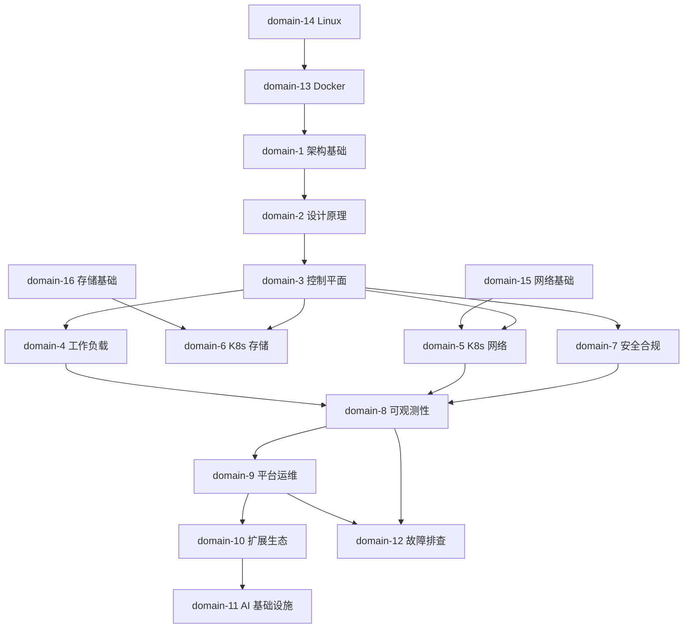
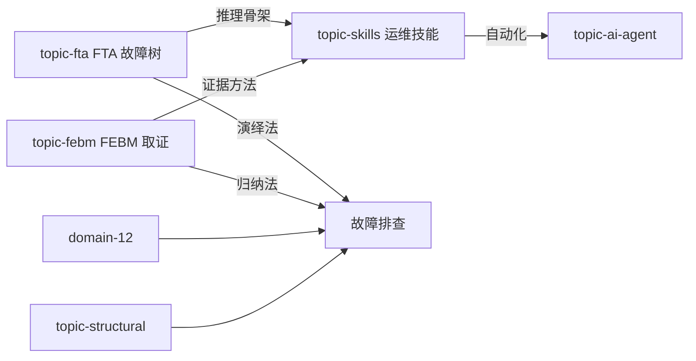
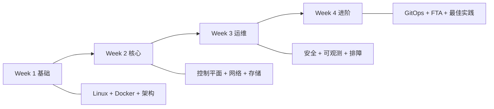

# 知识图谱 (Knowledge Map)

> 知识模块间的依赖关系和学习路径

---

## 核心知识图谱

---

## 方法论关系

---

## 学习路径

---

## 模块间依赖矩阵

| 模块 | 前置依赖 | 推荐后续 |
|:---|:---|:---|
| domain-1 架构 | domain-13 Docker | domain-2 设计原理 |
| domain-2 设计 | domain-1 架构 | domain-3 控制平面 |
| domain-3 控制平面 | domain-2 设计 | domain-4/5/6/7 |
| domain-5 网络 | domain-15 网络基础 | domain-12 排障 |
| domain-6 存储 | domain-16 存储基础 | domain-12 排障 |
| domain-8 可观测 | domain-3/4/5 | domain-9 平台运维 |
| domain-11 AI | domain-4 工作负载 | topic-ai-agent |
| domain-12 排障 | domain-1~8 任一 | topic-fta/skills |
| topic-fta | domain-12 排障基础 | topic-skills |
| topic-skills | topic-fta + domain-12 | topic-ai-agent |
