---
title: "监控与告警异常故障树分析"
category: skills
summary: "<!-- condition: kubectl get [[Pods|pods]] -n monitoring -o jsonpath='{range .items[?(@.status.phase!='Running')]} {.metadata.name}{\'\n\'}{end}' 显示监控组件异常 --> - **目标**：覆盖 Prometheus 采集失败、..."
tags: ["k8s", "fta", "troubleshooting"]
sources: ["domain-10-troubleshooting-diagnostics/topic-fta/list/monitoring-fta.md"]
created: 2026-05-21
updated: 2026-05-21
lifecycle: reviewed
lifecycle_changed: "2026-05-21"
tier: supporting
base_confidence: 0.7
---

# 监控与告警异常故障树分析

<!-- condition: kubectl get pods -n monitoring -o jsonpath='{range .items[?(@.status.phase!="Running")]} {.metadata.name}{\"\n\"}{end}' 显示监控组件异常 -->

# 监控与告警异常 FTA 树

## 适用范围与说明
- **目标**：覆盖 Prometheus 采集失败、服务发现异常、告警规则不触发、存储容量不足、远程写入失败与 Alertmanager 通知异常的关键成因与路径。
- **范围**：Prometheus 采集（scrape）、ServiceMonitor/PodMonitor 目标发现、告警规则（PrometheusRule）、Alertmanager 通知链路、TSDB 本地存储、远程写入/读取（Thanos/Mimir/VictoriaMetrics）。
- **符号**：
  - **OR 门**：任一子事件成立即可触发父事件
  - **AND 门**：所有子事件同时成立才触发父事件

---

## Mermaid FTA 树

```mermaid
flowchart TD
  TE["顶事件: 监控/告警异常<br/>指标缺失 / 告警不触发 / 通知失败"]
  OR0{{OR}}
  TE --> OR0

  %% ======== 一级分类 ========
  OR0 --> CAT_SCRAPE["A. 采集异常"]
  OR0 --> CAT_DISC["B. 服务发现异常"]
  OR0 --> CAT_ALERT["C. 告警规则异常"]
  OR0 --> CAT_AM["D. Alertmanager 通知异常"]
  OR0 --> CAT_STORE["E. 存储异常"]
  OR0 --> CAT_REMOTE["F. 远程写入/读取异常"]

  %% ======== A. 采集异常 ========
  A_OR{{OR}}
  CAT_SCRAPE --> A_OR
  A_OR --> A1["A1. Target 不可达<br/>网络/端口/路径错误"]
  A_OR --> A2["A2. 采集超时<br/>指标量过大/目标响应慢"]
  A_OR --> A3["A3. 指标格式错误<br/>非标准 Exposition format"]
  A_OR --> A4["A4. 认证/TLS 失败<br/>bearer_token/cert 错误"]
  A_OR --> A5_AND["A5. 采集黑洞<br/>(AND 门)"]

  A5_AND_GATE{{"AND"}}
  A5_AND --> A5_AND_GATE
  A5_AND_GATE --> A5C1["Target 采集持续失败"]
  A5_AND_GATE --> A5C2["缺少 up==0 告警规则"]

  %% ======== B. 服务发现 ========
  B_OR{{OR}}
  CAT_DISC --> B_OR
  B_OR --> B1["B1. ServiceMonitor 未匹配<br/>selector/namespace 不一致"]
  B_OR --> B2["B2. RBAC 权限不足<br/>无法 list/watch Endpoints"]
  B_OR --> B3["B3. EndpointSlice 发现异常<br/>控制器版本问题"]
  B_OR --> B4["B4. Target 频繁变更<br/>Pod 反复重建"]

  %% ======== C. 告警规则 ========
  C_OR{{OR}}
  CAT_ALERT --> C_OR
  C_OR --> C1["C1. 规则语法错误<br/>PromQL 不合法"]
  C_OR --> C2["C2. 阈值配置不当<br/>过高/过低/硬编码"]
  C_OR --> C3["C3. for 持续时间过长<br/>短暂问题无法触发"]
  C_OR --> C4["C4. 规则评估失败<br/>依赖指标不存在"]
  C_OR --> C5_AND["C5. 告警完全失效<br/>(AND 门)"]

  C5_AND_GATE{{"AND"}}
  C5_AND --> C5_AND_GATE
  C5_AND_GATE --> C5C1["规则评估持续报错"]
  C5_AND_GATE --> C5C2["缺少元告警监控规则评估状态"]

  %% ======== D. Alertmanager ========
  D_OR{{OR}}
  CAT_AM --> D_OR
  D_OR --> D1["D1. Alertmanager 不可用<br/>Pod 崩溃/未部署"]
  D_OR --> D2["D2. 路由配置错误<br/>告警匹配到错误接收者"]
  D_OR --> D3["D3. 通知渠道异常<br/>Webhook/Email/IM 不可达"]
  D_OR --> D4["D4. 静默/抑制规则误配<br/>合法告警被抑制"]
  D_OR --> D5_AND["D5. 通知静默丢失<br/>(AND 门)"]

  D5_AND_GATE{{"AND"}}
  D5_AND --> D5_AND_GATE
  D5_AND_GATE --> D5C1["通知渠道发送失败"]
  D5_AND_GATE --> D5C2["缺少通知失败的元告警"]

  %% ======== E. 存储 ========
  E_OR{{OR}}
  CAT_STORE --> E_OR
  E_OR --> E1["E1. TSDB 磁盘空间不足<br/>retention 过长"]
  E_OR --> E2["E2. TSDB 损坏<br/>WAL/块文件损坏"]
  E_OR --> E3["E3. 高基数问题<br/>label 爆炸导致 OOM"]
  E_OR --> E4["E4. 查询超时<br/>数据量过大/查询过重"]

  %% ======== F. 远程写入 ========
  F_OR{{OR}}
  CAT_REMOTE --> F_OR
  F_OR --> F1["F1. 远端不可达<br/>网络/Endpoint 异常"]
  F_OR --> F2["F2. 鉴权失败<br/>Token/Password 过期"]
  F_OR --> F3["F3. 远端限流/拒绝<br/>写入速率超限"]
  F_OR --> F4["F4. WAL 持续增长<br/>远程写入滞后"]
```

---

## 生产级观测与证据

| 类别 | 关键信号 |
|------|---------|
| **事件** | Prometheus Operator PrometheusRule 同步事件、ServiceMonitor 

## 相关链接

- [[skills/FTA Methodology and Core Principles.md|FTA 方法论]]
- [[skills/FTA Diagnostic Execution Engine.md|FTA 诊断执行引擎]]
- [[ts-monitoring-observability|监控可观测性排查]]

## Related

- [[thanos]] — Thanos
- [[prometheus]] — Prometheus
