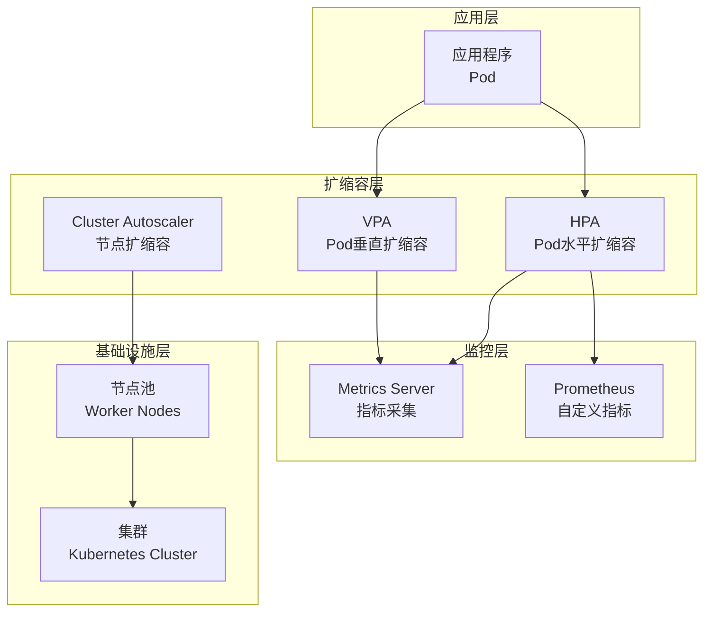

# Kubernetes 扩缩容最佳实践

> **适用版本**: Kubernetes v1.25-v1.32 | **最后更新**: 2026-05 | **作者**: 系统生成 | **质量等级**: ⭐⭐⭐⭐⭐ 专家级

> **生产环境实战经验总结**: 基于大规模集群扩缩容运维经验，涵盖从HPA到集群自动扩缩容的全方位最佳实践

---

## 概述

本指南提供生产环境 Kubernetes 扩缩容配置的最佳实践，帮助团队构建高效、可靠、成本优化的自动扩缩容体系。

### 目标读者

- **SRE**: 了解扩缩容架构设计和故障排查
- **DevOps 工程师**: 掌握HPA和VPA配置
- **平台工程师**: 学习集群自动扩缩容和成本优化

### 前置知识

- Kubernetes 核心概念（Pod、Deployment、Node）
- 资源管理基础（requests、limits、QoS）
- 监控基础（指标、告警）

---

## 问题描述

### 常见问题

**问题1：扩缩容响应慢**
- **症状**：流量高峰时扩缩容响应慢
- **原因**：HPA配置不当，指标采集延迟
- **影响**：服务性能下降，用户体验差

**问题2：扩缩容震荡**
- **症状**：Pod数量频繁变化
- **原因**：扩缩容阈值设置不当，指标波动大
- **影响**：资源浪费，服务不稳定

**问题3：成本超支**
- **症状**：资源使用率低，成本高
- **原因**：扩缩容策略不当，资源预留过多
- **影响**：成本超支，资源浪费

---

## 解决方案

### 扩缩容架构设计

**扩缩容架构设计原则**：
- **响应迅速**：快速响应负载变化
- **稳定可靠**：避免扩缩容震荡
- **成本优化**：合理使用资源
- **分层扩展**：Pod、节点、集群三层扩展

**扩缩容架构图**：



### 关键配置

#### 1. HPA配置

```yaml
# HPA配置
apiVersion: autoscaling/v2
kind: HorizontalPodAutoscaler
metadata:
  name: myapp-hpa
  namespace: production
spec:
  scaleTargetRef:
    apiVersion: apps/v1
    kind: Deployment
    name: myapp
  minReplicas: 2
  maxReplicas: 10
  metrics:
  - type: Resource
    resource:
      name: cpu
      target:
        type: Utilization
        averageUtilization: 70
  - type: Resource
    resource:
      name: memory
      target:
        type: Utilization
        averageUtilization: 80
  behavior:
    scaleDown:
      stabilizationWindowSeconds: 300
      policies:
      - type: Percent
        value: 10
        periodSeconds: 60
    scaleUp:
      stabilizationWindowSeconds: 60
      policies:
      - type: Percent
        value: 100
        periodSeconds: 60
```

#### 2. VPA配置

```yaml
# VPA配置
apiVersion: autoscaling.k8s.io/v1
kind: VerticalPodAutoscaler
metadata:
  name: myapp-vpa
  namespace: production
spec:
  targetRef:
    apiVersion: apps/v1
    kind: Deployment
    name: myapp
  updatePolicy:
    updateMode: "Auto"
  resourcePolicy:
    containerPolicies:
    - containerName: myapp
      minAllowed:
        cpu: 100m
        memory: 128Mi
      maxAllowed:
        cpu: 2
        memory: 2Gi
      controlledResources: ["cpu", "memory"]
```

#### 3. Cluster Autoscaler配置

```yaml
# Cluster Autoscaler配置
apiVersion: apps/v1
kind: Deployment
metadata:
  name: cluster-autoscaler
  namespace: kube-system
spec:
  replicas: 1
  selector:
    matchLabels:
      app: cluster-autoscaler
  template:
    metadata:
      labels:
        app: cluster-autoscaler
    spec:
      containers:
      - name: cluster-autoscaler
        image: k8s.gcr.io/autoscaling/cluster-autoscaler:v1.28.0
        command:
        - ./cluster-autoscaler
        - --v=4
        - --cloud-provider=aws
        - --skip-nodes-with-local-storage=false
        - --expander=least-waste
        - --node-group-auto-discovery=asg:tag=k8s.io/cluster-autoscaler/enabled,k8s.io/cluster-autoscaler/mycluster
        - --balance-similar-node-groups
        - --skip-nodes-with-system-pods=false
```

---

## 实施步骤

### 前置条件

**硬件要求**：
- Metrics Server已安装
- 支持自动扩缩容的云服务商

**软件要求**：
- Kubernetes：v1.25+
- Metrics Server：v0.6+
- Cluster Autoscaler：v1.28+

### 步骤1：安装Metrics Server

> ⚠️ **🟡 中危变更** — 变更集群资源状态，建议先 --dry-run 或 diff 确认
> - `helm upgrade/install`：部署/升级 release

```bash
#!/bin/bash
# 安装Metrics Server

# 1. 添加Helm仓库
helm repo add metrics-server https://kubernetes-sigs.github.io/metrics-server/
helm repo update

# 2. 安装Metrics Server
helm install metrics-server metrics-server/metrics-server \
  --namespace kube-system \
  --set args[0]=--kubelet-insecure-tls

# 3. 验证安装
kubectl get pods -n kube-system | grep metrics-server
```

### 步骤2：配置HPA

> ⚠️ **🟡 中危变更** — 变更集群资源状态，建议先 --dry-run 或 diff 确认
> - `kubectl apply/create/replace`：创建/变更集群资源

```bash
#!/bin/bash
# 配置HPA

# 1. 创建HPA
cat <<EOF | kubectl apply -f -
apiVersion: autoscaling/v2
kind: HorizontalPodAutoscaler
metadata:
  name: myapp-hpa
  namespace: production
spec:
  scaleTargetRef:
    apiVersion: apps/v1
    kind: Deployment
    name: myapp
  minReplicas: 2
  maxReplicas: 10
  metrics:
  - type: Resource
    resource:
      name: cpu
      target:
        type: Utilization
        averageUtilization: 70
  - type: Resource
    resource:
      name: memory
      target:
        type: Utilization
        averageUtilization: 80
  behavior:
    scaleDown:
      stabilizationWindowSeconds: 300
      policies:
      - type: Percent
        value: 10
        periodSeconds: 60
    scaleUp:
      stabilizationWindowSeconds: 60
      policies:
      - type: Percent
        value: 100
        periodSeconds: 60
EOF

# 2. 验证HPA
kubectl get hpa -n production
```

### 步骤3：配置VPA

> ⚠️ **🟡 中危变更** — 变更集群资源状态，建议先 --dry-run 或 diff 确认
> - `kubectl apply/create/replace`：创建/变更集群资源

```bash
#!/bin/bash
# 配置VPA

# 1. 安装VPA
git clone https://github.com/kubernetes/autoscaler.git
cd autoscaler/vertical-pod-autoscaler
./hack/vpa-up.sh

# 2. 创建VPA
cat <<EOF | kubectl apply -f -
apiVersion: autoscaling.k8s.io/v1
kind: VerticalPodAutoscaler
metadata:
  name: myapp-vpa
  namespace: production
spec:
  targetRef:
    apiVersion: apps/v1
    kind: Deployment
    name: myapp
  updatePolicy:
    updateMode: "Auto"
  resourcePolicy:
    containerPolicies:
    - containerName: myapp
      minAllowed:
        cpu: 100m
        memory: 128Mi
      maxAllowed:
        cpu: 2
        memory: 2Gi
      controlledResources: ["cpu", "memory"]
EOF

# 3. 验证VPA
kubectl get vpa -n production
```

### 步骤4：配置Cluster Autoscaler

> ⚠️ **🟡 中危变更** — 变更集群资源状态，建议先 --dry-run 或 diff 确认
> - `kubectl apply/create/replace`：创建/变更集群资源

```bash
#!/bin/bash
# 配置Cluster Autoscaler

# 1. 创建IAM角色
aws iam create-role \
  --role-name cluster-autoscaler \
  --assume-role-policy-document file://trust-policy.json

# 2. 附加策略
aws iam attach-role-policy \
  --role-name cluster-autoscaler \
  --policy-arn arn:aws:iam::policy/AmazonEKSClusterAutoscalerPolicy

# 3. 部署Cluster Autoscaler
kubectl apply -f cluster-autoscaler.yaml

# 4. 验证部署
kubectl get pods -n kube-system | grep cluster-autoscaler
```

---

## 验证方法

### 自动化验证脚本

```bash
#!/bin/bash
# 扩缩容配置验证脚本

echo "=== Kubernetes 扩缩容配置验证 ==="
echo "验证时间: $(date)"
echo ""

# 1. 检查Metrics Server
echo "1. Metrics Server状态:"
kubectl get pods -n kube-system | grep metrics-server
echo ""

# 2. 检查HPA状态
echo "2. HPA状态:"
kubectl get hpa -n production
echo ""

# 3. 检查VPA状态
echo "3. VPA状态:"
kubectl get vpa -n production
echo ""

# 4. 检查Cluster Autoscaler
echo "4. Cluster Autoscaler状态:"
kubectl get pods -n kube-system | grep cluster-autoscaler
echo ""

# 5. 测试扩缩容
echo "5. 扩缩容测试:"
kubectl run load-test --image=busybox --rm -it --restart=Never -- /bin/sh -c "while true; do wget -qO- http://myapp.production.svc.cluster.local; done"
echo ""

echo "=== 验证完成 ==="
```

### 手动验证清单

**HPA验证**：
- [ ] HPA配置正确
- [ ] 指标采集正常
- [ ] 扩缩容响应正常
- [ ] 扩缩容策略生效

**VPA验证**：
- [ ] VPA配置正确
- [ ] 资源推荐合理
- [ ] 自动更新正常
- [ ] 资源限制生效

**Cluster Autoscaler验证**：
- [ ] Cluster Autoscaler运行正常
- [ ] 节点扩缩容正常
- [ ] 成本优化生效
- [ ] 扩缩容日志正常

---

## 常见陷阱

### 陷阱1：HPA指标配置不当

**问题**：HPA指标配置不当，导致扩缩容震荡。

**后果**：Pod数量频繁变化，资源浪费。

**正确做法**：
```yaml
# 配置合适的扩缩容行为
apiVersion: autoscaling/v2
kind: HorizontalPodAutoscaler
spec:
  behavior:
    scaleDown:
      stabilizationWindowSeconds: 300  # 5分钟稳定窗口
      policies:
      - type: Percent
        value: 10  # 每次最多缩容10%
        periodSeconds: 60
    scaleUp:
      stabilizationWindowSeconds: 60  # 1分钟稳定窗口
      policies:
      - type: Percent
        value: 100  # 每次最多扩容100%
        periodSeconds: 60
```

### 陷阱2：VPA与HPA冲突

**问题**：VPA和HPA同时配置，导致冲突。

**后果**：扩缩容行为异常，资源管理混乱。

**正确做法**：
```yaml
# 选择合适的扩缩容策略
# 方案1：仅使用HPA（推荐）
apiVersion: autoscaling/v2
kind: HorizontalPodAutoscaler
spec:
  metrics:
  - type: Resource
    resource:
      name: cpu
      target:
        type: Utilization
        averageUtilization: 70

# 方案2：仅使用VPA
apiVersion: autoscaling.k8s.io/v1
kind: VerticalPodAutoscaler
spec:
  updatePolicy:
    updateMode: "Auto"
```

### 陷阱3：Cluster Autoscaler配置不当

**问题**：Cluster Autoscaler配置不当，导致节点扩缩容失败。

**后果**：资源不足，服务中断。

**正确做法**：
```yaml
# 配置合适的Cluster Autoscaler
apiVersion: apps/v1
kind: Deployment
spec:
  template:
    spec:
      containers:
      - name: cluster-autoscaler
        command:
        - ./cluster-autoscaler
        - --balance-similar-node-groups  # 平衡节点组
        - --skip-nodes-with-system-pods=false  # 允许缩容有系统Pod的节点
        - --expander=least-waste  # 选择浪费最少的节点组
```

---

## 相关资源

### 官方文档
- [HPA](https://kubernetes.io/docs/tasks/run-application/horizontal-pod-autoscale/)
- [VPA](https://github.com/kubernetes/autoscaler/tree/master/vertical-pod-autoscaler)
- [Cluster Autoscaler](https://github.com/kubernetes/autoscaler/tree/master/cluster-autoscaler)

### 工具推荐
- [Metrics Server](https://github.com/kubernetes-sigs/metrics-server) - 指标采集
- [KEDA](https://keda.sh/) - 事件驱动自动扩缩容
- [Cluster Autoscaler](https://github.com/kubernetes/autoscaler/tree/master/cluster-autoscaler) - 集群自动扩缩容

### 参考案例
- [HPA配置](https://kubernetes.io/docs/tasks/run-application/horizontal-pod-autoscale/)
- [Cluster Autoscaler部署](https://github.com/kubernetes/autoscaler/blob/master/cluster-autoscaler/cloudprovider/aws/README.md)

---

## 版本历史

| 版本 | 日期 | 变更说明 | 作者 |
|------|------|----------|------|
| v1.0 | 2026-05 | 初始版本 | 系统生成 |

---

**最佳实践原则**: 具体、可操作、可验证、可维护

---

**文档维护**：定期审查和更新，确保与Kubernetes版本和自动扩缩容工具版本保持同步