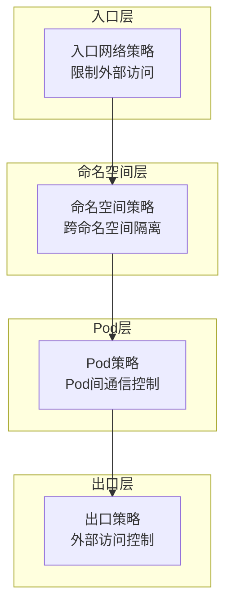

# Kubernetes 网络安全最佳实践

> **适用版本**: Kubernetes v1.25-v1.32 | **最后更新**: 2026-05 | **作者**: 系统生成 | **质量等级**: ⭐⭐⭐⭐⭐ 专家级

> **生产环境实战经验总结**: 基于大规模集群网络安全运维经验，涵盖从网络策略到服务网格的全方位最佳实践

---

## 概述

本指南提供生产环境 Kubernetes 网络安全配置的最佳实践，帮助团队构建安全、可控、可审计的网络基础设施。

### 目标读者

- **安全工程师**: 了解Kubernetes网络安全架构和策略配置
- **网络工程师**: 掌握网络策略和服务网格配置
- **SRE**: 学习网络安全故障排查和监控

### 前置知识

- Kubernetes 核心概念（Pod、Service、Namespace）
- 网络安全基础（防火墙、ACL、加密）
- 服务网格基础（Istio、Linkerd）

---

## 问题描述

### 常见问题

**问题1：未授权访问**
- **症状**：Pod间未授权通信
- **原因**：网络策略缺失，所有流量默认允许
- **影响**：安全风险，横向攻击

**问题2：数据泄露**
- **症状**：敏感数据在传输中泄露
- **原因**：未加密的服务间通信
- **影响**：数据泄露，合规问题

**问题3：网络攻击**
- **症状**：DDoS攻击、中间人攻击
- **原因**：缺乏网络防护和加密
- **影响**：服务中断，数据篡改

---

## 解决方案

### 网络策略设计

**网络策略设计原则**：
- **默认拒绝**：所有流量默认拒绝
- **最小权限**：仅允许必要的通信
- **分层防护**：多层网络策略
- **可观测性**：网络流量监控和审计

**网络策略层次**：



### 关键配置

#### 1. 默认拒绝策略

```yaml
# 默认拒绝所有流量
apiVersion: networking.k8s.io/v1
kind: NetworkPolicy
metadata:
  name: default-deny-all
  namespace: production
spec:
  podSelector: {}
  policyTypes:
  - Ingress
  - Egress
```

#### 2. 命名空间隔离策略

```yaml
# 限制跨命名空间通信
apiVersion: networking.k8s.io/v1
kind: NetworkPolicy
metadata:
  name: deny-from-other-namespaces
  namespace: production
spec:
  podSelector: {}
  policyTypes:
  - Ingress
  ingress:
  - from:
    - podSelector: {}
```

#### 3. 应用层策略

```yaml
# 允许前端访问后端
apiVersion: networking.k8s.io/v1
kind: NetworkPolicy
metadata:
  name: allow-frontend-to-backend
  namespace: production
spec:
  podSelector:
    matchLabels:
      app: backend
  policyTypes:
  - Ingress
  ingress:
  - from:
    - podSelector:
        matchLabels:
          app: frontend
    ports:
    - protocol: TCP
      port: 8080
---
# 允许后端访问数据库
apiVersion: networking.k8s.io/v1
kind: NetworkPolicy
metadata:
  name: allow-backend-to-database
  namespace: production
spec:
  podSelector:
    matchLabels:
      app: database
  policyTypes:
  - Ingress
  ingress:
  - from:
    - podSelector:
        matchLabels:
          app: backend
    ports:
    - protocol: TCP
      port: 5432
```

#### 4. 出口策略

```yaml
# 限制出口流量
apiVersion: networking.k8s.io/v1
kind: NetworkPolicy
metadata:
  name: restrict-egress
  namespace: production
spec:
  podSelector: {}
  policyTypes:
  - Egress
  egress:
  # 允许DNS查询
  - to:
    - namespaceSelector:
        matchLabels:
          kubernetes.io/metadata.name: kube-system
    ports:
    - protocol: UDP
      port: 53
    - protocol: TCP
      port: 53
  # 允许访问特定外部服务
  - to:
    - ipBlock:
        cidr: 10.0.0.0/8
    ports:
    - protocol: TCP
      port: 443
```

### 服务网格配置

**Istio安全配置**：

```yaml
# 启用mTLS
apiVersion: security.istio.io/v1beta1
kind: PeerAuthentication
metadata:
  name: default
  namespace: istio-system
spec:
  mtls:
    mode: STRICT
---
# 授权策略
apiVersion: security.istio.io/v1beta1
kind: AuthorizationPolicy
metadata:
  name: frontend-to-backend
  namespace: production
spec:
  selector:
    matchLabels:
      app: backend
  rules:
  - from:
    - source:
        principals: ["cluster.local/ns/production/sa/frontend"]
    to:
    - operation:
        methods: ["GET", "POST"]
        paths: ["/api/*"]
```

---

## 实施步骤

### 前置条件

**硬件要求**：
- 支持网络策略的CNI插件（Calico、Cilium、Weave）
- 支持服务网格的基础设施

**软件要求**：
- Kubernetes：v1.25+
- CNI插件：Calico 3.24+ / Cilium 1.12+
- 服务网格：Istio 1.18+ / Linkerd 2.13+

### 步骤1：启用网络策略支持

> ⚠️ **🟡 中危变更** — 变更集群资源状态，建议先 --dry-run 或 diff 确认
> - `kubectl apply/create/replace`：创建/变更集群资源

```bash
#!/bin/bash
# 启用网络策略支持

# 1. 检查CNI插件支持
kubectl get pods -n kube-system | grep -E "calico|cilium|weave"

# 2. 验证网络策略支持
cat <<EOF | kubectl apply -f -
apiVersion: networking.k8s.io/v1
kind: NetworkPolicy
metadata:
  name: test-policy
  namespace: default
spec:
  podSelector: {}
  policyTypes:
  - Ingress
EOF

# 3. 检查策略状态
kubectl get networkpolicy -n default
```

### 步骤2：配置默认拒绝策略

> ⚠️ **🟡 中危变更** — 变更集群资源状态，建议先 --dry-run 或 diff 确认
> - `kubectl apply/create/replace`：创建/变更集群资源

```bash
#!/bin/bash
# 配置默认拒绝策略

# 1. 为生产命名空间配置默认拒绝
cat <<EOF | kubectl apply -f -
apiVersion: networking.k8s.io/v1
kind: NetworkPolicy
metadata:
  name: default-deny-all
  namespace: production
spec:
  podSelector: {}
  policyTypes:
  - Ingress
  - Egress
EOF

# 2. 允许DNS查询
cat <<EOF | kubectl apply -f -
apiVersion: networking.k8s.io/v1
kind: NetworkPolicy
metadata:
  name: allow-dns
  namespace: production
spec:
  podSelector: {}
  policyTypes:
  - Egress
  egress:
  - to:
    - namespaceSelector:
        matchLabels:
          kubernetes.io/metadata.name: kube-system
    ports:
    - protocol: UDP
      port: 53
    - protocol: TCP
      port: 53
EOF

# 3. 验证策略
kubectl get networkpolicy -n production
```

### 步骤3：配置应用网络策略

> ⚠️ **🟡 中危变更** — 变更集群资源状态，建议先 --dry-run 或 diff 确认
> - `kubectl apply/create/replace`：创建/变更集群资源

```bash
#!/bin/bash
# 配置应用网络策略

# 1. 允许前端访问后端
cat <<EOF | kubectl apply -f -
apiVersion: networking.k8s.io/v1
kind: NetworkPolicy
metadata:
  name: allow-frontend-to-backend
  namespace: production
spec:
  podSelector:
    matchLabels:
      app: backend
  policyTypes:
  - Ingress
  ingress:
  - from:
    - podSelector:
        matchLabels:
          app: frontend
    ports:
    - protocol: TCP
      port: 8080
EOF

# 2. 允许后端访问数据库
cat <<EOF | kubectl apply -f -
apiVersion: networking.k8s.io/v1
kind: NetworkPolicy
metadata:
  name: allow-backend-to-database
  namespace: production
spec:
  podSelector:
    matchLabels:
      app: database
  policyTypes:
  - Ingress
  ingress:
  - from:
    - podSelector:
        matchLabels:
          app: backend
    ports:
    - protocol: TCP
      port: 5432
EOF

# 3. 验证策略
kubectl describe networkpolicy -n production
```

### 步骤4：安装服务网格

> ⚠️ **🟡 中危变更** — 变更集群资源状态，建议先 --dry-run 或 diff 确认
> - `kubectl label/annotate`：改元数据可能影响选择器/控制器

```bash
#!/bin/bash
# 安装Istio服务网格

# 1. 下载Istio
curl -L https://istio.io/downloadIstio | ISTIO_VERSION=1.19.0 sh -
cd istio-1.19.0
export PATH=$PWD/bin:$PATH

# 2. 安装Istio
istioctl install --set profile=default -y

# 3. 启用自动注入
kubectl label namespace production istio-injection=enabled

# 4. 验证安装
kubectl get pods -n istio-system
```

---

## 验证方法

### 自动化验证脚本

```bash
#!/bin/bash
# 网络安全配置验证脚本

echo "=== Kubernetes 网络安全配置验证 ==="
echo "验证时间: $(date)"
echo ""

# 1. 检查网络策略
echo "1. 网络策略:"
kubectl get networkpolicy --all-namespaces
echo ""

# 2. 检查默认拒绝策略
echo "2. 默认拒绝策略:"
kubectl get networkpolicy -n production -o name | grep "default-deny"
echo ""

# 3. 检查DNS策略
echo "3. DNS策略:"
kubectl get networkpolicy -n production -o name | grep "allow-dns"
echo ""

# 4. 检查服务网格
echo "4. 服务网格状态:"
kubectl get pods -n istio-system
echo ""

# 5. 检查mTLS配置
echo "5. mTLS配置:"
kubectl get peerauthentication --all-namespaces
echo ""

# 6. 测试网络连通性
echo "6. 网络连通性测试:"
kubectl run test-pod --image=busybox --rm -it --restart=Never -- wget -qO- http://backend.production.svc.cluster.local:8080
echo ""

echo "=== 验证完成 ==="
```

### 手动验证清单

**网络策略验证**：
- [ ] 默认拒绝策略生效
- [ ] 允许的通信正常
- [ ] 拒绝的通信被阻断
- [ ] 策略变更生效

**服务网格验证**：
- [ ] 服务网格安装成功
- [ ] mTLS配置正确
- [ ] 授权策略生效
- [ ] 流量监控正常

**网络安全验证**：
- [ ] 无未授权访问
- [ ] 数据传输加密
- [ ] 网络攻击防护
- [ ] 审计日志完整

---

## 常见陷阱

### 陷阱1：策略冲突

**问题**：多个网络策略同时生效，导致预期外的流量被阻断。

**后果**：服务间通信异常，难以排查。

**正确做法**：
```bash
# 查看所有网络策略
kubectl get networkpolicy --all-namespaces -o yaml

# 查看特定Pod的策略
kubectl describe pod <pod-name> -n <namespace>

# 测试网络连通性
kubectl run test-pod --image=busybox --rm -it --restart=Never -- wget -qO- http://<service-name>
```

### 陷阱2：DNS策略缺失

**问题**：配置了默认拒绝策略但未允许DNS查询。

**后果**：Service发现失败，应用无法找到后端服务。

**正确做法**：
```yaml
# 允许DNS查询
apiVersion: networking.k8s.io/v1
kind: NetworkPolicy
metadata:
  name: allow-dns
spec:
  podSelector: {}
  policyTypes:
  - Egress
  egress:
  - to:
    - namespaceSelector:
        matchLabels:
          kubernetes.io/metadata.name: kube-system
    ports:
    - protocol: UDP
      port: 53
    - protocol: TCP
      port: 53
```

### 陷阱3：服务网格注入失败

**问题**：Pod未自动注入服务网格sidecar。

**后果**：服务网格功能不生效，mTLS未启用。

**正确做法**：

> ⚠️ **🟡 中危变更** — 变更集群资源状态，建议先 --dry-run 或 diff 确认
> - `kubectl apply/create/replace`：创建/变更集群资源

```bash
# 检查命名空间标签
kubectl get namespace -L istio-injection

# 检查Pod注入状态
kubectl get pod -n production -o jsonpath='{range .items[*]}{.metadata.name}{"\t"}{.spec.containers[*].name}{"\n"}{end}'

# 手动注入
istioctl kube-inject -f pod.yaml | kubectl apply -f -
```

---

## 相关资源

### 官方文档
- [网络策略](https://kubernetes.io/docs/concepts/services-networking/network-policies/)
- [Service](https://kubernetes.io/docs/concepts/services-networking/service/)
- [Ingress](https://kubernetes.io/docs/concepts/services-networking/ingress/)

### 工具推荐
- [Calico](https://docs.tigera.io/calico/) - 网络策略
- [Cilium](https://docs.cilium.io/) - eBPF网络
- [Istio](https://istio.io/) - 服务网格

### 参考案例
- [Calico网络策略](https://docs.tigera.io/calico/latest/networking/policy/)
- [Istio安全](https://istio.io/latest/docs/concepts/security/)

---

## 版本历史

| 版本 | 日期 | 变更说明 | 作者 |
|------|------|----------|------|
| v1.0 | 2026-05 | 初始版本 | 系统生成 |

---

**最佳实践原则**: 具体、可操作、可验证、可维护

---

**文档维护**：定期审查和更新，确保与Kubernetes版本和服务网格版本保持同步