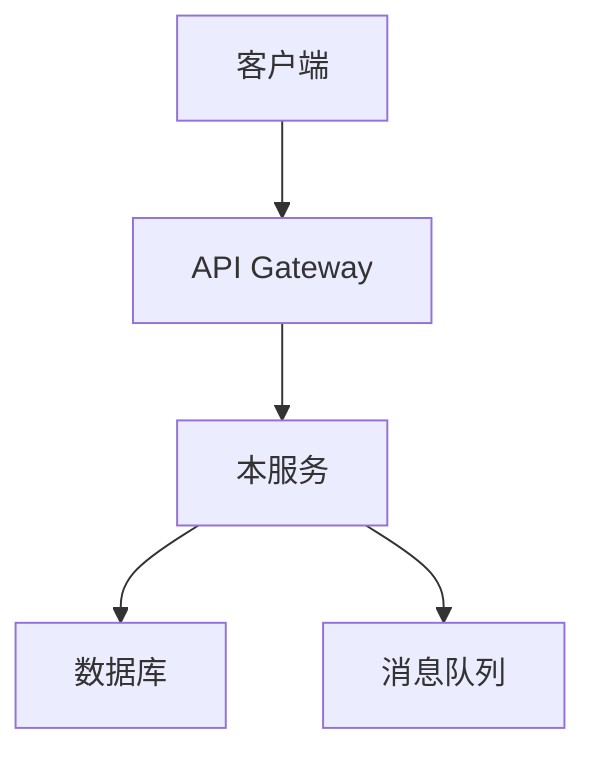

# 开发者入职自动化

## 1. 概述

开发者入职自动化通过标准化环境搭建、模板化项目创建、自助式资源申请，将新人上手时间从数天缩短到数小时。本文档覆盖从开发环境到生产部署的完整自助服务链路。

## 2. 入职流程全景

```
开发者入职自动化流程:

Day 1: 账号与权限
  ├── SSO 自动创建 → GitHub/GitLab 账号
  ├── RBAC 自动分配 → 基于团队角色
  └── 自助 API 密钥申请

Day 1-2: 开发环境
  ├── DevContainer 一键启动
  ├── Nix 开发环境声明
  └── Tilt 本地开发集群

Day 2-3: 项目上手
  ├── Scaffolder 模板项目
  ├── 文档即代码 (TechDocs)
  └── API Explorer 交互式文档

Day 3-5: 生产就绪
  ├── CI/CD Pipeline 配置
  ├── 监控 Dashboard 创建
  └── 告警规则配置
```

## 3. 环境一键搭建

### 3.1 DevContainer 配置

```json
// .devcontainer/devcontainer.json
{
  "name": "KuDig Development",
  "image": "mcr.microsoft.com/devcontainers/go:1.22",
  "features": {
    "ghcr.io/devcontainers/features/docker-in-docker:2": {},
    "ghcr.io/devcontainers/features/kubectl-helm:1": {},
    "ghcr.io/devcontainers/features/terraform:1": {}
  },
  "customizations": {
    "vscode": {
      "extensions": [
        "golang.go",
        "ms-kubernetes-tools.vscode-kubernetes-tools",
        "hashicorp.terraform",
        "redhat.vscode-yaml",
        "eamodio.gitlens"
      ],
      "settings": {
        "go.lintTool": "golangci-lint",
        "go.lintFlags": ["--fast"],
        "editor.formatOnSave": true
      }
    }
  },
  "forwardPorts": [8080, 9090, 5432],
  "postCreateCommand": "make setup",
  "postStartCommand": "make dev-up",
  "mounts": [
    "source=${localWorkspaceFolder},target=/workspace,type=bind,consistency=cached"
  ]
}
```

### 3.2 Nix 开发环境

```nix
# flake.nix
{
  description = "KuDig Development Environment";

  inputs = {
    nixpkgs.url = "github:NixOS/nixpkgs/nixos-unstable";
    flake-utils.url = "github:numtide/flake-utils";
  };

  outputs = { self, nixpkgs, flake-utils }:
    flake-utils.lib.eachDefaultSystem (system:
      let
        pkgs = nixpkgs.legacyPackages.${system};
      in {
        devShells.default = pkgs.mkShell {
          buildInputs = with pkgs; [
            # 语言工具
            go_1_22
            golangci-lint
            gotestsum

            # 容器工具
            docker
            docker-compose
            podman

            # Kubernetes 工具
            kubectl
            kustomize
            helm
            k9s
            stern

            # 云工具
            terraform
            awscli2

            # 数据库工具
            postgresql
            redis

            # 开发工具
            jq
            yq
            grpcurl
            protobuf
          ];

          shellHook = ''
            export GOPATH="$HOME/go"
            export PATH="$GOPATH/bin:$PATH"
            export KUBECONFIG="$HOME/.kube/config"
            echo "🚀 KuDig development environment loaded!"
          '';
        };
      });
}
```

### 3.3 Tilt 本地开发

```python
# Tiltfile - 本地开发环境编排
load('ext://helm_resource', 'helm_resource')

# 构建本地镜像
docker_build(
    'registry.local/order-service',
    context='.',
    dockerfile='Dockerfile.dev',
    live_update=[
        sync('./cmd', '/app/cmd'),
        sync('./internal', '/app/internal'),
        run('go build ./cmd/order-service', trigger=['./cmd', './internal']),
    ]
)

# 部署到本地 K8s
k8s_yaml([
    kustomize('k8s/overlays/local'),
])

# 依赖服务
helm_resource(
    'postgres',
    'oci://registry-1.docker.io/bitnamicharts/postgresql',
    namespace='dev',
    set=[
        'auth.postgresPassword=devpass',
        'primary.persistence.size=1Gi',
    ]
)

helm_resource(
    'redis',
    'oci://registry-1.docker.io/bitnamicharts/redis',
    namespace='dev',
    set=[
        'auth.password=devpass',
    ]
)

# 端口转发
k8s_resource(
    'order-service',
    port_forwards=[
        port_forward(8080, 8080, name='API'),
        port_forward(2345, 2345, name='Debugger'),
    ],
    resource_deps=['postgres', 'redis'],
)

# 监控栈
docker_compose('docker-compose.monitoring.yml')
```

## 4. 模板项目 (Scaffolder)

### 4.1 Backstage Scaffolder 模板

```yaml
# Backstage Scaffolder 模板: 微服务模板
apiVersion: scaffolder.backstage.io/v1beta3
kind: Template
metadata:
  name: create-microservice
  title: 创建微服务
  description: 从模板创建一个新的微服务项目
  tags:
    - go
    - microservice
    - template
spec:
  owner: platform-team
  type: service

  parameters:
    - title: 服务信息
      required:
        - name
        - owner
        - description
      properties:
        name:
          title: 服务名称
          type: string
          pattern: '^[a-z][a-z0-9-]*[a-z0-9]$'
          description: 小写字母、数字和连字符，如 order-service
        description:
          title: 服务描述
          type: string
          maxLength: 200
        owner:
          title: 负责团队
          type: string
          ui:field: OwnerPicker
          ui:options:
            catalogFilter:
              - kind: Group

    - title: 技术选型
      properties:
        language:
          title: 编程语言
          type: string
          enum:
            - go
            - java
            - python
            - node
          default: go
        database:
          title: 数据库
          type: string
          enum:
            - postgresql
            - mysql
            - mongodb
            - none
          default: postgresql
        messaging:
          title: 消息队列
          type: string
          enum:
            - kafka
            - rabbitmq
            - nats
            - none
          default: kafka

    - title: 部署配置
      properties:
        namespace:
          title: Kubernetes 命名空间
          type: string
          default: default
        replicas:
          title: 副本数
          type: number
          default: 2
          minimum: 1
          maximum: 10

  steps:
    - id: fetch-template
      name: 获取模板
      action: fetch:template
      input:
        url: ./templates/microservice-go
        targetPath: ${{ parameters.name }}
        values:
          name: ${{ parameters.name }}
          description: ${{ parameters.description }}
          owner: ${{ parameters.owner }}
          language: ${{ parameters.language }}
          database: ${{ parameters.database }}
          messaging: ${{ parameters.messaging }}

    - id: create-repo
      name: 创建仓库
      action: github:repo:create
      input:
        repoUrl: github.com?repo=${{ parameters.name }}&owner=${{ parameters.owner }}
        description: ${{ parameters.description }}
        defaultBranch: main
        visibility: internal

    - id: register-catalog
      name: 注册到目录
      action: catalog:register
      input:
        repoContentsUrl: ${{ steps['create-repo'].output.repoContentsUrl }}
        catalogInfoPath: /catalog-info.yaml

    - id: create-namespace
      name: 创建 K8s 命名空间
      action: kubernetes:create-namespace
      input:
        namespace: ${{ parameters.namespace }}

    - id: setup-ci
      name: 配置 CI/CD
      action: github:actions:create
      input:
        repoUrl: github.com?repo=${{ parameters.name }}&owner=${{ parameters.owner }}
        workflowPath: .github/workflows/ci.yml

  output:
    links:
      - title: 仓库地址
        url: ${{ steps['create-repo'].output.remoteUrl }}
      - title: 目录页面
        url: https://backstage.company.com/catalog/${{ parameters.name }}
```

### 4.2 模板目录结构

```
templates/microservice-go/
├── template.yaml              # Scaffolder 模板定义
├── skeleton/
│   ├── cmd/
│   │   └── ${{ values.name }}/
│   │       └── main.go
│   ├── internal/
│   │   ├── handler/
│   │   │   └── handler.go
│   │   ├── service/
│   │   │   └── service.go
│   │   ├── repository/
│   │   │   └── repository.go
│   │   └── model/
│   │       └── model.go
│   ├── k8s/
│   │   ├── base/
│   │   │   ├── kustomization.yaml
│   │   │   ├── deployment.yaml
│   │   │   ├── service.yaml
│   │   │   └── configmap.yaml
│   │   └── overlays/
│   │       ├── local/
│   │       ├── dev/
│   │       └── production/
│   ├── .github/
│   │   └── workflows/
│   │       ├── ci.yml
│   │       └── release.yml
│   ├── go.mod.tpl
│   ├── go.sum.tpl
│   ├── Makefile
│   ├── Dockerfile
│   ├── Dockerfile.dev
│   └── catalog-info.yaml
└── docs/
    ├── index.md
    └── architecture.md
```

## 5. 文档即代码 (TechDocs)

### 5.1 TechDocs 配置

```yaml
# mkdocs.yaml - TechDocs 配置
site_name: Order Service Documentation
site_description: 订单服务技术文档

nav:
  - 概述: index.md
  - 架构设计: architecture.md
  - API 文档: api.md
  - 开发指南: development.md
  - 部署指南: deployment.md
  - 故障排查: troubleshooting.md

plugins:
  - techdocs-core
  - search
  - mermaid2

markdown_extensions:
  - admonition
  - codehilite
  - toc:
      permalink: true
  - pymdownx.superfences
  - pymdownx.tabbed:
      alternate_style: true
  - pymdownx.details
```

### 5.2 文档自动生成

```yaml
# 文档自动生成 Pipeline
name: Docs Generation
on:
  push:
    branches: [main]
    paths:
      - 'proto/**'
      - 'api/**'
      - 'docs/**'

jobs:
  generate-docs:
    runs-on: ubuntu-latest
    steps:
      - uses: actions/checkout@v4

      - name: Generate API docs from proto
        run: |
          protoc --doc_out=docs/api --doc_opt=markdown,api.md proto/**/*.proto

      - name: Generate OpenAPI spec
        run: |
          go run cmd/openapi-gen/main.go > docs/openapi.yaml

      - name: Build TechDocs
        uses: backstage/techdocs-action@v1
        with:
          mkdocs-yml: mkdocs.yaml
          output-dir: site

      - name: Publish to S3
        uses: aws-actions/configure-aws-credentials@v4
        with:
          aws-access-key-id: ${{ secrets.AWS_ACCESS_KEY_ID }}
          aws-secret-access-key: ${{ secrets.AWS_SECRET_ACCESS_KEY }}
          aws-region: us-east-1
      - run: aws s3 sync site/ s3://techdocs-bucket/${{ github.event.repository.name }}/ --delete
```

### 5.3 文档模板

```markdown
# 架构设计文档模板

## 概述
<!-- 一句话描述服务的核心职责 -->

## 架构图


## 核心概念
<!-- 列出关键领域概念和术语 -->

## 技术选型
| 组件 | 选型 | 理由 |
|------|------|------|
| 语言 | Go | 性能好，并发强 |
| 数据库 | PostgreSQL | 事务支持 |

## 关键决策记录 (ADR)
<!-- 列出重要的架构决策 -->

## 依赖关系
<!-- 列出上游和下游服务 -->
```

## 6. 自助 API 密钥申请

### 6.1 密钥申请流程

```yaml
# API 密钥自助申请 CRD
apiVersion: platform.company.com/v1
kind: APIKeyRequest
metadata:
  name: order-service-key
  namespace: order-team
spec:
  serviceAccount: order-service-sa
  permissions:
    - resource: "orders"
      actions: ["read", "write"]
    - resource: "users"
      actions: ["read"]
  ttl: 90d
  approvers:
    - team-lead@company.com
    - security-team@company.com
  autoRotate: true
  rotationDays: 30
```

### 6.2 密钥管理 Operator

```yaml
# API Key Operator
apiVersion: apps/v1
kind: Deployment
metadata:
  name: apikey-operator
  namespace: platform-system
spec:
  replicas: 2
  selector:
    matchLabels:
      app: apikey-operator
  template:
    metadata:
      labels:
        app: apikey-operator
    spec:
      serviceAccountName: apikey-operator-sa
      containers:
        - name: operator
          image: registry.company.com/apikey-operator:v1.0.0
          env:
            - name: VAULT_ADDR
              value: "https://vault.company.com"
            - name: VAULT_ROLE
              value: "apikey-operator"
            - name: SECRET_BACKEND
              value: "kv-v2"
          resources:
            requests:
              cpu: 100m
              memory: 128Mi
```

### 6.3 密钥轮转 CronJob

```yaml
# 自动密钥轮转
apiVersion: batch/v1
kind: CronJob
metadata:
  name: apikey-rotation
  namespace: platform-system
spec:
  schedule: "0 2 * * *"  # 每天凌晨2点
  jobTemplate:
    spec:
      template:
        spec:
          serviceAccountName: apikey-rotation-sa
          containers:
            - name: rotation
              image: registry.company.com/apikey-rotation:v1.0.0
              command:
                - /apikey-rotation
                - --check-expiry=true
                - --rotate-before-days=7
                - --notify-slack=true
              env:
                - name: VAULT_ADDR
                  value: "https://vault.company.com"
                - name: SLACK_WEBHOOK
                  valueFrom:
                    secretKeyRef:
                      name: slack-webhook
                      key: url
          restartPolicy: OnFailure
```

## 7. 开发者门户 (Backstage)

### 7.1 Backstage 部署

```yaml
# Backstage 部署配置
apiVersion: apps/v1
kind: Deployment
metadata:
  name: backstage
  namespace: developer-portal
spec:
  replicas: 3
  selector:
    matchLabels:
      app: backstage
  template:
    metadata:
      labels:
        app: backstage
    spec:
      containers:
        - name: backstage
          image: registry.company.com/backstage:1.24.0
          ports:
            - containerPort: 7007
          env:
            - name: APP_CONFIG_app_baseUrl
              value: "https://developer.company.com"
            - name: APP_CONFIG_backend_database_client
              value: "pg"
            - name: APP_CONFIG_backend_database_connection_host
              value: "backstage-db"
            - name: APP_CONFIG_backend_database_connection_port
              value: "5432"
            - name: APP_CONFIG_backend_database_connection_user
              valueFrom:
                secretKeyRef:
                  name: backstage-db
                  key: username
            - name: APP_CONFIG_backend_database_connection_password
              valueFrom:
                secretKeyRef:
                  name: backstage-db
                  key: password
          resources:
            requests:
              cpu: 500m
              memory: 512Mi
            limits:
              cpu: "1"
              memory: 1Gi
```

### 7.2 目录配置

```yaml
# catalog-info.yaml - 服务注册
apiVersion: backstage.io/v1alpha1
kind: Component
metadata:
  name: order-service
  description: 订单管理微服务
  annotations:
    github.com/project-slug: company/order-service
    backstage.io/techdocs-ref: dir:.
    backstage.io/kubernetes-id: order-service
  tags:
    - go
    - microservice
    - order
  links:
    - title: API 文档
      url: https://developer.company.com/docs/order-service/api
    - title: 监控面板
      url: https://grafana.company.com/d/order-service
spec:
  type: service
  lifecycle: production
  owner: order-team
  system: e-commerce
  providesApis:
    - order-api
  dependsOn:
    - component:user-service
    - component:inventory-service
  kubernetes:
    resources:
      - namespace: order
        selector:
          matchLabels:
            app: order-service
```

## 8. 入职检查清单自动化

```yaml
# 入职检查清单 CronJob
apiVersion: batch/v1
kind: CronJob
metadata:
  name: onboarding-checklist
  namespace: platform-system
spec:
  schedule: "0 9 * * 1"  # 每周一9点
  jobTemplate:
    spec:
      template:
        spec:
          containers:
            - name: checklist
              image: registry.company.com/onboarding-checklist:v1.0.0
              command:
                - /checklist
                - --check-github-access
                - --check-k8s-rbac
                - --check-vault-access
                - --check-ci-cd
                - --check-monitoring
                - --notify-slack=true
              env:
                - name: NEW_HIRE_LIST
                  value: "hr-system://recent-hires/7d"
          restartPolicy: OnFailure
```

### 8.1 检查清单项目

```
开发者入职检查清单:

第 1 天 - 账号与权限:
  □ GitHub/GitLab 账号创建
  □ SSO 登录验证
  □ Slack 频道加入
  □ 团队邮件组添加

第 1-2 天 - 开发环境:
  □ DevContainer/Nix 环境搭建
  □ 本地 K8s 集群运行
  □ 第一个服务本地运行成功
  □ 单元测试运行通过

第 2-3 天 - 项目上手:
  □ 阅读架构文档
  □ 完成新手任务 (Good First Issue)
  □ 提交第一个 PR
  □ PR 通过代码审查

第 3-5 天 - 生产就绪:
  □ CI/CD Pipeline 配置完成
  □ 监控 Dashboard 创建
  □ 告警规则配置
  □ 参加 On-Call 轮换培训
```

## 9. 度量与改进

```yaml
# 开发者体验度量
metrics:
  onboarding_efficiency:
    - name: time_to_first_commit
      description: "从入职到首次提交代码的时间"
      target: "< 24h"
      current: "18h"

    - name: time_to_first_deploy
      description: "从入职到首次部署生产的时间"
      target: "< 5d"
      current: "3d"

    - name: environment_setup_time
      description: "开发环境搭建时间"
      target: "< 30min"
      current: "20min"

  developer_satisfaction:
    - name: onboarding_nps
      description: "入职流程 NPS 评分"
      target: "> 8"
      current: "8.5"

    - name: documentation_quality
      description: "文档质量评分"
      target: "> 4.0/5.0"
      current: "4.2"

  productivity:
    - name: time_to_productivity
      description: "达到正常生产力的时间"
      target: "< 2 weeks"
      current: "10 days"
```

## Related

- [[domain-07-platform-engineering/developer-experience/01-inner-source-contribution-model|内部开源贡献模型]]
- [[domain-07-platform-engineering/|平台工程]]
- [[domain-14-ai-ml-infra/|AI/ML 基础设施]]

## See Also

- Backstage 官方文档
- DevContainer 规范
- Nix 开发环境指南
