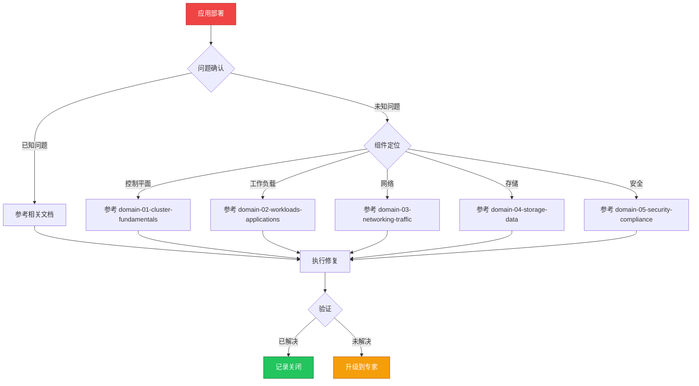

# 场景: 应用部署

> **场景 ID**: SC-02
> **英文**: Application Deployment
> **最后更新**: 2026-05-20

---

## 场景概述

应用部署是 [[Kubernetes|Kubernetes]] 最常见的操作场景。本场景汇总了 Deployment、[[StatefulSet|StatefulSet]]、[[DaemonSet|DaemonSet]] 等所有工作负载的部署模式和最佳实践。

---

## 快速决策树

---

## 相关文档

- domain-02-workloads-applications/02-deployment-production-patterns.md
- [[domain-02-workloads-applications/00-core-workloads/03-statefulset-advanced-operations.md|03 statefulset advanced operations]]
- [[domain-02-workloads-applications/00-core-workloads/04-daemonset-management.md|04 daemonset management]]
- [[domain-18-manifests-patterns/README.md|README]]

---

## FTA 故障树

- [[domain-10-troubleshooting-diagnostics/topic-fta/list/pod-fta.md|pod fta]]
- [[domain-10-troubleshooting-diagnostics/topic-fta/list/deployment-fta.md|deployment fta]]
- [[domain-10-troubleshooting-diagnostics/topic-fta/list/statefulset-fta.md|statefulset fta]]

---

## 操作技能

暂无专项技能卡片

---

## 关联场景

| 关联场景 | 说明 |
|---|---|

## Related

- [[entities/kudig-metadata-index.md|README]].md|README]]
- 24-production-deployment-best-practices
- 99-kubernetes-deployment-patterns-architecture
- [[entities/kubernetes.md|kubernetes]]
