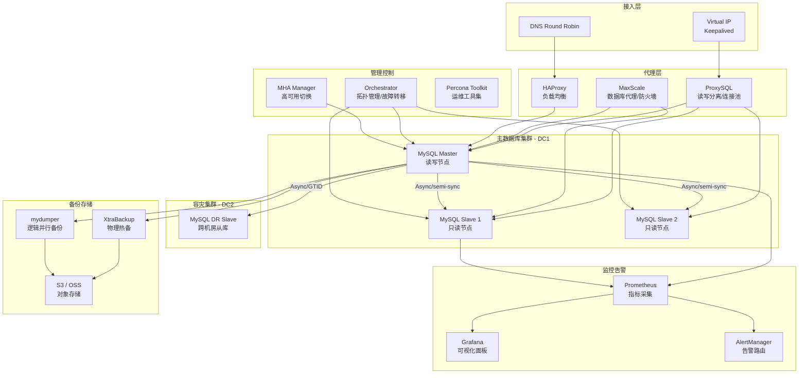
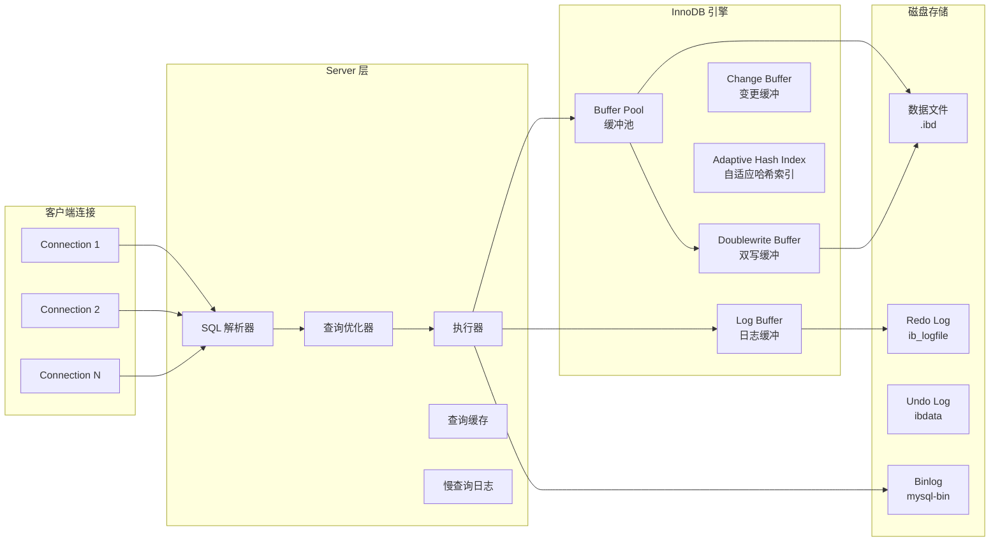

> **生产环境安全提示**
>
> 本文档包含可直接执行的运维命令。执行前请确认：当前目标集群与 Namespace 是否正确；是否具备足够的 RBAC 权限；是否已在非生产环境验证。命令风险等级标注：🔴 高风险（可能造成数据丢失或服务中断）、🟡 中风险（会修改集群状态，但通常可回滚）、🟢 低风险/只读（信息收集，无副作用）。


# MySQL 企业级数据库运维管理

> **适用版本**: MySQL 8.0 ~ 9.2 LTS  
> **最后更新**: 2026-04-26  
> **难度**: 中级 → 高级

---

<!-- chunk: 概述 -->## 概述

MySQL 是全球使用最广泛的开源关系型数据库管理系统，在 Web 应用、电商、金融、游戏等领域占据统治地位。根据 DB-Engines 2026 年排名，MySQL 仅次于 Oracle 数据库位居第二，其生态覆盖了从嵌入式设备到超大规模互联网服务的全场景。

企业级 MySQL 运维需要关注的核心维度包括：高可用架构设计（MHA、Orchestrator、MGR）、性能调优（InnoDB 参数优化、查询优化器调优）、数据安全（SSL 加密、审计日志、透明数据加密）、监控告警体系（[[Prometheus|Prometheus]] + Grafana）、以及自动化运维平台建设。本文档从生产环境运维专家视角，系统覆盖上述所有领域。

MySQL 8.0 引入了诸多企业级特性：窗口函数、通用表表达式（CTE）、角色管理、数据字典、降序索引、JSON 增强、invisible index 等。MySQL 9.x 进一步增强了并行查询、HeatWave 内存加速引擎等功能。生产环境建议采用 MySQL 8.4 LTS 版本以获得长期支持。对于 K8s 上的完整生产部署指南（高可用架构、MySQL Group Replication / Operator 选型、备份、监控告警、故障转移与慢查询治理），参见 [[domain-16-database-middleware/01-databases/17-mysql-kubernetes-production-guide|MySQL on Kubernetes 生产指南]]。

---

<!-- chunk: 架构设计 -->## 架构设计

## 企业级 MySQL 高可用架构图



## InnoDB 存储引擎架构



---

<!-- chunk: 核心组件配置 -->## 核心组件配置

## 生产级 my.cnf 完整配置

```ini
# my.cnf - MySQL 8.4 LTS 生产优化配置
# 适用场景: 64GB 内存 / NVMe SSD / 16 核 CPU
# 生成日期: 2026-04-26

[mysqld]
# ============================================================
# 基础配置
# ============================================================
user                           = mysql
port                           = 3306
socket                         = /var/run/mysqld/mysqld.sock
pid-file                       = /var/run/mysqld/mysqld.pid
datadir                        = /var/lib/mysql
log-error                      = /var/log/mysql/error.log
tmpdir                         = /tmp
character-set-server           = utf8mb4
collation-server               = utf8mb4_0900_ai_ci
skip-character-set-client-handshake = 1
lower_case_table_names         = 1

# ============================================================
# 网络配置
# ============================================================
bind-address                   = 0.0.0.0
skip-name-resolve              = 1
skip-ssl                       = 0
max_connections                = 2000
max_connect_errors             = 100000
wait_timeout                   = 28800
interactive_timeout            = 28800
connect_timeout                = 10
net_buffer_length              = 32K
max_allowed_packet             = 64M
net_read_timeout               = 30
net_write_timeout              = 60
net_retry_count                = 10
back_log                       = 2048

# ============================================================
# InnoDB 引擎配置
# ============================================================
default-storage-engine         = InnoDB
innodb_buffer_pool_size        = 40G
innodb_buffer_pool_instances   = 16
innodb_log_file_size           = 2G
innodb_log_files_in_group      = 2
innodb_log_buffer_size         = 128M
innodb_flush_log_at_trx_commit = 1
innodb_flush_method            = O_DIRECT
innodb_file_per_table          = 1
innodb_thread_concurrency      = 0
innodb_read_io_threads         = 16
innodb_write_io_threads        = 16
innodb_io_capacity             = 2000
innodb_io_capacity_max         = 4000
innodb_purge_threads           = 4
innodb_page_cleaners           = 4
innodb_sort_buffer_size        = 4M
innodb_adaptive_hash_index     = 1
innodb_change_buffering        = all
innodb_change_buffer_max_size  = 25
innodb_old_blocks_time         = 1000
innodb_max_dirty_pages_pct     = 75
innodb_max_dirty_pages_pct_lwm = 10
innodb_lru_scan_depth          = 1024
innodb_lock_wait_timeout       = 50
innodb_rollback_on_timeout     = 0
innodb_print_all_deadlocks     = 1
innodb_deadlock_detect         = 1

# ============================================================
# 二进制日志 (Binlog)
# ============================================================
server-id                      = 1
log-bin                        = mysql-bin
binlog-format                  = ROW
binlog-row-image               = FULL
binlog-rows-query-log-events   = 1
expire_logs_days               = 7
sync_binlog                    = 1
binlog-cache-size              = 4M
binlog-order-commits           = 1
log-bin-trust-function-creators = 1
binlog-transaction-compression = ON
binlog-transaction-compression-level_zstd = 3

# ============================================================
# GTID 与复制
# ============================================================
gtid-mode                      = ON
enforce-gtid-consistency       = ON
log-slave-updates              = ON
relay-log                      = relay-bin
relay-log-recovery             = 1
slave-parallel-workers         = 8
slave-parallel-type            = LOGICAL_CLOCK
slave-preserve-commit-order    = 1
slave-net-timeout              = 30
slave-checkpoint-period        = 300
slave-checkpoint-group         = 512
master-info-repository         = TABLE
relay-log-info-repository      = TABLE
sync-relay-log                 = 1000
sync-relay-log-info            = 1000

# ============================================================
# 查询优化
# ============================================================
optimizer_switch               = 'index_merge_intersection=on,index_merge_union=on,index_merge_sort_union=on'
optimizer_features_switch      = 'derived_merge=on'
range_optimizer_max_mem_size   = 64M
eq_range_index_dive_limit      = 200
table_open_cache               = 4000
table_open_cache_instances     = 64
table-definition-cache         = 2000
thread_cache_size              = 64
thread_handling                = one-thread-per-connection
sort_buffer_size               = 4M
join_buffer_size               = 4M
read_buffer_size               = 2M
read_rnd_buffer_size           = 4M
tmp_table_size                 = 64M
max_heap_table_size            = 64M
bulk_insert_buffer_size        = 64M
myisam-sort-buffer-size        = 64M

# ============================================================
# 慢查询日志
# ============================================================
slow_query_log                 = 1
long_query_time                = 1
slow_query_log_file            = /var/log/mysql/slow.log
log_queries_not_using_indexes  = 1
log_slow_admin_statements      = 1
log_slow_slave_statements      = 1
min_examined_row_limit         = 100
log_throttle_queries_not_using_indexes = 10

# ============================================================
# 通用日志（生产环境通常关闭）
# ============================================================
general_log                    = 0

# ============================================================
# SSL/TLS 配置
# ============================================================
ssl-ca                         = /etc/mysql/ssl/ca.pem
ssl-cert                       = /etc/mysql/ssl/server-cert.pem
ssl-key                        = /etc/mysql/ssl/server-key.pem
require_secure_transport       = ON

# ============================================================
# 性能监控
# ============================================================
performance_schema             = ON
performance_schema_instrument  = '%=ON'
performance_schema_consumer_events_statements_history_long = ON
performance-schema-consumer-events-waits-history-long = ON
sysdate-is-now                 = 1

[client]
port                           = 3306
socket                         = /var/run/mysqld/mysqld.sock
default-character-set          = utf8mb4
ssl-ca                         = /etc/mysql/ssl/ca.pem
ssl-cert                       = /etc/mysql/ssl/client-cert.pem
ssl-key                        = /etc/mysql/ssl/client-key.pem

[mysql]
no-auto-rehash
default-character-set          = utf8mb4
```

## 从节点配置

```ini
# slave.cnf - MySQL 从节点专用配置
# 继承主节点基础配置后覆盖以下参数

[mysqld]
server-id                      = 2
read_only                      = 1
super_read_only                = 1
log-slave-updates              = ON
relay-log                      = relay-bin
relay-log-recovery             = 1

slave_parallel_workers         = 8
slave_parallel_type            = LOGICAL_CLOCK
slave_preserve_commit_order    = 1
slave_checkpoint_period        = 300

report-host                    = slave-1
report-port                    = 3306

innodb_read_only               = 0
innodb_flush_log_at_trx_commit = 2
sync_binlog                    = 100
```

## ProxySQL 完整配置

```sql
-- ProxySQL 生产配置脚本

-- 添加 MySQL 服务器
INSERT INTO mysql_servers (hostgroup_id, hostname, port, weight, max_connections)
VALUES
    (10, 'mysql-master-0.db.svc.cluster.local', 3306, 1000, 500),
    (10, 'mysql-master-1.db.svc.cluster.local', 3306, 1, 500),
    (20, 'mysql-slave-0.db.svc.cluster.local', 3306, 500, 500),
    (20, 'mysql-slave-1.db.svc.cluster.local', 3306, 500, 500),
    (20, 'mysql-slave-2.db.svc.cluster.local', 3306, 500, 500);

-- 配置读写分离规则
INSERT INTO mysql_query_rules (rule_id, active, match_digest, destination_hostgroup, apply)
VALUES
    (1, 1, '^SELECT.*FOR UPDATE', 10, 1),
    (2, 1, '^SELECT.*LOCK IN SHARE MODE', 10, 1),
    (3, 1, '^SELECT', 20, 1);

-- 配置用户
INSERT INTO mysql_users (username, password, default_hostgroup, active)
VALUES
    ('app_readwrite', 'encrypted_password_here', 10, 1),
    ('app_readonly', 'encrypted_password_here', 20, 1);

-- 配置监控用户
SET mysql-monitor_username='monitor_user';
SET mysql-monitor_password='monitor_password';

-- 全局变量
SET mysql-max_connections=10000;
SET mysql-default_max_lifetime_seconds=1800;
SET mysql-poll_timeout_on_failure=100;
SET mysql-server_version='8.4.0';

LOAD MYSQL SERVERS TO RUNTIME;
SAVE MYSQL SERVERS TO DISK;
LOAD MYSQL USERS TO RUNTIME;
SAVE MYSQL USERS TO DISK;
LOAD MYSQL QUERY RULES TO RUNTIME;
SAVE MYSQL QUERY RULES TO DISK;
LOAD MYSQL VARIABLES TO RUNTIME;
SAVE MYSQL VARIABLES TO DISK;
```

---

<!-- chunk: 性能调优 -->## 性能调优

## 内存分配公式

```
MySQL 内存分配参考（64GB 物理内存）：

innodb_buffer_pool_size   = 物理内存 × 60%~70% = ~40GB
key_buffer_size           = 物理内存 × 2%~5%   = ~2GB（MyISAM 场景）
max_connections           = 基于并发需求        = 2000
sort_buffer_size          = 每连接排序内存      = 4MB
join_buffer_size          = 每连接 JOIN 内存    = 4MB
read_buffer_size          = 顺序读缓冲          = 2MB
read_rnd_buffer_size      = 随机读缓冲          = 4MB
tmp_table_size            = 内存临时表          = 64MB

预估最大内存占用：
max_used_memory = innodb_buffer_pool_size
                + max_connections × (sort_buffer_size + join_buffer_size + read_buffer_size + read_rnd_buffer_size + thread_stack)
                = 40GB + 2000 × (4 + 4 + 2 + 4 + 0.256)MB
                = 40GB + ~27GB = ~67GB（需要确保不超过物理内存）
```

## InnoDB 性能参数调优

| 参数 | 推荐值 | 调优依据 | 影响范围 |
|:---|:---|:---|:---|
| `innodb_buffer_pool_size` | 物理内存 60-70% | 数据+索引热数据缓存 | 查询性能 |
| `innodb_log_file_size` | 1-4GB | 减少 checkpoint 频率 | 写入性能 |
| `innodb_flush_log_at_trx_commit` | 1（安全）/ 2（性能） | 1=每事务刷盘, 2=每秒刷盘 | 数据安全/写入性能 |
| `innodb_flush_method` | O_DIRECT | 绕过 OS 文件缓存 | 双重缓存问题 |
| `innodb_io_capacity` | SSD: 2000-10000 | 后台刷新页速率 | 刷新性能 |
| `innodb_io_capacity_max` | SSD: 4000-20000 | 突发 IO 上限 | 紧急刷新 |
| `innodb_thread_concurrency` | 0（自动） | 并发线程限制 | CPU 利用率 |
| `innodb_read_io_threads` | CPU 核心数 | 读 IO 线程数 | 读性能 |
| `innodb_write_io_threads` | CPU 核心数 | 写 IO 线程数 | 写性能 |
| `sync_binlog` | 1（安全）/ 100（性能） | binlog 同步频率 | 主从一致性 |

## 查询优化实践

```sql
-- 1. 分析慢查询
SELECT * FROM sys.statements_with_runtimes_in_95th_percentile;

-- 2. 查看全表扫描的查询
SELECT * FROM sys.statements_with_full_table_scans;

-- 3. 分析索引使用情况
SELECT * FROM sys.schema_index_statistics
ORDER BY rows_selected DESC LIMIT 20;

-- 4. 查看冗余索引
SELECT * FROM sys.schema_redundant_indexes;

-- 5. 分析未使用的索引
SELECT object_schema, object_name, index_name
FROM performance_schema.table_io_waits_summary_by_index_usage
WHERE index_name IS NOT NULL
  AND count_star = 0
  AND object_schema NOT IN ('mysql', 'performance_schema', 'information_schema')
ORDER BY object_schema, object_name;

-- 6. InnoDB Buffer Pool 命中率
SELECT
    ROUND(100 - (innodb.buffer_pool_reads / innodb.buffer_pool_read_requests * 100), 2) AS buffer_pool_hit_rate_pct
FROM (
    SELECT variable_value AS buffer_pool_reads
    FROM performance_schema.global_status
    WHERE variable_name = 'Innodb_buffer_pool_reads'
) AS innodb_reads,
(
    SELECT variable_value AS buffer_pool_read_requests
    FROM performance_schema.global_status
    WHERE variable_name = 'Innodb_buffer_pool_read_requests'
) AS innodb_requests
CROSS JOIN (
    SELECT variable_value AS buffer_pool_reads
    FROM performance_schema.global_status
    WHERE variable_name = 'Innodb_buffer_pool_reads'
) AS innodb;

-- 7. 表碎片分析
SELECT
    table_schema,
    table_name,
    ROUND(data_length / 1024 / 1024, 2) AS data_mb,
    ROUND(index_length / 1024 / 1024, 2) AS index_mb,
    ROUND(data_free / 1024 / 1024, 2) AS free_mb,
    ROUND(data_free / (data_length + index_length + 1) * 100, 2) AS fragment_pct
FROM information_schema.tables
WHERE table_schema NOT IN ('mysql', 'information_schema', 'performance_schema', 'sys')
  AND engine = 'InnoDB'
  AND data_free > 100 * 1024 * 1024
ORDER BY data_free DESC;
```

---

<!-- chunk: 高可用与容灾 -->## 高可用与容灾

## Orchestrator 配置

```json
{
  "Debug": false,
  "EnableSyslog": false,
  "ListenAddress": ":3000",
  "MySQLTopologyUser": "orchestrator",
  "MySQLTopologyPassword": "ORCHESTRATOR_TOPOLOGY_PASSWORD",
  "BackendDB": "mysql",
  "MySQLOrchestratorHost": "127.0.0.1",
  "MySQLOrchestratorPort": 3306,
  "MySQLOrchestratorDatabase": "orchestrator",
  "MySQLOrchestratorUser": "orchestrator",
  "MySQLOrchestratorPassword": "ORCHESTRATOR_BACKEND_PASSWORD",
  "DefaultInstancePort": 3306,
  "DiscoverByShowSlaveHosts": true,
  "InstancePollSeconds": 5,
  "UnseenInstanceForgetHours": 24,
  "HostnameResolveMethod": "default",
  "MySQLHostnameResolveMethod": "@@hostname",
  "SkipBinlogServerUnresolveCheck": true,
  "ExpiryHostnameResolvesMinutes": 60,
  "RecoveryPeriodBlockSeconds": 3600,
  "RecoveryIgnoreHostnameFilters": [],
  "RecoverMasterClusterFilters": ["*"],
  "RecoverIntermediateMasterClusterFilters": ["*"],
  "OnFailureDetectionProcesses": [
    "/usr/local/bin/orchestrator-alert.sh '#failure' '{failureType}' '{failureDescription}' '{failedHost}' '{failureCluster}' '{failureClusterAlias}' '{failureClusterDomain}' '{failedPort}' '{successorHost}' '{successorPort}' '{lostReplicas}' '{countSlaves}' '{isMaster}' '{isCoMaster}' '{oracle}'"
  ],
  "PostFailoverProcesses": [
    "/usr/local/bin/orchestrator-post-failover.sh '{failureType}' '{failureDescription}' '{failedHost}' '{failureCluster}' '{failureClusterAlias}' '{failureClusterDomain}' '{failedPort}' '{successorHost}' '{successorPort}' '{countSlaves}' '{oracle}' '{isSuccessful}' '{lostReplicas}' '{slaveHosts}'"
  ],
  "DelayMasterFailoverIfSlaveLagSeconds": 300,
  "FailMasterFailoverIfSlaveStopped": true,
  "FailMasterFailoverIfSlaveNotReplicating": true,
  "MasterFailoverLostInstancesDontHaveAlias": true,
  "PostMasterFailoverProcesses": [
    "/usr/local/bin/vip-failover.sh '{failedHost}' '{successorHost}'"
  ],
  "RaftEnabled": true,
  "RaftBind": "0.0.0.0:10008",
  "RaftNodes": [
    "orchestrator-0:10008",
    "orchestrator-1:10008",
    "orchestrator-2:10008"
  ]
}
```

## 跨机房容灾架构

```yaml
# 跨机房容灾配置示例
disaster_recovery:
  primary_dc: "dc-beijing"
  dr_dc: "dc-shanghai"

  replication:
    mode: "async_gtids"
    channel: "dc_shanghai_channel"
    retry_interval: 60
    heartbeat_period: 30

  network:
    bandwidth: "1Gbps dedicated"
    latency: "5ms average"
    redundancy: "dual-path"

  failover:
    rto: "30 minutes"
    rpo: "10 seconds"
    auto_failover: false
    manual_switch_command: "/opt/dba/dr-switchover.sh --target dc-shanghai"

  consistency_check:
    schedule: "0 */6 * * *"
    tool: "pt-table-checksum"
    report_to: "dba-team@company.com"
```

---

<!-- chunk: 备份恢复 -->## 备份恢复

## XtraBackup 物理备份脚本

> **🔴 高风险操作警告**
>
> 下方命令属于不可逆或高影响操作，执行前请确认：
> - 已备份关键数据与配置
> - 处于批准的变更窗口期
> - 已获得相关责任人授权
> - 已准备回滚或恢复方案
> - 目标集群、Namespace、节点/资源名称正确无误

``` bash
# 🔴 高风险：可能造成数据丢失或服务中断，执行前需备份、变更审批与回滚方案
#!/bin/bash
# mysql_backup.sh - 基于 XtraBackup 的生产备份脚本
set -euo pipefail

BACKUP_ROOT="/backup/mysql"
DATE=$(date +%Y%m%d_%H%M%S)
LOG_FILE="/var/log/mysql/backup_${DATE}.log"
MYSQL_USER="backup_user"
MYSQL_PASSWORD="${BACKUP_PASSWORD}"
RETENTION_DAYS=7
S3_BUCKET="s3://company-mysql-backup"
S3_PREFIX="production"

log() {
    echo "[$(date '+%Y-%m-%d %H:%M:%S')] $1" | tee -a "$LOG_FILE"
}

check_prerequisites() {
    log "Checking prerequisites..."
    command -v xtrabackup >/dev/null 2>&1 || { log "ERROR: xtrabackup not found"; exit 1; }
    command -v aws >/dev/null 2>&1 || { log "ERROR: aws cli not found"; exit 1; }
    df -h "$BACKUP_ROOT" | tail -1 | awk '{print $5}' | grep -E '^[0-9]+%' | sed 's/%//' | \
        awk '{if($1>85){print "ERROR: Disk usage > 85%"; exit 1}}'
    log "Prerequisites OK"
}

perform_full_backup() {
    log "Starting full backup..."
    local backup_dir="${BACKUP_ROOT}/full_${DATE}"

    xtrabackup --backup \
        --user="${MYSQL_USER}" \
        --password="${MYSQL_PASSWORD}" \
        --target-dir="${backup_dir}" \
        --parallel=4 \
        --compress=qpress \
        --compress-threads=4 \
        --slave-info \
        --safe-slave-backup \
        --no-lock \
        2>> "$LOG_FILE"

    log "Preparing backup..."
    xtrabackup --prepare \
        --target-dir="${backup_dir}" \
        2>> "$LOG_FILE"

    log "Creating checksum..."
    cd "${backup_dir}" && find . -type f -exec md5sum {} \; > "${backup_dir}.md5"

    log "Uploading to S3..."
    aws s3 sync "${backup_dir}" "${S3_BUCKET}/${S3_PREFIX}/full_${DATE}/" \
        --storage-class STANDARD_IA \
        --no-progress 2>> "$LOG_FILE"

    log "Full backup completed: ${backup_dir}"
}

perform_incremental_backup() {
    log "Starting incremental backup..."
    local base_dir="${1}"
    local incr_dir="${BACKUP_ROOT}/incr_${DATE}"

    xtrabackup --backup \
        --user="${MYSQL_USER}" \
        --password="${MYSQL_PASSWORD}" \
        --target-dir="${incr_dir}" \
        --incremental-basedir="${base_dir}" \
        --parallel=4 \
        2>> "$LOG_FILE"

    aws s3 sync "${incr_dir}" "${S3_BUCKET}/${S3_PREFIX}/incr_${DATE}/" \
        --storage-class STANDARD_IA \
        --no-progress 2>> "$LOG_FILE"

    log "Incremental backup completed: ${incr_dir}"
}

cleanup_old_backups() {
    log "Cleaning up backups older than ${RETENTION_DAYS} days..."
    find "${BACKUP_ROOT}" -maxdepth 1 -type d -mtime +${RETENTION_DAYS} -exec rm -rf {} \;
    aws s3 ls "${S3_BUCKET}/${S3_PREFIX}/" | while read -r line; do
        createDate=$(echo "$line" | awk '{print $1" "$2}')
        createDate=$(date -d "$createDate" +%s)
        olderThan=$(date -d "-${RETENTION_DAYS} days" +%s)
        if $createDate -lt $olderThan; then
            fileName=$(echo "$line" | awk '{$1=$2=""; print $0}' | sed 's/^[ \t]*//')
            aws s3 rm "${S3_BUCKET}/${S3_PREFIX}/${fileName}" --recursive 2>/dev/null || true
        fi
    done
    log "Cleanup completed"
}

verify_backup() {
    log "Verifying latest backup..."
    local latest_backup=$(ls -dt "${BACKUP_ROOT}"/full_* | head -1)

    if xtrabackup --prepare --target-dir="${latest_backup}" 2>> "$LOG_FILE"; then
        log "Backup verification PASSED"
    else
        log "ERROR: Backup verification FAILED"
        exit 1
    fi
}

main() {
    log "=== MySQL Backup Started ==="
    check_prerequisites

    case "${1:-full}" in
        full)
            perform_full_backup
            verify_backup
            ;;
        incremental)
            local base=$(ls -dt "${BACKUP_ROOT}"/full_* 2>/dev/null | head -1)
            if -z "$base"; then
                perform_full_backup
            else
                perform_incremental_backup "$base"
            fi
            ;;
        *)
            echo "Usage: $0 {full|incremental}"
            exit 1
            ;;
    esac

    cleanup_old_backups
    log "=== MySQL Backup Completed ==="
}

main "$@"
```
## 恢复操作

> ⚠️ **🟠 高危操作** — 影响业务流量或节点状态，需变更工单+影响评估+计划回滚
> - `chmod/chown -R`：递归改权限，误操作破坏系统文件访问
> - `systemctl stop/restart`：停止/重启系统服务，影响节点上所有容器

``` bash
# 🟢 低风险：只读/信息收集，通常无副作用
#!/bin/bash
# mysql_restore.sh - MySQL 恢复脚本
set -euo pipefail

BACKUP_DIR="$1"
MYSQL_DATADIR="/var/lib/mysql"
STAGING_DIR="/tmp/mysql_restore_$(date +%s)"

echo "=== MySQL Restore Started ==="
echo "Backup: $BACKUP_DIR"
echo "Staging: $STAGING_DIR"

mkdir -p "$STAGING_DIR"

# Step 1: 准备备份（应用日志）
echo "Preparing backup..."
xtrabackup --prepare --target-dir="$BACKUP_DIR"

# Step 2: 停止 MySQL
echo "Stopping MySQL..."
systemctl stop mysql

# Step 3: 备份当前数据
echo "Backing up current data..."
mv "$MYSQL_DATADIR" "${MYSQL_DATADIR}.bak_$(date +%s)"

# Step 4: 恢复数据
echo "Restoring data..."
xtrabackup --copy-back --target-dir="$BACKUP_DIR" --datadir="$MYSQL_DATADIR"

# Step 5: 修复权限
echo "Fixing permissions..."
chown -R mysql:mysql "$MYSQL_DATADIR"
chmod 750 "$MYSQL_DATADIR"

# Step 6: 启动 MySQL
echo "Starting MySQL..."
systemctl start mysql

# Step 7: 验证
sleep 10
if mysqladmin ping -u root -p"${MYSQL_ROOT_PASSWORD}" --silent; then
    echo "MySQL restore completed successfully"
    echo "Key count: $(mysql -u root -p"${MYSQL_ROOT_PASSWORD}" -e 'SELECT SUM(TABLE_ROWS) FROM information_schema.tables WHERE table_schema NOT IN ("mysql","information_schema","performance_schema","sys")' -s -N)"
else
    echo "ERROR: MySQL failed to start after restore"
    exit 1
fi
```
---

<!-- chunk: 监控告警 -->## 监控告警

## Prometheus MySQL Exporter 配置

```yaml
scrape_configs:
  - job_name: 'mysql'
    static_configs:
      - targets:
          - 'mysql-exporter-0:9104'
          - 'mysql-exporter-1:9104'
          - 'mysql-exporter-2:9104'
        labels:
          cluster: 'production-mysql'
    metrics_path: /metrics
    scrape_interval: 15s
    scrape_timeout: 10s
    params:
      collect[]:
        - global_status
        - global_variables
        - slave_status
        - processlist
        - table_schema
        - info_schema.innodb_metrics
        - info_schema.innodb_tablespaces
        - info_schema.file_summary_by_instance
        - perf_schema.events_statements
        - perf_schema.events_waits
        - perf_schema.file_events
        - perf_schema.memory_events
        - perf_schema.replication_group_members
```

## 生产级告警规则

```yaml
groups:
  - name: mysql.rules
    rules:
      - alert: MySQLDown
        expr: mysql_up == 0
        for: 1m
        labels:
          severity: critical
          team: dba
        annotations:
          summary: "MySQL 实例宕机"
          description: "MySQL 实例 {{ $labels.instance }} 已宕机超过 1 分钟"

      - alert: MySQLReplicationBroken
        expr: mysql_slave_status_slave_io_running == 0 or mysql_slave_status_slave_sql_running == 0
        for: 1m
        labels:
          severity: critical
          team: dba
        annotations:
          summary: "MySQL 复制中断"
          description: "实例 {{ $labels.instance }} 的 IO/SQL 线程已停止"

      - alert: MySQLReplicationLag
        expr: mysql_slave_status_seconds_behind_master > 30
        for: 5m
        labels:
          severity: warning
          team: dba
        annotations:
          summary: "MySQL 复制延迟"
          description: "从库 {{ $labels.instance }} 延迟 {{ $value }} 秒"

      - alert: MySQLHighConnections
        expr: mysql_global_status_threads_connected / mysql_global_variables_max_connections > 0.85
        for: 5m
        labels:
          severity: warning
          team: dba
        annotations:
          summary: "MySQL 连接数过高"
          description: "连接使用率 {{ $value | humanizePercentage }}"

      - alert: MySQLBufferPoolHitRateLow
        expr: rate(mysql_global_status_innodb_buffer_pool_read_requests[5m]) / (rate(mysql_global_status_innodb_buffer_pool_read_requests[5m]) + rate(mysql_global_status_innodb_buffer_pool_reads[5m])) < 0.95
        for: 10m
        labels:
          severity: warning
          team: dba
        annotations:
          summary: "Buffer Pool 命中率低于 95%"
          description: "当前命中率 {{ $value | humanizePercentage }}"

      - alert: MySQLSlowQueries
        expr: increase(mysql_global_status_slow_queries[5m]) > 50
        for: 5m
        labels:
          severity: warning
          team: dba
        annotations:
          summary: "慢查询数量异常"
          description: "近 5 分钟新增 {{ $value }} 条慢查询"

      - alert: MySQLDiskSpaceLow
        expr: mysql_global_status_innodb_data_pending_reads > 0 and (node_filesystem_avail_bytes{mountpoint="/var/lib/mysql"} / node_filesystem_size_bytes{mountpoint="/var/lib/mysql"}) < 0.15
        for: 5m
        labels:
          severity: critical
          team: dba
        annotations:
          summary: "MySQL 数据盘空间不足 15%"
          description: "可用空间 {{ $value | humanizePercentage }}"

      - alert: MySQLDeadlocks
        expr: increase(mysql_global_status_innodb_deadlocks[10m]) > 10
        for: 5m
        labels:
          severity: warning
          team: dba
        annotations:
          summary: "MySQL 死锁频率过高"
          description: "近 10 分钟发生 {{ $value }} 次死锁"
```

---

<!-- chunk: 运维管理 -->## 运维管理

## 综合运维脚本

``` bash
# 🟢 低风险：只读/信息收集，通常无副作用
#!/bin/bash
# mysql_ops.sh - MySQL 综合运维管理脚本
set -euo pipefail

MYSQL_USER="root"
MYSQL_PASSWORD="${MYSQL_ROOT_PASSWORD}"
MYSQL_CMD="mysql -u${MYSQL_USER} -p${MYSQL_PASSWORD}"

cmd_health() {
    echo "=== MySQL Health Check $(date) ==="
    echo ""

    echo "--- Service Status ---"
    systemctl is-active mysql

    echo ""
    echo "--- Uptime ---"
    $MYSQL_CMD -e "SELECT variable_value AS uptime_seconds FROM performance_schema.global_status WHERE variable_name='Uptime';" -s -N

    echo ""
    echo "--- Connections ---"
    $MYSQL_CMD -e "
        SELECT
            (SELECT variable_value FROM performance_schema.global_status WHERE variable_name='Threads_connected') AS current,
            (SELECT variable_value FROM performance_schema.global_variables WHERE variable_name='max_connections') AS max_conn,
            ROUND((SELECT variable_value FROM performance_schema.global_status WHERE variable_name='Threads_connected') /
                  (SELECT variable_value FROM performance_schema.global_variables WHERE variable_name='max_connections') * 100, 2) AS usage_pct;
    "

    echo ""
    echo "--- Replication Status ---"
    $MYSQL_CMD -e "SHOW SLAVE STATUS\G" 2>/dev/null | grep -E "Slave_IO_Running|Slave_SQL_Running|Seconds_Behind_Master|Last_Error" || echo "Not a replica"

    echo ""
    echo "--- InnoDB Buffer Pool ---"
    $MYSQL_CMD -e "
        SELECT
            ROUND(bp_read / (bp_read + bp_reads) * 100, 2) AS hit_rate_pct
        FROM (
            SELECT
                (SELECT variable_value FROM performance_schema.global_status WHERE variable_name='Innodb_buffer_pool_read_requests') AS bp_read,
                (SELECT variable_value FROM performance_schema.global_status WHERE variable_name='Innodb_buffer_pool_reads') AS bp_reads
        ) t;
    "

    echo ""
    echo "--- Top 10 Slow Queries (by exec count) ---"
    $MYSQL_CMD -e "
        SELECT DIGEST_TEXT, COUNT_STAR, AVG_TIMER_WAIT/1000000000 AS avg_ms, SUM_ERRORS
        FROM performance_schema.events_statements_summary_by_digest
        ORDER BY SUM_TIMER_WAIT DESC LIMIT 10;
    "

    echo ""
    echo "--- Table Fragmentation (>1GB free) ---"
    $MYSQL_CMD -e "
        SELECT table_schema, table_name,
               ROUND(data_free/1024/1024/1024, 2) AS free_gb,
               ROUND((data_length+index_length)/1024/1024/1024, 2) AS total_gb
        FROM information_schema.tables
        WHERE engine='InnoDB' AND data_free > 1024*1024*1024
        ORDER BY data_free DESC LIMIT 10;
    "

    echo ""
    echo "--- Disk Usage ---"
    df -h /var/lib/mysql | tail -1

    echo ""
    echo "=== Health Check Complete ==="
}

cmd_optimize() {
    echo "=== MySQL Optimization ==="

    echo "Analyzing table statistics..."
    $MYSQL_CMD -e "
        SELECT CONCAT('ANALYZE TABLE ', table_schema, '.', table_name, ';')
        FROM information_schema.tables
        WHERE table_schema NOT IN ('mysql','information_schema','performance_schema','sys')
          AND engine='InnoDB'
          AND UPDATE_TIME < DATE_SUB(NOW(), INTERVAL 7 DAY);
    " -s -N | $MYSQL_CMD

    echo "Optimization complete"
}

cmd_security() {
    echo "=== MySQL Security Audit ==="

    echo ""
    echo "--- Users without password ---"
    $MYSQL_CMD -e "SELECT user, host FROM mysql.user WHERE authentication_string='' OR plugin='';"

    echo ""
    echo "--- Root access from remote ---"
    $MYSQL_CMD -e "SELECT user, host FROM mysql.user WHERE user='root' AND host NOT IN ('localhost','127.0.0.1','::1');"

    echo ""
    echo "--- Anonymous users ---"
    $MYSQL_CMD -e "SELECT user, host FROM mysql.user WHERE user='';"

    echo ""
    echo "--- Users with ALL PRIVILEGES ---"
    $MYSQL_CMD -e "
        SELECT grantee, table_schema, privilege_type
        FROM information_schema.user_privileges
        WHERE privilege_type='SUPER' OR privilege_type='ALL PRIVILEGES';
    "

    echo ""
    echo "=== Security Audit Complete ==="
}

case "${1:-help}" in
    health)    cmd_health ;;
    optimize)  cmd_optimize ;;
    security)  cmd_security ;;
    *)
        echo "Usage: $0 {health|optimize|security}"
        echo "  health    - Comprehensive health check"
        echo "  optimize  - Analyze tables and update statistics"
        echo "  security  - Security audit"
        ;;
esac
```
---

<!-- chunk: 最佳实践 -->## 最佳实践

## 0. 生产环境部署清单

在企业级 MySQL 生产环境上线前，需要完成以下检查清单。这份清单基于多年大规模 MySQL 集群运维经验总结，涵盖了硬件规划、操作系统配置、MySQL 参数优化、安全加固和监控告警等关键维度。

**硬件层面**：确保使用 NVMe SSD 存储，IOPS 不低于 50000；内存配置建议 64GB 以上，为 InnoDB Buffer Pool 预留充足空间；网络带宽不低于 10Gbps，主从复制链路需要低延迟保障。对于写入密集型场景，建议使用 RAID 10 配置，兼顾性能和数据安全。

**操作系统层面**：调整 `vm.swappiness=1` 减少不必要的 swap 使用；设置 `vm.dirty_ratio=5` 和 `vm.dirty_background_ratio=2` 控制脏页刷新频率；配置 `nofile` 限制到 65535 以上确保文件描述符充足；禁用 NUMA 或使用 `numactl --interleave=all` 启动 MySQL 以避免内存分配不均；调整 I/O 调度器为 `noop` 或 `mq-deadline`（适用于 SSD）。

**MySQL 参数层面**：`innodb_buffer_pool_size` 设置为物理内存的 60-70%；`innodb_flush_log_at_trx_commit=1` 确保事务不丢失；`sync_binlog=1` 确保 binlog 不丢失；`binlog_format=ROW` 使用行级复制保证数据一致性；`gtid_mode=ON` 简化主从切换操作；`log_slave_updates=ON` 支持级联复制。

**安全层面**：删除匿名用户和测试数据库；限制 root 仅本地登录；启用 SSL/TLS 加密所有连接；配置防火墙仅开放 3306 端口给应用网段；定期轮换数据库密码；启用审计插件记录关键操作。

**监控层面**：部署 Prometheus MySQL Exporter 采集核心指标；配置 Grafana 仪表盘展示关键性能指标（QPS、TPS、连接数、Buffer Pool 命中率、复制延迟）；设置分级告警规则并通过 AlertManager 路由到不同的通知渠道。

## 1. 索引设计原则

- 为 WHERE、JOIN、ORDER BY、GROUP BY 列创建合适的索引
- 遵循最左前缀原则设计复合索引
- 避免在区分度低的列上建索引（如 gender、status）
- 使用 `pt-duplicate-key-checker` 检测冗余索引
- 使用 `sys.schema_unused_indexes` 监控未使用索引
- 限制单表索引数量在 5-8 个以内

## 2. 数据类型选择

| 场景 | 推荐类型 | 避免使用 |
|:---|:---|:---|
| 主键 | BIGINT UNSIGNED AUTO_INCREMENT | UUID（索引碎片） |
| 状态字段 | TINYINT UNSIGNED + ENUM | VARCHAR |
| 金额 | DECIMAL(M, N) | FLOAT / DOUBLE |
| 时间戳 | DATETIME / TIMESTAMP | VARCHAR / INT |
| IP 地址 | INT UNSIGNED + INET_ATON() | VARCHAR |
| JSON 数据 | JSON 数据类型 | TEXT + 应用层解析 |

## 3. 分区策略

```sql
-- 按时间范围分区（适用于日志、订单等时序数据）
CREATE TABLE orders (
    id BIGINT UNSIGNED AUTO_INCREMENT,
    order_no VARCHAR(64) NOT NULL,
    user_id BIGINT UNSIGNED NOT NULL,
    amount DECIMAL(12, 2) NOT NULL,
    status TINYINT UNSIGNED DEFAULT 0,
    created_at DATETIME NOT NULL DEFAULT CURRENT_TIMESTAMP,
    PRIMARY KEY (id, created_at),
    INDEX idx_user (user_id),
    INDEX idx_order_no (order_no)
) ENGINE=InnoDB
PARTITION BY RANGE (TO_DAYS(created_at)) (
    PARTITION p202601 VALUES LESS THAN (TO_DAYS('2026-02-01')),
    PARTITION p202602 VALUES LESS THAN (TO_DAYS('2026-03-01')),
    PARTITION p202603 VALUES LESS THAN (TO_DAYS('2026-04-01')),
    PARTITION p202604 VALUES LESS THAN (TO_DAYS('2026-05-01')),
    PARTITION pfuture VALUES LESS THAN MAXVALUE
);

-- 定期添加新分区
ALTER TABLE orders ADD PARTITION (PARTITION p202605 VALUES LESS THAN (TO_DAYS('2026-06-01')));
```

## 4. 安全加固清单

- [ ] 删除匿名用户和测试数据库
- [ ] 限制 root 仅本地登录
- [ ] 启用 SSL/TLS 加密连接
- [ ] 配置防火墙规则仅开放 3306 端口给应用网段
- [ ] 启用审计插件记录 DDL 和权限变更
- [ ] 定期轮换数据库密码（至少每 90 天）
- [ ] 使用 MySQL Enterprise Audit 或 MariaDB Audit Plugin
- [ ] 启用 `require_secure_transport=ON`

---

<!-- chunk: 故障排查 -->## 故障排查

## 常见问题与解决方案

| 问题现象 | 可能原因 | 排查命令 | 解决方案 |
|:---|:---|:---|:---|
| `ERROR 1040 (HY000): Too many connections` | 连接数耗尽 | `SHOW PROCESSLIST` | 增加 `max_connections`，排查连接泄漏 |
| `ERROR 1205 (HY000): Lock wait timeout exceeded` | 行锁等待超时 | `SELECT * FROM sys.innodb_lock_waits` | 优化事务，缩短事务时长 |
| `ERROR 1213 (40001): Deadlock found` | 死锁 | `SHOW ENGINE INNODB STATUS` | 调整事务访问顺序，缩小锁范围 |
| `Slave_IO_Running: No` | IO 线程中断 | `SHOW SLAVE STATUS\G` | 检查网络、主库 binlog 是否存在 |
| `Slave_SQL_Running: No` | SQL 线程错误 | `SHOW SLAVE STATUS\G` 查看Last_Error | `SET GLOBAL SQL_SLAVE_SKIP_COUNTER=1` 或用 pt-slave-restart |
| `InnoDB: ERROR: the age of the last checkpoint` | redo log 太小 | 检查 `innodb_log_file_size` | 增大 redo log file size |
| `The table 'xxx' is full` | 磁盘空间不足或 tmp_table 超限 | `df -h` 检查磁盘 | 增加磁盘、增大 `tmp_table_size` |
| 复制延迟持续增大 | 大事务/单线程瓶颈 | `SHOW SLAVE STATUS`, `pt-query-digest` | 启用多线程复制、优化大事务 |
| Buffer Pool 命中率低 | 内存不足 | `SHOW ENGINE INNODB STATUS` | 增大 `innodb_buffer_pool_size` |
| `Got error 28 from storage engine` | 磁盘空间不足 | `df -h` | 清理磁盘、`tmpdir` 空间 |

## 紧急故障处理流程

```bash
#!/bin/bash
# mysql_emergency.sh - 紧急问题快速处理

# 场景1: 主库宕机，需要手动切换
emergency_failover() {
    echo "!!! EMERGENCY FAILOVER !!!"
    echo "Current master: $(mysql -h orchestrator -P3000 -e 'select hostname from database_instance where cluster_name="production" and read_only=0' -s -N api)"

    # 1. 确认所有从库状态
    for slave in slave-0 slave-1 slave-2; do
        lag=$(mysql -h $slave -e "SHOW SLAVE STATUS\G" 2>/dev/null | grep "Seconds_Behind_Master" | awk '{print $2}')
        io_running=$(mysql -h $slave -e "SHOW SLAVE STATUS\G" 2>/dev/null | grep "Slave_IO_Running" | awk '{print $2}')
        echo "$slave: lag=${lag}s, IO=${io_running}"
    done

    echo "Choose new master (enter hostname):"
    read new_master

    # 2. 停止新主库的复制
    mysql -h $new_master -e "STOP SLAVE; RESET SLAVE ALL;"

    # 3. 设置读写
    mysql -h $new_master -e "SET GLOBAL read_only=0; SET GLOBAL super_read_only=0;"

    # 4. 更新 ProxySQL
    mysql -h proxysql -P6032 -uadmin -padmin -e "
        UPDATE mysql_servers SET hostgroup_id=10 WHERE hostname='${new_master}';
        LOAD MYSQL SERVERS TO RUNTIME;
        SAVE MYSQL SERVERS TO DISK;
    "

    echo "Failover to $new_master completed"
    echo "Update application connection strings if needed"
}

# 场景2: 磁盘空间紧急处理
emergency_disk() {
    echo "=== Emergency Disk Cleanup ==="

    # 清理旧 binlog（保留最近 2 天）
    mysql -e "PURGE BINARY LOGS BEFORE DATE_SUB(NOW(), INTERVAL 2 DAY);"

    # 清理慢查询日志（超过 7 天）
    find /var/log/mysql/ -name "slow.log.*" -mtime +7 -delete

    # 清理备份临时文件
    find /tmp/ -name "mysql_*" -mtime +1 -delete

    # 截断大表的通用日志
    mysql -e "SET GLOBAL general_log=OFF;"
    > /var/log/mysql/general.log

    df -h /var/lib/mysql
}

case "${1:-}" in
    failover) emergency_failover ;;
    disk)     emergency_disk ;;
    *)        echo "Usage: $0 {failover|disk}" ;;
esac
```

---

**文档版本**: v2.0  
**最后更新**: 2026-04-26  
**适用版本**: MySQL 8.0 ~ 9.2 LTS

---

<!-- chunk: Obsidian 相关文档 -->## Obsidian 相关文档

- domain-28-enterprise-database-middleware MOC
- [[domain-16-database-middleware/README.md|Domain 16: 企业级数据库与中间件运维 (Enterprise Database & Middleware Op...]]
- Domain-28 企业数据库与中间件 — 开源项目索引
- PostgreSQL 企业级数据库高可用架构
- 分布式数据库企业级实践深度指南
- 数据库中间件 Kubernetes 企业级实践
- MongoDB 企业级数据库运维深度实践
- Redis 企业级缓存运维深度实践
- Redis Kubernetes Operator 企业级实践
- Kafka Kubernetes 企业级实践 — Strimzi Operator 深度指南
- CloudNativePG 企业级 PostgreSQL 运维指南

## See Also

- 08-kafka-kubernetes-strimzi
- 99-cloudnativepg-enterprise-guide
- 02-postgresql-enterprise-database
- 03-distributed-database-enterprise


<!-- risk-assessed -->
