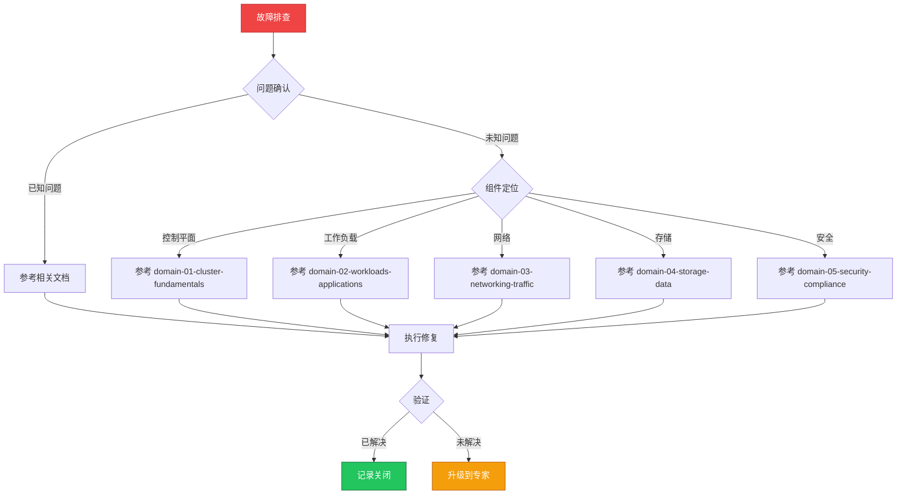

> **生产环境安全提示**
>
> 本文档包含可直接执行的运维命令。执行前请确认：当前目标集群与 Namespace 是否正确；是否具备足够的 RBAC 权限；是否已在非生产环境验证。命令风险等级标注：🔴 高风险（可能造成数据丢失或服务中断）、🟡 中风险（会修改集群状态，但通常可回滚）、🟢 低风险/只读（信息收集，无副作用）。

# 场景: 故障排查

> **场景 ID**: SC-03
> **英文**: Troubleshooting
> **最后更新**: 2026-05-20

---

## 场景概述

故障排查是 SRE 和运维工程师的核心能力。本场景汇总了通用排查方法论、组件级故障树、和操作技能卡片。

---

## 快速决策树

---

## 相关文档

- [[domain-10-troubleshooting-diagnostics/README.md|README]]
- [[domain-10-troubleshooting-diagnostics/topic-structural-trouble-shooting/README.md|README]]
- domain-01-cluster-fundamentals/16-troubleshooting-guide.md

---

## FTA 故障树

- [[domain-10-troubleshooting-diagnostics/topic-fta/MOC.md|所有 FTA 故障树]]

---

## 操作技能

- [[domain-10-troubleshooting-diagnostics/topic-skills/MOC.md|所有操作技能]]

---

## 关联场景

| 关联场景 | 说明 |
|---|---|

## Related

- [[entities/kudig-metadata-index.md|README]].md|README]]
- MOC.md|MOC]]
- [[domain-07-platform-engineering/topic-code-analysis/cluster-delete/12-troubleshooting.md|12-troubleshooting]]

<!-- risk-assessed -->
