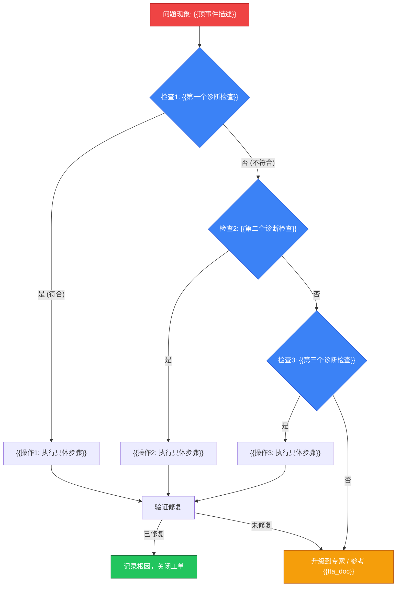

# {{组件名称}} 决策树

> **模板版本**: 1.0
> **用途**: 为故障排查场景提供可执行的决策树

---

## 决策树



---

## 检查清单

### 检查 1: {{检查名称}}

**目的**: {{为什么要做这个检查}}

**命令**:
```bash
# {{命令说明}}
{{诊断命令}}
```

**预期输出**: {{正常情况下的输出}}

**异常判定**: {{什么情况表示问题存在}}

---

### 检查 2: {{检查名称}}

**目的**: {{为什么要做这个检查}}

**命令**:
```bash
# {{命令说明}}
{{诊断命令}}
```

---

### 检查 3: {{检查名称}}

**目的**: {{为什么要做这个检查}}

**命令**:
```bash
# {{命令说明}}
{{诊断命令}}
```

---

## 操作手册

### 操作 1: {{操作名称}}

**触发条件**: 检查 1 结果为"是"

**步骤**:
1. {{步骤1}}
2. {{步骤2}}
3. {{步骤3}}

**验证**:
```bash
# {{验证命令}}
```

**风险等级**: 🟢 低 / 🟡 中 / 🔴 高

---

### 操作 2: {{操作名称}}

**触发条件**: 检查 2 结果为"是"

**步骤**:
1. {{步骤1}}
2. {{步骤2}}

**风险等级**: 🟢 低

---

## 升级路径

| 条件 | 升级到 | 提供信息 |
|---|---|---|
| 所有检查未定位 | SRE 专家 | 检查输出 + 日志 |
| 涉及数据丢失风险 | DBA + 架构师 | 数据状态 + 备份情况 |
| 影响生产服务 | On-call 负责人 | 影响范围 + 回滚方案 |

---

## 关联文档

| 文档类型 | 路径 | 说明 |
|---|---|---|
| FTA 故障树 | ../domain-10-troubleshooting-diagnostics/topic-fta/list/{{component}}-fta.md | 完整故障树分析 |
| 技能卡片 | ../domain-10-troubleshooting-diagnostics/topic-skills/{{NN}}-{{scenario}}.md | 操作技能 |
| 域文档 | ../domain-N-name/{{doc}}.md | 深度文档 |

---

*本文档由脚本生成，根据 FTA 文档自动填充决策树内容。*
